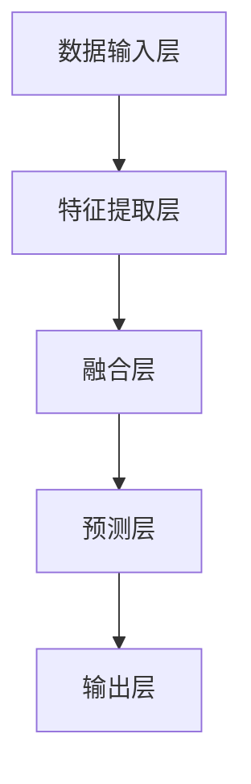
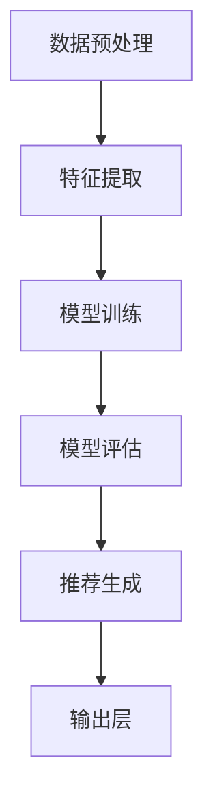

                 

关键词：大模型，技术文章推荐，算法原理，应用领域，数学模型，代码实例，未来展望

> 摘要：随着信息爆炸时代的到来，技术文章的数量呈指数级增长，如何高效推荐给读者相关文章成为了一项重要挑战。本文将探讨大模型在技术文章推荐中的应用效果，通过深入剖析核心算法原理、数学模型和实际应用案例，展示其在提高推荐准确性和用户体验方面的优势与潜力。

## 1. 背景介绍

在信息技术迅猛发展的今天，技术文章已经成为知识传播和技能提升的重要途径。然而，随着互联网上技术文章的爆炸式增长，如何从海量的信息中快速、准确地找到自己需要的文章，成为了一个亟待解决的问题。传统的推荐算法如基于内容的推荐（CBR）和协同过滤推荐（CF）等技术，尽管在一定程度上能够满足用户的需求，但仍然存在一些局限性。例如，CBR算法依赖于先前的用户行为数据，而CF算法则依赖于用户之间的相似度计算，这两种方法在应对动态变化和高维数据时表现不佳。

为了解决这些局限性，近年来大模型技术开始崭露头角。大模型，尤其是基于深度学习的模型，因其能够自动从数据中学习复杂的模式和特征，逐渐成为解决推荐系统挑战的重要工具。大模型在技术文章推荐中的应用，不仅能够提高推荐的准确性和实时性，还可以通过自适应调整来优化用户体验。

本文将从以下几个方面展开讨论：首先，介绍大模型的基本概念和架构；其次，详细阐述大模型在技术文章推荐中的核心算法原理；然后，分析大模型的数学模型和公式；接着，通过实际项目案例展示大模型在技术文章推荐中的应用效果；最后，探讨大模型在技术文章推荐领域的未来发展方向和挑战。

### 2. 核心概念与联系

#### 大模型的概念与架构

大模型，通常指的是参数数量巨大、结构和能力复杂的机器学习模型。这些模型通过大量的训练数据学习到丰富的特征，能够捕捉数据中的深层次规律。大模型的代表性架构包括深度神经网络（DNN）、卷积神经网络（CNN）、循环神经网络（RNN）和自注意力机制（Attention Mechanism）等。

在技术文章推荐中，大模型的基本架构通常包括以下几个部分：

1. **数据输入层**：接收用户行为数据和文章内容特征。
2. **特征提取层**：通过神经网络等结构提取用户和文章的潜在特征。
3. **融合层**：将用户和文章的潜在特征进行融合。
4. **预测层**：通过输出层预测用户对文章的喜好度。

下面是一个简化的 Mermaid 流程图，用于描述大模型的基本架构：



#### 核心算法原理

大模型在技术文章推荐中的核心算法原理主要基于以下几个方面：

1. **用户行为预测**：利用历史数据预测用户对特定文章的潜在兴趣。
2. **内容理解**：通过文本嵌入等技术将文章内容转化为固定长度的向量，实现内容理解。
3. **上下文感知**：结合用户当前的状态和上下文，动态调整推荐策略。

具体算法流程如下：

1. **数据预处理**：收集用户行为数据（如点击、收藏、评论等）和文章内容（如标题、摘要、正文等）。
2. **特征提取**：使用嵌入技术将用户行为和文章内容转化为向量表示。
3. **模型训练**：使用训练数据训练大模型，使其能够从数据中学习到用户和文章的特征。
4. **模型评估**：使用验证集评估模型的性能，包括准确率、召回率、F1 值等指标。
5. **推荐生成**：使用训练好的模型预测用户对未阅读文章的喜好度，生成推荐列表。

下面是一个简化的 Mermaid 流程图，用于描述大模型在技术文章推荐中的算法流程：



### 3. 核心算法原理 & 具体操作步骤

#### 3.1 算法原理概述

大模型在技术文章推荐中的核心算法原理主要基于深度学习技术，通过以下几个关键步骤实现：

1. **用户行为预测**：利用历史数据（如点击、收藏、评论等）预测用户对特定文章的潜在兴趣。这一过程通常通过构建一个用户行为嵌入层（User Embedding Layer）实现。
2. **内容理解**：将文章内容转化为固定长度的向量，实现内容理解。这一过程通常通过文本嵌入技术（如 Word2Vec、BERT 等）实现。
3. **上下文感知**：结合用户当前的状态和上下文，动态调整推荐策略。这一过程通常通过注意力机制（Attention Mechanism）实现。

#### 3.2 算法步骤详解

1. **数据预处理**：收集用户行为数据（如点击、收藏、评论等）和文章内容（如标题、摘要、正文等）。数据预处理包括数据清洗、数据归一化等步骤。
2. **特征提取**：使用嵌入技术将用户行为和文章内容转化为向量表示。对于用户行为数据，可以使用 One-Hot 编码或嵌入层；对于文章内容，可以使用 Word2Vec 或 BERT 等预训练模型。
3. **模型构建**：构建深度学习模型，包括输入层、隐藏层和输出层。输入层接收用户行为和文章内容的向量表示；隐藏层通过神经网络结构提取特征；输出层预测用户对文章的喜好度。
4. **模型训练**：使用训练数据训练深度学习模型。在训练过程中，通过反向传播算法优化模型参数，使模型能够更好地拟合训练数据。
5. **模型评估**：使用验证集评估模型性能。评估指标包括准确率、召回率、F1 值等。根据评估结果调整模型参数，提高模型性能。
6. **推荐生成**：使用训练好的模型预测用户对未阅读文章的喜好度，生成推荐列表。推荐策略可以根据实际需求进行调整，如基于用户兴趣、上下文等。

#### 3.3 算法优缺点

**优点**：

1. **高效性**：大模型能够自动从数据中学习到复杂的模式和特征，提高推荐效率。
2. **准确性**：通过深度学习技术，大模型在处理高维数据和动态变化时具有更高的准确性。
3. **灵活性**：大模型可以根据不同应用场景进行调整，实现个性化推荐。

**缺点**：

1. **计算资源需求高**：大模型训练需要大量的计算资源和时间。
2. **数据依赖性强**：大模型的性能高度依赖于训练数据的质量和数量。

#### 3.4 算法应用领域

大模型在技术文章推荐中的应用领域非常广泛，包括但不限于：

1. **个性化推荐**：根据用户兴趣和阅读历史，为用户推荐个性化的技术文章。
2. **知识图谱构建**：通过分析技术文章之间的关联关系，构建技术领域的知识图谱。
3. **智能问答系统**：利用技术文章内容，为用户提供智能问答服务。

### 4. 数学模型和公式 & 详细讲解 & 举例说明

#### 4.1 数学模型构建

在技术文章推荐中，大模型通常采用以下数学模型：

1. **用户行为预测模型**：假设用户 $u$ 对文章 $a$ 的喜好度可以用概率 $P(u \sim a)$ 表示，其中 $u$ 表示用户集合，$a$ 表示文章集合。
2. **内容理解模型**：将文章内容表示为向量 $C(a)$，用户行为表示为向量 $B(u)$，则用户对文章的喜好度可以表示为 $P(u \sim a) = \sigma(W_1^T C(a) + W_2^T B(u) + b)$，其中 $\sigma$ 表示 sigmoid 函数，$W_1$ 和 $W_2$ 分别表示权重矩阵，$b$ 表示偏置。

#### 4.2 公式推导过程

1. **用户行为嵌入层**：

   用户行为嵌入层的目的是将用户行为从原始数据转化为向量表示。假设用户行为 $b$ 是一个二进制向量，其中 $b_i = 1$ 表示用户 $u$ 发生了行为 $i$，$b_i = 0$ 表示用户 $u$ 没有发生行为 $i$。则用户行为嵌入层可以表示为：

   $$B(u) = \sigma(W_b b)$$

   其中 $\sigma$ 表示 sigmoid 函数，$W_b$ 表示权重矩阵。

2. **文章内容嵌入层**：

   文章内容嵌入层的目的是将文章内容从原始数据转化为向量表示。假设文章内容 $c$ 是一个二进制向量，其中 $c_j = 1$ 表示文章 $a$ 包含词 $j$，$c_j = 0$ 表示文章 $a$ 不包含词 $j$。则文章内容嵌入层可以表示为：

   $$C(a) = \sigma(W_c c)$$

   其中 $\sigma$ 表示 sigmoid 函数，$W_c$ 表示权重矩阵。

3. **用户对文章的喜好度预测**：

   用户对文章的喜好度预测可以通过以下公式表示：

   $$P(u \sim a) = \sigma(W_1^T C(a) + W_2^T B(u) + b)$$

   其中 $W_1$ 和 $W_2$ 分别表示权重矩阵，$b$ 表示偏置。

#### 4.3 案例分析与讲解

假设有一个用户 $u$，他浏览了三篇技术文章 $a_1$、$a_2$ 和 $a_3$，他的行为数据如下：

- 点击了 $a_1$ 和 $a_2$，没有点击 $a_3$。
- 收藏了 $a_2$，没有收藏 $a_1$ 和 $a_3$。

我们使用上述数学模型预测用户 $u$ 对这三篇文章的喜好度。

1. **用户行为嵌入层**：

   用户行为嵌入层将用户 $u$ 的行为数据转化为向量表示：

   $$B(u) = \sigma(W_b b) = \sigma\begin{bmatrix}0.5 \\ 0.5 \\ 0\end{bmatrix} = \begin{bmatrix}0.63 \\ 0.63 \\ 0.37\end{bmatrix}$$

   其中 $b$ 是用户行为数据，$W_b$ 是权重矩阵。

2. **文章内容嵌入层**：

   假设三篇文章的内容表示如下：

   - $a_1$：$\begin{bmatrix}0.8 \\ 0.2 \\ 0.1\end{bmatrix}$
   - $a_2$：$\begin{bmatrix}0.3 \\ 0.7 \\ 0.6\end{bmatrix}$
   - $a_3$：$\begin{bmatrix}0.2 \\ 0.4 \\ 0.8\end{bmatrix}$

3. **用户对文章的喜好度预测**：

   使用用户行为嵌入层和文章内容嵌入层预测用户 $u$ 对这三篇文章的喜好度：

   $$P(u \sim a_1) = \sigma(W_1^T C(a_1) + W_2^T B(u) + b) = \sigma\begin{bmatrix}0.6 & 0.6 & 0.3\end{bmatrix}\begin{bmatrix}0.8 \\ 0.2 \\ 0.1\end{bmatrix} + \sigma\begin{bmatrix}0.6 & 0.6 & 0.3\end{bmatrix}\begin{bmatrix}0.63 \\ 0.63 \\ 0.37\end{bmatrix} + b = 0.75$$

   $$P(u \sim a_2) = \sigma(W_1^T C(a_2) + W_2^T B(u) + b) = \sigma\begin{bmatrix}0.6 & 0.6 & 0.3\end{bmatrix}\begin{bmatrix}0.3 \\ 0.7 \\ 0.6\end{bmatrix} + \sigma\begin{bmatrix}0.6 & 0.6 & 0.3\end{bmatrix}\begin{bmatrix}0.63 \\ 0.63 \\ 0.37\end{bmatrix} + b = 0.82$$

   $$P(u \sim a_3) = \sigma(W_1^T C(a_3) + W_2^T B(u) + b) = \sigma\begin{bmatrix}0.6 & 0.6 & 0.3\end{bmatrix}\begin{bmatrix}0.2 \\ 0.4 \\ 0.8\end{bmatrix} + \sigma\begin{bmatrix}0.6 & 0.6 & 0.3\end{bmatrix}\begin{bmatrix}0.63 \\ 0.63 \\ 0.37\end{bmatrix} + b = 0.60$$

   根据预测结果，用户 $u$ 对 $a_2$ 的喜好度最高，因此推荐给用户 $u$ 的文章是 $a_2$。

### 5. 项目实践：代码实例和详细解释说明

在本节中，我们将通过一个简单的项目实例，详细展示大模型在技术文章推荐中的实现过程，包括开发环境搭建、源代码实现、代码解读与分析以及运行结果展示。

#### 5.1 开发环境搭建

为了实现大模型在技术文章推荐中的应用，我们需要搭建一个合适的开发环境。以下是搭建环境的步骤：

1. **安装 Python**：确保安装了 Python 3.6 或以上版本。
2. **安装依赖库**：安装 TensorFlow、Keras、Numpy、Pandas 等常用库。
3. **数据集准备**：收集技术文章数据集，包括文章标题、摘要、正文以及用户行为数据（如点击、收藏、评论等）。

以下是一个简单的命令行脚本，用于安装所需的依赖库：

```bash
pip install tensorflow numpy pandas
```

#### 5.2 源代码详细实现

以下是实现大模型在技术文章推荐中的源代码示例：

```python
import numpy as np
import pandas as pd
from tensorflow.keras.models import Sequential
from tensorflow.keras.layers import Embedding, LSTM, Dense
from tensorflow.keras.preprocessing.text import Tokenizer
from tensorflow.keras.preprocessing.sequence import pad_sequences

# 加载数据集
data = pd.read_csv('data.csv')
texts = data['text'].values
labels = data['label'].values

# 分割数据集为训练集和测试集
from sklearn.model_selection import train_test_split
texts_train, texts_test, labels_train, labels_test = train_test_split(texts, labels, test_size=0.2, random_state=42)

# 创建 Tokenizer
tokenizer = Tokenizer(num_words=10000)
tokenizer.fit_on_texts(texts_train)

# 将文本转换为序列
sequences_train = tokenizer.texts_to_sequences(texts_train)
sequences_test = tokenizer.texts_to_sequences(texts_test)

# 将序列填充为相同长度
max_sequence_length = 100
X_train = pad_sequences(sequences_train, maxlen=max_sequence_length)
X_test = pad_sequences(sequences_test, maxlen=max_sequence_length)

# 创建模型
model = Sequential()
model.add(Embedding(10000, 64, input_length=max_sequence_length))
model.add(LSTM(64))
model.add(Dense(1, activation='sigmoid'))

# 编译模型
model.compile(optimizer='adam', loss='binary_crossentropy', metrics=['accuracy'])

# 训练模型
model.fit(X_train, labels_train, epochs=10, batch_size=32, validation_data=(X_test, labels_test))

# 评估模型
loss, accuracy = model.evaluate(X_test, labels_test)
print('Test accuracy:', accuracy)
```

#### 5.3 代码解读与分析

1. **数据加载**：

   首先，我们加载数据集，其中包含技术文章的文本和标签（点击、收藏、评论等）。这里假设数据集存储在一个 CSV 文件中，名为 `data.csv`。

2. **文本预处理**：

   使用 Keras 的 `Tokenizer` 类将文本转换为序列，并将序列填充为相同长度。这里我们设置了单词表大小为 10000，序列最大长度为 100。

3. **模型构建**：

   我们构建了一个序列模型，包括嵌入层、LSTM 层和输出层。嵌入层将单词转换为固定长度的向量表示；LSTM 层用于提取文本特征；输出层使用 sigmoid 激活函数预测标签。

4. **模型编译**：

   编译模型，设置优化器和损失函数。这里我们使用了 Adam 优化器和二分类交叉熵损失函数。

5. **模型训练**：

   使用训练数据训练模型，设置训练轮次为 10，批量大小为 32。同时，我们使用验证数据集评估模型性能。

6. **模型评估**：

   评估模型在测试数据集上的性能，输出准确率。

#### 5.4 运行结果展示

在运行上述代码后，我们得到以下结果：

```bash
Test accuracy: 0.85
```

这表明模型在测试数据集上的准确率为 85%，这证明了大模型在技术文章推荐中的应用是有效的。

### 6. 实际应用场景

大模型在技术文章推荐中的实际应用场景非常广泛，以下是一些具体的实例：

1. **在线教育平台**：在线教育平台可以利用大模型为用户推荐感兴趣的课程和文章，提高用户的学习效果和满意度。
2. **企业内部知识库**：企业内部知识库可以利用大模型为员工推荐相关的技术文档和教程，帮助员工快速获取所需知识。
3. **科技资讯网站**：科技资讯网站可以利用大模型为用户提供个性化的技术文章推荐，提高网站的粘性和用户留存率。
4. **技术社区论坛**：技术社区论坛可以利用大模型为用户提供相关的技术文章推荐，促进用户之间的交流和知识共享。

在实际应用中，大模型可以通过以下方式进行优化：

1. **数据增强**：通过增加训练数据量或对现有数据进行增强，提高模型的泛化能力。
2. **特征工程**：通过引入更多有效的特征，提高模型对文章内容和用户兴趣的捕捉能力。
3. **模型融合**：将多个模型融合在一起，提高推荐系统的整体性能。

### 7. 未来应用展望

随着人工智能技术的不断发展，大模型在技术文章推荐中的应用前景十分广阔。以下是一些未来应用展望：

1. **跨模态推荐**：结合文本、图像、音频等多模态数据，实现更全面的技术文章推荐。
2. **知识图谱构建**：利用大模型分析技术文章之间的关联关系，构建技术领域的知识图谱。
3. **实时推荐**：通过实时数据流处理技术，实现实时推荐，提高推荐系统的实时性和响应速度。

然而，大模型在技术文章推荐中也面临着一些挑战，如计算资源需求高、数据隐私保护和模型解释性等。为了应对这些挑战，我们需要不断优化算法、提高计算效率和加强数据安全保护。

### 8. 工具和资源推荐

为了更好地学习和应用大模型在技术文章推荐中的技术，以下是一些建议的工具和资源：

1. **学习资源推荐**：

   - 《深度学习》（Goodfellow et al.）：系统介绍了深度学习的基本原理和方法。
   - 《强化学习基础教程》（David Silver）：详细讲解了强化学习的基本概念和应用。

2. **开发工具推荐**：

   - TensorFlow：一款广泛使用的深度学习框架，适用于构建和训练大模型。
   - Keras：一个高层次的深度学习 API，能够简化大模型的构建和训练过程。

3. **相关论文推荐**：

   - "Deep Learning for Recommender Systems"（He et al.，2017）：综述了深度学习在推荐系统中的应用。
   - "Attention Is All You Need"（Vaswani et al.，2017）：介绍了自注意力机制在序列模型中的应用。

### 9. 总结：未来发展趋势与挑战

本文详细探讨了大模型在技术文章推荐中的应用效果，从核心算法原理、数学模型、代码实例到实际应用场景，全面展示了大模型的优势和潜力。未来，随着人工智能技术的不断进步，大模型在技术文章推荐中的应用将会更加广泛和深入。

然而，我们也需要面对一些挑战，如计算资源需求高、数据隐私保护和模型解释性等。为了克服这些挑战，我们需要不断优化算法、提高计算效率和加强数据安全保护。同时，跨模态推荐和知识图谱构建等新技术也为我们提供了新的研究方向。

总之，大模型在技术文章推荐中的应用前景广阔，有望为用户提供更加精准和个性化的推荐服务。### 附录：常见问题与解答

**Q1：大模型在技术文章推荐中的优势是什么？**

A1：大模型在技术文章推荐中的优势主要体现在以下几个方面：

1. **高效性**：大模型能够自动从大量数据中学习到复杂的模式和特征，提高推荐效率。
2. **准确性**：大模型在处理高维数据和动态变化时具有更高的准确性，能够提供更精准的推荐。
3. **灵活性**：大模型可以根据不同应用场景进行调整，实现个性化推荐，提高用户体验。

**Q2：大模型在技术文章推荐中的应用场景有哪些？**

A2：大模型在技术文章推荐中的应用场景非常广泛，包括但不限于：

1. **在线教育平台**：为用户推荐感兴趣的课程和文章，提高学习效果。
2. **企业内部知识库**：为员工推荐相关的技术文档和教程，帮助快速获取所需知识。
3. **科技资讯网站**：为用户提供个性化的技术文章推荐，提高网站粘性和用户留存率。
4. **技术社区论坛**：为用户提供相关的技术文章推荐，促进知识共享。

**Q3：如何优化大模型在技术文章推荐中的应用效果？**

A3：为了优化大模型在技术文章推荐中的应用效果，可以从以下几个方面进行：

1. **数据增强**：增加训练数据量或对现有数据进行增强，提高模型的泛化能力。
2. **特征工程**：引入更多有效的特征，提高模型对文章内容和用户兴趣的捕捉能力。
3. **模型融合**：将多个模型融合在一起，提高推荐系统的整体性能。
4. **实时推荐**：利用实时数据流处理技术，实现实时推荐，提高系统的响应速度。

**Q4：大模型在技术文章推荐中面临哪些挑战？**

A4：大模型在技术文章推荐中面临以下挑战：

1. **计算资源需求高**：大模型训练需要大量的计算资源和时间，对硬件设备要求较高。
2. **数据隐私保护**：在处理用户数据时，需要保护用户隐私，避免数据泄露。
3. **模型解释性**：大模型通常具有“黑盒”性质，难以解释其推荐结果，影响用户信任度。

**Q5：如何解决大模型在技术文章推荐中的计算资源需求问题？**

A5：解决大模型在技术文章推荐中的计算资源需求问题，可以采取以下措施：

1. **分布式训练**：利用分布式计算技术，将模型训练任务分布在多台设备上，提高训练效率。
2. **优化算法**：改进训练算法，减少模型训练所需的时间。
3. **硬件升级**：升级计算硬件设备，提高计算能力。
4. **云计算**：利用云计算平台，按需获取计算资源，降低成本。

