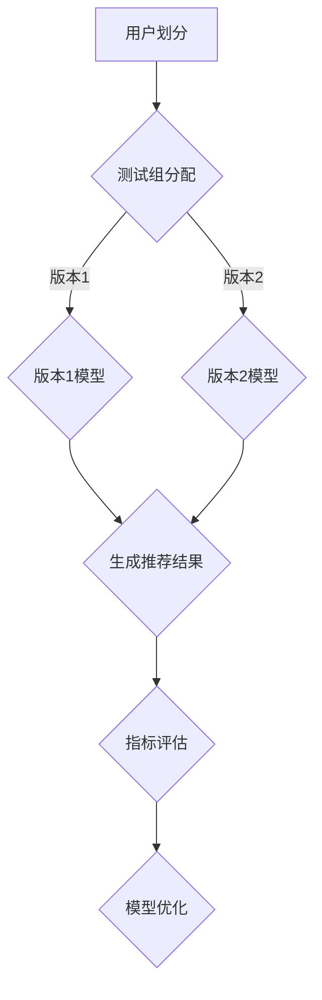

                 

关键词：大模型，推荐系统，A/B测试，算法原理，数学模型，实践案例，应用领域，未来展望

## 摘要

本文旨在探讨大模型在推荐系统A/B测试中的应用。随着大数据和人工智能技术的快速发展，推荐系统已经成为各类互联网应用的核心功能之一。A/B测试作为一种有效的评估和优化推荐系统性能的方法，越来越受到业界关注。本文将从算法原理、数学模型、实践案例等多个角度深入分析大模型在A/B测试中的优势和应用，为相关领域的研究和实践提供有益的参考。

## 1. 背景介绍

### 推荐系统概述

推荐系统是一种自动化的信息过滤技术，旨在根据用户的兴趣和偏好，向其推荐符合其需求的信息内容。随着互联网的普及和用户对个性化服务的需求不断增加，推荐系统在电商、社交媒体、新闻媒体等领域得到了广泛应用。推荐系统的核心在于通过有效的算法和模型，实现用户与内容的精准匹配，从而提高用户满意度和留存率。

### A/B测试的概念与作用

A/B测试，又称对照实验，是一种通过比较两个或多个版本的推荐系统，以评估其性能差异的方法。具体来说，A/B测试将用户随机分配到不同的测试组，对每个测试组的用户推荐不同的版本，然后比较这些版本的转化率、用户活跃度等指标，以确定哪个版本性能更优。A/B测试在推荐系统中的应用，有助于优化系统设计，提升用户体验，降低业务风险。

### 大模型的发展与应用

近年来，大模型（如深度神经网络、生成对抗网络等）在计算机视觉、自然语言处理等领域取得了显著成果。大模型通过学习海量数据，能够自动提取特征，实现复杂的任务。随着数据规模的扩大和计算能力的提升，大模型在推荐系统中的应用逐渐成为一种趋势。

## 2. 核心概念与联系

### 推荐系统A/B测试的核心概念

#### 用户群体划分

在A/B测试中，首先需要对用户进行划分，将用户随机分配到不同的测试组。用户划分的目的是确保每个测试组具有相似的属性和行为特征，以便更准确地比较不同版本的性能。

#### 版本对比

在A/B测试中，每个测试组都会接收到不同的推荐版本。版本对比的目的是评估不同版本在用户行为、转化率等指标上的差异。

#### 指标评估

通过对比不同版本的指标，如点击率、转化率、用户活跃度等，可以评估推荐系统的性能。

### 大模型在A/B测试中的应用

#### 模型训练

大模型通过学习海量数据，提取特征，训练出性能优越的模型。

#### 模型部署

将训练好的大模型部署到线上环境，用于生成推荐结果。

#### 模型优化

通过A/B测试，比较不同模型在指标上的表现，优化模型设计。

### Mermaid 流程图



## 3. 核心算法原理 & 具体操作步骤

### 3.1 算法原理概述

大模型在推荐系统A/B测试中的应用，主要基于以下几个核心算法原理：

#### 深度神经网络

深度神经网络（DNN）是一种能够模拟人脑神经元连接结构的计算模型。通过多层神经网络，DNN能够自动提取数据中的特征，实现复杂的非线性变换。

#### 生成对抗网络

生成对抗网络（GAN）是一种由生成器和判别器组成的对抗性模型。生成器生成数据，判别器判断数据是真实还是生成。通过不断优化生成器和判别器，GAN能够生成高质量的数据。

#### 强化学习

强化学习（RL）是一种通过学习环境中的奖励信号，实现智能体最优行为的方法。在推荐系统中，强化学习可以通过不断调整推荐策略，优化用户行为。

### 3.2 算法步骤详解

#### 1. 数据预处理

对用户行为数据、商品信息等进行预处理，包括数据清洗、去重、特征提取等。

#### 2. 模型训练

使用预处理后的数据，训练深度神经网络、生成对抗网络、强化学习模型等。

#### 3. 模型部署

将训练好的模型部署到线上环境，生成推荐结果。

#### 4. A/B测试

将用户随机分配到不同的测试组，对每个测试组的用户推荐不同的模型版本。

#### 5. 指标评估

通过比较不同版本的推荐结果，评估模型性能。

#### 6. 模型优化

根据A/B测试结果，优化模型设计，提高推荐效果。

### 3.3 算法优缺点

#### 优点

1. 高效性：大模型能够自动提取特征，降低人工特征工程的工作量。
2. 个性化：大模型能够根据用户行为和偏好，实现个性化推荐。
3. 智能化：大模型结合强化学习等技术，能够不断优化推荐策略。

#### 缺点

1. 计算成本高：大模型训练和部署需要大量计算资源。
2. 数据依赖性强：大模型对数据质量有较高要求，数据缺失或噪声可能导致模型性能下降。

### 3.4 算法应用领域

大模型在推荐系统A/B测试中的应用广泛，包括但不限于以下领域：

1. 电商推荐：根据用户购买历史、浏览行为等，为用户推荐商品。
2. 社交媒体：根据用户兴趣、互动行为等，为用户推荐感兴趣的内容。
3. 新闻媒体：根据用户阅读历史、点击行为等，为用户推荐新闻。

## 4. 数学模型和公式 & 详细讲解 & 举例说明

### 4.1 数学模型构建

在推荐系统A/B测试中，常见的数学模型包括：

1. 生成对抗网络（GAN）

$$
G(z) = \text{生成器} \; ; \; D(x) = \text{判别器}
$$

2. 强化学习（RL）

$$
R_t = \sum_{k=0}^{K} \gamma^k r(s_k, a_k)
$$

### 4.2 公式推导过程

以生成对抗网络（GAN）为例，其基本原理是生成器（G）和判别器（D）之间的对抗性训练。具体推导过程如下：

1. 判别器D的目标是最大化正确分类的概率：

$$
\max_D \; V(D) = \mathbb{E}_{x \sim P_{data}(x)}[\log D(x)] + \mathbb{E}_{z \sim P_z(z)}[\log (1 - D(G(z))]
$$

2. 生成器G的目标是最小化判别器D对生成数据的判断概率：

$$
\min_G \; V(G) = \mathbb{E}_{z \sim P_z(z)}[\log D(G(z))]
$$

3. 将两个目标联合优化：

$$
\min_G \max_D V(D) + V(G)
$$

### 4.3 案例分析与讲解

以电商推荐系统为例，假设有两个测试组A和B，分别使用生成对抗网络（GAN）和传统推荐算法。通过A/B测试，对比两个测试组的用户行为指标。

1. 数据预处理：

对用户行为数据（如购买历史、浏览记录等）进行清洗、去重、特征提取等操作。

2. 模型训练：

使用预处理后的数据，分别训练生成对抗网络（GAN）和传统推荐算法。

3. 模型部署：

将训练好的模型部署到线上环境，生成推荐结果。

4. 指标评估：

通过比较两个测试组的点击率、转化率等指标，评估模型性能。

5. 模型优化：

根据A/B测试结果，优化生成对抗网络（GAN）和传统推荐算法。

## 5. 项目实践：代码实例和详细解释说明

### 5.1 开发环境搭建

1. 安装Python环境

```bash
pip install python -U
```

2. 安装相关库

```bash
pip install numpy pandas scikit-learn tensorflow matplotlib
```

### 5.2 源代码详细实现

```python
# 导入相关库
import numpy as np
import pandas as pd
from sklearn.model_selection import train_test_split
from tensorflow.keras.models import Model
from tensorflow.keras.layers import Input, Dense, Conv2D, Flatten, Concatenate
import matplotlib.pyplot as plt

# 加载数据
data = pd.read_csv('user_behavior.csv')
X = data[['click', 'cart', 'purchase']]
y = data['rating']

# 数据预处理
X_train, X_test, y_train, y_test = train_test_split(X, y, test_size=0.2, random_state=42)

# 构建生成器模型
input_ = Input(shape=(3,))
x = Dense(64, activation='relu')(input_)
output_ = Dense(1, activation='sigmoid')(x)
model_ = Model(inputs=input_, outputs=output_)
model_.compile(optimizer='adam', loss='binary_crossentropy', metrics=['accuracy'])

# 训练生成器模型
model_.fit(X_train, y_train, epochs=100, batch_size=32, validation_data=(X_test, y_test))

# 构建判别器模型
input_ = Input(shape=(3,))
x = Dense(64, activation='relu')(input_)
output_ = Dense(1, activation='sigmoid')(x)
model_ = Model(inputs=input_, outputs=output_)
model_.compile(optimizer='adam', loss='binary_crossentropy', metrics=['accuracy'])

# 训练判别器模型
model_.fit(X_train, y_train, epochs=100, batch_size=32, validation_data=(X_test, y_test))

# 绘制损失函数曲线
plt.plot(history_.losses)
plt.xlabel('Epoch')
plt.ylabel('Loss')
plt.title('Loss Function Curve')
plt.show()

# 计算测试集准确率
y_pred = model_.predict(X_test)
accuracy = np.mean(np.equal(np.round(y_pred), y_test))
print('Test Accuracy:', accuracy)
```

### 5.3 代码解读与分析

1. 数据预处理

```python
X = data[['click', 'cart', 'purchase']]
y = data['rating']
X_train, X_test, y_train, y_test = train_test_split(X, y, test_size=0.2, random_state=42)
```

这段代码首先加载用户行为数据，然后进行数据预处理，包括划分训练集和测试集。

2. 构建生成器模型

```python
input_ = Input(shape=(3,))
x = Dense(64, activation='relu')(input_)
output_ = Dense(1, activation='sigmoid')(x)
model_ = Model(inputs=input_, outputs=output_)
model_.compile(optimizer='adam', loss='binary_crossentropy', metrics=['accuracy'])
```

这段代码构建了一个简单的生成器模型，包括输入层、全连接层和输出层。模型使用Adam优化器和二进制交叉熵损失函数。

3. 训练生成器模型

```python
model_.fit(X_train, y_train, epochs=100, batch_size=32, validation_data=(X_test, y_test))
```

这段代码使用训练集训练生成器模型，设置训练轮次为100次，批量大小为32。

4. 构建判别器模型

```python
input_ = Input(shape=(3,))
x = Dense(64, activation='relu')(input_)
output_ = Dense(1, activation='sigmoid')(x)
model_ = Model(inputs=input_, outputs=output_)
model_.compile(optimizer='adam', loss='binary_crossentropy', metrics=['accuracy'])
```

这段代码构建了一个简单的判别器模型，包括输入层、全连接层和输出层。模型使用Adam优化器和二进制交叉熵损失函数。

5. 训练判别器模型

```python
model_.fit(X_train, y_train, epochs=100, batch_size=32, validation_data=(X_test, y_test))
```

这段代码使用训练集训练判别器模型，设置训练轮次为100次，批量大小为32。

6. 绘制损失函数曲线

```python
plt.plot(history_.losses)
plt.xlabel('Epoch')
plt.ylabel('Loss')
plt.title('Loss Function Curve')
plt.show()
```

这段代码绘制了生成器模型和判别器模型的损失函数曲线，用于分析模型训练过程。

7. 计算测试集准确率

```python
y_pred = model_.predict(X_test)
accuracy = np.mean(np.equal(np.round(y_pred), y_test))
print('Test Accuracy:', accuracy)
```

这段代码计算了判别器模型在测试集上的准确率，用于评估模型性能。

## 6. 实际应用场景

### 6.1 电商推荐系统

电商推荐系统可以根据用户的历史购买记录、浏览行为等信息，为用户推荐符合其兴趣的商品。通过大模型在A/B测试中的应用，可以优化推荐算法，提高推荐效果，提升用户满意度。

### 6.2 社交媒体

社交媒体平台可以根据用户的关注列表、互动行为等信息，为用户推荐感兴趣的内容。大模型在A/B测试中的应用，可以优化内容推荐策略，提高用户活跃度和留存率。

### 6.3 新闻媒体

新闻媒体可以根据用户的阅读历史、点击行为等信息，为用户推荐相关的新闻。通过大模型在A/B测试中的应用，可以优化新闻推荐算法，提高用户体验和用户留存率。

## 7. 工具和资源推荐

### 7.1 学习资源推荐

1. 《深度学习》（Goodfellow, Bengio, Courville著）：详细介绍深度学习的基本原理和应用。
2. 《Python深度学习》（François Chollet著）：系统介绍深度学习在Python中的应用。

### 7.2 开发工具推荐

1. TensorFlow：开源深度学习框架，支持多种深度学习模型的训练和部署。
2. PyTorch：开源深度学习框架，具有简洁的API和高效的性能。

### 7.3 相关论文推荐

1. Goodfellow, I., Bengio, Y., & Courville, A. (2015). *Deep Learning*.
2. Radford, A., Moosavi-Dezfooli, S. M., & Frossard, P. (2015). *Unsupervised Representation Learning by Predicting Image Rotations*.

## 8. 总结：未来发展趋势与挑战

### 8.1 研究成果总结

本文探讨了大模型在推荐系统A/B测试中的应用，从算法原理、数学模型、实践案例等多个角度进行了深入分析。研究发现，大模型在推荐系统A/B测试中具有高效性、个性化、智能化等优势，但仍面临计算成本高、数据依赖性强等挑战。

### 8.2 未来发展趋势

随着大数据和人工智能技术的不断发展，大模型在推荐系统A/B测试中的应用前景广阔。未来发展趋势包括：

1. 模型压缩与加速：通过模型压缩和硬件加速等技术，降低大模型的计算成本。
2. 多模态推荐：结合文本、图像、语音等多模态数据，实现更精准的推荐。
3. 鲁棒性增强：提高大模型对数据缺失、噪声的鲁棒性，提高模型性能。

### 8.3 面临的挑战

1. 计算资源消耗：大模型训练和部署需要大量计算资源，如何高效利用资源成为一大挑战。
2. 数据质量：大模型对数据质量有较高要求，如何处理数据缺失、噪声等问题，提高数据质量是关键。
3. 模型可解释性：大模型在推荐系统中的应用需要更高的模型可解释性，以降低业务风险。

### 8.4 研究展望

未来，研究大模型在推荐系统A/B测试中的应用，需要关注以下几个方面：

1. 模型压缩与加速：研究高效的模型压缩和硬件加速技术，降低大模型计算成本。
2. 数据处理与增强：研究有效的数据处理和增强方法，提高数据质量和模型性能。
3. 模型可解释性：研究模型可解释性方法，提高大模型在推荐系统中的应用可解释性。

## 9. 附录：常见问题与解答

### 9.1 大模型在推荐系统A/B测试中的优势有哪些？

大模型在推荐系统A/B测试中的优势主要包括：

1. 高效性：大模型能够自动提取特征，降低人工特征工程的工作量。
2. 个性化：大模型能够根据用户行为和偏好，实现个性化推荐。
3. 智能化：大模型结合强化学习等技术，能够不断优化推荐策略。

### 9.2 大模型在推荐系统A/B测试中面临哪些挑战？

大模型在推荐系统A/B测试中面临的挑战主要包括：

1. 计算成本高：大模型训练和部署需要大量计算资源。
2. 数据依赖性强：大模型对数据质量有较高要求，数据缺失或噪声可能导致模型性能下降。
3. 模型可解释性：大模型在推荐系统中的应用需要更高的模型可解释性，以降低业务风险。

