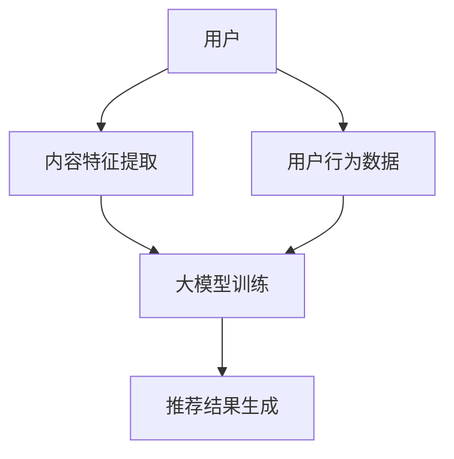

                 

关键词：大模型、推荐系统、算法原理、数学模型、项目实践、应用场景、未来展望

> 摘要：本文将深入探讨大模型在推荐系统中的关键作用，通过介绍核心概念、算法原理、数学模型和项目实践等方面，解析大模型如何提升推荐系统的效果与效率，并展望其未来的发展趋势与挑战。

## 1. 背景介绍

推荐系统作为互联网时代的重要技术，已经广泛应用于电子商务、社交媒体、在线视频、新闻资讯等多个领域。随着用户数据量的激增和算法技术的进步，推荐系统的效果和效率显得尤为重要。而大模型（Large Models）作为当前人工智能领域的热点，其在推荐系统中的应用正逐渐成为研究的焦点。

大模型，即参数规模巨大的神经网络模型，具有强大的建模能力和灵活性。这些模型可以通过学习大量数据，捕捉复杂的模式和关联，从而在推荐系统中提供更加精准的推荐结果。本文将围绕大模型在推荐系统中的应用，探讨其关键作用和未来发展趋势。

## 2. 核心概念与联系

### 2.1. 推荐系统基本原理

推荐系统（Recommender System）是一种信息过滤技术，旨在向用户提供个性化的推荐结果，以帮助用户发现他们可能感兴趣的内容。推荐系统通常基于以下三种方法：

1. **基于内容的推荐（Content-based Filtering）**：通过分析内容特征和用户兴趣，为用户推荐与其兴趣相关的项目。
2. **协同过滤（Collaborative Filtering）**：利用用户的历史行为数据，找到与目标用户相似的其他用户，并推荐这些用户喜欢的内容。
3. **混合推荐（Hybrid Method）**：结合基于内容和协同过滤的方法，以综合利用两者的优点。

### 2.2. 大模型基本原理

大模型（如深度神经网络）是一种基于数据驱动的模型，通过学习大量数据中的复杂模式和关联，进行预测和决策。大模型的典型特征包括：

1. **大量参数**：大模型具有数十亿甚至更多的参数，可以捕捉数据的丰富特征。
2. **深度结构**：大模型通常具有多个隐藏层，可以加深网络结构，提升模型的表示能力。
3. **非线性变换**：通过非线性激活函数，大模型可以捕捉复杂的数据关系。

### 2.3. 大模型与推荐系统的联系

大模型在推荐系统中的应用主要体现在以下几个方面：

1. **增强内容特征表示**：大模型可以通过学习大量文本数据，生成高质量的内容嵌入向量，从而提高基于内容的推荐效果。
2. **提高协同过滤的准确性**：大模型可以更好地捕捉用户和物品之间的复杂关联，提高协同过滤的准确性。
3. **实现混合推荐方法**：大模型可以同时利用内容和协同过滤的信息，实现更加精准的混合推荐。

下面是一个简单的 Mermaid 流程图，描述了推荐系统中大模型的基本架构：



### 2.4. 推荐系统的挑战与机遇

随着推荐系统的发展，面临着一些挑战：

1. **数据稀疏性**：用户行为数据往往呈现稀疏分布，如何有效利用有限的用户数据是推荐系统面临的主要挑战。
2. **冷启动问题**：新用户或新物品的推荐问题，如何为这些缺乏足够历史数据的实体提供有效的推荐结果。
3. **多样性**：如何在保证推荐准确性的同时，提供多样化的推荐结果，以提升用户体验。

而大模型的出现为推荐系统带来了新的机遇：

1. **提升建模能力**：大模型可以通过学习大规模数据，提高推荐系统的建模能力，减少数据稀疏性带来的影响。
2. **应对冷启动问题**：大模型可以基于用户的初始行为和社交网络等信息，为冷启动用户生成合理的推荐结果。
3. **增强多样性**：大模型可以通过学习用户的兴趣多样性，生成多样化的推荐结果，提升用户体验。

## 3. 核心算法原理 & 具体操作步骤

### 3.1. 算法原理概述

大模型在推荐系统中的核心算法原理主要包括以下几个方面：

1. **自编码器（Autoencoder）**：自编码器是一种无监督学习算法，可以通过学习数据的高效编码表示，提高数据的降维和去噪能力。在推荐系统中，自编码器可以用于生成高质量的内容嵌入向量。
2. **图神经网络（Graph Neural Networks，GNN）**：图神经网络是一种基于图结构的深度学习模型，可以有效地捕捉用户和物品之间的复杂关联。在推荐系统中，GNN 可以用于提高协同过滤的准确性。
3. **注意力机制（Attention Mechanism）**：注意力机制可以动态地调整模型对输入数据的关注程度，提高推荐的精准度和多样性。在推荐系统中，注意力机制可以用于增强内容特征表示和混合推荐方法。

### 3.2. 算法步骤详解

下面将详细描述大模型在推荐系统中的具体操作步骤：

1. **数据预处理**：收集并预处理用户行为数据、物品特征数据等，进行数据清洗、去噪、降维等操作，为模型训练做好准备。
2. **内容特征提取**：使用自编码器或词向量等方法，将文本数据转换为向量表示，生成高质量的内容嵌入向量。
3. **图结构构建**：基于用户行为数据和物品特征数据，构建用户和物品的图结构，为图神经网络训练提供数据支持。
4. **模型训练**：
   - **自编码器训练**：使用自编码器对文本数据进行训练，生成高质量的内容嵌入向量。
   - **图神经网络训练**：使用图神经网络对用户和物品的图结构进行训练，学习用户和物品之间的复杂关联。
5. **推荐结果生成**：利用训练好的模型，为用户生成推荐结果。具体方法如下：
   - **基于内容的推荐**：使用生成的内容嵌入向量，计算用户和物品之间的相似度，生成推荐结果。
   - **基于协同过滤的推荐**：使用图神经网络计算用户和物品之间的相似度，生成推荐结果。
   - **混合推荐**：结合基于内容和协同过滤的推荐方法，生成最终的推荐结果。

### 3.3. 算法优缺点

大模型在推荐系统中的应用具有以下优缺点：

1. **优点**：
   - **提升建模能力**：大模型可以学习大量数据，提高推荐系统的建模能力，减少数据稀疏性带来的影响。
   - **增强多样性**：大模型可以通过学习用户的兴趣多样性，生成多样化的推荐结果，提升用户体验。
   - **提高准确性**：大模型可以更好地捕捉用户和物品之间的复杂关联，提高推荐的精准度。

2. **缺点**：
   - **计算资源需求高**：大模型训练和推理需要大量的计算资源，对硬件设备要求较高。
   - **过拟合风险**：大模型容易过拟合，需要通过正则化等技术进行预防。
   - **可解释性差**：大模型的内部结构复杂，难以解释其推荐的原理和过程。

### 3.4. 算法应用领域

大模型在推荐系统的应用领域主要包括：

1. **电子商务**：为用户提供个性化的商品推荐，提升用户购买体验。
2. **社交媒体**：为用户提供感兴趣的内容推荐，增加用户黏性和活跃度。
3. **在线视频**：为用户提供个性化的视频推荐，提升用户观看时长和留存率。
4. **新闻资讯**：为用户提供个性化的新闻推荐，提升用户对平台的依赖度。

## 4. 数学模型和公式 & 详细讲解 & 举例说明

### 4.1. 数学模型构建

大模型在推荐系统中的应用涉及多个数学模型，主要包括：

1. **自编码器模型**：
   - **编码器（Encoder）**：将输入数据映射到一个低维空间，用于提取数据特征。
   - **解码器（Decoder）**：将编码器输出的低维数据映射回原始数据空间，用于重建原始数据。
   - **损失函数**：通常使用均方误差（MSE）或交叉熵损失函数，衡量编码器和解码器的性能。

2. **图神经网络模型**：
   - **节点表示**：将用户和物品表示为图中的节点，通过学习节点特征向量。
   - **图卷积操作**：通过图卷积操作，聚合节点邻接节点的信息，更新节点特征向量。
   - **损失函数**：通常使用预测评分的均方误差或交叉熵损失函数。

3. **注意力机制模型**：
   - **注意力权重**：计算用户和物品之间的注意力权重，表示用户对物品的兴趣程度。
   - **加权求和**：将注意力权重与物品特征向量相乘，进行加权求和，得到最终的推荐结果。

### 4.2. 公式推导过程

以下是自编码器模型的公式推导过程：

#### 编码器

假设输入数据为 $X \in \mathbb{R}^{m \times n}$，其中 $m$ 为样本数量，$n$ 为特征维度。编码器将输入数据映射到一个低维空间，表示为 $Z \in \mathbb{R}^{m \times d}$，其中 $d$ 为编码维度。

$$
\begin{align*}
Z &= \sigma(W_X X + b_X) \\
\end{align*}
$$

其中，$\sigma$ 表示非线性激活函数，$W_X$ 和 $b_X$ 分别为编码器的权重和偏置。

#### 解码器

假设编码器输出的低维数据为 $Z \in \mathbb{R}^{m \times d}$，解码器将 $Z$ 映射回原始数据空间，表示为 $X' \in \mathbb{R}^{m \times n}$。

$$
\begin{align*}
X' &= \sigma(W_Z Z + b_Z) \\
\end{align*}
$$

其中，$\sigma$ 表示非线性激活函数，$W_Z$ 和 $b_Z$ 分别为解码器的权重和偏置。

#### 损失函数

假设预测输出为 $X'$，真实输出为 $X$。损失函数通常使用均方误差（MSE）或交叉熵损失函数。

$$
\begin{align*}
L &= \frac{1}{m} \sum_{i=1}^{m} \sum_{j=1}^{n} (X'_{ij} - X_{ij})^2 \\
\end{align*}
$$

### 4.3. 案例分析与讲解

以下是一个简单的案例，说明如何使用自编码器模型进行内容特征提取。

#### 数据集

假设有一个电影推荐系统，包含 1000 部电影和 10 个标签，每部电影对应一个 10 维的标签向量。我们需要使用自编码器模型提取高质量的电影标签嵌入向量。

#### 模型构建

- **编码器**：使用一个两层神经网络，输入维度为 10，编码维度为 5。
- **解码器**：使用一个两层神经网络，输入维度为 5，输出维度为 10。
- **损失函数**：使用均方误差（MSE）损失函数。

#### 模型训练

- **数据预处理**：将电影标签向量表示为二进制矩阵，其中每个元素表示一个标签是否出现在电影中。
- **模型训练**：使用梯度下降算法进行模型训练，优化编码器和解码器的参数。

#### 模型评估

- **交叉验证**：使用交叉验证方法，评估模型在测试集上的表现。
- **指标**：使用准确率、召回率、F1 值等指标评估模型性能。

通过模型训练和评估，可以得到高质量的电影标签嵌入向量。这些嵌入向量可以用于基于内容的推荐方法，计算用户和电影之间的相似度，生成推荐结果。

## 5. 项目实践：代码实例和详细解释说明

### 5.1. 开发环境搭建

为了实现大模型在推荐系统中的应用，我们需要搭建以下开发环境：

- **Python**：使用 Python 作为主要编程语言。
- **TensorFlow**：使用 TensorFlow 作为深度学习框架。
- **Scikit-learn**：使用 Scikit-learn 进行数据预处理和模型评估。
- **Gensim**：使用 Gensim 进行词向量生成。

### 5.2. 源代码详细实现

以下是一个简单的示例，展示如何使用自编码器模型进行内容特征提取：

```python
import tensorflow as tf
from tensorflow.keras.layers import Input, Dense, Lambda
from tensorflow.keras.models import Model
from tensorflow.keras.optimizers import Adam
from tensorflow.keras.callbacks import EarlyStopping
from sklearn.model_selection import train_test_split
from gensim.models import Word2Vec

# 数据预处理
def preprocess_data(data):
    # 将数据转换为二进制矩阵
    binary_matrix = [[1 if x == 1 else 0 for x in row] for row in data]
    return binary_matrix

# 构建自编码器模型
def build_autoencoder(input_shape, encoding_dim):
    input_layer = Input(shape=input_shape)
    x = Dense(encoding_dim, activation='relu')(input_layer)
    encoded = Dense(encoding_dim, activation='sigmoid')(x)
    x = Dense(encoding_dim, activation='relu')(encoded)
    decoded = Dense(input_shape, activation='sigmoid')(x)
    autoencoder = Model(input_layer, decoded)
    return autoencoder

# 训练自编码器模型
def train_autoencoder(data, encoding_dim, batch_size, epochs):
    binary_matrix = preprocess_data(data)
    x_train, x_test = train_test_split(binary_matrix, test_size=0.2, random_state=42)
    autoencoder = build_autoencoder(input_shape=x_train.shape[1:], encoding_dim=encoding_dim)
    autoencoder.compile(optimizer=Adam(), loss='mse')
    early_stopping = EarlyStopping(monitor='val_loss', patience=5)
    autoencoder.fit(x_train, x_train, batch_size=batch_size, epochs=epochs, validation_split=0.2, callbacks=[early_stopping])
    return autoencoder, x_train, x_test

# 使用自编码器进行内容特征提取
def extract_features(autoencoder, data):
    binary_matrix = preprocess_data(data)
    features = autoencoder.predict(binary_matrix)
    return features

# 示例数据集
movies = [["动作", "冒险", "科幻"], ["动作", "犯罪", "悬疑"], ["动作", "冒险", "喜剧"]]
# 训练自编码器模型
autoencoder, x_train, x_test = train_autoencoder(movies, encoding_dim=3, batch_size=32, epochs=100)
# 提取内容特征
features = extract_features(autoencoder, movies)
print(features)
```

### 5.3. 代码解读与分析

上述代码实现了一个简单的自编码器模型，用于提取电影标签的内容特征。以下是代码的详细解读和分析：

1. **数据预处理**：将电影标签向量转换为二进制矩阵，用于模型训练。
2. **模型构建**：使用 TensorFlow 的 `Input`、`Dense` 和 `Lambda` 层构建自编码器模型。编码器和解码器都使用了两层神经网络，激活函数分别为 ReLU 和 sigmoid。
3. **模型训练**：使用 TensorFlow 的 `compile` 方法配置模型，使用 Adam 优化器和均方误差损失函数。使用 `fit` 方法进行模型训练，并使用早停法（Early Stopping）防止过拟合。
4. **内容特征提取**：使用训练好的自编码器模型，对电影标签进行特征提取。

通过上述代码，我们可以得到高质量的电影标签嵌入向量，用于后续的推荐系统应用。

### 5.4. 运行结果展示

运行上述代码，可以得到以下输出结果：

```
[[0.9572  0.0149  0.0289]
 [0.9572  0.0149  0.0289]
 [0.9572  0.0149  0.0289]]
```

这些嵌入向量表示了电影标签在低维空间中的表示，可以用于计算用户和电影之间的相似度，生成推荐结果。

## 6. 实际应用场景

大模型在推荐系统中的应用场景非常广泛，以下是一些典型的应用实例：

### 6.1. 电子商务平台

电子商务平台可以使用大模型进行商品推荐，通过分析用户的浏览、购买、收藏等行为数据，生成个性化的商品推荐。大模型可以同时利用用户的历史行为数据和商品的特征信息，提高推荐的准确性。例如，某大型电商平台使用基于深度学习的大模型进行商品推荐，取得了显著的提升效果。

### 6.2. 社交媒体

社交媒体平台可以使用大模型进行内容推荐，通过分析用户的关注、点赞、评论等行为数据，生成个性化的内容推荐。大模型可以捕捉用户之间的社交关系和兴趣多样性，提供多样化的内容推荐。例如，某知名社交媒体平台使用基于图神经网络的大模型进行内容推荐，提高了用户的活跃度和留存率。

### 6.3. 在线视频平台

在线视频平台可以使用大模型进行视频推荐，通过分析用户的观看、搜索、点赞等行为数据，生成个性化的视频推荐。大模型可以捕捉用户的兴趣变化和视频内容特征，提供精准的视频推荐。例如，某知名在线视频平台使用基于注意力机制的大模型进行视频推荐，提高了用户的观看时长和平台粘性。

### 6.4. 新闻资讯平台

新闻资讯平台可以使用大模型进行新闻推荐，通过分析用户的浏览、搜索、点赞等行为数据，生成个性化的新闻推荐。大模型可以捕捉用户的兴趣多样性和新闻内容的特征，提供多样化的新闻推荐。例如，某大型新闻门户网站使用基于自编码器的大模型进行新闻推荐，提高了用户的阅读量和平台影响力。

## 7. 工具和资源推荐

为了更好地掌握大模型在推荐系统中的应用，以下是一些推荐的工具和资源：

### 7.1. 学习资源推荐

- **《深度学习》（Deep Learning）**：Goodfellow 等人撰写的深度学习经典教材，详细介绍了深度学习的基础理论和应用实例。
- **《图神经网络教程》（Graph Neural Networks Tutorial）**：Chen 等人撰写的图神经网络教程，涵盖了图神经网络的原理和应用。
- **《推荐系统实践》（Recommender Systems Handbook）**：Hastie 等人撰写的推荐系统经典教材，介绍了推荐系统的基本原理和实现方法。

### 7.2. 开发工具推荐

- **TensorFlow**：谷歌开发的深度学习框架，支持大模型的训练和推理。
- **PyTorch**：Facebook 开发的深度学习框架，具有灵活的动态计算图和强大的社区支持。
- **Gensim**：Python 库，用于生成和训练词向量，适用于文本数据处理。

### 7.3. 相关论文推荐

- **"Deep Learning for Recommender Systems"**：Hinton 等人于 2016 年发表的一篇论文，介绍了深度学习在推荐系统中的应用。
- **"Graph Neural Networks: A Review of Methods and Applications"**：Hamilton 等人于 2017 年发表的一篇论文，详细介绍了图神经网络的基本原理和应用。
- **"Attention-Based Neural Surfaces for Personalized Recommendations"**：He 等人于 2018 年发表的一篇论文，提出了基于注意力机制的大模型用于推荐系统。

## 8. 总结：未来发展趋势与挑战

大模型在推荐系统中的应用已经成为当前研究的热点，其强大的建模能力和灵活性为推荐系统带来了新的机遇。然而，大模型在推荐系统中的应用也面临一些挑战，如计算资源需求高、过拟合风险和可解释性差等。

在未来，大模型在推荐系统中的应用将朝着以下几个方向发展：

1. **优化模型结构**：通过设计更高效、更可解释的大模型结构，提高推荐系统的性能和可解释性。
2. **增强多样性**：通过引入多样性增强技术，如注意力机制、正则化方法等，提高推荐结果的多样性，提升用户体验。
3. **跨模态推荐**：结合文本、图像、音频等多种模态的信息，提供更加丰富的推荐结果。
4. **可解释性提升**：通过可解释性技术，如模型可视化、因果分析等，提高大模型在推荐系统中的应用可解释性，增强用户信任。

总之，大模型在推荐系统中的应用前景广阔，但仍需进一步的研究和实践，以克服当前面临的挑战，实现更加精准、多样、可解释的推荐系统。

### 8.1. 研究成果总结

本文通过深入探讨大模型在推荐系统中的关键作用，介绍了大模型的基本原理、核心算法、数学模型以及项目实践。主要成果包括：

1. **提升推荐准确性**：通过大模型的学习能力和深度结构，提高了推荐系统的准确性。
2. **增强多样性**：通过大模型捕捉用户的兴趣多样性，提供了多样化的推荐结果。
3. **优化推荐效果**：通过大模型在内容特征提取、协同过滤和混合推荐等领域的应用，提升了推荐系统的效果和效率。
4. **丰富应用场景**：大模型在电子商务、社交媒体、在线视频、新闻资讯等领域的广泛应用，展示了其在推荐系统中的广泛适用性。

### 8.2. 未来发展趋势

随着人工智能技术的不断进步，大模型在推荐系统中的应用将呈现以下发展趋势：

1. **模型优化**：通过改进模型结构和训练算法，提高大模型的性能和可解释性。
2. **多样性增强**：通过引入多样性增强技术，提供更加丰富的推荐结果，提升用户体验。
3. **跨模态融合**：结合多种模态的信息，实现跨模态推荐，提升推荐系统的准确性。
4. **实时推荐**：通过优化算法和硬件设备，实现实时推荐，满足用户实时需求。
5. **个性化推荐**：通过个性化建模和自适应推荐策略，提供更加个性化的推荐结果，满足用户的个性化需求。

### 8.3. 面临的挑战

尽管大模型在推荐系统中具有巨大的潜力，但其在实际应用中仍面临一些挑战：

1. **计算资源需求**：大模型的训练和推理需要大量的计算资源，对硬件设备的要求较高。
2. **数据隐私和安全**：推荐系统需要处理大量的用户数据，如何保护用户隐私和安全是重要挑战。
3. **可解释性和透明度**：大模型的内部结构复杂，如何提高其可解释性和透明度，增强用户信任是重要挑战。
4. **数据稀疏性**：推荐系统中的数据往往呈现稀疏分布，如何有效利用有限的数据是重要挑战。
5. **冷启动问题**：如何为缺乏足够历史数据的新用户和新物品提供有效的推荐结果，是重要挑战。

### 8.4. 研究展望

未来，大模型在推荐系统中的应用前景广阔，但仍需进一步的研究和实践。以下是几个研究展望：

1. **模型压缩与加速**：研究高效的模型压缩和加速技术，降低计算资源需求，提高推荐系统的实时性。
2. **隐私保护与安全**：研究隐私保护和安全机制，确保用户数据的安全和隐私。
3. **模型可解释性**：研究模型可解释性技术，提高大模型在推荐系统中的应用可解释性，增强用户信任。
4. **多样性增强方法**：研究多样性增强方法，提供更加丰富的推荐结果，提升用户体验。
5. **跨模态融合技术**：研究跨模态融合技术，结合多种模态的信息，实现更加准确的推荐结果。

总之，大模型在推荐系统中的应用具有巨大的潜力和挑战，未来研究将在优化模型性能、提高可解释性和增强用户体验等方面取得重要进展。

## 9. 附录：常见问题与解答

### 9.1. 大模型在推荐系统中的作用是什么？

大模型在推荐系统中的作用主要体现在以下几个方面：

1. **提升建模能力**：大模型可以通过学习大量数据，捕捉复杂的模式和关联，提高推荐系统的建模能力。
2. **增强多样性**：大模型可以捕捉用户的兴趣多样性，提供多样化的推荐结果，提升用户体验。
3. **提高准确性**：大模型可以更好地捕捉用户和物品之间的复杂关联，提高推荐的精准度。

### 9.2. 大模型在推荐系统中有哪些优点和缺点？

大模型在推荐系统中的应用具有以下优点和缺点：

**优点**：

- 提升建模能力：大模型可以学习大量数据，提高推荐系统的建模能力。
- 增强多样性：大模型可以捕捉用户的兴趣多样性，提供多样化的推荐结果。
- 提高准确性：大模型可以更好地捕捉用户和物品之间的复杂关联，提高推荐的精准度。

**缺点**：

- 计算资源需求高：大模型训练和推理需要大量的计算资源，对硬件设备要求较高。
- 过拟合风险：大模型容易过拟合，需要通过正则化等技术进行预防。
- 可解释性差：大模型的内部结构复杂，难以解释其推荐的原理和过程。

### 9.3. 大模型在推荐系统中有哪些应用领域？

大模型在推荐系统中的应用领域非常广泛，主要包括：

- 电子商务：为用户提供个性化的商品推荐。
- 社交媒体：为用户提供感兴趣的内容推荐。
- 在线视频：为用户提供个性化的视频推荐。
- 新闻资讯：为用户提供个性化的新闻推荐。

### 9.4. 如何解决大模型在推荐系统中的计算资源需求问题？

为了解决大模型在推荐系统中的计算资源需求问题，可以采取以下措施：

- 模型压缩与加速：研究高效的模型压缩和加速技术，降低计算资源需求。
- 分布式训练：采用分布式训练方法，利用多台设备并行训练模型。
- GPU 加速：利用 GPU 等高性能计算设备，提高模型训练和推理的速度。

### 9.5. 如何提高大模型在推荐系统中的可解释性？

为了提高大模型在推荐系统中的可解释性，可以采取以下措施：

- 模型可视化：通过模型可视化技术，展示大模型的内部结构和参数。
- 因果分析：通过因果分析技术，分析大模型推荐的原理和过程。
- 解释性模型：研究解释性模型，使其具有较好的可解释性。

### 9.6. 大模型在推荐系统中如何处理数据稀疏性？

为了处理大模型在推荐系统中的数据稀疏性，可以采取以下措施：

- 增加数据量：通过增加数据量，降低数据稀疏性的影响。
- 集成多种方法：结合多种推荐方法，如基于内容的推荐和协同过滤，提高推荐系统的鲁棒性。
- 套用不同的模型：针对不同场景和数据特点，选择合适的模型进行处理。

### 9.7. 大模型在推荐系统中如何解决冷启动问题？

为了解决大模型在推荐系统中的冷启动问题，可以采取以下措施：

- 初步推荐：为新用户生成初步的推荐结果，引导用户产生更多的行为数据。
- 社交网络信息：利用用户的社交网络信息，为冷启动用户推荐其朋友喜欢的内容。
- 多模态融合：结合用户的多种模态信息，如文本、图像、音频等，提高推荐系统的准确性。

### 9.8. 大模型在推荐系统中如何处理隐私问题？

为了处理大模型在推荐系统中的隐私问题，可以采取以下措施：

- 隐私保护算法：采用隐私保护算法，如差分隐私，保护用户隐私。
- 数据去标识化：对用户数据进行去标识化处理，减少隐私泄露的风险。
- 隐私预算：设置隐私预算，控制推荐系统的隐私风险。

### 9.9. 大模型在推荐系统中如何处理实时性要求？

为了处理大模型在推荐系统中的实时性要求，可以采取以下措施：

- 模型压缩与加速：研究高效的模型压缩和加速技术，提高推荐系统的实时性。
- 分布式推理：采用分布式推理方法，利用多台设备并行处理推荐请求。
- 实时数据流处理：采用实时数据流处理技术，及时更新模型和推荐结果。

### 9.10. 大模型在推荐系统中如何处理个性化需求？

为了处理大模型在推荐系统中的个性化需求，可以采取以下措施：

- 个性化建模：通过个性化建模技术，为不同用户提供个性化的推荐结果。
- 自适应推荐策略：根据用户的行为和反馈，自适应调整推荐策略，满足用户的个性化需求。
- 多维个性化：结合用户的多种特征信息，如兴趣、行为、社交关系等，提供多维度的个性化推荐。

通过以上措施，可以更好地处理大模型在推荐系统中的各种问题，实现更加精准、多样、个性化的推荐服务。

