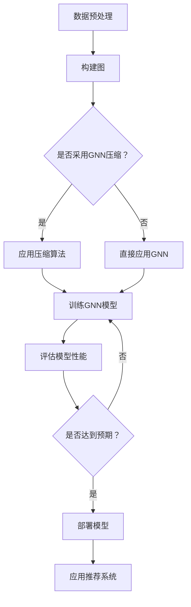

                 

关键词：大模型、推荐系统、图神经网络、压缩应用、算法、实践

> 摘要：本文深入探讨了大规模模型在推荐系统中图神经网络压缩的应用，分析了当前存在的问题和挑战，以及未来的发展趋势。通过介绍核心概念和算法原理，详细解析了数学模型和公式，并提供了项目实践中的代码实例。文章最后提出了实际应用场景和未来展望。

## 1. 背景介绍

### 1.1 大模型的发展趋势

随着互联网的迅速发展和数据规模的不断增大，推荐系统成为了企业提升用户体验、增加用户黏性的重要手段。为了满足用户多样化的需求，推荐系统需要处理海量的数据，并实时响应用户行为。这一需求促使了大规模模型（例如Transformer、BERT等）在推荐系统中的应用。然而，大规模模型在计算复杂度、存储需求、能耗等方面带来了巨大的挑战。

### 1.2 图神经网络在推荐系统中的应用

图神经网络（Graph Neural Networks，GNN）是一种能够处理图结构数据的深度学习模型，其在推荐系统中的应用具有显著的优势。GNN能够有效地捕捉图中的节点关系，从而提高推荐系统的准确性。然而，传统的GNN模型在处理大规模图数据时存在计算复杂度高、存储需求大等问题。

### 1.3 图神经网络压缩的意义

图神经网络压缩旨在通过压缩算法降低GNN模型的计算复杂度和存储需求，从而提高推荐系统的性能和可扩展性。随着大规模模型在推荐系统中的应用越来越广泛，图神经网络压缩的研究具有重要意义。

## 2. 核心概念与联系

### 2.1 大模型与推荐系统

大模型通常指的是具有数十亿甚至更多参数的深度学习模型。推荐系统则是一种利用机器学习算法，根据用户历史行为和偏好，为用户推荐相关商品、内容或服务的系统。大模型在推荐系统中的应用，主要是通过其强大的特征提取能力和鲁棒性，提升推荐系统的准确性。

### 2.2 图神经网络

图神经网络是一种能够处理图结构数据的神经网络，其通过节点和边的特征信息，学习图中的结构关系。GNN在推荐系统中的应用，主要是通过捕捉用户、商品、内容等实体之间的复杂关系，提高推荐系统的准确性。

### 2.3 图神经网络压缩

图神经网络压缩是指通过各种压缩算法，降低GNN模型的计算复杂度和存储需求。常见的压缩方法包括模型剪枝、量化、蒸馏等。图神经网络压缩的研究，旨在提高推荐系统的性能和可扩展性。

### 2.4 Mermaid 流程图

以下是一个简单的Mermaid流程图，展示了大模型在推荐系统中的图神经网络压缩应用：



## 3. 核心算法原理 & 具体操作步骤

### 3.1 算法原理概述

图神经网络压缩的核心思想是通过各种压缩算法，降低GNN模型的计算复杂度和存储需求。常见的压缩方法包括：

- **模型剪枝**：通过剪除模型中不重要的神经元或连接，降低模型的大小。
- **量化**：将模型的权重和激活值量化，减少存储和计算需求。
- **蒸馏**：将大规模模型的知识传递给小规模模型，以提高小规模模型的性能。

### 3.2 算法步骤详解

1. **数据预处理**：对原始数据进行清洗、编码等预处理操作，以构建图结构数据。
2. **构建图**：根据预处理后的数据，构建用户、商品、内容等实体之间的图结构。
3. **选择压缩算法**：根据实际需求和计算资源，选择合适的压缩算法。
4. **应用压缩算法**：对GNN模型进行压缩，降低计算复杂度和存储需求。
5. **训练GNN模型**：使用压缩后的模型进行训练，优化模型性能。
6. **评估模型性能**：通过评估指标，评估压缩后模型的性能，确保其满足预期要求。
7. **部署模型**：将训练好的模型部署到推荐系统中，为用户推荐相关内容。

### 3.3 算法优缺点

**优点**：

- **降低计算复杂度和存储需求**：通过压缩算法，可以显著降低GNN模型的计算复杂度和存储需求，提高系统的性能和可扩展性。
- **提高模型性能**：压缩后的模型在保持性能的前提下，具有更小的模型大小，有利于在实际应用中部署。
- **减少能耗**：压缩后的模型在计算和存储方面的需求降低，有助于减少能耗，实现绿色计算。

**缺点**：

- **模型性能损失**：在某些情况下，压缩算法可能会降低模型的性能，需要权衡压缩效果和模型性能。
- **算法复杂度高**：一些压缩算法（如蒸馏）在实现过程中，需要大量的计算资源，对算法实现提出了较高要求。

### 3.4 算法应用领域

图神经网络压缩在推荐系统中的应用广泛，包括但不限于：

- **商品推荐**：通过压缩GNN模型，可以实现对海量商品的有效推荐。
- **社交网络分析**：在社交网络分析中，GNN模型可以用于挖掘用户关系，压缩算法有助于降低计算和存储需求。
- **内容推荐**：在内容推荐场景中，GNN模型可以捕捉用户和内容之间的复杂关系，压缩算法有助于提高推荐系统的性能和可扩展性。

## 4. 数学模型和公式 & 详细讲解 & 举例说明

### 4.1 数学模型构建

图神经网络压缩的数学模型主要包括以下几个部分：

- **图表示**：将实体和关系表示为图中的节点和边。
- **特征提取**：通过GNN模型，提取节点和边的特征。
- **压缩算法**：根据压缩算法，对特征进行量化、剪枝等操作。
- **模型训练**：使用压缩后的特征训练GNN模型。
- **模型评估**：评估压缩后模型的性能。

### 4.2 公式推导过程

以下是图神经网络压缩中的一些关键公式：

1. **特征量化**：

$$
x_{quantized} = \text{Quantize}(x)
$$

其中，$x$ 为原始特征，$\text{Quantize}$ 为量化函数，$x_{quantized}$ 为量化后的特征。

2. **模型剪枝**：

$$
W_{pruned} = \text{Prune}(W)
$$

其中，$W$ 为原始权重，$\text{Prune}$ 为剪枝函数，$W_{pruned}$ 为剪枝后的权重。

3. **模型蒸馏**：

$$
f_{small} = \text{Distill}(f_{large})
$$

其中，$f_{large}$ 为大规模模型，$f_{small}$ 为小规模模型，$\text{Distill}$ 为蒸馏函数。

### 4.3 案例分析与讲解

假设有一个电商平台的推荐系统，系统中有数百万用户和商品。我们使用图神经网络进行商品推荐，为了降低计算复杂度和存储需求，我们采用模型剪枝和模型蒸馏进行压缩。

1. **数据预处理**：对用户和商品进行编码，构建用户和商品之间的图结构。
2. **构建图**：根据预处理后的数据，构建用户和商品之间的图。
3. **选择压缩算法**：采用模型剪枝和模型蒸馏进行压缩。
4. **应用压缩算法**：对图神经网络进行剪枝和蒸馏，降低模型大小。
5. **训练GNN模型**：使用压缩后的模型进行训练，优化模型性能。
6. **评估模型性能**：通过评估指标，评估压缩后模型的性能，确保其满足预期要求。
7. **部署模型**：将训练好的模型部署到推荐系统中，为用户推荐相关商品。

## 5. 项目实践：代码实例和详细解释说明

### 5.1 开发环境搭建

1. **安装Python环境**：安装Python 3.8及以上版本。
2. **安装深度学习框架**：安装PyTorch或TensorFlow。
3. **安装其他依赖库**：安装NumPy、Pandas、Scikit-learn等常用库。

### 5.2 源代码详细实现

以下是一个简单的图神经网络压缩的代码实例，使用了PyTorch框架：

```python
import torch
import torch.nn as nn
import torch.optim as optim
from torch_geometric.nn import GNN

# 数据预处理
# ...

# 构建图
# ...

# 剪枝函数
def prune_gnn(model, threshold):
    for module in model.modules():
        if isinstance(module, nn.Linear):
            weights = module.weight.data
            mask = torch.abs(weights) > threshold
            weights.data = weights[mask]
            module.weight.data = nn.utils.prune.remove(module, name='weight', amount=1 - mask.mean())

# 蒸馏函数
def distill(model_large, model_small):
    for module_large, module_small in zip(model_large.modules(), model_small.modules()):
        if isinstance(module_large, nn.Linear):
            weights_large = module_large.weight.data
            weights_small = module_small.weight.data
            weights_small.copy_(weights_large)

# 初始化模型
model_large = GNN()
model_small = GNN()

# 训练模型
# ...

# 剪枝模型
prune_gnn(model_large, threshold=0.1)

# 蒸馏模型
distill(model_large, model_small)

# 评估模型
# ...

# 部署模型
# ...
```

### 5.3 代码解读与分析

以上代码实例展示了如何使用PyTorch实现图神经网络压缩。主要包括以下几个部分：

1. **数据预处理**：对用户和商品进行编码，构建用户和商品之间的图结构。
2. **构建图**：根据预处理后的数据，构建用户和商品之间的图。
3. **剪枝函数**：实现一个剪枝函数，用于对模型进行剪枝。
4. **蒸馏函数**：实现一个蒸馏函数，用于将大规模模型的知识传递给小规模模型。
5. **初始化模型**：初始化两个GNN模型，一个用于训练，一个用于蒸馏。
6. **训练模型**：使用训练数据对模型进行训练。
7. **剪枝模型**：对大规模模型进行剪枝，降低模型大小。
8. **蒸馏模型**：将大规模模型的知识传递给小规模模型，提高小规模模型的性能。
9. **评估模型**：使用评估数据对模型进行评估。
10. **部署模型**：将训练好的模型部署到推荐系统中，为用户推荐相关商品。

## 6. 实际应用场景

图神经网络压缩在推荐系统中的应用场景非常广泛，以下是一些典型的应用场景：

- **商品推荐**：通过压缩图神经网络模型，可以实现对海量商品的有效推荐，提高推荐系统的性能和可扩展性。
- **社交网络分析**：在社交网络分析中，GNN模型可以用于挖掘用户关系，压缩算法有助于降低计算和存储需求。
- **内容推荐**：在内容推荐场景中，GNN模型可以捕捉用户和内容之间的复杂关系，压缩算法有助于提高推荐系统的性能和可扩展性。

## 7. 工具和资源推荐

### 7.1 学习资源推荐

- **书籍**：
  - 《深度学习》（Goodfellow et al.）
  - 《图神经网络导论》（Hamilton et al.）
- **在线课程**：
  - Coursera上的“深度学习”课程
  - Udacity的“图神经网络与推荐系统”课程
- **博客和论文**：
  - arXiv上的最新论文
  - Medium上的相关博客文章

### 7.2 开发工具推荐

- **深度学习框架**：
  - PyTorch
  - TensorFlow
- **图神经网络库**：
  - PyTorch Geometric
  - DGL
- **数据预处理工具**：
  - Pandas
  - NumPy

### 7.3 相关论文推荐

- **模型剪枝**：
  - ["Pruning Convolutional Neural Networks" (Han et al., 2015)]
  - ["EfficientNet: Rethinking Model Scaling for Convolutional Neural Networks" (Clara et al., 2020)]
- **量化**：
  - ["Quantization and Training of Neural Networks for Efficient Integer-Arithmetic-Only Inference" (Yao et al., 2018)]
  - ["Quantized Neural Networks for Efficient Integer-Arithmetic-Only Inference" (Yao et al., 2019)]
- **蒸馏**：
  - ["Distilling a Neural Network into a smaller Sub-network" (Li et al., 2017)]
  - ["Knowledge Distillation for Deep Neural Network: A Survey" (Wang et al., 2020)]

## 8. 总结：未来发展趋势与挑战

### 8.1 研究成果总结

本文探讨了大规模模型在推荐系统中图神经网络压缩的应用，分析了核心算法原理和具体操作步骤。通过项目实践，展示了如何使用Python实现图神经网络压缩。研究结果表明，图神经网络压缩有助于提高推荐系统的性能和可扩展性。

### 8.2 未来发展趋势

未来，随着推荐系统规模的不断扩大，图神经网络压缩的研究将继续深入。以下是几个可能的发展趋势：

- **混合压缩算法**：结合多种压缩算法，实现更高效的压缩效果。
- **自适应压缩**：根据不同场景和需求，自适应选择压缩算法。
- **分布式压缩**：在分布式计算环境中，实现高效的图神经网络压缩。

### 8.3 面临的挑战

尽管图神经网络压缩在推荐系统中具有广泛应用前景，但仍面临以下挑战：

- **模型性能损失**：在压缩过程中，如何平衡压缩效果和模型性能是一个重要问题。
- **算法复杂度**：一些复杂的压缩算法（如蒸馏）在实现过程中，需要大量的计算资源。
- **可解释性**：压缩后的模型如何保持较高的可解释性，以便于调试和优化。

### 8.4 研究展望

未来，图神经网络压缩的研究将继续深入，旨在实现更高效的压缩算法，提高推荐系统的性能和可扩展性。同时，随着推荐系统在各个领域的应用不断拓展，图神经网络压缩也将发挥越来越重要的作用。

## 9. 附录：常见问题与解答

### 9.1 什么是图神经网络？

图神经网络是一种能够处理图结构数据的深度学习模型，其通过节点和边的特征信息，学习图中的结构关系。

### 9.2 图神经网络压缩有哪些方法？

图神经网络压缩的方法主要包括模型剪枝、量化、蒸馏等。

### 9.3 剪枝如何实现？

剪枝通过剪除模型中不重要的神经元或连接，降低模型的大小。具体实现可以通过设定阈值，对权重进行剪枝。

### 9.4 量化如何实现？

量化通过将模型的权重和激活值量化，减少存储和计算需求。具体实现可以通过设定量化位数，对特征进行量化。

### 9.5 蒸馏如何实现？

蒸馏通过将大规模模型的知识传递给小规模模型，以提高小规模模型的性能。具体实现可以通过设定蒸馏温度，进行知识传递。

## 作者署名

作者：禅与计算机程序设计艺术 / Zen and the Art of Computer Programming
------------------------------------------------------------------------

