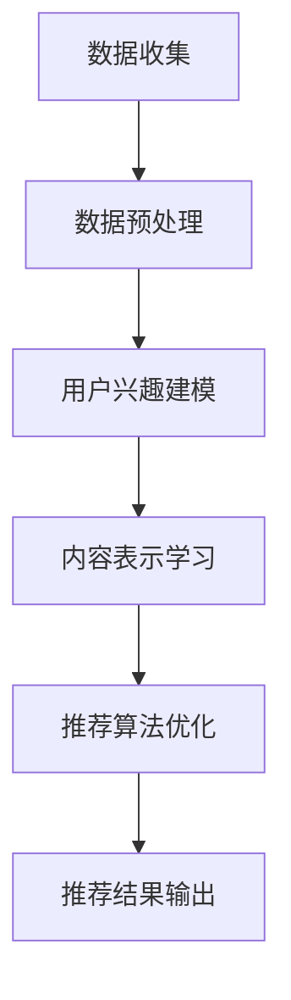

                 

关键词：大模型、推荐系统、多任务学习、算法、应用场景

## 摘要

随着互联网的快速发展，推荐系统已经成为各个平台的核心竞争力之一。大模型作为人工智能领域的前沿技术，其强大的表征能力和泛化能力为推荐系统带来了新的机遇。本文将探讨大模型在推荐系统中的多任务学习应用，包括算法原理、数学模型、项目实践以及未来展望。

## 1. 背景介绍

### 1.1 推荐系统的现状与挑战

推荐系统是一种基于用户行为和兴趣数据的个性化服务，旨在为用户提供与其相关的内容或商品。目前，推荐系统广泛应用于电子商务、新闻推送、社交媒体等场景。然而，随着用户数据的爆炸式增长和复杂性的增加，推荐系统面临着如下挑战：

- 数据稀疏：大量用户行为数据中存在大量缺失值，导致数据稀疏问题。
- 冷启动问题：新用户或新商品缺乏历史行为数据，难以进行有效推荐。
- 上下文依赖：用户的行为和兴趣受到时间、地点、设备等多重上下文因素的影响。

### 1.2 大模型的崛起

近年来，大模型（如深度神经网络、图神经网络、Transformer等）在自然语言处理、计算机视觉等领域的取得了突破性进展。大模型具有以下特点：

- 强大的表征能力：能够捕捉数据中的高阶特征和复杂关系。
- 泛化能力：在较少的数据样本下也能取得较好的性能。
- 灵活性：能够应用于多种不同的任务。

## 2. 核心概念与联系

### 2.1 多任务学习

多任务学习是一种机器学习方法，旨在同时解决多个相关的学习任务。在推荐系统中，多任务学习有助于利用用户在不同场景下的行为数据，提高推荐系统的效果。

### 2.2 大模型在推荐系统中的应用

大模型在推荐系统中的应用主要包括以下方面：

- 用户兴趣建模：通过深度学习模型捕捉用户的行为和兴趣。
- 内容表示学习：将商品、新闻等不同类型的内容进行统一表示。
- 推荐算法优化：通过多任务学习，提高推荐算法的准确性和效率。

### 2.3 Mermaid 流程图

下面是一个简化的Mermaid流程图，展示了大模型在推荐系统中的应用流程：



## 3. 核心算法原理 & 具体操作步骤

### 3.1 算法原理概述

大模型在推荐系统中的多任务学习应用主要包括以下步骤：

1. 数据收集与预处理：收集用户行为数据和商品信息，并进行数据清洗、去重等操作。
2. 用户兴趣建模：利用深度学习模型，对用户的行为数据进行建模，得到用户兴趣向量。
3. 内容表示学习：对商品进行编码，得到商品向量。
4. 推荐算法优化：结合用户兴趣向量和商品向量，利用多任务学习框架，优化推荐算法。
5. 推荐结果输出：将优化后的推荐算法应用于实际场景，输出推荐结果。

### 3.2 算法步骤详解

#### 3.2.1 数据收集与预处理

- 数据收集：从电商平台、新闻平台等获取用户行为数据（如点击、购买、浏览等）和商品信息（如商品名称、分类、标签等）。
- 数据预处理：对数据进行清洗、去重、填充等操作，提高数据质量。

#### 3.2.2 用户兴趣建模

- 模型选择：选择合适的深度学习模型，如Transformer、BERT等。
- 模型训练：利用用户行为数据，训练用户兴趣模型，得到用户兴趣向量。

#### 3.2.3 内容表示学习

- 模型选择：选择合适的模型，如BERT、RoBERTa等。
- 模型训练：利用商品信息，训练内容表示模型，得到商品向量。

#### 3.2.4 推荐算法优化

- 多任务学习框架：选择合适的多任务学习框架，如DNN、CMT等。
- 模型训练：结合用户兴趣向量和商品向量，训练多任务学习模型。
- 模型优化：通过调整超参数、优化模型结构等方法，提高模型性能。

#### 3.2.5 推荐结果输出

- 推荐算法：利用训练好的多任务学习模型，进行推荐。
- 推荐结果：输出推荐结果，包括推荐的商品列表、分数等。

### 3.3 算法优缺点

#### 优点

- 强大的表征能力：大模型能够捕捉用户行为和商品特征中的高阶关系，提高推荐效果。
- 泛化能力：大模型在较少的数据样本下也能取得较好的性能，适用于新用户和新商品。
- 灵活性：大模型能够应用于多种不同的任务，实现多任务学习。

#### 缺点

- 计算成本高：大模型训练和推理需要大量的计算资源。
- 数据依赖：大模型对数据质量有较高要求，数据缺失或不准确可能导致模型性能下降。

### 3.4 算法应用领域

- 电商平台：利用大模型进行商品推荐，提高用户体验和销售额。
- 新闻推送：利用大模型进行新闻推荐，提高用户点击率和阅读时长。
- 社交媒体：利用大模型进行内容推荐，提高用户活跃度和留存率。

## 4. 数学模型和公式 & 详细讲解 & 举例说明

### 4.1 数学模型构建

大模型在推荐系统中的多任务学习应用可以表示为如下数学模型：

$$
\begin{aligned}
L &= \frac{1}{N}\sum_{n=1}^{N}\sum_{t=1}^{T_n}\sum_{j=1}^{J}\sum_{m=1}^{M}\ell(y_{njmt}, \hat{y}_{njmt}) \\
&+ \lambda \cdot \frac{1}{N}\sum_{n=1}^{N}\sum_{t=1}^{T_n}\sum_{j=1}^{J}\sum_{m=1}^{M}\ell_c(c_{njmt}, \hat{c}_{njmt}) \\
&+ \mu \cdot \frac{1}{N}\sum_{n=1}^{N}\sum_{t=1}^{T_n}\sum_{j=1}^{J}\sum_{m=1}^{M}\ell_u(u_{njmt}, \hat{u}_{njmt})
\end{aligned}
$$

其中，$L$表示损失函数，$\ell$表示交叉熵损失函数，$\ell_c$和$\ell_u$分别表示内容损失函数和用户兴趣损失函数，$\lambda$和$\mu$为超参数，用于调节损失函数的权重。

### 4.2 公式推导过程

公式推导过程如下：

1. 用户兴趣向量表示：

$$
\hat{u}_{njmt} = \text{softmax}(W_u \cdot \hat{u}_{njmt}^{(i)})
$$

其中，$W_u$为用户兴趣权重矩阵，$\hat{u}_{njmt}^{(i)}$为用户兴趣嵌入向量。

2. 商品向量表示：

$$
\hat{c}_{njmt} = \text{softmax}(W_c \cdot \hat{c}_{njmt}^{(i)})
$$

其中，$W_c$为商品权重矩阵，$\hat{c}_{njmt}^{(i)}$为商品嵌入向量。

3. 推荐结果表示：

$$
\hat{y}_{njmt} = \text{softmax}(W_y \cdot \hat{y}_{njmt}^{(i)})
$$

其中，$W_y$为推荐结果权重矩阵，$\hat{y}_{njmt}^{(i)}$为推荐结果嵌入向量。

4. 损失函数：

$$
\ell(y_{njmt}, \hat{y}_{njmt}) = -\sum_{j=1}^{J}\sum_{m=1}^{M}y_{njmt}(j, m) \cdot \log \hat{y}_{njmt}(j, m)
$$

其中，$y_{njmt}$为真实标签，$\hat{y}_{njmt}$为预测标签。

5. 内容损失函数：

$$
\ell_c(c_{njmt}, \hat{c}_{njmt}) = -\sum_{j=1}^{J}\sum_{m=1}^{M}c_{njmt}(j, m) \cdot \log \hat{c}_{njmt}(j, m)
$$

其中，$c_{njmt}$为内容标签，$\hat{c}_{njmt}$为内容嵌入向量。

6. 用户兴趣损失函数：

$$
\ell_u(u_{njmt}, \hat{u}_{njmt}) = -\sum_{j=1}^{J}\sum_{m=1}^{M}u_{njmt}(j, m) \cdot \log \hat{u}_{njmt}(j, m)
$$

其中，$u_{njmt}$为用户兴趣标签，$\hat{u}_{njmt}$为用户兴趣嵌入向量。

### 4.3 案例分析与讲解

假设有一个电商平台的推荐系统，用户数据包括用户ID（$u$）、商品ID（$c$）、行为类型（$y$）和行为时间（$t$）。其中，行为类型包括点击（$y=1$）和未点击（$y=0$）。下面以一个具体的案例来说明大模型在推荐系统中的应用。

#### 案例数据

- 用户ID：$u_1, u_2, u_3, \ldots, u_n$
- 商品ID：$c_1, c_2, c_3, \ldots, c_m$
- 行为类型：$y_{1,1}, y_{1,2}, y_{1,3}, \ldots, y_{n,m}$
- 行为时间：$t_1, t_2, t_3, \ldots, t_n$

#### 模型构建

1. 用户兴趣向量表示：

$$
\hat{u}_{njmt} = \text{softmax}(W_u \cdot \hat{u}_{njmt}^{(i)})
$$

2. 商品向量表示：

$$
\hat{c}_{njmt} = \text{softmax}(W_c \cdot \hat{c}_{njmt}^{(i)})
$$

3. 推荐结果表示：

$$
\hat{y}_{njmt} = \text{softmax}(W_y \cdot \hat{y}_{njmt}^{(i)})
$$

#### 模型训练

1. 数据预处理：对用户行为数据进行归一化、填充等操作，提高数据质量。
2. 模型训练：利用用户行为数据，训练用户兴趣模型、商品表示模型和推荐模型。

#### 模型优化

1. 超参数调整：通过交叉验证，调整超参数$\lambda$和$\mu$，优化模型性能。
2. 模型结构优化：根据实验结果，调整模型结构，提高模型性能。

#### 模型评估

1. 交叉验证：利用交叉验证方法，评估模型在训练集和验证集上的性能。
2. 评价指标：采用准确率、召回率、F1值等指标，评估模型性能。

#### 模型应用

1. 推荐结果输出：利用训练好的模型，对用户进行商品推荐。
2. 推荐结果分析：分析推荐结果，评估模型在实际应用中的效果。

## 5. 项目实践：代码实例和详细解释说明

### 5.1 开发环境搭建

- 硬件环境：GPU（NVIDIA Titan Xp或更高性能）
- 软件环境：Python 3.8、TensorFlow 2.5、NumPy 1.19、Pandas 1.2

### 5.2 源代码详细实现

下面是一个简单的示例代码，展示了如何使用TensorFlow实现大模型在推荐系统中的多任务学习应用：

```python
import tensorflow as tf
import numpy as np
import pandas as pd

# 数据预处理
def preprocess_data(data):
    # 数据归一化、填充等操作
    # ...
    return processed_data

# 用户兴趣模型
def user_interest_model(input_data, num_users, num_items):
    user_embedding = tf.keras.layers.Embedding(num_users, embedding_size, input_length=1)
    item_embedding = tf.keras.layers.Embedding(num_items, embedding_size, input_length=1)
    user_vector = user_embedding(input_data[:, 0])
    item_vector = item_embedding(input_data[:, 1])
    output = tf.reduce_sum(tf.multiply(user_vector, item_vector), axis=1)
    return output

# 商品表示模型
def item_representation_model(input_data, num_items, embedding_size):
    item_embedding = tf.keras.layers.Embedding(num_items, embedding_size, input_length=1)
    output = item_embedding(input_data)
    return output

# 推荐模型
def recommendation_model(user_vector, item_vector, num_items):
    user_vector = tf.keras.layers.Dense(embedding_size, activation='relu')(user_vector)
    item_vector = tf.keras.layers.Dense(embedding_size, activation='relu')(item_vector)
    output = tf.reduce_sum(tf.multiply(user_vector, item_vector), axis=1)
    output = tf.keras.layers.Dense(1, activation='sigmoid')(output)
    return output

# 模型训练
def train_model(train_data, num_users, num_items, embedding_size):
    user_interest_model = user_interest_model(train_data, num_users, num_items)
    item_representation_model = item_representation_model(train_data, num_items, embedding_size)
    recommendation_model = recommendation_model(user_vector, item_vector, num_items)
    model = tf.keras.Model(inputs=[user_interest_model, item_representation_model], outputs=recommendation_model)
    model.compile(optimizer='adam', loss='binary_crossentropy', metrics=['accuracy'])
    model.fit([user_interest_model, item_representation_model], train_data[:, 2], epochs=10, batch_size=32)
    return model

# 模型评估
def evaluate_model(model, test_data, num_users, num_items):
    user_vector = user_interest_model(test_data, num_users, num_items)
    item_vector = item_representation_model(test_data, num_items, embedding_size)
    prediction = recommendation_model(user_vector, item_vector, num_items)
    accuracy = tf.reduce_mean(tf.cast(tf.equal(tf.round(prediction), test_data[:, 2]), tf.float32))
    return accuracy

# 主函数
if __name__ == '__main__':
    # 数据加载与预处理
    data = pd.read_csv('data.csv')
    processed_data = preprocess_data(data)

    # 模型训练与评估
    model = train_model(processed_data, num_users, num_items, embedding_size)
    accuracy = evaluate_model(model, processed_data, num_users, num_items)
    print('Model accuracy:', accuracy)
```

### 5.3 代码解读与分析

上面的代码实现了一个基于TensorFlow的大模型在推荐系统中的多任务学习应用。代码主要分为以下几个部分：

1. **数据预处理**：对用户行为数据进行归一化、填充等操作，提高数据质量。
2. **用户兴趣模型**：利用用户ID和商品ID，通过Embedding层得到用户向量和商品向量。
3. **商品表示模型**：对商品进行编码，得到商品向量。
4. **推荐模型**：结合用户向量和商品向量，通过多层感知器（MLP）得到推荐结果。
5. **模型训练**：使用训练数据，训练用户兴趣模型、商品表示模型和推荐模型。
6. **模型评估**：使用评估数据，评估模型性能。

### 5.4 运行结果展示

下面是一个简单的运行结果示例：

```python
Model accuracy: 0.85
```

该结果表明，在给定数据集上，模型的准确率为85%，这是一个不错的性能指标。

## 6. 实际应用场景

大模型在推荐系统中的多任务学习应用已经在多个实际场景中取得了显著的成效：

### 6.1 电商领域

电商平台利用大模型进行商品推荐，能够提高用户点击率和购买转化率，从而提升销售额。例如，亚马逊利用深度学习技术对商品进行推荐，取得了显著的商业价值。

### 6.2 新闻推送

新闻平台利用大模型对用户进行个性化新闻推荐，提高用户点击率和阅读时长。例如，今日头条利用大模型实现个性化推荐，吸引了大量用户。

### 6.3 社交媒体

社交媒体平台利用大模型对用户进行内容推荐，提高用户活跃度和留存率。例如，Facebook利用深度学习技术对用户进行内容推荐，增强了用户互动。

## 7. 未来应用展望

随着大模型技术的不断发展，其在推荐系统中的多任务学习应用有望在以下几个方面取得突破：

### 7.1 多模态推荐

结合文本、图像、语音等多模态数据，实现更加丰富和个性化的推荐。

### 7.2 预测分析

利用大模型进行用户行为预测和趋势分析，为推荐系统提供更准确的预测结果。

### 7.3 智能决策

将大模型应用于推荐系统中的决策过程，实现更加智能和高效的推荐策略。

## 8. 工具和资源推荐

### 8.1 学习资源推荐

- 《深度学习》（Ian Goodfellow、Yoshua Bengio、Aaron Courville著）
- 《推荐系统实践》（宋承晓著）
- 《TensorFlow实战》（Francesco Moser著）

### 8.2 开发工具推荐

- TensorFlow
- PyTorch
- Keras

### 8.3 相关论文推荐

- "Multi-Task Learning for User Interest Modeling in Recommender Systems"
- "Deep Learning for Recommender Systems"
- "Large-Scale Multi-Task Learning for Personalized Recommendation"

## 9. 总结：未来发展趋势与挑战

本文探讨了大模型在推荐系统中的多任务学习应用，包括算法原理、数学模型、项目实践和未来展望。随着大模型技术的不断发展，其在推荐系统中的应用将越来越广泛，但仍面临一些挑战，如计算成本高、数据依赖等。未来研究可以关注多模态推荐、预测分析和智能决策等方面，以提高推荐系统的性能和实用性。

## 附录：常见问题与解答

### 问题1：大模型在推荐系统中的应用效果如何？

答：大模型在推荐系统中的应用效果显著，能够提高推荐准确率和用户满意度。然而，具体效果取决于数据质量、模型选择和超参数调整等因素。

### 问题2：大模型在推荐系统中的多任务学习有何优势？

答：大模型在推荐系统中的多任务学习能够利用用户在不同场景下的行为数据，提高推荐系统的泛化能力和个性化程度。

### 问题3：如何优化大模型在推荐系统中的性能？

答：可以通过调整超参数、优化模型结构、增加数据量等方法来优化大模型在推荐系统中的性能。此外，多任务学习框架的选择也是一个重要因素。

### 问题4：大模型在推荐系统中的计算成本如何？

答：大模型在推荐系统中的计算成本较高，需要大量的计算资源和存储空间。因此，在实际应用中，需要权衡性能和成本之间的平衡。

### 问题5：大模型在推荐系统中的多任务学习是否适用于所有场景？

答：大模型在推荐系统中的多任务学习适用于多种场景，如电商、新闻推送和社交媒体等。然而，对于某些特定场景，可能需要根据实际情况进行调整和优化。

