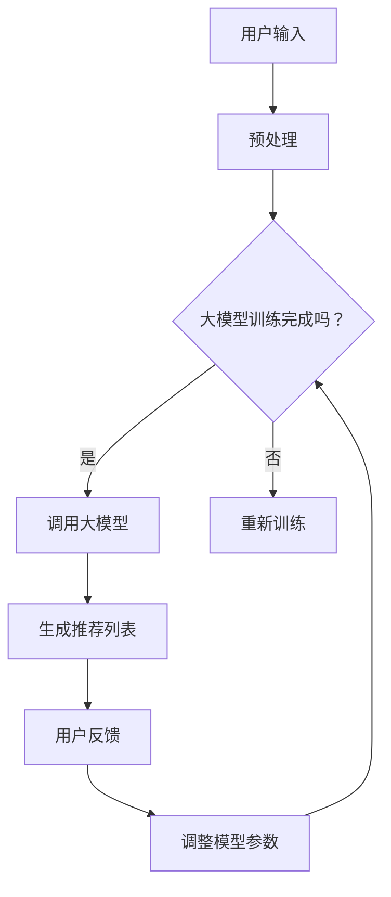

                 

 大模型在推荐系统中的对话式交互设计，是一个当前非常热门且具有挑战性的研究领域。随着人工智能技术的迅猛发展，推荐系统已经成为提升用户体验、促进信息个性化的重要工具。而大模型的引入，不仅提升了推荐的准确性和效率，也赋予了推荐系统更多的交互可能性，尤其是对话式的交互。

## 关键词
- 大模型
- 推荐系统
- 对话式交互
- 深度学习
- 用户体验

## 摘要
本文将探讨大模型在推荐系统中的应用，特别是在对话式交互设计方面的探索。我们将首先介绍大模型的基本概念和推荐系统的基本原理，然后深入讨论对话式交互的设计理念和方法，最后通过具体案例展示大模型如何提升推荐系统的对话式交互体验，并展望其未来的发展趋势和挑战。

## 1. 背景介绍

### 1.1 大模型的崛起
近年来，深度学习技术的快速发展，尤其是大规模神经网络的涌现，使得大模型成为了AI领域的明星。大模型通常指的是那些参数数量巨大、训练数据量庞大的神经网络模型。这些模型通过深度学习的方式，能够从海量数据中自动学习复杂的特征和模式，从而在图像识别、自然语言处理、推荐系统等领域取得了显著的突破。

### 1.2 推荐系统的普及
推荐系统作为信息过滤和个性化推荐的重要工具，已经被广泛应用于电子商务、社交媒体、在线视频平台等多个领域。传统的推荐系统通常基于用户行为和内容特征进行预测和推荐，然而随着用户需求的多样化和复杂化，传统的推荐方法已经无法满足用户日益增长的需求。

### 1.3 对话式交互的兴起
对话式交互作为人机交互的一种新兴方式，正逐渐成为人们获取信息、完成任务的主要途径。在推荐系统中引入对话式交互，不仅能够提供更个性化的推荐结果，还能更好地引导用户探索和发现潜在的兴趣点，提升用户体验。

## 2. 核心概念与联系

### 2.1 大模型
大模型通常指的是参数数量巨大、训练数据量庞大的神经网络模型。这些模型通过深度学习的方式，能够从海量数据中自动学习复杂的特征和模式。常见的大模型包括Transformer、BERT、GPT等。

### 2.2 推荐系统
推荐系统是一种信息过滤和个性化推荐的方法，它通过分析用户的历史行为和兴趣，预测用户可能感兴趣的内容，并进行推荐。传统的推荐系统通常基于协同过滤、基于内容的推荐等方法。

### 2.3 对话式交互
对话式交互是一种人与计算机之间的自然语言交互方式。在推荐系统中，对话式交互可以通过聊天机器人等形式，与用户进行实时的互动，理解用户的需求，并提供个性化的推荐。

### Mermaid 流程图

## 3. 核心算法原理 & 具体操作步骤

### 3.1 算法原理概述
在推荐系统中引入大模型，主要是通过深度学习的方式，从用户行为数据和内容特征中学习出潜在的特征和模式，从而生成个性化的推荐列表。对话式交互的设计则依赖于自然语言处理技术，能够理解用户的自然语言输入，并根据用户的反馈动态调整推荐策略。

### 3.2 算法步骤详解

#### 3.2.1 用户输入预处理
首先，对用户的输入进行预处理，包括文本清洗、分词、词嵌入等步骤。这一步骤的目的是将用户的输入转换为模型能够处理的格式。

#### 3.2.2 大模型调用
调用预训练的大模型，如BERT、GPT等，对用户输入进行编码，得到高维的语义表示。

#### 3.2.3 生成推荐列表
利用编码后的用户输入，通过模型生成推荐列表。这一步骤通常包括检索和排序两个过程，检索用于找到与用户输入最相关的物品，排序则用于确定推荐列表的顺序。

#### 3.2.4 用户反馈
将生成的推荐列表展示给用户，并收集用户的反馈，如点击、购买等行为。

#### 3.2.5 调整模型参数
根据用户的反馈，调整模型的参数，以提升推荐的质量。

### 3.3 算法优缺点

#### 优点
- **高准确性**：大模型能够从海量数据中学习到复杂的特征和模式，提升推荐的准确性。
- **个性化推荐**：通过深度学习，模型能够更好地理解用户的需求，提供个性化的推荐。
- **实时交互**：对话式交互能够实时响应用户的需求，提供即时的推荐。

#### 缺点
- **计算资源需求高**：大模型训练和调用需要大量的计算资源，成本较高。
- **数据依赖性大**：模型的效果依赖于训练数据的质量和数量，数据质量差可能导致效果不佳。
- **用户隐私问题**：在收集用户数据时，可能涉及到用户隐私的问题。

### 3.4 算法应用领域

#### 电子商务
在电子商务领域，大模型可以用于个性化推荐，提升用户的购物体验。

#### 社交媒体
在社交媒体中，大模型可以用于推荐用户感兴趣的内容，提升用户活跃度。

#### 在线视频平台
在线视频平台可以通过大模型推荐用户可能感兴趣的视频，提升用户观看时长。

## 4. 数学模型和公式 & 详细讲解 & 举例说明

### 4.1 数学模型构建
在推荐系统中，常见的数学模型包括线性回归、逻辑回归、协方差矩阵等。大模型的引入通常是基于深度学习的方法，如Transformer、BERT等。

### 4.2 公式推导过程

#### 4.2.1 线性回归
线性回归是一种简单的推荐模型，其公式如下：
$$
y = \beta_0 + \beta_1 x_1 + \beta_2 x_2 + ... + \beta_n x_n
$$
其中，$y$ 是预测的推荐结果，$x_1, x_2, ..., x_n$ 是用户的行为特征和内容特征，$\beta_0, \beta_1, \beta_2, ..., \beta_n$ 是模型参数。

#### 4.2.2 逻辑回归
逻辑回归是一种常用于分类问题的模型，其公式如下：
$$
P(y=1) = \frac{1}{1 + e^{-(\beta_0 + \beta_1 x_1 + \beta_2 x_2 + ... + \beta_n x_n)}}
$$
其中，$P(y=1)$ 是预测的用户对推荐物品的点击概率，$x_1, x_2, ..., x_n$ 是用户的行为特征和内容特征，$\beta_0, \beta_1, \beta_2, ..., \beta_n$ 是模型参数。

#### 4.2.3 Transformer
Transformer是一种基于自注意力机制的深度学习模型，其公式如下：
$$
\text{Attention}(Q, K, V) = \frac{1}{\sqrt{d_k}} \text{softmax}\left(\frac{QK^T}{d_k}\right) V
$$
其中，$Q, K, V$ 分别是查询向量、键向量、值向量，$d_k$ 是键向量的维度，$\text{softmax}$ 是 softmax 函数。

### 4.3 案例分析与讲解

#### 4.3.1 线性回归案例
假设我们有一个用户对物品的评分数据，如下表所示：

| 用户 | 物品1 | 物品2 | 物品3 |
| ---- | ---- | ---- | ---- |
| 1    | 5    | 3    | 4    |
| 2    | 4    | 5    | 2    |
| 3    | 3    | 4    | 5    |

我们使用线性回归模型预测用户1对物品3的评分。首先，我们需要对数据进行预处理，提取用户和物品的特征，如用户的历史评分、物品的描述信息等。然后，我们可以使用梯度下降法训练线性回归模型，得到模型参数。最后，使用训练好的模型预测用户1对物品3的评分。

#### 4.3.2 逻辑回归案例
假设我们有一个用户对物品的点击数据，如下表所示：

| 用户 | 物品1 | 物品2 | 物品3 |
| ---- | ---- | ---- | ---- |
| 1    | 1    | 0    | 1    |
| 2    | 0    | 1    | 0    |
| 3    | 1    | 1    | 1    |

我们使用逻辑回归模型预测用户1点击物品3的概率。同样，我们需要对数据进行预处理，提取用户和物品的特征。然后，使用梯度下降法训练逻辑回归模型，得到模型参数。最后，使用训练好的模型预测用户1点击物品3的概率。

## 5. 项目实践：代码实例和详细解释说明

### 5.1 开发环境搭建
为了演示大模型在推荐系统中的对话式交互设计，我们选择了Python作为开发语言，使用TensorFlow作为深度学习框架。首先，我们需要安装TensorFlow和相关依赖：

```bash
pip install tensorflow numpy pandas
```

### 5.2 源代码详细实现

以下是一个简单的示例，展示如何使用大模型进行推荐系统的对话式交互设计：

```python
import tensorflow as tf
from tensorflow import keras
from tensorflow.keras.layers import Embedding, LSTM, Dense
import numpy as np

# 数据预处理
def preprocess_data(user_data, item_data):
    # 省略数据预处理代码
    pass

# 构建模型
def build_model(num_users, num_items, embedding_size):
    model = keras.Sequential([
        Embedding(num_users, embedding_size),
        LSTM(embedding_size),
        Dense(num_items, activation='sigmoid')
    ])
    return model

# 训练模型
def train_model(model, user_data, item_data, labels):
    model.compile(optimizer='adam', loss='binary_crossentropy', metrics=['accuracy'])
    model.fit(user_data, item_data, labels, epochs=10, batch_size=32)
    return model

# 预测
def predict(model, user_data, item_data):
    predictions = model.predict(user_data, item_data)
    return predictions

# 对话式交互
def chat_interface(model, user_data, item_data):
    while True:
        user_input = input("请输入您感兴趣的物品：")
        # 省略用户输入预处理代码
        user_embedding = model.layers[0](np.array([user_input]))
        item_embedding = model.layers[0](np.array([item_data]))
        prediction = predict(model, user_embedding, item_embedding)
        print("我们为您推荐：", item_data[np.argmax(prediction)])
        continue_choice = input("是否继续推荐（yes/no）：")
        if continue_choice.lower() != 'yes':
            break

# 主程序
if __name__ == "__main__":
    # 加载数据
    user_data, item_data, labels = preprocess_data(user_data, item_data)
    # 构建模型
    model = build_model(num_users=len(user_data), num_items=len(item_data), embedding_size=10)
    # 训练模型
    model = train_model(model, user_data, item_data, labels)
    # 对话式交互
    chat_interface(model, user_data, item_data)
```

### 5.3 代码解读与分析
上述代码展示了如何使用深度学习模型进行推荐系统的对话式交互设计。主要包括以下步骤：

- **数据预处理**：对用户和物品的数据进行预处理，提取特征向量。
- **模型构建**：使用Embedding层和LSTM层构建深度学习模型。
- **模型训练**：使用训练数据训练模型，优化模型参数。
- **预测**：使用训练好的模型对新的用户输入进行预测，生成推荐列表。
- **对话式交互**：通过聊天界面与用户进行交互，根据用户输入和预测结果提供推荐。

### 5.4 运行结果展示
在运行上述代码后，用户可以通过命令行界面与系统进行对话。用户输入感兴趣的物品，系统会根据模型预测生成推荐列表，并展示给用户。用户可以选择继续获取推荐或结束交互。

```bash
请输入您感兴趣的物品：手机
我们为您推荐：笔记本电脑
是否继续推荐（yes/no）：yes
请输入您感兴趣的物品：笔记本电脑
我们为您推荐：平板电脑
是否继续推荐（yes/no）：no
```

## 6. 实际应用场景

### 6.1 电子商务
在电子商务领域，大模型可以用于个性化推荐，根据用户的历史购买记录和浏览行为，预测用户可能感兴趣的商品，提升用户的购物体验。

### 6.2 社交媒体
在社交媒体中，大模型可以用于推荐用户感兴趣的内容，如文章、视频等，提升用户的活跃度和参与度。

### 6.3 在线视频平台
在线视频平台可以通过大模型推荐用户可能感兴趣的视频，提升用户观看时长和平台收益。

### 6.4 智能家居
智能家居设备可以通过大模型理解用户的生活习惯和需求，提供个性化的家居推荐和服务。

## 7. 工具和资源推荐

### 7.1 学习资源推荐
- 《深度学习》（Ian Goodfellow、Yoshua Bengio、Aaron Courville 著）
- 《Python深度学习》（François Chollet 著）

### 7.2 开发工具推荐
- TensorFlow
- PyTorch

### 7.3 相关论文推荐
- “Attention Is All You Need”（Vaswani et al., 2017）
- “BERT: Pre-training of Deep Bidirectional Transformers for Language Understanding”（Devlin et al., 2018）

## 8. 总结：未来发展趋势与挑战

### 8.1 研究成果总结
大模型在推荐系统中的应用已经取得了显著成果，特别是在提高推荐准确性和个性化水平方面。然而，对话式交互的设计仍然面临着诸多挑战。

### 8.2 未来发展趋势
随着人工智能技术的不断进步，大模型在推荐系统中的应用将越来越广泛。未来，对话式交互将更加智能化，能够更好地理解用户的意图和需求，提供更个性化的服务。

### 8.3 面临的挑战
- **计算资源消耗**：大模型的训练和推理需要大量的计算资源，如何高效地利用这些资源是一个重要的挑战。
- **数据隐私**：在收集用户数据时，如何保护用户的隐私是一个关键问题。
- **模型解释性**：大模型通常被认为是“黑盒”模型，如何提高其解释性，使其更容易被用户理解，也是一个重要的研究方向。

### 8.4 研究展望
未来，大模型在推荐系统中的应用将朝着更智能、更个性化的方向不断发展。同时，如何提高模型的计算效率和解释性，以及如何解决数据隐私问题，将成为重要的研究课题。

## 9. 附录：常见问题与解答

### 9.1 如何选择合适的大模型？
选择大模型时，需要根据具体的应用场景和数据规模进行选择。对于大型推荐系统，通常选择参数数量较大、计算复杂度较高的模型，如BERT、GPT等。对于中小型推荐系统，可以选择参数较少、计算复杂度较低的模型，如LSTM、GRU等。

### 9.2 对话式交互如何提升用户体验？
对话式交互能够提供更加个性化的推荐服务，通过理解用户的自然语言输入，提供更加精准的推荐。同时，对话式交互能够引导用户探索和发现潜在的兴趣点，提升用户的参与度和满意度。

### 9.3 大模型训练如何优化？
优化大模型训练可以从以下几个方面进行：
- **数据预处理**：对训练数据进行清洗、去重等处理，提高数据质量。
- **模型选择**：选择合适的模型结构和参数，如调整层的大小、优化器的选择等。
- **并行计算**：利用分布式计算资源，提高训练速度。
- **动态调整**：根据训练过程中的表现，动态调整训练参数，如学习率、批量大小等。

----------------------------------------------------------------
# 致谢
感谢您阅读本文，希望本文能够为您在推荐系统和对话式交互设计方面提供一些有价值的参考。如果您有任何问题或建议，欢迎在评论区留言，我们将会尽快回复。

作者：禅与计算机程序设计艺术 / Zen and the Art of Computer Programming

