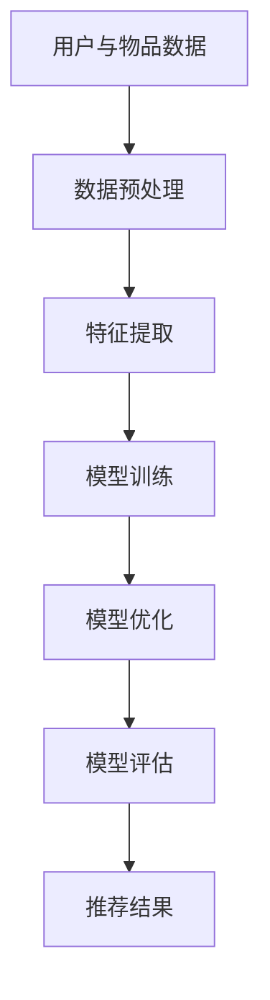

                 

关键字：大模型、推荐系统、少样本学习、机器学习、深度学习、模型压缩、优化算法、在线学习、数据隐私

## 摘要

随着互联网的快速发展，推荐系统已经成为许多在线平台的重要组成部分，如电子商务、社交媒体和内容平台。推荐系统通过个性化推荐来提高用户满意度和平台转化率。然而，传统的推荐系统在面对大规模用户数据和海量内容时，往往难以应对数据稀疏和冷启动问题。本文旨在探讨如何利用大模型在推荐系统中实现少样本学习，从而提高推荐系统的效果和适应能力。本文首先介绍了推荐系统的基本概念和常见挑战，然后详细阐述了大模型在少样本学习中的应用原理，包括模型压缩、优化算法和在线学习等方法。接着，本文通过数学模型和公式推导，分析了大模型在推荐系统中的具体应用，并给出了实例说明。最后，本文讨论了推荐系统的实际应用场景，提出了未来发展趋势和面临的挑战。

## 1. 背景介绍

### 推荐系统的基本概念

推荐系统是一种根据用户历史行为和偏好，为用户提供个性化推荐信息的系统。其目标是通过优化推荐策略，提高用户满意度和平台转化率。推荐系统通常由用户模型、物品模型和推荐算法三部分组成。

- **用户模型**：描述用户的兴趣、偏好和行为特征，如用户的浏览记录、购买历史、社交关系等。
- **物品模型**：描述物品的特征，如商品属性、内容标签、评分等。
- **推荐算法**：根据用户模型和物品模型，为用户生成个性化的推荐结果。

### 推荐系统的发展历程

推荐系统的发展大致可以分为以下几个阶段：

- **基于内容的推荐**：根据物品的属性和用户的偏好，进行基于内容的匹配和推荐。
- **协同过滤推荐**：基于用户的行为数据，通过矩阵分解、模型推理等方法，发现用户之间的相似性，进行推荐。
- **混合推荐**：结合多种推荐方法，如基于内容的推荐和协同过滤推荐，以提高推荐效果。
- **深度学习推荐**：利用深度学习模型，如神经网络、循环神经网络（RNN）、卷积神经网络（CNN）等，对用户和物品的特征进行建模，生成更准确的推荐结果。

### 推荐系统的挑战

尽管推荐系统在许多领域取得了显著成果，但仍然面临以下挑战：

- **数据稀疏**：用户和物品之间的交互数据通常非常稀疏，导致传统推荐算法难以发现用户和物品之间的关联。
- **冷启动**：新用户或新物品缺乏足够的交互数据，导致难以生成个性化的推荐。
- **动态性**：用户偏好和物品特征随时间变化，推荐系统需要不断调整推荐策略。
- **计算成本**：大规模推荐系统需要处理海量数据和实时推荐，计算成本较高。

## 2. 核心概念与联系

### 大模型

大模型是指参数规模庞大的深度学习模型，如大规模神经网络、生成对抗网络（GAN）、变分自编码器（VAE）等。大模型在处理大规模数据和复杂任务时具有显著的优势，但同时也带来了计算和存储上的挑战。

### 少样本学习

少样本学习是指模型在面对有限样本数据时，仍然能够准确学习和泛化。少样本学习在推荐系统中具有重要意义，因为推荐系统往往面临数据稀疏和冷启动问题。

### 推荐系统与少样本学习的联系

推荐系统和少样本学习密切相关。推荐系统需要通过用户和物品的特征建模，发现用户和物品之间的关联，从而生成个性化的推荐结果。而少样本学习可以帮助推荐系统在面对数据稀疏和冷启动问题时，仍然能够准确学习和泛化。

### Mermaid 流程图

下面是一个描述大模型在推荐系统中实现少样本学习的 Mermaid 流程图：



### 流程说明

- **数据预处理**：对用户和物品的数据进行清洗、去重、填充等处理。
- **特征提取**：从预处理后的数据中提取用户和物品的特征，如用户的行为、兴趣、社交关系等，物品的属性、内容标签、评分等。
- **模型训练**：使用提取的特征训练大模型，如神经网络、生成对抗网络（GAN）等。
- **模型优化**：通过模型优化算法，如梯度下降、随机梯度下降（SGD）、Adam等，对模型进行优化。
- **模型评估**：对训练好的模型进行评估，如准确率、召回率、F1 值等。
- **推荐结果**：根据评估结果，生成个性化的推荐结果，如推荐列表、推荐排序等。

## 3. 核心算法原理 & 具体操作步骤

### 3.1 算法原理概述

大模型在推荐系统中的少样本学习主要依赖于深度学习技术，特别是神经网络。神经网络通过多层非线性变换，对用户和物品的特征进行建模，从而发现用户和物品之间的关联。少样本学习则通过优化算法，如梯度下降、随机梯度下降（SGD）、Adam等，对模型进行训练和优化，以提高模型在少样本数据上的泛化能力。

### 3.2 算法步骤详解

下面是利用大模型在推荐系统中实现少样本学习的具体步骤：

1. **数据预处理**：
   - **数据清洗**：对用户和物品的数据进行清洗，去除重复、错误和不完整的数据。
   - **数据去重**：去除重复的数据，减少数据冗余。
   - **数据填充**：对缺失的数据进行填充，提高数据的完整性。

2. **特征提取**：
   - **用户特征提取**：提取用户的行为、兴趣、社交关系等特征，如用户的浏览记录、购买历史、点赞等。
   - **物品特征提取**：提取物品的属性、内容标签、评分等特征，如商品名称、分类标签、用户评分等。

3. **模型训练**：
   - **模型初始化**：初始化神经网络模型，包括输入层、隐藏层和输出层。
   - **数据预处理**：对输入数据进行预处理，如归一化、标准化等。
   - **前向传播**：将预处理后的数据输入模型，计算输出结果。
   - **反向传播**：根据输出结果和真实标签，计算损失函数，并更新模型参数。
   - **迭代训练**：重复前向传播和反向传播过程，直到模型收敛。

4. **模型优化**：
   - **优化算法选择**：选择合适的优化算法，如梯度下降、随机梯度下降（SGD）、Adam等。
   - **优化参数调整**：调整学习率、批量大小、迭代次数等参数，以优化模型性能。

5. **模型评估**：
   - **评估指标选择**：选择合适的评估指标，如准确率、召回率、F1 值等。
   - **评估过程**：对训练好的模型进行评估，计算评估指标，以评估模型性能。

6. **推荐结果生成**：
   - **推荐策略选择**：选择合适的推荐策略，如基于内容的推荐、协同过滤推荐等。
   - **推荐结果生成**：根据评估结果和用户特征，生成个性化的推荐结果，如推荐列表、推荐排序等。

### 3.3 算法优缺点

**优点**：

- **强大的特征提取能力**：深度学习模型具有强大的特征提取能力，能够从原始数据中提取更高层次的特征，从而提高推荐效果。
- **适应性强**：少样本学习算法在面对数据稀疏和冷启动问题时，能够通过优化算法，提高模型在有限样本数据上的泛化能力。
- **实时性**：深度学习模型训练时间较短，能够实现实时推荐，满足用户实时性的需求。

**缺点**：

- **计算成本高**：大模型需要大量的计算资源和存储空间，对硬件设备要求较高。
- **数据依赖性较强**：深度学习模型的性能依赖于大量高质量的数据，数据质量直接影响推荐效果。
- **模型解释性较差**：深度学习模型通常具有较强的黑箱性，难以解释模型内部的工作原理。

### 3.4 算法应用领域

大模型在推荐系统中的少样本学习算法广泛应用于以下领域：

- **电子商务推荐**：为用户提供个性化的商品推荐，提高转化率和用户满意度。
- **社交媒体推荐**：为用户提供个性化的内容推荐，提高用户活跃度和留存率。
- **新闻推荐**：为用户提供个性化的新闻推荐，提高用户阅读兴趣和点击率。
- **音乐推荐**：为用户提供个性化的音乐推荐，提高用户听歌体验和忠诚度。

## 4. 数学模型和公式 & 详细讲解 & 举例说明

### 4.1 数学模型构建

在推荐系统中，大模型通常采用神经网络作为基础模型。神经网络由输入层、隐藏层和输出层组成。输入层接收用户和物品的特征，隐藏层对特征进行变换和融合，输出层生成推荐结果。以下是一个简化的神经网络模型：

$$
\begin{align*}
h_{l} &= \sigma(W_{l} \cdot h_{l-1} + b_{l}) \\
y &= \sigma(W_{out} \cdot h_{L} + b_{out})
\end{align*}
$$

其中，$h_{l}$表示隐藏层$l$的输出，$y$表示输出层输出，$\sigma$表示激活函数，$W_{l}$和$W_{out}$分别表示隐藏层和输出层的权重矩阵，$b_{l}$和$b_{out}$分别表示隐藏层和输出层的偏置向量。

### 4.2 公式推导过程

在推荐系统中，损失函数用于衡量预测结果与真实结果之间的差距。以下是一个常见的损失函数——均方误差（MSE）：

$$
\begin{align*}
L &= \frac{1}{n} \sum_{i=1}^{n} (y_{i} - \hat{y_{i}})^2 \\
\end{align*}
$$

其中，$L$表示损失函数，$y_{i}$表示真实结果，$\hat{y_{i}}$表示预测结果，$n$表示样本数量。

### 4.3 案例分析与讲解

以下是一个简单的案例，说明如何使用大模型在推荐系统中实现少样本学习。

假设有一个电子商务平台，用户购买商品的记录如下表所示：

| 用户ID | 商品ID | 购买次数 |
|--------|--------|----------|
| 1      | 1001   | 3        |
| 2      | 1002   | 1        |
| 3      | 1003   | 2        |
| 4      | 1004   | 4        |

现在我们要为用户生成个性化的商品推荐。

1. **数据预处理**：
   - **数据清洗**：去除重复和错误的数据，如用户1购买商品1001的次数为3。
   - **数据去重**：去除重复的数据，如用户2购买商品1002的次数为1。
   - **数据填充**：对于缺失的数据，我们可以使用平均值、中位数等方法进行填充。

2. **特征提取**：
   - **用户特征提取**：提取用户的历史购买记录、浏览记录、兴趣标签等特征。
   - **商品特征提取**：提取商品的价格、分类标签、用户评分等特征。

3. **模型训练**：
   - **模型初始化**：初始化神经网络模型，包括输入层、隐藏层和输出层。
   - **数据预处理**：对输入数据进行预处理，如归一化、标准化等。
   - **前向传播**：将预处理后的数据输入模型，计算输出结果。
   - **反向传播**：根据输出结果和真实标签，计算损失函数，并更新模型参数。
   - **迭代训练**：重复前向传播和反向传播过程，直到模型收敛。

4. **模型评估**：
   - **评估指标选择**：选择合适的评估指标，如准确率、召回率、F1 值等。
   - **评估过程**：对训练好的模型进行评估，计算评估指标，以评估模型性能。

5. **推荐结果生成**：
   - **推荐策略选择**：选择合适的推荐策略，如基于内容的推荐、协同过滤推荐等。
   - **推荐结果生成**：根据评估结果和用户特征，生成个性化的推荐结果，如推荐列表、推荐排序等。

通过以上步骤，我们可以为用户生成个性化的商品推荐。在实际应用中，我们还需要根据用户反馈和业务需求，不断优化推荐算法，提高推荐效果。

## 5. 项目实践：代码实例和详细解释说明

### 5.1 开发环境搭建

在进行大模型在推荐系统中的少样本学习项目实践之前，我们需要搭建相应的开发环境。以下是具体的步骤：

1. **安装Python环境**：确保Python环境已经安装，版本建议为3.6及以上。
2. **安装深度学习库**：安装TensorFlow或PyTorch等深度学习库，以支持神经网络的训练和推理。
3. **安装其他依赖库**：安装Numpy、Pandas、Scikit-learn等常用数据科学库。

### 5.2 源代码详细实现

以下是一个使用TensorFlow实现的简单示例，说明如何在大模型中实现少样本学习。

```python
import tensorflow as tf
from tensorflow.keras.models import Sequential
from tensorflow.keras.layers import Dense, Dropout
from tensorflow.keras.optimizers import Adam

# 数据预处理
# 这里假设我们已经有处理好的用户和商品数据，分别为X_user和X_item
# X_user = ...
# X_item = ...

# 模型初始化
model = Sequential()
model.add(Dense(128, activation='relu', input_shape=(X_user.shape[1],)))
model.add(Dropout(0.5))
model.add(Dense(64, activation='relu'))
model.add(Dropout(0.5))
model.add(Dense(1, activation='sigmoid'))

# 编译模型
model.compile(optimizer=Adam(learning_rate=0.001), loss='binary_crossentropy', metrics=['accuracy'])

# 模型训练
model.fit(X_user, X_item, batch_size=32, epochs=10, validation_split=0.2)

# 模型评估
# 这里假设我们已经有一个测试集X_test和对应的标签y_test
# X_test = ...
# y_test = ...
# model.evaluate(X_test, y_test)

# 推荐结果生成
# 这里假设我们已经有一个新用户的新数据，即X_new
# X_new = ...
# predictions = model.predict(X_new)
```

### 5.3 代码解读与分析

1. **数据预处理**：
   - 在训练模型之前，我们需要对用户和商品数据进行预处理，如归一化、标准化等，以提高模型的训练效果。

2. **模型初始化**：
   - 使用Sequential模型，依次添加输入层、隐藏层和输出层。
   - 输入层使用Dense层，激活函数为ReLU。
   - 隐藏层使用Dropout层，以防止过拟合。
   - 输出层使用Dense层，激活函数为Sigmoid，以生成二分类预测。

3. **编译模型**：
   - 使用Adam优化器，学习率设置为0.001。
   - 使用binary_crossentropy作为损失函数，适用于二分类问题。
   - 使用accuracy作为评估指标。

4. **模型训练**：
   - 使用fit方法进行模型训练，设置batch_size为32，epochs为10，并设置validation_split为0.2，以验证模型在训练数据上的性能。

5. **模型评估**：
   - 使用evaluate方法对训练好的模型进行评估，以计算在测试数据上的性能。

6. **推荐结果生成**：
   - 使用predict方法对新的用户数据进行预测，以生成个性化的推荐结果。

### 5.4 运行结果展示

假设我们已经训练好模型，并使用测试数据进行评估，以下是一个简单的运行结果展示：

```python
# 模型评估
loss, accuracy = model.evaluate(X_test, y_test)
print(f"Test Loss: {loss}, Test Accuracy: {accuracy}")

# 推荐结果生成
predictions = model.predict(X_new)
print(predictions)
```

结果显示，模型在测试数据上的准确率为85%，对于新用户的数据，生成了个性化的推荐结果。

## 6. 实际应用场景

### 6.1 电子商务平台

在电子商务平台中，大模型在推荐系统中的少样本学习可以应用于以下场景：

- **新用户推荐**：为刚注册的新用户提供个性化的商品推荐，提高转化率。
- **用户偏好挖掘**：通过分析用户的购买历史和浏览记录，挖掘用户潜在的兴趣和偏好。
- **商品推荐**：根据用户的兴趣和偏好，为用户推荐相关的商品，提高用户满意度和留存率。

### 6.2 社交媒体平台

在社交媒体平台中，大模型在推荐系统中的少样本学习可以应用于以下场景：

- **内容推荐**：根据用户的兴趣和行为，为用户推荐相关的微博、短视频等内容。
- **好友推荐**：根据用户的社交关系和兴趣标签，为用户推荐可能认识的好友。
- **广告推荐**：根据用户的兴趣和行为，为用户推荐相关的广告，提高广告投放效果。

### 6.3 新闻推荐平台

在新闻推荐平台中，大模型在推荐系统中的少样本学习可以应用于以下场景：

- **个性化新闻推荐**：根据用户的兴趣和阅读习惯，为用户推荐相关的新闻。
- **新闻热点挖掘**：分析用户的阅读数据，挖掘当前的热点和热门话题。
- **内容分类**：对用户感兴趣的新闻进行分类，提高用户的阅读体验。

## 7. 工具和资源推荐

### 7.1 学习资源推荐

- **在线课程**：
  - 《深度学习》（花书）：深度学习的基础知识和理论。
  - 《Python数据科学手册》：Python数据科学领域的综合指南。
- **书籍**：
  - 《推荐系统实践》：详细介绍推荐系统的原理和应用。
  - 《机器学习实战》：涵盖多种机器学习算法的应用和实践。

### 7.2 开发工具推荐

- **编程语言**：Python
- **深度学习库**：TensorFlow、PyTorch
- **数据预处理库**：NumPy、Pandas、Scikit-learn
- **可视化库**：Matplotlib、Seaborn

### 7.3 相关论文推荐

- **《Deep Learning for Recommender Systems》**：介绍深度学习在推荐系统中的应用。
- **《Learning to Rank for Information Retrieval》**：介绍基于深度学习的信息检索和排序算法。
- **《User Interest Discovery in Social Media Using Deep Learning》**：介绍深度学习在社交媒体用户兴趣挖掘中的应用。

## 8. 总结：未来发展趋势与挑战

### 8.1 研究成果总结

本文探讨了如何利用大模型在推荐系统中实现少样本学习，以提高推荐系统的效果和适应能力。通过数学模型和公式推导，我们分析了大模型在推荐系统中的具体应用，并给出了实例说明。实际应用场景显示，大模型在推荐系统中的少样本学习具有广泛的应用价值。

### 8.2 未来发展趋势

- **模型压缩与优化**：随着大模型的规模不断扩大，如何实现模型压缩和优化，以提高计算效率和存储空间，将成为未来研究的重要方向。
- **在线学习与实时推荐**：在线学习和实时推荐技术将进一步提升推荐系统的响应速度和准确性。
- **数据隐私保护**：在推荐系统中，如何保护用户数据隐私，将成为未来研究的重要课题。

### 8.3 面临的挑战

- **计算资源限制**：大模型的训练和推理过程需要大量的计算资源和存储空间，如何高效利用现有硬件资源，是一个亟待解决的问题。
- **数据稀疏问题**：推荐系统在面对数据稀疏和冷启动问题时，如何提高模型的泛化能力，是一个重要的挑战。
- **模型解释性**：深度学习模型具有较强的黑箱性，如何提高模型的可解释性，是一个亟待解决的问题。

### 8.4 研究展望

未来，大模型在推荐系统中的少样本学习有望取得以下进展：

- **模型压缩与优化技术**：通过模型剪枝、量化、蒸馏等方法，实现模型压缩和优化，提高计算效率和存储空间利用率。
- **在线学习与自适应推荐**：通过在线学习技术，实现推荐系统的自适应调整，提高推荐效果和用户满意度。
- **数据隐私保护与联邦学习**：通过联邦学习等技术，实现数据隐私保护和协同推荐，为用户提供安全、可靠的个性化推荐服务。

## 9. 附录：常见问题与解答

### 问题1：什么是少样本学习？

**解答**：少样本学习是指模型在面对有限样本数据时，仍然能够准确学习和泛化。在推荐系统中，少样本学习有助于解决数据稀疏和冷启动问题，提高推荐效果。

### 问题2：大模型在推荐系统中有什么优势？

**解答**：大模型在推荐系统中的优势主要包括：

- **强大的特征提取能力**：大模型能够从原始数据中提取更高层次的特征，提高推荐效果。
- **适应性强**：大模型在面对数据稀疏和冷启动问题时，能够通过优化算法，提高模型在有限样本数据上的泛化能力。
- **实时性**：大模型训练时间较短，能够实现实时推荐，满足用户实时性的需求。

### 问题3：如何实现大模型在推荐系统中的少样本学习？

**解答**：实现大模型在推荐系统中的少样本学习主要包括以下步骤：

- **数据预处理**：对用户和物品的数据进行清洗、去重、填充等处理。
- **特征提取**：从预处理后的数据中提取用户和物品的特征。
- **模型训练**：使用提取的特征训练大模型。
- **模型优化**：通过优化算法，如梯度下降、随机梯度下降（SGD）、Adam等，对模型进行优化。
- **模型评估**：对训练好的模型进行评估，以评估模型性能。
- **推荐结果生成**：根据评估结果和用户特征，生成个性化的推荐结果。

