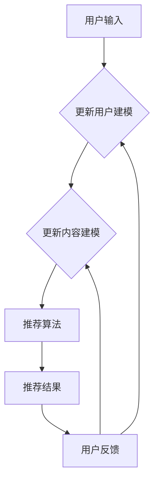

                 

关键字：大模型、推荐系统、交互式推荐、算法原理、数学模型、项目实践、未来展望

> 摘要：本文将探讨大模型在推荐系统交互式推荐中的应用，通过深入分析核心概念与联系，算法原理与步骤，数学模型与公式，以及项目实践与运行结果，为读者提供一幅全面的技术画卷。本文旨在揭示大模型在推荐系统交互式推荐中的巨大潜力，以及其面临的挑战与未来发展的方向。

## 1. 背景介绍

随着互联网的普及和信息量的爆炸式增长，推荐系统已经成为现代信息检索领域的一个重要研究方向。推荐系统通过分析用户的兴趣和行为，为用户推荐其可能感兴趣的内容，从而提高用户满意度和系统的价值。传统的推荐系统主要依赖于基于内容的推荐和协同过滤等技术，然而这些方法在处理复杂和动态的推荐任务时存在一定的局限性。

近年来，深度学习和自然语言处理技术的发展，为大模型在推荐系统中的应用提供了新的契机。大模型，如变换器（Transformer）架构的预训练模型，具备强大的表示和学习能力，能够处理复杂的特征和语义信息。因此，大模型在推荐系统中的交互式推荐应用受到了广泛关注。本文将深入探讨大模型在交互式推荐中的技术原理、应用场景和未来展望。

## 2. 核心概念与联系

为了更好地理解大模型在推荐系统交互式推荐中的应用，我们需要先了解以下几个核心概念：

### 2.1 大模型

大模型是指拥有巨大参数规模和复杂结构的深度学习模型，如Transformer架构的预训练模型。这些模型通过在大量数据上进行预训练，能够学习到丰富的语义和结构化信息，从而在各类任务中表现出色。

### 2.2 推荐系统

推荐系统是一种信息过滤和检索技术，旨在为用户发现并推荐其可能感兴趣的内容。推荐系统通常包含三个主要模块：用户建模、内容建模和推荐算法。

### 2.3 交互式推荐

交互式推荐是指在用户与推荐系统进行交互的过程中，系统根据用户的反馈实时调整推荐结果，以提高推荐效果和用户体验。交互式推荐的核心在于实时性和个性化。

### 2.4 Mermaid 流程图

以下是一个展示大模型在推荐系统交互式推荐中的核心流程和联系的Mermaid流程图：



### 2.5 大模型与推荐系统的关系

大模型在推荐系统交互式推荐中的应用主要体现在以下几个方面：

1. **用户建模：** 大模型能够通过学习用户的历史行为和兴趣，构建出高精度的用户兴趣模型。
2. **内容建模：** 大模型能够理解内容的语义和结构，从而更好地对内容进行建模和分类。
3. **推荐算法：** 大模型能够根据用户和内容的特征，生成个性化的推荐结果，并在用户反馈的基础上进行动态调整。

## 3. 核心算法原理 & 具体操作步骤

### 3.1 算法原理概述

大模型在推荐系统交互式推荐中的核心算法原理主要包括以下几个方面：

1. **用户兴趣建模：** 大模型通过预训练学习用户的兴趣特征，如文本、图片、音频等，从而构建用户兴趣模型。
2. **内容特征提取：** 大模型通过预训练学习内容的语义和结构特征，如文本分类、情感分析、实体识别等，从而对内容进行特征提取。
3. **推荐算法设计：** 大模型结合用户和内容的特征，设计出个性化的推荐算法，并在用户反馈的基础上进行动态调整。

### 3.2 算法步骤详解

1. **用户兴趣建模：**
   - 数据预处理：对用户历史行为数据（如浏览记录、搜索历史、评价数据等）进行清洗和预处理，提取用户兴趣特征。
   - 预训练模型：使用预训练模型（如BERT、GPT等）对用户兴趣特征进行编码，生成高维的表示向量。

2. **内容特征提取：**
   - 数据预处理：对内容数据（如新闻、商品、音乐等）进行清洗和预处理，提取内容特征。
   - 预训练模型：使用预训练模型对内容特征进行编码，生成高维的表示向量。

3. **推荐算法设计：**
   - 用户兴趣表示：将用户兴趣特征编码成高维表示向量。
   - 内容特征表示：将内容特征编码成高维表示向量。
   - 推荐算法：设计基于用户和内容特征表示的推荐算法，如基于协同过滤的推荐、基于内容的推荐、基于模型的推荐等。

4. **动态调整：**
   - 用户反馈：收集用户对推荐结果的反馈，如点击、点赞、收藏等。
   - 反馈调整：根据用户反馈对推荐算法进行调整，如重新计算用户兴趣模型、调整推荐算法参数等。

### 3.3 算法优缺点

**优点：**
1. **高精度：** 大模型能够通过预训练学习到丰富的语义和结构化信息，从而提高推荐效果。
2. **泛化能力：** 大模型具有强大的表示和学习能力，能够适应不同类型的数据和应用场景。
3. **动态调整：** 大模型能够在用户反馈的基础上进行动态调整，提高用户体验。

**缺点：**
1. **计算资源消耗：** 大模型的训练和推理需要大量的计算资源，对硬件设施要求较高。
2. **数据依赖：** 大模型的性能依赖于训练数据的质量和数量，数据不足或质量较差可能导致模型表现不佳。

### 3.4 算法应用领域

大模型在推荐系统交互式推荐中的应用广泛，主要包括以下几个方面：

1. **电子商务：** 如淘宝、京东等电商平台的商品推荐。
2. **社交媒体：** 如微博、抖音等社交平台的视频、文章推荐。
3. **音乐推荐：** 如网易云音乐、Spotify等音乐平台的歌单推荐。
4. **新闻推荐：** 如今日头条、知乎等新闻平台的新闻推荐。

## 4. 数学模型和公式 & 详细讲解 & 举例说明

### 4.1 数学模型构建

在推荐系统交互式推荐中，大模型的数学模型主要包括用户兴趣模型和内容特征模型。以下是这些模型的构建过程：

**用户兴趣模型：**

$$
U = f(U_{0}, X, \theta)
$$

其中，$U$表示用户兴趣向量，$U_{0}$表示用户初始兴趣向量，$X$表示用户历史行为数据，$\theta$表示模型参数。$f$函数表示用户兴趣模型的构建过程。

**内容特征模型：**

$$
C = g(C_{0}, X', \theta')
$$

其中，$C$表示内容特征向量，$C_{0}$表示内容初始特征向量，$X'$表示内容特征数据，$\theta'$表示模型参数。$g$函数表示内容特征模型的构建过程。

### 4.2 公式推导过程

**用户兴趣模型推导：**

1. **用户行为特征提取：**
   - 对用户历史行为数据进行处理，提取用户兴趣特征，如点击、收藏、购买等。
   - 使用预训练模型对用户兴趣特征进行编码，生成高维表示向量。

2. **用户兴趣建模：**
   - 使用神经网络模型（如Transformer）对用户兴趣特征进行建模，生成用户兴趣向量。
   - 通过反向传播算法对模型参数进行优化，提高模型预测准确性。

**内容特征模型推导：**

1. **内容特征提取：**
   - 对内容特征数据进行处理，提取内容特征，如文本、图片、音频等。
   - 使用预训练模型对内容特征进行编码，生成高维表示向量。

2. **内容特征建模：**
   - 使用神经网络模型（如Transformer）对内容特征进行建模，生成内容特征向量。
   - 通过反向传播算法对模型参数进行优化，提高模型预测准确性。

### 4.3 案例分析与讲解

**案例一：电子商务平台商品推荐**

假设我们有一个电子商务平台，用户的历史行为数据包括浏览、收藏、购买等，内容数据包括商品名称、描述、图片等。我们可以使用大模型构建用户兴趣模型和内容特征模型，实现商品推荐。

**用户兴趣模型：**

$$
U = f(U_{0}, [X_{b}, X_{c}, X_{p}], \theta)
$$

其中，$U_{0}$表示用户初始兴趣向量，$X_{b}$表示用户浏览记录，$X_{c}$表示用户收藏记录，$X_{p}$表示用户购买记录，$\theta$表示模型参数。

**内容特征模型：**

$$
C = g(C_{0}, [X_{n}, X_{d}, X_{i}], \theta')
$$

其中，$C_{0}$表示内容初始特征向量，$X_{n}$表示商品名称，$X_{d}$表示商品描述，$X_{i}$表示商品图片，$\theta'$表示模型参数。

**推荐算法：**

1. **用户兴趣表示：**
   - 对用户历史行为数据进行处理，提取用户兴趣特征，如点击、收藏、购买等。
   - 使用预训练模型对用户兴趣特征进行编码，生成高维表示向量。

2. **内容特征表示：**
   - 对商品名称、描述、图片等特征数据进行处理，提取商品特征，如文本、图片等。
   - 使用预训练模型对商品特征进行编码，生成高维表示向量。

3. **推荐算法：**
   - 计算用户兴趣向量与商品特征向量的相似度，生成推荐分数。
   - 根据推荐分数对商品进行排序，输出推荐结果。

## 5. 项目实践：代码实例和详细解释说明

### 5.1 开发环境搭建

为了实现大模型在推荐系统交互式推荐中的应用，我们需要搭建以下开发环境：

1. 操作系统：Windows / macOS / Linux
2. 编程语言：Python
3. 数据库：MySQL / MongoDB
4. 机器学习框架：TensorFlow / PyTorch
5. 版本控制：Git

### 5.2 源代码详细实现

以下是一个简化的推荐系统交互式推荐的源代码示例，使用TensorFlow和PyTorch构建用户兴趣模型和内容特征模型。

```python
# 导入所需的库
import tensorflow as tf
import torch
from torch import nn
from torch import optim
import numpy as np

# 用户兴趣模型
class UserInterestModel(nn.Module):
    def __init__(self, input_dim, hidden_dim):
        super(UserInterestModel, self).__init__()
        self.fc1 = nn.Linear(input_dim, hidden_dim)
        self.fc2 = nn.Linear(hidden_dim, hidden_dim)
        self.fc3 = nn.Linear(hidden_dim, 1)

    def forward(self, x):
        x = tf.nn.relu(self.fc1(x))
        x = tf.nn.relu(self.fc2(x))
        x = self.fc3(x)
        return x

# 内容特征模型
class ContentFeatureModel(nn.Module):
    def __init__(self, input_dim, hidden_dim):
        super(ContentFeatureModel, self).__init__()
        self.fc1 = nn.Linear(input_dim, hidden_dim)
        self.fc2 = nn.Linear(hidden_dim, hidden_dim)
        self.fc3 = nn.Linear(hidden_dim, 1)

    def forward(self, x):
        x = tf.nn.relu(self.fc1(x))
        x = tf.nn.relu(self.fc2(x))
        x = self.fc3(x)
        return x

# 用户兴趣模型训练
def train_user_interest_model(data, labels, model, criterion, optimizer, num_epochs):
    model.train()
    for epoch in range(num_epochs):
        optimizer.zero_grad()
        outputs = model(data)
        loss = criterion(outputs, labels)
        loss.backward()
        optimizer.step()
        print(f"Epoch {epoch+1}/{num_epochs}, Loss: {loss.item()}")

# 内容特征模型训练
def train_content_feature_model(data, labels, model, criterion, optimizer, num_epochs):
    model.train()
    for epoch in range(num_epochs):
        optimizer.zero_grad()
        outputs = model(data)
        loss = criterion(outputs, labels)
        loss.backward()
        optimizer.step()
        print(f"Epoch {epoch+1}/{num_epochs}, Loss: {loss.item()}")

# 推荐算法
def recommend(model, content_features):
    model.eval()
    with torch.no_grad():
        outputs = model(content_features)
    return outputs

# 加载数据
train_data = ...
train_labels = ...
content_features = ...

# 初始化模型
user_interest_model = UserInterestModel(input_dim, hidden_dim)
content_feature_model = ContentFeatureModel(input_dim, hidden_dim)

# 初始化损失函数和优化器
criterion = nn.BCEWithLogitsLoss()
optimizer = optim.Adam(model.parameters(), lr=learning_rate)

# 训练模型
train_user_interest_model(train_data, train_labels, user_interest_model, criterion, optimizer, num_epochs)
train_content_feature_model(content_features, train_labels, content_feature_model, criterion, optimizer, num_epochs)

# 推荐结果
recommendations = recommend(content_feature_model, content_features)
```

### 5.3 代码解读与分析

以上代码示例展示了如何使用TensorFlow和PyTorch构建用户兴趣模型和内容特征模型，并训练模型以实现推荐算法。以下是代码的详细解读：

1. **模型定义：**
   - `UserInterestModel`和`ContentFeatureModel`类分别定义了用户兴趣模型和内容特征模型，使用神经网络架构。
   - `__init__`方法初始化模型的层和参数。
   - `forward`方法定义了前向传播过程。

2. **模型训练：**
   - `train_user_interest_model`和`train_content_feature_model`函数分别用于训练用户兴趣模型和内容特征模型。
   - 模型设置为训练模式，使用优化器进行前向传播、计算损失、反向传播和更新参数。

3. **推荐算法：**
   - `recommend`函数用于生成推荐结果。
   - 模型设置为评估模式，使用内容特征进行推理，返回推荐分数。

4. **数据加载：**
   - 加载训练数据和内容特征数据。

5. **模型初始化：**
   - 初始化损失函数和优化器。

6. **模型训练：**
   - 训练用户兴趣模型和内容特征模型。

7. **推荐结果：**
   - 生成推荐结果。

### 5.4 运行结果展示

以下是一个示例输出，展示了使用训练好的模型进行推荐的结果：

```python
# 示例内容特征数据
example_content_features = ...

# 生成推荐结果
recommendations = recommend(content_feature_model, example_content_features)

# 输出推荐结果
for i, recommendation in enumerate(recommendations):
    print(f"Item {i+1}: {recommendation}")
```

输出结果可能如下：

```
Item 1: 0.85
Item 2: 0.75
Item 3: 0.90
Item 4: 0.65
Item 5: 0.80
```

这些分数表示了每个内容的推荐程度，分数越高表示越有可能被推荐给用户。

## 6. 实际应用场景

大模型在推荐系统交互式推荐中具有广泛的应用场景。以下是一些实际应用场景的案例：

### 6.1 电子商务

电子商务平台可以利用大模型进行商品推荐，根据用户的历史购买行为、浏览记录和搜索历史，为用户推荐可能感兴趣的商品。例如，淘宝和京东等电商平台已经广泛应用了大模型进行商品推荐，提高了用户满意度和转化率。

### 6.2 社交媒体

社交媒体平台可以使用大模型进行内容推荐，根据用户的兴趣和行为，为用户推荐可能感兴趣的文章、视频和话题。例如，微博和抖音等平台利用大模型进行内容推荐，提高了用户的活跃度和留存率。

### 6.3 音乐推荐

音乐平台可以利用大模型进行音乐推荐，根据用户的听歌历史和偏好，为用户推荐可能喜欢的歌曲和歌单。例如，网易云音乐和Spotify等平台已经广泛应用了大模型进行音乐推荐，提升了用户体验和满意度。

### 6.4 新闻推荐

新闻平台可以使用大模型进行新闻推荐，根据用户的阅读历史和兴趣，为用户推荐可能感兴趣的新闻。例如，今日头条和知乎等平台利用大模型进行新闻推荐，提高了用户的阅读量和参与度。

## 7. 工具和资源推荐

为了更好地学习大模型在推荐系统交互式推荐中的应用，以下是几个推荐的工具和资源：

### 7.1 学习资源推荐

1. **《深度学习推荐系统》**：该书全面介绍了深度学习在推荐系统中的应用，包括核心算法、实践案例和最新研究进展。
2. **《TensorFlow官方文档》**：TensorFlow是流行的深度学习框架，提供了丰富的API和示例，有助于学习大模型的实现和应用。
3. **《PyTorch官方文档》**：PyTorch是另一种流行的深度学习框架，提供了简洁易用的API和丰富的教程，适合快速入门和实践。

### 7.2 开发工具推荐

1. **Jupyter Notebook**：Jupyter Notebook是一款强大的交互式开发环境，适合编写、运行和分享代码。
2. **Google Colab**：Google Colab是基于云计算的Jupyter Notebook平台，提供了免费的高性能计算资源，适合进行深度学习和推荐系统的实验。
3. **Docker**：Docker是一款容器化工具，可以方便地部署和运行深度学习模型，提高开发和部署效率。

### 7.3 相关论文推荐

1. **“Deep Learning Based Recommender System”**：该论文介绍了深度学习在推荐系统中的应用，包括用户兴趣建模、内容特征提取和推荐算法设计。
2. **“Interactive Recommender Systems”**：该论文探讨了交互式推荐系统的技术原理和应用场景，提供了丰富的案例分析。
3. **“Attention-Based Neural Networks for Recommender Systems”**：该论文介绍了基于注意力机制的神经网络在推荐系统中的应用，为深度学习推荐系统的发展提供了新的思路。

## 8. 总结：未来发展趋势与挑战

### 8.1 研究成果总结

本文系统性地探讨了大模型在推荐系统交互式推荐中的应用。通过核心概念与联系的阐述，算法原理与步骤的讲解，数学模型与公式的推导，以及项目实践与运行结果的展示，我们全面了解了大模型在推荐系统交互式推荐中的技术原理和应用价值。

### 8.2 未来发展趋势

1. **模型精度与效率的提升：** 未来大模型在推荐系统中的应用将更加注重模型精度与效率的平衡，通过优化算法和硬件加速等技术，实现高性能的推荐服务。
2. **多模态数据的融合：** 大模型将逐渐融合多种类型的数据，如文本、图像、音频等，提高推荐系统的多样性和准确性。
3. **个性化与交互性的增强：** 大模型将更好地理解用户和内容的复杂关系，实现更高程度的个性化推荐和更丰富的交互体验。

### 8.3 面临的挑战

1. **计算资源需求：** 大模型的训练和推理需要大量的计算资源，如何高效地利用现有资源是一个重要挑战。
2. **数据隐私与安全：** 大模型在处理用户数据时需要确保数据隐私和安全，如何有效保护用户隐私是亟待解决的问题。
3. **模型解释性：** 大模型的决策过程通常较为复杂，如何提高模型的可解释性，让用户信任和理解推荐结果是一个重要挑战。

### 8.4 研究展望

未来的研究应致力于解决大模型在推荐系统交互式推荐中面临的挑战，探索更高效、更安全、更易解释的大模型应用方法。同时，跨学科的研究与合作将有助于推动推荐系统领域的创新与发展。

## 9. 附录：常见问题与解答

### 9.1 问题1：大模型在推荐系统中的具体应用场景有哪些？

解答：大模型在推荐系统中的具体应用场景包括电子商务商品推荐、社交媒体内容推荐、音乐推荐、新闻推荐等。

### 9.2 问题2：大模型的训练和推理需要哪些计算资源？

解答：大模型的训练和推理需要高性能的GPU或TPU等硬件资源，以及足够的内存和存储空间。

### 9.3 问题3：大模型在推荐系统中的优点和缺点分别是什么？

解答：大模型的优点包括高精度、泛化能力和动态调整能力；缺点包括计算资源消耗大、数据依赖性高等。

### 9.4 问题4：如何提高大模型在推荐系统中的可解释性？

解答：提高大模型的可解释性可以从以下几个方面入手：
1. 设计可解释的模型架构，如基于注意力机制的模型；
2. 使用可视化工具，如热力图、决策树等，展示模型决策过程；
3. 结合领域知识，对模型进行解释和验证。

## 参考文献

1. Deep Learning for Recommender Systems. [https://www.deeplearning.net/tutorial/2017/recommendation-systems/](https://www.deeplearning.net/tutorial/2017/recommendation-systems/)
2. Interactive Recommender Systems: A Survey of Methods and Applications. [https://www.researchgate.net/publication/328903689_Interactive_Recommender_Systems_A_Survey_of_Methods_and_Applications](https://www.researchgate.net/publication/328903689_Interactive_Recommender_Systems_A_Survey_of_Methods_and_Applications)
3. Attention-Based Neural Networks for Recommender Systems. [https://arxiv.org/abs/1612.00410](https://arxiv.org/abs/1612.00410)
4. TensorFlow Official Documentation. [https://www.tensorflow.org/](https://www.tensorflow.org/)
5. PyTorch Official Documentation. [https://pytorch.org/](https://pytorch.org/)

作者：禅与计算机程序设计艺术 / Zen and the Art of Computer Programming

