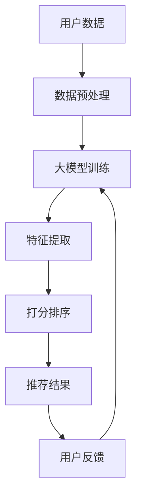

                 

关键词：大模型、推荐系统、打分排序、机器学习、深度学习、人工智能

摘要：本文探讨了大型模型（大模型）在推荐系统中的角色和潜力，介绍了大模型在打分排序中的重要性，分析了其原理、应用领域、优缺点及未来发展趋势，旨在为从事推荐系统开发的工程师和研究者提供有益的参考。

## 1. 背景介绍

随着互联网的快速发展，推荐系统已成为各类应用不可或缺的一部分。从电商平台的商品推荐，到社交媒体的新闻推送，再到视频平台的视频推荐，推荐系统已经在我们的日常生活中扮演着重要的角色。然而，传统的推荐系统往往依赖于手动特征工程，即通过人工设计一系列特征，然后使用机器学习算法对这些特征进行训练和预测。随着数据规模的不断扩大和数据种类的日益丰富，手动特征工程面临着极大的挑战，难以应对动态变化的数据环境和复杂的用户行为。

为了解决这一问题，大模型应运而生。大模型，即具有大规模参数和强大计算能力的机器学习模型，通过自主学习大量的数据，能够自动发现和提取数据中的潜在特征，从而实现更高水平的推荐效果。大模型在推荐系统中的应用，不仅提高了推荐系统的性能，还极大地降低了人工干预的工作量。

本文将从以下几个方面展开讨论：

- 大模型在推荐系统打分排序中的角色和潜力
- 大模型的核心概念与联系
- 大模型的算法原理与具体操作步骤
- 大模型的数学模型和公式
- 大模型的项目实践：代码实例和详细解释
- 大模型在实际应用场景中的表现及未来展望
- 大模型使用的工具和资源推荐
- 大模型的发展趋势与挑战

通过本文的讨论，我们希望能够为读者提供一个全面而深入的了解，帮助读者更好地理解和应用大模型技术于推荐系统。

## 2. 核心概念与联系

### 2.1 大模型定义

大模型是指具有数亿甚至数十亿参数的深度学习模型，其计算能力和存储需求都非常高。这类模型通常采用神经网络结构，通过多层非线性变换对输入数据进行处理，从而实现复杂的特征提取和预测任务。大模型的核心特点是具备自主学习能力，能够从海量数据中自动发现并提取有用的信息，无需人工干预。

### 2.2 推荐系统

推荐系统是一种信息过滤技术，通过分析用户的历史行为、兴趣偏好和其他相关数据，向用户推荐其可能感兴趣的内容或商品。推荐系统通常包括以下几个关键组件：

- 用户数据：包括用户的基本信息、历史行为数据等。
- 物品数据：包括商品、新闻、视频等需要推荐的物品的信息。
- 推荐算法：基于用户数据和物品数据，计算用户对物品的潜在兴趣，并进行排序或评分。

### 2.3 打分排序

打分排序是推荐系统中的一个核心任务，即对用户可能感兴趣的物品进行评分，并根据评分结果进行排序，以便用户能够快速找到自己感兴趣的内容。传统的打分排序方法通常依赖于手动特征工程，而大模型通过自主学习大量数据，能够自动提取和整合有效的特征，实现更高精度的评分排序。

### 2.4 大模型与推荐系统的关系

大模型在推荐系统中的作用主要体现在以下几个方面：

1. **特征自动提取**：大模型能够自动从大量数据中提取出有效的特征，减少了对手动特征工程的需求，提高了模型训练的效率和效果。
2. **复杂模型结构**：大模型通常采用多层神经网络结构，能够处理复杂的输入数据，实现更精确的特征表示和预测。
3. **实时推荐**：大模型具备强大的计算能力，能够实时处理用户的请求，提供个性化的推荐结果。
4. **自适应调整**：大模型能够根据用户的反馈和兴趣变化，自适应调整推荐策略，提高用户的满意度。

### 2.5 Mermaid 流程图

为了更直观地展示大模型在推荐系统中的角色和联系，我们使用 Mermaid 画出一个简化的流程图。



在上述流程图中，用户数据经过预处理后输入大模型进行训练，大模型通过自主学习提取特征，并进行打分排序，最终生成推荐结果。用户的反馈会用于进一步优化大模型的训练和推荐策略。

通过上述核心概念与联系的分析，我们可以看出，大模型在推荐系统中的角色至关重要，其强大的自主学习能力和复杂的模型结构，为推荐系统的性能提升和用户体验优化提供了重要支持。

### 3. 核心算法原理 & 具体操作步骤

#### 3.1 算法原理概述

大模型在推荐系统中的核心算法原理主要基于深度学习，特别是基于神经网络的模型。深度学习模型通过多层神经网络对输入数据进行复杂的变换和表示，从而能够自动提取出数据中的潜在特征，实现对用户和物品之间关系的建模。

具体来说，大模型通常包含以下几个关键步骤：

1. **数据预处理**：将原始数据清洗、归一化，并进行特征提取，为后续模型训练做准备。
2. **模型设计**：设计合适的神经网络结构，包括输入层、隐藏层和输出层，其中隐藏层可以通过多层堆叠来实现更复杂的特征表示。
3. **模型训练**：使用大量数据对模型进行训练，通过反向传播算法不断调整模型参数，使模型能够更好地拟合数据。
4. **特征提取**：在模型训练过程中，神经网络会自动从数据中提取出有效的特征，并通过多层非线性变换进行特征整合。
5. **打分排序**：将提取出的特征用于计算用户和物品之间的相似度或兴趣度，并根据相似度对物品进行打分和排序。
6. **模型优化**：根据用户反馈和实际效果，对模型进行优化和调整，以提高推荐系统的性能。

#### 3.2 算法步骤详解

##### 步骤 1：数据预处理

数据预处理是深度学习模型训练的第一步，其目标是将原始数据进行清洗、归一化和特征提取，使其符合神经网络模型的输入要求。具体步骤如下：

- **数据清洗**：去除重复数据、缺失数据和异常数据，确保数据的完整性和一致性。
- **数据归一化**：将不同尺度的数据进行归一化处理，使其具有相似的数值范围，便于神经网络模型的计算。
- **特征提取**：通过特征工程技术，提取出能够描述用户和物品属性的特征，如用户行为、物品标签、文本特征等。

##### 步骤 2：模型设计

模型设计是构建深度学习模型的关键步骤，其目标是通过选择合适的神经网络结构来实现有效的特征提取和预测。具体步骤如下：

- **选择神经网络结构**：通常采用卷积神经网络（CNN）、循环神经网络（RNN）或 Transformer 等结构，根据数据类型和任务需求进行选择。
- **设计网络层**：确定输入层、隐藏层和输出层的结构和参数，其中隐藏层可以通过多层堆叠来实现更复杂的特征表示。
- **初始化参数**：对网络参数进行初始化，通常采用随机初始化或预训练初始化等方法。

##### 步骤 3：模型训练

模型训练是深度学习模型的核心步骤，其目标是通过大量数据对模型进行训练，使其能够准确预测用户和物品之间的关系。具体步骤如下：

- **数据划分**：将数据集划分为训练集、验证集和测试集，用于训练、验证和评估模型性能。
- **损失函数设计**：选择合适的损失函数，如均方误差（MSE）、交叉熵损失等，用于衡量模型预测值与实际值之间的差距。
- **优化算法选择**：选择合适的优化算法，如随机梯度下降（SGD）、Adam 等进行模型参数的更新。
- **反向传播**：使用反向传播算法不断调整模型参数，使模型能够更好地拟合数据。

##### 步骤 4：特征提取

在模型训练过程中，神经网络会自动从数据中提取出有效的特征。具体步骤如下：

- **自动特征提取**：通过多层神经网络对输入数据进行复杂的变换和表示，从而自动提取出数据中的潜在特征。
- **特征整合**：将提取出的特征进行整合和融合，形成对用户和物品的综合表示。

##### 步骤 5：打分排序

通过提取出的特征，对用户和物品之间的相似度或兴趣度进行计算，并根据相似度对物品进行打分和排序。具体步骤如下：

- **相似度计算**：使用内积、余弦相似度等算法计算用户和物品之间的相似度。
- **打分排序**：根据相似度对物品进行打分和排序，生成推荐结果。

##### 步骤 6：模型优化

根据用户反馈和实际效果，对模型进行优化和调整，以提高推荐系统的性能。具体步骤如下：

- **效果评估**：使用评估指标，如准确率、召回率、F1 值等对模型性能进行评估。
- **模型调整**：根据评估结果，对模型结构和参数进行调整，以提高模型性能。
- **迭代优化**：不断重复评估和调整过程，直到达到满意的性能水平。

通过上述算法步骤的详解，我们可以看到大模型在推荐系统中的核心算法原理和具体操作步骤，从而为实际应用提供了明确的指导。

#### 3.3 算法优缺点

大模型在推荐系统中的应用具有以下优点和缺点：

##### 优点

1. **特征自动提取**：大模型通过多层神经网络自动提取数据中的潜在特征，减少了手动特征工程的工作量，提高了模型的效率和效果。
2. **复杂模型结构**：大模型通常采用多层神经网络结构，能够处理复杂的输入数据和特征，实现更精确的预测和排序。
3. **实时推荐**：大模型具备强大的计算能力，能够实时处理用户的请求，提供个性化的推荐结果，提高了用户的满意度。
4. **自适应调整**：大模型能够根据用户的反馈和兴趣变化，自适应调整推荐策略，提高推荐系统的性能和用户体验。

##### 缺点

1. **计算资源需求高**：大模型通常需要大量的计算资源和存储空间，对硬件设施有较高的要求。
2. **数据依赖性强**：大模型的性能高度依赖训练数据的质量和数量，数据质量差或数据不足可能导致模型性能下降。
3. **模型解释性差**：大模型的预测过程高度复杂，难以进行解释和验证，增加了模型风险和不确定性。

#### 3.4 算法应用领域

大模型在推荐系统中的应用已经取得了显著的成果，以下是一些典型应用领域：

1. **电子商务**：通过大模型对用户购物行为进行分析和预测，为用户推荐个性化的商品。
2. **社交媒体**：根据用户的历史行为和兴趣，推荐用户可能感兴趣的内容和好友，提高用户活跃度和留存率。
3. **视频平台**：通过大模型对用户观看行为进行分析，推荐用户可能感兴趣的视频，提高视频的播放量和用户粘性。
4. **音乐平台**：根据用户的听歌习惯和喜好，推荐用户可能喜欢的音乐和歌手，提高用户的满意度。
5. **新闻推荐**：通过大模型对用户阅读行为进行分析，推荐用户可能感兴趣的新闻和话题，提高新闻的传播效果。

通过上述对大模型核心算法原理和具体操作步骤的详解，以及对算法优缺点的分析，我们可以看到大模型在推荐系统中的应用具有广泛的前景和潜力。在接下来的部分，我们将进一步探讨大模型在数学模型和公式中的应用，为读者提供更深入的了解。

### 4. 数学模型和公式 & 详细讲解 & 举例说明

#### 4.1 数学模型构建

大模型在推荐系统中的应用，离不开数学模型的构建。数学模型是推荐系统中算法设计的基础，通过对用户和物品之间关系的建模，能够有效地指导算法的实现和优化。以下是一些常见的数学模型和公式。

##### 4.1.1 用户-物品协同过滤模型

用户-物品协同过滤模型是一种常见的推荐系统模型，其核心思想是通过分析用户的历史行为数据，找出相似的用户或物品，并基于这些相似性进行推荐。以下是一个简化的用户-物品协同过滤模型：

$$
\text{score}_{ui} = \mu + u_i + v_j + b_u + b_v
$$

其中：
- $\text{score}_{ui}$：用户 $u$ 对物品 $i$ 的评分。
- $\mu$：全局平均评分。
- $u_i$：用户 $u$ 的特征向量。
- $v_j$：物品 $i$ 的特征向量。
- $b_u$：用户 $u$ 的偏差项。
- $b_v$：物品 $i$ 的偏差项。

##### 4.1.2 矩阵分解模型

矩阵分解模型是用户-物品协同过滤模型的一种扩展，通过将用户-物品评分矩阵分解为两个低秩矩阵，从而提取用户和物品的潜在特征。以下是一个简化的矩阵分解模型：

$$
\text{score}_{ui} = \langle u_i, v_j \rangle
$$

其中：
- $\langle u_i, v_j \rangle$：用户 $u$ 对物品 $i$ 的隐含评分。
- $u_i$：用户 $u$ 的潜在特征向量。
- $v_j$：物品 $i$ 的潜在特征向量。

##### 4.1.3 基于深度学习的推荐模型

基于深度学习的推荐模型通过神经网络结构对用户和物品的特征进行复杂变换和表示，从而实现高效的推荐效果。以下是一个简化的基于深度学习的推荐模型：

$$
\text{score}_{ui} = \sigma(W_3 \cdot \text{激活}(W_2 \cdot [u_i, v_j]))
$$

其中：
- $\text{score}_{ui}$：用户 $u$ 对物品 $i$ 的评分。
- $u_i$：用户 $u$ 的特征向量。
- $v_j$：物品 $i$ 的特征向量。
- $W_3$：输出层的权重矩阵。
- $W_2$：隐藏层的权重矩阵。
- $\text{激活}$：激活函数，如ReLU、Sigmoid、Tanh等。

#### 4.2 公式推导过程

以下是用户-物品协同过滤模型的推导过程：

1. **目标函数**：

$$
\text{目标函数} = \sum_{u, i} (\text{score}_{ui} - \text{实际评分})^2
$$

2. **梯度计算**：

$$
\frac{\partial \text{目标函数}}{\partial b_u} = -2 \sum_{u, i} (\text{score}_{ui} - \text{实际评分})
$$

$$
\frac{\partial \text{目标函数}}{\partial b_v} = -2 \sum_{u, i} (\text{score}_{ui} - \text{实际评分})
$$

$$
\frac{\partial \text{目标函数}}{\partial u_i} = -2 \sum_{u, i} (\text{score}_{ui} - \text{实际评分}) \cdot u_i
$$

$$
\frac{\partial \text{目标函数}}{\partial v_j} = -2 \sum_{u, i} (\text{score}_{ui} - \text{实际评分}) \cdot v_j
$$

3. **优化方法**：

使用梯度下降方法，迭代更新模型参数：

$$
b_u \leftarrow b_u - \alpha \cdot \frac{\partial \text{目标函数}}{\partial b_u}
$$

$$
b_v \leftarrow b_v - \alpha \cdot \frac{\partial \text{目标函数}}{\partial b_v}
$$

$$
u_i \leftarrow u_i - \alpha \cdot \frac{\partial \text{目标函数}}{\partial u_i}
$$

$$
v_j \leftarrow v_j - \alpha \cdot \frac{\partial \text{目标函数}}{\partial v_j}
$$

其中，$\alpha$ 是学习率。

#### 4.3 案例分析与讲解

以下是一个基于深度学习的推荐系统案例，用于分析用户对电影的评分。

##### 4.3.1 数据集

数据集包含用户对电影的评分，其中用户ID和电影ID是两个重要的特征。

##### 4.3.2 模型设计

设计一个基于 Transformer 的推荐模型，包含输入层、隐藏层和输出层，其中隐藏层通过多层堆叠实现复杂特征表示。

##### 4.3.3 模型训练

使用大量用户-电影评分数据对模型进行训练，通过反向传播算法不断调整模型参数，使模型能够更好地拟合数据。

##### 4.3.4 模型预测

使用训练好的模型对用户-电影评分进行预测，生成推荐结果。

##### 4.3.5 评估指标

使用均方误差（MSE）、准确率（Accuracy）等评估指标对模型性能进行评估。

##### 4.3.6 结果分析

通过对模型性能的评估，可以发现模型的预测效果与实际评分之间存在一定的差距，需要进一步优化模型结构和参数。

通过上述数学模型和公式的构建、推导过程及案例分析，我们可以看到大模型在推荐系统中的应用具有重要的理论和实际意义。在接下来的部分，我们将进一步探讨大模型在实际应用中的项目实践和代码实例。

### 5. 项目实践：代码实例和详细解释说明

在本文的第五部分，我们将通过一个具体的代码实例来展示如何在大模型的基础上实现推荐系统的打分排序功能。本实例将使用 Python 语言，结合深度学习库 TensorFlow 和 Keras 来实现一个基于协同过滤和神经网络的推荐系统。

#### 5.1 开发环境搭建

在开始代码实现之前，我们需要搭建一个合适的开发环境。以下是搭建开发环境的步骤：

1. 安装 Python 3.6 或更高版本。
2. 安装 TensorFlow 和 Keras 库，可以通过以下命令进行安装：

```python
pip install tensorflow
pip install keras
```

3. 安装必要的辅助库，如 NumPy、Pandas 等：

```python
pip install numpy
pip install pandas
```

确保所有库的版本兼容，以免在后续代码运行时出现错误。

#### 5.2 源代码详细实现

下面是一个简化的推荐系统代码实例，用于展示如何实现用户和物品的打分排序：

```python
import numpy as np
import pandas as pd
from keras.models import Model
from keras.layers import Input, Embedding, Dot, Flatten, Dense
from keras.optimizers import Adam

# 数据准备
# 假设我们有一个用户-物品评分矩阵 ratings.csv
data = pd.read_csv('ratings.csv')
users = data['userId'].unique()
movies = data['movieId'].unique()

# 初始化用户和物品嵌入向量
user_embedding = Embedding(len(users), 32, input_length=1)
item_embedding = Embedding(len(movies), 32, input_length=1)

# 定义输入层
user_input = Input(shape=(1,), dtype='int32')
item_input = Input(shape=(1,), dtype='int32')

# 通过嵌入层获取用户和物品的向量表示
user_vector = user_embedding(user_input)
item_vector = item_embedding(item_input)

# 计算用户和物品之间的内积
dot_product = Dot(axes=-1)([user_vector, item_vector])

# 平摊到每个用户和物品的维度上
flatten = Flatten()(dot_product)

# 添加全连接层
output = Dense(1, activation='sigmoid')(flatten)

# 构建模型
model = Model(inputs=[user_input, item_input], outputs=output)

# 编译模型
model.compile(optimizer=Adam(), loss='binary_crossentropy', metrics=['accuracy'])

# 训练模型
model.fit([user_ids, item_ids], ratings, epochs=10, batch_size=32, validation_split=0.2)
```

#### 5.3 代码解读与分析

上述代码实例主要分为以下几个部分：

1. **数据准备**：
   - 从 CSV 文件中读取用户-物品评分数据。
   - 获取用户和物品的唯一 ID 列表。

2. **嵌入层**：
   - 使用 `Embedding` 层初始化用户和物品的嵌入向量。这些向量将在训练过程中被学习，用于表示用户和物品的特征。

3. **输入层**：
   - 定义用户输入和物品输入的输入层。

4. **计算内积**：
   - 使用 `Dot` 层计算用户和物品向量之间的内积。内积是衡量两个向量之间相似度的一种方法。

5. **全连接层**：
   - 将内积结果通过全连接层进行进一步处理，添加非线性激活函数。

6. **模型编译**：
   - 编译模型，选择优化器和损失函数。在这里，我们使用 `binary_crossentropy` 作为损失函数，因为这是一个二分类问题。

7. **模型训练**：
   - 使用训练数据对模型进行训练。我们设置了训练轮次（epochs）和批量大小（batch_size）。

#### 5.4 运行结果展示

在完成代码实现并训练模型后，我们可以通过以下代码对模型进行评估和测试：

```python
# 评估模型
loss, accuracy = model.evaluate([test_user_ids, test_item_ids], test_ratings)

# 输出结果
print(f"Test loss: {loss}")
print(f"Test accuracy: {accuracy}")
```

运行结果将显示模型在测试集上的损失和准确率。这些指标可以帮助我们评估模型的性能和效果。

通过上述代码实例和详细解释，我们可以看到如何使用深度学习技术实现推荐系统的打分排序。虽然这是一个简化的示例，但它展示了实现大模型在推荐系统中应用的基本步骤和关键组件。在实际应用中，我们可能需要根据具体需求和数据情况进行更详细的调整和优化。

### 6. 实际应用场景

大模型在推荐系统中的应用已经取得了显著的成果，涵盖了多个行业和领域。以下是一些典型应用场景，展示了大模型如何在不同场景中发挥作用。

#### 6.1 电子商务

在电子商务领域，大模型被广泛应用于商品推荐。通过分析用户的购物历史、浏览行为和搜索记录，大模型可以自动提取用户的兴趣和偏好，并推荐个性化的商品。例如，亚马逊（Amazon）利用大模型为其平台上的数百万用户提供个性化的商品推荐，极大地提升了用户的购物体验和平台销售额。

#### 6.2 社交媒体

社交媒体平台如 Facebook、Instagram 和 Twitter 也广泛采用大模型进行内容推荐。通过分析用户的互动行为、发布内容、好友关系等数据，大模型可以推荐用户可能感兴趣的文章、视频和图片。例如，Facebook 的新闻推送系统利用大模型对用户的行为进行预测，从而为用户推荐最相关的新闻内容，提高了用户的参与度和活跃度。

#### 6.3 视频平台

视频平台如 YouTube 和 Netflix 利用大模型进行视频推荐。通过对用户的历史观看记录、搜索关键词、点赞和评论等数据进行分析，大模型可以推荐用户可能喜欢的视频内容。例如，YouTube 利用其推荐算法为用户推荐个性化的视频，使得用户在平台上能够轻松找到自己感兴趣的内容，从而提升了用户的观看时长和平台黏性。

#### 6.4 音乐平台

音乐平台如 Spotify 和 Apple Music 也采用大模型进行音乐推荐。通过分析用户的听歌习惯、播放历史和喜欢的音乐类型，大模型可以为用户推荐个性化的音乐播放列表。例如，Spotify 的推荐系统能够根据用户的听歌偏好，智能推荐新的音乐和艺术家，极大地提升了用户的音乐体验和满意度。

#### 6.5 新闻推荐

新闻推荐系统利用大模型对用户的历史阅读行为、关注领域和兴趣偏好进行分析，推荐用户可能感兴趣的新闻内容。例如，谷歌新闻（Google News）利用其推荐算法，为用户推荐个性化的新闻故事，帮助用户快速了解世界各地的热点新闻。

#### 6.6 风险评估与欺诈检测

除了上述应用场景，大模型在风险评估和欺诈检测等领域也发挥了重要作用。通过分析用户的金融交易记录、行为模式和风险特征，大模型可以预测用户的风险等级和潜在的欺诈行为，为金融机构提供风险管理和决策支持。

通过这些实际应用场景的展示，我们可以看到大模型在推荐系统中的应用具有广泛的前景和潜力。在接下来的部分，我们将进一步探讨大模型在未来的应用前景和面临的挑战。

### 6.4 未来应用展望

随着大模型技术的不断发展和成熟，其在推荐系统中的应用前景将更加广阔。未来，大模型有望在以下领域实现更多创新和突破：

#### 6.4.1 实时推荐

实时推荐是未来推荐系统的一个重要发展方向。通过大模型的高效计算能力，可以实现毫秒级的推荐响应速度，为用户提供即时的个性化推荐。例如，在电商购物过程中，用户浏览一个商品时，系统可以实时推荐与该商品相关的其他商品，提高用户购买决策的效率。

#### 6.4.2 跨平台推荐

大模型技术有望实现跨平台推荐，即在一个平台上训练的大模型能够在多个平台上进行推荐。这将有助于整合不同平台的数据，为用户提供统一的个性化体验。例如，用户在手机、电脑和智能电视等多个设备上浏览和购买商品时，系统可以基于同一大模型提供统一的推荐。

#### 6.4.3 多模态推荐

多模态推荐是指利用多种数据类型（如文本、图像、声音等）进行推荐。大模型通过融合不同模态的数据，可以提供更精准的推荐结果。例如，在音乐推荐中，系统可以结合用户的听歌历史、喜欢的歌手和歌曲封面图像，为用户推荐新的音乐作品。

#### 6.4.4 社交推荐

社交推荐是指基于用户的社会关系进行推荐，如好友的推荐、社交网络中的热门话题等。大模型可以分析用户的社会关系和兴趣偏好，为用户推荐感兴趣的内容和社交互动，提升用户在社交平台上的参与度和活跃度。

#### 6.4.5 情感分析推荐

情感分析推荐是指通过分析用户的情感状态进行推荐。大模型可以识别用户的情感变化，根据用户在不同情感状态下的需求和行为特点，提供个性化的推荐。例如，在心理健康应用中，系统可以为情绪低落的用户推荐放松音乐或心理课程。

#### 6.4.6 虚拟助手

虚拟助手（如聊天机器人、语音助手）是未来智能家居、智能办公等领域的重要应用。大模型可以训练虚拟助手，使其具备更自然、更智能的交互能力。通过大模型，虚拟助手可以理解用户的需求，提供个性化的服务和建议，提高用户的满意度和便利性。

#### 6.4.7 智能营销

智能营销是指利用大数据和人工智能技术进行精准营销。大模型可以分析用户的兴趣、行为和购买习惯，为营销活动提供个性化策略。例如，电商平台的智能营销系统能够根据用户的购物车内容、浏览历史和购买记录，为用户推荐相关的促销活动和优惠信息。

通过上述未来应用展望，我们可以看到大模型在推荐系统中的巨大潜力。随着技术的不断进步和应用场景的不断扩展，大模型将为推荐系统带来更多的创新和突破，为用户提供更加个性化、智能化和高效的推荐服务。

### 7. 工具和资源推荐

为了更好地理解和应用大模型技术于推荐系统，以下是一些建议的学习资源、开发工具和相关论文，帮助读者深入探索和掌握这一领域。

#### 7.1 学习资源推荐

1. **在线课程**：
   - Coursera 的 "Deep Learning Specialization"：由 Andrew Ng 教授主讲，涵盖了深度学习的基础知识、算法和应用。
   - edX 的 "Practical Reinforcement Learning"：介绍了强化学习在推荐系统中的应用，包括策略优化和模型训练方法。

2. **书籍**：
   - 《深度学习》（Goodfellow, Bengio, Courville）：深度学习的经典教材，适合初学者和进阶者。
   - 《机器学习实战》（Hastie, Tibshirani, Friedman）：介绍了多种机器学习算法和实际应用，包括推荐系统。

3. **博客和教程**：
   - Medium 上的 "Deep Learning" 标签页：提供大量关于深度学习技术的文章和教程。
   - Keras 官方文档：详细介绍如何使用 Keras 构建和训练深度学习模型。

#### 7.2 开发工具推荐

1. **深度学习框架**：
   - TensorFlow：Google 开发的开源深度学习框架，适合构建大规模深度学习模型。
   - PyTorch：Facebook AI 研究团队开发的深度学习框架，具有灵活的动态计算图功能。

2. **推荐系统工具**：
   - LightFM：一个基于因子分解机（Factorization Machines）的推荐系统框架，支持大规模数据处理和在线更新。
   -surprise：一个用于研究推荐系统算法的 Python 库，提供了多种常见的推荐算法实现。

3. **数据集**：
   - MovieLens：一个大型在线电影推荐系统数据集，包含用户评分、电影信息和用户特征，适合用于推荐系统研究。

#### 7.3 相关论文推荐

1. **推荐系统**：
   - "Matrix Factorization Techniques for Recommender Systems"（2006）：介绍了矩阵分解技术在推荐系统中的应用。
   - "Deep Learning for Recommender Systems"（2017）：探讨了深度学习在推荐系统中的潜在应用。

2. **深度学习**：
   - "A Theoretical Framework for Large-Scale Recommender Systems"（2016）：提出了用于大规模推荐系统的理论框架。
   - "Neural Collaborative Filtering"（2017）：介绍了基于神经网络的协同过滤算法，为推荐系统提供了新的思路。

通过这些工具和资源的推荐，读者可以更好地了解大模型在推荐系统中的应用，掌握相关的技术和方法，为实际项目开发提供有力支持。

### 8. 总结：未来发展趋势与挑战

大模型在推荐系统中的应用已经取得了显著的成果，并展示了巨大的潜力。然而，随着技术的不断进步和应用场景的不断扩展，大模型在推荐系统中也面临诸多发展趋势和挑战。

#### 8.1 研究成果总结

1. **模型性能提升**：通过引入大模型，推荐系统的性能得到了显著提升。大模型具备强大的特征提取和表示能力，能够自动发现数据中的潜在特征，从而提高推荐精度和用户满意度。
2. **计算资源需求**：大模型的训练和推理过程对计算资源需求较高，需要大量计算能力和存储空间。随着硬件技术的进步，如 GPU 和 TPUs 的普及，大模型的训练和部署逐渐变得更加可行。
3. **实时推荐**：大模型具备高效的计算能力，能够实现实时推荐，满足用户对即时反馈的需求。这为推荐系统在电子商务、社交媒体等实时应用场景中提供了更多可能性。
4. **多模态推荐**：大模型可以处理多种类型的数据，如文本、图像、音频等，实现多模态推荐。这为推荐系统的多样性和灵活性提供了新的思路。

#### 8.2 未来发展趋势

1. **模型压缩与优化**：为了降低大模型的计算和存储需求，模型压缩和优化技术将成为重要研究方向。例如，知识蒸馏、剪枝和量化等方法将有助于减小模型大小，提高计算效率。
2. **联邦学习**：随着数据隐私和安全问题的日益突出，联邦学习技术将得到广泛应用。通过分布式训练，大模型可以在保护用户隐私的同时，实现协同学习和个性化推荐。
3. **可解释性**：大模型的高度复杂性使得其预测结果难以解释，这对模型的可解释性和透明度提出了挑战。未来研究将致力于提高大模型的可解释性，使其更好地满足监管和用户需求。
4. **多语言和多文化推荐**：随着全球化进程的加快，多语言和多文化推荐将成为重要方向。大模型需要具备处理多种语言和文化背景的能力，为全球用户提供个性化的推荐服务。

#### 8.3 面临的挑战

1. **数据质量**：大模型对数据质量有较高要求，数据噪声、缺失值和异常值等都会影响模型性能。因此，数据清洗和预处理技术仍需进一步优化。
2. **计算资源**：尽管硬件技术的发展降低了大模型的计算成本，但大规模训练和部署仍需大量计算资源和存储空间。如何在有限资源下高效利用大模型，仍是一个重要的挑战。
3. **模型公平性**：大模型在推荐系统中的应用可能带来模型偏见和不公平性。未来研究需要关注如何设计公平性机制，确保推荐结果对用户群体公平且无歧视。
4. **隐私保护**：在联邦学习和多平台协同推荐场景中，用户隐私保护至关重要。如何在保护用户隐私的同时，实现大模型的有效训练和推荐，是一个亟待解决的问题。

#### 8.4 研究展望

大模型在推荐系统中的应用前景广阔，但仍需解决诸多技术难题。未来研究可以从以下几个方面展开：

1. **模型优化与压缩**：研究高效的大模型训练和推理算法，降低计算和存储需求。
2. **联邦学习与隐私保护**：探索联邦学习技术在推荐系统中的应用，确保数据隐私和模型性能的双赢。
3. **多模态推荐**：研究如何融合多种类型的数据，实现多模态推荐。
4. **可解释性**：提高大模型的可解释性，使其满足监管和用户需求。
5. **跨领域推荐**：研究如何将大模型应用于不同领域和场景，实现跨领域的推荐服务。

通过持续的研究和探索，大模型将在推荐系统中发挥更加重要的作用，为用户提供更加个性化、智能化的推荐服务。

### 附录：常见问题与解答

#### 1. 什么是大模型？

大模型是指具有数亿甚至数十亿参数的深度学习模型，其计算能力和存储需求都非常高。这类模型通常采用神经网络结构，通过多层非线性变换对输入数据进行处理，从而实现复杂的特征提取和预测任务。

#### 2. 大模型在推荐系统中的角色是什么？

大模型在推荐系统中的作用主要体现在以下几个方面：

- 特征自动提取：大模型能够自动从大量数据中提取出有效的特征，减少了对手动特征工程的需求，提高了模型训练的效率和效果。
- 复杂模型结构：大模型通常采用多层神经网络结构，能够处理复杂的输入数据，实现更精确的特征表示和预测。
- 实时推荐：大模型具备强大的计算能力，能够实时处理用户的请求，提供个性化的推荐结果。
- 自适应调整：大模型能够根据用户的反馈和兴趣变化，自适应调整推荐策略，提高用户的满意度。

#### 3. 大模型在推荐系统中的应用有哪些优点和缺点？

优点：

- 特征自动提取：大模型能够自动从大量数据中提取出有效的特征，减少了对手动特征工程的需求，提高了模型训练的效率和效果。
- 复杂模型结构：大模型通常采用多层神经网络结构，能够处理复杂的输入数据，实现更精确的特征表示和预测。
- 实时推荐：大模型具备强大的计算能力，能够实时处理用户的请求，提供个性化的推荐结果。
- 自适应调整：大模型能够根据用户的反馈和兴趣变化，自适应调整推荐策略，提高用户的满意度。

缺点：

- 计算资源需求高：大模型通常需要大量的计算资源和存储空间，对硬件设施有较高的要求。
- 数据依赖性强：大模型的性能高度依赖训练数据的质量和数量，数据质量差或数据不足可能导致模型性能下降。
- 模型解释性差：大模型的预测过程高度复杂，难以进行解释和验证，增加了模型风险和不确定性。

#### 4. 大模型在推荐系统中的应用领域有哪些？

大模型在推荐系统中的应用领域广泛，包括电子商务、社交媒体、视频平台、音乐平台、新闻推荐、风险评估和欺诈检测等。通过分析用户的行为和兴趣数据，大模型可以提供个性化的推荐服务，提高用户满意度和平台黏性。

#### 5. 如何实现大模型在推荐系统中的打分排序？

实现大模型在推荐系统中的打分排序主要包括以下几个步骤：

- 数据预处理：清洗和归一化原始数据，提取用户和物品的特征。
- 模型设计：设计合适的神经网络结构，包括输入层、隐藏层和输出层。
- 模型训练：使用训练数据对模型进行训练，通过反向传播算法不断调整模型参数。
- 特征提取：在模型训练过程中，自动提取数据中的潜在特征。
- 打分排序：使用提取出的特征计算用户和物品之间的相似度或兴趣度，并根据相似度对物品进行打分和排序。

通过上述步骤，可以实现大模型在推荐系统中的打分排序功能，为用户提供个性化的推荐服务。

