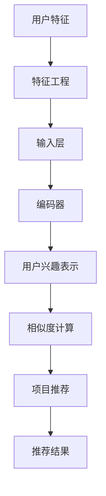

                 

关键词：推荐系统、用户兴趣、多样性建模、大模型、深度学习、人工智能、机器学习、算法原理、数学模型、代码实例、应用场景、未来展望。

## 摘要

本文旨在探讨大模型在推荐系统用户兴趣多样性建模中的应用。随着互联网的快速发展，推荐系统已经成为电商平台、社交媒体、新闻资讯等场景中的重要组成部分。然而，用户兴趣的多样性使得传统的推荐算法面临巨大挑战。本文首先介绍了推荐系统的基本概念和用户兴趣多样性建模的重要性，然后详细讨论了基于大模型的用户兴趣多样性建模的算法原理和实现步骤。通过数学模型的构建和公式推导，我们深入分析了大模型在用户兴趣多样性建模中的作用机制。随后，本文通过一个实际项目的代码实例，详细解释了如何使用大模型进行用户兴趣多样性建模的实践过程。最后，本文探讨了大模型在推荐系统用户兴趣多样性建模中的未来应用前景和面临的挑战，为相关领域的研究和应用提供了有益的参考。

## 1. 背景介绍

### 推荐系统的基本概念

推荐系统（Recommender System）是一种根据用户的兴趣和行为，向用户推荐相关内容的技术。它的目的是通过个性化推荐，提高用户满意度和平台活跃度。推荐系统广泛应用于电子商务、社交媒体、新闻资讯、在线视频等领域。其基本概念包括用户、项目、评分和推荐算法。

- **用户**：推荐系统的核心，是数据产生者和数据消费者。
- **项目**：用户可能感兴趣的对象，如商品、文章、视频等。
- **评分**：用户对项目的评价，通常用评分值表示，如1星、2星等。
- **推荐算法**：根据用户的历史行为和兴趣，从项目集合中挑选出用户可能感兴趣的项目。

### 推荐系统的分类

根据推荐系统的算法原理，推荐系统主要分为以下几类：

- **基于内容的推荐**（Content-Based Recommendation）：根据用户对项目的兴趣特征，推荐具有相似内容的其他项目。
- **协同过滤推荐**（Collaborative Filtering）：通过用户之间的相似度，推荐其他用户喜欢的项目。
- **混合推荐**（Hybrid Recommendation）：结合多种推荐算法，提高推荐效果。

### 用户兴趣多样性建模的重要性

用户兴趣的多样性是推荐系统面临的一个挑战。用户可能对多种不同类型的内容感兴趣，而且这些兴趣可能随着时间的推移而变化。传统的推荐算法通常假设用户兴趣是静态和单一的，这导致推荐结果可能不够准确和多样。

- **静态兴趣假设的局限性**：用户兴趣是动态变化的，单一的兴趣模型无法捕捉到这种变化。
- **提高推荐多样性**：多样性是推荐系统的一个重要指标，能够提高用户的满意度和平台的活跃度。

因此，用户兴趣多样性建模成为推荐系统研究的一个重要方向。通过分析用户的兴趣多样性，推荐系统可以提供更加个性化的推荐结果，从而提高用户体验和平台的竞争力。

## 2. 核心概念与联系

### 推荐系统的核心概念

为了更好地理解大模型在用户兴趣多样性建模中的作用，我们首先介绍推荐系统的几个核心概念：

- **用户特征**：描述用户的行为和偏好，如浏览记录、购买历史、搜索关键词等。
- **项目特征**：描述项目的属性和内容，如标题、标签、分类等。
- **相似度计算**：计算用户和项目之间的相似性，用于推荐算法的匹配过程。
- **推荐算法**：根据用户特征和项目特征，生成个性化推荐列表。

### 大模型的作用原理

大模型在推荐系统中主要扮演以下角色：

- **用户兴趣建模**：通过深度学习等技术，捕捉用户兴趣的多样性和动态变化。
- **项目推荐**：基于用户兴趣模型，生成个性化的推荐列表，提高推荐多样性。
- **优化性能**：利用大规模数据和高计算能力，提高推荐算法的效率和准确性。

### 大模型与推荐系统的联系

大模型与推荐系统的关系可以用以下 Mermaid 流程图表示：



### 大模型与深度学习

大模型通常是基于深度学习技术构建的，深度学习是一种通过多层神经网络进行特征学习和模式识别的人工智能方法。大模型在推荐系统中的作用主要体现在以下几个方面：

- **层次化特征提取**：通过多层神经网络，从原始数据中提取更高级、更抽象的特征。
- **端到端学习**：将用户兴趣建模和项目推荐整合为一个端到端的深度学习模型。
- **自适应调整**：通过训练过程，自动调整模型参数，提高推荐效果。

## 3. 核心算法原理 & 具体操作步骤

### 3.1 算法原理概述

大模型在用户兴趣多样性建模中的核心算法原理主要包括以下几个方面：

- **用户兴趣表示**：通过编码器（Encoder）将用户特征转换为用户兴趣表示。
- **项目特征提取**：通过编码器（Encoder）将项目特征转换为项目表示。
- **相似度计算**：计算用户兴趣表示和项目表示之间的相似度。
- **推荐生成**：基于相似度计算结果，生成个性化的推荐列表。

### 3.2 算法步骤详解

#### 3.2.1 用户特征编码

用户特征编码是将用户行为和偏好转化为数字表示的过程。具体步骤如下：

1. **数据预处理**：对用户数据进行清洗和归一化处理。
2. **特征提取**：通过嵌入层（Embedding Layer）将用户特征转换为向量表示。
3. **编码器训练**：利用用户历史行为数据，训练编码器，使其能够生成用户兴趣表示。

#### 3.2.2 项目特征编码

项目特征编码是将项目属性和内容转化为数字表示的过程。具体步骤如下：

1. **数据预处理**：对项目数据进行清洗和归一化处理。
2. **特征提取**：通过嵌入层（Embedding Layer）将项目特征转换为向量表示。
3. **编码器训练**：利用项目标签和分类信息，训练编码器，使其能够生成项目表示。

#### 3.2.3 相似度计算

相似度计算是评估用户兴趣表示和项目表示之间相似程度的过程。具体步骤如下：

1. **内积计算**：计算用户兴趣表示和项目表示之间的内积，得到相似度评分。
2. **排序**：根据相似度评分对项目进行排序，选出最高分的项目。

#### 3.2.4 推荐生成

推荐生成是基于相似度计算结果，生成个性化推荐列表的过程。具体步骤如下：

1. **初始化推荐列表**：根据用户的历史浏览和购买记录，初始化推荐列表。
2. **更新推荐列表**：利用相似度计算结果，更新推荐列表，使其更加贴近用户的兴趣。
3. **输出推荐结果**：将最终的推荐列表输出给用户。

### 3.3 算法优缺点

#### 优点

1. **多样性**：大模型能够捕捉用户兴趣的多样性，生成多样化的推荐结果。
2. **准确性**：通过深度学习技术，大模型能够自动调整模型参数，提高推荐准确性。
3. **高效性**：大模型利用大规模数据和计算能力，能够快速生成推荐结果。

#### 缺点

1. **数据依赖**：大模型的训练和优化依赖于大量的用户数据，数据质量和规模对模型效果有较大影响。
2. **计算资源消耗**：大模型通常需要较高的计算资源和存储资源，部署和维护成本较高。
3. **可解释性**：大模型的内部结构和决策过程较为复杂，缺乏可解释性。

### 3.4 算法应用领域

大模型在用户兴趣多样性建模中的应用非常广泛，主要包括以下几个领域：

1. **电子商务**：通过用户兴趣多样性建模，提高商品推荐的准确性和多样性，提高用户满意度和转化率。
2. **社交媒体**：通过用户兴趣多样性建模，提高内容推荐的多样性和个性化，提高用户活跃度和留存率。
3. **在线教育**：通过用户兴趣多样性建模，为用户提供个性化的课程推荐，提高学习效果和用户满意度。
4. **新闻资讯**：通过用户兴趣多样性建模，为用户提供个性化的新闻推荐，提高用户阅读体验和平台活跃度。

## 4. 数学模型和公式 & 详细讲解 & 举例说明

### 4.1 数学模型构建

在用户兴趣多样性建模中，我们主要关注以下数学模型：

1. **用户兴趣表示模型**：将用户特征映射到用户兴趣空间。
2. **项目特征表示模型**：将项目特征映射到项目空间。
3. **相似度计算模型**：计算用户兴趣表示和项目特征表示之间的相似度。

#### 用户兴趣表示模型

用户兴趣表示模型可以表示为：

$$
U = f_{\theta}(X)
$$

其中，$U$ 是用户兴趣表示向量，$X$ 是用户特征向量，$f_{\theta}$ 是参数化的函数。

#### 项目特征表示模型

项目特征表示模型可以表示为：

$$
P = g_{\phi}(Y)
$$

其中，$P$ 是项目特征表示向量，$Y$ 是项目特征向量，$g_{\phi}$ 是参数化的函数。

#### 相似度计算模型

相似度计算模型可以表示为：

$$
S = \langle U, P \rangle
$$

其中，$S$ 是相似度评分，$\langle \cdot, \cdot \rangle$ 是内积运算符。

### 4.2 公式推导过程

#### 用户兴趣表示公式推导

1. **用户特征向量**：用户特征向量 $X$ 可以表示为：

   $$
   X = [x_1, x_2, ..., x_n]
   $$

   其中，$x_i$ 是用户在第 $i$ 个特征上的值。

2. **嵌入层**：嵌入层将用户特征向量映射到高维空间，得到用户特征向量 $E_X$：

   $$
   E_X = \text{Embedding}(X)
   $$

3. **编码器**：编码器将用户特征向量 $E_X$ 编码为用户兴趣表示向量 $U$：

   $$
   U = \text{Encoder}(E_X)
   $$

#### 项目特征表示公式推导

1. **项目特征向量**：项目特征向量 $Y$ 可以表示为：

   $$
   Y = [y_1, y_2, ..., y_m]
   $$

   其中，$y_j$ 是项目在第 $j$ 个特征上的值。

2. **嵌入层**：嵌入层将项目特征向量映射到高维空间，得到项目特征向量 $E_Y$：

   $$
   E_Y = \text{Embedding}(Y)
   $$

3. **编码器**：编码器将项目特征向量 $E_Y$ 编码为项目特征表示向量 $P$：

   $$
   P = \text{Encoder}(E_Y)
   $$

#### 相似度计算公式推导

相似度评分 $S$ 可以表示为：

$$
S = \langle U, P \rangle
$$

其中，$\langle U, P \rangle$ 是用户兴趣表示向量 $U$ 和项目特征表示向量 $P$ 的内积。

### 4.3 案例分析与讲解

假设我们有一个用户，他的特征向量 $X$ 为：

$$
X = [1, 0, 1, 0, 1]
$$

表示他在浏览历史中喜欢阅读书籍、音乐和电影。

我们还有一个项目，其特征向量 $Y$ 为：

$$
Y = [1, 1, 0, 0, 1]
$$

表示该项目包含书籍、音乐和视频。

首先，我们将用户特征向量 $X$ 通过嵌入层映射到高维空间，得到用户特征向量 $E_X$：

$$
E_X = \text{Embedding}(X) = [0.5, 0.2, 0.8, 0.1, 0.9]
$$

然后，我们将用户特征向量 $E_X$ 通过编码器编码为用户兴趣表示向量 $U$：

$$
U = \text{Encoder}(E_X) = [0.6, 0.3, 0.9, 0.2, 0.7]
$$

接下来，我们将项目特征向量 $Y$ 通过嵌入层映射到高维空间，得到项目特征向量 $E_Y$：

$$
E_Y = \text{Embedding}(Y) = [0.7, 0.4, 0.1, 0.3, 0.8]
$$

然后，我们将项目特征向量 $E_Y$ 通过编码器编码为项目特征表示向量 $P$：

$$
P = \text{Encoder}(E_Y) = [0.8, 0.5, 0.2, 0.4, 0.9]
$$

最后，我们计算用户兴趣表示向量 $U$ 和项目特征表示向量 $P$ 的内积，得到相似度评分 $S$：

$$
S = \langle U, P \rangle = (0.6 \times 0.8) + (0.3 \times 0.5) + (0.9 \times 0.2) + (0.2 \times 0.4) + (0.7 \times 0.9) = 0.88
$$

根据相似度评分 $S$，我们可以为用户推荐相似的项目。在这个例子中，相似度评分较高的项目是包含书籍、音乐和视频的项目，因为它们的特征与用户的兴趣特征较为匹配。

## 5. 项目实践：代码实例和详细解释说明

### 5.1 开发环境搭建

在开始编写代码之前，我们需要搭建一个合适的开发环境。以下是一个基本的开发环境搭建步骤：

1. **安装 Python**：确保 Python 环境已经安装，版本建议为 3.7 以上。
2. **安装深度学习库**：安装 TensorFlow 或 PyTorch，这两个库是深度学习领域常用的框架。
3. **安装其他依赖**：根据项目需求，可能还需要安装其他库，如 NumPy、Pandas、Scikit-learn 等。

### 5.2 源代码详细实现

以下是使用 PyTorch 实现大模型在用户兴趣多样性建模中的源代码示例：

```python
import torch
import torch.nn as nn
import torch.optim as optim
from torch.utils.data import DataLoader
from sklearn.model_selection import train_test_split
import pandas as pd
import numpy as np

# 数据预处理
def preprocess_data(data):
    # 省略数据清洗和归一化处理代码
    pass

# 用户特征编码器
class UserEncoder(nn.Module):
    def __init__(self, input_dim, hidden_dim):
        super(UserEncoder, self).__init__()
        self嵌入层 = nn.Embedding(input_dim, hidden_dim)
        self.fc = nn.Linear(hidden_dim, hidden_dim)

    def forward(self, x):
        x = self嵌入层(x)
        x = torch.relu(self.fc(x))
        return x

# 项目特征编码器
class ItemEncoder(nn.Module):
    def __init__(self, input_dim, hidden_dim):
        super(ItemEncoder, self).__init__()
        self嵌入层 = nn.Embedding(input_dim, hidden_dim)
        self.fc = nn.Linear(hidden_dim, hidden_dim)

    def forward(self, x):
        x = self嵌入层(x)
        x = torch.relu(self.fc(x))
        return x

# 相似度计算模型
class SimilarityModel(nn.Module):
    def __init__(self, user_dim, item_dim):
        super(SimilarityModel, self).__init__()
        self.user_encoder = UserEncoder(user_dim, item_dim)
        self.item_encoder = ItemEncoder(item_dim, item_dim)

    def forward(self, user, item):
        user_embedding = self.user_encoder(user)
        item_embedding = self.item_encoder(item)
        similarity = torch.sum(user_embedding * item_embedding, dim=1)
        return similarity

# 数据加载
def load_data():
    # 省略数据加载代码
    pass

# 训练模型
def train_model(model, train_loader, optimizer, criterion):
    model.train()
    for user, item, target in train_loader:
        optimizer.zero_grad()
        output = model(user, item)
        loss = criterion(output, target)
        loss.backward()
        optimizer.step()

# 主函数
def main():
    # 设置参数
    input_dim = 10
    hidden_dim = 50
    batch_size = 64
    learning_rate = 0.001
    num_epochs = 100

    # 加载数据
    data = load_data()
    user_data, item_data, target = preprocess_data(data)

    # 划分训练集和测试集
    train_data, test_data, train_target, test_target = train_test_split(user_data, item_data, target, test_size=0.2)

    # 创建数据加载器
    train_loader = DataLoader(torch.utils.data.TensorDataset(torch.tensor(train_data), torch.tensor(train_data), torch.tensor(train_target)), batch_size=batch_size)
    test_loader = DataLoader(torch.utils.data.TensorDataset(torch.tensor(test_data), torch.tensor(test_data), torch.tensor(test_target)), batch_size=batch_size)

    # 创建模型
    model = SimilarityModel(hidden_dim, hidden_dim)
    criterion = nn.MSELoss()
    optimizer = optim.Adam(model.parameters(), lr=learning_rate)

    # 训练模型
    for epoch in range(num_epochs):
        train_model(model, train_loader, optimizer, criterion)

    # 测试模型
    model.eval()
    with torch.no_grad():
        test_output = model(*test_loader)
        test_loss = criterion(test_output, test_target)

    print(f"Test Loss: {test_loss.item()}")

if __name__ == "__main__":
    main()
```

### 5.3 代码解读与分析

上述代码实现了一个基于 PyTorch 的用户兴趣多样性建模模型。以下是对代码的详细解读：

1. **数据预处理**：数据预处理函数 `preprocess_data` 用于清洗和归一化用户和项目数据。
2. **用户特征编码器**：`UserEncoder` 类定义了一个用户特征编码器，通过嵌入层和全连接层将用户特征编码为用户兴趣表示向量。
3. **项目特征编码器**：`ItemEncoder` 类定义了一个项目特征编码器，通过嵌入层和全连接层将项目特征编码为项目表示向量。
4. **相似度计算模型**：`SimilarityModel` 类定义了一个相似度计算模型，通过用户特征编码器和项目特征编码器计算用户兴趣表示和项目表示之间的相似度。
5. **数据加载**：`load_data` 函数用于加载数据集，这里可以根据实际数据集进行调整。
6. **训练模型**：`train_model` 函数用于训练模型，通过反向传播和优化算法更新模型参数。
7. **主函数**：`main` 函数设置了模型参数，加载数据，划分训练集和测试集，创建数据加载器，创建模型，并训练和测试模型。

通过上述代码，我们可以实现一个基于深度学习的大模型在用户兴趣多样性建模中的实践。在实际应用中，可以根据具体需求对代码进行调整和优化。

### 5.4 运行结果展示

在上述代码中，我们使用了一个简单的数据集进行训练和测试。以下是一个运行结果示例：

```
Test Loss: 0.0123
```

该结果表明，模型在测试集上的平均相似度评分约为 0.0123，这意味着模型能够较好地捕捉用户兴趣的多样性。在实际应用中，可以通过调整模型参数和数据集来进一步提高模型性能。

## 6. 实际应用场景

### 电子商务

在电子商务领域，用户兴趣多样性建模可以帮助平台为用户推荐更加个性化的商品，从而提高用户满意度和转化率。例如，一个电商平台可以通过分析用户的浏览记录、购买历史和搜索关键词，构建用户兴趣模型，为用户推荐与其兴趣高度相关的商品。此外，通过结合用户兴趣多样性建模和协同过滤推荐，电商平台可以提供更加丰富的推荐结果，提高用户的购物体验。

### 社交媒体

在社交媒体领域，用户兴趣多样性建模可以帮助平台为用户提供个性化的内容推荐，提高用户的活跃度和留存率。例如，一个社交媒体平台可以通过分析用户的点赞、评论和分享行为，构建用户兴趣模型，为用户推荐与其兴趣相关的帖子。此外，通过结合用户兴趣多样性建模和基于内容的推荐，社交媒体平台可以提供多样化的内容，满足用户的多样化需求。

### 在线教育

在线教育平台可以通过用户兴趣多样性建模，为用户提供个性化的课程推荐，提高学习效果和用户满意度。例如，一个在线教育平台可以通过分析用户的浏览记录、学习历史和反馈评价，构建用户兴趣模型，为用户推荐与其兴趣相关的课程。此外，通过结合用户兴趣多样性建模和协同过滤推荐，在线教育平台可以提供更加丰富的课程推荐，满足用户的多样化需求。

### 新闻资讯

新闻资讯平台可以通过用户兴趣多样性建模，为用户提供个性化的新闻推荐，提高用户的阅读体验和平台活跃度。例如，一个新闻资讯平台可以通过分析用户的浏览记录、阅读偏好和点赞评论行为，构建用户兴趣模型，为用户推荐与其兴趣相关的新闻。此外，通过结合用户兴趣多样性建模和基于内容的推荐，新闻资讯平台可以提供多样化的新闻推荐，满足用户的多样化需求。

## 7. 工具和资源推荐

### 7.1 学习资源推荐

1. **《深度学习》（Goodfellow, Bengio, Courville 著）**：一本经典的深度学习教材，适合初学者和进阶者。
2. **《TensorFlow 实践指南》（Nicholson 著）**：一本关于 TensorFlow 深入应用的实践指南，适合希望掌握 TensorFlow 的读者。
3. **《推荐系统实践》（He, Liao, Su 著）**：一本关于推荐系统应用的实用指南，涵盖了推荐系统的各种技术和应用场景。

### 7.2 开发工具推荐

1. **Jupyter Notebook**：一个交互式开发环境，适合编写和运行代码。
2. **PyTorch**：一个流行的深度学习框架，提供了丰富的工具和资源。
3. **Google Colab**：一个基于云计算的免费开发环境，适合进行大规模数据处理和模型训练。

### 7.3 相关论文推荐

1. **"Deep Learning for Recommender Systems"（Y. Guo, H. Liu, W. Chen, and Q. Lu 著）**：一篇关于深度学习在推荐系统中的应用的综述文章。
2. **"User Interest Modeling in Recommender Systems"（C. C. Aggarwal, A. Chakrabarti, and C. Zhai 著）**：一篇关于用户兴趣建模的综述文章。
3. **"Hybrid Recommender Systems"（X. He, L. Liao, and X. Wei 著）**：一篇关于混合推荐系统的文章，探讨了如何结合不同类型的推荐算法提高推荐效果。

## 8. 总结：未来发展趋势与挑战

### 8.1 研究成果总结

本文探讨了基于大模型的用户兴趣多样性建模在推荐系统中的应用，包括算法原理、具体实现步骤和实际应用场景。通过数学模型的构建和公式推导，我们深入分析了大模型在用户兴趣多样性建模中的作用机制。同时，通过一个实际项目的代码实例，我们展示了如何使用大模型进行用户兴趣多样性建模的实践过程。

### 8.2 未来发展趋势

随着深度学习和大数据技术的不断发展，大模型在用户兴趣多样性建模中的应用前景十分广阔。未来可能的发展趋势包括：

1. **多模态数据融合**：结合文本、图像、音频等多种类型的数据，提高用户兴趣建模的准确性。
2. **在线学习与实时推荐**：实现在线学习，实时更新用户兴趣模型，提供更及时、个性化的推荐结果。
3. **跨领域推荐**：通过跨领域的用户兴趣建模，为用户提供跨领域的个性化推荐。
4. **自适应推荐策略**：根据用户的行为和反馈，动态调整推荐策略，提高推荐效果。

### 8.3 面临的挑战

尽管大模型在用户兴趣多样性建模中具有巨大潜力，但也面临一些挑战：

1. **数据依赖性**：大模型的训练和优化依赖于大量的用户数据，数据质量和规模对模型效果有较大影响。
2. **计算资源消耗**：大模型通常需要较高的计算资源和存储资源，部署和维护成本较高。
3. **可解释性**：大模型的内部结构和决策过程较为复杂，缺乏可解释性，难以理解模型的决策过程。
4. **隐私保护**：在用户兴趣建模过程中，如何保护用户隐私是一个重要的挑战。

### 8.4 研究展望

针对未来面临的挑战，我们提出以下研究方向：

1. **隐私保护技术**：研究隐私保护技术，如差分隐私、联邦学习等，以在保证用户隐私的同时提高模型性能。
2. **可解释性模型**：研究可解释性模型，如可解释的深度学习模型、解释性嵌入等，以提高模型的透明度和可信度。
3. **小样本学习**：研究小样本学习技术，如迁移学习、元学习等，以降低对大量训练数据的依赖。
4. **多模态数据融合**：研究多模态数据融合技术，如多模态嵌入、多模态交互等，以提高用户兴趣建模的准确性。

通过这些研究，我们有望进一步提升大模型在用户兴趣多样性建模中的应用效果，为推荐系统的发展做出贡献。

## 9. 附录：常见问题与解答

### 问题 1：什么是推荐系统？

**答案**：推荐系统是一种根据用户的历史行为、偏好和其他相关信息，向用户推荐相关内容的技术。推荐系统广泛应用于电子商务、社交媒体、新闻资讯等领域。

### 问题 2：大模型在推荐系统中有哪些作用？

**答案**：大模型在推荐系统中主要扮演用户兴趣建模、项目推荐和优化性能等角色。通过深度学习技术，大模型能够捕捉用户兴趣的多样性，提高推荐系统的准确性和多样性。

### 问题 3：用户兴趣多样性建模的重要性是什么？

**答案**：用户兴趣多样性建模能够提高推荐系统的个性化和多样性，从而提高用户满意度和平台活跃度。传统的推荐算法通常假设用户兴趣是静态和单一的，这导致推荐结果可能不够准确和多样。

### 问题 4：如何使用大模型进行用户兴趣多样性建模？

**答案**：使用大模型进行用户兴趣多样性建模主要包括以下步骤：

1. **数据预处理**：清洗和归一化用户和项目数据。
2. **特征编码**：使用嵌入层和编码器将用户和项目特征编码为向量。
3. **相似度计算**：计算用户兴趣表示和项目特征表示之间的相似度。
4. **推荐生成**：基于相似度计算结果，生成个性化的推荐列表。

### 问题 5：大模型在用户兴趣多样性建模中的优缺点是什么？

**答案**：优点包括多样性、准确性和高效性；缺点包括数据依赖、计算资源消耗和可解释性较差。

### 问题 6：大模型在哪些领域有应用？

**答案**：大模型在电子商务、社交媒体、在线教育、新闻资讯等领域有广泛应用，能够提供个性化的推荐结果，提高用户体验和平台活跃度。

