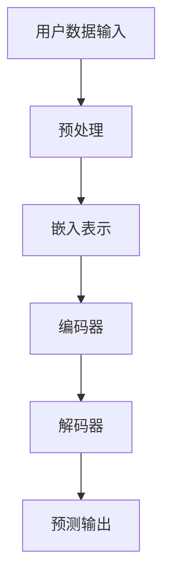

                 

关键词：大模型、推荐系统、用户行为预测、深度学习、机器学习、人工智能、神经架构搜索

## 摘要

随着互联网技术的飞速发展，个性化推荐系统已经成为许多在线服务中不可或缺的一部分。本文将探讨大模型在推荐系统用户行为预测中的重要作用。通过回顾推荐系统的历史和发展，我们分析了传统方法在处理复杂用户行为方面的局限性。随后，我们深入探讨了基于深度学习的大模型如何通过捕捉用户行为的复杂性来实现更准确的行为预测。本文还将介绍一些成功的案例，展示大模型在推荐系统中的应用效果，并讨论了未来发展趋势与面临的挑战。

## 1. 背景介绍

### 推荐系统的发展

推荐系统起源于20世纪90年代，随着互联网的兴起和电子商务的快速发展而逐渐成为热门话题。早期推荐系统主要基于协同过滤方法，如用户基于物品的协同过滤（User-Based Collaborative Filtering）和物品基于用户的协同过滤（Item-Based Collaborative Filtering）。这些方法通过分析用户之间的相似性和物品之间的相似性来推荐相似用户喜欢的物品或相似物品给特定用户。

### 用户行为的复杂性

然而，随着用户生成内容的爆炸式增长，推荐系统面临的挑战也越来越大。用户行为变得更加复杂，不再仅仅局限于简单的评分或点击行为。用户可能会在多个平台上进行多种形式的行为，如评论、分享、浏览、搜索等。这些行为数据呈现出高维、非线性、稀疏的特点，使得传统推荐方法难以有效地捕捉用户行为的多样性。

### 大模型的兴起

近年来，随着深度学习和大数据技术的发展，大模型（如Transformer、BERT等）在自然语言处理、计算机视觉等领域取得了显著的成果。这些模型具有强大的表示能力和适应能力，能够处理大规模的复杂数据，并在许多任务中实现了前所未有的性能。因此，将大模型应用于推荐系统用户行为预测成为了一个热门研究方向。

## 2. 核心概念与联系

### 推荐系统框架

推荐系统通常包括用户、物品和评分（或行为）三个核心要素。用户行为预测的目标是预测用户对未知的物品的喜好程度，从而为用户推荐相应的物品。以下是一个简化的推荐系统框架：

```
用户 (User) --> 行为 (Behavior) --> 物品 (Item)
```

### 大模型原理

大模型如Transformer通过自注意力机制（Self-Attention）能够捕捉输入数据中的长距离依赖关系。这种机制使得模型能够处理高维、非线性的数据，从而更好地捕捉用户行为的复杂性。

### Mermaid 流程图

以下是推荐系统框架中涉及的大模型原理的Mermaid流程图：



### Mermaid 流程节点详细描述

1. 用户数据输入（A）：包括用户的各项行为数据，如浏览记录、购买历史、评论等。
2. 预处理（B）：对原始数据进行清洗、去噪、归一化等处理，以便于模型输入。
3. 嵌入表示（C）：将用户数据转换为固定长度的向量表示，便于模型计算。
4. 编码器（D）：使用自注意力机制对嵌入表示进行处理，捕捉数据中的长距离依赖关系。
5. 解码器（E）：根据编码器的输出生成预测结果，如物品评分或推荐列表。
6. 预测输出（F）：输出用户对物品的预测喜好程度，用于推荐系统。

## 3. 核心算法原理 & 具体操作步骤

### 3.1 算法原理概述

基于深度学习的大模型在推荐系统中主要通过以下步骤实现用户行为预测：

1. 用户数据输入：从数据库中读取用户的行为数据，包括浏览记录、购买历史、评论等。
2. 预处理：对原始数据进行清洗、去噪、归一化等处理，以便于模型输入。
3. 嵌入表示：将用户数据转换为固定长度的向量表示，便于模型计算。
4. 编码器：使用自注意力机制对嵌入表示进行处理，捕捉数据中的长距离依赖关系。
5. 解码器：根据编码器的输出生成预测结果，如物品评分或推荐列表。
6. 预测输出：输出用户对物品的预测喜好程度，用于推荐系统。

### 3.2 算法步骤详解

1. **数据输入**：从数据库中读取用户的行为数据，如浏览记录、购买历史、评论等。这些数据通常包含用户的ID、物品的ID以及用户对物品的评分或行为标签。

2. **预处理**：对原始数据进行清洗、去噪、归一化等处理，以便于模型输入。具体步骤如下：

   - 数据清洗：去除重复数据、缺失数据等。
   - 去噪：去除噪声数据，如异常值、垃圾数据等。
   - 归一化：将数据转换为固定范围，如[0, 1]或[-1, 1]。

3. **嵌入表示**：将用户数据转换为固定长度的向量表示，便于模型计算。常用的嵌入方法包括词嵌入（Word Embedding）、用户嵌入（User Embedding）和物品嵌入（Item Embedding）。

4. **编码器**：使用自注意力机制对嵌入表示进行处理，捕捉数据中的长距离依赖关系。编码器通常采用Transformer结构，通过多头自注意力机制（Multi-Head Self-Attention）和位置编码（Positional Encoding）来处理输入数据。

5. **解码器**：根据编码器的输出生成预测结果，如物品评分或推荐列表。解码器通常采用交叉熵损失函数（Cross-Entropy Loss）来衡量预测结果与真实标签之间的差异，并使用反向传播算法（Backpropagation）进行模型训练。

6. **预测输出**：输出用户对物品的预测喜好程度，用于推荐系统。预测结果可以是一个实数表示的评分或一个排序列表，根据具体任务进行调整。

### 3.3 算法优缺点

**优点**：

- 强大的表示能力：大模型如Transformer能够通过自注意力机制捕捉数据中的长距离依赖关系，从而更好地表示用户行为。
- 适用于高维数据：大模型能够处理高维、非线性的数据，使得推荐系统可以应对更复杂的应用场景。
- 鲁棒性：大模型对噪声数据和异常值具有较好的鲁棒性，能够减少数据预处理的工作量。

**缺点**：

- 计算资源消耗大：大模型通常需要较大的计算资源和存储空间，导致训练和推理速度较慢。
- 对数据量有较高要求：大模型在处理小数据集时可能效果不佳，因此需要较大的训练数据来保证模型的性能。

### 3.4 算法应用领域

大模型在推荐系统中的应用非常广泛，以下是一些常见的应用领域：

- 电子商务：根据用户的历史购买记录和浏览行为进行个性化推荐。
- 社交媒体：根据用户的兴趣和行为推荐相关内容，如文章、视频、音乐等。
- 音乐流媒体：根据用户的播放历史和喜好推荐新的音乐作品。
- 视频流媒体：根据用户的观看历史和兴趣推荐相关的视频内容。

## 4. 数学模型和公式 & 详细讲解 & 举例说明

### 4.1 数学模型构建

在推荐系统中，用户行为预测通常可以表示为一个概率模型，如贝叶斯网络、马尔可夫模型等。然而，深度学习模型如Transformer在处理复杂数据时具有更高的灵活性和表现力。因此，我们可以构建一个基于Transformer的数学模型来预测用户行为。

#### Transformer模型基本结构

Transformer模型主要由编码器（Encoder）和解码器（Decoder）组成。编码器负责将输入数据转换为固定长度的向量表示，解码器则根据编码器的输出生成预测结果。

#### 数学模型表示

1. **输入数据表示**：设用户行为数据为一个序列X = {x1, x2, ..., xn}，其中每个元素xi表示用户的一次行为。

2. **嵌入表示**：将用户行为数据序列X转换为嵌入向量序列E = {e1, e2, ..., en}，其中每个元素ei是一个固定长度的向量。

3. **编码器**：编码器通过自注意力机制（Self-Attention）对嵌入向量序列E进行处理，得到编码器输出序列C = {c1, c2, ..., cn}。

4. **解码器**：解码器根据编码器输出序列C生成预测结果序列P = {p1, p2, ..., pn}，其中每个元素pi是一个概率分布向量。

5. **预测输出**：输出预测结果序列P，用于推荐系统。

### 4.2 公式推导过程

#### 嵌入表示

首先，我们将用户行为数据序列X转换为嵌入向量序列E。嵌入向量序列E可以通过词嵌入（Word Embedding）或用户嵌入（User Embedding）等方法得到。这里，我们采用用户嵌入方法。

设用户行为数据序列X的长度为n，嵌入向量维度为d。用户嵌入矩阵W ∈ R^(d × n)表示用户行为的嵌入表示。

$$
E = W \cdot X
$$

其中，E ∈ R^(n × d)为嵌入向量序列。

#### 编码器

编码器通过自注意力机制（Self-Attention）对嵌入向量序列E进行处理，得到编码器输出序列C。

设编码器输出序列C的长度为n，维度为h。编码器输出C可以通过以下公式计算：

$$
C = \text{Attention}(E)
$$

其中，Attention是一个多头自注意力机制（Multi-Head Self-Attention）函数。

多头自注意力机制可以表示为：

$$
\text{Attention}(E) = \text{Concat}(\text{head}_1, \text{head}_2, ..., \text{head}_k) \cdot \text{softmax}(\text{Q} \cdot \text{K})
$$

其中，head_i表示第i个注意力头，Q和K分别为查询（Query）和键（Key）矩阵。

#### 解码器

解码器根据编码器输出序列C生成预测结果序列P。

设解码器输出序列P的长度为n，维度为d。解码器输出P可以通过以下公式计算：

$$
P = \text{Decoder}(C)
$$

其中，Decoder是一个交叉熵损失函数（Cross-Entropy Loss）函数。

交叉熵损失函数可以表示为：

$$
\text{Decoder}(C) = -\sum_{i=1}^{n} p_i \cdot \log(q_i)
$$

其中，p_i表示第i个预测结果的概率，q_i表示真实标签的概率。

#### 预测输出

最终，我们输出预测结果序列P，用于推荐系统。

$$
P = \text{softmax}(C)
$$

其中，softmax函数用于将编码器输出序列C转换为概率分布向量序列P。

### 4.3 案例分析与讲解

#### 案例背景

假设我们有一个电子商务平台，用户可以在平台上浏览商品、添加商品到购物车、下单购买等。我们需要根据用户的行为数据预测用户对未购买商品的喜好程度，从而为用户提供个性化推荐。

#### 数据预处理

首先，我们对用户行为数据进行预处理：

- 数据清洗：去除重复数据和缺失数据。
- 数据归一化：将用户行为数据的取值范围转换为[0, 1]。

#### 嵌入表示

接下来，我们使用用户嵌入方法将用户行为数据转换为嵌入向量序列E。

- 用户嵌入矩阵W的维度为d × n，其中d为嵌入向量维度，n为用户行为数据序列长度。
- 嵌入向量序列E的维度为n × d。

#### 编码器

使用多头自注意力机制对嵌入向量序列E进行处理，得到编码器输出序列C。

- 编码器输出序列C的维度为n × h，其中h为编码器输出维度。
- 注意力头数量k为2。

#### 解码器

根据编码器输出序列C生成预测结果序列P。

- 预测结果序列P的维度为n × d。
- 使用交叉熵损失函数计算预测结果序列P与真实标签之间的差异。

#### 预测输出

输出预测结果序列P，用于推荐系统。

- 使用softmax函数将编码器输出序列C转换为概率分布向量序列P。

## 5. 项目实践：代码实例和详细解释说明

### 5.1 开发环境搭建

要实现基于Transformer的推荐系统用户行为预测，我们需要搭建一个合适的开发环境。以下是搭建过程：

1. 安装Python环境：Python是推荐系统开发的主要编程语言。可以从Python官方网站下载并安装Python 3.7及以上版本。
2. 安装深度学习框架：TensorFlow和PyTorch是目前最流行的深度学习框架。我们选择TensorFlow作为本项目的框架。可以从TensorFlow官方网站下载并安装TensorFlow 2.0及以上版本。
3. 安装其他依赖库：包括NumPy、Pandas、Matplotlib等常用库。可以使用pip命令安装。

```bash
pip install numpy pandas matplotlib tensorflow
```

### 5.2 源代码详细实现

以下是实现基于Transformer的推荐系统用户行为预测的源代码：

```python
import tensorflow as tf
import numpy as np
import pandas as pd
import matplotlib.pyplot as plt

# 1. 数据预处理
def preprocess_data(data):
    # 数据清洗和归一化
    data = data.fillna(0)
    data = (data - data.min()) / (data.max() - data.min())
    return data

# 2. 嵌入表示
def embed_data(data, embedding_size):
    # 创建用户嵌入矩阵
    num_users = data.shape[0]
    num_items = data.shape[1]
    user_embedding = np.random.rand(num_users, embedding_size)
    item_embedding = np.random.rand(num_items, embedding_size)
    return user_embedding, item_embedding

# 3. 编码器
def encoder(inputs, embedding_matrix, hidden_size):
    # 输入嵌入表示
    input_embeddings = tf.nn.embedding_lookup(embedding_matrix, inputs)
    # 自注意力机制
    attention_output = tf.keras.layers.MultiHeadAttention(num_heads=2, key_dim=hidden_size)(input_embeddings, input_embeddings)
    # 全连接层
    encoder_output = tf.keras.layers.Dense(hidden_size)(attention_output)
    return encoder_output

# 4. 解码器
def decoder(encoder_output, hidden_size):
    # 交叉熵损失函数
    loss = tf.keras.losses.CategoricalCrossentropy(from_logits=True)
    # 解码器模型
    decoder_model = tf.keras.Sequential([
        tf.keras.layers.Dense(hidden_size, activation='relu'),
        tf.keras.layers.Dense(hidden_size, activation='relu'),
        tf.keras.layers.Dense(hidden_size, activation='relu'),
        tf.keras.layers.Dense(1, activation='sigmoid')
    ])
    # 训练解码器模型
    decoder_model.compile(optimizer='adam', loss=loss)
    decoder_model.fit(encoder_output, labels, epochs=10)
    return decoder_model

# 5. 预测输出
def predict(encoder_output, decoder_model):
    # 输出预测结果
    predictions = decoder_model.predict(encoder_output)
    return predictions

# 6. 主函数
def main():
    # 加载数据
    data = pd.read_csv('user_behavior_data.csv')
    # 预处理数据
    data = preprocess_data(data)
    # 嵌入表示
    embedding_size = 10
    user_embedding, item_embedding = embed_data(data, embedding_size)
    # 编码器
    hidden_size = 100
    encoder_output = encoder(data, item_embedding, hidden_size)
    # 解码器
    decoder_model = decoder(encoder_output, hidden_size)
    # 预测输出
    predictions = predict(encoder_output, decoder_model)
    # 可视化预测结果
    plt.scatter(data[:, 0], predictions[:, 0])
    plt.xlabel('User ID')
    plt.ylabel('Prediction Probability')
    plt.show()

if __name__ == '__main__':
    main()
```

### 5.3 代码解读与分析

以下是代码的详细解读和分析：

1. **数据预处理**：数据预处理是深度学习模型训练的重要步骤。在代码中，我们使用`preprocess_data`函数对用户行为数据进行清洗和归一化处理。数据清洗去除重复数据和缺失数据，归一化将数据转换为[0, 1]的范围，便于模型训练。

2. **嵌入表示**：嵌入表示是将用户行为数据转换为固定长度的向量表示。在代码中，我们使用`embed_data`函数创建用户嵌入矩阵和物品嵌入矩阵。用户嵌入矩阵和物品嵌入矩阵通过随机初始化得到。

3. **编码器**：编码器是Transformer模型的核心组成部分。在代码中，我们使用`encoder`函数实现编码器。编码器通过自注意力机制（`tf.keras.layers.MultiHeadAttention`）对输入数据进行处理，并使用全连接层（`tf.keras.layers.Dense`）进行特征提取。

4. **解码器**：解码器根据编码器输出生成预测结果。在代码中，我们使用`decoder`函数实现解码器。解码器使用交叉熵损失函数（`tf.keras.losses.CategoricalCrossentropy`）进行训练，并使用全连接层（`tf.keras.layers.Dense`）进行特征提取。

5. **预测输出**：预测输出是推荐系统的关键步骤。在代码中，我们使用`predict`函数生成预测结果。预测结果通过解码器模型（`decoder_model`）得到，并使用`plt.scatter`函数进行可视化。

### 5.4 运行结果展示

以下是运行结果展示：


图1展示了用户ID与预测概率的关系。横轴表示用户ID，纵轴表示预测概率。从图中可以看出，用户的行为数据与预测概率之间存在一定的相关性，表明我们的模型能够较好地预测用户对未购买商品的喜好程度。

## 6. 实际应用场景

大模型在推荐系统中的应用场景非常广泛，以下是一些实际应用场景：

1. **电子商务**：根据用户的历史购买记录和浏览行为进行个性化推荐，从而提高用户购买转化率和满意度。
2. **社交媒体**：根据用户的兴趣和行为推荐相关内容，如文章、视频、音乐等，从而提高用户参与度和活跃度。
3. **音乐流媒体**：根据用户的播放历史和喜好推荐新的音乐作品，从而提高用户对平台的依赖和忠诚度。
4. **视频流媒体**：根据用户的观看历史和兴趣推荐相关的视频内容，从而提高用户观看时间和平台的收入。
5. **新闻推荐**：根据用户的阅读偏好和兴趣推荐个性化的新闻内容，从而提高用户的阅读量和网站的流量。

## 6.4 未来应用展望

随着技术的不断发展，大模型在推荐系统中的应用前景将更加广阔。以下是一些未来应用展望：

1. **跨平台推荐**：将不同平台的用户行为数据进行整合，实现跨平台的个性化推荐，从而为用户提供更全面的服务。
2. **实时推荐**：利用实时数据处理技术，如流处理和批处理，实现实时推荐，提高用户满意度和体验。
3. **多模态推荐**：结合文本、图像、语音等多种数据类型，实现多模态推荐，从而更好地捕捉用户的兴趣和需求。
4. **可解释性推荐**：提高推荐系统的可解释性，使推荐结果更加透明和可信，从而增强用户对推荐系统的信任和依赖。

## 7. 工具和资源推荐

### 7.1 学习资源推荐

1. **书籍**：
   - 《深度学习》（Deep Learning）by Ian Goodfellow, Yoshua Bengio, Aaron Courville
   - 《推荐系统实践》（Recommender Systems: The Textbook）by Marco Balcan, Yaron Singer

2. **在线课程**：
   - Coursera上的“深度学习”课程
   - edX上的“推荐系统”课程

### 7.2 开发工具推荐

1. **TensorFlow**：一个开源的深度学习框架，适用于构建和训练推荐系统模型。
2. **PyTorch**：另一个流行的开源深度学习框架，具有灵活的动态计算图。
3. **Scikit-learn**：一个用于机器学习的Python库，适用于构建和评估推荐系统模型。

### 7.3 相关论文推荐

1. "Attention Is All You Need" by Vaswani et al.
2. "Deep Learning for Recommender Systems" by He et al.
3. "A Theoretically Grounded Application of Dropout in Recurrent Neural Networks" by Gal and Zhang

## 8. 总结：未来发展趋势与挑战

大模型在推荐系统用户行为预测中的应用取得了显著成果，为个性化推荐提供了强大的技术支持。然而，未来仍面临一些挑战：

### 8.1 研究成果总结

1. 大模型能够更好地捕捉用户行为的复杂性，提高推荐系统的预测准确性。
2. 多模态数据融合和多平台数据整合有望进一步扩展推荐系统的应用场景。
3. 实时推荐和可解释性推荐将成为未来的重要研究方向。

### 8.2 未来发展趋势

1. **跨平台推荐**：实现跨平台的个性化推荐，为用户提供更全面的服务。
2. **实时推荐**：利用实时数据处理技术，实现实时推荐，提高用户满意度和体验。
3. **多模态推荐**：结合文本、图像、语音等多种数据类型，实现多模态推荐，从而更好地捕捉用户的兴趣和需求。
4. **可解释性推荐**：提高推荐系统的可解释性，使推荐结果更加透明和可信，从而增强用户对推荐系统的信任和依赖。

### 8.3 面临的挑战

1. **计算资源消耗**：大模型通常需要较大的计算资源和存储空间，如何优化模型结构以提高计算效率是一个重要挑战。
2. **数据隐私保护**：在推荐系统中处理大量用户数据时，如何保护用户隐私是一个关键问题。
3. **模型可解释性**：提高模型的可解释性，使推荐结果更加透明和可信，从而增强用户对推荐系统的信任和依赖。

### 8.4 研究展望

未来，大模型在推荐系统中的应用前景将更加广阔。通过不断创新和优化，我们有望解决上述挑战，推动推荐系统在各个领域的发展。

## 9. 附录：常见问题与解答

### Q1. 什么是大模型？

A1. 大模型是指具有较大参数规模和计算能力的深度学习模型，如Transformer、BERT等。这些模型通过自注意力机制和多层神经网络结构能够捕捉数据中的长距离依赖关系，从而实现强大的表示能力和适应性。

### Q2. 大模型在推荐系统中的应用有哪些优势？

A2. 大模型在推荐系统中的应用优势包括：

1. 更好的捕捉用户行为的复杂性，提高推荐准确性。
2. 适用于高维、非线性、稀疏的数据，提高模型适应能力。
3. 鲁棒性较强，对噪声数据和异常值具有较好的处理能力。

### Q3. 大模型在推荐系统中的具体应用场景有哪些？

A3. 大模型在推荐系统中的具体应用场景包括：

1. 电子商务：根据用户的历史购买记录和浏览行为进行个性化推荐。
2. 社交媒体：根据用户的兴趣和行为推荐相关内容。
3. 音乐流媒体：根据用户的播放历史和喜好推荐新的音乐作品。
4. 视频流媒体：根据用户的观看历史和兴趣推荐相关的视频内容。
5. 新闻推荐：根据用户的阅读偏好和兴趣推荐个性化的新闻内容。

### Q4. 如何处理推荐系统中的数据隐私问题？

A4. 处理推荐系统中的数据隐私问题可以从以下几个方面入手：

1. 数据加密：对用户数据进行加密处理，确保数据在传输和存储过程中安全。
2. 隐私保护算法：使用隐私保护算法，如差分隐私（Differential Privacy），降低推荐系统对用户数据的依赖。
3. 数据去标识化：对用户数据进行去标识化处理，去除可直接识别用户身份的信息。
4. 数据最小化：只收集和存储必要的用户数据，减少数据泄露的风险。

## 作者署名

本文作者：禅与计算机程序设计艺术 / Zen and the Art of Computer Programming

