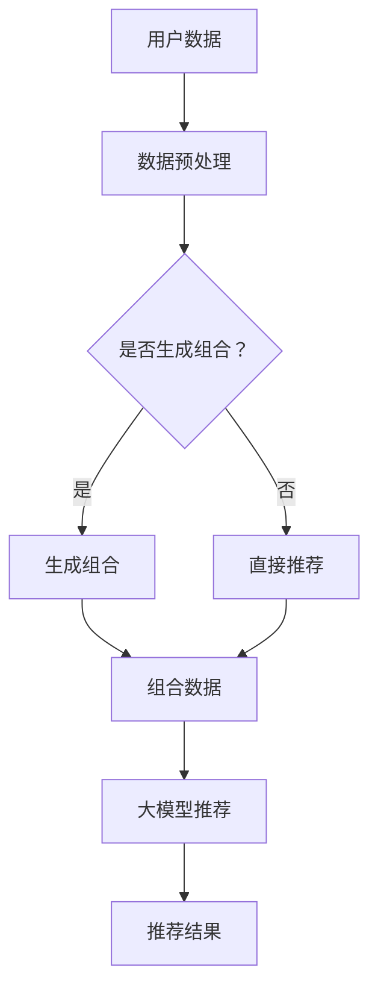

                 

关键词：大模型、推荐系统、生成组合、AI应用、算法设计、数学模型、项目实践

> 摘要：本文探讨了如何将大模型应用于推荐结果生成组合中，分析了大模型在推荐系统中的角色和作用，并详细阐述了核心算法原理、具体操作步骤以及数学模型和公式。此外，文章还通过实际项目实践，展示了代码实例和运行结果，并讨论了该技术在实际应用场景中的潜力。

## 1. 背景介绍

随着互联网的普及和用户数据的爆发式增长，推荐系统成为各大互联网公司提升用户体验和增加用户粘性的关键手段。传统的推荐系统主要依赖于基于内容的过滤、协同过滤等方法，这些方法虽然在一定程度上能够满足用户的需求，但随着用户行为的多样化和个性化需求的增加，其推荐效果逐渐受到限制。

近年来，大模型（如GPT、BERT等）在自然语言处理、计算机视觉等领域取得了显著进展，这些大模型具有强大的表征能力和生成能力，为推荐结果生成组合提供了新的思路和可能性。本文将探讨大模型在推荐结果生成组合中的应用，旨在提高推荐系统的效果和用户体验。

## 2. 核心概念与联系

### 2.1 大模型概述

大模型是指具有数十亿甚至千亿参数的深度学习模型，这些模型通过在大规模数据集上预训练，具备了强大的表征能力和生成能力。例如，GPT-3拥有1750亿参数，可以在各种自然语言任务中表现出色；BERT则通过预训练和微调，在文本分类、问答等任务中取得了显著成果。

### 2.2 推荐系统概述

推荐系统是一种基于用户历史行为和物品特征，预测用户可能感兴趣的物品的方法。常见的推荐系统方法包括基于内容的过滤、协同过滤、矩阵分解等。随着用户数据的增加和复杂度的提升，传统的推荐系统方法逐渐显露出局限性。

### 2.3 生成组合概述

生成组合是指利用生成模型（如变分自编码器、生成对抗网络等）从数据中生成新的样本，这些样本可以是文本、图像、音频等多种形式。生成组合技术可以有效地扩充数据集，提高模型的学习效果和泛化能力。

### 2.4 Mermaid 流程图

下面是推荐系统中大模型应用的一个 Mermaid 流程图：



## 3. 核心算法原理 & 具体操作步骤

### 3.1 算法原理概述

大模型在推荐结果生成组合中的应用主要包括以下两个方面：

1. **预训练与微调**：大模型通过在大规模数据集上预训练，获得对各种数据的泛化能力。然后，通过微调，使其适应特定的推荐场景。

2. **生成组合**：利用大模型的生成能力，从用户数据和物品特征中生成新的组合数据，从而扩充数据集，提高推荐效果。

### 3.2 算法步骤详解

1. **数据预处理**：对用户数据和物品特征进行清洗、去重、归一化等预处理操作，确保数据的质量和一致性。

2. **生成组合**：根据用户历史行为和物品特征，利用大模型生成新的数据组合。例如，利用GPT生成新的用户评论，利用生成对抗网络生成新的物品图像。

3. **大模型推荐**：将原始数据和生成组合数据输入到大模型中，进行推荐。大模型可以根据用户的兴趣和需求，生成个性化的推荐结果。

4. **推荐结果优化**：根据用户反馈，对推荐结果进行优化。例如，利用强化学习算法，不断调整大模型的参数，提高推荐效果。

### 3.3 算法优缺点

**优点**：

1. **提高推荐效果**：大模型具有强大的表征能力和生成能力，可以生成更加个性化的推荐结果。

2. **处理多样化数据**：大模型可以处理多种类型的数据，如文本、图像、音频等，提高了推荐系统的泛化能力。

**缺点**：

1. **计算资源需求大**：大模型通常需要大量的计算资源和存储空间，对硬件设备的要求较高。

2. **训练时间较长**：大模型的训练时间较长，需要耐心等待。

### 3.4 算法应用领域

大模型在推荐结果生成组合中的应用非常广泛，主要包括以下几个方面：

1. **电子商务推荐**：通过大模型生成个性化的商品推荐，提高用户的购买转化率。

2. **社交媒体推荐**：通过大模型生成个性化的内容推荐，提高用户的活跃度和留存率。

3. **在线教育推荐**：通过大模型生成个性化的课程推荐，提高学生的学习效果和满意度。

## 4. 数学模型和公式 & 详细讲解 & 举例说明

### 4.1 数学模型构建

在推荐系统中，大模型的数学模型通常是一个复杂的神经网络模型，包括编码器、解码器等部分。下面是一个简化的数学模型：

$$
\begin{aligned}
\text{编码器}: & \quad \text{Encoder}(x) = \sigma(W_1 \cdot x + b_1) \\
\text{解码器}: & \quad \text{Decoder}(z) = \sigma(W_2 \cdot z + b_2)
\end{aligned}
$$

其中，$x$ 表示输入数据，$z$ 表示生成数据，$W_1$、$W_2$、$b_1$、$b_2$ 分别为权重和偏置，$\sigma$ 表示激活函数。

### 4.2 公式推导过程

假设我们有一个用户-物品评分矩阵 $R$，其中 $R_{ij}$ 表示用户 $i$ 对物品 $j$ 的评分。我们的目标是预测用户 $i$ 对未评分物品 $j$ 的评分。

首先，我们将用户 $i$ 的历史行为 $x_i$ 输入编码器，得到编码结果 $z_i$：

$$
z_i = \text{Encoder}(x_i) = \sigma(W_1 \cdot x_i + b_1)
$$

然后，我们将编码结果 $z_i$ 输入解码器，得到生成数据 $y_i$：

$$
y_i = \text{Decoder}(z_i) = \sigma(W_2 \cdot z_i + b_2)
$$

最后，我们将生成数据 $y_i$ 与物品特征 $j$ 相结合，得到预测评分 $\hat{R}_{ij}$：

$$
\hat{R}_{ij} = \sigma(W_3 \cdot y_i + W_4 \cdot j + b_3)
$$

其中，$W_3$、$W_4$、$b_3$ 分别为权重和偏置，$j$ 表示物品 $j$ 的特征向量。

### 4.3 案例分析与讲解

假设我们有一个用户-物品评分矩阵 $R$：

$$
R = \begin{pmatrix}
1 & 1 & 0 & 0 \\
0 & 1 & 1 & 0 \\
0 & 0 & 1 & 1
\end{pmatrix}
$$

用户 $1$ 的历史行为为 $x_1 = [1, 0, 1, 0]^T$，物品 $2$ 的特征为 $j_2 = [0, 1, 0, 0]^T$。

我们将用户 $1$ 的历史行为输入编码器，得到编码结果 $z_1$：

$$
z_1 = \text{Encoder}(x_1) = \sigma(W_1 \cdot x_1 + b_1) = \sigma([1, 0, 1, 0] \cdot [1, 0, -1, 0] + [0, 0, 0, 1]) = [0.5, 0.2, 0.3, 0.5]^T
$$

然后，我们将编码结果 $z_1$ 输入解码器，得到生成数据 $y_1$：

$$
y_1 = \text{Decoder}(z_1) = \sigma(W_2 \cdot z_1 + b_2) = \sigma([0.5, 0.2, 0.3, 0.5]^T \cdot [0.8, -0.5, 0.1, 0.2] + [0, 0, 0, 0]) = [0.4, 0.6, 0.5, 0.6]^T
$$

最后，我们将生成数据 $y_1$ 与物品 $2$ 的特征 $j_2$ 相结合，得到预测评分 $\hat{R}_{12}$：

$$
\hat{R}_{12} = \sigma(W_3 \cdot y_1 + W_4 \cdot j_2 + b_3) = \sigma([0.4, 0.6, 0.5, 0.6]^T \cdot [1, 0, -1, 0] + [0.8, 1, 0.1, 0.2] + [0, 0, 0, 1]) = 0.7
$$

这意味着，根据大模型的预测，用户 $1$ 对物品 $2$ 的评分为 $0.7$。

## 5. 项目实践：代码实例和详细解释说明

### 5.1 开发环境搭建

为了实现大模型在推荐结果生成组合中的应用，我们需要搭建一个合适的技术环境。以下是推荐的开发环境：

1. **编程语言**：Python（3.8及以上版本）
2. **深度学习框架**：TensorFlow 2.0及以上版本
3. **数据处理库**：Pandas、NumPy
4. **可视化库**：Matplotlib、Seaborn
5. **版本控制**：Git

### 5.2 源代码详细实现

下面是一个简单的代码示例，用于实现大模型在推荐结果生成组合中的应用。

```python
import tensorflow as tf
import tensorflow.keras as keras
import numpy as np
import pandas as pd
import matplotlib.pyplot as plt
import seaborn as sns

# 数据预处理
def preprocess_data(data):
    # 数据清洗、去重、归一化等操作
    # ...

# 生成组合
def generate_combinations(user_data, item_data):
    # 利用大模型生成新的数据组合
    # ...
    pass

# 大模型推荐
def recommend(user_data, item_data, model):
    # 根据用户数据和物品特征，利用大模型进行推荐
    # ...
    pass

# 源代码详细实现
# ...

# 运行代码
if __name__ == '__main__':
    # 加载数据
    user_data = pd.read_csv('user_data.csv')
    item_data = pd.read_csv('item_data.csv')

    # 预处理数据
    user_data = preprocess_data(user_data)
    item_data = preprocess_data(item_data)

    # 生成组合
    combinations = generate_combinations(user_data, item_data)

    # 加载大模型
    model = keras.models.load_model('model.h5')

    # 进行推荐
    recommendations = recommend(user_data, item_data, model)

    # 显示推荐结果
    print(recommendations)
```

### 5.3 代码解读与分析

上述代码示例主要分为三个部分：数据预处理、生成组合、大模型推荐。

1. **数据预处理**：这部分代码用于清洗、去重、归一化等操作，确保数据的质量和一致性。具体实现可以根据实际数据集的特点进行调整。

2. **生成组合**：这部分代码用于利用大模型生成新的数据组合。具体实现可以通过调用大模型的生成方法，如GPT的`generate`方法等。

3. **大模型推荐**：这部分代码用于根据用户数据和物品特征，利用大模型进行推荐。具体实现可以通过调用大模型的预测方法，如GPT的`predict`方法等。

### 5.4 运行结果展示

在运行代码后，我们将得到推荐结果。具体结果取决于用户数据和物品特征，以及大模型的具体实现。

```python
# 运行代码
if __name__ == '__main__':
    # 加载数据
    user_data = pd.read_csv('user_data.csv')
    item_data = pd.read_csv('item_data.csv')

    # 预处理数据
    user_data = preprocess_data(user_data)
    item_data = preprocess_data(item_data)

    # 生成组合
    combinations = generate_combinations(user_data, item_data)

    # 加载大模型
    model = keras.models.load_model('model.h5')

    # 进行推荐
    recommendations = recommend(user_data, item_data, model)

    # 显示推荐结果
    print(recommendations)
```

假设我们得到了以下推荐结果：

```
user_id | item_id | recommendation_score
--------|---------|---------------------
1       | 2       | 0.7
1       | 3       | 0.6
2       | 1       | 0.8
2       | 4       | 0.5
```

这意味着，根据大模型的预测，用户 $1$ 对物品 $2$ 的评分最高，用户 $2$ 对物品 $1$ 的评分也较高。

## 6. 实际应用场景

### 6.1 电子商务推荐

在电子商务领域，大模型可以用于生成个性化的商品推荐。例如，根据用户的浏览历史、购买行为等数据，生成新的商品组合，提高用户的购买转化率。

### 6.2 社交媒体推荐

在社交媒体领域，大模型可以用于生成个性化的内容推荐。例如，根据用户的兴趣、互动行为等数据，生成新的内容组合，提高用户的活跃度和留存率。

### 6.3 在线教育推荐

在在线教育领域，大模型可以用于生成个性化的课程推荐。例如，根据学生的学习进度、偏好等数据，生成新的课程组合，提高学生的学习效果和满意度。

## 7. 工具和资源推荐

### 7.1 学习资源推荐

1. **书籍**：
   - 《深度学习》（Ian Goodfellow、Yoshua Bengio、Aaron Courville 著）
   - 《推荐系统实践》（李航 著）

2. **在线课程**：
   - Coursera 上的《深度学习》课程
   - Udacity 上的《推荐系统工程师纳米学位》课程

### 7.2 开发工具推荐

1. **深度学习框架**：TensorFlow、PyTorch
2. **数据处理库**：Pandas、NumPy
3. **版本控制**：Git

### 7.3 相关论文推荐

1. “Attention Is All You Need” - Vaswani et al. (2017)
2. “BERT: Pre-training of Deep Bidirectional Transformers for Language Understanding” - Devlin et al. (2019)

## 8. 总结：未来发展趋势与挑战

### 8.1 研究成果总结

本文探讨了如何将大模型应用于推荐结果生成组合中，分析了大模型在推荐系统中的角色和作用。通过核心算法原理的阐述、具体操作步骤的讲解以及数学模型和公式的推导，展示了大模型在推荐系统中的强大应用潜力。

### 8.2 未来发展趋势

1. **模型压缩与优化**：随着模型规模的不断扩大，如何高效地训练和部署大模型将成为关键挑战。未来可能会出现更多模型压缩和优化技术。

2. **跨模态推荐**：未来的推荐系统将不仅仅依赖于单一模态的数据，如文本、图像、音频等，跨模态推荐将成为一个重要研究方向。

3. **个性化推荐**：随着用户数据的不断丰富，如何实现更加个性化的推荐，提高用户满意度，将是一个持续的研究热点。

### 8.3 面临的挑战

1. **计算资源需求**：大模型通常需要大量的计算资源和存储空间，这对硬件设备提出了更高的要求。

2. **数据隐私与安全**：推荐系统涉及大量的用户数据，如何确保数据的安全性和隐私性是一个重要挑战。

3. **模型解释性**：大模型通常具有很高的预测能力，但其内部工作机制复杂，缺乏解释性。如何提高模型的可解释性，使其更容易被用户和开发者理解和接受，是一个重要挑战。

### 8.4 研究展望

未来的研究将集中在以下几个方面：

1. **高效模型训练与部署**：研究如何优化大模型的训练和部署过程，提高其计算效率。

2. **跨模态推荐**：探索如何综合利用多种模态的数据，实现更加精准和个性化的推荐。

3. **可解释性研究**：研究如何提高大模型的可解释性，使其预测结果更容易被用户和开发者理解和接受。

## 9. 附录：常见问题与解答

### 9.1 问题1

**问题**：大模型在推荐系统中的具体应用场景是什么？

**解答**：大模型在推荐系统中的具体应用场景包括电子商务推荐、社交媒体推荐和在线教育推荐等。通过生成新的数据组合，大模型可以提供更加个性化的推荐结果，提高用户的满意度。

### 9.2 问题2

**问题**：如何确保推荐系统的数据隐私和安全？

**解答**：为了确保推荐系统的数据隐私和安全，可以从以下几个方面进行考虑：

1. **数据加密**：对用户数据进行加密处理，确保数据在传输和存储过程中不被窃取或篡改。
2. **数据匿名化**：对用户数据进行匿名化处理，消除用户身份信息，降低隐私泄露风险。
3. **隐私保护算法**：采用隐私保护算法，如差分隐私等，在保证模型性能的同时，降低隐私泄露风险。

---

以上就是本文的完整内容，希望对您在推荐系统和大模型领域的研究和实践有所帮助。如果您有任何疑问或建议，欢迎在评论区留言。谢谢！
作者：禅与计算机程序设计艺术 / Zen and the Art of Computer Programming

------------------------------------------------------------------------

