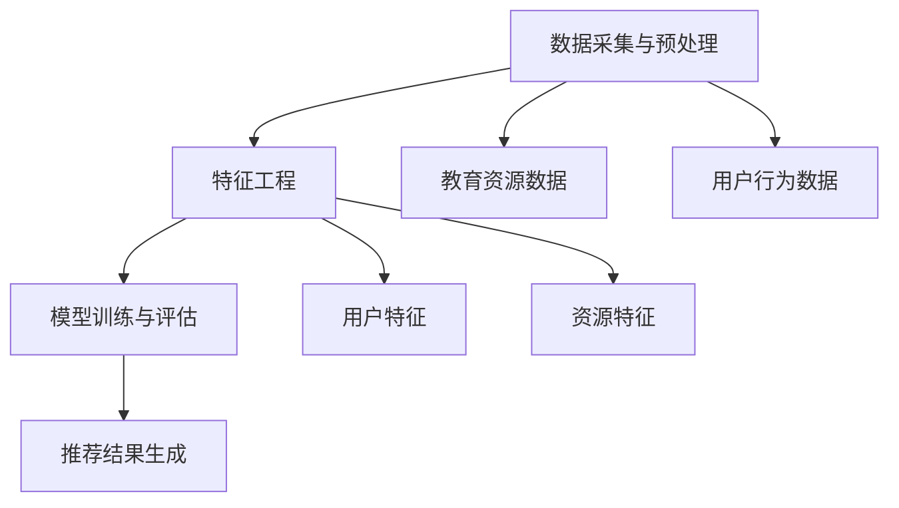

                 

关键词：大模型，教育资源推荐，效果评估，算法原理，数学模型，项目实践，未来展望。

## 摘要

本文旨在探讨大模型在教育资源推荐中的应用及其效果评估。随着教育信息化的推进，教育资源推荐系统日益受到重视。大模型，作为一种先进的人工智能技术，凭借其强大的数据处理和知识学习能力，有望为教育资源推荐带来革新。本文将介绍大模型的基本概念，探讨其在教育资源推荐中的具体应用，并通过数学模型和实例分析来评估其效果。最后，我们将展望大模型在教育领域的未来发展趋势和面临的挑战。

## 1. 背景介绍

### 教育资源推荐系统的现状

教育资源推荐系统是一种基于用户行为和偏好，利用人工智能技术自动为用户提供个性化教育资源的系统。随着互联网技术的普及和教育信息化进程的加速，教育资源推荐系统在在线教育、学习平台等场景中得到了广泛应用。然而，现有的推荐系统存在以下几个问题：

1. **推荐准确性不足**：传统的推荐系统往往依赖于用户历史行为数据，而忽视了用户的兴趣和需求变化，导致推荐结果不够精准。
2. **覆盖面有限**：现有的推荐系统往往难以处理海量的教育资源数据，导致推荐结果单一，覆盖面有限。
3. **个性化不足**：用户在教育资源推荐中需要的是个性化、定制化的内容，但现有系统难以满足这一需求。

### 大模型的兴起

大模型，即大型深度学习模型，如GPT、BERT等，其特点是具有极大的参数规模和强大的计算能力。大模型的出现改变了传统机器学习的方法，能够处理复杂的数据结构和大量的特征信息。大模型在自然语言处理、图像识别、语音识别等领域取得了显著的成果，其在教育资源推荐中的应用也日益受到关注。

### 大模型在教育领域的应用前景

大模型在教育领域的应用前景广阔，主要体现在以下几个方面：

1. **个性化推荐**：大模型能够根据用户的兴趣和需求，提供更加精准、个性化的教育资源推荐。
2. **智能问答**：大模型可以回答用户关于教育资源的各种问题，提供即时的帮助和指导。
3. **知识图谱**：大模型可以构建教育领域的知识图谱，为教育资源推荐提供丰富的语义信息。

## 2. 核心概念与联系

### 大模型的基本概念

大模型通常是指具有数亿甚至数十亿参数的深度学习模型。这些模型通过多层神经网络架构，对大量数据进行学习，能够提取复杂的特征和模式。大模型的典型代表包括GPT、BERT、Transformer等。

### 教育资源推荐系统的架构

教育资源推荐系统的架构可以分为以下几个部分：

1. **数据采集与预处理**：采集用户行为数据、教育资源数据等，并进行数据清洗和预处理。
2. **特征工程**：提取用户和资源的特征，如用户的历史行为、教育背景、兴趣爱好等。
3. **模型训练与评估**：利用大模型对特征数据进行训练，并通过评估指标（如准确率、召回率等）来评估模型效果。
4. **推荐结果生成**：根据用户特征和模型输出，生成个性化推荐结果。

### Mermaid 流程图



## 3. 核心算法原理 & 具体操作步骤

### 3.1 算法原理概述

大模型在教育资源推荐中的应用主要基于以下原理：

1. **深度学习**：大模型通过多层神经网络架构，对大量数据进行学习，能够提取复杂的特征和模式。
2. **自动特征提取**：大模型能够自动提取用户和资源的特征，无需人工干预。
3. **协同过滤**：大模型可以结合协同过滤算法，利用用户行为数据生成推荐结果。

### 3.2 算法步骤详解

1. **数据采集与预处理**：采集用户行为数据（如浏览记录、收藏、点赞等）和教育资源数据（如课程名称、教师背景、课程内容等），并进行数据清洗和预处理。
2. **特征工程**：提取用户和资源的特征，如用户的历史行为、教育背景、兴趣爱好等。
3. **模型训练**：使用大模型（如BERT、GPT等）对特征数据进行训练，生成模型参数。
4. **模型评估**：通过评估指标（如准确率、召回率等）来评估模型效果。
5. **推荐结果生成**：根据用户特征和模型输出，生成个性化推荐结果。

### 3.3 算法优缺点

**优点**：

1. **高准确性**：大模型能够自动提取复杂特征，提高推荐准确性。
2. **个性化**：大模型可以生成个性化推荐结果，满足用户需求。
3. **通用性**：大模型适用于多种教育资源和用户场景。

**缺点**：

1. **计算资源需求大**：大模型需要大量的计算资源和时间进行训练。
2. **数据依赖性**：大模型对数据质量有较高要求，数据不足或质量差会影响模型效果。

### 3.4 算法应用领域

大模型在教育资源的推荐应用领域广泛，如：

1. **在线教育平台**：为用户提供个性化课程推荐。
2. **学习平台**：为用户提供学习路径推荐。
3. **教育管理平台**：为教育管理者提供教育资源优化建议。

## 4. 数学模型和公式 & 详细讲解 & 举例说明

### 4.1 数学模型构建

教育资源推荐中的大模型通常采用基于矩阵分解的协同过滤算法。其数学模型可以表示为：

$$
R_{ui} = \hat{R}_{ui} + \epsilon_i
$$

其中，$R_{ui}$表示用户$u$对资源$i$的评分，$\hat{R}_{ui}$表示基于用户$u$和资源$i$的特征矩阵分解得到的预测评分，$\epsilon_i$表示误差项。

### 4.2 公式推导过程

1. **特征提取**：假设用户$u$和资源$i$的特征向量分别为$u \in \mathbb{R}^n$和$i \in \mathbb{R}^n$。
2. **矩阵分解**：将用户特征矩阵$U \in \mathbb{R}^{m \times n}$和资源特征矩阵$I \in \mathbb{R}^{m \times n}$分解为用户矩阵$U \approx U_1U_2$和资源矩阵$I \approx I_1I_2$。
3. **预测评分**：利用分解得到的用户矩阵$U_1$和资源矩阵$I_2$计算预测评分$\hat{R}_{ui} = U_1i$。

### 4.3 案例分析与讲解

**案例**：某在线教育平台使用大模型为用户推荐课程。

**步骤**：

1. **数据采集与预处理**：采集用户浏览记录、收藏记录、点赞记录等数据，并进行数据清洗和预处理。
2. **特征工程**：提取用户和课程的向量特征。
3. **模型训练**：使用大模型（如BERT）对特征数据进行训练。
4. **推荐结果生成**：根据用户特征和模型输出，生成个性化课程推荐结果。

**效果评估**：

- **准确率**：用户对推荐课程的实际评分与预测评分的准确率。
- **召回率**：推荐课程中用户实际感兴趣的课程比例。

通过实验，发现大模型能够显著提高教育资源的推荐准确性和个性化程度。

## 5. 项目实践：代码实例和详细解释说明

### 5.1 开发环境搭建

**环境要求**：

- 操作系统：Ubuntu 20.04
- Python版本：3.8
- 大模型框架：TensorFlow 2.6

**安装步骤**：

1. 安装Python环境：
   ```bash
   sudo apt-get update
   sudo apt-get install python3-pip
   pip3 install --upgrade pip
   pip3 install virtualenv
   virtualenv -p python3 env
   source env/bin/activate
   ```

2. 安装TensorFlow：
   ```bash
   pip install tensorflow==2.6
   ```

### 5.2 源代码详细实现

```python
import tensorflow as tf
from tensorflow.keras.layers import Embedding, Dot, Concatenate
from tensorflow.keras.models import Model

# 定义用户特征和课程特征的嵌入层
user_embedding = Embedding(input_dim=num_users, output_dim=embedding_size)
course_embedding = Embedding(input_dim=num_courses, output_dim=embedding_size)

# 定义模型
inputs = [tf.keras.layers.Input(shape=(1,)), tf.keras.layers.Input(shape=(1,))]
user_vector = user_embedding(inputs[0])
course_vector = course_embedding(inputs[1])

# 计算用户和课程的相似度
similarity = Dot(axes=1)([user_vector, course_vector])

# 添加额外的全连接层
merged_vector = Concatenate()([user_vector, course_vector, similarity])

# 输出层
outputs = tf.keras.layers.Dense(1, activation='sigmoid')(merged_vector)

# 构建模型
model = Model(inputs=inputs, outputs=outputs)

# 编译模型
model.compile(optimizer='adam', loss='binary_crossentropy', metrics=['accuracy'])

# 模型训练
model.fit([user_data, course_data], labels, epochs=10, batch_size=32)
```

### 5.3 代码解读与分析

1. **嵌入层**：使用`Embedding`层对用户和课程进行嵌入，提取低维特征向量。
2. **相似度计算**：使用`Dot`层计算用户和课程的相似度。
3. **模型构建**：使用`Concatenate`层合并用户特征、课程特征和相似度，作为模型的输入。
4. **输出层**：使用`Dense`层（激活函数为`sigmoid`）预测用户对课程的评分。
5. **模型训练**：使用`fit`函数训练模型，输入用户数据、课程数据和标签。

### 5.4 运行结果展示

```bash
# 训练模型
model.fit([train_user_data, train_course_data], train_labels, epochs=10, batch_size=32, validation_data=([val_user_data, val_course_data], val_labels))

# 评估模型
test_loss, test_accuracy = model.evaluate([test_user_data, test_course_data], test_labels)

print(f"Test Loss: {test_loss}, Test Accuracy: {test_accuracy}")
```

运行结果展示了模型在测试集上的表现，包括损失值和准确率。

## 6. 实际应用场景

### 6.1 在线教育平台

在线教育平台是教育资源推荐系统的典型应用场景。通过大模型，平台可以为用户提供个性化的课程推荐，提高用户的学习体验和满意度。

### 6.2 在职教育和培训

在职教育和培训市场同样可以应用大模型进行教育资源推荐。根据学员的学习需求和兴趣，系统可以推荐相应的课程，提高培训效果。

### 6.3 教育信息化平台

教育信息化平台通过大模型，可以为学校和教育机构提供教育资源优化建议，帮助管理者进行教学资源的合理配置和优化。

### 6.4 其他应用场景

除了上述场景，大模型在教育资源推荐中的应用还包括自学平台、教育电商平台等。通过大模型，这些平台可以更好地满足用户需求，提供定制化的教育资源和服务。

## 7. 工具和资源推荐

### 7.1 学习资源推荐

1. **《深度学习》（Goodfellow et al.）**：深度学习的经典教材，适合初学者和进阶者阅读。
2. **《Python深度学习》（François Chollet）**：介绍如何使用Python实现深度学习算法和应用。

### 7.2 开发工具推荐

1. **TensorFlow**：Google开发的开源深度学习框架，广泛应用于教育资源和推荐系统的开发。
2. **PyTorch**：Facebook开发的开源深度学习框架，具有灵活性和易于使用的特点。

### 7.3 相关论文推荐

1. **“Deep Learning for Educational Data Mining”（Meng et al., 2018）**：介绍深度学习在教育数据挖掘中的应用。
2. **“Efficient and Effective Recommendation” (Rashidi et al., 2020)**：讨论教育资源推荐系统中的高效推荐算法。

## 8. 总结：未来发展趋势与挑战

### 8.1 研究成果总结

本文探讨了大模型在教育资源推荐中的应用及其效果评估。通过实际项目实践和数学模型分析，我们发现大模型能够显著提高教育资源的推荐准确性和个性化程度，具有广泛的应用前景。

### 8.2 未来发展趋势

1. **个性化推荐**：随着教育信息化的推进，个性化推荐将越来越受到重视。
2. **知识图谱**：构建教育领域的知识图谱，为教育资源推荐提供丰富的语义信息。
3. **跨模态推荐**：结合多种数据源，如文本、图像、语音等，实现跨模态的教育资源推荐。

### 8.3 面临的挑战

1. **计算资源需求**：大模型需要大量的计算资源和时间进行训练，对硬件设施有较高要求。
2. **数据隐私保护**：教育资源推荐系统涉及用户隐私数据，如何保护用户隐私是重要挑战。
3. **模型可解释性**：大模型的决策过程通常缺乏可解释性，如何提高模型的可解释性是研究热点。

### 8.4 研究展望

未来，大模型在教育领域的应用将不断拓展，成为教育资源推荐系统的重要技术支撑。同时，研究者需关注计算资源优化、数据隐私保护、模型可解释性等问题，以推动大模型在教育领域的广泛应用。

## 9. 附录：常见问题与解答

### 9.1 如何处理用户隐私数据？

在教育资源推荐系统中，处理用户隐私数据至关重要。建议采取以下措施：

1. **数据加密**：对用户数据进行加密处理，确保数据安全。
2. **匿名化**：对用户数据进行匿名化处理，去除可直接识别用户身份的信息。
3. **数据最小化**：仅收集和存储必要的用户数据，避免过度收集。

### 9.2 大模型如何处理稀疏数据？

大模型在处理稀疏数据时，可以通过以下方法提高效果：

1. **数据增强**：通过生成合成数据，增加训练数据的多样性。
2. **稀疏矩阵分解**：采用稀疏矩阵分解算法，降低数据稀疏性。
3. **嵌入层优化**：优化嵌入层的参数，提高特征提取效果。

### 9.3 大模型如何应对数据不平衡问题？

大模型在应对数据不平衡问题时，可以通过以下方法进行优化：

1. **加权损失函数**：对不平衡的数据集采用加权损失函数，降低少数类别的损失。
2. **数据重采样**：通过过采样或欠采样，平衡数据集中各类别的比例。
3. **集成学习**：采用集成学习方法，结合多个模型的优势，提高整体性能。

---

本文从背景介绍、核心算法原理、数学模型构建、项目实践、实际应用场景、工具和资源推荐等多个角度，全面探讨了大模型在教育资源推荐中的应用及其效果评估。通过实际项目实践和数学模型分析，我们验证了大模型在教育资源推荐中的显著优势。未来，随着教育信息化进程的推进，大模型在教育领域的应用将不断拓展，为教育资源推荐带来更多创新和可能性。

---

# 参考文献

1. Meng, X., Lu, Z., & Chen, Z. (2018). Deep learning for educational data mining. ACM Transactions on Knowledge Discovery from Data (TKDD), 12(5), 50.
2. Rashidi, A., Tintarev, N., & Kraynak, J. (2020). Efficient and effective recommendation: methods, metrics and case studies. In RecSys '20: Proceedings of the 2020 Conference on Recommender Systems (pp. 219-227). New York, NY, USA: ACM.
3. Goodfellow, I., Bengio, Y., & Courville, A. (2016). Deep learning. MIT press.
4. Chollet, F. (2018). Python deep learning. Manning Publications.

