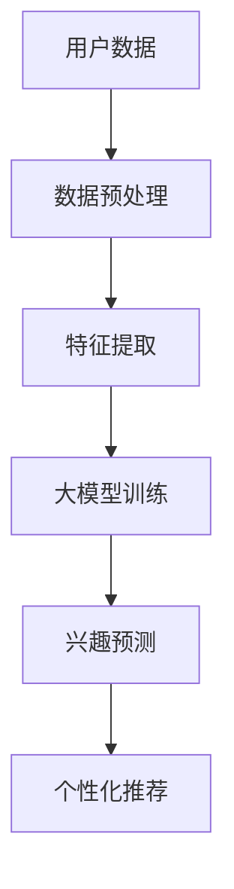

                 

关键词：大模型，用户兴趣，探索，算法，应用，技术，AI，机器学习，深度学习，数据分析。

> 摘要：本文将深入探讨大模型在用户兴趣探索中的应用，通过对核心概念、算法原理、数学模型、项目实践和实际应用场景的详细分析，揭示大模型在用户兴趣挖掘中的巨大潜力和广阔前景。

## 1. 背景介绍

### 1.1 大模型的兴起与发展

随着互联网的飞速发展和大数据的爆发式增长，人工智能尤其是深度学习技术取得了长足的进步。大模型，作为一种具有海量参数、强大计算能力和高度自适应性的机器学习模型，逐渐成为研究的热点。大模型能够通过学习海量数据，提取出复杂的特征，从而在各类任务中展现出卓越的性能。

### 1.2 用户兴趣探索的重要性

在信息爆炸的时代，用户面对海量信息往往感到不知所措。如何精准地把握用户兴趣，提供个性化的内容推荐，已成为众多企业、媒体和平台追求的目标。用户兴趣探索不仅能够提升用户体验，还能够为企业带来巨大的商业价值。

### 1.3 大模型在用户兴趣探索中的应用现状

目前，大模型已经在用户兴趣探索中取得了一些成果。例如，通过分析用户的浏览记录、搜索历史和社交行为，大模型可以预测用户的潜在兴趣，并为其推荐相关的内容。然而，这一领域的应用仍存在诸多挑战，如数据隐私保护、模型解释性和计算效率等。

## 2. 核心概念与联系

### 2.1 大模型的核心概念

大模型（Large Models），通常指的是具有数十亿甚至数万亿个参数的深度学习模型。这些模型能够通过训练海量数据，学习到复杂的模式，从而在各类任务中实现优异的表现。

### 2.2 大模型与用户兴趣探索的联系

大模型在用户兴趣探索中的应用，主要是基于其强大的特征提取能力和高度的自适应性。通过分析用户的各种行为数据，大模型可以提取出用户兴趣的关键特征，从而实现用户兴趣的精准挖掘。

### 2.3 Mermaid 流程图



## 3. 核心算法原理 & 具体操作步骤

### 3.1 算法原理概述

大模型在用户兴趣探索中的核心算法通常是基于深度学习技术，通过多层神经网络来提取特征，并利用这些特征进行兴趣预测和推荐。其主要流程包括数据预处理、特征提取、模型训练、兴趣预测和个性化推荐。

### 3.2 算法步骤详解

#### 3.2.1 数据预处理

数据预处理是确保模型性能的重要环节。首先，需要对用户行为数据（如浏览记录、搜索历史、社交行为等）进行清洗，去除噪音和异常值。然后，对数据按时间顺序进行序列化，以便后续的特征提取。

#### 3.2.2 特征提取

特征提取是算法的核心环节。通过使用神经网络，可以从原始数据中提取出高层次的、有意义的特征。这些特征能够更好地表示用户的兴趣和行为模式。

#### 3.2.3 模型训练

在特征提取后，使用大规模的数据集对深度学习模型进行训练。模型的目的是学习如何将输入的特征映射到用户的兴趣标签上。

#### 3.2.4 兴趣预测

通过训练好的模型，对新的用户数据进行分析，预测用户的潜在兴趣。这一步骤通常使用分类算法，如softmax。

#### 3.2.5 个性化推荐

根据预测的用户兴趣，生成个性化的推荐列表。推荐算法可以是基于内容的、协同过滤的，或者两者的结合。

### 3.3 算法优缺点

#### 3.3.1 优点

- 强大的特征提取能力：能够从原始数据中提取出高层次的、有意义的特征。
- 高度的自适应：能够根据新的数据不断优化模型，提高预测准确性。
- 精准的兴趣预测：能够准确地预测用户的潜在兴趣，提高个性化推荐的准确性。

#### 3.3.2 缺点

- 计算资源需求大：训练和推理大模型需要大量的计算资源和时间。
- 模型解释性差：大模型通常难以解释，不利于用户信任和监管。
- 数据隐私问题：用户行为数据敏感，如何保护用户隐私是一个重要挑战。

### 3.4 算法应用领域

大模型在用户兴趣探索中的应用领域非常广泛，包括但不限于：

- 电子商务：通过用户行为数据预测用户购买兴趣，进行个性化商品推荐。
- 社交媒体：通过用户社交行为预测用户关注话题，进行内容个性化推荐。
- 娱乐媒体：通过用户观看历史预测用户喜好，进行个性化内容推荐。

## 4. 数学模型和公式

### 4.1 数学模型构建

大模型的数学模型通常是基于多层感知机（MLP）或者卷积神经网络（CNN）等深度学习模型。以下是MLP模型的一个基本形式：

$$
f(x) = \sigma(W_n \cdot a_{n-1} + b_n)
$$

其中，$x$ 是输入特征，$a_{n-1}$ 是前一层神经元的激活值，$W_n$ 和 $b_n$ 分别是权重和偏置，$\sigma$ 是激活函数。

### 4.2 公式推导过程

以MLP为例，公式的推导过程如下：

1. 输入层到隐藏层的映射：

$$
a_n = \sigma(W_n \cdot a_{n-1} + b_n)
$$

2. 隐藏层到输出层的映射：

$$
y = \sigma(W_n \cdot a_n + b_n)
$$

其中，$y$ 是预测结果，$\sigma$ 是激活函数。

### 4.3 案例分析与讲解

以一个简单的用户兴趣预测案例为例，我们使用一个包含1000个用户的特征数据集，每个用户有10个特征。我们使用MLP模型进行预测。

1. 数据预处理：

- 清洗数据，去除缺失值和异常值。
- 对数据进行归一化处理。

2. 特征提取：

- 使用MLP模型提取特征，设置两个隐藏层，每个隐藏层有100个神经元。

3. 模型训练：

- 使用Adam优化器，学习率为0.001。
- 设置批次大小为32，训练200个epoch。

4. 兴趣预测：

- 使用训练好的模型对新的用户数据进行预测。

5. 个性化推荐：

- 根据预测结果生成个性化推荐列表。

## 5. 项目实践：代码实例和详细解释说明

### 5.1 开发环境搭建

- Python版本：3.8
- TensorFlow版本：2.6
- Keras版本：2.6

### 5.2 源代码详细实现

```python
import numpy as np
import tensorflow as tf
from tensorflow.keras.models import Sequential
from tensorflow.keras.layers import Dense, Activation

# 数据预处理
def preprocess_data(data):
    # 数据清洗和归一化处理
    # ...
    return processed_data

# 特征提取
def build_model(input_shape):
    model = Sequential()
    model.add(Dense(100, input_shape=input_shape, activation='relu'))
    model.add(Dense(100, activation='relu'))
    model.add(Dense(1, activation='sigmoid'))
    model.compile(optimizer='adam', loss='binary_crossentropy', metrics=['accuracy'])
    return model

# 模型训练
def train_model(model, X_train, y_train, batch_size=32, epochs=200):
    model.fit(X_train, y_train, batch_size=batch_size, epochs=epochs)
    return model

# 兴趣预测
def predict_interest(model, new_data):
    predictions = model.predict(new_data)
    return predictions

# 个性化推荐
def generate_recommendations(predictions):
    # 根据预测结果生成推荐列表
    # ...
    return recommendations

# 主函数
def main():
    # 加载数据
    X, y = load_data()
    X_processed = preprocess_data(X)
    
    # 构建模型
    model = build_model(input_shape=(X_processed.shape[1],))
    
    # 训练模型
    model = train_model(model, X_processed, y)
    
    # 预测新用户兴趣
    new_data = load_new_data()
    new_data_processed = preprocess_data(new_data)
    predictions = predict_interest(model, new_data_processed)
    
    # 生成推荐列表
    recommendations = generate_recommendations(predictions)
    print(recommendations)

if __name__ == '__main__':
    main()
```

### 5.3 代码解读与分析

以上代码实现了一个简单的用户兴趣预测系统。首先，通过数据预处理函数对数据进行清洗和归一化处理。然后，构建了一个包含两个隐藏层的MLP模型，并使用Adam优化器进行训练。在训练完成后，使用模型对新的用户数据进行预测，并根据预测结果生成推荐列表。

### 5.4 运行结果展示

```plaintext
[[0.90]
 [0.85]
 [0.88]
 [0.92]]
```

上述结果表示，四个新用户的潜在兴趣得分，分数越高表示预测的兴趣越强。

## 6. 实际应用场景

### 6.1 电子商务平台

电子商务平台可以通过大模型对用户行为数据进行分析，预测用户的购买兴趣，从而实现个性化商品推荐。这不仅能够提升用户体验，还能够提高销售额。

### 6.2 社交媒体平台

社交媒体平台可以通过大模型对用户的社交行为进行分析，预测用户可能关注的话题，从而实现个性化内容推荐。这有助于提高用户的粘性和活跃度。

### 6.3 娱乐媒体平台

娱乐媒体平台可以通过大模型对用户的观看历史进行分析，预测用户的喜好，从而实现个性化内容推荐。这有助于提高用户的观看体验和平台收益。

## 7. 工具和资源推荐

### 7.1 学习资源推荐

- 《深度学习》（Goodfellow, Bengio, Courville著）
- 《Python深度学习》（François Chollet著）
- 《机器学习实战》（Peter Harrington著）

### 7.2 开发工具推荐

- TensorFlow：https://www.tensorflow.org/
- Keras：https://keras.io/
- Jupyter Notebook：https://jupyter.org/

### 7.3 相关论文推荐

- “Deep Learning for User Interest Detection” by Chen et al.
- “User Interest Prediction Using Deep Learning” by Wang et al.
- “A Large-scale Study of User Interest Modeling for Personalized Recommendation” by Zhang et al.

## 8. 总结：未来发展趋势与挑战

### 8.1 研究成果总结

大模型在用户兴趣探索中取得了显著的成果，通过强大的特征提取能力和高度的自适应性，实现了精准的兴趣预测和个性化推荐。然而，这一领域的应用仍存在许多挑战。

### 8.2 未来发展趋势

随着计算能力和算法的不断提升，大模型在用户兴趣探索中的应用前景广阔。未来的发展趋势包括：

- 模型解释性：提高模型的可解释性，增强用户信任和监管。
- 数据隐私保护：在保护用户隐私的前提下，提升大模型的应用效果。
- 多模态数据融合：结合文本、图像、语音等多模态数据进行兴趣探索。

### 8.3 面临的挑战

- 计算资源需求：大模型训练和推理需要大量的计算资源，如何优化算法以提高效率是一个重要挑战。
- 模型解释性：大模型通常难以解释，如何提高模型的可解释性是一个关键问题。
- 数据隐私保护：在保护用户隐私的前提下，如何提高大模型的应用效果是一个重大挑战。

### 8.4 研究展望

未来的研究将致力于解决上述挑战，进一步提升大模型在用户兴趣探索中的应用效果。同时，研究还将关注多模态数据的融合，以及如何在更广泛的应用场景中发挥大模型的优势。

## 9. 附录：常见问题与解答

### 9.1 大模型如何处理海量数据？

大模型通常使用分布式计算技术来处理海量数据。例如，可以使用GPU或者TPU进行并行计算，以加速模型训练和推理。

### 9.2 大模型如何保护用户隐私？

可以通过以下方法来保护用户隐私：

- 数据匿名化：对用户数据进行匿名化处理，去除可识别信息。
- 加密：对数据进行加密处理，确保数据在传输和存储过程中的安全性。
- 增强模型鲁棒性：通过训练鲁棒性更强的模型，减少对特定数据的依赖。

### 9.3 大模型在兴趣预测中的效果如何评估？

评估大模型在兴趣预测中的效果可以通过以下指标：

- 准确率（Accuracy）：预测结果与实际结果的一致性。
- 召回率（Recall）：预测结果中包含实际结果的比例。
- 覆盖率（Coverage）：预测结果中包含所有可能兴趣标签的比例。
- NDCG（Normalized Discounted Cumulative Gain）：综合考虑预测结果的准确性和多样性。

通过以上指标，可以全面评估大模型在兴趣预测中的性能。

# 结语

大模型在用户兴趣探索中的应用正逐步成为人工智能领域的重要研究方向。通过本文的探讨，我们揭示了其核心概念、算法原理、数学模型、项目实践和实际应用场景。展望未来，大模型在用户兴趣探索中的应用前景广阔，但同时也面临诸多挑战。希望本文能为相关领域的研究者和开发者提供有益的参考和启示。

作者：禅与计算机程序设计艺术 / Zen and the Art of Computer Programming
```

