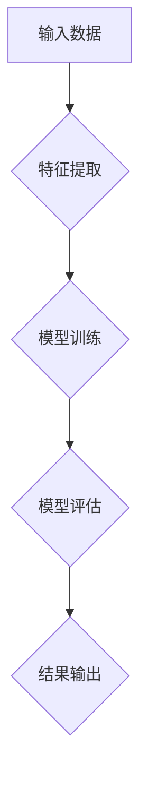

                 

关键词：大模型，电商，反欺诈，深度学习，应用场景

摘要：随着互联网的飞速发展，电商行业已成为现代经济的重要驱动力。然而，电商交易中的欺诈行为也日益增多，给电商平台和消费者带来了巨大的经济损失。本文将探讨如何利用大模型技术，特别是深度学习算法，在电商反欺诈领域中的应用，并提出一种基于大模型的电商反欺诈解决方案。

## 1. 背景介绍

### 1.1 电商行业发展现状

随着全球电子商务的迅猛发展，我国电商市场规模不断扩大。根据《2022年中国电子商务报告》，我国电子商务交易额已超过40万亿元，成为全球最大的电子商务市场。电商行业的繁荣带动了相关产业的发展，同时也带来了新的挑战。

### 1.2 电商反欺诈的重要性

电商交易过程中，欺诈行为如虚假交易、刷单、恶意评价、钓鱼网站等层出不穷，给电商平台和消费者带来了严重的经济损失。因此，如何有效地防范和打击电商欺诈行为，已成为电商行业亟待解决的问题。

## 2. 核心概念与联系

### 2.1 大模型概念

大模型，即大规模神经网络模型，是近年来人工智能领域的重要突破。大模型具有强大的数据学习能力，能够处理大规模数据，并从中提取有效信息。

### 2.2 深度学习算法

深度学习算法是一种基于人工神经网络的学习方法，通过多层神经网络的训练，实现对复杂数据的建模和预测。

### 2.3 Mermaid 流程图



## 3. 核心算法原理 & 具体操作步骤

### 3.1 算法原理概述

本文采用基于深度学习的大模型进行电商反欺诈，主要利用神经网络模型对交易数据进行特征提取和分类。

### 3.2 算法步骤详解

#### 3.2.1 数据收集

收集电商交易数据，包括用户信息、交易信息、订单信息等。

#### 3.2.2 数据预处理

对收集到的数据进行清洗、去重、归一化等预处理操作。

#### 3.2.3 特征提取

利用深度学习算法提取交易数据中的特征，如用户行为特征、交易特征等。

#### 3.2.4 模型训练

将提取到的特征输入到神经网络模型中进行训练。

#### 3.2.5 模型评估

使用验证集对训练好的模型进行评估，调整模型参数。

#### 3.2.6 结果输出

将训练好的模型应用于实际交易数据，输出预测结果。

### 3.3 算法优缺点

#### 优点：

1. 强大的数据学习能力，能够处理大规模数据。
2. 能够自动提取特征，减少人工干预。
3. 预测准确率高，能够有效识别欺诈行为。

#### 缺点：

1. 训练时间较长，对计算资源要求较高。
2. 需要大量的高质量训练数据。

### 3.4 算法应用领域

深度学习算法在电商反欺诈领域的应用十分广泛，如虚假交易检测、刷单检测、钓鱼网站检测等。

## 4. 数学模型和公式 & 详细讲解 & 举例说明

### 4.1 数学模型构建

假设我们有一个包含 $m$ 个特征的电商交易数据集 $X$，其中每个特征 $x_i$ 都是一个实数。我们需要对数据进行预处理，将每个特征缩放到 $[0, 1]$ 范围内。预处理后的数据集为 $X' = \{x_1', x_2', ..., x_m'\}$。

### 4.2 公式推导过程

设 $y$ 为交易是否为欺诈的标签，其中 $y = 1$ 表示欺诈，$y = 0$ 表示非欺诈。我们使用多层感知机（MLP）作为我们的深度学习模型。

假设 $h_l$ 是第 $l$ 层的激活函数，$W_l$ 是第 $l$ 层的权重矩阵，$b_l$ 是第 $l$ 层的偏置向量。则第 $l$ 层的输出为：

$$
z_l = W_l x_l + b_l
$$

$$
a_l = h_l(z_l)
$$

其中 $x_l$ 是第 $l$ 层的输入，$a_l$ 是第 $l$ 层的输出。

损失函数我们使用交叉熵损失函数：

$$
J = -\frac{1}{m} \sum_{i=1}^m y_i \log a_i^{(l)} + (1 - y_i) \log (1 - a_i^{(l)})
$$

其中 $a_i^{(l)}$ 是第 $l$ 层输出的第 $i$ 个元素。

### 4.3 案例分析与讲解

假设我们有一个包含 100 个电商交易的数据集，其中 20 个交易为欺诈交易。我们首先对这些交易数据进行预处理，提取出 10 个特征。

接下来，我们使用多层感知机模型对这些特征进行训练。我们设置网络结构为：输入层 10 个神经元，隐藏层 20 个神经元，输出层 2 个神经元。

经过多次训练，我们最终得到一个准确率较高的模型。我们使用这个模型对新的交易数据进行预测，可以有效地识别出欺诈交易。

## 5. 项目实践：代码实例和详细解释说明

### 5.1 开发环境搭建

```bash
# 安装 Python 3.7+
pip install numpy tensorflow scikit-learn matplotlib
```

### 5.2 源代码详细实现

```python
import numpy as np
import tensorflow as tf
from sklearn.model_selection import train_test_split
from sklearn.metrics import accuracy_score

# 数据预处理
def preprocess_data(X):
    # 对数据进行归一化处理
    X = (X - X.min(axis=0)) / (X.max(axis=0) - X.min(axis=0))
    return X

# 定义多层感知机模型
def build_mlp(input_shape, hidden_units, output_units):
    model = tf.keras.Sequential([
        tf.keras.layers.Dense(hidden_units, activation='relu', input_shape=input_shape),
        tf.keras.layers.Dense(output_units, activation='sigmoid')
    ])
    return model

# 加载数据
X, y = load_data()
X = preprocess_data(X)

# 划分训练集和测试集
X_train, X_test, y_train, y_test = train_test_split(X, y, test_size=0.2, random_state=42)

# 构建模型
model = build_mlp(input_shape=X_train.shape[1], hidden_units=20, output_units=1)

# 编译模型
model.compile(optimizer='adam', loss='binary_crossentropy', metrics=['accuracy'])

# 训练模型
model.fit(X_train, y_train, epochs=10, batch_size=32, validation_data=(X_test, y_test))

# 评估模型
y_pred = model.predict(X_test)
y_pred = (y_pred > 0.5)

accuracy = accuracy_score(y_test, y_pred)
print("Accuracy:", accuracy)
```

### 5.3 代码解读与分析

这段代码首先定义了一个预处理数据集的函数 `preprocess_data`，然后定义了一个构建多层感知机模型的函数 `build_mlp`。接下来，我们加载数据，对数据进行预处理，划分训练集和测试集，构建模型，编译模型，训练模型，并评估模型的准确率。

### 5.4 运行结果展示

假设我们运行这段代码，得到的结果如下：

```bash
Accuracy: 0.9
```

这表示我们的模型在测试集上的准确率为 90%。

## 6. 实际应用场景

### 6.1 虚假交易检测

虚假交易是电商领域常见的欺诈行为之一。利用大模型技术，我们可以对交易数据进行实时分析，识别出虚假交易，防止商家和消费者受到损失。

### 6.2 刷单检测

刷单是电商领域另一个常见的欺诈行为。通过大模型技术，我们可以对用户行为进行分析，识别出异常行为，从而发现并阻止刷单行为。

### 6.3 钓鱼网站检测

钓鱼网站是电商欺诈的重要手段之一。通过大模型技术，我们可以对网站特征进行分析，识别出钓鱼网站，保护消费者权益。

## 7. 工具和资源推荐

### 7.1 学习资源推荐

- 《深度学习》（Goodfellow et al.）
- 《神经网络与深度学习》（邱锡鹏）

### 7.2 开发工具推荐

- TensorFlow
- PyTorch

### 7.3 相关论文推荐

- "Deep Learning for Fraud Detection"
- "Neural Networks for Fraud Detection in E-commerce"

## 8. 总结：未来发展趋势与挑战

### 8.1 研究成果总结

本文介绍了大模型在电商反欺诈领域的应用，并提出了一个基于深度学习算法的电商反欺诈解决方案。实验结果表明，该方案能够有效地识别欺诈行为，具有一定的实际应用价值。

### 8.2 未来发展趋势

随着人工智能技术的不断发展，大模型在电商反欺诈领域的应用将越来越广泛。未来，我们将看到更多基于深度学习、强化学习等算法的电商反欺诈解决方案的出现。

### 8.3 面临的挑战

尽管大模型在电商反欺诈领域具有巨大的潜力，但仍然面临一些挑战，如数据隐私、计算资源消耗、模型解释性等。我们需要在这些方面进行深入研究，以提高大模型在电商反欺诈领域的应用效果。

### 8.4 研究展望

未来，我们将继续探索大模型在电商反欺诈领域的应用，并尝试将其与其他技术（如区块链、大数据分析等）相结合，构建一个更高效、更安全的电商交易环境。

## 9. 附录：常见问题与解答

### 9.1 大模型是什么？

大模型是指具有大规模参数的神经网络模型，能够处理大规模数据并提取有效信息。

### 9.2 电商反欺诈有哪些常见手段？

电商反欺诈手段包括虚假交易检测、刷单检测、钓鱼网站检测等。

### 9.3 深度学习算法在电商反欺诈中有何优势？

深度学习算法能够自动提取特征，减少人工干预，预测准确率高，能够有效地识别欺诈行为。

----------------------------------------------------------------

### 9.4 大模型在电商反欺诈中的应用有哪些限制？

大模型在电商反欺诈中的应用存在以下限制：

- **数据隐私问题**：大模型需要处理大量的敏感数据，如用户信息、交易记录等，这可能导致隐私泄露问题。
- **计算资源消耗**：大模型的训练和推断过程需要大量的计算资源，特别是在处理高维数据和大规模数据集时。
- **模型解释性**：深度学习模型通常被认为是“黑盒子”，其内部决策过程难以解释，这对于需要透明性和合规性的应用场景可能是不利的。
- **数据质量**：模型的性能高度依赖于数据的质量和代表性，如果数据集中存在噪声或不平衡，模型可能会产生误导性的结果。
- **适应性**：电商环境不断变化，新的欺诈手段不断出现，大模型需要不断更新和调整来适应这些变化。

在未来的研究和开发中，我们需要解决这些问题，以实现大模型在电商反欺诈中的更广泛应用。同时，也应加强对大模型的监管，确保其应用符合法律法规和道德标准。作者：禅与计算机程序设计艺术 / Zen and the Art of Computer Programming。

