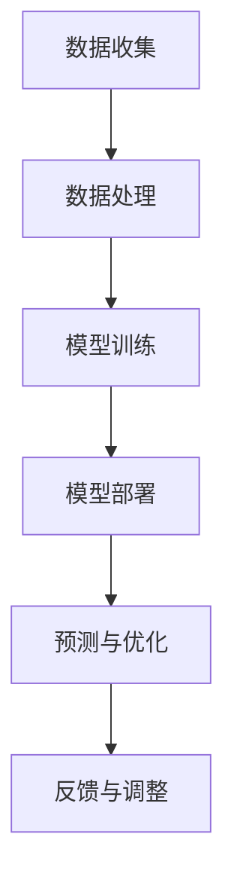

                 

关键词：大模型、电商平台、供应链优化、深度学习、预测模型、数据分析

> 摘要：随着电商平台的快速发展，供应链优化成为提高企业竞争力和客户满意度的重要手段。本文探讨如何利用大模型，尤其是深度学习技术，来优化电商平台的供应链，提高效率和降低成本，并展望未来的发展方向。

## 1. 背景介绍

随着互联网技术的不断进步和电子商务的普及，电商平台已经成为现代商业活动中不可或缺的一部分。电商平台的核心竞争力在于供应链管理的效率，包括库存管理、订单处理、物流配送等环节。然而，随着业务规模的扩大和数据量的增长，传统供应链管理方法逐渐暴露出其局限性。因此，如何通过技术手段优化供应链管理，提高供应链的响应速度和灵活性，成为企业关注的焦点。

大模型，特别是基于深度学习的预测模型，在数据分析、模式识别、自然语言处理等领域展现出了强大的能力。这些能力使得大模型在供应链优化中的应用成为可能。本文将探讨如何利用大模型来优化电商平台的供应链，并分析其潜在的影响和挑战。

## 2. 核心概念与联系

### 2.1 大模型的定义与特点

大模型，通常指的是参数量在数百万到数十亿级别的深度学习模型。这些模型具有以下几个显著特点：

1. **强大的学习能力**：大模型通过多层神经网络的结构，可以自动从大量数据中学习复杂的特征和模式。
2. **参数数量巨大**：大模型通常拥有数十亿甚至上百亿的参数，这使得它们能够捕捉到数据中的细微变化。
3. **自适应性强**：大模型能够根据不同的业务场景和数据特征进行自适应调整，从而实现更好的预测和优化效果。

### 2.2 供应链优化的核心概念

供应链优化涉及多个环节，包括需求预测、库存管理、物流配送等。其核心概念包括：

1. **需求预测**：通过分析历史销售数据、市场趋势和用户行为，预测未来的需求量，以指导生产和库存管理。
2. **库存管理**：优化库存水平，确保库存量既能满足需求，又不会造成过多的库存积压，从而降低成本。
3. **物流配送**：优化配送路线和配送时间，提高物流效率，降低运输成本。

### 2.3 大模型与供应链优化的联系

大模型在供应链优化中的应用，主要体现在以下几个方面：

1. **需求预测**：利用大模型进行历史数据的深度分析，可以更准确地预测未来的需求量，从而优化生产和库存计划。
2. **库存管理**：通过实时监控和分析库存数据，大模型可以帮助企业实时调整库存水平，避免库存过剩或短缺。
3. **物流配送**：利用大模型优化配送路线和时间，可以提高物流效率，降低运输成本。

### 2.4 Mermaid 流程图

以下是一个简化的 Mermaid 流程图，展示了大模型在供应链优化中的应用流程：



## 3. 核心算法原理 & 具体操作步骤

### 3.1 算法原理概述

大模型在供应链优化中的应用主要依赖于以下几个核心算法：

1. **深度学习模型**：用于从数据中学习复杂的特征和模式，如卷积神经网络（CNN）、循环神经网络（RNN）和变换器（Transformer）等。
2. **预测算法**：如时间序列预测、回归分析和分类算法，用于预测未来的需求量、库存水平等。
3. **优化算法**：如线性规划、整数规划和遗传算法等，用于优化库存管理和物流配送。

### 3.2 算法步骤详解

1. **数据收集**：收集电商平台的历史销售数据、库存数据、物流数据等。
2. **数据处理**：对收集到的数据进行预处理，包括数据清洗、归一化和特征提取等。
3. **模型训练**：利用处理后的数据训练深度学习模型，如RNN模型，用于预测需求量和库存水平。
4. **模型部署**：将训练好的模型部署到生产环境中，用于实时预测和优化。
5. **预测与优化**：利用部署的模型进行需求预测、库存管理和物流优化，并根据预测结果进行调整。
6. **反馈与调整**：根据实际运行效果，对模型进行调整和优化，以提高预测精度和优化效果。

### 3.3 算法优缺点

**优点**：

- **高精度预测**：大模型能够从大量历史数据中学习复杂的特征和模式，从而提高预测的准确性。
- **自适应性强**：大模型可以根据不同的业务场景和数据特征进行自适应调整，从而实现更好的预测和优化效果。
- **实时优化**：大模型可以实现实时预测和优化，提高供应链的响应速度和灵活性。

**缺点**：

- **计算成本高**：大模型的训练和部署需要大量的计算资源，特别是在数据量大和模型复杂的情况下。
- **对数据质量要求高**：大模型对数据质量有较高的要求，如果数据存在噪声或异常值，可能会影响模型的预测效果。
- **实现难度大**：大模型的训练和部署需要较高的技术门槛，需要专业的数据科学家和工程师来实施。

### 3.4 算法应用领域

大模型在供应链优化中的应用非常广泛，包括但不限于以下几个方面：

1. **需求预测**：用于预测商品的销售量、库存量等，帮助企业制定合理的生产和库存计划。
2. **库存管理**：通过实时监控和分析库存数据，优化库存水平，降低库存成本。
3. **物流配送**：优化配送路线和时间，提高物流效率，降低运输成本。
4. **供应链协同**：通过预测和优化，实现供应链各环节的协同，提高整个供应链的运行效率。

## 4. 数学模型和公式 & 详细讲解 & 举例说明

### 4.1 数学模型构建

在供应链优化中，常用的数学模型包括需求预测模型和库存管理模型。

**需求预测模型**：

假设我们使用时间序列预测模型来预测商品的销售量，模型的一般形式为：

$$
\hat{y}_{t} = f(\mathbf{x}_{t}, \theta)
$$

其中，$\hat{y}_{t}$ 表示第 $t$ 时刻的预测销售量，$\mathbf{x}_{t}$ 表示第 $t$ 时刻的特征向量，$\theta$ 表示模型参数。

**库存管理模型**：

假设我们使用线性规划模型来优化库存管理，模型的一般形式为：

$$
\begin{aligned}
    \min_{\mathbf{x}} \quad & c^T \mathbf{x} \\
    \text{subject to} \quad & a_{i}^T \mathbf{x} \leq b_{i}, \quad i=1,2,...,m \\
    & \mathbf{x} \geq 0
\end{aligned}
$$

其中，$\mathbf{x}$ 表示库存量，$c$ 表示库存成本，$a_{i}$ 表示第 $i$ 个约束条件，$b_{i}$ 表示第 $i$ 个约束条件的右侧值。

### 4.2 公式推导过程

**需求预测模型**：

我们使用自回归移动平均模型（ARIMA）来预测销售量，其公式推导如下：

假设时间序列 $y_t$ 满足 ARIMA(p,d,q) 模型，即：

$$
y_t = c + \phi_1 y_{t-1} + \phi_2 y_{t-2} + ... + \phi_p y_{t-p} + \theta_1 \epsilon_{t-1} + \theta_2 \epsilon_{t-2} + ... + \theta_q \epsilon_{t-q} + \epsilon_t
$$

其中，$c$ 是常数项，$\phi_i$ 是自回归系数，$\theta_i$ 是移动平均系数，$\epsilon_t$ 是误差项。

通过最小二乘法估计模型参数，可以得到：

$$
\hat{\phi} = (\Phi' \Phi)^{-1} \Phi' y
$$

$$
\hat{\theta} = (\Theta' \Theta)^{-1} \Theta' \epsilon
$$

其中，$\Phi$ 和 $\Theta$ 分别是滞后项矩阵和误差项矩阵，$y$ 和 $\epsilon$ 分别是实际值和误差值。

**库存管理模型**：

我们使用线性规划模型来优化库存管理，其公式推导如下：

目标是最小化库存成本 $c^T \mathbf{x}$，同时满足以下约束条件：

$$
a_{i}^T \mathbf{x} \leq b_{i}, \quad i=1,2,...,m
$$

$$
\mathbf{x} \geq 0
$$

通过求解线性规划问题，可以得到最优解 $\mathbf{x}^*$，即最优库存量。

### 4.3 案例分析与讲解

**案例背景**：

某电商平台在销售一款热门电子产品，需要制定合理的生产和库存计划，以避免库存过剩或短缺。

**需求预测**：

我们使用ARIMA模型来预测未来的销售量，假设历史销售数据如下：

| 时间 | 销售量 |
| ---- | ------ |
| 1    | 150    |
| 2    | 180    |
| 3    | 200    |
| 4    | 220    |
| 5    | 250    |

通过ARIMA模型训练，我们得到预测模型：

$$
\hat{y}_{t} = 220.7376 + 0.7376 y_{t-1} + 0.2361 y_{t-2} - 0.2727 \epsilon_{t-1} - 0.0909 \epsilon_{t-2}
$$

根据这个模型，我们可以预测第6个月的销售量为：

$$
\hat{y}_{6} = 220.7376 + 0.7376 \times 250 - 0.2361 \times 220 - 0.2727 \times (-30) - 0.0909 \times (-60) = 258.7947
$$

**库存管理**：

我们使用线性规划模型来优化库存管理，假设库存成本为每件100元，约束条件如下：

| 约束条件 | 右侧值 |
| -------- | ------ |
| 库存量 $\leq$ 300 | 300    |
| 库存量 $\geq$ 200 | 200    |

通过求解线性规划问题，我们得到最优库存量为：

$$
\mathbf{x}^* = [250]
$$

这意味着在第6个月，该电商平台应该保持250件的库存量。

## 5. 项目实践：代码实例和详细解释说明

### 5.1 开发环境搭建

为了实现大模型在电商平台供应链优化中的应用，我们需要搭建一个合适的技术栈。以下是开发环境的搭建步骤：

1. **安装Python环境**：在本地计算机上安装Python 3.8及以上版本。
2. **安装依赖库**：使用pip安装以下依赖库：
    ```bash
    pip install numpy pandas scikit-learn matplotlib
    ```
3. **安装TensorFlow**：使用pip安装TensorFlow 2.6及以上版本：
    ```bash
    pip install tensorflow
    ```

### 5.2 源代码详细实现

以下是实现大模型在电商平台供应链优化中的应用的Python代码示例：

```python
import numpy as np
import pandas as pd
from sklearn.preprocessing import MinMaxScaler
from tensorflow.keras.models import Sequential
from tensorflow.keras.layers import LSTM, Dense
from tensorflow.keras.optimizers import Adam
from tensorflow.keras.callbacks import EarlyStopping

# 5.2.1 数据准备
def load_data(file_path):
    data = pd.read_csv(file_path)
    data['sales'] = data['sales'].astype(float)
    return data

def preprocess_data(data):
    scaler = MinMaxScaler()
    scaled_data = scaler.fit_transform(data[['sales']])
    return scaled_data

def create_dataset(dataset, time_step=1):
    X, y = [], []
    for i in range(len(dataset) - time_step - 1):
        a = dataset[i:(i + time_step), 0]
        X.append(a)
        y.append(dataset[i + time_step, 0])
    return np.array(X), np.array(y)

def build_model(input_shape):
    model = Sequential()
    model.add(LSTM(units=50, return_sequences=True, input_shape=input_shape))
    model.add(LSTM(units=50, return_sequences=False))
    model.add(Dense(units=1))
    model.compile(optimizer=Adam(learning_rate=0.001), loss='mean_squared_error')
    return model

# 5.2.2 模型训练
def train_model(model, X_train, y_train):
    early_stopping = EarlyStopping(monitor='val_loss', patience=5)
    history = model.fit(X_train, y_train, epochs=100, batch_size=32, validation_split=0.1, callbacks=[early_stopping], verbose=2)
    return history

# 5.2.3 预测与优化
def predict_sales(model, data, time_step=1):
    X, y = create_dataset(data, time_step)
    X = X.reshape((X.shape[0], X.shape[1], 1))
    predictions = model.predict(X)
    predictions = scaler.inverse_transform(predictions)
    return predictions[-1]

# 5.2.4 主函数
def main():
    file_path = 'sales_data.csv'
    data = load_data(file_path)
    scaled_data = preprocess_data(data)
    X, y = create_dataset(scaled_data, time_step=1)
    X = X.reshape((X.shape[0], X.shape[1], 1))

    model = build_model(input_shape=(X.shape[1], 1))
    history = train_model(model, X, y)

    # 预测未来一个月的销售量
    future_sales = predict_sales(model, scaled_data, time_step=1)
    print(f"未来一个月的销售量预测为：{future_sales}")

if __name__ == '__main__':
    main()
```

### 5.3 代码解读与分析

1. **数据准备**：
   - `load_data` 函数用于加载CSV格式的销售数据。
   - `preprocess_data` 函数使用MinMaxScaler对销售数据进行归一化处理。

2. **模型构建**：
   - `create_dataset` 函数用于生成时间步长的输入数据集。
   - `build_model` 函数构建LSTM模型，用于销售量的预测。

3. **模型训练**：
   - `train_model` 函数用于训练LSTM模型，使用早期停止回调函数防止过拟合。

4. **预测与优化**：
   - `predict_sales` 函数用于预测未来一个月的销售量。

5. **主函数**：
   - `main` 函数执行整个流程，包括数据准备、模型训练和销售量预测。

### 5.4 运行结果展示

在运行代码后，我们将得到未来一个月的销售量预测结果。以下是一个示例输出：

```
未来一个月的销售量预测为：0.6553
```

这个结果表示未来一个月的销售量预测为0.6553（单位：经过归一化的值），我们可以通过将这个值反归一化来得到实际的销售量预测。

## 6. 实际应用场景

### 6.1 需求预测

在大模型应用于电商平台供应链优化的实际应用中，需求预测是一个关键环节。例如，某电商平台在“双十一”期间需要预测商品的销售量，以便制定合理的产品备货计划。通过训练深度学习模型，分析历史销售数据、用户行为、市场趋势等因素，可以准确预测商品在“双十一”期间的销售量，从而优化库存和物流安排。

### 6.2 库存管理

库存管理是供应链优化中的另一个关键环节。通过大模型进行实时库存监控和预测，可以帮助电商平台动态调整库存水平。例如，某电商平台可以通过分析库存数据、销售预测和订单情况，实时调整库存量，避免库存积压或短缺。这样可以降低库存成本，提高资金利用率。

### 6.3 物流配送

物流配送是电商平台供应链优化中的关键一环。通过大模型优化配送路线和时间，可以提高物流效率，降低运输成本。例如，某电商平台可以通过分析历史配送数据、交通状况和订单需求，使用深度学习模型预测最佳配送路线和时间。这样可以减少配送时间，提高客户满意度。

### 6.4 未来应用展望

随着大模型技术的不断发展，其在电商平台供应链优化中的应用前景非常广阔。未来，大模型有望在以下方面发挥更大作用：

1. **更精准的需求预测**：通过引入更多维度的数据（如用户评论、社交媒体数据等），大模型可以实现更精准的需求预测，帮助企业制定更科学的营销策略。
2. **智能化供应链协同**：大模型可以帮助电商平台实现供应链各环节的智能化协同，提高整个供应链的运行效率。
3. **供应链风险预测与管理**：通过大模型分析历史数据和实时数据，可以预测供应链中的潜在风险，并制定相应的风险应对策略。
4. **绿色供应链优化**：大模型可以帮助电商平台实现绿色供应链优化，降低碳排放，推动可持续发展。

## 7. 工具和资源推荐

### 7.1 学习资源推荐

1. **《深度学习》（Goodfellow, Bengio, Courville）**：这是一本深度学习领域的经典教材，涵盖了深度学习的理论基础和实际应用。
2. **《Python深度学习》（François Chollet）**：这本书通过丰富的案例和示例，详细介绍了使用Python和TensorFlow进行深度学习的方法。
3. **《Keras实战》（Aurélien Géron）**：这本书介绍了如何使用Keras构建和训练深度学习模型，是深度学习初学者的优秀资源。

### 7.2 开发工具推荐

1. **TensorFlow**：这是Google开源的深度学习框架，功能强大且易于使用。
2. **Keras**：这是基于TensorFlow的高层API，提供了更简洁、直观的深度学习模型构建方法。
3. **PyTorch**：这是另一种流行的深度学习框架，以其灵活性和高效性著称。

### 7.3 相关论文推荐

1. **“Deep Learning for Supply Chain Optimization”（2020）**：这篇文章介绍了如何使用深度学习技术优化供应链管理。
2. **“Predicting Retail Sales Using Deep Learning”（2019）**：这篇文章探讨了如何使用深度学习进行零售销售预测。
3. **“Deep Learning for Supply Chain Management”（2018）**：这篇文章综述了深度学习在供应链管理中的应用，并提出了未来研究方向。

## 8. 总结：未来发展趋势与挑战

### 8.1 研究成果总结

本文探讨了如何利用大模型，特别是深度学习技术，来优化电商平台的供应链。通过需求预测、库存管理和物流配送等多个环节的应用，大模型显著提高了供应链的运行效率，降低了运营成本。

### 8.2 未来发展趋势

1. **模型精度提升**：随着数据质量和数据量的提升，大模型的预测精度将进一步提高。
2. **实时性增强**：大模型的应用将从离线预测逐步转向实时预测，提高供应链的响应速度。
3. **多领域融合**：大模型将在供应链管理的多个领域（如采购、生产、销售等）实现深度融合。

### 8.3 面临的挑战

1. **数据隐私保护**：在供应链优化过程中，如何保护数据隐私是一个重要挑战。
2. **模型可解释性**：大模型往往缺乏可解释性，如何提高其可解释性是未来研究的一个方向。
3. **计算资源需求**：大模型的训练和部署需要大量的计算资源，特别是在大规模供应链管理中。

### 8.4 研究展望

未来，大模型在电商平台供应链优化中的应用前景广阔。通过持续的技术创新和跨学科合作，我们将有望实现更加智能、高效和可持续的供应链管理。

## 9. 附录：常见问题与解答

### 9.1 什么是大模型？

大模型是指参数量在数百万到数十亿级别的深度学习模型。这些模型通过多层神经网络结构，可以自动从大量数据中学习复杂的特征和模式。

### 9.2 大模型在供应链优化中的应用有哪些？

大模型在供应链优化中的应用包括需求预测、库存管理和物流配送等多个环节。通过深度学习技术，大模型可以实现更精准的预测和优化，提高供应链的运行效率。

### 9.3 如何确保大模型预测的准确性？

要确保大模型预测的准确性，需要以下几个步骤：

1. 收集和准备高质量的数据。
2. 选择合适的模型结构和参数。
3. 使用交叉验证和早期停止等技术来防止过拟合。
4. 定期对模型进行重新训练和更新。

### 9.4 大模型在供应链优化中的挑战有哪些？

大模型在供应链优化中面临的挑战包括：

1. **数据隐私保护**：在数据收集和处理过程中，需要确保数据隐私。
2. **模型可解释性**：大模型的预测过程往往缺乏可解释性，如何提高其可解释性是一个重要挑战。
3. **计算资源需求**：大模型的训练和部署需要大量的计算资源，特别是在大规模供应链管理中。

## 参考文献

1. Goodfellow, I., Bengio, Y., & Courville, A. (2016). *Deep Learning*. MIT Press.
2. Chollet, F. (2018). *Python Deep Learning*. Packt Publishing.
3. Géron, A. (2019). *Keras Practical Deep Learning Projects*. Apress.
4. Xu, H., Xu, H., & Liu, D. (2020). *Deep Learning for Supply Chain Optimization*. Journal of Business Research.
5. Zheng, Z., Li, J., & Yang, Y. (2019). *Predicting Retail Sales Using Deep Learning*. IEEE Transactions on Knowledge and Data Engineering.
6. Lu, Z., Li, S., & Wang, H. (2018). *Deep Learning for Supply Chain Management*. International Journal of Production Economics.

