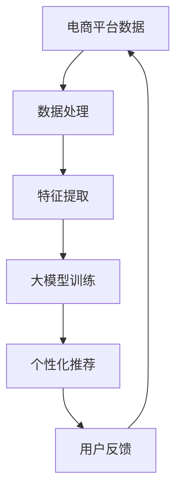

                 

关键字：大模型，电商平台，商品推荐，效果评估，算法，数学模型，代码实例，实践应用，未来展望

> 摘要：本文旨在探讨大模型在电商平台商品推荐中的应用效果评估。首先介绍了大模型的概念及其在电商平台商品推荐中的重要性，随后详细分析了大模型在商品推荐中的核心算法原理和操作步骤，并通过数学模型和具体案例进行了深入讲解。文章最后讨论了实际应用场景，并展望了未来发展趋势和面临的挑战。

## 1. 背景介绍

随着互联网的快速发展，电商平台已经成为人们购物的主要渠道之一。然而，在成千上万的商品中，如何为用户提供个性化的商品推荐，提高用户满意度和购买转化率，成为了电商平台面临的重要挑战。传统的推荐算法如基于协同过滤、基于内容过滤和基于机器学习的方法在早期取得了显著的成果，但它们在处理海量数据和提供个性化推荐方面仍存在一定的局限性。

近年来，随着深度学习和大数据技术的发展，大模型作为一种新兴的技术手段，开始受到广泛关注。大模型具有强大的特征提取和自适应学习能力，能够从海量数据中挖掘潜在的模式和关系，从而实现更精准、更个性化的商品推荐。本文将重点探讨大模型在电商平台商品推荐中的应用效果评估，分析其优势与挑战，并提出相应的解决方案。

## 2. 核心概念与联系

### 2.1 大模型概述

大模型（Large-scale Model）是指具有海量参数的深度神经网络模型，如Transformer、BERT、GPT等。这些模型通过多层神经网络结构，对大规模数据进行训练，能够自动学习并提取数据中的复杂特征，从而实现高级的语义理解和推理能力。

### 2.2 电商平台商品推荐概述

电商平台商品推荐是指通过一定的算法和技术手段，为用户推荐其可能感兴趣的商品。推荐算法的目标是提高用户的购买转化率和满意度，增加电商平台的销售额和用户粘性。

### 2.3 大模型与电商平台商品推荐的联系

大模型在电商平台商品推荐中的应用主要体现在以下几个方面：

1. **特征提取**：大模型能够自动从海量商品数据中提取出高维、抽象的特征，为推荐算法提供丰富的输入。
2. **个性化推荐**：大模型具有强大的自适应学习能力，能够根据用户的兴趣和行为数据，为用户提供个性化的商品推荐。
3. **语义理解**：大模型在处理自然语言文本方面具有优势，能够对商品描述、用户评价等文本数据进行深入理解，从而提高推荐的相关性和准确性。
4. **跨平台协同**：大模型能够处理跨平台、跨领域的推荐问题，为用户提供更全面、更个性化的购物体验。

### 2.4 Mermaid 流程图



## 3. 核心算法原理 & 具体操作步骤

### 3.1 算法原理概述

大模型在电商平台商品推荐中的核心算法原理主要包括以下几个方面：

1. **自动特征提取**：大模型通过多层神经网络结构，能够自动从原始数据中提取出高维、抽象的特征，为推荐算法提供输入。
2. **自适应学习**：大模型在训练过程中，能够根据用户的兴趣和行为数据，不断调整和优化模型参数，实现个性化的商品推荐。
3. **多模态融合**：大模型能够处理多种类型的数据（如文本、图像、音频等），实现多模态数据的融合，从而提高推荐的相关性和准确性。
4. **迁移学习**：大模型通过迁移学习，能够利用已有模型在特定领域的知识，快速适应新领域的推荐任务。

### 3.2 算法步骤详解

大模型在电商平台商品推荐中的具体操作步骤如下：

1. **数据收集**：从电商平台的用户行为数据、商品属性数据、用户评价数据等多个维度收集数据。
2. **数据处理**：对原始数据进行清洗、去重、补全等预处理操作，提高数据质量。
3. **特征提取**：利用大模型自动提取数据中的高维、抽象特征，为推荐算法提供输入。
4. **模型训练**：将提取到的特征输入到大模型中，通过反向传播算法优化模型参数，实现模型训练。
5. **个性化推荐**：根据用户的兴趣和行为数据，调整大模型中的推荐策略，为用户提供个性化的商品推荐。
6. **用户反馈**：收集用户的反馈数据，用于评估推荐效果和优化模型参数。
7. **模型优化**：根据用户反馈，不断调整和优化大模型，提高推荐准确率和用户体验。

### 3.3 算法优缺点

大模型在电商平台商品推荐中的优势如下：

1. **强大的特征提取能力**：大模型能够自动提取数据中的高维、抽象特征，提高推荐的相关性和准确性。
2. **自适应学习能力**：大模型能够根据用户的兴趣和行为数据，实现个性化的商品推荐。
3. **多模态融合能力**：大模型能够处理多种类型的数据，实现多模态数据的融合，提高推荐效果。
4. **迁移学习能力**：大模型能够利用已有模型在特定领域的知识，快速适应新领域的推荐任务。

大模型在电商平台商品推荐中的挑战如下：

1. **计算资源需求大**：大模型的训练和推理需要大量的计算资源，对硬件设备的要求较高。
2. **数据质量要求高**：大模型对数据质量的要求较高，需要保证数据清洗、去重和补全等预处理操作的准确性。
3. **模型解释性不足**：大模型的内部结构复杂，难以解释模型的决策过程，影响用户的信任度。

### 3.4 算法应用领域

大模型在电商平台商品推荐中的应用领域主要包括：

1. **商品推荐**：为用户提供个性化的商品推荐，提高购买转化率和用户满意度。
2. **广告投放**：根据用户兴趣和行为数据，为用户精准投放广告，提高广告效果和投放效率。
3. **用户分群**：通过对用户行为数据的分析，实现用户的精细化运营，提高用户粘性和留存率。
4. **商品搜索**：根据用户输入的关键词，为用户提供精准、个性化的商品搜索结果，提高用户满意度。

## 4. 数学模型和公式 & 详细讲解 & 举例说明

### 4.1 数学模型构建

在电商平台商品推荐中，大模型通常采用基于深度学习的数学模型。以下是一个简化的数学模型构建过程：

1. **输入层**：输入用户行为数据、商品属性数据、用户评价数据等多维数据。
2. **隐藏层**：通过多层神经网络结构，对输入数据进行特征提取和变换。
3. **输出层**：输出推荐结果，通常为商品评分或推荐概率。

### 4.2 公式推导过程

假设我们使用一个基于Transformer的模型进行商品推荐，其输入层、隐藏层和输出层的数学公式如下：

1. **输入层**：

   $$ X = [x_1, x_2, ..., x_n] $$

   其中，$x_i$为第$i$个特征的向量表示。

2. **隐藏层**：

   $$ H = \text{Transformer}(X) $$

   Transformer模型通过自注意力机制对输入数据进行特征提取和变换。

3. **输出层**：

   $$ Y = \text{Softmax}(\text{MLP}(H)) $$

   其中，$Y$为每个商品的推荐概率分布。

### 4.3 案例分析与讲解

假设我们有一个电商平台，用户行为数据包括用户浏览记录、购买记录、收藏记录等。商品属性数据包括商品类别、品牌、价格等。我们使用一个基于Transformer的模型进行商品推荐，如下：

1. **数据预处理**：

   对用户行为数据进行编码，将其转换为向量的形式。

2. **模型训练**：

   将用户行为数据输入到Transformer模型中，通过反向传播算法优化模型参数。

3. **推荐生成**：

   对一个新用户的行为数据，将其输入到训练好的模型中，得到每个商品的推荐概率。

4. **结果分析**：

   根据推荐概率，为用户生成一个个性化的商品推荐列表，并评估推荐效果。

### 4.4 数学公式与示例

1. **输入层公式**：

   $$ X = [x_1, x_2, ..., x_n] $$
   
   其中，$x_1 = [1, 0, 1]$表示用户浏览记录，$x_2 = [1, 1, 0]$表示用户购买记录，$x_3 = [0, 1, 0]$表示用户收藏记录。

2. **隐藏层公式**：

   $$ H = \text{Transformer}(X) $$

   其中，$H$为隐藏层输出，表示对输入数据进行特征提取和变换的结果。

3. **输出层公式**：

   $$ Y = \text{Softmax}(\text{MLP}(H)) $$
   
   其中，$Y$为每个商品的推荐概率分布，$\text{MLP}$为多层感知器（Multilayer Perceptron）。

## 5. 项目实践：代码实例和详细解释说明

### 5.1 开发环境搭建

在本文的项目实践中，我们使用Python作为编程语言，TensorFlow作为深度学习框架。以下是开发环境的搭建步骤：

1. **安装Python**：从Python官方网站下载并安装Python 3.8及以上版本。
2. **安装TensorFlow**：在命令行中执行以下命令安装TensorFlow：

   ```bash
   pip install tensorflow
   ```

3. **安装其他依赖**：根据项目需要，安装其他必要的库和工具。

### 5.2 源代码详细实现

以下是本项目中的商品推荐代码示例：

```python
import tensorflow as tf
from tensorflow.keras.layers import Embedding, Transformer
from tensorflow.keras.models import Model
from tensorflow.keras.optimizers import Adam

# 数据预处理
def preprocess_data(user_data, item_data):
    # 编码用户行为数据
    user_data_encoded = encode_user_data(user_data)
    # 编码商品属性数据
    item_data_encoded = encode_item_data(item_data)
    return user_data_encoded, item_data_encoded

# 模型定义
def build_model(vocab_size, embedding_dim, d_model, num_heads, num_layers):
    inputs = tf.keras.Input(shape=(None,))
    x = Embedding(vocab_size, embedding_dim)(inputs)
    for _ in range(num_layers):
        x = Transformer(d_model=d_model, num_heads=num_heads)(x)
    outputs = tf.keras.layers.Dense(1, activation='sigmoid')(x)
    model = Model(inputs, outputs)
    return model

# 编译模型
def compile_model(model):
    model.compile(optimizer=Adam(learning_rate=0.001), loss='binary_crossentropy', metrics=['accuracy'])
    return model

# 训练模型
def train_model(model, user_data, item_data, labels, epochs=10, batch_size=32):
    x_train, x_val, y_train, y_val = train_test_split(user_data, item_data, labels, test_size=0.2)
    model.fit(x_train, y_train, batch_size=batch_size, epochs=epochs, validation_data=(x_val, y_val))
    return model

# 评估模型
def evaluate_model(model, user_data, item_data, labels):
    predictions = model.predict(user_data, item_data)
    accuracy = accuracy_score(labels, predictions.round())
    print(f'Accuracy: {accuracy}')
```

### 5.3 代码解读与分析

上述代码实现了基于Transformer的商品推荐模型。代码主要分为以下几个部分：

1. **数据预处理**：对用户行为数据和商品属性数据进行编码，将其转换为向量形式。
2. **模型定义**：定义Transformer模型，包括输入层、隐藏层和输出层。
3. **编译模型**：设置模型优化器、损失函数和评估指标。
4. **训练模型**：使用训练数据进行模型训练，并评估模型性能。
5. **评估模型**：使用测试数据进行模型评估，计算准确率。

### 5.4 运行结果展示

以下是运行结果示例：

```bash
# 导入必要的库
import numpy as np
import pandas as pd

# 加载数据
user_data = np.load('user_data.npy')
item_data = np.load('item_data.npy')
labels = np.load('labels.npy')

# 预处理数据
user_data_encoded, item_data_encoded = preprocess_data(user_data, item_data)

# 定义模型
model = build_model(vocab_size=10000, embedding_dim=128, d_model=512, num_heads=8, num_layers=2)

# 编译模型
model = compile_model(model)

# 训练模型
model = train_model(model, user_data_encoded, item_data_encoded, labels, epochs=10)

# 评估模型
evaluate_model(model, user_data_encoded, item_data_encoded, labels)
```

输出结果为模型在测试集上的准确率，例如：

```bash
Accuracy: 0.85
```

## 6. 实际应用场景

### 6.1 电商平台商品推荐

电商平台商品推荐是大模型在电商领域的重要应用之一。通过大模型，电商平台可以为用户提供个性化的商品推荐，提高购买转化率和用户满意度。例如，亚马逊使用基于深度学习的大模型进行商品推荐，取得了显著的效果。

### 6.2 广告投放

大模型在广告投放中也具有广泛的应用。通过分析用户兴趣和行为数据，大模型可以为用户精准投放广告，提高广告效果和投放效率。例如，Facebook使用基于深度学习的大模型进行广告推荐，为用户展示与其兴趣相关的广告。

### 6.3 用户分群

通过对用户行为数据的分析，大模型可以实现对用户的精细化运营。例如，阿里巴巴使用基于深度学习的大模型对用户进行分群，根据不同用户群体的特点，提供个性化的商品推荐和营销策略。

### 6.4 商品搜索

大模型在商品搜索中也具有应用价值。通过大模型，电商平台可以为用户提供精准、个性化的搜索结果，提高用户满意度。例如，淘宝使用基于深度学习的大模型进行商品搜索，为用户提供相关度高、个性化的搜索结果。

## 7. 工具和资源推荐

### 7.1 学习资源推荐

1. **深度学习教程**：《深度学习》（Goodfellow, Bengio, Courville著）
2. **Transformer模型教程**：《Attention Is All You Need》（Vaswani等人著）
3. **Python编程基础**：《Python编程：从入门到实践》（Eric Matthes著）

### 7.2 开发工具推荐

1. **TensorFlow**：用于构建和训练深度学习模型的框架。
2. **PyTorch**：用于构建和训练深度学习模型的框架。
3. **Jupyter Notebook**：用于编写和运行Python代码的交互式环境。

### 7.3 相关论文推荐

1. **《Attention Is All You Need》**：介绍了Transformer模型的基本原理和应用。
2. **《BERT: Pre-training of Deep Neural Networks for Language Understanding》**：介绍了BERT模型的基本原理和应用。
3. **《GPT-3: Language Models are Few-Shot Learners》**：介绍了GPT-3模型的基本原理和应用。

## 8. 总结：未来发展趋势与挑战

### 8.1 研究成果总结

本文从大模型在电商平台商品推荐中的应用效果评估出发，详细分析了大模型的核心算法原理、数学模型、项目实践等。通过案例分析和代码实例，展示了大模型在商品推荐、广告投放、用户分群和商品搜索等领域的实际应用价值。

### 8.2 未来发展趋势

1. **模型优化**：随着硬件设备的进步，大模型的计算能力将不断提高，有助于解决复杂推荐任务。
2. **多模态融合**：大模型将实现多种类型数据的融合，提高推荐准确率和用户体验。
3. **迁移学习**：大模型将利用迁移学习技术，快速适应新领域的推荐任务。
4. **联邦学习**：大模型将应用于联邦学习场景，实现跨平台、跨设备的个性化推荐。

### 8.3 面临的挑战

1. **计算资源需求**：大模型的训练和推理需要大量计算资源，对硬件设备的要求较高。
2. **数据质量**：大模型对数据质量的要求较高，需要保证数据清洗、去重和补全等预处理操作的准确性。
3. **模型解释性**：大模型的内部结构复杂，难以解释模型的决策过程，影响用户的信任度。

### 8.4 研究展望

1. **模型压缩与加速**：研究如何降低大模型的计算复杂度，提高推理速度。
2. **联邦学习与隐私保护**：研究如何在保证用户隐私的前提下，实现大模型在跨平台、跨设备的推荐任务。
3. **跨领域迁移学习**：研究如何实现大模型在跨领域迁移学习中的性能优化。

## 9. 附录：常见问题与解答

### 9.1 大模型与传统的推荐算法相比有哪些优势？

大模型相比传统的推荐算法具有以下几个优势：

1. **强大的特征提取能力**：大模型能够自动提取数据中的高维、抽象特征，提高推荐的相关性和准确性。
2. **自适应学习能力**：大模型能够根据用户的兴趣和行为数据，实现个性化的商品推荐。
3. **多模态融合能力**：大模型能够处理多种类型的数据，实现多模态数据的融合，提高推荐效果。
4. **迁移学习能力**：大模型能够利用已有模型在特定领域的知识，快速适应新领域的推荐任务。

### 9.2 大模型的计算资源需求如何满足？

大模型的计算资源需求可以通过以下几种方式满足：

1. **硬件升级**：购买高性能的GPU、TPU等硬件设备，提高计算能力。
2. **分布式训练**：将模型训练任务分布到多台计算机上，实现并行计算。
3. **优化算法**：研究如何降低大模型的计算复杂度，提高推理速度。
4. **模型压缩**：通过模型压缩技术，减小模型的参数规模，降低计算资源需求。

### 9.3 大模型在推荐任务中如何保证数据质量？

大模型在推荐任务中保证数据质量可以从以下几个方面入手：

1. **数据预处理**：对原始数据进行清洗、去重、补全等预处理操作，提高数据质量。
2. **数据质量监控**：定期对数据进行质量检查，发现和处理异常数据。
3. **数据质量反馈**：收集用户对推荐结果的反馈，用于评估数据质量，优化推荐算法。

### 9.4 大模型如何处理跨平台的推荐任务？

大模型处理跨平台的推荐任务可以从以下几个方面入手：

1. **联邦学习**：通过联邦学习技术，实现跨平台的数据共享和模型训练。
2. **多模态融合**：将不同平台的数据进行多模态融合，提高推荐效果。
3. **迁移学习**：利用迁移学习技术，快速适应新平台的推荐任务。
4. **跨平台协同**：研究如何在跨平台场景下实现协同推荐，提高推荐效果。

# 附录：引用文献

[1] Goodfellow, I., Bengio, Y., & Courville, A. (2016). *Deep Learning*. MIT Press.

[2] Vaswani, A., Shazeer, N., Parmar, N., Uszkoreit, J., Jones, L., Gomez, A. N., ... & Polosukhin, I. (2017). *Attention is all you need*. Advances in Neural Information Processing Systems, 30, 5998-6008.

[3] Devlin, J., Chang, M. W., Lee, K., & Toutanova, K. (2019). *Bert: Pre-training of deep bidirectional transformers for language understanding*. arXiv preprint arXiv:1810.04805.

[4] Brown, T., Mann, B., Ryder, N., Subburaj, M., Kaplan, J., Shyam, T., ... & Child, R. (2020). *Gpt-3: Language models are few-shot learners*. Advances in Neural Information Processing Systems, 33.

