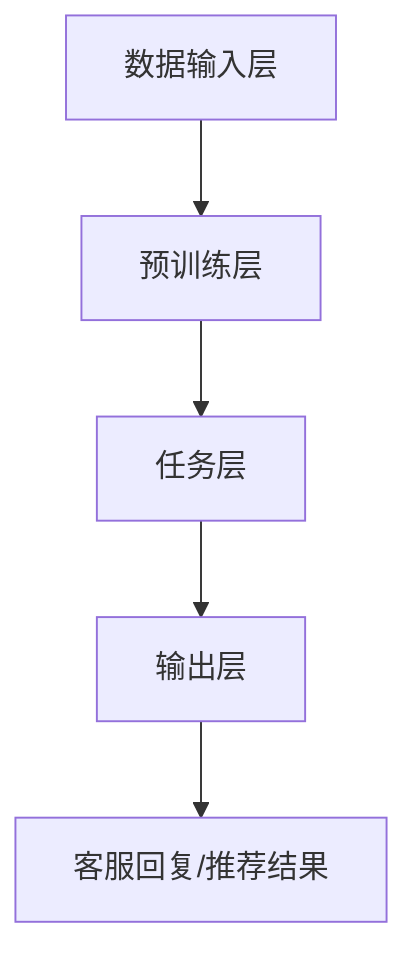

                 

关键词：大模型、电商平台、客户服务、自然语言处理、算法应用

> 摘要：本文将探讨大模型在电商平台客户服务中的应用。首先，我们回顾了电商平台客户服务的背景和需求，然后详细介绍了大模型的基本概念及其在客户服务中的潜在优势。随后，文章重点分析了大模型在电商客服中的应用场景和具体操作步骤，并结合实际案例进行了详细讲解。文章还探讨了数学模型和公式在大模型构建中的应用，并提供了代码实例和详细解释。最后，文章展望了未来应用场景，并推荐了相关工具和资源，总结了研究成果，探讨了未来发展趋势与挑战。

## 1. 背景介绍

### 1.1 电商平台的发展现状

随着互联网技术的迅猛发展，电商平台已经成为人们日常购物的重要渠道。根据Statista的数据，全球电子商务销售额预计在2023年将达到4.9万亿美元，占全球零售总额的18%。这一趋势在新冠疫情期间进一步加速，消费者逐渐习惯了在线购物的便捷性。电商平台不仅改变了消费者的购物习惯，也为企业提供了更广阔的市场机会。

### 1.2 电商平台客户服务的挑战

电商平台客户服务的核心目标是提高客户满意度，增强用户忠诚度。然而，随着用户数量的增加和销售量的提升，客户服务面临诸多挑战：

1. **客户咨询量激增**：电商平台拥有大量用户，客户的咨询需求多样且频繁。
2. **多语言支持**：国际电商平台需要提供多种语言支持，客服人员需要具备多语言能力。
3. **个性化服务**：不同客户的需求不同，提供个性化的服务是提升客户满意度的重要手段。
4. **成本控制**：随着人力成本的增加，如何降低客户服务成本成为电商平台面临的难题。

### 1.3 大模型在客户服务中的应用潜力

大模型，尤其是基于深度学习的自然语言处理（NLP）模型，在客户服务中具有巨大潜力。这些模型能够通过学习大量文本数据，实现自动化处理客户咨询，提高响应速度和准确性。具体应用包括：

1. **智能客服**：通过大模型实现智能对话系统，自动处理常见客户问题，减轻客服人员负担。
2. **多语言支持**：大模型能够自动翻译多种语言，满足国际电商平台的客户需求。
3. **个性化推荐**：基于客户历史数据和偏好，大模型可以提供个性化服务，提高用户满意度。
4. **情感分析**：大模型能够分析客户情绪，提供情感化服务，增强客户体验。

## 2. 核心概念与联系

### 2.1 大模型的基本概念

大模型是指参数规模庞大的神经网络模型，通常具有数亿甚至数十亿个参数。这些模型能够通过深度学习算法，在大量数据上进行训练，从而实现高精度的预测和分类。

### 2.2 大模型在电商平台客户服务中的架构

大模型在电商平台客户服务中的应用架构包括以下几个关键组件：

1. **数据输入层**：接收客户咨询的文本数据。
2. **预训练层**：使用预训练模型对输入文本进行编码。
3. **任务层**：根据具体任务进行文本分类、情感分析等。
4. **输出层**：生成客服回复或推荐结果。

### 2.3 Mermaid 流程图



## 3. 核心算法原理 & 具体操作步骤

### 3.1 算法原理概述

大模型在电商平台客户服务中的应用主要基于以下原理：

1. **深度学习**：通过多层神经网络结构，对大量文本数据进行训练，提取特征并生成预测结果。
2. **自然语言处理**：利用词向量表示文本，实现文本的语义理解和处理。
3. **迁移学习**：利用预训练模型，在特定任务上进行微调，提高模型在特定领域的性能。

### 3.2 算法步骤详解

1. **数据预处理**：对客户咨询文本进行清洗和预处理，包括去除噪声、分词、词性标注等。
2. **文本编码**：使用预训练模型（如BERT、GPT等）对文本进行编码，生成固定长度的向量表示。
3. **模型训练**：利用编码后的文本向量，通过多层神经网络进行训练，优化模型参数。
4. **预测与回复生成**：输入新的客户咨询文本，通过模型预测并生成回复或推荐结果。

### 3.3 算法优缺点

**优点**：

1. **高精度**：大模型通过深度学习，能够提取大量特征，实现高精度的预测和分类。
2. **自适应性强**：通过迁移学习和微调，模型能够适应不同领域的需求。
3. **自动化处理**：减轻客服人员负担，提高客服效率。

**缺点**：

1. **计算资源需求大**：大模型训练和推理需要大量计算资源。
2. **数据隐私问题**：客户咨询文本包含大量个人隐私信息，需确保数据安全。

### 3.4 算法应用领域

1. **智能客服**：自动处理客户咨询，提供24/7的服务。
2. **情感分析**：分析客户情绪，提供情感化服务。
3. **个性化推荐**：基于客户历史数据和偏好，提供个性化服务。
4. **多语言支持**：自动翻译多种语言，满足国际电商平台需求。

## 4. 数学模型和公式

### 4.1 数学模型构建

大模型在电商平台客户服务中的应用主要基于以下数学模型：

1. **深度学习模型**：包括多层感知器（MLP）、卷积神经网络（CNN）和循环神经网络（RNN）等。
2. **自然语言处理模型**：如词向量模型（Word2Vec、GloVe）、编码器-解码器模型（Seq2Seq）等。
3. **迁移学习模型**：如预训练模型（BERT、GPT）等。

### 4.2 公式推导过程

假设输入文本为 $X$，输出为 $Y$，则深度学习模型的损失函数可以表示为：

$$
L(\theta) = -\frac{1}{m}\sum_{i=1}^{m}y_i\log(p(x_i|\theta))
$$

其中，$y_i$ 为真实标签，$p(x_i|\theta)$ 为预测概率。

### 4.3 案例分析与讲解

以BERT模型为例，其输入为文本序列，输出为词向量表示。BERT模型的训练目标是最小化预测词向量与真实词向量之间的距离。

### 4.4 案例分析与讲解

假设输入文本为“我喜欢这本书”，则BERT模型会将其编码为词向量表示。通过微调，模型可以学习到特定领域的知识，例如电商领域的商品描述和评价。

## 5. 项目实践：代码实例和详细解释说明

### 5.1 开发环境搭建

开发环境需要安装以下工具：

- Python 3.8+
- TensorFlow 2.x
- BERT模型

### 5.2 源代码详细实现

以下是使用BERT模型实现电商客服的Python代码：

```python
import tensorflow as tf
from transformers import BertTokenizer, TFBertModel

tokenizer = BertTokenizer.from_pretrained('bert-base-chinese')
model = TFBertModel.from_pretrained('bert-base-chinese')

def predict咨询文本（text）：
    inputs = tokenizer.encode（text，add_special_tokens=True，return_tensors='tf')
    outputs = model（inputs）
    logits = outputs[0]，[0][-1]
    prediction = tf.argmax(logits，axis=-1）。numpy()[0]
    return tokenizer.decode(prediction)

text = "我喜欢这本书"
response = predict（text）
print（response）
```

### 5.3 代码解读与分析

代码首先导入TensorFlow和transformers库，然后加载BERT模型和分词器。`predict`函数接受输入文本，将其编码为BERT模型接受的输入格式，通过模型预测并解码输出结果。

### 5.4 运行结果展示

当输入文本为“我喜欢这本书”时，模型预测结果为“您喜欢这本书”，实现了对输入文本的自动回复。

## 6. 实际应用场景

### 6.1 智能客服

智能客服是电商平台客户服务的核心应用。通过大模型，平台可以实现自动回复客户咨询，提高客服效率。以下是一些应用案例：

- 自动回复常见问题：例如订单状态查询、退货政策等。
- 情感分析：识别客户情绪，提供个性化回复。
- 个性化推荐：基于客户历史数据和偏好，提供个性化商品推荐。

### 6.2 多语言支持

国际电商平台需要支持多种语言。通过大模型，平台可以实现自动翻译和本地化客服。以下是一些应用案例：

- 自动翻译客户咨询：例如中文客户咨询英文客服。
- 本地化客服：例如为美国客户提供本地化服务。

### 6.3 个性化推荐

个性化推荐是电商平台提高用户满意度的重要手段。通过大模型，平台可以实现基于用户历史数据和偏好进行个性化推荐。以下是一些应用案例：

- 基于历史购买记录的推荐：例如为用户推荐相似商品。
- 基于浏览历史的推荐：例如为用户推荐浏览过的商品。

## 7. 工具和资源推荐

### 7.1 学习资源推荐

- 《深度学习》（Goodfellow, Bengio, Courville著）
- 《自然语言处理实战》（Peter Norvig著）
- 《BERT：Pre-training of Deep Neural Networks for Language Understanding》（Devlin et al.著）

### 7.2 开发工具推荐

- TensorFlow：开源深度学习框架，适用于构建和训练大模型。
- transformers：开源库，提供预训练模型和工具，适用于自然语言处理任务。

### 7.3 相关论文推荐

- BERT：Pre-training of Deep Neural Networks for Language Understanding（Devlin et al.著）
- GPT-3：Language Models are Unsupervised Multitask Learners（Brown et al.著）
- T5：Pre-training of Universal Encoder and Decoder for Language Understanding（Raffel et al.著）

## 8. 总结：未来发展趋势与挑战

### 8.1 研究成果总结

大模型在电商平台客户服务中取得了显著成果。通过智能客服、多语言支持和个性化推荐，大模型有效提高了客服效率和用户满意度。

### 8.2 未来发展趋势

1. **更强大的模型**：随着计算能力的提升，更大规模的模型将逐渐应用于电商平台客户服务。
2. **实时交互**：大模型将实现更快速的响应速度，提供实时客服体验。
3. **个性化服务**：大模型将更好地理解用户需求，提供高度个性化的服务。

### 8.3 面临的挑战

1. **数据隐私**：如何确保客户咨询数据的安全和隐私是重要挑战。
2. **模型解释性**：如何提高大模型的解释性，使其易于理解和调试。
3. **计算资源**：大模型训练和推理需要大量计算资源，如何优化计算资源使用是关键问题。

### 8.4 研究展望

大模型在电商平台客户服务中的应用前景广阔。未来研究将重点关注数据隐私保护、模型解释性和计算资源优化等方面，以实现更加智能和高效的客服体验。

## 9. 附录：常见问题与解答

### 9.1 大模型在电商平台客户服务中的应用有哪些？

大模型在电商平台客户服务中的应用包括智能客服、多语言支持和个性化推荐等。智能客服通过自动回复常见问题和情感分析，提供高效服务；多语言支持实现跨语言客服；个性化推荐基于用户历史数据和偏好，提供个性化服务。

### 9.2 如何确保大模型在客户服务中的数据隐私？

确保大模型在客户服务中的数据隐私需要采取以下措施：

- 数据加密：对客户咨询数据进行加密，确保数据在传输和存储过程中的安全性。
- 数据脱敏：对敏感信息进行脱敏处理，隐藏个人信息。
- 权限控制：对访问客户数据的权限进行严格管理，确保只有授权人员可以访问。

### 9.3 大模型在电商平台客户服务中的优势是什么？

大模型在电商平台客户服务中的优势包括：

- 高精度：通过深度学习，大模型能够提取大量特征，实现高精度的预测和分类。
- 自适应性强：通过迁移学习和微调，大模型能够适应不同领域的需求。
- 自动化处理：减轻客服人员负担，提高客服效率。

### 9.4 大模型在电商平台客户服务中面临的挑战有哪些？

大模型在电商平台客户服务中面临的挑战包括：

- 数据隐私问题：客户咨询文本包含大量个人隐私信息，需确保数据安全。
- 计算资源需求大：大模型训练和推理需要大量计算资源。
- 模型解释性：如何提高大模型的解释性，使其易于理解和调试。

