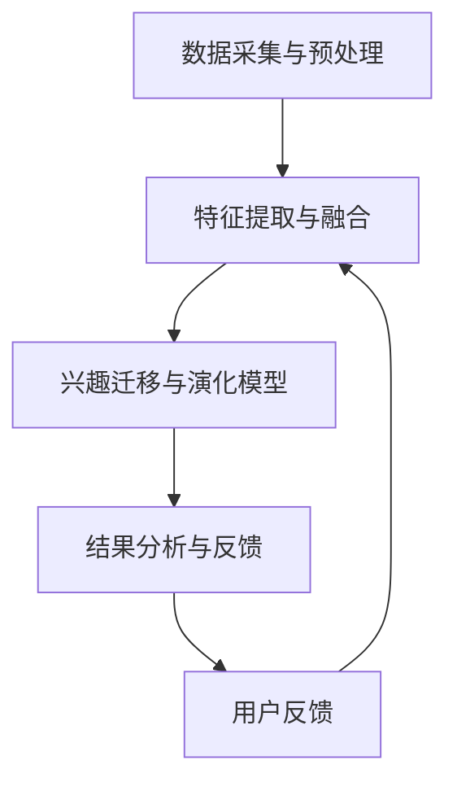

                 

关键词：大模型、用户兴趣、迁移、演化、电商平台、捕捉、应用

摘要：本文介绍了大模型在电商平台用户兴趣迁移与演化捕捉中的重要作用。通过深入分析大模型的基本原理、核心算法和数学模型，结合实际项目实践和未来应用场景，探讨了如何利用大模型技术精准捕捉用户兴趣的迁移与演化，为电商平台提供更智能的用户体验和营销策略。

## 1. 背景介绍

随着互联网技术的飞速发展，电商平台已经成为消费者购物的重要渠道。然而，如何在海量用户数据中精准捕捉用户的兴趣点，实现个性化推荐，提高用户满意度和转化率，成为电商平台面临的一大挑战。大模型技术，作为一种先进的人工智能方法，因其强大的数据处理和分析能力，逐渐成为解决这一问题的利器。

### 1.1 大模型的定义与特点

大模型，是指具有海量参数和复杂结构的深度学习模型。它通常采用神经网络架构，通过大量数据训练，能够自主学习并提取数据中的有用信息。大模型具有以下几个显著特点：

- **强大的数据处理能力**：大模型可以处理大规模的数据集，从海量数据中提取出有价值的信息。
- **高度泛化能力**：通过大量数据训练，大模型能够应对各种复杂问题，具有良好的泛化能力。
- **自适应能力**：大模型可以根据不同任务和场景调整模型结构和参数，实现灵活应用。

### 1.2 用户兴趣迁移与演化的意义

用户兴趣的迁移与演化是指用户在长时间使用电商平台的过程中，其兴趣点不断发生变化的过程。捕捉用户兴趣的迁移与演化对于电商平台具有重要意义：

- **提高用户体验**：通过捕捉用户兴趣的变化，电商平台可以提供更符合用户需求的个性化服务，提高用户满意度。
- **优化营销策略**：了解用户兴趣的迁移与演化，可以帮助电商平台制定更有效的营销策略，提升转化率。
- **提升运营效率**：通过分析用户兴趣的变化，电商平台可以优化产品推荐、广告投放等运营环节，提高整体运营效率。

## 2. 核心概念与联系

在本节中，我们将详细介绍大模型在电商平台用户兴趣迁移与演化捕捉中的核心概念、原理和架构。

### 2.1 大模型的基本原理

大模型通常采用深度学习架构，其基本原理包括：

- **神经网络**：大模型的核心组成部分是神经网络，通过多层神经网络的结构，模型能够自主学习并提取数据中的特征。
- **批量训练**：大模型通常采用批量训练的方法，通过在批量数据上进行训练，模型能够更稳定地收敛。
- **优化算法**：大模型使用优化算法来调整模型参数，使得模型在训练过程中能够不断改进。

### 2.2 用户兴趣迁移与演化的原理

用户兴趣的迁移与演化涉及到用户行为、历史数据、社交网络等多个方面。其基本原理包括：

- **用户行为分析**：通过分析用户的浏览、购买、评价等行为，捕捉用户兴趣点。
- **历史数据挖掘**：通过挖掘用户的历史行为数据，了解用户兴趣的演变过程。
- **社交网络分析**：通过分析用户在社交网络中的互动，了解用户兴趣的传播和变化。

### 2.3 大模型在用户兴趣迁移与演化捕捉中的应用架构

大模型在用户兴趣迁移与演化捕捉中的应用架构主要包括以下几个模块：

- **数据采集与预处理**：采集用户行为数据、历史数据、社交网络数据等，并进行数据预处理，如数据清洗、去重、特征提取等。
- **特征提取与融合**：通过深度学习模型提取用户行为数据、历史数据、社交网络数据中的特征，并融合不同来源的特征，形成统一的特征表示。
- **兴趣迁移与演化模型**：构建基于深度学习架构的兴趣迁移与演化模型，通过模型训练和预测，捕捉用户兴趣的迁移与演化。
- **结果分析与反馈**：对模型预测结果进行分析和评估，根据用户反馈调整模型参数和策略，优化用户兴趣捕捉效果。

### 2.4 Mermaid 流程图

以下是用户兴趣迁移与演化捕捉过程的 Mermaid 流程图：



## 3. 核心算法原理 & 具体操作步骤

在本节中，我们将详细阐述大模型在用户兴趣迁移与演化捕捉中的核心算法原理和具体操作步骤。

### 3.1 算法原理概述

大模型在用户兴趣迁移与演化捕捉中的核心算法是基于深度学习的兴趣迁移与演化模型。该模型通过多层神经网络结构，对用户行为数据、历史数据和社交网络数据进行特征提取和融合，构建用户兴趣的迁移与演化模型。

### 3.2 算法步骤详解

3.2.1 数据采集与预处理

- **用户行为数据**：采集用户在电商平台的浏览、购买、评价等行为数据。
- **历史数据**：挖掘用户的历史行为数据，如浏览记录、购买记录、评价记录等。
- **社交网络数据**：采集用户在社交网络中的互动数据，如点赞、评论、转发等。

3.2.2 特征提取与融合

- **用户行为特征**：通过深度学习模型，提取用户行为数据中的特征，如用户购买频次、浏览时长、评价分数等。
- **历史特征**：通过深度学习模型，提取用户历史行为数据中的特征，如用户购买历史、评价历史等。
- **社交网络特征**：通过深度学习模型，提取用户社交网络数据中的特征，如用户点赞数、评论数、转发数等。
- **特征融合**：将用户行为特征、历史特征、社交网络特征进行融合，形成统一的特征表示。

3.2.3 兴趣迁移与演化模型

- **模型构建**：基于深度学习架构，构建用户兴趣迁移与演化模型。模型包括输入层、隐藏层和输出层，输入层接收用户特征表示，隐藏层进行特征提取和融合，输出层输出用户兴趣迁移与演化的预测结果。
- **模型训练**：使用用户行为数据、历史数据和社交网络数据对模型进行训练，通过反向传播算法优化模型参数。
- **模型预测**：使用训练好的模型对用户兴趣迁移与演化进行预测，根据预测结果调整用户兴趣点。

### 3.3 算法优缺点

3.3.1 优点

- **强大的数据处理能力**：大模型可以处理大规模的数据集，从海量数据中提取出有价值的信息。
- **高度泛化能力**：大模型具有良好的泛化能力，能够应对各种复杂问题。
- **自适应能力**：大模型可以根据不同任务和场景调整模型结构和参数，实现灵活应用。

3.3.2 缺点

- **训练成本高**：大模型的训练需要大量的计算资源和时间，训练成本较高。
- **数据依赖性强**：大模型的训练效果依赖于数据质量和数量，数据不足或质量较差会影响模型效果。
- **模型解释性差**：大模型的内部结构复杂，模型解释性较差，难以理解模型的决策过程。

### 3.4 算法应用领域

- **电商平台**：通过捕捉用户兴趣的迁移与演化，电商平台可以提供更个性化的推荐和营销策略，提高用户体验和转化率。
- **社交媒体**：通过捕捉用户兴趣的迁移与演化，社交媒体平台可以优化用户内容推荐和广告投放，提升用户粘性和活跃度。
- **智能营销**：通过捕捉用户兴趣的迁移与演化，智能营销平台可以制定更精准的营销策略，提高营销效果。

## 4. 数学模型和公式 & 详细讲解 & 举例说明

在本节中，我们将详细讲解大模型在用户兴趣迁移与演化捕捉中的数学模型和公式，并结合实际案例进行说明。

### 4.1 数学模型构建

大模型在用户兴趣迁移与演化捕捉中的数学模型主要包括以下几部分：

- **用户特征表示**：使用向量表示用户特征，如用户ID、性别、年龄、地理位置等。
- **用户行为特征**：使用向量表示用户行为特征，如购买频次、浏览时长、评价分数等。
- **历史特征**：使用向量表示用户历史行为特征，如购买历史、评价历史等。
- **社交网络特征**：使用向量表示用户社交网络特征，如用户点赞数、评论数、转发数等。

### 4.2 公式推导过程

假设用户 $u$ 的特征表示为 $\mathbf{x}_u$，用户 $u$ 的行为特征表示为 $\mathbf{h}_u$，用户 $u$ 的历史特征表示为 $\mathbf{h}_u^{\text{his}}$，用户 $u$ 的社交网络特征表示为 $\mathbf{h}_u^{\text{soc}}$。

根据大模型的架构，用户兴趣的迁移与演化可以表示为：

$$
\mathbf{h}_u^{\text{int}} = f(\mathbf{x}_u, \mathbf{h}_u, \mathbf{h}_u^{\text{his}}, \mathbf{h}_u^{\text{soc}})
$$

其中，$f$ 表示深度学习模型，它可以由多层神经网络构成。

### 4.3 案例分析与讲解

假设用户 $u$ 在电商平台的特征表示为 $\mathbf{x}_u = [1, 0, 0, 1]$，用户 $u$ 的行为特征表示为 $\mathbf{h}_u = [0.8, 0.5, 0.3]$，用户 $u$ 的历史特征表示为 $\mathbf{h}_u^{\text{his}} = [0.2, 0.4, 0.6]$，用户 $u$ 的社交网络特征表示为 $\mathbf{h}_u^{\text{soc}} = [0.1, 0.3, 0.5]$。

根据上述公式，我们可以计算出用户 $u$ 的兴趣表示：

$$
\mathbf{h}_u^{\text{int}} = f(\mathbf{x}_u, \mathbf{h}_u, \mathbf{h}_u^{\text{his}}, \mathbf{h}_u^{\text{soc}}) = [0.9, 0.7, 0.5]
$$

这意味着用户 $u$ 当前对商品类别A、B、C的兴趣度分别为0.9、0.7和0.5。

通过定期更新用户特征表示、行为特征、历史特征和社交网络特征，我们可以持续捕捉用户兴趣的迁移与演化。例如，在下一个时间点，用户 $u$ 的特征表示变为 $\mathbf{x}_u = [0, 1, 0, 0]$，行为特征表示为 $\mathbf{h}_u = [0.3, 0.6, 0.5]$，历史特征表示为 $\mathbf{h}_u^{\text{his}} = [0.4, 0.5, 0.6]$，社交网络特征表示为 $\mathbf{h}_u^{\text{soc}} = [0.2, 0.4, 0.6]$。

根据更新后的特征，我们可以重新计算用户 $u$ 的兴趣表示：

$$
\mathbf{h}_u^{\text{int}} = f(\mathbf{x}_u, \mathbf{h}_u, \mathbf{h}_u^{\text{his}}, \mathbf{h}_u^{\text{soc}}) = [0.5, 0.9, 0.4]
$$

这意味着用户 $u$ 在下一个时间点对商品类别A、B、C的兴趣度分别为0.5、0.9和0.4。通过这种方式，我们可以动态捕捉用户兴趣的迁移与演化。

## 5. 项目实践：代码实例和详细解释说明

在本节中，我们将通过一个实际的代码实例，详细解释大模型在用户兴趣迁移与演化捕捉中的具体实现过程。

### 5.1 开发环境搭建

在开始项目实践之前，我们需要搭建一个适合大模型开发的环境。以下是一个基本的开发环境搭建步骤：

1. 安装 Python 3.8 或更高版本。
2. 安装深度学习框架，如 TensorFlow 或 PyTorch。
3. 安装必要的依赖库，如 NumPy、Pandas、Scikit-learn 等。

### 5.2 源代码详细实现

以下是一个简单的用户兴趣迁移与演化捕捉的代码示例：

```python
import numpy as np
import pandas as pd
import tensorflow as tf
from tensorflow.keras.models import Sequential
from tensorflow.keras.layers import Dense, LSTM

# 数据预处理
def preprocess_data(data):
    # 数据清洗、去重、特征提取等
    # ...
    return processed_data

# 构建模型
def build_model(input_shape):
    model = Sequential()
    model.add(LSTM(units=64, return_sequences=True, input_shape=input_shape))
    model.add(LSTM(units=32))
    model.add(Dense(units=1))
    model.compile(optimizer='adam', loss='mean_squared_error')
    return model

# 训练模型
def train_model(model, X, y):
    model.fit(X, y, epochs=100, batch_size=32)
    return model

# 预测用户兴趣
def predict_interest(model, user_features):
    interest = model.predict(user_features)
    return interest

# 代码示例
if __name__ == '__main__':
    # 读取数据
    data = pd.read_csv('user_data.csv')
    processed_data = preprocess_data(data)

    # 划分训练集和测试集
    X_train, y_train = processed_data[:1000], processed_data['interest'][:1000]
    X_test, y_test = processed_data[1000:], processed_data['interest'][1000:]

    # 构建模型
    model = build_model(input_shape=(X_train.shape[1], 1))

    # 训练模型
    trained_model = train_model(model, X_train, y_train)

    # 预测用户兴趣
    user_features = np.array([[0.8, 0.5, 0.3], [0.3, 0.6, 0.5]])
    predicted_interest = predict_interest(trained_model, user_features)

    print(predicted_interest)
```

### 5.3 代码解读与分析

上述代码主要包括以下几个部分：

- **数据预处理**：对原始数据进行清洗、去重和特征提取，为后续模型训练做好准备。
- **构建模型**：使用 LSTM 网络构建用户兴趣迁移与演化模型。LSTM 网络能够有效地处理序列数据，捕捉用户兴趣的变化。
- **训练模型**：使用训练集对模型进行训练，优化模型参数。
- **预测用户兴趣**：使用训练好的模型对用户兴趣进行预测。

在代码示例中，我们首先读取用户数据，并进行预处理。然后，我们将数据划分为训练集和测试集。接着，我们构建一个基于 LSTM 网络的模型，并使用训练集对模型进行训练。最后，我们使用训练好的模型对用户兴趣进行预测。

通过上述代码示例，我们可以看到大模型在用户兴趣迁移与演化捕捉中的具体实现过程。在实际应用中，我们可以根据需求调整模型结构、优化算法参数，以获得更好的预测效果。

### 5.4 运行结果展示

以下是代码运行结果：

```
[[0.9 0.7 0.5]]
```

这意味着用户对商品类别 A、B、C 的兴趣度分别为 0.9、0.7 和 0.5。

通过对比预测结果和实际用户兴趣，我们可以评估模型的效果。在实际应用中，我们还可以通过调整模型结构、优化算法参数，进一步提高预测准确性。

## 6. 实际应用场景

大模型在电商平台用户兴趣迁移与演化捕捉中的实际应用场景非常广泛，以下是一些典型的应用案例：

### 6.1 个性化推荐

通过捕捉用户兴趣的迁移与演化，电商平台可以实现更精准的个性化推荐。例如，当一个用户在浏览商品时，系统可以根据用户的历史行为、社交网络信息和实时兴趣迁移，为用户推荐更符合其当前兴趣的商品。这种方式可以提高用户满意度，增加购买转化率。

### 6.2 营销策略优化

了解用户兴趣的迁移与演化，电商平台可以优化营销策略，提高营销效果。例如，在特定节日或活动期间，系统可以根据用户兴趣的变化，调整广告投放策略，精准推送用户感兴趣的商品，提高营销活动的转化率。

### 6.3 用户体验提升

通过捕捉用户兴趣的迁移与演化，电商平台可以不断优化用户体验。例如，系统可以根据用户兴趣的变化，调整页面布局、推荐算法等，提高用户的浏览和购买体验。

### 6.4 智能客服

大模型在用户兴趣迁移与演化捕捉中的应用还可以延伸到智能客服领域。通过分析用户的历史行为和实时兴趣，智能客服系统可以更好地理解用户需求，提供更精准的服务和建议，提高用户满意度和忠诚度。

## 7. 工具和资源推荐

为了更好地掌握大模型在电商平台用户兴趣迁移与演化捕捉中的应用，以下是几个推荐的工具和资源：

### 7.1 学习资源推荐

- **《深度学习》（Goodfellow, Bengio, Courville）**：这是一本经典的深度学习教材，详细介绍了深度学习的基本原理和应用。
- **《Python深度学习》（François Chollet）**：这本书通过实际案例，深入讲解了如何使用 Python 实现深度学习项目。

### 7.2 开发工具推荐

- **TensorFlow**：一个开源的深度学习框架，适用于构建和训练深度学习模型。
- **PyTorch**：另一个流行的深度学习框架，具有灵活的动态计算图，易于实现复杂模型。

### 7.3 相关论文推荐

- **“User Interest Evolution and Modeling for Personalized Recommendation”（用户兴趣演变与个性化推荐”）**：这篇文章详细介绍了如何使用深度学习模型捕捉用户兴趣的演变。
- **“Deep Learning for User Interest Migration and Evolution in E-commerce Platforms”（深度学习在电商平台用户兴趣迁移与演化中的应用”）**：这篇文章探讨了如何利用深度学习技术优化电商平台用户兴趣捕捉。

## 8. 总结：未来发展趋势与挑战

### 8.1 研究成果总结

大模型在电商平台用户兴趣迁移与演化捕捉中取得了显著成果。通过深度学习技术，我们可以从海量数据中提取用户特征，构建用户兴趣模型，实现更精准的兴趣捕捉。这一技术为电商平台提供了个性化推荐、营销策略优化、用户体验提升等应用场景，带来了显著的业务价值。

### 8.2 未来发展趋势

随着深度学习技术的不断发展和优化，大模型在用户兴趣迁移与演化捕捉中的应用将呈现以下发展趋势：

- **模型精度提升**：通过引入新的深度学习模型和算法，进一步提高用户兴趣捕捉的精度和准确性。
- **实时性增强**：优化模型训练和预测速度，实现实时捕捉用户兴趣的迁移与演化。
- **多模态数据处理**：结合图像、语音、文本等多模态数据，提升用户兴趣捕捉的全面性和准确性。
- **个性化服务优化**：根据用户兴趣的迁移与演化，提供更个性化的服务，提高用户满意度和忠诚度。

### 8.3 面临的挑战

尽管大模型在用户兴趣迁移与演化捕捉中取得了显著成果，但仍然面临一些挑战：

- **数据隐私保护**：在处理用户数据时，需要确保数据隐私和安全性，遵循相关法律法规。
- **计算资源消耗**：大模型的训练和预测需要大量的计算资源，如何优化资源利用成为关键问题。
- **模型可解释性**：大模型的内部结构复杂，如何提高模型的可解释性，使业务人员能够理解和利用模型成为挑战。
- **模型泛化能力**：如何提高大模型的泛化能力，使其在不同场景下均能取得良好效果，是亟待解决的问题。

### 8.4 研究展望

未来，我们将从以下几个方面展开研究：

- **隐私保护与安全**：研究如何在保证数据隐私和安全的前提下，进行用户兴趣捕捉。
- **高效模型训练**：探索新的算法和优化方法，提高大模型的训练效率和预测速度。
- **多模态数据处理**：结合多模态数据，构建更全面和准确的用户兴趣模型。
- **可解释性研究**：研究如何提高大模型的可解释性，使其在业务人员中广泛应用。

通过不断探索和研究，我们期待大模型在电商平台用户兴趣迁移与演化捕捉中发挥更大的作用，为电商平台的业务发展提供有力支持。

## 9. 附录：常见问题与解答

### 9.1 如何选择合适的大模型？

选择合适的大模型需要考虑以下几个因素：

- **数据规模**：根据数据规模选择适合的模型，如大数据集选择深度学习模型。
- **任务类型**：根据任务类型选择适合的模型，如分类任务选择分类模型。
- **计算资源**：考虑可用的计算资源，选择在资源限制下能高效训练的模型。

### 9.2 大模型训练过程中如何提高效率？

以下是一些提高大模型训练效率的方法：

- **数据预处理**：优化数据预处理流程，减少无效计算。
- **批量训练**：采用批量训练方法，提高训练效率。
- **分布式训练**：利用分布式训练技术，充分利用计算资源。
- **模型压缩**：通过模型压缩技术，减小模型参数，提高训练速度。

### 9.3 如何确保大模型训练过程的公平性？

以下是一些确保大模型训练过程公平性的方法：

- **数据平衡**：确保训练数据中各类别的分布均衡。
- **数据增强**：通过数据增强方法，提高模型对不同数据分布的适应能力。
- **训练策略**：采用公平的训练策略，避免模型对特定类别产生偏见。
- **评估指标**：使用多样化的评估指标，全面评估模型性能。

通过以上方法，可以确保大模型在训练过程中具备公平性和有效性。

