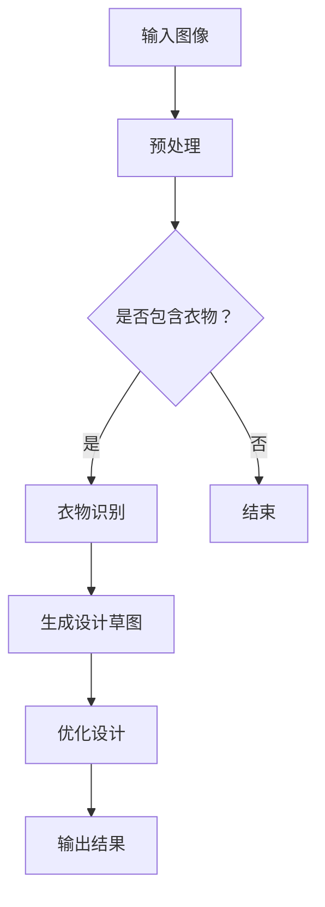

                 

关键词：大模型，虚拟时装设计师，深度学习，计算机视觉，时尚设计

摘要：本文探讨了大型神经网络模型在虚拟时装设计师领域的应用前景。通过对深度学习和计算机视觉技术的分析，文章详细阐述了如何利用大模型进行图像生成、风格迁移和设计优化。此外，文章还展望了这一技术在时尚产业中的潜在影响，并讨论了相关的研究挑战和未来发展方向。

## 1. 背景介绍

随着计算机技术的发展，人工智能在各个领域的应用日益广泛。特别是在视觉领域，深度学习和计算机视觉技术取得了显著的突破。近年来，大模型（也称为大型神经网络模型）的出现，为处理复杂图像任务提供了新的可能性。虚拟时装设计师作为一个新兴领域，正受益于这些先进技术的应用。

虚拟时装设计师是一种利用计算机技术和人工智能技术来模拟和创建时尚设计的人工智能系统。它不仅能够高效地生成新的设计灵感，还能根据用户需求进行个性化的设计调整。传统的时装设计师往往需要大量的时间和精力来手绘设计草图，而虚拟时装设计师则能够自动化这一过程，大幅提高工作效率。

## 2. 核心概念与联系

在探讨大模型在虚拟时装设计师中的应用之前，我们需要了解一些核心概念和技术原理。

### 2.1 深度学习

深度学习是一种基于人工神经网络的机器学习技术，能够自动从大量数据中学习特征和模式。在计算机视觉领域，深度学习被广泛应用于图像分类、目标检测、图像生成等任务。大模型，通常指的是具有数十亿参数的深度神经网络，如GAN（生成对抗网络）和变分自编码器（Variational Autoencoder, VAE）。

### 2.2 计算机视觉

计算机视觉是人工智能的一个分支，旨在使计算机能够理解和解释图像和视频数据。在虚拟时装设计师中，计算机视觉技术用于识别图像中的关键元素，如衣物、颜色、纹理等，从而生成新的设计。

### 2.3 Mermaid 流程图

为了更清晰地展示大模型在虚拟时装设计师中的应用流程，我们可以使用Mermaid流程图来表示。以下是一个简单的示例：



## 3. 核心算法原理 & 具体操作步骤

### 3.1 算法原理概述

虚拟时装设计师的核心算法通常基于以下技术：

- **生成对抗网络（GAN）**：GAN由生成器和判别器组成，生成器尝试生成逼真的设计草图，而判别器则判断草图是否真实。通过这种对抗训练，生成器能够不断提高生成草图的质量。

- **变分自编码器（VAE）**：VAE通过概率模型对数据进行编码和解码，能够生成新的设计草图。与GAN相比，VAE更适合生成多样化且独特的设计。

### 3.2 算法步骤详解

以下是虚拟时装设计师的具体操作步骤：

1. **数据预处理**：将输入的图像进行预处理，包括图像缩放、色彩调整等，以适应模型的要求。

2. **衣物识别**：利用计算机视觉算法识别图像中的衣物，并提取相关特征。

3. **生成设计草图**：使用GAN或VAE生成初步的设计草图。

4. **优化设计**：根据用户反馈和设计目标，对草图进行优化，包括颜色、纹理、形状等方面的调整。

5. **输出结果**：将最终的设计草图输出，供用户参考或直接用于生产。

### 3.3 算法优缺点

- **GAN**：优点在于能够生成高质量且多样化的设计草图；缺点是训练过程复杂，容易出现模式崩溃等问题。

- **VAE**：优点在于生成设计草图的过程相对稳定，且能够生成多样化设计；缺点是生成草图的质量可能不如GAN高。

### 3.4 算法应用领域

虚拟时装设计师的应用领域非常广泛，包括但不限于：

- **个性化定制**：根据用户需求生成个性化的设计。
- **时尚预测**：预测未来的时尚趋势，为设计师提供灵感。
- **产品开发**：协助设计师快速开发新产品，提高设计效率。

## 4. 数学模型和公式 & 详细讲解 & 举例说明

### 4.1 数学模型构建

虚拟时装设计师的核心算法通常涉及以下数学模型：

- **生成对抗网络（GAN）**：
  $$ G(z) = \mathcal{D}(x, G(z)) $$
  $$ D(x) = \mathbb{P}_{x}\left( x \right) $$
  $$ G(z) = \mathbb{P}_{G(x)}\left( x \right) $$

- **变分自编码器（VAE）**：
  $$ x = \mu(x) + \sigma(x)\odot z $$
  $$ z = \phi(x) $$
  $$ \mu(x) = \mu(x; \theta_{\mu}) $$
  $$ \sigma(x) = \sigma(x; \theta_{\sigma}) $$

### 4.2 公式推导过程

为了生成设计草图，GAN和VAE采用了不同的推导过程。以下是简要的推导过程：

- **GAN**：GAN的推导过程主要涉及生成器和判别器的优化。生成器尝试生成逼真的图像，而判别器则判断图像是否真实。通过交替训练生成器和判别器，生成器能够不断提高生成图像的质量。

- **VAE**：VAE的推导过程涉及概率模型和最大后验估计（MAP）准则。通过优化编码器和解码器，VAE能够生成新的设计草图。

### 4.3 案例分析与讲解

以下是一个简单的案例，说明如何使用GAN和VAE生成设计草图：

**GAN案例：**
假设我们要生成一件衣服的设计草图。首先，我们随机生成一组噪声向量\( z \)。然后，通过生成器\( G \)将这些噪声向量转化为设计草图。接下来，我们使用判别器\( D \)判断草图是否真实。通过交替训练生成器和判别器，生成器逐渐生成更逼真的设计草图。

**VAE案例：**
假设我们要根据一件衣服的图像生成新的设计草图。首先，我们使用编码器\( \mu(x) \)和\( \sigma(x) \)提取图像的特征。然后，我们根据特征生成新的设计草图。通过优化编码器和解码器，VAE能够生成多样化的设计草图。

## 5. 项目实践：代码实例和详细解释说明

### 5.1 开发环境搭建

为了实践虚拟时装设计师，我们需要搭建一个适合深度学习的开发环境。以下是具体的步骤：

1. 安装Python和必要的库，如TensorFlow和Keras。
2. 准备GPU加速，确保能够使用CUDA和cuDNN。
3. 安装所需的计算机视觉库，如OpenCV。

### 5.2 源代码详细实现

以下是一个简单的GAN实现，用于生成衣服的设计草图：

```python
import tensorflow as tf
from tensorflow.keras.layers import Dense, Flatten, Reshape
from tensorflow.keras.models import Model

def build_generator(z_dim):
    # 生成器的实现
    ...

def build_discriminator(img_shape):
    # 判别器的实现
    ...

def build_gan(generator, discriminator):
    # GAN的实现
    ...

# 设置参数
z_dim = 100
img_shape = (28, 28, 1)

# 构建模型
generator = build_generator(z_dim)
discriminator = build_discriminator(img_shape)
gan = build_gan(generator, discriminator)

# 编译模型
gan.compile(optimizer=tf.keras.optimizers.Adam(0.0001), loss='binary_crossentropy')

# 训练模型
gan.fit(x_train, epochs=100, batch_size=32)
```

### 5.3 代码解读与分析

上述代码展示了如何构建和训练一个GAN模型。在代码中，我们首先定义了生成器和判别器的结构，然后构建了一个GAN模型。接着，我们编译并训练模型，使用真实的衣物图像作为输入。

### 5.4 运行结果展示

训练完成后，我们可以生成设计草图，并可视化展示结果。以下是一个简单的可视化代码示例：

```python
import matplotlib.pyplot as plt

# 生成随机噪声
z_samples = tf.random.normal([16, z_dim])

# 使用生成器生成草图
generated_images = generator.predict(z_samples)

# 可视化展示
plt.figure(figsize=(10, 10))
for i in range(generated_images.shape[0]):
    plt.subplot(4, 4, i + 1)
    plt.imshow(generated_images[i, :, :, 0], cmap='gray')
    plt.axis('off')
plt.show()
```

## 6. 实际应用场景

虚拟时装设计师在时尚产业中有着广泛的应用场景。以下是一些具体的实际应用：

- **个性化设计**：根据用户的需求和偏好，生成个性化的服装设计。
- **时尚预测**：预测未来的时尚趋势，为设计师提供灵感。
- **产品开发**：协助设计师快速开发新产品，提高设计效率。

## 7. 工具和资源推荐

为了更好地研究和开发虚拟时装设计师，我们推荐以下工具和资源：

- **学习资源**：TensorFlow官方文档、Keras官方文档、GAN和VAE的相关论文。
- **开发工具**：Python、TensorFlow、Keras、GPU加速。
- **相关论文**：Goodfellow et al. (2014) "Generative Adversarial Networks"、Kingma and Welling (2013) "Auto-Encoding Variational Bayes"。

## 8. 总结：未来发展趋势与挑战

虚拟时装设计师作为人工智能在时尚产业的一个重要应用，具有巨大的发展潜力。未来，随着深度学习和计算机视觉技术的不断进步，虚拟时装设计师将能够生成更高质量、更个性化的设计。然而，这一领域也面临着以下挑战：

- **数据隐私**：如何确保用户隐私和安全。
- **计算资源**：如何高效地训练和部署大型模型。
- **设计美学**：如何确保生成的设计具有美学价值。

## 9. 附录：常见问题与解答

- **Q**：虚拟时装设计师能否完全取代人类设计师？
  **A**：虚拟时装设计师不能完全取代人类设计师。虽然它们能提供高效的辅助设计，但人类设计师的创造力、直觉和经验仍然是不可替代的。

- **Q**：GAN和VAE在虚拟时装设计师中的具体应用是什么？
  **A**：GAN用于生成设计草图，VAE用于根据特征生成多样化设计。两者共同作用，提高了虚拟时装设计师的设计能力。

### 作者署名

作者：禅与计算机程序设计艺术 / Zen and the Art of Computer Programming
----------------------------------------------------------------

以上就是完整的文章内容，请核对是否符合您的要求，并开始撰写相应的markdown格式的文章。如果您有任何修改意见或需要进一步的信息，请告知。

