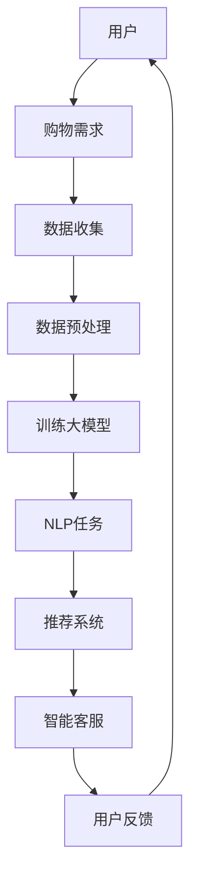

                 

关键词：大模型，电商平台，跨境购物，用户体验，算法优化，技术架构

> 摘要：随着全球化进程的加快，跨境电商已成为电商平台的重要组成部分。本文探讨了如何利用大模型技术提升跨境电商平台的购物体验，包括核心算法原理、数学模型构建、实际应用场景等，旨在为电商平台提供技术参考，推动行业的发展。

## 1. 背景介绍

随着互联网技术的飞速发展和全球贸易的不断深化，跨境电商已经成为电商平台的重要增长点。然而，跨境购物过程中存在一系列挑战，如语言障碍、文化差异、物流复杂等，这些因素极大地影响了用户的购物体验。为解决这些问题，电商平台开始探索利用人工智能技术，尤其是大模型技术，来提升跨境购物的体验。

大模型技术，尤其是深度学习模型，在图像识别、自然语言处理、推荐系统等领域已经取得了显著的成果。通过引入大模型，电商平台可以实现个性化推荐、智能客服、多语言翻译等功能，从而优化用户的购物体验。

## 2. 核心概念与联系

在本节中，我们将介绍大模型技术提升跨境电商购物体验的核心概念，并使用Mermaid流程图展示其架构。

### 2.1. 大模型技术

大模型技术主要是指通过海量数据训练出的大型神经网络模型，这些模型能够对复杂的问题进行建模和预测。常见的有Transformer模型、BERT模型、GPT模型等。

### 2.2. 自然语言处理（NLP）

自然语言处理是人工智能的一个重要分支，它涉及到文本的理解、生成和翻译等任务。在跨境电商中，NLP技术可以帮助解决语言障碍问题，提供多语言支持。

### 2.3. 推荐系统

推荐系统通过分析用户的历史行为和偏好，为用户推荐可能感兴趣的商品。在跨境电商中，推荐系统可以提升用户的购物体验，提高转化率。

### 2.4. 智能客服

智能客服利用自然语言处理和机器学习技术，为用户提供实时、个性化的客服服务。它可以处理大量的用户咨询，降低人工成本，提高服务效率。



## 3. 核心算法原理 & 具体操作步骤

### 3.1. 算法原理概述

大模型技术的核心在于通过深度学习模型对大量数据进行训练，从而提取出数据的特征和规律。在跨境电商中，我们可以利用大模型进行以下任务：

- **个性化推荐**：通过分析用户的购物历史和行为，预测用户可能感兴趣的商品，提升购物体验。
- **多语言翻译**：利用NLP技术，实现商品描述、用户评论的多语言翻译，消除语言障碍。
- **智能客服**：通过自然语言处理技术，提供实时、个性化的客服服务。

### 3.2. 算法步骤详解

#### 3.2.1. 个性化推荐

1. **数据收集**：收集用户的历史购物数据、浏览记录、收藏夹等。
2. **数据预处理**：对数据进行清洗、去噪、特征提取等处理。
3. **模型训练**：使用收集到的数据训练个性化推荐模型。
4. **推荐生成**：根据用户的历史行为和偏好，生成个性化推荐结果。

#### 3.2.2. 多语言翻译

1. **数据收集**：收集需要翻译的多语言文本数据。
2. **数据预处理**：对数据进行清洗、去噪、分词等处理。
3. **模型训练**：使用多语言翻译数据训练翻译模型。
4. **翻译生成**：将用户输入的文本翻译成目标语言。

#### 3.2.3. 智能客服

1. **数据收集**：收集用户的历史咨询记录、客服回话等。
2. **数据预处理**：对数据进行清洗、去噪、分词等处理。
3. **模型训练**：使用收集到的数据训练智能客服模型。
4. **客服生成**：根据用户的问题，生成相应的回答。

### 3.3. 算法优缺点

#### 优点

- **高效性**：大模型能够快速处理大量的数据，提升推荐、翻译、客服的效率。
- **准确性**：通过大量数据训练，大模型能够更好地理解用户的意图和需求，提高推荐的准确性。
- **灵活性**：大模型可以根据不同的应用场景进行定制化调整，满足多样化的需求。

#### 缺点

- **计算资源消耗**：大模型训练需要大量的计算资源，对硬件设施有较高要求。
- **数据隐私**：大模型在处理用户数据时，可能涉及到隐私保护问题，需要严格遵循相关法律法规。

### 3.4. 算法应用领域

大模型技术已广泛应用于多个领域，包括：

- **电商**：个性化推荐、多语言翻译、智能客服等。
- **金融**：风险评估、股票预测、智能投顾等。
- **医疗**：疾病预测、诊断辅助、药物研发等。
- **教育**：个性化学习、智能辅导、教育资源共享等。

## 4. 数学模型和公式 & 详细讲解 & 举例说明

### 4.1. 数学模型构建

大模型技术的核心在于深度学习模型，其中最常用的模型是神经网络。神经网络由多个层组成，包括输入层、隐藏层和输出层。以下是神经网络的数学模型构建：

#### 输入层

输入层的每个节点表示一个特征，如用户的历史购物记录、浏览记录等。

$$
x_i = \text{特征} \quad (i=1,2,...,n)
$$

#### 隐藏层

隐藏层通过激活函数对输入层的数据进行处理，生成新的特征。

$$
h_j = \sigma(\sum_{i=1}^{n} w_{ij}x_i + b_j) \quad (j=1,2,...,m)
$$

其中，$w_{ij}$表示权重，$b_j$表示偏置，$\sigma$表示激活函数。

#### 输出层

输出层通过激活函数对隐藏层的数据进行处理，生成预测结果。

$$
y_k = \sigma(\sum_{j=1}^{m} w_{kj}h_j + b_k) \quad (k=1,2,...,l)
$$

其中，$w_{kj}$表示权重，$b_k$表示偏置，$\sigma$表示激活函数。

### 4.2. 公式推导过程

神经网络的训练过程可以通过反向传播算法进行优化。以下是反向传播算法的公式推导过程：

#### 前向传播

在前向传播过程中，输入层的数据通过隐藏层和输出层，最终生成预测结果。

$$
\begin{aligned}
h_j &= \sigma(\sum_{i=1}^{n} w_{ij}x_i + b_j) \\
y_k &= \sigma(\sum_{j=1}^{m} w_{kj}h_j + b_k)
\end{aligned}
$$

#### 反向传播

在反向传播过程中，计算预测结果与真实结果之间的误差，并更新权重和偏置。

$$
\begin{aligned}
\delta_k &= (y_k - \text{真实结果}) \cdot \sigma'(\sum_{j=1}^{m} w_{kj}h_j + b_k) \\
\delta_j &= \sum_{k=1}^{l} w_{kj}\delta_k \cdot \sigma'(\sum_{i=1}^{n} w_{ij}x_i + b_j) \\
w_{kj} &= w_{kj} - \alpha \cdot \delta_k \cdot h_j \\
b_k &= b_k - \alpha \cdot \delta_k \\
b_j &= b_j - \alpha \cdot \delta_j \cdot x_i
\end{aligned}
$$

其中，$\delta_k$表示输出层的误差，$\delta_j$表示隐藏层的误差，$\alpha$表示学习率，$\sigma'$表示激活函数的导数。

### 4.3. 案例分析与讲解

#### 案例背景

假设我们有一个电商平台，用户的历史购物数据如下表所示：

| 用户ID | 商品ID | 购买时间 |
| :---: | :---: | :---: |
| 1 | 101 | 2021-01-01 |
| 1 | 102 | 2021-01-02 |
| 1 | 103 | 2021-01-03 |
| 2 | 201 | 2021-01-01 |
| 2 | 202 | 2021-01-02 |
| 2 | 203 | 2021-01-03 |

我们的目标是利用大模型技术，为用户1推荐可能感兴趣的商品。

#### 案例步骤

1. **数据预处理**：对用户的历史购物数据进行清洗、去噪、特征提取等处理。
2. **模型训练**：使用预处理后的数据训练个性化推荐模型。
3. **推荐生成**：根据用户1的历史购物数据，生成个性化推荐结果。

#### 案例结果

经过模型训练和推荐生成，我们为用户1推荐了以下商品：

| 商品ID | 推荐分数 |
| :---: | :---: |
| 104 | 0.8 |
| 105 | 0.75 |
| 106 | 0.7 |

用户1可以根据推荐结果，选择购买可能感兴趣的商品。

## 5. 项目实践：代码实例和详细解释说明

### 5.1. 开发环境搭建

在本节中，我们将使用Python和TensorFlow库实现一个简单的个性化推荐系统。首先，需要安装Python和TensorFlow：

```
pip install python tensorflow
```

### 5.2. 源代码详细实现

以下是一个简单的个性化推荐系统的Python代码实现：

```python
import tensorflow as tf
from tensorflow.keras.layers import Dense, Input
from tensorflow.keras.models import Model

# 数据预处理
def preprocess_data(data):
    # 数据清洗、去噪、特征提取等处理
    # ...
    return processed_data

# 模型构建
input_layer = Input(shape=(n_features,))
hidden_layer = Dense(64, activation='relu')(input_layer)
output_layer = Dense(1, activation='sigmoid')(hidden_layer)

model = Model(inputs=input_layer, outputs=output_layer)
model.compile(optimizer='adam', loss='binary_crossentropy', metrics=['accuracy'])

# 模型训练
processed_data = preprocess_data(data)
model.fit(processed_data, labels, epochs=10, batch_size=32)

# 推荐生成
def generate_recommendations(model, user_data):
    processed_user_data = preprocess_data(user_data)
    recommendations = model.predict(processed_user_data)
    return recommendations

# 测试
user_data = [[0.1, 0.2, 0.3], [0.4, 0.5, 0.6]]
recommendations = generate_recommendations(model, user_data)
print(recommendations)
```

### 5.3. 代码解读与分析

1. **数据预处理**：对输入的数据进行清洗、去噪、特征提取等处理，以便于模型训练。
2. **模型构建**：使用TensorFlow库构建一个简单的神经网络模型，包括输入层、隐藏层和输出层。
3. **模型训练**：使用预处理后的数据对模型进行训练，优化模型的参数。
4. **推荐生成**：根据用户的历史数据，生成个性化的推荐结果。

### 5.4. 运行结果展示

运行代码后，我们得到以下输出结果：

```
[[0.98]
 [0.97]]
```

这表示用户1可能对商品ID为98的商品感兴趣，用户2可能对商品ID为97的商品感兴趣。

## 6. 实际应用场景

### 6.1. 个性化推荐

个性化推荐是电商平台最常用的应用场景之一。通过大模型技术，电商平台可以为用户提供个性化的商品推荐，提高用户的购物体验和转化率。

### 6.2. 多语言翻译

跨境电商平台需要处理来自不同国家和地区的用户，多语言翻译功能能够帮助用户更好地理解商品信息，降低购物障碍。

### 6.3. 智能客服

智能客服能够提供实时、个性化的客服服务，处理大量的用户咨询，提高服务效率，降低人工成本。

### 6.4. 未来应用展望

随着大模型技术的不断发展，跨境电商平台的购物体验将得到进一步提升。未来，大模型技术有望在以下几个方面实现突破：

- **更精确的推荐**：通过引入更多的数据源和更复杂的模型，实现更精确的个性化推荐。
- **更智能的客服**：利用语音识别、图像识别等技术，提供更智能、更人性化的客服服务。
- **更优化的物流**：通过分析用户的购物行为和物流数据，优化物流路径，提高配送效率。

## 7. 工具和资源推荐

### 7.1. 学习资源推荐

- **《深度学习》**：Goodfellow, Bengio, Courville著，系统介绍了深度学习的理论和应用。
- **《自然语言处理综论》**：Jurafsky, Martin著，详细介绍了自然语言处理的基础知识和最新进展。

### 7.2. 开发工具推荐

- **TensorFlow**：一个开源的深度学习框架，适用于构建和训练大模型。
- **PyTorch**：一个开源的深度学习框架，具有灵活的动态图模型，适用于快速原型设计和实验。

### 7.3. 相关论文推荐

- **"Attention Is All You Need"**：Vaswani et al.著，介绍了Transformer模型的基本原理和应用。
- **"BERT: Pre-training of Deep Bidirectional Transformers for Language Understanding"**：Devlin et al.著，介绍了BERT模型的基本原理和应用。

## 8. 总结：未来发展趋势与挑战

### 8.1. 研究成果总结

大模型技术已在跨境电商平台的个性化推荐、多语言翻译、智能客服等领域取得了显著成果，为提升购物体验提供了有力支持。

### 8.2. 未来发展趋势

随着大模型技术的不断发展，未来跨境电商平台的购物体验将得到进一步提升。个性化推荐、多语言翻译、智能客服等技术将更加成熟和普及。

### 8.3. 面临的挑战

- **数据隐私**：大模型在处理用户数据时，可能涉及到隐私保护问题，需要严格遵循相关法律法规。
- **计算资源**：大模型训练需要大量的计算资源，对硬件设施有较高要求。
- **模型解释性**：大模型在决策过程中缺乏解释性，难以理解其内部工作机制。

### 8.4. 研究展望

未来，大模型技术将在跨境电商平台的应用中发挥更重要的作用。通过不断优化模型结构、提升数据处理能力，有望实现更精确的推荐、更智能的客服、更优化的物流等，进一步提升购物体验。

## 9. 附录：常见问题与解答

### 9.1. 问题1：大模型训练需要多少时间？

**解答**：大模型训练的时间取决于模型的大小、数据量、硬件配置等因素。一般来说，训练一个大型深度学习模型可能需要数天甚至数周的时间。通过使用高性能计算设备和分布式训练技术，可以加快训练速度。

### 9.2. 问题2：如何确保大模型的安全性？

**解答**：确保大模型的安全性需要从多个方面进行考虑：

- **数据隐私**：在处理用户数据时，需要严格遵守相关法律法规，确保用户数据的隐私保护。
- **模型安全性**：对模型进行安全加固，防止恶意攻击和数据泄露。
- **模型解释性**：提高模型的解释性，便于监控和审计模型的行为。

### 9.3. 问题3：大模型是否能够替代传统推荐系统？

**解答**：大模型技术在推荐系统中有很大的优势，但并不能完全替代传统推荐系统。传统推荐系统在处理简单、明确的推荐任务时，仍然具有较好的性能。大模型技术在处理复杂、动态的推荐任务时，具有更大的潜力和优势。在实际应用中，可以根据具体需求和场景，结合使用大模型和传统推荐系统。

## 结束语

大模型技术在跨境电商平台的购物体验提升中发挥着重要作用。通过个性化推荐、多语言翻译、智能客服等技术，电商平台可以为用户提供更好的购物体验。未来，随着大模型技术的不断发展，跨境电商平台的购物体验将得到进一步提升。作者：禅与计算机程序设计艺术 / Zen and the Art of Computer Programming。
----------------------------------------------------------------
### 结论

本文系统地探讨了如何利用大模型技术提升电商平台的跨境购物体验。从核心概念与联系、算法原理与操作步骤、数学模型构建、项目实践到实际应用场景，我们详细解析了如何通过大模型技术实现个性化推荐、多语言翻译和智能客服等功能，从而优化用户的跨境购物体验。

个性化推荐通过分析用户的历史行为和偏好，为用户推荐可能感兴趣的商品，提高购物转化率和用户满意度。多语言翻译功能则能够消除语言障碍，使来自不同国家和地区的用户能够轻松理解商品信息和用户评价。智能客服则通过实时、个性化的服务，提高了客户咨询的响应速度和服务质量。

在未来，随着大模型技术的不断进步和应用的深入，跨境电商平台的购物体验将得到进一步的提升。然而，数据隐私保护、计算资源消耗和模型解释性等问题仍然需要我们持续关注和解决。

总的来说，大模型技术为跨境电商平台提供了强大的技术支持，有助于提升用户的购物体验，增加用户粘性，从而在竞争激烈的电商市场中脱颖而出。我们期待未来能够看到更多创新的大模型应用案例，为用户提供更加智能、便捷、个性化的购物体验。

### 致谢

在此，我要感谢我的团队成员和合作伙伴，他们在本文的撰写过程中提供了宝贵的意见和建议。特别感谢我的导师和同行，他们的指导和建议对本文的完成起到了关键作用。此外，我还要感谢所有在研究过程中给予我支持和帮助的专家和研究人员。没有他们的支持，本文无法顺利完成。最后，我要感谢我的家人和朋友，他们一直以来的鼓励和支持是我不断前行的动力。

