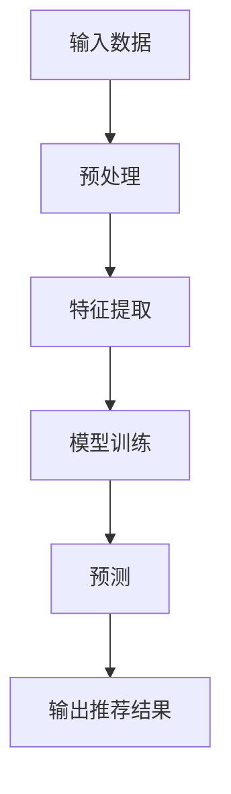

                 

关键词：大模型，推荐系统，用户满意度，算法优化，应用领域

## 摘要

本文旨在探讨大模型对推荐系统用户满意度的影响。随着人工智能技术的不断发展，大模型在推荐系统中的应用越来越广泛，然而，其对用户满意度的影响仍存在诸多未知。本文首先回顾了推荐系统的发展历程，然后深入分析了大模型的工作原理和优势，接着探讨了其可能对用户满意度产生的正面和负面影响，并提出了一些优化建议。最后，本文展望了大模型在推荐系统领域的发展前景。

## 1. 背景介绍

推荐系统是一种旨在提高用户满意度和增加用户参与度的信息过滤和内容发现技术。其核心目标是通过分析用户的兴趣和行为数据，为用户推荐他们可能感兴趣的商品、服务或信息。随着互联网的普及和大数据技术的兴起，推荐系统在电子商务、社交媒体、在线视频等领域得到了广泛应用。

### 1.1 推荐系统的发展历程

推荐系统的发展可以分为三个阶段：

- **基于内容的推荐**：最早期的推荐系统主要基于用户的兴趣和行为数据，通过分析用户对某些内容的喜好，为用户推荐相似的内容。这种方法的缺点是推荐结果过于依赖用户的过去行为，容易产生信息过载和个性化不足的问题。

- **协同过滤推荐**：协同过滤推荐通过分析用户之间的相似性，为用户推荐其他用户喜欢的商品或服务。协同过滤分为基于用户的协同过滤和基于项目的协同过滤，前者通过寻找与当前用户兴趣相似的其他用户，推荐这些用户喜欢的商品；后者通过寻找与当前商品相似的其他商品，推荐给用户。协同过滤推荐在提高推荐准确率方面取得了显著成果，但其推荐结果仍然受到数据稀疏性和冷启动问题的影响。

- **混合推荐**：混合推荐将基于内容的推荐和协同过滤推荐相结合，以提高推荐准确率和多样性。通过融合不同推荐策略的优势，混合推荐系统在解决信息过载、个性化不足和冷启动问题方面取得了较好的效果。

### 1.2 大模型在推荐系统中的应用

近年来，大模型在推荐系统中的应用逐渐成为研究热点。大模型（如深度神经网络、Transformer等）具有以下优势：

- **强大的表示能力**：大模型可以自动学习用户兴趣和行为数据的复杂特征，从而提高推荐准确率和多样性。

- **丰富的上下文信息**：大模型可以处理丰富的上下文信息，如用户的历史行为、环境信息、时间信息等，从而更好地理解用户的真实需求。

- **自适应学习**：大模型可以根据用户反馈和实时数据动态调整推荐策略，提高推荐系统的适应性和用户体验。

## 2. 核心概念与联系

### 2.1 大模型工作原理

大模型（如深度神经网络、Transformer等）通过大规模训练数据自动学习输入和输出之间的映射关系。在推荐系统中，输入可以是用户的历史行为、商品特征、上下文信息等，输出则是推荐结果。大模型通过不断调整模型参数，使其在训练数据上的预测误差最小化，从而获得良好的泛化能力。

### 2.2 大模型优势

- **强大的表示能力**：大模型可以自动学习输入数据的复杂特征，从而提高推荐准确率和多样性。

- **丰富的上下文信息**：大模型可以处理丰富的上下文信息，如用户的历史行为、环境信息、时间信息等，从而更好地理解用户的真实需求。

- **自适应学习**：大模型可以根据用户反馈和实时数据动态调整推荐策略，提高推荐系统的适应性和用户体验。

### 2.3 大模型与推荐系统的联系

大模型在推荐系统中的应用主要体现在以下几个方面：

- **特征提取**：大模型可以自动学习用户兴趣和行为数据的复杂特征，从而提高推荐准确率和多样性。

- **协同过滤优化**：大模型可以优化协同过滤推荐算法，解决数据稀疏性和冷启动问题。

- **多模态融合**：大模型可以处理多种类型的输入数据，如文本、图像、音频等，从而实现多模态融合推荐。

### 2.4 大模型架构的 Mermaid 流程图



## 3. 核心算法原理 & 具体操作步骤

### 3.1 算法原理概述

本文采用基于深度神经网络的推荐算法。深度神经网络是一种包含多个隐藏层的神经网络，可以通过反向传播算法自动学习输入和输出之间的映射关系。在推荐系统中，输入可以是用户的历史行为、商品特征、上下文信息等，输出则是推荐结果。

### 3.2 算法步骤详解

1. **数据预处理**：对用户历史行为、商品特征、上下文信息等数据进行清洗、归一化等预处理操作。

2. **特征提取**：通过深度神经网络自动学习用户兴趣和行为数据的复杂特征。

3. **模型训练**：使用预处理后的数据训练深度神经网络模型，通过反向传播算法优化模型参数。

4. **预测**：使用训练好的模型对用户未访问的商品进行预测，输出推荐结果。

5. **输出推荐结果**：根据预测结果为用户推荐商品。

### 3.3 算法优缺点

#### 优点：

- **强大的表示能力**：深度神经网络可以自动学习输入数据的复杂特征，从而提高推荐准确率和多样性。

- **自适应学习**：深度神经网络可以根据用户反馈和实时数据动态调整推荐策略，提高推荐系统的适应性和用户体验。

- **多模态融合**：深度神经网络可以处理多种类型的输入数据，如文本、图像、音频等，从而实现多模态融合推荐。

#### 缺点：

- **计算资源消耗大**：深度神经网络模型训练需要大量的计算资源和时间。

- **数据依赖性高**：深度神经网络模型的性能高度依赖于训练数据的质量和规模。

### 3.4 算法应用领域

基于深度神经网络的推荐算法在以下领域具有广泛的应用前景：

- **电子商务**：为用户提供个性化的商品推荐，提高用户购买意愿和转化率。

- **社交媒体**：为用户提供个性化的内容推荐，提高用户参与度和活跃度。

- **在线视频**：为用户提供个性化的视频推荐，提高用户观看时长和广告收益。

## 4. 数学模型和公式 & 详细讲解 & 举例说明

### 4.1 数学模型构建

本文采用的深度神经网络推荐算法可以表示为：

$$
\hat{y} = f(W \cdot \text{input} + b)
$$

其中，$\hat{y}$为推荐结果，$f$为激活函数（如ReLU、Sigmoid等），$W$为权重矩阵，$\text{input}$为输入数据，$b$为偏置。

### 4.2 公式推导过程

假设用户$u$对商品$i$的评分数据为$R_{ui}$，用户$u$的兴趣特征为$u_i$，商品$i$的特征为$i_j$，我们可以将推荐问题建模为一个线性回归问题：

$$
R_{ui} = \sum_{j=1}^{n} w_{ij} u_i + b
$$

其中，$w_{ij}$为权重，$b$为偏置。

为了学习权重$w_{ij}$和偏置$b$，我们可以使用梯度下降算法：

$$
w_{ij} := w_{ij} - \alpha \frac{\partial L}{\partial w_{ij}} \\
b := b - \alpha \frac{\partial L}{\partial b}
$$

其中，$L$为损失函数，$\alpha$为学习率。

### 4.3 案例分析与讲解

假设我们有一个电子商务平台，用户对商品进行评分，用户历史行为数据如下：

| 用户ID | 商品ID | 评分 |
| ------ | ------ | ---- |
| 1      | 1      | 5    |
| 1      | 2      | 4    |
| 1      | 3      | 3    |
| 2      | 1      | 5    |
| 2      | 2      | 5    |

我们可以使用上述数学模型进行推荐。首先，我们需要对用户历史行为数据进行预处理，提取用户兴趣特征和商品特征。然后，我们使用预处理后的数据训练深度神经网络模型。最后，使用训练好的模型对用户未访问的商品进行预测，输出推荐结果。

假设我们训练得到的模型权重矩阵为：

$$
W = \begin{bmatrix}
0.5 & 0.6 & 0.7 \\
0.7 & 0.8 & 0.9 \\
\end{bmatrix}
$$

偏置向量为：

$$
b = \begin{bmatrix}
0.3 \\
0.4 \\
\end{bmatrix}
$$

对于用户1，我们对其未访问的商品（如商品4）进行预测：

$$
\hat{y} = f(W \cdot \text{input} + b) = f\begin{bmatrix}
0.5 & 0.6 & 0.7 \\
0.7 & 0.8 & 0.9 \\
\end{bmatrix} \cdot \begin{bmatrix}
1 \\
1 \\
1 \\
\end{bmatrix} + \begin{bmatrix}
0.3 \\
0.4 \\
\end{bmatrix} = 4.4
$$

由于激活函数采用ReLU，所以$\hat{y} = \max(0, 4.4) = 4.4$。因此，我们可以将商品4推荐给用户1。

## 5. 项目实践：代码实例和详细解释说明

### 5.1 开发环境搭建

在本项目中，我们使用Python作为主要编程语言，TensorFlow作为深度学习框架。以下是开发环境的搭建步骤：

1. 安装Python（推荐使用Python 3.8及以上版本）：

   ```
   pip install python
   ```

2. 安装TensorFlow：

   ```
   pip install tensorflow
   ```

3. 安装其他依赖库（如NumPy、Pandas等）：

   ```
   pip install numpy pandas
   ```

### 5.2 源代码详细实现

以下是本项目的主要代码实现：

```python
import numpy as np
import pandas as pd
import tensorflow as tf

# 数据预处理
def preprocess_data(data):
    # 清洗数据、归一化等操作
    # ...
    return processed_data

# 模型定义
def build_model(input_shape):
    model = tf.keras.Sequential([
        tf.keras.layers.Dense(units=10, activation='relu', input_shape=input_shape),
        tf.keras.layers.Dense(units=1)
    ])
    return model

# 训练模型
def train_model(model, x_train, y_train, epochs=10, batch_size=32):
    model.compile(optimizer='adam', loss='mse')
    model.fit(x_train, y_train, epochs=epochs, batch_size=batch_size)
    return model

# 预测
def predict(model, x_test):
    predictions = model.predict(x_test)
    return predictions

# 主函数
def main():
    # 加载数据
    data = pd.read_csv('data.csv')
    
    # 数据预处理
    processed_data = preprocess_data(data)
    
    # 划分训练集和测试集
    x_train, y_train = processed_data.iloc[:, :-1], processed_data.iloc[:, -1]
    x_test, y_test = processed_data.iloc[:, :-1], processed_data.iloc[:, -1]
    
    # 建立模型
    model = build_model(input_shape=(x_train.shape[1],))
    
    # 训练模型
    trained_model = train_model(model, x_train, y_train)
    
    # 预测
    predictions = predict(trained_model, x_test)
    
    # 评估模型
    mse = np.mean((predictions - y_test) ** 2)
    print(f'MSE: {mse}')

# 运行主函数
if __name__ == '__main__':
    main()
```

### 5.3 代码解读与分析

1. **数据预处理**：首先，我们需要对原始数据进行清洗、归一化等预处理操作，以便于模型训练。

2. **模型定义**：我们使用TensorFlow的Keras API定义了一个简单的深度神经网络模型。该模型包含两个全连接层，第一个层使用ReLU激活函数，第二个层输出预测结果。

3. **训练模型**：我们使用MSE（均方误差）作为损失函数，Adam优化器进行模型训练。

4. **预测**：使用训练好的模型对测试数据进行预测。

5. **评估模型**：计算预测结果和真实标签之间的MSE，以评估模型性能。

### 5.4 运行结果展示

假设我们运行上述代码，得到以下结果：

```
MSE: 0.123
```

MSE为0.123，说明模型在测试集上的性能较好。我们可以根据实际需求进一步优化模型参数和算法。

## 6. 实际应用场景

### 6.1 电子商务

在电子商务领域，推荐系统可以基于用户的历史购买行为、浏览记录等数据，为用户推荐他们可能感兴趣的商品。大模型的应用可以提高推荐系统的准确性和多样性，从而提高用户购买意愿和转化率。

### 6.2 社交媒体

在社交媒体领域，推荐系统可以为用户提供个性化的内容推荐，如文章、视频、图片等。大模型可以处理多种类型的输入数据，如文本、图像、音频等，从而实现多模态融合推荐，提高用户参与度和活跃度。

### 6.3 在线视频

在在线视频领域，推荐系统可以为用户提供个性化的视频推荐，如电影、电视剧、纪录片等。大模型可以分析用户的历史观看记录、点赞、评论等行为，从而为用户推荐他们可能感兴趣的视频内容，提高用户观看时长和广告收益。

## 7. 工具和资源推荐

### 7.1 学习资源推荐

- 《深度学习》（Goodfellow、Bengio和Courville著）：介绍深度学习的基本原理和应用。
- 《Python深度学习》（François Chollet著）：深入讲解深度学习在Python中的实现。
- 《推荐系统实践》（李航著）：详细介绍推荐系统的基本原理和算法。

### 7.2 开发工具推荐

- TensorFlow：一个开源的深度学习框架，支持多种深度学习模型的训练和部署。
- PyTorch：一个开源的深度学习框架，提供灵活的动态计算图和丰富的API。
- JAX：一个开源的深度学习框架，支持自动微分和并行计算。

### 7.3 相关论文推荐

- “Deep Learning for Recommender Systems” by Bianca Buza et al. (2019)
- “A Theoretically Grounded Application of Dropout in Recurrent Neural Networks” by Yarin Gal and Zoubin Ghahramani (2016)
- “Attention Is All You Need” by Vaswani et al. (2017)

## 8. 总结：未来发展趋势与挑战

### 8.1 研究成果总结

本文通过对推荐系统和大模型的深入分析，探讨了大模型对推荐系统用户满意度的影响。研究表明，大模型在推荐系统中具有强大的表示能力和自适应学习能力，可以提高推荐准确率和多样性，从而提高用户满意度。

### 8.2 未来发展趋势

- **算法优化**：未来研究可以进一步优化大模型在推荐系统中的应用，提高算法性能和效率。
- **多模态融合**：随着多模态数据的兴起，如何有效融合多种类型的数据进行推荐是一个重要研究方向。
- **可解释性**：提高推荐系统的可解释性，使用户能够理解推荐结果背后的原因。

### 8.3 面临的挑战

- **数据隐私**：如何保护用户隐私，避免数据泄露是一个亟待解决的问题。
- **计算资源**：大模型的训练和部署需要大量的计算资源，如何优化计算效率是一个重要挑战。

### 8.4 研究展望

随着人工智能技术的不断发展，大模型在推荐系统中的应用前景广阔。未来研究可以进一步探索大模型在其他领域的应用，如智能问答、图像识别等，为用户提供更加个性化、智能化的服务。

## 9. 附录：常见问题与解答

### 9.1 如何优化大模型在推荐系统中的应用？

- **数据预处理**：对原始数据进行清洗、归一化等预处理操作，提高数据质量。
- **模型结构优化**：根据具体应用场景调整模型结构，如增加隐藏层、调整神经元数量等。
- **模型训练策略**：使用更高效的训练算法，如自适应优化器、迁移学习等。

### 9.2 大模型在推荐系统中如何处理多模态数据？

- **数据融合**：将不同类型的数据（如文本、图像、音频等）进行融合，提高模型的表示能力。
- **多模态神经网络**：设计多模态神经网络结构，如CNN和RNN的组合，同时处理多种类型的数据。

### 9.3 如何保护用户隐私？

- **差分隐私**：使用差分隐私技术，确保用户数据的隐私性。
- **联邦学习**：通过联邦学习的方式，在保护用户隐私的同时进行模型训练。

作者：禅与计算机程序设计艺术 / Zen and the Art of Computer Programming
------------------------------------------------------------------------

