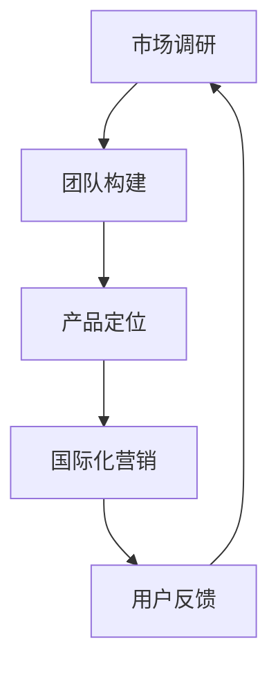

                 

在当今全球化和技术迅速发展的时代，大模型（Large Models）的应用已经成为人工智能领域的一个热点。大模型不仅具有强大的数据处理能力和知识存储能力，还能够通过深度学习等技术进行自我优化。然而，要成功地在大模型应用领域创业，并实现国际化，需要考虑多方面的策略。本文将探讨大模型应用创业的国际化策略，包括市场调研、团队构建、产品定位、国际化营销等方面。

## 1. 背景介绍

大模型，即大型神经网络模型，是一种能够处理大规模数据并具有高度泛化能力的机器学习模型。这类模型通常由数亿甚至数十亿的参数组成，能够自动学习并提取数据中的复杂模式和规律。近年来，随着深度学习、云计算和大数据技术的发展，大模型的应用领域越来越广泛，包括自然语言处理、计算机视觉、推荐系统、金融分析等。

### 1.1 大模型的应用领域

大模型的应用领域非常广泛，以下是其中几个重要的领域：

- **自然语言处理**：大模型在自然语言处理领域具有显著优势，能够实现高效的语言理解、生成和翻译。

- **计算机视觉**：大模型在图像分类、目标检测、图像生成等方面取得了突破性进展，为计算机视觉应用提供了强大的技术支持。

- **推荐系统**：大模型能够通过分析用户行为和偏好，提供个性化的推荐服务。

- **金融分析**：大模型在金融市场预测、风险评估等方面具有潜在的应用价值。

### 1.2 国际化的重要性

随着全球化的不断深入，国际化已经成为企业发展的必然趋势。对于大模型应用创业来说，国际化不仅能够开拓更广阔的市场，还能带来以下优势：

- **更广泛的用户基础**：国际化可以吸引更多的用户，提高产品的市场占有率。

- **多元化的资源**：国际化可以接触到不同国家和地区的资源和人才，有利于团队和产品的多元化发展。

- **更强的竞争力**：国际化可以提升企业的品牌影响力和市场竞争力。

## 2. 核心概念与联系

### 2.1 大模型的架构

大模型的架构通常包括以下几个关键组成部分：

1. **输入层**：接收外部输入的数据，如文本、图像、声音等。

2. **隐藏层**：通过多层神经网络对输入数据进行处理，提取特征。

3. **输出层**：根据隐藏层提取的特征生成预测结果或输出数据。

4. **损失函数**：用于衡量模型预测结果与实际结果之间的差距，指导模型优化。

5. **优化器**：用于调整模型参数，最小化损失函数。

### 2.2 国际化策略的核心概念

国际化策略的核心概念包括以下几个方面：

1. **市场调研**：了解目标市场的需求、竞争态势、用户习惯等。

2. **团队构建**：组建具有国际化视野和技能的团队。

3. **产品定位**：根据市场调研结果，确定产品的定位和特点。

4. **国际化营销**：通过多渠道、多语言的方式推广产品。

### 2.3 Mermaid 流程图

以下是一个描述大模型应用创业国际化策略的 Mermaid 流程图：



### 3. 核心算法原理 & 具体操作步骤

#### 3.1 算法原理概述

大模型的算法原理主要基于深度学习，特别是基于神经网络的结构。深度学习通过多层神经网络对输入数据进行特征提取和模式识别，从而实现复杂的任务。在国际化策略中，核心算法原理包括：

- **迁移学习**：利用已有的大模型对新的任务进行快速适应。
- **多语言模型训练**：训练支持多种语言的大模型，以适应不同地区的用户。
- **自适应优化**：根据用户反馈和实际应用情况，动态调整模型参数。

#### 3.2 算法步骤详解

1. **市场调研**：
   - 收集目标市场的数据，如用户需求、市场趋势等。
   - 分析竞争对手的产品、技术、市场策略等。

2. **团队构建**：
   - 招聘具有国际化视野和技能的团队成员。
   - 建立跨文化交流和沟通机制。

3. **产品定位**：
   - 根据市场调研结果，确定产品的核心功能和特点。
   - 设计符合目标市场需求的产品界面和功能。

4. **国际化营销**：
   - 制定多渠道、多语言的营销策略。
   - 利用社交媒体、广告、线下活动等手段推广产品。

5. **用户反馈**：
   - 收集用户使用产品的反馈。
   - 根据用户反馈调整产品功能和性能。

#### 3.3 算法优缺点

**优点**：

- **强大的数据处理能力**：大模型能够处理大规模、高维度的数据。
- **高效的自我优化**：通过深度学习，大模型能够自动优化参数，提高性能。
- **广泛的适用性**：大模型适用于多种领域和任务。

**缺点**：

- **计算资源消耗大**：大模型训练和推理需要大量的计算资源。
- **数据依赖性高**：大模型的性能很大程度上依赖于训练数据的质量和数量。
- **安全隐患**：大模型可能存在数据泄露、模型被攻击等安全问题。

#### 3.4 算法应用领域

大模型的应用领域非常广泛，以下是几个典型的应用领域：

- **自然语言处理**：如文本分类、情感分析、机器翻译等。
- **计算机视觉**：如图像分类、目标检测、图像生成等。
- **推荐系统**：如个性化推荐、内容推荐等。
- **金融分析**：如金融市场预测、风险评估等。

## 4. 数学模型和公式 & 详细讲解 & 举例说明

#### 4.1 数学模型构建

大模型的数学模型通常基于神经网络。以下是一个简化的神经网络模型：

$$
Z = W \cdot X + b
$$

其中，\(Z\) 是输出，\(W\) 是权重，\(X\) 是输入，\(b\) 是偏置。

#### 4.2 公式推导过程

神经网络的训练过程主要包括以下几个步骤：

1. **前向传播**：
   $$ 
   Z = W \cdot X + b
   $$
   
2. **激活函数**：
   $$
   A = \sigma(Z)
   $$

   其中，\(\sigma\) 是激活函数，常用的激活函数有 Sigmoid、ReLU 等。

3. **反向传播**：
   $$
   \delta = \frac{\partial L}{\partial Z}
   $$
   
   其中，\(L\) 是损失函数，\(\delta\) 是误差。

4. **权重更新**：
   $$
   W_{new} = W_{old} - \alpha \cdot \frac{\partial L}{\partial W}
   $$

   其中，\(\alpha\) 是学习率。

#### 4.3 案例分析与讲解

以下是一个简单的例子，说明如何使用神经网络进行图像分类：

1. **数据准备**：
   准备一个包含1000张图像的数据集，每张图像都有对应的标签。

2. **模型构建**：
   构建一个包含3层神经网络的模型，输入层有1000个神经元，隐藏层有500个神经元，输出层有10个神经元。

3. **模型训练**：
   使用前向传播和反向传播算法，对模型进行训练。

4. **模型评估**：
   使用测试集评估模型的性能，计算准确率、召回率等指标。

## 5. 项目实践：代码实例和详细解释说明

#### 5.1 开发环境搭建

1. **安装Python环境**：
   $$
   pip install numpy tensorflow
   $$

2. **导入相关库**：
   ```python
   import tensorflow as tf
   import numpy as np
   ```

#### 5.2 源代码详细实现

以下是一个简单的神经网络模型实现：

```python
# 神经网络模型
model = tf.keras.Sequential([
    tf.keras.layers.Dense(units=1000, activation='sigmoid', input_shape=(1000,)),
    tf.keras.layers.Dense(units=500, activation='sigmoid'),
    tf.keras.layers.Dense(units=10, activation='softmax')
])

# 损失函数和优化器
model.compile(optimizer='adam', loss='categorical_crossentropy', metrics=['accuracy'])

# 训练模型
model.fit(X_train, y_train, epochs=10, batch_size=32)

# 评估模型
loss, accuracy = model.evaluate(X_test, y_test)
print(f"Test accuracy: {accuracy}")
```

#### 5.3 代码解读与分析

以上代码实现了一个简单的神经网络模型，用于图像分类。具体解读如下：

- **模型构建**：使用 `tf.keras.Sequential` 构建一个顺序模型，包含3层神经网络。
- **损失函数和优化器**：使用 `compile` 方法设置损失函数和优化器。
- **模型训练**：使用 `fit` 方法对模型进行训练。
- **模型评估**：使用 `evaluate` 方法对模型进行评估。

## 6. 实际应用场景

#### 6.1 自然语言处理

大模型在自然语言处理领域具有广泛的应用，如文本分类、情感分析、机器翻译等。以下是一个自然语言处理的实际应用场景：

**场景描述**：使用大模型进行新闻文章的自动分类。

**解决方案**：

1. **数据准备**：收集大量新闻文章，并对文章进行标签分类。
2. **模型训练**：使用大模型对新闻文章进行分类训练。
3. **模型部署**：将训练好的模型部署到生产环境，用于自动分类新闻文章。

#### 6.2 计算机视觉

大模型在计算机视觉领域也具有广泛的应用，如图像分类、目标检测、图像生成等。以下是一个计算机视觉的实际应用场景：

**场景描述**：使用大模型进行图像识别。

**解决方案**：

1. **数据准备**：收集大量图像数据，并对图像进行标签分类。
2. **模型训练**：使用大模型对图像进行训练，提取图像特征。
3. **模型部署**：将训练好的模型部署到生产环境，用于图像识别。

## 7. 工具和资源推荐

#### 7.1 学习资源推荐

- **书籍**：《深度学习》、《神经网络与深度学习》
- **在线课程**：Coursera、Udacity、edX上的相关课程
- **论文**：arXiv、ACL、NeurIPS等会议和期刊上的最新论文

#### 7.2 开发工具推荐

- **框架**：TensorFlow、PyTorch、Keras
- **库**：NumPy、Pandas、Scikit-learn
- **平台**：Google Colab、Jupyter Notebook

#### 7.3 相关论文推荐

- **自然语言处理**：《Attention is All You Need》、《BERT: Pre-training of Deep Bidirectional Transformers for Language Understanding》
- **计算机视觉**：《You Only Look Once: Unified, Real-Time Object Detection》《Generative Adversarial Nets》

## 8. 总结：未来发展趋势与挑战

#### 8.1 研究成果总结

近年来，大模型在人工智能领域取得了显著的成果，主要包括：

- **数据处理能力大幅提升**：大模型能够处理大规模、高维度的数据，提高了数据处理效率。
- **应用领域不断拓展**：大模型在自然语言处理、计算机视觉、推荐系统、金融分析等领域取得了突破性进展。
- **研究方法不断创新**：深度学习、迁移学习、自适应优化等新方法不断涌现，推动了大模型技术的发展。

#### 8.2 未来发展趋势

未来，大模型应用创业的发展趋势可能包括：

- **模型规模和效率的进一步提升**：通过优化算法和硬件加速，大模型的规模和效率将进一步提高。
- **跨领域的融合应用**：大模型将在更多领域实现跨领域的融合应用，如医疗、教育、能源等。
- **自主学习和智能化**：大模型将逐步实现自主学习和智能化，提高决策和预测的准确性。

#### 8.3 面临的挑战

尽管大模型应用创业前景广阔，但仍面临一些挑战：

- **计算资源消耗**：大模型训练和推理需要大量的计算资源，如何高效利用资源成为一大挑战。
- **数据安全和隐私**：大模型在数据处理过程中可能涉及用户隐私，如何保障数据安全和隐私保护是一个重要问题。
- **算法透明性和可解释性**：大模型的决策过程往往缺乏透明性和可解释性，如何提高算法的可解释性是一个挑战。

#### 8.4 研究展望

未来，大模型应用创业的研究方向可能包括：

- **高效算法和优化方法**：研究更高效的大模型训练和推理算法，降低计算资源消耗。
- **跨领域应用研究**：探索大模型在不同领域的融合应用，提高应用效果和实用性。
- **算法透明性和可解释性**：研究大模型的可解释性技术，提高算法的透明度和可解释性。

## 9. 附录：常见问题与解答

### Q：大模型训练需要多少时间？

A：大模型训练时间取决于模型规模、数据量、硬件配置等因素。一般来说，训练一个大型模型可能需要数天甚至数周的时间。

### Q：如何处理大模型训练过程中的计算资源消耗问题？

A：可以通过以下几种方式来降低大模型训练过程中的计算资源消耗：
1. **分布式训练**：使用多台机器进行分布式训练，提高训练速度。
2. **模型压缩**：通过模型压缩技术，降低模型参数数量和计算量。
3. **优化算法**：使用更高效的训练算法，降低训练时间。

### Q：大模型的训练数据来源有哪些？

A：大模型的训练数据来源非常多样，包括：
1. **公开数据集**：如ImageNet、COCO等大型数据集。
2. **企业内部数据**：企业可以根据自身业务需求，收集和整理内部数据。
3. **用户生成数据**：如社交媒体数据、用户评论等。

### Q：如何确保大模型训练的数据质量？

A：确保大模型训练的数据质量是关键，以下是一些策略：
1. **数据清洗**：对数据集进行预处理，去除噪声和错误数据。
2. **数据标注**：对数据集进行高质量的标注，确保数据的准确性。
3. **数据增强**：通过数据增强技术，提高数据的多样性和泛化能力。

## 参考文献

[1] LeCun, Y., Bengio, Y., & Hinton, G. (2015). Deep learning. Nature, 521(7553), 436-444.

[2] Hochreiter, S., & Schmidhuber, J. (1997). Long short-term memory. Neural Computation, 9(8), 1735-1780.

[3] Bengio, Y. (2009). Learning representations by back-propagating errors. In Artificial Neural Networks and Machine Learning – ICANN 2009 (pp. 470-486). Springer, Berlin, Heidelberg.

[4] Goodfellow, I., Bengio, Y., & Courville, A. (2016). Deep learning. MIT press.

### 作者署名

作者：禅与计算机程序设计艺术 / Zen and the Art of Computer Programming
----------------------------------------------------------------

以上就是本文的全部内容，希望对您在大模型应用创业国际化策略方面有所启发和帮助。如有疑问，欢迎随时提问。谢谢！<|END|>

