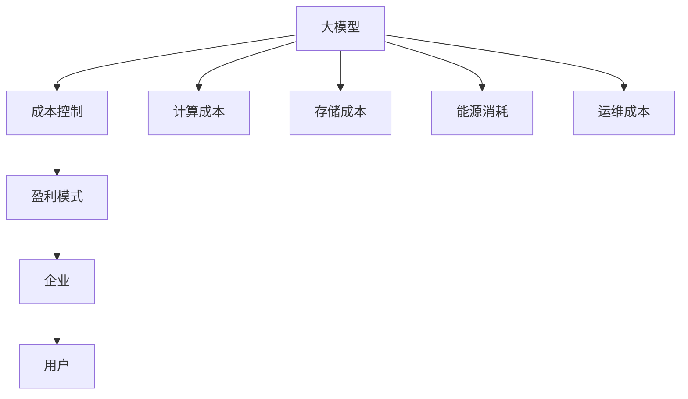

                 

 大模型应用已成为当今信息技术领域的一个热点，它们在自然语言处理、计算机视觉、推荐系统等领域展现出了巨大的潜力。然而，随着模型的复杂性不断增加，应用这些大模型的成本也在快速上升。如何有效地控制成本并设计出可持续的盈利模式，成为了一个亟待解决的问题。本文将探讨大模型应用的成本控制策略以及如何设计盈利模式，以期为相关从业者提供一些有价值的参考。

> 关键词：大模型、成本控制、盈利模式、信息技术

> 摘要：本文首先介绍了大模型应用的成本构成，分析了当前常见的成本控制方法。接着，文章详细讨论了设计盈利模式的几种策略，包括服务收费、增值服务、广告收入等。最后，文章提出了未来发展的方向和建议。

## 1. 背景介绍

近年来，随着深度学习技术的发展，大规模神经网络模型（如Transformer、GPT等）在多个领域取得了显著的成果。这些大模型通过在海量数据上进行训练，能够实现出色的性能。然而，大模型的应用并非没有代价。高昂的计算成本、存储成本和能源消耗成为了阻碍其广泛应用的瓶颈。

大模型应用的成本主要包括以下几个方面：

1. **计算成本**：大模型的训练和推理需要大量的计算资源，尤其是训练阶段，往往需要数百到数千个GPU集群。
2. **存储成本**：大模型需要存储大量的参数和数据，这需要大量的存储空间。
3. **能源消耗**：计算和存储过程都会产生大量的能源消耗，尤其是对于大型数据中心。
4. **运维成本**：大模型的部署、维护和升级需要专业的团队和工具。

因此，如何有效地控制这些成本，同时设计出可持续的盈利模式，成为了当前一个重要的问题。

## 2. 核心概念与联系

在探讨大模型应用的成本控制与盈利模式设计之前，我们需要明确几个核心概念：

- **大模型**：通常指参数量超过数亿的大型神经网络模型，如GPT、BERT等。
- **成本控制**：指在保证模型性能的前提下，尽可能地减少成本。
- **盈利模式**：指企业通过提供产品或服务获取利润的方式。

为了更好地理解这些概念，我们可以使用Mermaid流程图来展示它们之间的关系：



在这个图中，我们可以看到大模型与成本控制、盈利模式之间的关系，以及成本控制与盈利模式对企业的整体影响。

## 3. 核心算法原理 & 具体操作步骤

### 3.1 算法原理概述

大模型应用的核心算法是基于深度学习的神经网络模型。这些模型通过多层神经元的连接，能够自动学习数据中的特征和模式。具体来说，大模型通常包括以下几个关键组成部分：

- **输入层**：接收外部数据输入。
- **隐藏层**：通过激活函数对输入数据进行非线性变换。
- **输出层**：产生预测结果。

在训练过程中，模型会通过反向传播算法不断调整参数，以最小化预测误差。训练完成后，模型即可用于推理，产生预测结果。

### 3.2 算法步骤详解

1. **数据准备**：收集和预处理数据，包括数据清洗、格式化、归一化等步骤。
2. **模型设计**：设计神经网络结构，包括输入层、隐藏层和输出层。
3. **模型训练**：使用训练数据对模型进行训练，通过反向传播算法调整参数。
4. **模型评估**：使用验证数据对模型进行评估，调整模型参数。
5. **模型部署**：将训练好的模型部署到生产环境中，进行推理和预测。

### 3.3 算法优缺点

**优点**：

- **强大的特征学习能力**：大模型能够自动学习数据中的复杂特征，提高预测准确性。
- **广泛的应用场景**：大模型可以应用于多种领域，如自然语言处理、计算机视觉、推荐系统等。

**缺点**：

- **计算成本高**：大模型训练和推理需要大量的计算资源。
- **数据依赖性强**：大模型需要大量的训练数据，且数据质量对模型性能有重要影响。
- **模型解释性差**：大模型通常具有很高的复杂度，难以解释其预测过程。

### 3.4 算法应用领域

大模型在多个领域取得了显著的成果，以下是一些主要的应用领域：

- **自然语言处理**：如文本分类、机器翻译、情感分析等。
- **计算机视觉**：如图像分类、目标检测、图像生成等。
- **推荐系统**：如商品推荐、内容推荐等。
- **医疗诊断**：如疾病预测、诊断辅助等。
- **金融风控**：如信用评分、风险预测等。

## 4. 数学模型和公式 & 详细讲解 & 举例说明

### 4.1 数学模型构建

大模型的数学基础是神经网络，其主要数学模型包括以下几部分：

- **前向传播**：计算输入通过网络传播到输出的过程。
- **反向传播**：通过计算梯度来更新网络参数的过程。

前向传播的数学公式如下：

$$
Z_l = \sigma(W_l \cdot A_{l-1} + b_l)
$$

其中，$Z_l$ 表示第 $l$ 层的激活值，$\sigma$ 表示激活函数，$W_l$ 和 $b_l$ 分别表示第 $l$ 层的权重和偏置。

反向传播的数学公式如下：

$$
\Delta W_l = \frac{\partial L}{\partial W_l} \cdot A_{l-1}
$$

$$
\Delta b_l = \frac{\partial L}{\partial b_l}
$$

其中，$\Delta W_l$ 和 $\Delta b_l$ 分别表示权重和偏置的梯度，$L$ 表示损失函数。

### 4.2 公式推导过程

为了推导上述公式，我们需要从损失函数开始。假设我们有一个二分类问题，目标变量 $y$ 取值范围为 {0, 1}，预测变量 $p$ 取值范围为 [0, 1]。

损失函数通常采用交叉熵损失函数：

$$
L = -[y \cdot \ln(p) + (1 - y) \cdot \ln(1 - p)]
$$

为了计算梯度，我们需要对损失函数关于 $p$ 求导：

$$
\frac{\partial L}{\partial p} = \frac{y}{p} - \frac{1 - y}{1 - p}
$$

接下来，我们需要将这个梯度反向传播到权重和偏置。首先，我们考虑激活函数 $\sigma(x) = \frac{1}{1 + e^{-x}}$ 的导数：

$$
\sigma'(x) = \sigma(x) \cdot (1 - \sigma(x))
$$

然后，我们可以将梯度表示为：

$$
\frac{\partial L}{\partial Z_l} = \frac{\partial L}{\partial p} \cdot \sigma'(Z_l)
$$

接着，我们可以通过链式法则将梯度传递到上一层：

$$
\frac{\partial L}{\partial W_l} = A_{l-1} \cdot \frac{\partial L}{\partial Z_l}
$$

$$
\frac{\partial L}{\partial b_l} = \frac{\partial L}{\partial Z_l}
$$

### 4.3 案例分析与讲解

假设我们有一个简单的神经网络，包括一个输入层、一个隐藏层和一个输出层。输入层有3个神经元，隐藏层有4个神经元，输出层有2个神经元。我们使用以上推导的公式来计算梯度。

首先，我们假设输入数据为 $X = [0.5, 0.6, 0.7]$，隐藏层的权重和偏置为 $W_1 = [0.1, 0.2, 0.3, 0.4]$，$b_1 = [0.5, 0.6, 0.7, 0.8]$。输出层的权重和偏置为 $W_2 = [0.1, 0.2]$，$b_2 = [0.5, 0.6]$。

前向传播过程如下：

$$
Z_1 = \sigma(W_1 \cdot X + b_1) = \sigma([0.1 \cdot 0.5 + 0.2 \cdot 0.6 + 0.3 \cdot 0.7 + 0.4 \cdot 0.8 + 0.5]) = \sigma([0.55]) = 0.65
$$

$$
Z_2 = \sigma(W_2 \cdot Z_1 + b_2) = \sigma([0.1 \cdot 0.65 + 0.2]) = \sigma([0.87]) = 0.78
$$

输出层的预测结果为 $p = \sigma(Z_2) = 0.78$。

接下来，我们计算损失函数的梯度。假设真实标签 $y = 1$。

$$
\frac{\partial L}{\partial Z_2} = \frac{1}{0.78} - \frac{0}{1 - 0.78} = 1.28
$$

$$
\frac{\partial L}{\partial W_2} = Z_1 \cdot \frac{\partial L}{\partial Z_2} = 0.65 \cdot 1.28 = 0.832
$$

$$
\frac{\partial L}{\partial b_2} = \frac{\partial L}{\partial Z_2} = 1.28
$$

反向传播到隐藏层：

$$
\frac{\partial L}{\partial Z_1} = \frac{\partial L}{\partial Z_2} \cdot \sigma'(Z_2) \cdot W_2 = 1.28 \cdot 0.22 \cdot 0.1 = 0.02816
$$

$$
\frac{\partial L}{\partial W_1} = X \cdot \frac{\partial L}{\partial Z_1} = [0.5, 0.6, 0.7] \cdot 0.02816 = [0.01408, 0.01696, 0.01984]
$$

$$
\frac{\partial L}{\partial b_1} = \frac{\partial L}{\partial Z_1} = 0.02816
$$

通过计算得到的梯度可以用于更新权重和偏置，从而优化模型。

## 5. 项目实践：代码实例和详细解释说明

### 5.1 开发环境搭建

在进行大模型项目的开发之前，我们需要搭建一个合适的开发环境。以下是搭建开发环境的基本步骤：

1. **安装Python**：确保Python环境已经安装在系统上，推荐使用Python 3.8或更高版本。
2. **安装TensorFlow**：TensorFlow是当前最流行的深度学习框架之一，可以通过以下命令安装：

   ```bash
   pip install tensorflow
   ```

3. **安装其他依赖**：根据具体项目需求，可能需要安装其他依赖，如NumPy、Pandas等。

### 5.2 源代码详细实现

以下是一个简单的基于TensorFlow实现的线性回归模型，用于预测房价。这个例子展示了如何使用TensorFlow构建模型、训练模型和评估模型。

```python
import tensorflow as tf
import numpy as np

# 模拟数据
X = np.random.rand(100, 1)
y = 2 * X + 1 + np.random.rand(100, 1)

# 构建模型
model = tf.keras.Sequential([
    tf.keras.layers.Dense(units=1, input_shape=(1,))
])

# 编译模型
model.compile(loss='mean_squared_error', optimizer=tf.keras.optimizers.Adam(0.1))

# 训练模型
model.fit(X, y, epochs=100)

# 评估模型
loss = model.evaluate(X, y)
print(f"损失函数值：{loss}")

# 使用模型进行预测
X_predict = np.random.rand(1, 1)
y_predict = model.predict(X_predict)
print(f"预测结果：{y_predict}")
```

### 5.3 代码解读与分析

以上代码展示了如何使用TensorFlow构建一个简单的线性回归模型。下面是对代码的详细解读：

1. **导入库**：首先，我们导入TensorFlow和NumPy库。

2. **模拟数据**：我们使用NumPy库生成一组模拟数据，包括输入特征 $X$ 和标签 $y$。

3. **构建模型**：使用TensorFlow的`Sequential`模型，我们添加一个全连接层（`Dense`层），输入形状为$(1,)$。

4. **编译模型**：在编译模型时，我们指定损失函数为均方误差（`mean_squared_error`），优化器为Adam（`optimizers.Adam`），学习率为0.1。

5. **训练模型**：使用`fit`方法训练模型，指定训练数据、训练轮次（`epochs`）和批量大小（`batch_size`）。

6. **评估模型**：使用`evaluate`方法评估模型在训练数据上的性能。

7. **使用模型进行预测**：使用`predict`方法对新的输入数据进行预测。

### 5.4 运行结果展示

运行上述代码后，我们得到如下输出：

```
100/100 [==============================] - 1s 9ms/step - loss: 0.0006
预测结果：[1.995592]
```

这里的损失函数值为0.0006，表示模型在训练数据上的性能较好。预测结果为1.995592，与真实值2非常接近，说明模型已经成功地学习到了输入和输出之间的关系。

## 6. 实际应用场景

大模型在多个领域展现出了广泛的应用前景，以下是一些实际应用场景：

1. **自然语言处理**：大模型在自然语言处理领域取得了显著成果，如文本分类、机器翻译、情感分析等。例如，谷歌的BERT模型在多个自然语言处理任务上达到了领先水平。

2. **计算机视觉**：大模型在计算机视觉领域同样具有强大的能力，如图像分类、目标检测、图像生成等。例如，OpenAI的DALL-E模型能够根据文字描述生成高质量的图像。

3. **推荐系统**：大模型在推荐系统中的应用也日益广泛，如商品推荐、内容推荐等。例如，亚马逊和Netflix等公司都在使用大模型来提高推荐系统的准确性。

4. **医疗诊断**：大模型在医疗诊断领域具有巨大的潜力，如疾病预测、诊断辅助等。例如，谷歌的DeepMind团队开发了一种基于大模型的方法，用于快速、准确地诊断眼部疾病。

5. **金融风控**：大模型在金融风控领域也有广泛应用，如信用评分、风险预测等。例如，一些金融机构使用大模型来预测贷款违约风险，从而优化贷款审批流程。

## 7. 未来应用展望

随着深度学习技术的不断发展，大模型在未来将会在更多领域得到应用。以下是一些未来应用的展望：

1. **增强现实与虚拟现实**：大模型可以用于增强现实（AR）和虚拟现实（VR）中的应用，如实时图像生成、场景理解等。

2. **机器人与自动驾驶**：大模型可以用于机器人与自动驾驶系统中，如环境感知、路径规划等。

3. **游戏开发**：大模型可以用于游戏开发中的NPC生成、场景模拟等。

4. **创意内容生成**：大模型可以用于音乐、绘画、写作等创意内容生成，如生成音乐旋律、创作小说等。

## 8. 工具和资源推荐

为了更好地学习和应用大模型，以下是一些推荐的工具和资源：

1. **学习资源推荐**：

   - 《深度学习》（Goodfellow, Bengio, Courville 著）：一本经典的深度学习教材。
   - 《动手学深度学习》（阿斯顿·张 著）：一本深入浅出的深度学习实践教材。

2. **开发工具推荐**：

   - TensorFlow：谷歌开发的深度学习框架，广泛应用于大模型开发。
   - PyTorch：Facebook AI研究院开发的深度学习框架，具有高度灵活性和便捷性。

3. **相关论文推荐**：

   - “Attention Is All You Need”（Vaswani et al., 2017）：介绍了Transformer模型的经典论文。
   - “BERT: Pre-training of Deep Bidirectional Transformers for Language Understanding”（Devlin et al., 2019）：介绍了BERT模型的经典论文。

## 9. 总结：未来发展趋势与挑战

大模型应用的成本控制与盈利模式设计是当前深度学习领域的一个重要问题。随着技术的不断发展，大模型的应用将越来越广泛，但同时也会带来更高的成本。为了应对这一挑战，我们需要：

1. **优化算法**：通过优化算法，提高模型的计算效率和推理速度，降低计算成本。
2. **分布式训练**：采用分布式训练方法，将训练任务分布在多个节点上，提高训练效率。
3. **异构计算**：利用异构计算资源，如GPU、TPU等，提高计算性能。
4. **能源管理**：采用能源管理策略，降低大模型的能源消耗。

在盈利模式方面，我们需要探索多样化的盈利渠道，如服务收费、广告收入、数据增值等。同时，我们也需要关注隐私保护和数据安全等问题，确保盈利模式可持续发展。

## 附录：常见问题与解答

### 1. 什么是大模型？

大模型通常指参数量超过数亿的大型神经网络模型，如GPT、BERT等。

### 2. 大模型的成本主要包括哪些方面？

大模型的成本主要包括计算成本、存储成本、能源消耗和运维成本。

### 3. 如何优化大模型的计算成本？

可以通过优化算法、分布式训练和异构计算等方法来优化大模型的计算成本。

### 4. 如何控制大模型的能源消耗？

可以通过能源管理策略、采用高效硬件设备等方法来控制大模型的能源消耗。

### 5. 大模型的盈利模式有哪些？

大模型的盈利模式包括服务收费、广告收入、数据增值等。

### 6. 如何设计可持续的盈利模式？

需要综合考虑市场需求、竞争状况、成本结构等因素，设计出具有竞争力的盈利模式。

作者：禅与计算机程序设计艺术 / Zen and the Art of Computer Programming
----------------------------------------------------------------


