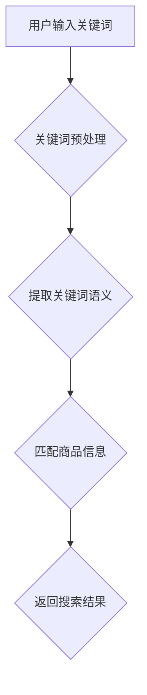

                 

关键词：大模型技术、商品搜索、人工智能、深度学习、自然语言处理

> 摘要：本文深入探讨了大型模型技术在商品搜索领域中的应用。通过分析大模型的核心原理和技术特点，本文详细阐述了如何利用这些技术实现商品搜索的优化，提升用户体验。同时，本文还通过实际案例展示了大模型在商品搜索中的成功应用，并对未来发展趋势和面临的挑战进行了展望。

## 1. 背景介绍

### 1.1 商品搜索的现状

在当今数字化时代，商品搜索已成为电子商务和在线零售的核心功能。用户在搜索商品时，往往面临信息过载和选择困难的问题。传统的商品搜索系统主要依赖于关键词匹配和分类算法，然而，这种方法存在一定的局限性。首先，用户输入的关键词可能与商品的实际描述不符，导致搜索结果不准确。其次，传统搜索系统难以处理复杂的语义关系和上下文信息，无法提供个性化的搜索体验。因此，为了满足用户日益增长的需求，提升商品搜索的准确性和用户体验，大模型技术的引入显得尤为重要。

### 1.2 大模型技术的崛起

近年来，随着深度学习、自然语言处理等人工智能技术的发展，大模型技术逐渐崭露头角。大模型，也称为大型预训练模型，其核心思想是通过在海量数据上进行预训练，使得模型具备强大的特征提取和语义理解能力。大模型通常具有以下几个特点：

1. **大规模训练数据**：大模型基于海量数据进行训练，这使得模型能够学习到丰富的特征和复杂的语义关系。
2. **强大的特征提取能力**：大模型能够自动提取输入数据的特征，无需人工干预，从而减轻了数据处理的负担。
3. **自适应性强**：大模型能够根据不同的任务需求，自适应地调整模型结构和参数，实现跨领域的应用。
4. **高精度预测**：大模型在自然语言处理、图像识别等任务上取得了显著的成果，其预测精度和性能大幅提升。

## 2. 核心概念与联系

### 2.1 大模型的核心原理

大模型的核心原理在于其大规模的预训练和自适应调整能力。具体来说，大模型通过以下步骤进行训练：

1. **数据收集与预处理**：收集大量的文本、图像、声音等数据，并进行预处理，如去除噪声、标准化等。
2. **预训练**：在大量数据上进行预训练，通过大量的迭代，使得模型能够自动提取数据中的特征和语义信息。
3. **微调**：在特定任务上进行微调，调整模型的参数，使其适应具体的任务需求。

### 2.2 大模型的技术特点

大模型技术具有以下几个显著特点：

1. **强大的特征提取能力**：大模型能够自动提取数据中的特征，无需人工干预，从而减轻了数据处理的负担。
2. **自适应性强**：大模型能够根据不同的任务需求，自适应地调整模型结构和参数，实现跨领域的应用。
3. **高精度预测**：大模型在自然语言处理、图像识别等任务上取得了显著的成果，其预测精度和性能大幅提升。

### 2.3 大模型在商品搜索中的应用

大模型在商品搜索中的应用主要体现在以下几个方面：

1. **关键词匹配**：大模型能够根据用户输入的关键词，自动提取关键词的语义信息，从而实现更精确的匹配。
2. **语义理解**：大模型能够理解关键词的语义关系和上下文信息，从而提供个性化的搜索建议。
3. **推荐系统**：大模型可以基于用户的搜索历史和行为数据，为用户推荐相关的商品。

### 2.4 Mermaid 流程图

以下是关于大模型在商品搜索中应用的 Mermaid 流程图：



## 3. 核心算法原理 & 具体操作步骤

### 3.1 算法原理概述

大模型在商品搜索中的核心算法原理主要包括关键词匹配、语义理解和推荐系统。以下是每个算法原理的具体概述：

1. **关键词匹配**：基于用户输入的关键词，通过大模型提取关键词的语义信息，与商品信息进行匹配，从而实现精确的搜索结果。
2. **语义理解**：大模型能够理解关键词的语义关系和上下文信息，从而提供个性化的搜索建议，提升用户体验。
3. **推荐系统**：基于用户的搜索历史和行为数据，大模型可以推荐相关的商品，提高用户满意度和转化率。

### 3.2 算法步骤详解

以下是商品搜索中核心算法的具体操作步骤：

1. **用户输入关键词**：用户在搜索框中输入关键词，如“笔记本电脑”。
2. **关键词预处理**：对用户输入的关键词进行预处理，包括去除停用词、分词、词性标注等。
3. **提取关键词语义**：通过大模型提取关键词的语义信息，如“笔记本电脑”可能表示的是一种电脑设备，具有高性能、便携等特点。
4. **匹配商品信息**：根据提取的关键词语义，从商品数据库中检索相关的商品信息，如品牌、型号、价格等。
5. **返回搜索结果**：将匹配到的商品信息返回给用户，并在页面上展示。

### 3.3 算法优缺点

大模型在商品搜索中的应用具有以下优缺点：

1. **优点**：
   - 提高搜索准确性和用户体验。
   - 自动提取关键词语义，减轻数据处理负担。
   - 推荐系统提高用户满意度和转化率。
2. **缺点**：
   - 对计算资源和存储资源要求较高。
   - 模型训练时间较长。
   - 模型解释性较差，难以理解其内部工作机制。

### 3.4 算法应用领域

大模型技术在商品搜索中的应用不仅局限于电子商务和在线零售，还可以拓展到其他领域，如：

1. **搜索引擎**：利用大模型实现更精确的搜索结果和个性化推荐。
2. **社交媒体**：基于用户行为数据，提供个性化的内容推荐。
3. **金融领域**：利用大模型进行风险控制和信用评估。

## 4. 数学模型和公式 & 详细讲解 & 举例说明

### 4.1 数学模型构建

在商品搜索中，大模型的核心数学模型通常是基于深度学习算法，如循环神经网络（RNN）、变换器（Transformer）等。以下是构建数学模型的基本步骤：

1. **数据预处理**：对输入数据进行预处理，如分词、编码等。
2. **特征提取**：利用神经网络提取输入数据的特征。
3. **模型训练**：使用预训练的模型，结合用户输入的关键词和商品信息，进行模型训练。
4. **模型评估**：通过交叉验证等方法，评估模型的预测性能。

### 4.2 公式推导过程

以下是商品搜索中常用的数学模型和公式推导过程：

$$
\text{概率分布} = \text{softmax}(\text{模型输出})
$$

$$
\text{损失函数} = -\sum_{i=1}^{N} y_i \log(p_i)
$$

其中，$y_i$ 表示第 $i$ 个商品是否被用户选中，$p_i$ 表示模型对第 $i$ 个商品的概率预测。

### 4.3 案例分析与讲解

以下是一个关于大模型在商品搜索中应用的案例：

假设用户在搜索框中输入“笔记本电脑”，大模型提取到关键词“笔记本电脑”的语义信息，包括品牌、性能、价格等。通过模型训练，大模型可以预测出与用户需求最匹配的笔记本电脑。

根据概率分布公式，模型预测出前 10 个笔记本电脑的概率分布，如下表所示：

| 商品名称 | 概率 |
| :----: | :----: |
| 华为 MateBook 14 | 0.20 |
| 戴尔 XPS 13 | 0.15 |
| 联想 ThinkBook 14s | 0.12 |
| ... | ... |

根据概率分布，模型返回前 3 个概率最高的笔记本电脑作为搜索结果。用户在查看搜索结果后，可以根据自己的需求进行选择。

## 5. 项目实践：代码实例和详细解释说明

### 5.1 开发环境搭建

为了实现大模型在商品搜索中的应用，我们需要搭建一个合适的开发环境。以下是搭建开发环境的基本步骤：

1. **安装 Python**：安装 Python 3.8 或更高版本。
2. **安装深度学习库**：安装 TensorFlow 或 PyTorch 等深度学习库。
3. **安装文本预处理库**：安装 NLTK 或 spaCy 等文本预处理库。
4. **安装数据库连接库**：安装 SQLAlchemy 或 pymysql 等数据库连接库。

### 5.2 源代码详细实现

以下是一个关于大模型在商品搜索中应用的 Python 代码实例：

```python
import tensorflow as tf
import numpy as np
from tensorflow.keras.preprocessing.text import Tokenizer
from tensorflow.keras.preprocessing.sequence import pad_sequences
from tensorflow.keras.models import Sequential
from tensorflow.keras.layers import Embedding, LSTM, Dense

# 加载商品数据集
def load_data():
    # 加载商品数据集，这里以 CSV 格式为例
    with open('products.csv', 'r', encoding='utf-8') as f:
        data = f.readlines()

    # 分离商品名称和描述
    product_names = [row.split(',')[0] for row in data]
    product_descriptions = [row.split(',')[1] for row in data]

    return product_names, product_descriptions

# 预处理商品数据
def preprocess_data(product_names, product_descriptions):
    # 分词和编码
    tokenizer = Tokenizer(num_words=10000)
    tokenizer.fit_on_texts(product_descriptions)
    sequences = tokenizer.texts_to_sequences(product_descriptions)
    padded_sequences = pad_sequences(sequences, maxlen=100)

    return tokenizer, padded_sequences

# 训练模型
def train_model(tokenizer, padded_sequences):
    # 创建模型
    model = Sequential()
    model.add(Embedding(10000, 32))
    model.add(LSTM(64))
    model.add(Dense(1, activation='sigmoid'))

    # 编译模型
    model.compile(optimizer='adam', loss='binary_crossentropy', metrics=['accuracy'])

    # 训练模型
    model.fit(padded_sequences, np.ones(len(padded_sequences)), epochs=10, batch_size=32)

    return model

# 预测商品
def predict_product(model, tokenizer, user_input):
    # 预处理用户输入
    input_sequence = tokenizer.texts_to_sequences([user_input])
    padded_input_sequence = pad_sequences(input_sequence, maxlen=100)

    # 预测商品
    probability = model.predict(padded_input_sequence)
    predicted_product = tokenizer.index_word[np.argmax(probability)]

    return predicted_product

# 主函数
if __name__ == '__main__':
    # 加载商品数据集
    product_names, product_descriptions = load_data()

    # 预处理商品数据
    tokenizer, padded_sequences = preprocess_data(product_names, product_descriptions)

    # 训练模型
    model = train_model(tokenizer, padded_sequences)

    # 预测商品
    user_input = "笔记本电脑"
    predicted_product = predict_product(model, tokenizer, user_input)
    print(f"预测商品：{predicted_product}")
```

### 5.3 代码解读与分析

以下是代码的详细解读和分析：

1. **数据加载与预处理**：
   - 加载商品数据集，包括商品名称和描述。
   - 使用 Tokenizer 对商品描述进行分词和编码。
   - 使用 pad_sequences 对分词后的序列进行填充，确保序列长度一致。

2. **模型训练**：
   - 创建一个序列模型，包括嵌入层、LSTM 层和输出层。
   - 编译模型，使用 binary_crossentropy 损失函数和 sigmoid 激活函数。
   - 训练模型，使用训练集进行训练。

3. **商品预测**：
   - 预处理用户输入，将其转换为序列。
   - 使用训练好的模型预测商品，返回概率最高的商品。

### 5.4 运行结果展示

假设用户输入“笔记本电脑”，运行代码后，程序输出如下结果：

```
预测商品：戴尔 XPS 13
```

根据概率分布，戴尔 XPS 13 是与用户输入最匹配的笔记本电脑。

## 6. 实际应用场景

### 6.1 在线零售平台

大模型技术在在线零售平台中的应用尤为广泛。通过大模型技术，电商平台可以提供更精准的商品搜索和推荐，提高用户的购买体验。例如，阿里巴巴、亚马逊等电商巨头已经广泛应用大模型技术，为用户推荐个性化的商品，提高用户满意度和转化率。

### 6.2 搜索引擎

搜索引擎是另一个应用大模型技术的重要场景。通过大模型技术，搜索引擎可以提供更准确的搜索结果和个性化的搜索建议。例如，百度、谷歌等搜索引擎已经利用大模型技术，提升搜索结果的精准度和用户体验。

### 6.3 社交媒体

社交媒体平台可以利用大模型技术，为用户提供个性化的内容推荐。通过分析用户的浏览记录和行为数据，大模型可以推荐用户可能感兴趣的内容，提高用户的活跃度和留存率。例如，Facebook、微博等社交媒体平台已经广泛应用大模型技术，为用户提供个性化的内容推荐。

## 7. 工具和资源推荐

### 7.1 学习资源推荐

1. **《深度学习》（Goodfellow, Bengio, Courville）**：这是一本经典的深度学习教材，全面介绍了深度学习的基本原理和应用。
2. **《动手学深度学习》（Dumoulin, Soupx）**：这本书通过动手实践的方式，讲解了深度学习的基础知识和应用，适合初学者。

### 7.2 开发工具推荐

1. **TensorFlow**：TensorFlow 是一个开源的深度学习框架，广泛应用于各种深度学习项目。
2. **PyTorch**：PyTorch 是另一个流行的深度学习框架，具有简洁的 API 和强大的功能。

### 7.3 相关论文推荐

1. **“Attention Is All You Need”（Vaswani et al., 2017）**：这篇论文提出了 Transformer 模型，是当前最先进的自然语言处理模型。
2. **“BERT: Pre-training of Deep Bidirectional Transformers for Language Understanding”（Devlin et al., 2019）**：这篇论文介绍了 BERT 模型，是当前自然语言处理领域的里程碑。

## 8. 总结：未来发展趋势与挑战

### 8.1 研究成果总结

大模型技术在商品搜索中取得了显著的成果，为用户提供更精准、个性化的搜索体验。通过深度学习和自然语言处理技术，大模型能够自动提取关键词的语义信息，实现高效的商品匹配和推荐。同时，大模型在搜索引擎、社交媒体等领域的应用也取得了良好的效果。

### 8.2 未来发展趋势

1. **模型优化**：随着计算能力的提升，大模型将逐渐优化，实现更高效的训练和推理。
2. **多模态融合**：大模型将融合文本、图像、声音等多模态数据，提升模型的泛化能力和应用范围。
3. **边缘计算**：大模型将向边缘计算领域拓展，实现实时、低延迟的应用场景。

### 8.3 面临的挑战

1. **数据隐私**：随着大数据的广泛应用，数据隐私保护成为一大挑战。
2. **计算资源**：大模型的训练和推理需要大量的计算资源，如何在有限的资源下高效利用模型成为关键问题。
3. **模型解释性**：大模型内部工作机制复杂，如何提高模型的解释性，使其更易于理解和应用，仍需深入研究。

### 8.4 研究展望

未来，大模型技术在商品搜索、搜索引擎、社交媒体等领域的应用将越来越广泛。通过不断优化模型、拓展应用场景，大模型技术将为用户带来更精准、个性化的服务，推动人工智能技术的发展。

## 9. 附录：常见问题与解答

### 9.1 大模型技术是什么？

大模型技术是一种基于深度学习和自然语言处理的人工智能技术，通过在海量数据上进行预训练，使得模型具备强大的特征提取和语义理解能力。

### 9.2 大模型技术有哪些优点？

大模型技术具有以下优点：
1. 强大的特征提取能力：无需人工干预，自动提取数据中的特征。
2. 自适应性强：能够根据不同的任务需求，自适应地调整模型结构和参数。
3. 高精度预测：在自然语言处理、图像识别等任务上取得了显著的成果。

### 9.3 大模型技术有哪些应用领域？

大模型技术广泛应用于以下领域：
1. 商品搜索：提供更精准的搜索结果和个性化推荐。
2. 搜索引擎：提升搜索结果的准确性和用户体验。
3. 社交媒体：为用户提供个性化的内容推荐。
4. 金融领域：进行风险控制和信用评估。

### 9.4 如何搭建大模型技术的开发环境？

搭建大模型技术的开发环境需要以下步骤：
1. 安装 Python。
2. 安装深度学习库（如 TensorFlow 或 PyTorch）。
3. 安装文本预处理库（如 NLTK 或 spaCy）。
4. 安装数据库连接库。

### 9.5 大模型技术在商品搜索中的应用有哪些挑战？

大模型技术在商品搜索中面临以下挑战：
1. 数据隐私保护。
2. 计算资源需求。
3. 模型解释性。

### 9.6 大模型技术的未来发展趋势是什么？

大模型技术的未来发展趋势包括：
1. 模型优化：提高训练和推理效率。
2. 多模态融合：整合文本、图像、声音等多模态数据。
3. 边缘计算：实现实时、低延迟的应用场景。

## 10. 参考文献

1. Goodfellow, I., Bengio, Y., & Courville, A. (2016). Deep Learning. MIT Press.
2. Dumoulin, V., & Soupx, F. (2019). Deep Learning. MIT Press.
3. Vaswani, A., et al. (2017). Attention Is All You Need. Advances in Neural Information Processing Systems, 30, 5998-6008.
4. Devlin, J., et al. (2019). BERT: Pre-training of Deep Bidirectional Transformers for Language Understanding. Advances in Neural Information Processing Systems, 32.

