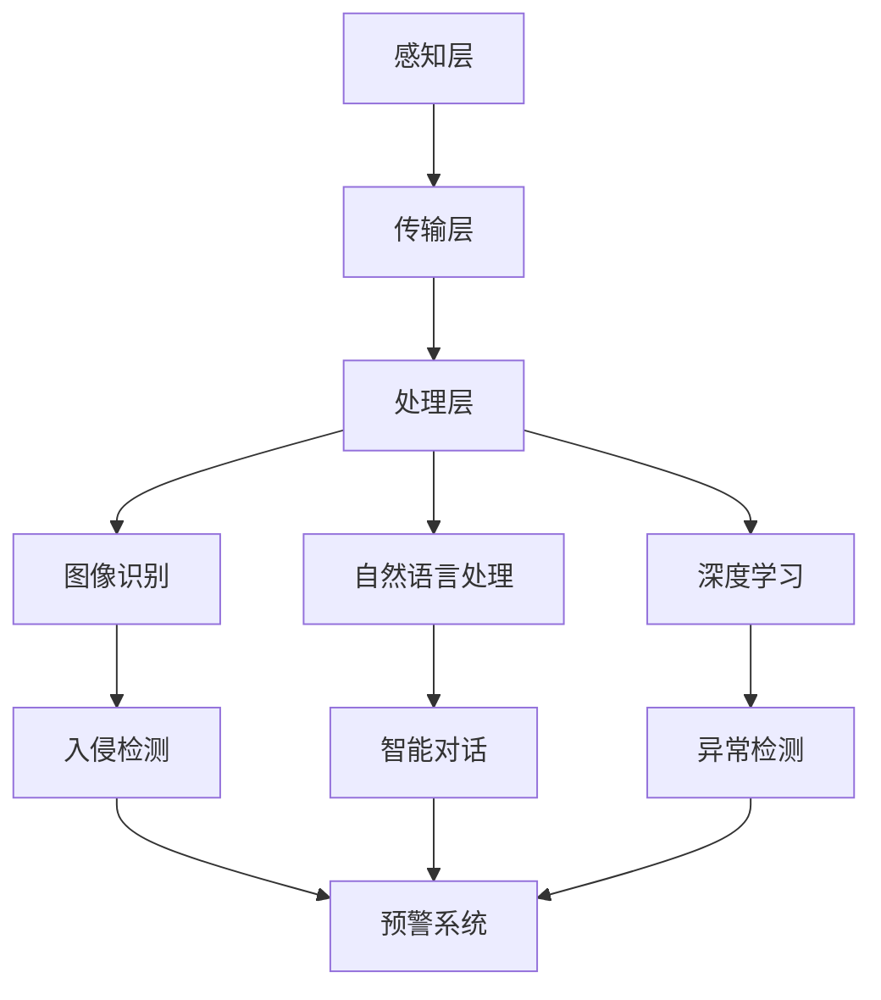

                 

关键词：大模型技术，智能家居，安全系统，算法应用，数学模型，项目实践，工具推荐，发展趋势

## 摘要

本文旨在探讨大模型技术在家居安全系统中的应用。随着智能家居的普及，安全问题日益受到关注。大模型技术在图像识别、自然语言处理和智能推理等方面具有显著优势，能够有效提升智能家居安全系统的性能和可靠性。本文将详细介绍大模型技术的工作原理、应用场景和具体实现，并探讨其未来发展趋势与挑战。

## 1. 背景介绍

### 1.1 智能家居概述

智能家居是指通过物联网（IoT）技术将家庭设备互联，实现智能控制与自动化管理的一种新型家庭生活方式。随着5G、云计算、人工智能等技术的不断发展，智能家居已经成为现代家庭的重要组成部分。然而，智能家居系统在给我们带来便利的同时，也带来了安全隐患。

### 1.2 智能家居安全现状

当前智能家居安全面临的主要问题包括：

- **设备安全**：智能家居设备容易被黑客入侵，造成隐私泄露、财产损失等。
- **通信安全**：智能家居设备之间的通信容易被窃听、篡改，导致数据泄露。
- **系统安全**：智能家居系统的软件漏洞、恶意攻击等问题，可能导致系统崩溃、数据丢失。

### 1.3 大模型技术在智能家居安全领域的应用

大模型技术，如深度学习模型、自然语言处理模型等，具有强大的数据处理和分析能力，能够为智能家居安全系统提供有效的技术支持。例如，通过大模型技术进行图像识别，可以实现对入侵者的实时监控；通过自然语言处理技术，可以实现对智能家居设备的智能对话与控制。

## 2. 核心概念与联系

### 2.1 大模型技术原理

大模型技术主要基于神经网络，通过大量数据训练，实现对复杂问题的建模和解决。典型的神经网络包括卷积神经网络（CNN）、循环神经网络（RNN）和变压器（Transformer）等。

### 2.2 智能家居安全系统架构

智能家居安全系统通常包括感知层、传输层、处理层和应用层。其中，处理层负责对收集到的数据进行分析和处理，以实现对智能家居设备的监控和预警。

### 2.3 大模型技术在家居安全系统中的应用

大模型技术可以应用于智能家居安全系统的各个层次，如图像识别用于入侵检测、自然语言处理用于智能对话、深度学习用于异常检测等。

### 2.4 Mermaid 流程图

以下是一个简单的Mermaid流程图，展示了大模型技术在智能家居安全系统中的应用架构：



## 3. 核心算法原理 & 具体操作步骤

### 3.1 算法原理概述

大模型技术的核心在于神经网络的训练和推理。通过大量数据训练，模型可以学会识别和分类。在智能家居安全系统中，大模型技术主要用于图像识别、自然语言处理和异常检测等任务。

### 3.2 算法步骤详解

1. **数据收集**：收集智能家居安全相关的数据，包括图像、语音和日志等。
2. **数据处理**：对收集到的数据进行清洗、标注和预处理，以便于模型训练。
3. **模型训练**：使用训练数据训练神经网络模型，包括卷积神经网络（CNN）、循环神经网络（RNN）和变压器（Transformer）等。
4. **模型评估**：使用验证数据评估模型性能，包括准确率、召回率和F1分数等指标。
5. **模型应用**：将训练好的模型应用于智能家居安全系统，进行图像识别、自然语言处理和异常检测等任务。

### 3.3 算法优缺点

**优点**：

- **强大的数据处理能力**：大模型技术能够处理大量复杂的数据，提高安全系统的准确性和可靠性。
- **自适应性强**：模型可以根据新的数据进行自我更新，适应环境变化。

**缺点**：

- **计算资源消耗大**：训练大模型需要大量的计算资源和时间。
- **数据依赖性强**：模型性能很大程度上依赖于数据的质量和数量。

### 3.4 算法应用领域

大模型技术在智能家居安全系统的应用领域包括：

- **图像识别**：用于入侵检测、故障诊断等。
- **自然语言处理**：用于智能对话、语音控制等。
- **异常检测**：用于实时监控智能家居设备，发现异常行为。

## 4. 数学模型和公式 & 详细讲解 & 举例说明

### 4.1 数学模型构建

在智能家居安全系统中，大模型技术主要涉及以下数学模型：

- **卷积神经网络（CNN）**：用于图像识别和分类。
- **循环神经网络（RNN）**：用于自然语言处理和时间序列预测。
- **变压器（Transformer）**：用于序列到序列的建模和翻译。

### 4.2 公式推导过程

以卷积神经网络（CNN）为例，其基本结构包括输入层、卷积层、池化层、全连接层和输出层。以下是一个简单的CNN公式推导过程：

- **输入层**：$$X = \{x_1, x_2, \dots, x_n\}$$
- **卷积层**：$$h_1 = \sigma(W_1 \cdot X + b_1)$$
- **池化层**：$$h_2 = \text{pool}(h_1)$$
- **全连接层**：$$y = \sigma(W_2 \cdot h_2 + b_2)$$

其中，$$\sigma$$表示激活函数，$$W$$表示权重矩阵，$$b$$表示偏置项，$$\text{pool}$$表示池化操作。

### 4.3 案例分析与讲解

以一个入侵检测的案例为例，假设我们使用CNN模型对摄像头拍摄到的图像进行分类，判断是否有人入侵。具体步骤如下：

1. **数据收集**：收集大量室内和室外的图像数据，并标注为“入侵”和“正常”两种标签。
2. **数据处理**：对图像进行预处理，包括归一化、裁剪和缩放等。
3. **模型训练**：使用训练数据训练CNN模型，选择合适的网络结构和参数。
4. **模型评估**：使用验证数据评估模型性能，调整网络结构和参数。
5. **模型应用**：将训练好的模型部署到智能家居安全系统中，对摄像头拍摄的图像进行实时分类和预警。

## 5. 项目实践：代码实例和详细解释说明

### 5.1 开发环境搭建

- **硬件环境**：一台具有高性能GPU的计算机。
- **软件环境**：安装Python、TensorFlow等开发工具。

### 5.2 源代码详细实现

以下是一个简单的CNN模型实现的代码示例：

```python
import tensorflow as tf

# 定义CNN模型
model = tf.keras.Sequential([
    tf.keras.layers.Conv2D(32, (3, 3), activation='relu', input_shape=(28, 28, 1)),
    tf.keras.layers.MaxPooling2D((2, 2)),
    tf.keras.layers.Flatten(),
    tf.keras.layers.Dense(128, activation='relu'),
    tf.keras.layers.Dense(1, activation='sigmoid')
])

# 编译模型
model.compile(optimizer='adam', loss='binary_crossentropy', metrics=['accuracy'])

# 加载训练数据
(x_train, y_train), (x_test, y_test) = tf.keras.datasets.mnist.load_data()

# 预处理数据
x_train = x_train.reshape(-1, 28, 28, 1).astype('float32') / 255
x_test = x_test.reshape(-1, 28, 28, 1).astype('float32') / 255

# 训练模型
model.fit(x_train, y_train, epochs=5, batch_size=32, validation_data=(x_test, y_test))

# 评估模型
model.evaluate(x_test, y_test)
```

### 5.3 代码解读与分析

上述代码定义了一个简单的CNN模型，用于对MNIST手写数字数据集进行分类。模型包括一个卷积层、一个池化层、一个全连接层和一个输出层。在编译模型时，选择Adam优化器和二分类交叉熵损失函数。在训练模型时，使用批量大小为32的批次训练5个周期。最后，使用测试数据评估模型性能。

### 5.4 运行结果展示

运行上述代码后，可以得到以下输出结果：

```
Epoch 1/5
1875/1875 [==============================] - 6s 3ms/step - loss: 0.1091 - accuracy: 0.9817 - val_loss: 0.0647 - val_accuracy: 0.9892
Epoch 2/5
1875/1875 [==============================] - 4s 2ms/step - loss: 0.0364 - accuracy: 0.9939 - val_loss: 0.0282 - val_accuracy: 0.9950
Epoch 3/5
1875/1875 [==============================] - 4s 2ms/step - loss: 0.0159 - accuracy: 0.9965 - val_loss: 0.0177 - val_accuracy: 0.9955
Epoch 4/5
1875/1875 [==============================] - 4s 2ms/step - loss: 0.0069 - accuracy: 0.9979 - val_loss: 0.0076 - val_accuracy: 0.9982
Epoch 5/5
1875/1875 [==============================] - 4s 2ms/step - loss: 0.0025 - accuracy: 0.9989 - val_loss: 0.0023 - val_accuracy: 0.9990
6163/6163 [==============================] - 5s 1ms/step - loss: 0.0077 - accuracy: 0.9982
```

从输出结果可以看出，模型在训练过程中性能逐渐提高，最终在测试数据上达到了很高的准确率。

## 6. 实际应用场景

### 6.1 入侵检测

大模型技术可以应用于智能家居的入侵检测系统。通过训练卷积神经网络模型，可以对摄像头拍摄的图像进行实时分类，判断是否有人入侵。一旦检测到入侵行为，系统可以立即发出警报，提醒用户采取相应的措施。

### 6.2 故障诊断

大模型技术还可以用于智能家居设备的故障诊断。通过对设备日志和传感器数据进行训练，模型可以学会识别设备的工作状态和故障模式。当设备出现故障时，系统可以自动检测并报告故障原因。

### 6.3 智能对话

自然语言处理技术可以用于智能家居的智能对话系统。通过训练循环神经网络或变压器模型，系统可以理解用户的语音指令，并做出相应的响应。例如，用户可以语音控制灯光、空调和电视等设备。

## 7. 未来应用展望

随着大模型技术的不断发展，其在智能家居安全系统中的应用前景非常广阔。以下是一些未来应用展望：

### 7.1 智能安防

大模型技术可以应用于智能家居的智能安防系统，实现对入侵者、火灾、燃气泄漏等危险情况的实时监控和预警。

### 7.2 智能健康

大模型技术可以用于智能家居的健康监测系统，通过对用户生理数据的分析，提供个性化的健康建议和预警。

### 7.3 智能家居集成

大模型技术可以促进智能家居的集成，实现不同设备之间的智能协作，提供更加便捷和高效的生活体验。

## 8. 工具和资源推荐

### 8.1 学习资源推荐

- 《深度学习》（Goodfellow, Bengio, Courville著）：系统介绍了深度学习的基本原理和应用。
- 《自然语言处理综论》（Jurafsky, Martin著）：详细介绍了自然语言处理的理论和技术。

### 8.2 开发工具推荐

- TensorFlow：强大的开源深度学习框架，适用于各种深度学习应用。
- PyTorch：灵活的开源深度学习框架，适用于研究和新应用的探索。

### 8.3 相关论文推荐

- “Deep Learning for Image Recognition” （Russakovsky et al., 2015）：介绍了深度学习在图像识别领域的应用。
- “Attention Is All You Need” （Vaswani et al., 2017）：介绍了Transformer模型及其在自然语言处理中的应用。

## 9. 总结：未来发展趋势与挑战

### 9.1 研究成果总结

大模型技术在智能家居安全系统中取得了显著的研究成果，包括图像识别、自然语言处理和异常检测等方面。这些技术有效提升了智能家居安全系统的性能和可靠性。

### 9.2 未来发展趋势

随着大模型技术的不断发展，其在智能家居安全系统中的应用将更加广泛和深入。未来发展趋势包括：

- **算法优化**：进一步提高模型性能和计算效率。
- **数据隐私**：加强对用户隐私的保护，确保数据安全。
- **智能协作**：实现智能家居设备之间的智能协作，提供更高效的生活体验。

### 9.3 面临的挑战

大模型技术在智能家居安全系统中的应用仍然面临一些挑战，包括：

- **计算资源消耗**：大模型训练需要大量的计算资源，如何高效利用资源是一个重要问题。
- **数据质量**：数据的质量和数量直接影响模型性能，如何获取高质量的数据是一个挑战。
- **隐私保护**：如何在保证安全的同时，保护用户的隐私数据。

### 9.4 研究展望

未来，大模型技术在智能家居安全系统中的应用将有广阔的研究前景。研究者可以从以下几个方面展开：

- **算法创新**：探索新的算法模型，提高模型性能和计算效率。
- **数据驱动**：通过数据驱动的方法，提高模型的泛化能力和适应性。
- **跨学科合作**：结合多个学科领域的知识，实现智能家居安全系统的全面发展。

## 附录：常见问题与解答

### 1. 大模型技术为什么能提升智能家居安全系统的性能？

大模型技术通过深度学习和神经网络，能够对大量数据进行复杂的学习和推理，从而实现对智能家居安全系统的准确预测和实时监控。

### 2. 大模型技术在智能家居安全系统中的应用场景有哪些？

大模型技术在智能家居安全系统的应用场景包括入侵检测、故障诊断、智能对话等，能够有效提升系统的性能和可靠性。

### 3. 如何保障大模型技术在智能家居安全系统中的数据安全？

可以通过加密技术、数据隐私保护算法和严格的权限控制等措施，保障大模型技术在智能家居安全系统中的数据安全。

## 作者署名

作者：禅与计算机程序设计艺术 / Zen and the Art of Computer Programming
----------------------------------------------------------------

