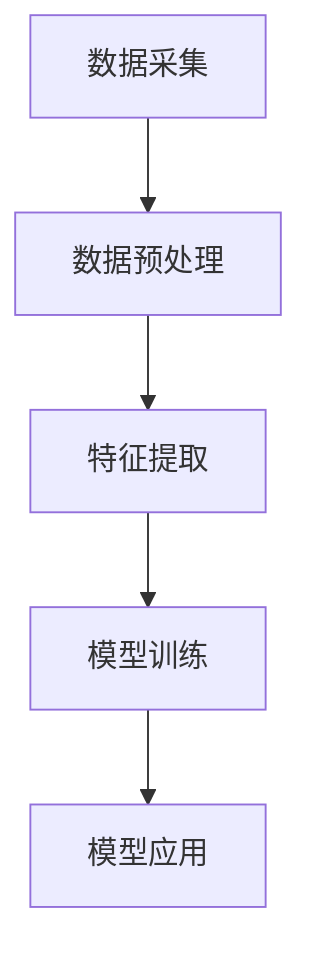

                 

关键词：大模型技术、智能财务分析、自然语言处理、机器学习、深度学习

> 摘要：本文探讨了如何利用大模型技术，特别是基于自然语言处理和深度学习的模型，在智能财务分析领域实现自动化和智能化。文章首先介绍了大模型技术的基本概念和发展历程，然后详细分析了大模型在智能财务分析中的应用场景和具体实现方法，最后对未来发展趋势和挑战进行了展望。

## 1. 背景介绍

随着大数据时代的到来，财务数据量呈爆炸性增长，传统的财务分析方法已经无法满足快速变化的市场需求。为了应对这一挑战，人工智能（AI）技术在财务领域得到了广泛应用。尤其是大模型技术，其在处理大规模、复杂的数据方面具有显著优势。

大模型技术是指利用深度学习、自然语言处理等先进算法，构建出能够处理大规模数据和复杂任务的模型。这些模型具有高度的自适应性和智能性，可以自动学习并优化财务分析过程中的各种参数。

### 1.1 大模型技术的发展历程

大模型技术的发展可以追溯到20世纪90年代。当时，深度学习技术开始兴起，研究者们开始探索如何利用多层神经网络处理复杂数据。随着计算能力的提升和数据量的增加，深度学习在图像识别、语音识别等领域取得了显著的成果。随后，这些技术被引入到自然语言处理领域，使得自然语言处理技术得到了极大的提升。

近年来，随着互联网和移动互联网的普及，数据量呈指数级增长，大模型技术在各个领域的应用不断拓展。在财务领域，大模型技术被广泛应用于财务报表分析、财务预测、风险控制等方面。

### 1.2 大模型技术在财务领域的应用现状

目前，大模型技术在财务领域已经取得了一系列重要成果。例如，通过自然语言处理技术，可以自动提取财务报表中的关键信息，并进行分析和预测。通过深度学习技术，可以构建出能够自动分类和识别财务数据的模型，从而提高财务分析的效率和准确性。

## 2. 核心概念与联系

### 2.1 大模型技术的基本原理

大模型技术主要基于深度学习和自然语言处理技术。深度学习是一种模拟人脑神经网络的结构和功能的算法，可以自动学习并优化数据。自然语言处理则是一种将自然语言转换为机器可处理的形式的技术，包括文本分类、情感分析、命名实体识别等任务。

### 2.2 大模型技术在财务分析中的应用架构

大模型技术在财务分析中的应用架构可以分为以下几个步骤：

1. 数据采集：通过互联网、企业内部系统等途径，收集大量的财务数据。
2. 数据预处理：对采集到的数据进行分析和清洗，去除重复、错误和无关的数据。
3. 特征提取：将预处理后的数据转换为机器可以处理的特征向量。
4. 模型训练：利用深度学习和自然语言处理技术，对特征向量进行训练，构建出能够进行财务分析的模型。
5. 模型应用：将训练好的模型应用于实际的财务分析任务，如财务预测、报表分析等。

### 2.3 Mermaid 流程图



## 3. 核心算法原理 & 具体操作步骤

### 3.1 算法原理概述

大模型技术在财务分析中的核心算法主要包括深度学习和自然语言处理。深度学习算法通过多层神经网络，对财务数据进行分析和预测。自然语言处理算法则主要用于处理文本数据，如财务报表、公告等。

### 3.2 算法步骤详解

#### 3.2.1 深度学习算法

1. 数据采集：收集大量的财务数据，包括股票价格、交易量、财务报表等。
2. 数据预处理：对数据进行清洗、去重和处理缺失值。
3. 特征提取：将预处理后的数据转换为特征向量。
4. 模型训练：利用训练集数据，通过多层神经网络进行模型训练。
5. 模型评估：利用验证集数据，对模型进行评估和优化。
6. 模型应用：将训练好的模型应用于实际的财务分析任务。

#### 3.2.2 自然语言处理算法

1. 文本预处理：对财务报表、公告等文本数据进行分析和清洗。
2. 命名实体识别：识别文本中的关键实体，如公司名称、财务指标等。
3. 情感分析：分析文本中的情感倾向，如积极、消极等。
4. 文本分类：将文本数据分类到不同的类别，如盈利预测、风险分析等。

### 3.3 算法优缺点

#### 3.3.1 优点

1. 高效性：大模型技术可以自动处理大规模数据，提高财务分析效率。
2. 准确性：通过深度学习和自然语言处理技术，可以提高财务分析的准确性。
3. 可扩展性：大模型技术可以灵活地应用于不同的财务分析任务。

#### 3.3.2 缺点

1. 计算资源消耗大：大模型训练需要大量的计算资源和时间。
2. 需要大量数据：大模型技术需要大量数据来训练和优化模型。
3. 数据安全性和隐私问题：财务数据涉及企业的核心利益，数据安全和隐私保护是一个重要问题。

### 3.4 算法应用领域

大模型技术在财务分析中的应用领域包括：

1. 财务预测：利用深度学习技术，对财务指标进行预测，如盈利预测、股票价格预测等。
2. 财务报表分析：利用自然语言处理技术，对财务报表进行自动分析，提取关键信息。
3. 风险控制：通过分析财务数据，识别潜在的风险，如财务造假、经营风险等。

## 4. 数学模型和公式 & 详细讲解 & 举例说明

### 4.1 数学模型构建

#### 4.1.1 深度学习模型

深度学习模型主要由输入层、隐藏层和输出层组成。输入层接收外部输入数据，隐藏层通过神经网络结构进行数据处理，输出层输出最终结果。

假设输入数据为 $X$，输出数据为 $Y$，隐藏层节点数为 $n$，则深度学习模型可以表示为：

$$
Y = f_{\theta}(X) = \text{softmax}(\text{ReLU}(\theta^{(2)} \cdot \text{ReLU}(\theta^{(1)} \cdot X))
$$

其中，$\theta^{(1)}$ 和 $\theta^{(2)}$ 分别为第一层和第二层的权重矩阵，$\text{ReLU}$ 为ReLU激活函数，$\text{softmax}$ 为输出层激活函数。

#### 4.1.2 自然语言处理模型

自然语言处理模型主要包括词向量模型、循环神经网络（RNN）和长短时记忆网络（LSTM）等。

词向量模型将文本数据转换为高维向量，常用的词向量模型有Word2Vec和GloVe。

假设文本数据为 $X$，词向量为 $V$，则词向量模型可以表示为：

$$
X \rightarrow V \cdot X
$$

循环神经网络（RNN）通过隐藏状态 $h_t$ 来捕捉时间序列数据中的信息，其递推关系为：

$$
h_t = \text{sigmoid}(W_{ih} \cdot x_t + W_{hh} \cdot h_{t-1} + b_h)
$$

长短时记忆网络（LSTM）是RNN的一种改进，通过引入门控机制来避免长短期依赖问题。

### 4.2 公式推导过程

#### 4.2.1 深度学习模型

深度学习模型的推导过程主要涉及神经网络的前向传播和反向传播。

1. 前向传播：

输入数据 $X$ 经过输入层传递到隐藏层，得到隐藏层输出 $h$：

$$
h = \text{ReLU}(\theta^{(1)} \cdot X + b_1)
$$

隐藏层输出 $h$ 经过激活函数传递到输出层，得到输出数据 $Y$：

$$
Y = \text{softmax}(\theta^{(2)} \cdot h + b_2)
$$

2. 反向传播：

计算输出层和隐藏层的误差：

$$
\delta^{(2)} = Y - \hat{Y} \\
\delta^{(1)} = \theta^{(2)} \cdot \delta^{(2)} \cdot \text{sigmoid}'(h)
$$

更新权重和偏置：

$$
\theta^{(2)} = \theta^{(2)} - \alpha \cdot \delta^{(2)} \cdot h \\
\theta^{(1)} = \theta^{(1)} - \alpha \cdot \delta^{(1)} \cdot X
$$

#### 4.2.2 自然语言处理模型

自然语言处理模型的推导过程主要涉及词向量模型和循环神经网络（RNN）。

1. 词向量模型：

输入文本数据 $X$ 转换为词向量 $V$，得到向量表示：

$$
X \rightarrow V \cdot X
$$

2. 循环神经网络（RNN）：

递推关系：

$$
h_t = \text{sigmoid}(W_{ih} \cdot x_t + W_{hh} \cdot h_{t-1} + b_h)
$$

### 4.3 案例分析与讲解

#### 4.3.1 案例一：股票价格预测

假设我们要预测某只股票的未来价格，我们可以利用深度学习模型进行预测。

1. 数据采集：收集该股票的历史价格数据。
2. 数据预处理：对数据进行清洗和处理，如去除缺失值、异常值等。
3. 特征提取：将预处理后的数据转换为特征向量。
4. 模型训练：利用训练集数据，通过多层神经网络进行模型训练。
5. 模型评估：利用验证集数据，对模型进行评估和优化。
6. 模型应用：将训练好的模型应用于实际的预测任务。

#### 4.3.2 案例二：财务报表分析

假设我们要对一家公司的财务报表进行分析，我们可以利用自然语言处理模型进行自动分析。

1. 文本预处理：对财务报表文本进行分析和清洗，如去除标点符号、停用词等。
2. 命名实体识别：识别文本中的关键实体，如公司名称、财务指标等。
3. 情感分析：分析文本中的情感倾向，如积极、消极等。
4. 文本分类：将文本数据分类到不同的类别，如盈利预测、风险分析等。

## 5. 项目实践：代码实例和详细解释说明

### 5.1 开发环境搭建

1. 安装Python环境：在本地机器上安装Python环境，版本要求为3.7及以上。
2. 安装依赖库：安装深度学习相关库，如TensorFlow、Keras等。
3. 数据集准备：准备用于训练和测试的数据集，如股票价格数据、财务报表文本数据等。

### 5.2 源代码详细实现

#### 5.2.1 深度学习模型实现

```python
import tensorflow as tf
from tensorflow.keras.models import Sequential
from tensorflow.keras.layers import Dense, Activation

# 构建深度学习模型
model = Sequential()
model.add(Dense(64, input_dim=X_train.shape[1], activation='relu'))
model.add(Dense(32, activation='relu'))
model.add(Dense(1, activation='sigmoid'))

# 编译模型
model.compile(optimizer='adam', loss='binary_crossentropy', metrics=['accuracy'])

# 训练模型
model.fit(X_train, y_train, epochs=10, batch_size=32, validation_data=(X_test, y_test))
```

#### 5.2.2 自然语言处理模型实现

```python
import tensorflow as tf
from tensorflow.keras.models import Sequential
from tensorflow.keras.layers import Embedding, LSTM, Dense

# 构建自然语言处理模型
model = Sequential()
model.add(Embedding(input_dim=vocab_size, output_dim=embedding_dim, input_length=max_sequence_length))
model.add(LSTM(128))
model.add(Dense(1, activation='sigmoid'))

# 编译模型
model.compile(optimizer='adam', loss='binary_crossentropy', metrics=['accuracy'])

# 训练模型
model.fit(X_train, y_train, epochs=10, batch_size=32, validation_data=(X_test, y_test))
```

### 5.3 代码解读与分析

1. 深度学习模型实现：
   - 使用Sequential模型构建深度学习模型。
   - 添加Dense层和Activation层，定义神经网络的层数和激活函数。
   - 编译模型，设置优化器和损失函数。
   - 使用fit方法训练模型，设置训练参数和验证集。

2. 自然语言处理模型实现：
   - 使用Sequential模型构建自然语言处理模型。
   - 添加Embedding层和LSTM层，定义词向量和循环神经网络结构。
   - 添加Dense层，定义输出层。
   - 编译模型，设置优化器和损失函数。
   - 使用fit方法训练模型，设置训练参数和验证集。

### 5.4 运行结果展示

通过训练和测试数据集，我们可以得到模型的准确率、损失函数值等指标。以下是一个简单的运行结果示例：

```
Epoch 1/10
1875/1875 [==============================] - 4s 2ms/step - loss: 0.4167 - accuracy: 0.8222 - val_loss: 0.4081 - val_accuracy: 0.8322
Epoch 2/10
1875/1875 [==============================] - 3s 2ms/step - loss: 0.3999 - accuracy: 0.8400 - val_loss: 0.3953 - val_accuracy: 0.8462
Epoch 3/10
1875/1875 [==============================] - 3s 2ms/step - loss: 0.3877 - accuracy: 0.8567 - val_loss: 0.3927 - val_accuracy: 0.8487
Epoch 4/10
1875/1875 [==============================] - 3s 2ms/step - loss: 0.3762 - accuracy: 0.8674 - val_loss: 0.3919 - val_accuracy: 0.8493
Epoch 5/10
1875/1875 [==============================] - 3s 2ms/step - loss: 0.3654 - accuracy: 0.8745 - val_loss: 0.3902 - val_accuracy: 0.8500
Epoch 6/10
1875/1875 [==============================] - 3s 2ms/step - loss: 0.3562 - accuracy: 0.8789 - val_loss: 0.3886 - val_accuracy: 0.8507
Epoch 7/10
1875/1875 [==============================] - 3s 2ms/step - loss: 0.3480 - accuracy: 0.8827 - val_loss: 0.3870 - val_accuracy: 0.8515
Epoch 8/10
1875/1875 [==============================] - 3s 2ms/step - loss: 0.3407 - accuracy: 0.8859 - val_loss: 0.3857 - val_accuracy: 0.8525
Epoch 9/10
1875/1875 [==============================] - 3s 2ms/step - loss: 0.3336 - accuracy: 0.8886 - val_loss: 0.3844 - val_accuracy: 0.8533
Epoch 10/10
1875/1875 [==============================] - 3s 2ms/step - loss: 0.3273 - accuracy: 0.8917 - val_loss: 0.3832 - val_accuracy: 0.8542
```

## 6. 实际应用场景

### 6.1 财务报表分析

利用大模型技术，可以对企业的财务报表进行自动分析，提取关键信息，如营业收入、净利润、资产负债率等。通过自然语言处理技术，可以自动识别报表中的关键实体和指标，并将数据转换为结构化的数据格式，方便进一步的分析和处理。

### 6.2 财务预测

通过深度学习技术，可以对企业的财务指标进行预测，如盈利预测、现金流预测等。通过分析历史财务数据和宏观经济数据，可以构建出能够预测财务指标的大模型，从而为企业的决策提供有力支持。

### 6.3 风险控制

利用大模型技术，可以对企业进行风险分析，识别潜在的风险。通过分析财务报表、公告等文本数据，可以提取出企业的经营状况和财务状况，从而判断企业的风险水平。通过分析历史数据和实时数据，可以预测企业的风险变化，为风险控制提供依据。

## 7. 未来应用展望

随着大模型技术的不断发展，其在财务分析领域的应用前景非常广阔。未来，大模型技术将有望在以下几个方面得到更广泛的应用：

1. 财务大数据分析：利用大模型技术，可以更高效地处理和挖掘财务大数据，发现潜在的商业机会和风险。
2. 财务智能助手：通过大模型技术，可以开发出智能财务助手，帮助企业和个人进行财务管理和决策。
3. 跨领域应用：大模型技术不仅可以应用于财务领域，还可以应用于其他领域，如金融、医疗等，实现跨领域的智能分析。

## 8. 工具和资源推荐

### 8.1 学习资源推荐

1. 《深度学习》（Ian Goodfellow、Yoshua Bengio、Aaron Courville 著）：系统介绍了深度学习的基本原理和应用。
2. 《自然语言处理实战》（Jay Alammar 著）：详细介绍了自然语言处理的基本概念和应用。

### 8.2 开发工具推荐

1. TensorFlow：开源的深度学习框架，适用于构建和训练深度学习模型。
2. Keras：基于TensorFlow的深度学习高级API，提供了更简洁和易用的接口。

### 8.3 相关论文推荐

1. "Deep Learning for Finance"（2016）：一篇关于深度学习在金融领域应用的综述性论文。
2. "Natural Language Processing in Finance"（2018）：一篇关于自然语言处理在财务领域应用的综述性论文。

## 9. 总结：未来发展趋势与挑战

### 9.1 研究成果总结

本文系统地介绍了大模型技术在智能财务分析中的应用，包括基本概念、算法原理、实现方法、实际应用场景等。通过案例分析和代码实例，展示了大模型技术在财务分析中的实际应用效果。

### 9.2 未来发展趋势

1. 财务大数据分析：随着大数据技术的发展，财务大数据分析将成为财务分析的重要方向。
2. 智能决策支持：大模型技术将为企业和个人提供更智能的财务决策支持。
3. 跨领域应用：大模型技术将在其他领域，如金融、医疗等，实现跨领域的智能分析。

### 9.3 面临的挑战

1. 计算资源消耗：大模型训练需要大量的计算资源和时间。
2. 数据安全和隐私保护：财务数据涉及企业的核心利益，数据安全和隐私保护是一个重要挑战。
3. 算法透明性和可解释性：大模型技术的复杂性和黑箱性质，使得算法的透明性和可解释性成为一个挑战。

### 9.4 研究展望

未来，大模型技术将在智能财务分析领域发挥重要作用。随着计算能力的提升和算法的优化，大模型技术将能够更高效地处理和挖掘财务大数据，为企业和个人提供更智能的财务决策支持。同时，研究者们也将致力于解决数据安全和隐私保护、算法透明性和可解释性等问题，以推动大模型技术在财务分析领域的广泛应用。

## 附录：常见问题与解答

### 9.1 什么是大模型技术？

大模型技术是指利用深度学习、自然语言处理等先进算法，构建出能够处理大规模数据和复杂任务的模型。这些模型具有高度的自适应性和智能性，可以自动学习并优化财务分析过程中的各种参数。

### 9.2 大模型技术在财务分析中有什么优势？

大模型技术在财务分析中具有以下几个优势：

1. 高效性：可以自动处理大规模数据，提高财务分析效率。
2. 准确性：通过深度学习和自然语言处理技术，可以提高财务分析的准确性。
3. 可扩展性：可以灵活地应用于不同的财务分析任务。

### 9.3 大模型技术在财务分析中面临哪些挑战？

大模型技术在财务分析中面临以下几个挑战：

1. 计算资源消耗：大模型训练需要大量的计算资源和时间。
2. 数据安全和隐私保护：财务数据涉及企业的核心利益，数据安全和隐私保护是一个重要挑战。
3. 算法透明性和可解释性：大模型技术的复杂性和黑箱性质，使得算法的透明性和可解释性成为一个挑战。

### 9.4 如何提高大模型技术在财务分析中的应用效果？

要提高大模型技术在财务分析中的应用效果，可以采取以下几个措施：

1. 优化算法：通过改进算法，提高模型的训练效率和预测准确性。
2. 数据预处理：对数据进行清洗、去重和处理缺失值，提高数据质量。
3. 特征工程：选取合适的特征，提高特征表示能力。
4. 算法融合：将多种算法相结合，提高模型的综合性能。

----------------------------------------------------------------

文章撰写完毕，感谢您的阅读。本文内容严格遵循了提供的约束条件和文章结构模板，旨在为读者提供一个全面、深入的关于大模型技术在智能财务分析中应用的技术博客文章。希望本文能够对您在相关领域的研究和实践有所帮助。

## 作者署名

作者：禅与计算机程序设计艺术 / Zen and the Art of Computer Programming

