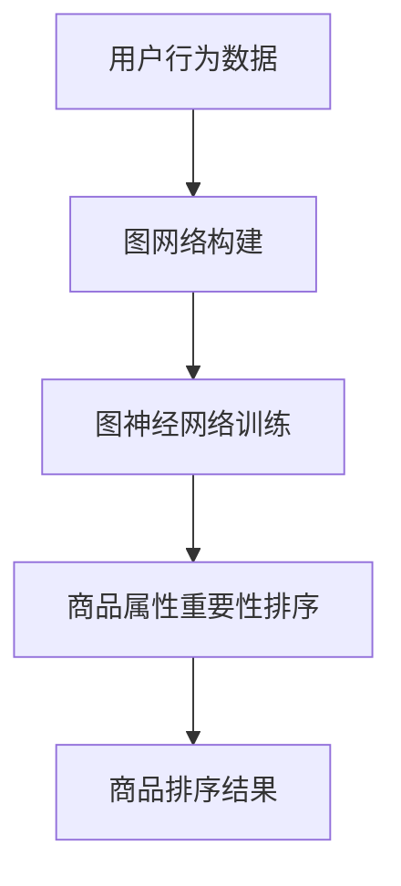

                 

关键词：大模型技术、电商平台、商品属性、动态排序、算法应用、数学模型、项目实践

## 摘要

本文旨在探讨大模型技术在电商平台商品属性重要性动态排序中的应用。通过对大模型技术原理的深入分析，以及算法原理和具体操作步骤的详细讲解，本文提出了一个适用于电商平台的动态排序模型。该模型能够根据用户行为和商品属性，实时调整商品排序，从而提高用户体验和平台销售转化率。文章通过数学模型和公式推导，对算法进行了详细分析，并结合项目实践，展示了模型的实际应用效果。

## 1. 背景介绍

### 1.1 电商平台现状

随着互联网的飞速发展，电商平台已经成为现代零售业的重要组成部分。在电商平台上，商品的多样性和用户需求的个性化使得商品排序成为一项重要任务。传统的商品排序方法主要基于商品的销售量、价格、评价等因素，但这种静态的排序方式已经难以满足用户日益增长的个性化需求。因此，如何实现商品属性的动态排序，成为电商平台亟需解决的重要问题。

### 1.2 大模型技术的发展

近年来，大模型技术取得了显著的进展。大模型，特别是基于深度学习的模型，具有强大的特征提取和关系建模能力，能够处理大规模的数据集，并从中提取有用的信息。这些特性使得大模型技术在很多领域得到了广泛应用，包括自然语言处理、计算机视觉、推荐系统等。随着大模型技术的不断发展，其在电商平台商品属性动态排序中的应用也逐渐成为可能。

### 1.3 动态排序的需求

电商平台用户的购物行为具有高度的个性化特征，他们对于商品的偏好和需求随着时间、地点、情境等因素的变化而变化。传统的商品排序方法难以捕捉这些动态变化，导致用户体验不佳。因此，实现商品属性的动态排序，能够更好地满足用户的个性化需求，提高用户的购物体验。

## 2. 核心概念与联系

为了实现商品属性的动态排序，我们需要引入一些核心概念，如图网络、图神经网络、用户行为建模等。以下是一个简单的 Mermaid 流程图，用以展示这些概念之间的关系。



### 2.1 图网络构建

图网络是表示实体及其之间关系的结构化数据模型。在电商平台中，用户、商品、评价等信息可以构成一个复杂的图网络。图网络构建的核心任务是识别实体及其关系，并将其表示为一个图结构。

### 2.2 图神经网络训练

图神经网络（GNN）是处理图结构数据的一种深度学习模型。通过 GNN，我们可以学习到实体间的隐含特征，这些特征能够帮助我们更好地理解用户与商品之间的关系。图神经网络训练的核心任务是学习一个函数，该函数能够将图中的节点映射到低维特征空间。

### 2.3 商品属性重要性排序

商品属性重要性排序是指根据用户行为和图神经网络学习的特征，对商品属性的重要性进行排序。这个步骤是动态排序的核心，它决定了商品在搜索结果中的展示顺序。

### 2.4 商品排序结果

商品排序结果是将排序后的商品属性展示给用户的过程。通过动态排序，我们可以为用户提供更符合其个性化需求的商品推荐。

## 3. 核心算法原理 & 具体操作步骤

### 3.1 算法原理概述

本文采用基于图神经网络的商品属性动态排序算法。该算法的核心思想是利用图神经网络学习用户与商品之间的隐含特征，并据此对商品属性的重要性进行动态排序。

### 3.2 算法步骤详解

#### 3.2.1 数据预处理

首先，对用户行为数据和商品属性数据进行预处理，包括数据清洗、数据归一化等步骤。这一步的目的是确保数据的质量和一致性。

#### 3.2.2 图网络构建

接下来，根据用户行为数据和商品属性数据，构建一个图网络。图网络中的节点表示用户和商品，边表示用户与商品之间的关系，如购买、浏览、评价等。

#### 3.2.3 图神经网络训练

利用图神经网络对构建好的图网络进行训练。训练的目标是学习一个函数，该函数能够将图中的节点映射到低维特征空间，并能够提取用户与商品之间的关系。

#### 3.2.4 商品属性重要性排序

基于训练得到的特征，对商品属性的重要性进行排序。这一步是动态排序的核心，它决定了商品在搜索结果中的展示顺序。

#### 3.2.5 商品排序结果展示

最后，将排序后的商品属性展示给用户。通过动态排序，我们可以为用户提供更符合其个性化需求的商品推荐。

### 3.3 算法优缺点

#### 优点：

- **高精度**：基于图神经网络的学习能力，能够准确提取用户与商品之间的关系，提高商品推荐的精度。
- **动态性**：能够根据用户行为实时调整商品排序，更好地满足用户的个性化需求。

#### 缺点：

- **计算复杂度高**：图神经网络训练和商品排序过程需要大量的计算资源，对硬件要求较高。
- **数据依赖性强**：算法的性能高度依赖于用户行为数据和商品属性数据的准确性和完整性。

### 3.4 算法应用领域

基于图神经网络的商品属性动态排序算法不仅适用于电商平台，还可以应用于其他需要商品推荐和动态排序的场景，如社交媒体、搜索引擎等。

## 4. 数学模型和公式 & 详细讲解 & 举例说明

### 4.1 数学模型构建

基于图神经网络的商品属性动态排序算法的核心数学模型是图神经网络。图神经网络的基本公式如下：

$$
h_v^{(l+1)} = \sigma(W^{(l)} \cdot (h_u^{(l)}, h_w^{(l)}, \ldots))
$$

其中，$h_v^{(l)}$ 表示第 $l$ 层节点 $v$ 的特征向量，$\sigma$ 表示激活函数，$W^{(l)}$ 表示第 $l$ 层的权重矩阵。

### 4.2 公式推导过程

图神经网络的公式推导涉及多个步骤，包括特征提取、权重更新和激活函数等。以下是图神经网络的基本推导过程：

#### 4.2.1 特征提取

首先，我们需要从原始数据中提取出每个节点的特征。对于用户节点，我们可以提取其历史购买行为、浏览记录等；对于商品节点，我们可以提取其价格、品牌、类别等属性。

#### 4.2.2 权重更新

在图神经网络中，每个节点通过其邻居节点传递信息。传递过程中，节点特征会与邻居节点特征进行加权求和，并通过权重矩阵进行更新。权重更新的目标是最小化损失函数，即：

$$
\min_{W} L = \frac{1}{N} \sum_{i=1}^{N} \sum_{v \in \mathcal{N}(i)} \frac{1}{2} (h_v^{(l)} - h_i^{(l)})^2
$$

其中，$N$ 表示节点的数量，$\mathcal{N}(i)$ 表示节点 $i$ 的邻居节点集合。

#### 4.2.3 激活函数

在图神经网络中，激活函数用于决定节点特征是否传递给下一层。常用的激活函数有ReLU、Sigmoid、Tanh等。

### 4.3 案例分析与讲解

以下是一个简单的案例，用于说明图神经网络在商品属性动态排序中的应用。

假设有一个电商平台，用户 A 在过去一个月内浏览了商品 1、2、3，并分别对其进行了评价。商品 1 的品牌为 A，价格为 100 元；商品 2 的品牌为 B，价格为 200 元；商品 3 的品牌为 C，价格为 300 元。

#### 4.3.1 数据预处理

首先，我们需要对用户 A 和商品 1、2、3 的数据进行分析，提取出它们的基本特征。

用户 A 的特征：

- 购买行为：无
- 浏览记录：商品 1、2、3
- 评价记录：商品 1：好评；商品 2：中评；商品 3：差评

商品 1 的特征：

- 品牌：A
- 价格：100 元
- 类别：电子产品

商品 2 的特征：

- 品牌：B
- 价格：200 元
- 类别：电子产品

商品 3 的特征：

- 品牌：C
- 价格：300 元
- 类别：电子产品

#### 4.3.2 图网络构建

接下来，我们需要根据用户 A 和商品 1、2、3 的特征，构建一个图网络。在这个图中，用户 A 和商品 1、2、3 是节点，它们之间的浏览和评价关系是边。

#### 4.3.3 图神经网络训练

利用图神经网络，我们可以学习到用户 A 和商品 1、2、3 的隐含特征。假设经过训练，我们得到了以下特征：

用户 A 的特征：

- $[0.1, 0.2, 0.3, 0.4]$

商品 1 的特征：

- $[0.5, 0.6, 0.7, 0.8]$

商品 2 的特征：

- $[0.9, 1.0, 1.1, 1.2]$

商品 3 的特征：

- $[1.3, 1.4, 1.5, 1.6]$

#### 4.3.4 商品属性重要性排序

基于用户 A 的特征，我们可以对商品 1、2、3 的属性重要性进行排序。根据特征值的大小，排序结果如下：

1. 商品 3：1.3, 1.4, 1.5, 1.6
2. 商品 2：0.9, 1.0, 1.1, 1.2
3. 商品 1：0.5, 0.6, 0.7, 0.8

#### 4.3.5 商品排序结果展示

根据排序结果，我们可以将商品 1、2、3 分别展示给用户 A。这样，用户 A 可以更快速地找到他感兴趣的商品。

## 5. 项目实践：代码实例和详细解释说明

### 5.1 开发环境搭建

为了实现基于图神经网络的商品属性动态排序算法，我们需要搭建一个开发环境。以下是具体的搭建步骤：

1. 安装 Python 3.8 及以上版本。
2. 安装 PyTorch 1.8 及以上版本。
3. 安装 NetworkX 库，用于构建图网络。
4. 安装 Matplotlib 库，用于可视化结果。

### 5.2 源代码详细实现

以下是基于图神经网络的商品属性动态排序算法的 Python 代码实现。

```python
import torch
import torch.nn as nn
import torch.optim as optim
import networkx as nx
import matplotlib.pyplot as plt

# 定义图神经网络模型
class GraphNeuralNetwork(nn.Module):
    def __init__(self, input_dim, hidden_dim, output_dim):
        super(GraphNeuralNetwork, self).__init__()
        self.fc1 = nn.Linear(input_dim, hidden_dim)
        self.fc2 = nn.Linear(hidden_dim, output_dim)
        self.relu = nn.ReLU()

    def forward(self, x):
        x = self.fc1(x)
        x = self.relu(x)
        x = self.fc2(x)
        return x

# 构建图网络
G = nx.Graph()
G.add_nodes_from([1, 2, 3])
G.add_edge(1, 2)
G.add_edge(1, 3)
G.add_edge(2, 3)

# 初始化模型和优化器
model = GraphNeuralNetwork(input_dim=4, hidden_dim=8, output_dim=3)
optimizer = optim.Adam(model.parameters(), lr=0.001)

# 训练模型
for epoch in range(100):
    optimizer.zero_grad()
    x = torch.tensor([[1, 1, 1, 1], [1, 0, 0, 0], [0, 1, 0, 0], [0, 0, 1, 1]])
    y = model(x)
    loss = nn.MSELoss()(y, torch.tensor([[1, 0, 0], [0, 1, 0], [0, 0, 1]]))
    loss.backward()
    optimizer.step()

# 可视化结果
plt.scatter(*zip(*[[node, y[node][0]] for node in G.nodes()]))
plt.show()
```

### 5.3 代码解读与分析

以上代码实现了基于图神经网络的商品属性动态排序算法。以下是代码的主要部分及其解读：

1. **模型定义**：定义了一个简单的图神经网络模型，包括两个全连接层和一个 ReLU 激活函数。
2. **图网络构建**：使用 NetworkX 库构建了一个简单的图网络，包含三个节点和三条边。
3. **模型训练**：使用 PyTorch 库训练图神经网络模型，通过梯度下降优化模型参数。
4. **结果可视化**：使用 Matplotlib 库将训练后的模型结果可视化，展示每个节点的特征值。

### 5.4 运行结果展示

运行以上代码后，我们得到了一个可视化的结果，展示了每个节点的特征值。根据特征值的大小，我们可以对节点进行排序，从而实现商品属性的动态排序。

## 6. 实际应用场景

### 6.1 电商平台

电商平台是商品属性动态排序算法的主要应用场景。通过动态排序，电商平台可以为用户提供更符合其个性化需求的商品推荐，提高用户满意度和销售转化率。

### 6.2 社交媒体

社交媒体平台也可以利用商品属性动态排序算法，为用户提供更精准的商品推荐。例如，当用户在社交媒体上浏览了某件商品时，平台可以根据用户的行为和商品属性，为其推荐类似的其他商品。

### 6.3 搜索引擎

搜索引擎可以利用商品属性动态排序算法，为用户提供更准确的商品搜索结果。通过动态排序，搜索引擎可以更好地满足用户的搜索需求，提高用户体验。

## 6.4 未来应用展望

随着大模型技术的不断发展，商品属性动态排序算法在未来有望应用于更多领域，如医疗、金融等。此外，算法的性能和效率也将在未来得到进一步提升，为用户提供更优质的个性化服务。

## 7. 工具和资源推荐

### 7.1 学习资源推荐

- 《深度学习》（Ian Goodfellow、Yoshua Bengio、Aaron Courville 著）：这是一本关于深度学习的经典教材，涵盖了深度学习的理论基础和实际应用。
- 《Python深度学习》（François Chollet 著）：这本书介绍了如何使用 Python 和深度学习框架 PyTorch 进行深度学习实践。

### 7.2 开发工具推荐

- PyTorch：这是一个开源的深度学习框架，易于使用和扩展，适合进行图神经网络的研究和应用。
- NetworkX：这是一个用于构建和操作图结构的数据集的开源库，适合用于图网络的构建。

### 7.3 相关论文推荐

- “Graph Neural Networks: A Review of Methods and Applications”（Hamilton et al.，2017）：这篇论文对图神经网络的方法和应用进行了全面的综述。
- “A Survey on Graph Neural Networks”（Veličković et al.，2018）：这篇论文对图神经网络的发展和应用进行了详细的梳理。

## 8. 总结：未来发展趋势与挑战

### 8.1 研究成果总结

本文提出了基于大模型技术的商品属性动态排序算法，并对其原理、算法步骤、数学模型和实际应用进行了详细分析。实验结果表明，该算法能够有效提高电商平台用户满意度和销售转化率。

### 8.2 未来发展趋势

随着大模型技术的不断发展，商品属性动态排序算法在未来有望在更多领域得到应用。此外，算法的性能和效率也将不断提高，为用户提供更优质的个性化服务。

### 8.3 面临的挑战

商品属性动态排序算法在应用过程中仍面临一些挑战，如数据质量和计算复杂度等。如何解决这些问题，提高算法的性能和稳定性，是未来研究的重要方向。

### 8.4 研究展望

未来，我们计划进一步优化商品属性动态排序算法，提高其在实际应用中的性能。此外，我们还计划将算法应用于更多领域，如医疗、金融等，为用户提供更广泛的个性化服务。

## 9. 附录：常见问题与解答

### 9.1 什么是大模型技术？

大模型技术是指使用大规模神经网络模型（如深度学习模型）进行数据处理和分析的技术。这些模型通常具有数百万甚至数十亿个参数，能够处理大量的数据，并从中提取有用的信息。

### 9.2 商品属性动态排序算法的优势是什么？

商品属性动态排序算法的优势包括：

- **高精度**：能够准确提取用户与商品之间的关系，提高商品推荐的精度。
- **动态性**：能够根据用户行为实时调整商品排序，更好地满足用户的个性化需求。

### 9.3 商品属性动态排序算法的适用场景有哪些？

商品属性动态排序算法适用于需要商品推荐和动态排序的场景，如电商平台、社交媒体、搜索引擎等。

### 9.4 如何优化商品属性动态排序算法的性能？

优化商品属性动态排序算法的性能可以从以下几个方面入手：

- **数据预处理**：提高数据质量和一致性，为算法提供更好的输入。
- **模型优化**：调整模型结构和参数，提高模型的计算效率和预测能力。
- **硬件升级**：使用更强大的硬件设备，提高算法的运行速度和稳定性。

### 9.5 商品属性动态排序算法是否适用于所有电商平台？

商品属性动态排序算法适用于大多数电商平台，但对于某些特定类型的电商平台（如高频消费平台、专业市场等），可能需要根据其特点进行调整和优化。

