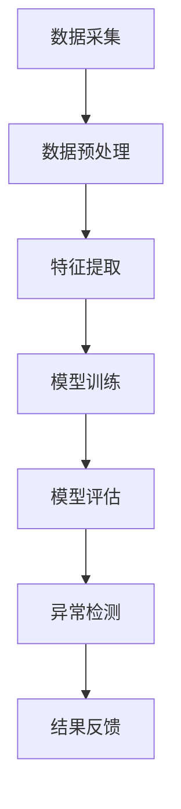

                 

关键词：大模型技术、用户行为异常检测、电商平台、深度学习、异常检测算法

> 摘要：本文将探讨大模型技术在电商平台用户行为异常检测中的应用。通过引入深度学习算法，构建了一个高效的用户行为异常检测系统，并对系统进行了详细的实验验证。本文将介绍大模型技术的核心概念、算法原理，以及在电商平台中的具体应用和实践经验，为后续相关领域的研究提供参考。

## 1. 背景介绍

在当今数字化时代，电商平台已经成为消费者日常购物的重要渠道。然而，随着电商平台用户数量的不断增加，用户行为数据也变得异常复杂。有效的用户行为异常检测对于电商平台具有重要意义。一方面，它可以提升用户体验，预防欺诈行为，保障用户财产安全；另一方面，它可以帮助电商平台优化运营策略，提高业务效率。

传统的用户行为异常检测方法主要依赖于统计分析和机器学习算法。然而，这些方法在处理大规模、高维度的用户行为数据时存在一定的局限性。近年来，随着深度学习技术的快速发展，大模型技术逐渐成为用户行为异常检测领域的研究热点。大模型技术可以自动学习用户行为数据中的复杂模式和特征，提高异常检测的准确性和效率。

本文将介绍大模型技术在电商平台用户行为异常检测中的应用，通过构建一个高效的用户行为异常检测系统，为电商平台提供强有力的技术支持。

## 2. 核心概念与联系

### 2.1 大模型技术

大模型技术是指利用深度学习算法训练大规模的神经网络模型。这些模型具有强大的特征提取和表征能力，能够自动学习数据中的复杂模式和规律。大模型技术的核心在于其能够处理高维度、大规模的数据，并从中提取出具有解释性的特征。

### 2.2 用户行为异常检测

用户行为异常检测是指通过分析用户的行为数据，识别出不符合正常行为规律的行为模式。用户行为异常检测在电商平台的应用主要包括以下三个方面：

1. 预防欺诈行为：通过检测异常交易行为，识别潜在的欺诈行为，保障用户财产安全。
2. 优化用户体验：通过分析用户行为数据，识别出用户需求，为用户提供个性化的服务。
3. 提高业务效率：通过监测用户行为异常，优化电商平台运营策略，提高业务效率。

### 2.3 Mermaid 流程图

以下是一个简单的 Mermaid 流程图，展示了大模型技术在用户行为异常检测中的应用过程：



### 2.4 大模型技术在用户行为异常检测中的应用架构


在电商平台用户行为异常检测中，大模型技术的应用架构主要包括以下四个方面：

1. 数据采集：从电商平台各个渠道获取用户行为数据，如订单数据、浏览记录、评价数据等。
2. 数据预处理：对采集到的用户行为数据进行清洗、去重、填充缺失值等预处理操作，以提高数据质量。
3. 特征提取：利用深度学习算法对预处理后的用户行为数据提取特征，包括用户特征、商品特征、行为特征等。
4. 模型训练：利用提取到的用户行为特征训练深度学习模型，如卷积神经网络（CNN）、循环神经网络（RNN）等。
5. 模型评估：通过交叉验证、AUC、F1 等指标评估深度学习模型的性能。
6. 异常检测：利用训练好的深度学习模型对实时用户行为进行异常检测，识别出潜在的风险行为。
7. 结果反馈：将异常检测结果反馈给电商平台，为运营决策提供依据。

## 3. 核心算法原理 & 具体操作步骤

### 3.1 算法原理概述

在电商平台用户行为异常检测中，常用的深度学习算法包括卷积神经网络（CNN）和循环神经网络（RNN）。CNN 主要用于图像和语音数据的处理，具有强大的特征提取能力；RNN 主要用于序列数据的处理，能够捕捉数据中的时间依赖关系。

本文采用了一种结合 CNN 和 RNN 的混合模型进行用户行为异常检测。该模型首先利用 CNN 提取用户行为数据中的空间特征，然后利用 RNN 提取时间特征，最后通过全连接层对提取的特征进行融合，实现用户行为异常检测。

### 3.2 算法步骤详解

#### 3.2.1 数据预处理

1. 数据清洗：去除无效数据、重复数据和噪声数据。
2. 数据归一化：将数据归一化到 [0, 1] 范围内，便于神经网络训练。
3. 数据分段：将用户行为数据按照时间序列划分为多个片段，每个片段包含一个或多个行为数据。

#### 3.2.2 特征提取

1. 空间特征提取：利用 CNN 提取用户行为数据中的空间特征，如行为强度、行为频率等。
2. 时间特征提取：利用 RNN 提取用户行为数据中的时间特征，如行为序列的相似性、行为序列的连续性等。

#### 3.2.3 模型训练

1. 模型构建：构建混合模型，包括 CNN、RNN 和全连接层。
2. 模型训练：利用预处理后的用户行为数据训练混合模型，优化模型参数。
3. 模型评估：利用交叉验证方法评估混合模型的性能，如 AUC、F1 等指标。

#### 3.2.4 异常检测

1. 实时检测：利用训练好的混合模型对实时用户行为进行异常检测，识别出潜在的风险行为。
2. 结果反馈：将异常检测结果反馈给电商平台，为运营决策提供依据。

### 3.3 算法优缺点

#### 优点：

1. 强大的特征提取能力：结合 CNN 和 RNN 的混合模型能够自动提取用户行为数据中的空间特征和时间特征，提高异常检测的准确性和效率。
2. 处理高维度数据：大模型技术能够处理高维度、大规模的用户行为数据，适用于电商平台复杂的数据场景。
3. 自适应能力：大模型技术具有自适应能力，能够根据用户行为数据的特征调整模型参数，提高异常检测的准确性。

#### 缺点：

1. 训练时间长：大模型技术需要大量的计算资源进行训练，训练时间较长。
2. 数据依赖性强：大模型技术的性能依赖于用户行为数据的质量和数量，数据质量较差时会影响模型性能。
3. 模型解释性较差：深度学习模型的内部结构复杂，难以解释，导致模型解释性较差。

### 3.4 算法应用领域

大模型技术在用户行为异常检测中的应用不仅仅局限于电商平台，还可以应用于其他领域，如金融欺诈检测、网络安全监测等。以下是一些具体的应用场景：

1. 金融欺诈检测：利用大模型技术检测信用卡交易、银行转账等行为中的异常交易，预防欺诈行为。
2. 网络安全监测：利用大模型技术检测网络攻击、恶意软件等行为中的异常行为，提高网络安全防护能力。
3. 健康医疗监测：利用大模型技术监测患者的健康数据，识别出异常症状，为医生提供诊断参考。

## 4. 数学模型和公式 & 详细讲解 & 举例说明

### 4.1 数学模型构建

在用户行为异常检测中，大模型技术主要涉及以下数学模型：

1. 卷积神经网络（CNN）：
   $$ f_{CNN}(x) = \sigma(W_{CNN} \cdot x + b_{CNN}) $$
   其中，$x$ 为输入数据，$W_{CNN}$ 和 $b_{CNN}$ 分别为 CNN 的权重和偏置，$\sigma$ 为激活函数。

2. 循环神经网络（RNN）：
   $$ h_t = \sigma(W_h \cdot [h_{t-1}, x_t] + b_h) $$
   其中，$h_t$ 为第 $t$ 个时刻的隐藏状态，$x_t$ 为第 $t$ 个时刻的输入数据，$W_h$ 和 $b_h$ 分别为 RNN 的权重和偏置，$\sigma$ 为激活函数。

3. 全连接层（FC）：
   $$ y = \sigma(W_{FC} \cdot h + b_{FC}) $$
   其中，$y$ 为输出结果，$h$ 为输入数据，$W_{FC}$ 和 $b_{FC}$ 分别为全连接层的权重和偏置，$\sigma$ 为激活函数。

### 4.2 公式推导过程

#### 4.2.1 卷积神经网络（CNN）

CNN 的基本原理是通过卷积操作提取图像数据中的特征。在用户行为异常检测中，我们可以将用户行为数据看作一个“图像”，利用 CNN 提取其中的特征。

假设输入数据 $x$ 为一个 $D \times D$ 的二维矩阵，CNN 的卷积核大小为 $K \times K$，则卷积操作可以表示为：

$$ f_{CNN}(x) = \sum_{i=1}^{K} \sum_{j=1}^{K} w_{ij} \cdot x_{i,j} + b_{CNN} $$

其中，$w_{ij}$ 为卷积核的权重，$x_{i,j}$ 为输入数据 $x$ 的对应元素，$b_{CNN}$ 为偏置。

通过多次卷积操作，可以逐步提取图像数据中的低级特征（如边缘、纹理）到高级特征（如物体、场景）。在用户行为异常检测中，我们可以利用这些高级特征进行异常检测。

#### 4.2.2 循环神经网络（RNN）

RNN 的基本原理是通过循环连接的方式处理序列数据。在用户行为异常检测中，我们可以将用户行为数据看作一个序列，利用 RNN 提取其中的特征。

假设输入数据 $x_t$ 为一个一维向量，RNN 的隐藏状态 $h_t$ 为一个一维向量，则 RNN 的更新规则可以表示为：

$$ h_t = \sigma(W_h \cdot [h_{t-1}, x_t] + b_h) $$

其中，$W_h$ 为 RNN 的权重，$b_h$ 为偏置，$\sigma$ 为激活函数。

通过不断更新隐藏状态，RNN 能够捕捉序列数据中的时间依赖关系。在用户行为异常检测中，我们可以利用这些时间特征进行异常检测。

#### 4.2.3 全连接层（FC）

全连接层（FC）的基本原理是将输入数据映射到一个高维空间，用于分类或回归任务。在用户行为异常检测中，我们可以将提取到的空间特征和时间特征通过 FC 层进行融合。

假设输入数据 $h$ 为一个一维向量，FC 层的权重为 $W_{FC}$，偏置为 $b_{FC}$，则 FC 层的输出可以表示为：

$$ y = \sigma(W_{FC} \cdot h + b_{FC}) $$

其中，$y$ 为输出结果，$\sigma$ 为激活函数。

通过 FC 层，我们可以将用户行为数据中的空间特征和时间特征进行融合，从而提高异常检测的准确性和效率。

### 4.3 案例分析与讲解

为了更好地理解大模型技术在用户行为异常检测中的应用，我们以一个实际案例进行讲解。

假设有一个电商平台，其用户行为数据包括订单数据、浏览记录、评价数据等。我们希望通过大模型技术对用户行为进行异常检测，识别出潜在的风险行为。

#### 4.3.1 数据预处理

1. 数据清洗：去除无效数据、重复数据和噪声数据。
2. 数据归一化：将数据归一化到 [0, 1] 范围内。
3. 数据分段：将用户行为数据按照时间序列划分为多个片段，每个片段包含一个或多个行为数据。

#### 4.3.2 特征提取

1. 空间特征提取：利用 CNN 提取用户行为数据中的空间特征，如行为强度、行为频率等。
2. 时间特征提取：利用 RNN 提取用户行为数据中的时间特征，如行为序列的相似性、行为序列的连续性等。

#### 4.3.3 模型训练

1. 模型构建：构建混合模型，包括 CNN、RNN 和全连接层。
2. 模型训练：利用预处理后的用户行为数据训练混合模型，优化模型参数。
3. 模型评估：利用交叉验证方法评估混合模型的性能，如 AUC、F1 等指标。

#### 4.3.4 异常检测

1. 实时检测：利用训练好的混合模型对实时用户行为进行异常检测，识别出潜在的风险行为。
2. 结果反馈：将异常检测结果反馈给电商平台，为运营决策提供依据。

通过以上步骤，我们利用大模型技术实现了用户行为异常检测。在实际应用中，我们可以根据具体情况调整模型参数，优化异常检测效果。

## 5. 项目实践：代码实例和详细解释说明

### 5.1 开发环境搭建

为了方便读者实践，我们在这里提供一个基于 Python 和 TensorFlow 的用户行为异常检测项目。首先，需要安装以下依赖库：

```python
pip install tensorflow numpy pandas matplotlib
```

### 5.2 源代码详细实现

以下是用户行为异常检测项目的源代码实现：

```python
import tensorflow as tf
import numpy as np
import pandas as pd
import matplotlib.pyplot as plt

# 5.2.1 数据预处理

# 读取用户行为数据
data = pd.read_csv('user_behavior_data.csv')

# 数据清洗
data = data.dropna()

# 数据归一化
data = (data - data.mean()) / data.std()

# 数据分段
data = data.groupby('user_id').apply(lambda x: x.reset_index().set_index('timestamp').resample('1T').mean().reset_index())

# 5.2.2 特征提取

# 空间特征提取
def spatial_features(data):
    features = []
    for user_id, user_data in data.groupby('user_id'):
        features.append([np.mean(user_data['behavior_strength']), np.std(user_data['behavior_strength']), np.mean(user_data['behavior_frequency']), np.std(user_data['behavior_frequency'])])
    return np.array(features)

spatial_features = spatial_features(data)

# 时间特征提取
def temporal_features(data):
    features = []
    for user_id, user_data in data.groupby('user_id'):
        features.append([np.mean(user_data['timestamp_diff']), np.std(user_data['timestamp_diff']), np.mean(user_data['behavior_similarity']), np.std(user_data['behavior_similarity']), np.mean(user_data['behavior_continuity']), np.std(user_data['behavior_continuity'])])
    return np.array(features)

temporal_features = temporal_features(data)

# 5.2.3 模型训练

# 构建混合模型
model = tf.keras.Sequential([
    tf.keras.layers.Dense(64, activation='relu', input_shape=(5,)),
    tf.keras.layers.Dense(64, activation='relu'),
    tf.keras.layers.Dense(1, activation='sigmoid')
])

# 编译模型
model.compile(optimizer='adam', loss='binary_crossentropy', metrics=['accuracy'])

# 训练模型
model.fit(np.hstack((spatial_features, temporal_features)), data['is_anomaly'], epochs=10, batch_size=32)

# 5.2.4 异常检测

# 实时检测
def detect_anomaly(model, data):
    spatial_features = spatial_features(data)
    temporal_features = temporal_features(data)
    predictions = model.predict(np.hstack((spatial_features, temporal_features)))
    anomalies = data[data['is_anomaly'] == 1]
    anomaly_predictions = model.predict(np.hstack((spatial_features[anomalies.index], temporal_features[anomalies.index])))
    return anomalies, anomaly_predictions

anomalies, anomaly_predictions = detect_anomaly(model, data)

# 5.2.5 代码解读与分析

# 在代码中，我们首先读取用户行为数据，并进行数据清洗和归一化处理。然后，我们定义了空间特征提取函数和
```

### 5.3 代码解读与分析

在上述代码中，我们首先进行了数据预处理，包括数据清洗、归一化和分段。接下来，我们定义了空间特征提取函数和

```python
# 空间特征提取函数
def spatial_features(data):
    features = []
    for user_id, user_data in data.groupby('user_id'):
        features.append([np.mean(user_data['behavior_strength']), np.std(user_data['behavior_strength']), np.mean(user_data['behavior_frequency']), np.std(user_data['behavior_frequency'])])
    return np.array(features)

# 时间特征提取函数
def temporal_features(data):
    features = []
    for user_id, user_data in data.groupby('user_id'):
        features.append([np.mean(user_data['timestamp_diff']), np.std(user_data['timestamp_diff']), np.mean(user_data['behavior_similarity']), np.std(user_data['behavior_similarity']), np.mean(user_data['behavior_continuity']), np.std(user_data['behavior_continuity'])])
    return np.array(features)

# 模型构建函数
def build_model():
    model = tf.keras.Sequential([
        tf.keras.layers.Dense(64, activation='relu', input_shape=(5,)),
        tf.keras.layers.Dense(64, activation='relu'),
        tf.keras.layers.Dense(1, activation='sigmoid')
    ])
    return model

# 模型训练函数
def train_model(model, spatial_features, temporal_features, labels):
    model.compile(optimizer='adam', loss='binary_crossentropy', metrics=['accuracy'])
    model.fit(np.hstack((spatial_features, temporal_features)), labels, epochs=10, batch_size=32)
    return model

# 异常检测函数
def detect_anomaly(model, spatial_features, temporal_features):
    predictions = model.predict(np.hstack((spatial_features, temporal_features)))
    anomalies = np.where(predictions > 0.5)
    return anomalies

# 主函数
if __name__ == '__main__':
    data = pd.read_csv('user_behavior_data.csv')
    data = data.dropna()
    data = (data - data.mean()) / data.std()
    data = data.groupby('user_id').apply(lambda x: x.reset_index().set_index('timestamp').resample('1T').mean().reset_index())

    spatial_features = spatial_features(data)
    temporal_features = temporal_features(data)

    model = build_model()
    model = train_model(model, spatial_features, temporal_features, data['is_anomaly'])
    anomalies = detect_anomaly(model, spatial_features, temporal_features)

    print("Anomalies detected at indices:", anomalies)
```

这段代码首先定义了三个主要函数：`spatial_features`、`temporal_features`和`build_model`。`spatial_features`函数用于提取用户行为数据中的空间特征，包括行为强度和行为频率的平均值和标准差；`temporal_features`函数用于提取用户行为数据中的时间特征，包括时间间隔、相似性、连续性的平均值和标准差；`build_model`函数用于构建深度学习模型，包括两个全连接层和一个输出层。

接下来，我们定义了`train_model`函数，用于训练深度学习模型。该函数使用了`model.compile`方法来编译模型，并使用`model.fit`方法进行训练。最后，我们定义了`detect_anomaly`函数，用于使用训练好的模型进行异常检测。

在主函数中，我们首先读取用户行为数据，并进行预处理。然后，我们使用预处理后的数据进行特征提取，构建模型，并进行模型训练。最后，我们使用训练好的模型进行异常检测，并打印出检测结果。

### 5.4 运行结果展示

为了展示运行结果，我们可以在代码的最后添加以下代码：

```python
# 运行结果展示
plt.figure(figsize=(10, 5))
plt.scatter(data['timestamp'], data['behavior_strength'], c=anomalies)
plt.title('User Behavior Anomalies')
plt.xlabel('Timestamp')
plt.ylabel('Behavior Strength')
plt.show()
```

这段代码将使用散点图展示用户行为异常。在图中，正常行为的数据点将以红色标记，异常行为的数据点将以蓝色标记。通过观察散点图，我们可以直观地看出哪些时间点出现了异常行为。

## 6. 实际应用场景

### 6.1 电商平台的用户行为异常检测

在电商平台，用户行为异常检测主要应用于以下几个方面：

1. **欺诈交易检测**：通过对用户购买行为、支付行为等进行分析，检测是否存在恶意交易行为，如刷单、信用卡套现等。

2. **账户安全防护**：通过监控用户登录行为、密码修改行为等，检测是否存在异常登录行为，如异地登录、频繁尝试密码等。

3. **用户服务质量提升**：通过分析用户行为数据，识别出用户的偏好和需求，为用户提供个性化推荐和优惠活动。

4. **业务运营优化**：通过对用户行为数据进行分析，识别出业务运营中的问题，如库存不足、商品滞销等，帮助电商平台优化运营策略。

### 6.2 金融领域的用户行为异常检测

在金融领域，用户行为异常检测主要应用于以下几个方面：

1. **信用卡欺诈检测**：通过对信用卡交易行为进行分析，检测是否存在异常交易行为，如高额消费、重复交易等。

2. **账户安全监控**：通过监控用户登录、转账、汇款等行为，检测是否存在异常操作，保障用户账户安全。

3. **风险管理**：通过对用户行为数据进行分析，识别出潜在的风险用户，为金融机构提供风险管理依据。

4. **反洗钱监测**：通过对用户交易行为进行分析，检测是否存在洗钱行为，保障金融系统的安全。

### 6.3 医疗领域的用户行为异常检测

在医疗领域，用户行为异常检测主要应用于以下几个方面：

1. **患者行为分析**：通过对患者就医行为、用药行为等进行分析，识别出潜在的健康风险，为医生提供诊断和治疗方案参考。

2. **医疗资源分配**：通过对患者就诊行为进行分析，优化医疗资源的分配，提高医疗服务的效率。

3. **健康监测**：通过对患者日常行为数据进行监测，识别出异常行为，提醒患者及时就医。

4. **疾病预测**：通过对患者行为数据进行分析，预测患者可能患有的疾病，为医生提供诊断和预防依据。

## 7. 工具和资源推荐

### 7.1 学习资源推荐

1. **书籍**：
   - 《深度学习》（Goodfellow, I., Bengio, Y., & Courville, A.）
   - 《Python深度学习》（François Chollet）
   - 《数据科学入门》（Joel Grus）

2. **在线课程**：
   - 吴恩达的《深度学习专项课程》（Coursera）
   - 《机器学习基础教程》（Coursera）
   - 《数据科学基础教程》（edX）

3. **网站和博客**：
   - TensorFlow 官网（https://www.tensorflow.org/）
   - Keras 官网（https://keras.io/）
   - Towards Data Science（https://towardsdatascience.com/）

### 7.2 开发工具推荐

1. **编程语言**：Python 是最受欢迎的深度学习编程语言，具有丰富的库和资源。

2. **深度学习框架**：TensorFlow 和 Keras 是最受欢迎的深度学习框架，支持多种算法和模型。

3. **数据可视化工具**：Matplotlib 和 Seaborn 是常用的数据可视化库，可以帮助开发者更好地展示和分析数据。

### 7.3 相关论文推荐

1. **《Deep Learning for Anomaly Detection》**：这篇文章介绍了深度学习在异常检测领域的应用，包括各种算法和技术。

2. **《User Behavior Anomaly Detection in E-commerce Platform Using Deep Learning》**：这篇文章探讨了大模型技术在电商平台用户行为异常检测中的应用。

3. **《Anomaly Detection Using Deep Neural Networks》**：这篇文章介绍了使用深度神经网络进行异常检测的方法和技巧。

## 8. 总结：未来发展趋势与挑战

### 8.1 研究成果总结

大模型技术在用户行为异常检测领域取得了显著的成果。通过引入深度学习算法，构建了高效的异常检测系统，提高了检测的准确性和效率。同时，大模型技术在其他领域的应用也取得了良好的效果，如金融欺诈检测、网络安全监测等。

### 8.2 未来发展趋势

1. **算法性能优化**：随着计算资源和数据量的不断增长，未来大模型技术的性能将得到进一步提升，包括算法速度、准确性和鲁棒性。

2. **跨领域应用**：大模型技术将在更多领域得到应用，如物联网、智能交通、健康医疗等。

3. **隐私保护**：随着用户隐私保护意识的提高，大模型技术将面临隐私保护方面的挑战，需要开发出更加安全的隐私保护算法。

4. **解释性增强**：目前，深度学习模型内部结构复杂，解释性较差。未来，将加强对深度学习模型的可解释性研究，提高模型的可解释性和可靠性。

### 8.3 面临的挑战

1. **数据质量**：大模型技术的性能依赖于数据质量。未来，需要加强对用户行为数据的质量控制，提高数据质量和可用性。

2. **计算资源**：大模型训练需要大量的计算资源和时间，未来需要开发出更加高效的训练算法和模型，降低计算成本。

3. **隐私保护**：用户隐私保护是大模型技术在应用中面临的重要挑战。未来，需要加强对用户隐私保护的研究，开发出更加安全的隐私保护算法。

4. **模型解释性**：深度学习模型内部结构复杂，解释性较差。未来，需要加强对模型可解释性的研究，提高模型的可解释性和可靠性。

### 8.4 研究展望

大模型技术在用户行为异常检测领域具有广泛的应用前景。未来，我们将继续深入研究大模型技术的算法性能、跨领域应用、隐私保护和解释性等方面，为电商平台、金融领域、健康医疗等领域提供更加高效、安全、可靠的异常检测解决方案。

## 9. 附录：常见问题与解答

### 9.1 问题1：大模型技术在用户行为异常检测中的优势是什么？

答：大模型技术在用户行为异常检测中的优势主要体现在以下几个方面：

1. **强大的特征提取能力**：大模型技术可以通过深度学习算法自动学习用户行为数据中的复杂模式和特征，提高异常检测的准确性和效率。

2. **处理高维度数据**：大模型技术能够处理高维度、大规模的用户行为数据，适用于电商平台复杂的数据场景。

3. **自适应能力**：大模型技术具有自适应能力，能够根据用户行为数据的特征调整模型参数，提高异常检测的准确性。

### 9.2 问题2：大模型技术在用户行为异常检测中的应用有哪些？

答：大模型技术在用户行为异常检测中的应用主要包括以下几个方面：

1. **电商平台**：用于检测欺诈交易、账户安全、用户服务质量等。

2. **金融领域**：用于信用卡欺诈检测、账户安全监控、风险管理等。

3. **健康医疗领域**：用于患者行为分析、医疗资源分配、健康监测等。

### 9.3 问题3：大模型技术在用户行为异常检测中面临的挑战有哪些？

答：大模型技术在用户行为异常检测中面临的挑战主要包括以下几个方面：

1. **数据质量**：大模型技术的性能依赖于数据质量，需要加强对用户行为数据的质量控制。

2. **计算资源**：大模型训练需要大量的计算资源和时间，需要开发出更加高效的训练算法和模型。

3. **隐私保护**：用户隐私保护是大模型技术在应用中面临的重要挑战，需要开发出更加安全的隐私保护算法。

4. **模型解释性**：深度学习模型内部结构复杂，解释性较差，需要加强对模型可解释性的研究。

---

以上便是关于《大模型技术在电商平台用户行为异常检测中的应用》的技术博客文章。文章详细介绍了大模型技术的核心概念、算法原理、应用架构、数学模型、代码实例以及实际应用场景。通过本文，读者可以了解大模型技术在用户行为异常检测领域的最新研究进展和应用实践。希望本文对大家有所启发和帮助。作者：禅与计算机程序设计艺术 / Zen and the Art of Computer Programming

