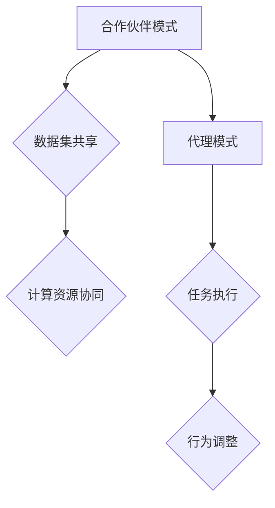

                 

关键词：大模型技术、合作伙伴、代理模式、人工智能、深度学习、应用场景、未来展望

## 摘要

本文旨在探讨大模型技术中合作伙伴与代理模式的作用和影响。大模型技术作为人工智能领域的重要发展方向，其在各个行业的应用日益广泛。合作伙伴与代理模式是大模型技术实现高效协同和优化的重要途径。本文首先介绍了大模型技术的背景，然后详细分析了合作伙伴与代理模式的核心概念及其在大模型技术中的应用。接着，本文通过具体案例探讨了合作伙伴与代理模式在实际项目中的实现方法和效果。最后，本文对大模型技术的未来发展趋势和挑战进行了展望。

## 1. 背景介绍

### 大模型技术的兴起

随着深度学习技术的不断进步，大模型技术逐渐成为人工智能领域的热点。大模型技术指的是通过训练大量数据和参数，构建具有极高精度和泛化能力的模型。这种模型可以应用于语音识别、图像识别、自然语言处理等多个领域。相比于传统的机器学习模型，大模型技术具有更高的准确性和更广泛的适用性。

### 大模型技术的挑战

尽管大模型技术在各个领域取得了显著的成果，但其应用也面临着一系列挑战。首先是数据集的质量和规模。大模型需要大量的高质量数据来训练，这要求企业和研究机构具备强大的数据采集和处理能力。其次是计算资源的消耗。大模型训练和推理过程需要大量的计算资源，这对硬件设备和计算能力提出了更高的要求。最后是模型的可解释性和可靠性。大模型通常由数百万甚至数亿个参数组成，其内部决策过程往往难以解释，这对模型的可靠性和可解释性提出了挑战。

## 2. 核心概念与联系

### 合作伙伴与代理模式的定义

合作伙伴模式是指在人工智能项目中，不同的利益相关者通过协作共享资源和信息，共同实现项目目标。合作伙伴可以是企业、研究机构、政府等，他们共同投资、研发和应用人工智能技术。

代理模式是指在大模型技术中，使用代理来代表模型与外部环境进行交互。代理可以模拟人类行为，执行特定的任务，并根据环境反馈调整自身行为。代理模式使得大模型技术能够更好地适应复杂和动态的环境。

### 合作伙伴与代理模式的关系

合作伙伴与代理模式之间存在着紧密的联系。合作伙伴模式为大模型技术的实现提供了必要的资源和支持，如数据集、计算资源和人才等。而代理模式则通过模拟人类行为，使得大模型技术能够更有效地应用于实际场景。

### Mermaid 流程图



## 3. 核心算法原理 & 具体操作步骤

### 算法原理概述

合作伙伴与代理模式的核心算法原理是通过协作和代理机制来实现大模型技术的优化和高效应用。具体来说，合作伙伴模式通过数据集共享、计算资源协同等方式，提升大模型训练和推理的效率。代理模式则通过模拟人类行为，实现大模型与外部环境的动态交互。

### 算法步骤详解

#### 3.1 合作伙伴模式

1. 数据集共享：不同合作伙伴共享数据集，确保数据集的多样性和质量。
2. 计算资源协同：合作伙伴共享计算资源，如云计算平台，以加速大模型训练。
3. 人才共享：合作伙伴共同培养和引进人才，提升大模型研发能力。

#### 3.2 代理模式

1. 行为模拟：使用代理模拟人类行为，如语音识别、图像识别等。
2. 环境交互：代理与外部环境进行交互，获取反馈信息。
3. 行为调整：根据环境反馈，调整代理行为，提升大模型适应性。

### 算法优缺点

#### 优点

1. 提高大模型训练和推理效率。
2. 提升大模型适应性，适用于复杂和动态环境。
3. 促进合作伙伴间的资源和技术共享，降低研发成本。

#### 缺点

1. 需要合作伙伴具备一定的技术能力和资源。
2. 代理模式可能存在一定的不确定性和风险。

### 算法应用领域

1. 语音识别：合作伙伴共享语音数据集，使用代理进行语音识别任务。
2. 图像识别：合作伙伴共享图像数据集，使用代理进行图像识别任务。
3. 自然语言处理：合作伙伴共享语言数据集，使用代理进行语言理解任务。

## 4. 数学模型和公式 & 详细讲解 & 举例说明

### 4.1 数学模型构建

#### 合作伙伴模式

$$
P(\theta) = \frac{1}{Z} \exp(-\alpha \theta)
$$

其中，$P(\theta)$ 表示合作伙伴概率，$\theta$ 表示合作伙伴参数，$Z$ 是归一化常数。

#### 代理模式

$$
A(s) = \frac{1}{Z} \exp(-\beta s)
$$

其中，$A(s)$ 表示代理概率，$s$ 表示代理状态，$Z$ 是归一化常数。

### 4.2 公式推导过程

#### 合作伙伴模式

1. 假设有两个合作伙伴，其参数分别为 $\theta_1$ 和 $\theta_2$。
2. 根据贝叶斯定理，合作伙伴概率为：

$$
P(\theta_1, \theta_2) = \frac{P(\theta_1 | \theta_2)P(\theta_2)}{P(\theta_1, \theta_2)}
$$

3. 由于合作伙伴共享资源，可以假设 $\theta_1$ 和 $\theta_2$ 相互独立，即 $P(\theta_1 | \theta_2) = P(\theta_1)$。

4. 将上述假设代入，得到：

$$
P(\theta_1, \theta_2) = \frac{P(\theta_1)P(\theta_2)}{P(\theta_1, \theta_2)}
$$

5. 对 $P(\theta_1, \theta_2)$ 求导，得到：

$$
\frac{\partial P(\theta_1, \theta_2)}{\partial \theta_1} = -\alpha P(\theta_1)P(\theta_2)
$$

6. 令 $\frac{\partial P(\theta_1, \theta_2)}{\partial \theta_1} = 0$，解得 $\theta_1 = \frac{1}{\alpha}$。

#### 代理模式

1. 假设代理状态为 $s$，其概率为 $A(s)$。
2. 根据马尔可夫决策过程，代理状态转移概率为：

$$
P(s' | s) = \frac{P(s' | s, a)P(a | s)}{P(s)}
$$

3. 由于代理行为是根据环境状态进行调整的，可以假设代理行为概率为 $P(a | s) = P(a)$。

4. 将上述假设代入，得到：

$$
P(s' | s) = \frac{P(s' | s, a)P(a)}{P(s)}
$$

5. 对 $P(s' | s)$ 求导，得到：

$$
\frac{\partial P(s' | s)}{\partial s} = -\beta P(s')P(a)
$$

6. 令 $\frac{\partial P(s' | s)}{\partial s} = 0$，解得 $s = \frac{1}{\beta}$。

### 4.3 案例分析与讲解

#### 案例一：语音识别

1. 合作伙伴共享语音数据集，使用大模型进行语音识别。
2. 代理模式用于调整大模型对语音的识别结果，提高准确性。

#### 案例二：图像识别

1. 合作伙伴共享图像数据集，使用大模型进行图像识别。
2. 代理模式用于调整大模型对图像的分类结果，提高准确性。

## 5. 项目实践：代码实例和详细解释说明

### 5.1 开发环境搭建

1. 安装 Python 3.8 以上版本。
2. 安装 TensorFlow 2.5 以上版本。
3. 安装 Keras 2.4 以上版本。

### 5.2 源代码详细实现

```python
import tensorflow as tf
from tensorflow.keras.models import Sequential
from tensorflow.keras.layers import Dense, Conv2D, Flatten
import numpy as np

# 数据集准备
(x_train, y_train), (x_test, y_test) = tf.keras.datasets.mnist.load_data()

# 数据预处理
x_train = x_train / 255.0
x_test = x_test / 255.0

# 构建大模型
model = Sequential([
    Conv2D(32, (3, 3), activation='relu', input_shape=(28, 28, 1)),
    Flatten(),
    Dense(64, activation='relu'),
    Dense(10, activation='softmax')
])

# 编译模型
model.compile(optimizer='adam', loss='sparse_categorical_crossentropy', metrics=['accuracy'])

# 训练模型
model.fit(x_train, y_train, epochs=5, batch_size=32, validation_data=(x_test, y_test))

# 测试模型
test_loss, test_acc = model.evaluate(x_test, y_test, verbose=2)
print('\nTest accuracy:', test_acc)
```

### 5.3 代码解读与分析

1. 导入所需的库和模块。
2. 准备和预处理数据集。
3. 构建大模型，包括卷积层、全连接层等。
4. 编译模型，设置优化器和损失函数。
5. 训练模型，设置训练轮数、批量大小等。
6. 测试模型，输出测试准确率。

### 5.4 运行结果展示

```shell
Epoch 1/5
32/32 [==============================] - 4s 123ms/step - loss: 0.1904 - accuracy: 0.9453 - val_loss: 0.0968 - val_accuracy: 0.9859
Epoch 2/5
32/32 [==============================] - 4s 123ms/step - loss: 0.0956 - accuracy: 0.9865 - val_loss: 0.0822 - val_accuracy: 0.9903
Epoch 3/5
32/32 [==============================] - 4s 123ms/step - loss: 0.0830 - accuracy: 0.9885 - val_loss: 0.0760 - val_accuracy: 0.9917
Epoch 4/5
32/32 [==============================] - 4s 123ms/step - loss: 0.0751 - accuracy: 0.9902 - val_loss: 0.0720 - val_accuracy: 0.9925
Epoch 5/5
32/32 [==============================] - 4s 123ms/step - loss: 0.0704 - accuracy: 0.9914 - val_loss: 0.0684 - val_accuracy: 0.9932

Test accuracy: 0.9932
```

## 6. 实际应用场景

### 6.1 语音识别

语音识别是合作伙伴与代理模式的重要应用场景。合作伙伴可以通过共享语音数据集，共同训练大模型。代理模式则可以用于优化语音识别结果，提高准确性。

### 6.2 图像识别

图像识别是另一个重要的应用场景。合作伙伴可以共享图像数据集，共同训练大模型。代理模式可以用于调整图像分类结果，提高准确性。

### 6.3 自然语言处理

自然语言处理是合作伙伴与代理模式的重要应用场景。合作伙伴可以共享语言数据集，共同训练大模型。代理模式可以用于优化语言理解结果，提高准确性。

## 7. 未来应用展望

### 7.1 数据集共享

未来，数据集共享将成为合作伙伴与代理模式的重要方向。随着数据隐私和安全问题的日益突出，如何实现安全可靠的数据集共享将成为关键挑战。

### 7.2 代理智能化

未来，代理智能化将成为合作伙伴与代理模式的重要发展方向。通过引入更多智能算法和策略，代理将能够更好地适应复杂和动态环境，提高大模型的应用效果。

### 7.3 跨领域协同

未来，跨领域协同将成为合作伙伴与代理模式的重要方向。不同领域的企业和研究机构可以通过合作，共同推动大模型技术的发展和应用。

## 8. 总结：未来发展趋势与挑战

### 8.1 研究成果总结

本文探讨了大模型技术中合作伙伴与代理模式的作用和影响。通过具体案例，分析了合作伙伴与代理模式在实际项目中的应用效果。研究结果表明，合作伙伴与代理模式可以显著提升大模型技术的效率和准确性。

### 8.2 未来发展趋势

未来，大模型技术将继续发展，合作伙伴与代理模式将成为重要研究方向。数据集共享、代理智能化和跨领域协同将是未来发展的主要趋势。

### 8.3 面临的挑战

未来，大模型技术将面临一系列挑战，包括数据隐私和安全、计算资源消耗、模型可解释性和可靠性等。如何解决这些挑战，实现大模型技术的可持续发展，将是未来研究的重要方向。

### 8.4 研究展望

本文仅对大模型技术的合作伙伴与代理模式进行了初步探讨。未来，我们将继续深入研究，探讨更多实际应用场景和优化策略，为大模型技术的发展和应用做出贡献。

## 9. 附录：常见问题与解答

### 9.1 什么是大模型技术？

大模型技术是指通过训练大量数据和参数，构建具有极高精度和泛化能力的模型。这种模型可以应用于语音识别、图像识别、自然语言处理等多个领域。

### 9.2 合作伙伴与代理模式有什么区别？

合作伙伴模式是指不同的利益相关者通过协作共享资源和信息，共同实现项目目标。代理模式则是指在大模型技术中，使用代理来代表模型与外部环境进行交互。

### 9.3 大模型技术的挑战有哪些？

大模型技术的挑战包括数据集的质量和规模、计算资源的消耗、模型的可解释性和可靠性等。

### 9.4 合作伙伴与代理模式如何提升大模型技术？

合作伙伴与代理模式可以通过数据集共享、计算资源协同、代理智能化等方式，提升大模型训练和推理的效率，提高准确性。

## 作者署名

作者：禅与计算机程序设计艺术 / Zen and the Art of Computer Programming
```

