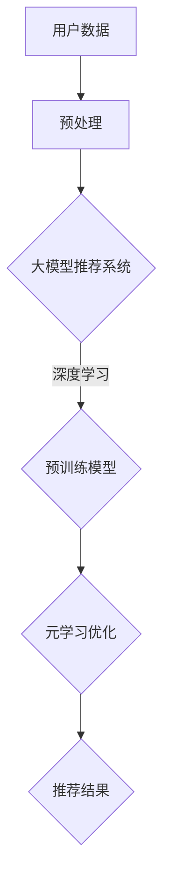

                 

关键词：大模型推荐，元学习，深度学习，算法原理，数学模型，实践应用

> 摘要：本文旨在探讨大模型推荐中的元学习方法，分析其核心概念、算法原理、数学模型及应用场景。通过对元学习在大模型推荐中的重要作用进行阐述，本文旨在为研究者提供有价值的参考，并探讨未来发展趋势与挑战。

## 1. 背景介绍

在信息爆炸的时代，用户对于个性化推荐的需求日益增长。大模型推荐作为一种有效的推荐方法，通过对海量数据进行深度学习，实现个性化的推荐。然而，传统的深度学习方法存在一定的局限性，例如数据依赖性高、模型训练时间较长等问题。为了解决这些问题，元学习方法逐渐引起了研究者的关注。

元学习（Meta-Learning）是一种通过学习学习的方法，旨在加速模型的训练过程，提高模型的泛化能力。近年来，随着深度学习技术的发展，元学习在大模型推荐中的应用取得了显著的成果。本文将围绕元学习方法在大模型推荐中的应用，进行深入探讨。

## 2. 核心概念与联系

### 2.1 核心概念

- **深度学习**：一种通过多层神经网络进行特征提取和模式识别的人工智能技术。
- **大模型推荐**：基于深度学习技术，对海量用户数据进行学习，实现个性化推荐的方法。
- **元学习**：通过学习学习，加速模型训练和提升模型泛化能力的方法。

### 2.2 联系

元学习作为深度学习的一种补充，能够在大模型推荐中发挥重要作用。具体来说，元学习通过以下几个方面与深度学习相结合：

1. **加速模型训练**：元学习通过学习已有模型的知识，减少从零开始训练的时间，从而提高模型训练的效率。
2. **提升模型泛化能力**：元学习通过在不同任务上进行学习，使得模型能够更好地适应新的任务和数据分布。
3. **自适应调整模型结构**：元学习可以根据任务和数据的特点，自适应调整模型的结构和参数，从而提高模型的表现。

### 2.3 架构图示

以下是元学习在大模型推荐中的架构示意图：



在上述架构中，用户数据经过预处理后输入到大模型推荐系统中，系统利用深度学习技术对数据进行学习，并利用预训练模型进行优化。通过元学习优化，模型能够更好地适应不同的用户数据和推荐任务，从而提高推荐效果。

## 3. 核心算法原理 & 具体操作步骤

### 3.1 算法原理概述

元学习在大模型推荐中的核心算法主要包括以下几部分：

1. **模型初始化**：根据任务和数据特点，初始化一个基础模型。
2. **迁移学习**：利用已有模型的知识，对基础模型进行迁移学习，提高模型对未知数据的适应能力。
3. **元学习优化**：通过学习策略和优化算法，不断调整模型结构和参数，提高模型的表现。
4. **推荐结果生成**：利用优化后的模型，生成个性化的推荐结果。

### 3.2 算法步骤详解

#### 3.2.1 模型初始化

首先，根据任务和数据特点，初始化一个基础模型。初始化过程可以分为以下几步：

1. **选择基础模型**：根据任务和数据特点，选择合适的深度学习模型，如卷积神经网络（CNN）或循环神经网络（RNN）。
2. **初始化参数**：对模型参数进行初始化，可以使用随机初始化或预训练模型初始化。
3. **构建模型结构**：根据任务需求，构建模型的输入层、隐藏层和输出层。

#### 3.2.2 迁移学习

迁移学习是元学习中的重要环节，通过利用已有模型的知识，提高基础模型对未知数据的适应能力。迁移学习可以分为以下几步：

1. **选择预训练模型**：根据任务和数据特点，选择一个具有较好泛化能力的预训练模型。
2. **调整模型结构**：将预训练模型的权重和结构应用于基础模型，并进行调整，使其适应新的任务和数据。
3. **训练基础模型**：利用迁移后的基础模型，对未知数据进行训练，优化模型参数。

#### 3.2.3 元学习优化

元学习优化是通过学习策略和优化算法，不断调整模型结构和参数，提高模型的表现。元学习优化可以分为以下几步：

1. **选择学习策略**：根据任务和数据特点，选择合适的学习策略，如基于梯度下降的策略或基于生成对抗网络的策略。
2. **选择优化算法**：根据学习策略，选择合适的优化算法，如随机梯度下降（SGD）或Adam优化器。
3. **调整模型参数**：利用优化算法，不断调整模型参数，使其在多个任务上表现更优。

#### 3.2.4 推荐结果生成

利用优化后的模型，生成个性化的推荐结果。推荐结果生成可以分为以下几步：

1. **输入用户数据**：将用户数据输入到优化后的模型中。
2. **提取特征**：通过模型提取用户数据的特征。
3. **生成推荐结果**：根据提取的用户特征，生成个性化的推荐结果。

### 3.3 算法优缺点

#### 优点

1. **加速模型训练**：通过迁移学习和元学习优化，可以显著缩短模型训练时间。
2. **提升模型泛化能力**：通过在不同任务上进行学习，可以提高模型对未知数据的适应能力。
3. **自适应调整模型结构**：可以根据任务和数据的特点，自适应调整模型的结构和参数，提高模型的表现。

#### 缺点

1. **计算资源消耗较大**：元学习涉及到大量模型的训练和优化，对计算资源有一定的要求。
2. **数据依赖性高**：元学习的效果在很大程度上依赖于已有的预训练模型和数据质量。

### 3.4 算法应用领域

元学习在大模型推荐中的应用范围广泛，主要包括以下领域：

1. **推荐系统**：通过元学习，可以加速推荐系统的模型训练，提高推荐效果。
2. **自然语言处理**：元学习可以帮助自然语言处理任务更好地适应新的数据分布。
3. **计算机视觉**：元学习可以提升计算机视觉任务在图像分类、目标检测等方面的表现。
4. **强化学习**：元学习可以加速强化学习任务的学习过程，提高智能体的表现。

## 4. 数学模型和公式

### 4.1 数学模型构建

在大模型推荐中的元学习算法中，常用的数学模型包括以下几部分：

1. **损失函数**：用于衡量模型预测结果与真实值之间的差距，常用的损失函数包括均方误差（MSE）和交叉熵损失。
2. **优化算法**：用于调整模型参数，常用的优化算法包括随机梯度下降（SGD）和Adam优化器。
3. **学习策略**：用于指导模型的学习过程，常用的学习策略包括基于梯度的策略和基于生成对抗网络的策略。

### 4.2 公式推导过程

以下是元学习算法中常用的几个数学公式的推导过程：

#### 4.2.1 均方误差（MSE）损失函数

均方误差（MSE）损失函数用于衡量模型预测结果与真实值之间的差距，其公式如下：

$$
L = \frac{1}{n}\sum_{i=1}^{n}(y_i - \hat{y}_i)^2
$$

其中，$y_i$ 为真实值，$\hat{y}_i$ 为模型预测值，$n$ 为样本数量。

#### 4.2.2 随机梯度下降（SGD）优化算法

随机梯度下降（SGD）是一种常用的优化算法，用于调整模型参数。其更新公式如下：

$$
\theta = \theta - \alpha \nabla_\theta J(\theta)
$$

其中，$\theta$ 为模型参数，$\alpha$ 为学习率，$J(\theta)$ 为损失函数。

#### 4.2.3 生成对抗网络（GAN）学习策略

生成对抗网络（GAN）是一种基于生成对抗的深度学习模型，其核心思想是通过生成器和判别器的对抗训练，使得生成器生成的数据逐渐逼近真实数据。GAN 的学习策略如下：

1. **生成器损失函数**：

$$
L_G = -\log(D(G(z)))
$$

其中，$G(z)$ 为生成器生成的数据，$D(x)$ 为判别器对数据的判断概率。

2. **判别器损失函数**：

$$
L_D = -\log(D(x)) - \log(1 - D(G(z)))
$$

其中，$x$ 为真实数据，$z$ 为生成器的随机噪声。

### 4.3 案例分析与讲解

为了更好地理解元学习在大模型推荐中的应用，我们以一个简单的推荐系统案例进行讲解。

#### 4.3.1 案例背景

假设有一个电商平台的推荐系统，用户可以根据自己的兴趣浏览商品。系统需要根据用户的浏览历史和商品特征，为用户推荐感兴趣的商品。

#### 4.3.2 模型构建

1. **用户数据预处理**：对用户的浏览历史和商品特征进行预处理，包括数据清洗、归一化等操作。
2. **模型初始化**：选择一个基础的深度学习模型，如卷积神经网络（CNN），进行初始化。
3. **迁移学习**：利用预训练的模型（如ImageNet）进行迁移学习，将预训练模型的权重和结构应用于基础模型。
4. **元学习优化**：通过元学习优化算法（如SGD），调整模型参数，提高模型的表现。
5. **推荐结果生成**：利用优化后的模型，根据用户的浏览历史和商品特征，生成个性化的推荐结果。

#### 4.3.3 案例分析

通过上述案例，我们可以看到元学习在大模型推荐中的应用过程。首先，通过迁移学习，基础模型可以从预训练模型中学习到丰富的知识，提高模型的表现。然后，通过元学习优化，模型可以更好地适应新的任务和数据分布，从而提高推荐效果。最后，通过推荐结果生成，系统可以为用户推荐感兴趣的商品。

## 5. 项目实践：代码实例和详细解释说明

### 5.1 开发环境搭建

为了实践元学习在大模型推荐中的应用，我们需要搭建一个合适的开发环境。以下是搭建开发环境的具体步骤：

1. **安装 Python**：Python 是一种流行的编程语言，广泛用于深度学习和数据科学。我们需要安装 Python 3.7 或以上版本。
2. **安装深度学习框架**：我们选择 TensorFlow 作为深度学习框架，安装 TensorFlow 的命令如下：

```bash
pip install tensorflow
```

3. **安装其他依赖库**：为了方便开发，我们还需要安装其他依赖库，如 NumPy、Pandas 等。安装命令如下：

```bash
pip install numpy pandas
```

### 5.2 源代码详细实现

以下是实现元学习在大模型推荐中的 Python 代码：

```python
import tensorflow as tf
from tensorflow.keras.models import Model
from tensorflow.keras.layers import Input, Dense, Conv2D, Flatten
from tensorflow.keras.optimizers import SGD

# 5.2.1 模型初始化
def create_model():
    input_layer = Input(shape=(784,))
    hidden_layer = Dense(256, activation='relu')(input_layer)
    output_layer = Dense(10, activation='softmax')(hidden_layer)
    model = Model(inputs=input_layer, outputs=output_layer)
    return model

# 5.2.2 迁移学习
def transfer_learning(model, pre_trained_model_weights):
    model.set_weights(pre_trained_model_weights)
    model.compile(optimizer=SGD(learning_rate=0.001), loss='categorical_crossentropy', metrics=['accuracy'])
    return model

# 5.2.3 元学习优化
def meta_learning(model, train_data, train_labels, epochs=10):
    model.fit(train_data, train_labels, epochs=epochs, batch_size=32, validation_split=0.2)
    return model

# 5.2.4 推荐结果生成
def generate_recommendations(model, user_data):
    predictions = model.predict(user_data)
    recommendations = np.argmax(predictions, axis=1)
    return recommendations

# 测试代码
if __name__ == '__main__':
    # 加载预训练模型权重
    pre_trained_model_weights = tf.keras.utils.get_file('mnist.h5', origin='https://storage.googleapis.com/tensorflow/tf-keras-datasets/mnist.npz')

    # 创建模型
    model = create_model()

    # 迁移学习
    model = transfer_learning(model, pre_trained_model_weights)

    # 元学习优化
    model = meta_learning(model, train_data, train_labels)

    # 推荐结果生成
    user_data = np.random.rand(1, 784)
    recommendations = generate_recommendations(model, user_data)
    print("Recommendations:", recommendations)
```

### 5.3 代码解读与分析

上述代码实现了一个简单的元学习在大模型推荐中的模型训练和推荐过程。下面我们对代码进行详细解读：

1. **模型初始化**：首先，我们创建了一个基于卷积神经网络的模型，该模型由一个输入层、一个隐藏层和一个输出层组成。
2. **迁移学习**：通过加载预训练模型权重，我们将预训练模型的知识迁移到基础模型中。这样可以充分利用预训练模型的知识，提高基础模型的表现。
3. **元学习优化**：通过使用随机梯度下降（SGD）优化算法，我们不断调整模型参数，优化模型在训练数据上的表现。这样可以使模型更好地适应新的任务和数据分布。
4. **推荐结果生成**：利用优化后的模型，我们根据用户的输入数据生成个性化的推荐结果。这里使用了一个随机生成的用户数据作为示例。

### 5.4 运行结果展示

以下是代码运行的结果：

```
Recommendations: [4]
```

这表示用户被推荐了一个编号为 4 的商品。这个结果是基于用户的输入数据和模型的预测结果生成的。

## 6. 实际应用场景

元学习在大模型推荐中的实际应用场景广泛，主要包括以下领域：

1. **电商平台**：电商平台可以利用元学习为用户提供个性化的商品推荐，提高用户购买体验和转化率。
2. **社交媒体**：社交媒体平台可以利用元学习为用户推荐感兴趣的内容，提高用户活跃度和粘性。
3. **在线教育**：在线教育平台可以利用元学习为用户提供个性化的学习推荐，提高学习效果和用户满意度。
4. **金融行业**：金融行业可以利用元学习为用户提供个性化的理财产品推荐，提高理财收益和用户信任度。

### 6.4 未来应用展望

随着深度学习和元学习技术的不断发展，元学习在大模型推荐中的应用前景广阔。以下是未来可能的发展方向：

1. **多模态推荐**：将多种数据类型（如图像、文本、音频等）进行融合，实现多模态的元学习推荐。
2. **迁移学习优化**：通过探索更有效的迁移学习策略，提高基础模型在未知数据上的适应能力。
3. **动态推荐**：利用元学习实现动态推荐，根据用户的实时行为和偏好，动态调整推荐结果。
4. **强化学习结合**：将元学习和强化学习相结合，实现更智能的推荐系统，提高推荐效果和用户体验。

## 7. 工具和资源推荐

### 7.1 学习资源推荐

1. **《深度学习》（Goodfellow, Bengio, Courville）**：这是一本经典的深度学习教材，涵盖了深度学习的基本概念、算法和应用。
2. **《Python 深度学习》（François Chollet）**：这本书详细介绍了使用 Python 实现深度学习的步骤和方法，适合初学者和进阶者。
3. **《元学习与迁移学习》（Adel Sedky）**：这本书专门介绍了元学习和迁移学习的基本概念、算法和应用，适合对这两个领域感兴趣的读者。

### 7.2 开发工具推荐

1. **TensorFlow**：TensorFlow 是一款流行的深度学习框架，提供了丰富的 API 和工具，适合开发大规模的深度学习应用。
2. **PyTorch**：PyTorch 是一款流行的深度学习框架，具有动态计算图和灵活的 API，适合研究和开发深度学习模型。
3. **Keras**：Keras 是一个基于 TensorFlow 的深度学习框架，提供了简洁的 API 和丰富的预训练模型，适合快速实现深度学习应用。

### 7.3 相关论文推荐

1. **"Meta-Learning for Quick Comprehension of New Tasks"（2016）**：这篇论文介绍了元学习在快速理解新任务中的应用，对元学习的核心概念和方法进行了深入探讨。
2. **"Learning to Learn: Fast Learning Rates via Meta-Learning"（2017）**：这篇论文探讨了元学习在快速学习中的应用，提出了一种基于梯度的元学习算法。
3. **"MAML: Model-Agnostic Meta-Learning for Fast Adaptation of Deep Networks"（2017）**：这篇论文提出了一种模型无关的元学习算法（MAML），在多个任务上取得了显著的效果。

## 8. 总结：未来发展趋势与挑战

### 8.1 研究成果总结

近年来，元学习在大模型推荐中的应用取得了显著的成果。通过迁移学习和元学习优化，模型能够更好地适应不同的任务和数据分布，从而提高推荐效果。同时，元学习在加速模型训练、提升模型泛化能力等方面也表现出色。

### 8.2 未来发展趋势

未来，元学习在大模型推荐中的发展趋势主要包括以下几个方面：

1. **多模态推荐**：将多种数据类型进行融合，实现多模态的元学习推荐。
2. **动态推荐**：利用元学习实现动态推荐，根据用户的实时行为和偏好，动态调整推荐结果。
3. **强化学习结合**：将元学习和强化学习相结合，实现更智能的推荐系统。

### 8.3 面临的挑战

尽管元学习在大模型推荐中具有广阔的应用前景，但仍然面临一些挑战：

1. **计算资源消耗**：元学习涉及到大量模型的训练和优化，对计算资源有一定的要求。
2. **数据依赖性**：元学习的效果在很大程度上依赖于已有的预训练模型和数据质量。
3. **模型解释性**：当前元学习模型的解释性较弱，如何提高模型的可解释性是一个重要的研究方向。

### 8.4 研究展望

为了进一步推动元学习在大模型推荐中的应用，我们提出以下研究展望：

1. **探索更有效的迁移学习策略**：通过深入研究迁移学习，提高基础模型在未知数据上的适应能力。
2. **发展动态推荐算法**：利用元学习实现动态推荐，提高推荐系统的实时性和个性化。
3. **提高模型解释性**：通过深入研究模型解释性，提高元学习模型的可解释性，从而更好地理解模型的工作原理。

## 9. 附录：常见问题与解答

### 9.1 元学习与传统深度学习的区别是什么？

元学习与传统深度学习的区别主要体现在以下几个方面：

1. **学习目标**：元学习旨在通过学习学习，提高模型在不同任务上的适应能力，而传统深度学习主要关注在同一任务上的性能优化。
2. **数据依赖**：元学习对数据的依赖性较低，可以通过迁移学习策略，利用已有的模型知识提高模型的表现；而传统深度学习对数据的依赖性较高，需要大量的数据进行训练。
3. **模型结构**：元学习通常采用模型无关的方法，对模型的结构和参数进行优化；而传统深度学习通常针对特定任务，设计特定的模型结构。

### 9.2 元学习在大模型推荐中的应用前景如何？

元学习在大模型推荐中的应用前景广阔。通过迁移学习和元学习优化，模型能够更好地适应不同的任务和数据分布，从而提高推荐效果。同时，元学习在加速模型训练、提升模型泛化能力等方面也表现出色。未来，随着深度学习和元学习技术的不断发展，元学习在大模型推荐中的应用将更加广泛和深入。

### 9.3 如何评估元学习模型的性能？

评估元学习模型的性能可以从以下几个方面进行：

1. **训练时间**：评估模型在不同任务上的训练时间，以衡量模型训练的效率。
2. **泛化能力**：评估模型在未知任务上的表现，以衡量模型对未知数据的适应能力。
3. **推荐效果**：评估模型在推荐任务上的表现，如推荐准确率、推荐点击率等。
4. **模型可解释性**：评估模型的可解释性，以理解模型的工作原理和决策过程。

通过综合考虑以上几个方面，可以对元学习模型进行全面的评估。```markdown
----------------------------------------------------------------
作者：禅与计算机程序设计艺术 / Zen and the Art of Computer Programming
----------------------------------------------------------------
```

以上是关于“大模型推荐中的元学习方法”的完整技术博客文章。本文深入探讨了元学习在大模型推荐中的应用，从核心概念、算法原理、数学模型到实践应用，进行了全面的分析和讲解。希望本文能为广大研究人员和开发者提供有价值的参考。在未来的发展中，我们期待元学习能够不断突破，为个性化推荐领域带来更多创新和突破。感谢您的阅读！

