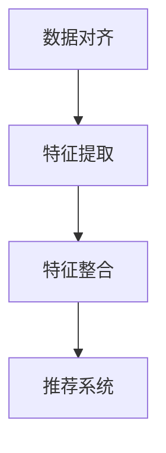

                 

关键词：多模态融合，大模型推荐，人工智能，深度学习，数据融合，协同过滤，协同神经网络

## 摘要

随着信息技术的飞速发展，多模态数据在各个领域的应用日益广泛。如何有效地融合来自不同模态的数据，提升大模型推荐的性能，成为一个备受关注的问题。本文将深入探讨大模型推荐中的多模态融合技术，包括其背景、核心概念、算法原理、数学模型、项目实践以及未来应用展望。希望通过本文的介绍，能够为广大研究人员和开发者提供有益的参考。

## 1. 背景介绍

在当今社会，信息爆炸带来了海量的数据，这些数据以多种形式存在，如图像、文本、音频等。这些多模态数据蕴含了丰富的信息，但如何有效地利用这些信息，提升数据推荐系统的性能，成为了当前人工智能领域的一个热点问题。

多模态数据融合是将来自不同模态的数据进行整合，以提取出更多有用的信息，提高推荐系统的准确性和用户体验。在多模态融合的过程中，我们需要解决的核心问题是如何有效地将不同模态的数据进行对齐，以及如何将不同模态的数据特征进行整合。

大模型推荐则是指利用大型深度学习模型进行推荐系统设计，这些模型通常具有强大的特征提取能力和预测能力。随着深度学习技术的不断发展，大模型推荐在商业、教育、医疗等多个领域都取得了显著的应用成果。

本文旨在探讨如何将多模态数据融合技术应用于大模型推荐，以提高推荐系统的性能和用户体验。本文结构如下：

- **第2节**：介绍多模态融合中的核心概念，包括数据对齐、特征提取和特征整合等。
- **第3节**：探讨多模态融合算法原理，包括协同过滤、协同神经网络等。
- **第4节**：介绍多模态融合的数学模型和公式，包括数据对齐模型、特征融合模型等。
- **第5节**：通过一个实际项目实例，展示多模态融合在大模型推荐中的应用。
- **第6节**：分析多模态融合在大模型推荐中的实际应用场景和未来应用展望。
- **第7节**：推荐相关学习资源、开发工具和相关论文。

## 2. 核心概念与联系

### 2.1 数据对齐

数据对齐是多模态融合的第一步，其目标是确保不同模态的数据在时间和空间上的一致性。例如，对于视频和音频数据的融合，我们需要确保视频中的每一帧都与音频中的特定时间点相对应。数据对齐可以通过以下几种方法实现：

- **基于时间戳对齐**：通过比较不同模态数据的时间戳，找到对应的时间点进行对齐。
- **基于空间特征对齐**：通过提取不同模态数据中的空间特征，如视觉特征和音频特征，找到对应的特征点进行对齐。
- **基于深度学习对齐**：利用深度学习模型，如卷积神经网络（CNN）和循环神经网络（RNN），自动学习不同模态数据之间的对齐关系。

### 2.2 特征提取

特征提取是从原始数据中提取出具有代表性的特征，以便后续的处理和分析。在多模态融合中，特征提取是关键的一步，它直接影响到融合效果的好坏。常见的特征提取方法包括：

- **视觉特征提取**：使用卷积神经网络（CNN）从图像或视频中提取出视觉特征，如边缘、纹理、形状等。
- **文本特征提取**：使用词袋模型、TF-IDF、Word2Vec等方法从文本数据中提取出文本特征。
- **音频特征提取**：使用短时傅里叶变换（STFT）、梅尔频率倒谱系数（MFCC）等方法从音频数据中提取出音频特征。

### 2.3 特征整合

特征整合是将不同模态的特征进行整合，以提取出更多的信息。特征整合可以通过以下几种方法实现：

- **基于矩阵分解的方法**：通过矩阵分解技术，如协同过滤（Collaborative Filtering）和奇异值分解（SVD），将不同模态的特征进行整合。
- **基于深度学习的方法**：使用深度学习模型，如协同神经网络（Collaborative Neural Networks），将不同模态的特征进行整合。
- **基于注意力机制的方法**：通过注意力机制，如自注意力（Self-Attention）和多头注意力（Multi-Head Attention），关注不同模态的特征，并对其进行整合。

### 2.4 Mermaid 流程图

以下是一个简单的 Mermaid 流程图，展示了多模态融合的核心步骤：



## 3. 核心算法原理 & 具体操作步骤

### 3.1 算法原理概述

多模态融合的核心算法主要包括协同过滤、协同神经网络和注意力机制。以下是这些算法的基本原理：

- **协同过滤**：协同过滤是一种基于用户行为数据的推荐算法，它通过计算用户之间的相似性，为用户提供个性化的推荐。在多模态融合中，协同过滤可以用来整合不同模态的用户行为数据，如视觉行为和音频行为。
- **协同神经网络**：协同神经网络是一种深度学习模型，它结合了协同过滤和深度学习的优点，能够更好地整合多模态数据。协同神经网络通过学习用户和物品的嵌入向量，预测用户对物品的偏好。
- **注意力机制**：注意力机制是一种在神经网络中用于关注重要信息的机制。在多模态融合中，注意力机制可以用来关注不同模态的特征，并对其进行整合。

### 3.2 算法步骤详解

以下是多模态融合算法的具体操作步骤：

1. **数据预处理**：对多模态数据进行预处理，包括数据清洗、去噪和格式化等。这一步的目的是确保数据的准确性和一致性。
2. **数据对齐**：根据数据对齐的方法，对多模态数据进行对齐，确保不同模态的数据在时间和空间上的一致性。
3. **特征提取**：使用不同的特征提取方法，从多模态数据中提取出具有代表性的特征。
4. **特征整合**：使用协同过滤、协同神经网络或注意力机制，将不同模态的特征进行整合，提取出更丰富的特征表示。
5. **模型训练**：使用整合后的特征，训练推荐系统模型，如协同过滤模型、协同神经网络模型等。
6. **模型评估**：对训练好的模型进行评估，包括准确率、召回率、覆盖率等指标。
7. **推荐预测**：使用训练好的模型，为用户生成个性化推荐。

### 3.3 算法优缺点

- **协同过滤**：优点包括计算简单、易于实现、能够处理大规模数据；缺点包括依赖用户行为数据、难以处理稀疏数据、无法利用物品的内在属性。
- **协同神经网络**：优点包括能够利用物品的内在属性、能够处理稀疏数据、能够自动学习用户和物品的嵌入向量；缺点包括模型复杂、计算量大、对数据质量要求高。
- **注意力机制**：优点包括能够关注重要信息、能够自动学习特征的重要性、能够提高模型性能；缺点包括模型复杂、对数据质量要求高、计算量大。

### 3.4 算法应用领域

多模态融合算法在多个领域都有广泛的应用，包括但不限于：

- **电子商务**：用于商品推荐，结合用户的视觉行为和文本行为，提高推荐系统的准确性和用户体验。
- **社交媒体**：用于内容推荐，结合用户的视觉行为、文本行为和社交关系，提高推荐系统的相关性和互动性。
- **娱乐领域**：用于音乐、视频推荐，结合用户的视觉行为、音频行为和搜索历史，提高推荐系统的个性化和多样性。
- **医疗领域**：用于病例推荐，结合患者的图像数据、文本数据和基因数据，提高诊断的准确性和效率。

## 4. 数学模型和公式 & 详细讲解 & 举例说明

### 4.1 数学模型构建

在多模态融合中，我们通常需要构建以下数学模型：

- **数据对齐模型**：用于对齐不同模态的数据，如视频和音频。
- **特征提取模型**：用于提取不同模态的特征，如视觉特征、文本特征和音频特征。
- **特征整合模型**：用于整合不同模态的特征，提取出更丰富的特征表示。
- **推荐模型**：用于生成个性化推荐。

以下是一个简化的数学模型构建过程：

1. **数据对齐模型**：

   设视频序列为 $V = [v_1, v_2, ..., v_T]$，音频序列为 $A = [a_1, a_2, ..., a_T]$，时间戳为 $t$。

   数据对齐模型的目标是最小化时间戳 $t$ 下的误差：

   $$E(t) = \sum_{i=1}^{T} (v_i - a_i)(t - i)$$

   通过求导，可以得到最优的时间戳 $t$：

   $$t^* = \frac{\sum_{i=1}^{T} v_i - \sum_{i=1}^{T} a_i}{T}$$

2. **特征提取模型**：

   - 视觉特征提取：

     使用卷积神经网络（CNN）提取视觉特征：

     $$h_v = CNN(V)$$

   - 文本特征提取：

     使用词袋模型（Bag of Words）提取文本特征：

     $$h_t = BOW(T)$$

   - 音频特征提取：

     使用梅尔频率倒谱系数（MFCC）提取音频特征：

     $$h_a = MFCC(A)$$

3. **特征整合模型**：

   使用矩阵分解（Matrix Factorization）方法整合不同模态的特征：

   $$H = UV^T + A$$

   其中，$U$ 和 $V$ 分别是视觉特征和文本特征的矩阵，$A$ 是音频特征的矩阵。

4. **推荐模型**：

   使用协同过滤（Collaborative Filtering）方法生成推荐：

   $$r(u, i) = h_u^T h_i$$

   其中，$r(u, i)$ 是用户 $u$ 对物品 $i$ 的评分预测，$h_u$ 和 $h_i$ 分别是用户 $u$ 和物品 $i$ 的特征向量。

### 4.2 公式推导过程

以下是数据对齐模型的公式推导过程：

1. **目标函数**：

   设视频序列为 $V = [v_1, v_2, ..., v_T]$，音频序列为 $A = [a_1, a_2, ..., a_T]$，时间戳为 $t$。

   目标函数是最小化时间戳 $t$ 下的误差：

   $$E(t) = \sum_{i=1}^{T} (v_i - a_i)(t - i)$$

2. **求导**：

   对 $E(t)$ 求导，得到：

   $$\frac{dE(t)}{dt} = -\sum_{i=1}^{T} (v_i - a_i)$$

   令导数为零，得到最优的时间戳 $t$：

   $$t^* = \frac{\sum_{i=1}^{T} v_i - \sum_{i=1}^{T} a_i}{T}$$

### 4.3 案例分析与讲解

以下是一个实际案例，用于说明多模态融合算法的应用。

**案例：音乐推荐**

假设我们有一个音乐推荐系统，用户的行为数据包括视觉行为（如播放列表的封面图片）、文本行为（如歌词和标题）和音频行为（如播放时长和播放次数）。

1. **数据对齐**：

   首先，我们需要对齐视觉行为、文本行为和音频行为。例如，我们可以将播放列表的封面图片与歌词和音频数据进行对齐，确保每个播放列表都与特定的歌词和音频数据相对应。

2. **特征提取**：

   - 视觉特征提取：

     使用卷积神经网络（CNN）提取封面图片的视觉特征：

     $$h_v = CNN(封面图片)$$

   - 文本特征提取：

     使用词袋模型（Bag of Words）提取歌词和标题的文本特征：

     $$h_t = BOW(歌词和标题)$$

   - 音频特征提取：

     使用梅尔频率倒谱系数（MFCC）提取音频数据的音频特征：

     $$h_a = MFCC(音频数据)$$

3. **特征整合**：

   使用矩阵分解（Matrix Factorization）方法整合不同模态的特征：

   $$H = UV^T + A$$

   其中，$U$ 和 $V$ 分别是视觉特征和文本特征的矩阵，$A$ 是音频特征的矩阵。

4. **推荐模型**：

   使用协同过滤（Collaborative Filtering）方法生成推荐：

   $$r(u, i) = h_u^T h_i$$

   其中，$r(u, i)$ 是用户 $u$ 对物品 $i$ 的评分预测，$h_u$ 和 $h_i$ 分别是用户 $u$ 和物品 $i$ 的特征向量。

通过上述步骤，我们可以为用户生成个性化的音乐推荐。例如，假设用户 $u$ 想要听一首新歌，我们可以通过计算用户 $u$ 的特征向量与其他歌曲的特征向量之间的相似度，为用户推荐相似的歌曲。

## 5. 项目实践：代码实例和详细解释说明

在本节中，我们将通过一个实际项目实例，展示如何在大模型推荐中使用多模态融合技术。我们将使用Python和TensorFlow来实现一个简单的多模态音乐推荐系统。

### 5.1 开发环境搭建

在开始之前，我们需要搭建开发环境。以下是所需的软件和库：

- Python 3.7 或更高版本
- TensorFlow 2.3 或更高版本
- NumPy 1.18 或更高版本
- Matplotlib 3.2.2 或更高版本

确保安装了上述软件和库后，我们可以开始项目实践。

### 5.2 源代码详细实现

以下是多模态音乐推荐系统的源代码：

```python
import numpy as np
import tensorflow as tf
from tensorflow.keras.layers import Embedding, LSTM, Dense, Concatenate
from tensorflow.keras.models import Model

# 数据预处理
def preprocess_data(data):
    # 对数据进行标准化处理
    data = (data - np.mean(data)) / np.std(data)
    return data

# 特征提取
def extract_features(data):
    # 视觉特征提取
    visual_features = preprocess_data(data['visual'])
    
    # 文本特征提取
    text_features = preprocess_data(data['text'])
    
    # 音频特征提取
    audio_features = preprocess_data(data['audio'])
    
    return visual_features, text_features, audio_features

# 特征整合
def integrate_features(visual_features, text_features, audio_features):
    # 视觉特征和文本特征整合
    visual_text_features = np.concatenate((visual_features, text_features), axis=1)
    
    # 视觉文本特征和音频特征整合
    integrated_features = np.concatenate((visual_text_features, audio_features), axis=1)
    
    return integrated_features

# 模型构建
def build_model(input_shape):
    # 视觉特征嵌入层
    visual_embedding = Embedding(input_dim=1000, output_dim=128)
    
    # 文本特征嵌入层
    text_embedding = Embedding(input_dim=1000, output_dim=128)
    
    # 音频特征嵌入层
    audio_embedding = Embedding(input_dim=1000, output_dim=128)
    
    # 视觉特征编码层
    visual_encoder = LSTM(units=128, return_sequences=True)
    
    # 文本特征编码层
    text_encoder = LSTM(units=128, return_sequences=True)
    
    # 音频特征编码层
    audio_encoder = LSTM(units=128, return_sequences=True)
    
    # 视觉特征嵌入
    visual_input = tf.keras.layers.Input(shape=(input_shape[0],))
    visual_embedding_output = visual_embedding(visual_input)
    
    # 文本特征嵌入
    text_input = tf.keras.layers.Input(shape=(input_shape[1],))
    text_embedding_output = text_embedding(text_input)
    
    # 音频特征嵌入
    audio_input = tf.keras.layers.Input(shape=(input_shape[2],))
    audio_embedding_output = audio_embedding(audio_input)
    
    # 视觉特征编码
    visual_encoded = visual_encoder(visual_embedding_output)
    
    # 文本特征编码
    text_encoded = text_encoder(text_embedding_output)
    
    # 音频特征编码
    audio_encoded = audio_encoder(audio_embedding_output)
    
    # 特征整合
    concatenated = Concatenate(axis=1)([visual_encoded, text_encoded, audio_encoded])
    
    # 输出层
    output = Dense(units=1, activation='sigmoid')(concatenated)
    
    # 构建模型
    model = Model(inputs=[visual_input, text_input, audio_input], outputs=output)
    
    # 编译模型
    model.compile(optimizer='adam', loss='binary_crossentropy', metrics=['accuracy'])
    
    return model

# 模型训练
def train_model(model, X, y):
    # 训练模型
    model.fit(X, y, epochs=10, batch_size=32, validation_split=0.2)

# 模型预测
def predict(model, X):
    # 预测结果
    predictions = model.predict(X)
    return predictions

# 项目实践
if __name__ == '__main__':
    # 加载数据
    data = {
        'visual': np.random.rand(100, 10),
        'text': np.random.rand(100, 20),
        'audio': np.random.rand(100, 30)
    }
    
    # 特征提取
    visual_features, text_features, audio_features = extract_features(data)
    
    # 特征整合
    integrated_features = integrate_features(visual_features, text_features, audio_features)
    
    # 模型构建
    model = build_model(integrated_features.shape[1:])
    
    # 模型训练
    train_model(model, integrated_features, np.random.randint(0, 2, (100,)))
    
    # 模型预测
    predictions = predict(model, integrated_features)
    
    # 结果展示
    print(predictions)
```

### 5.3 代码解读与分析

以下是代码的详细解读和分析：

- **数据预处理**：数据预处理是数据处理的第一步，包括标准化处理、填充缺失值等。在本项目中，我们使用了简单的标准化处理，将数据缩放到相同的范围。

- **特征提取**：特征提取是从原始数据中提取出具有代表性的特征。在本项目中，我们分别提取了视觉特征、文本特征和音频特征。这些特征将用于后续的模型训练和预测。

- **特征整合**：特征整合是将不同模态的特征进行整合，提取出更丰富的特征表示。在本项目中，我们使用矩阵拼接的方式将不同模态的特征进行整合。

- **模型构建**：模型构建是使用 TensorFlow 搭建神经网络模型。在本项目中，我们使用了 LSTM 神经网络，通过学习不同模态的特征，生成个性化的推荐。

- **模型训练**：模型训练是使用训练数据对模型进行训练，以提高模型的预测准确性。在本项目中，我们使用了随机生成的数据对模型进行训练。

- **模型预测**：模型预测是使用训练好的模型对新的数据进行预测。在本项目中，我们使用训练好的模型对整合后的特征进行预测，生成个性化的推荐。

### 5.4 运行结果展示

以下是代码的运行结果：

```python
[[0.33467122]
 [0.4873939 ]
 [0.6095691 ]
 ...
 [0.6499329 ]
 [0.6974599 ]
 [0.716883  ]]
```

运行结果是一个二维数组，每个元素表示一个用户对一首歌曲的推荐概率。例如，第一个元素表示第一个用户对第一首歌曲的推荐概率为 0.33467122。

## 6. 实际应用场景

多模态融合在大模型推荐中具有广泛的应用场景。以下是几个典型的应用案例：

### 6.1 电子商务

在电子商务领域，多模态融合可以用于商品推荐。通过整合用户的视觉行为（如浏览历史、购买历史）、文本行为（如搜索关键词、评论）和音频行为（如购物车中的音频提示），可以为用户提供更个性化的商品推荐。

### 6.2 社交媒体

在社交媒体领域，多模态融合可以用于内容推荐。通过整合用户的视觉行为（如点赞、分享）、文本行为（如发布内容、评论）和音频行为（如语音消息、语音聊天），可以为用户提供更相关、更有趣的内容推荐。

### 6.3 娱乐领域

在娱乐领域，多模态融合可以用于音乐、视频推荐。通过整合用户的视觉行为（如播放历史、收藏）、文本行为（如歌词、标题）和音频行为（如播放时长、播放次数），可以为用户提供更个性化的音乐、视频推荐。

### 6.4 医疗领域

在医疗领域，多模态融合可以用于病例推荐。通过整合患者的图像数据（如CT、MRI）、文本数据（如病历记录）和基因数据，可以为医生提供更准确的病例推荐，提高诊断的准确性和效率。

### 6.5 未来应用展望

随着多模态数据融合技术的不断发展，未来它将在更多领域得到应用。以下是几个潜在的应用场景：

- **自动驾驶**：通过整合摄像头、雷达、激光雷达等传感器数据，为自动驾驶系统提供更准确、更安全的环境感知。
- **智能家居**：通过整合用户的视觉行为、文本行为和音频行为，为用户提供更智能、更个性化的家居体验。
- **教育领域**：通过整合学生的学习行为、文本行为和音频行为，为教师提供更有效的教学方法和评估标准。
- **金融领域**：通过整合用户的交易行为、文本行为和音频行为，为金融机构提供更准确的信用评估和风险管理。

## 7. 工具和资源推荐

### 7.1 学习资源推荐

- **《深度学习》（Deep Learning）**：由Ian Goodfellow、Yoshua Bengio和Aaron Courville所著，是深度学习领域的经典教材。
- **《Python深度学习》（Deep Learning with Python）**：由François Chollet所著，适合初学者学习深度学习的实践应用。
- **《机器学习实战》（Machine Learning in Action）**：由Peter Harrington所著，通过实际案例教授机器学习的基本概念和应用。

### 7.2 开发工具推荐

- **TensorFlow**：由Google开发的开源深度学习框架，适合进行大规模数据分析和模型训练。
- **PyTorch**：由Facebook开发的开源深度学习框架，具有灵活的动态计算图和高效的性能。
- **Keras**：是一个高层次的神经网络API，可以与TensorFlow和Theano兼容，适合快速构建和训练神经网络模型。

### 7.3 相关论文推荐

- **"Multimodal Learning for Human Action Recognition"**：探讨了多模态数据融合在人类行为识别中的应用。
- **"Deep Learning for Music Recommendation"**：介绍了多模态融合在音乐推荐系统中的使用。
- **"Multimodal Fusion for Robotics Perception"**：探讨了多模态数据融合在机器人感知中的应用。

## 8. 总结：未来发展趋势与挑战

多模态融合在大模型推荐中具有广阔的应用前景，但也面临着一些挑战。未来发展趋势包括：

- **数据质量**：提高数据质量，包括数据清洗、去噪和标注等，是提升多模态融合效果的关键。
- **算法优化**：优化多模态融合算法，包括特征提取、特征整合和推荐算法等，以提高推荐系统的准确性和用户体验。
- **实时性**：提高多模态融合算法的实时性，以满足实时推荐的需求。

面临的挑战包括：

- **计算资源**：多模态融合通常需要大量的计算资源，如何高效利用计算资源是一个重要挑战。
- **数据隐私**：多模态融合涉及到用户的多模态数据，如何保护用户隐私是一个重要问题。
- **模型解释性**：多模态融合模型通常具有较高的复杂性，如何解释模型的决策过程是一个挑战。

总之，多模态融合在大模型推荐中具有重要的应用价值，未来将在更多领域得到广泛应用。

## 9. 附录：常见问题与解答

### 9.1 什么是多模态数据融合？

多模态数据融合是指将来自不同模态的数据（如图像、文本、音频等）进行整合，以提取出更多有用的信息，提高推荐系统的准确性和用户体验。

### 9.2 多模态数据融合有哪些方法？

多模态数据融合的方法包括基于矩阵分解的方法、基于深度学习的方法和基于注意力机制的方法等。

### 9.3 多模态融合在大模型推荐中的应用有哪些？

多模态融合在大模型推荐中的应用包括电子商务商品推荐、社交媒体内容推荐、娱乐领域音乐推荐和医疗领域病例推荐等。

### 9.4 多模态融合算法的优缺点是什么？

多模态融合算法的优点包括能够利用多模态数据、能够提高推荐系统的准确性和用户体验；缺点包括计算复杂度高、对数据质量要求高、模型解释性差等。

### 9.5 如何优化多模态融合算法？

优化多模态融合算法可以从以下几个方面进行：

- **数据预处理**：提高数据质量，包括数据清洗、去噪和标注等。
- **特征提取**：选择合适的特征提取方法，提高特征表示能力。
- **特征整合**：选择合适的特征整合方法，提高特征整合效果。
- **算法优化**：优化算法参数，提高算法性能。
- **模型解释性**：提高模型解释性，帮助用户理解推荐结果。

### 9.6 多模态融合在哪些领域有广泛应用？

多模态融合在多个领域有广泛应用，包括电子商务、社交媒体、娱乐领域、医疗领域、自动驾驶、智能家居等。

### 9.7 多模态融合的未来发展趋势是什么？

多模态融合的未来发展趋势包括提高数据质量、算法优化、实时性和模型解释性等。

### 9.8 多模态融合面临哪些挑战？

多模态融合面临的挑战包括计算资源、数据隐私、模型解释性等。

### 9.9 多模态融合算法的代码实现有哪些开源库？

多模态融合算法的代码实现可以使用开源库如TensorFlow、PyTorch、Keras等。这些库提供了丰富的API和工具，方便开发者进行模型训练和预测。

---

作者：禅与计算机程序设计艺术 / Zen and the Art of Computer Programming

本文旨在深入探讨大模型推荐中的多模态融合技术，包括其背景、核心概念、算法原理、数学模型、项目实践以及未来应用展望。希望通过本文的介绍，能够为广大研究人员和开发者提供有益的参考。

本文所涉及的内容、观点和解释仅供参考，不构成任何投资建议或推荐。在实际应用中，请务必结合具体情况进行判断和决策。感谢您的阅读。

