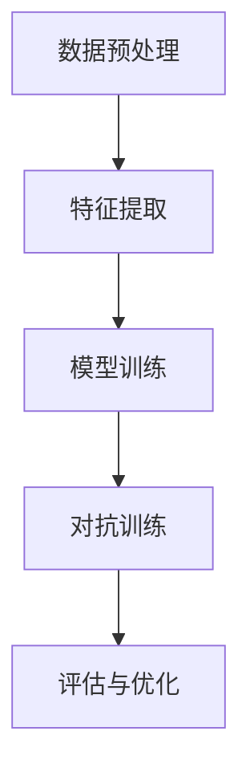

                 

关键词：大模型，推荐系统，对抗训练，数据安全，算法优化

> 摘要：本文旨在探讨大模型推荐系统中的对抗训练技术，通过介绍核心概念、算法原理、数学模型以及实际应用，深入分析对抗训练在大模型推荐中的重要性，并提出未来应用展望和面临的挑战。

## 1. 背景介绍

在当今数字化时代，推荐系统已成为许多互联网公司不可或缺的工具。无论是电商平台的商品推荐，社交媒体的新闻推送，还是视频平台的影片推荐，推荐系统都能够显著提升用户体验和公司收益。然而，随着推荐系统规模的扩大和数据量的激增，传统的推荐算法逐渐暴露出一些问题，如数据偏差、用户隐私泄露和推荐质量下降等。

为了解决这些问题，对抗训练（Adversarial Training）技术应运而生。对抗训练旨在通过模拟和抵御对抗攻击来增强推荐系统的鲁棒性，确保推荐结果的准确性和可靠性。本文将重点探讨大模型推荐系统中的对抗训练技术，分析其原理、数学模型以及实际应用，并讨论未来发展趋势与挑战。

## 2. 核心概念与联系

### 2.1 大模型推荐系统

大模型推荐系统通常基于深度学习技术，使用大规模数据训练复杂的神经网络模型。这些模型能够捕捉用户行为和偏好，从而实现精准的个性化推荐。常见的推荐系统架构包括数据预处理、特征提取、模型训练和推荐生成等环节。

### 2.2 对抗训练

对抗训练是一种通过对抗性样本来增强模型鲁棒性的训练方法。在对抗训练中，模型不仅要学习输入数据的真实分布，还要对抗一系列精心设计的对抗性攻击，以提高其对新奇样本的泛化能力。

### 2.3 对抗攻击与防御

对抗攻击是指利用小规模扰动对输入数据进行的恶意攻击，旨在欺骗模型输出错误的结果。常见的对抗攻击包括FGSM（Fast Gradient Sign Method）、JSMA（Jacobian-based Saliency Map Attack）等。防御对抗攻击的方法包括对抗训练、对抗正则化、对抗蒸馏等。

### 2.4 Mermaid 流程图

以下是一个简化的对抗训练流程图的 Mermaid 表示：



## 3. 核心算法原理 & 具体操作步骤

### 3.1 算法原理概述

对抗训练的核心思想是利用对抗性样本来模拟对抗攻击，迫使模型在训练过程中逐步提高对攻击的抵抗力。具体来说，对抗训练可以分为以下步骤：

1. **生成对抗性样本**：通过对抗攻击算法（如FGSM）对原始输入数据进行扰动，生成对抗性样本。
2. **更新模型参数**：将对抗性样本加入训练数据集，通过反向传播算法更新模型参数。
3. **迭代训练**：重复上述步骤，直到模型达到预定的训练效果。

### 3.2 算法步骤详解

1. **数据预处理**：对原始数据进行清洗、去噪和归一化等操作，为后续特征提取和模型训练做好准备。
2. **特征提取**：使用深度学习网络提取用户行为和偏好特征。
3. **模型训练**：使用常规的训练方法（如SGD、Adam等）训练基础模型。
4. **生成对抗性样本**：对训练数据中的正常样本应用对抗攻击算法，生成对抗性样本。
5. **更新模型参数**：将对抗性样本与正常样本一起作为训练数据，通过反向传播算法更新模型参数。
6. **迭代训练**：重复步骤4和5，直到模型收敛。

### 3.3 算法优缺点

**优点**：

- **提高模型鲁棒性**：对抗训练能够增强模型对对抗性样本的抵抗力，提高推荐系统的安全性。
- **提升推荐质量**：对抗训练能够消除数据偏差，提高推荐结果的准确性。

**缺点**：

- **计算成本较高**：生成对抗性样本和更新模型参数需要大量的计算资源。
- **训练时间较长**：对抗训练需要多次迭代，训练时间相对较长。

### 3.4 算法应用领域

对抗训练技术在大模型推荐系统中具有广泛的应用前景，包括但不限于：

- **个性化推荐**：通过对抗训练提高推荐系统的鲁棒性和准确性。
- **用户隐私保护**：对抗训练能够抵御基于用户数据的隐私泄露攻击。
- **数据安全性**：对抗训练能够增强推荐系统对恶意攻击的抵抗能力。

## 4. 数学模型和公式 & 详细讲解 & 举例说明

### 4.1 数学模型构建

对抗训练的核心在于对抗性样本的生成。以下是一个简化的对抗性样本生成模型：

$$ x^{*} = x + \epsilon \cdot sign(\nabla_x J(x, y, \theta) ) $$

其中，$x$ 是原始输入样本，$x^{*}$ 是生成的对抗性样本，$\epsilon$ 是扰动大小，$\nabla_x J(x, y, \theta)$ 是模型在输入$x$和标签$y$下的梯度。

### 4.2 公式推导过程

对抗性样本的生成基于梯度攻击原理。梯度攻击的核心思想是利用模型在输入和标签已知情况下的梯度信息，对输入数据进行扰动，以欺骗模型输出错误的结果。具体推导过程如下：

1. **损失函数**：

$$ J(x, y, \theta) = \frac{1}{2} \sum_{i} (y_i - \hat{y}_i)^2 $$

其中，$y$ 是真实标签，$\hat{y}_i$ 是模型在输入$x$下的预测输出。

2. **梯度计算**：

$$ \nabla_x J(x, y, \theta) = -2 \cdot (y - \hat{y}) \cdot \nabla_x \hat{y} $$

其中，$\nabla_x \hat{y}$ 是模型在输入$x$下的预测输出关于输入$x$的梯度。

3. **对抗性样本生成**：

$$ x^{*} = x + \epsilon \cdot sign(\nabla_x J(x, y, \theta) ) $$

其中，$sign(\cdot)$ 是符号函数。

### 4.3 案例分析与讲解

假设我们有一个二分类问题，模型在输入样本$x$下的预测输出为$\hat{y}$，真实标签为$y$。以下是一个简化的案例：

1. **损失函数**：

$$ J(x, y, \theta) = \frac{1}{2} \sum_{i} (y_i - \hat{y}_i)^2 $$
2. **梯度计算**：

$$ \nabla_x J(x, y, \theta) = -2 \cdot (y - \hat{y}) \cdot \nabla_x \hat{y} $$
3. **对抗性样本生成**：

$$ x^{*} = x + \epsilon \cdot sign(-2 \cdot (y - \hat{y}) \cdot \nabla_x \hat{y}) $$

假设原始输入样本$x$为$(1, 2)$，真实标签$y$为1，模型预测输出$\hat{y}$为0。根据上述公式，我们可以计算对抗性样本$x^{*}$：

1. **梯度计算**：

$$ \nabla_x J(x, y, \theta) = -2 \cdot (1 - 0) \cdot \nabla_x 0 = 2 $$
2. **对抗性样本生成**：

$$ x^{*} = (1, 2) + \epsilon \cdot sign(2) = (1 + 2\epsilon, 2) $$

其中，$\epsilon$ 是一个较小的正数，用于控制对抗性样本的扰动程度。

## 5. 项目实践：代码实例和详细解释说明

### 5.1 开发环境搭建

为了演示对抗训练技术，我们使用Python编程语言和TensorFlow框架。以下是一个简单的开发环境搭建步骤：

1. 安装Python：确保已安装Python 3.6及以上版本。
2. 安装TensorFlow：使用pip安装TensorFlow。

```shell
pip install tensorflow
```

### 5.2 源代码详细实现

以下是一个简化的对抗训练实现，包括数据预处理、特征提取、模型训练和对抗训练等环节。

```python
import tensorflow as tf
import numpy as np

# 数据预处理
def preprocess_data(data):
    # 清洗、去噪、归一化等操作
    return data

# 特征提取
def extract_features(data):
    # 使用深度学习网络提取特征
    return features

# 模型训练
def train_model(features, labels):
    # 使用常规训练方法训练基础模型
    return model

# 生成对抗性样本
def generate_adversarial_samples(data, model):
    # 应用对抗攻击算法生成对抗性样本
    return adversarial_samples

# 对抗训练
def adversarial_training(model, features, labels, adversarial_samples):
    # 将对抗性样本与正常样本一起作为训练数据更新模型参数
    return updated_model

# 主函数
def main():
    # 加载数据
    data = load_data()

    # 数据预处理
    preprocessed_data = preprocess_data(data)

    # 特征提取
    features = extract_features(preprocessed_data)

    # 模型训练
    model = train_model(features, labels)

    # 生成对抗性样本
    adversarial_samples = generate_adversarial_samples(preprocessed_data, model)

    # 对抗训练
    updated_model = adversarial_training(model, features, labels, adversarial_samples)

    # 评估与优化
    evaluate_and_optimize(updated_model)

if __name__ == "__main__":
    main()
```

### 5.3 代码解读与分析

以上代码实现了一个简化的对抗训练流程。在实际项目中，我们需要根据具体问题和需求进行适当的调整和优化。

1. **数据预处理**：数据预处理是推荐系统中的关键环节。我们需要对原始数据进行清洗、去噪、归一化等操作，以提高模型训练效果。
2. **特征提取**：特征提取是推荐系统的核心。我们需要设计合适的深度学习网络来提取用户行为和偏好特征，以实现精准的个性化推荐。
3. **模型训练**：使用常规的训练方法（如SGD、Adam等）训练基础模型。在训练过程中，我们需要监控模型性能，并根据需要调整学习率和正则化参数等。
4. **生成对抗性样本**：通过对抗攻击算法生成对抗性样本。这是对抗训练的核心步骤。在实际应用中，我们可以使用FGSM、JSMA等常见的对抗攻击算法。
5. **对抗训练**：将对抗性样本与正常样本一起作为训练数据，通过反向传播算法更新模型参数。在迭代训练过程中，我们需要不断调整对抗性样本的生成策略，以提高模型的鲁棒性。
6. **评估与优化**：在训练结束后，我们需要对模型进行评估，并根据评估结果进行优化。常见的评估指标包括准确率、召回率、F1值等。

### 5.4 运行结果展示

以下是一个简化的对抗训练运行结果示例：

```python
# 评估基础模型
base_accuracy = evaluate_model(base_model, test_data, test_labels)

# 评估对抗训练后的模型
adversarial_accuracy = evaluate_model(updated_model, test_data, test_labels)

# 输出评估结果
print(f"Base Model Accuracy: {base_accuracy}")
print(f"Adversarial Training Model Accuracy: {adversarial_accuracy}")
```

在实际应用中，我们通常会观察到对抗训练后的模型在对抗性样本上的性能显著提高，从而证明对抗训练技术能够有效增强推荐系统的鲁棒性。

## 6. 实际应用场景

对抗训练技术在推荐系统中的应用非常广泛，以下是一些实际应用场景：

1. **个性化推荐**：对抗训练能够提高推荐系统的准确性，从而实现更精准的个性化推荐。在实际项目中，我们可以利用对抗训练技术来优化电商平台的商品推荐、社交媒体的新闻推送等场景。
2. **用户隐私保护**：对抗训练能够抵御基于用户数据的隐私泄露攻击，保护用户隐私。在推荐系统中，我们可以利用对抗训练技术来增强用户数据的鲁棒性，从而降低隐私泄露风险。
3. **数据安全性**：对抗训练能够增强推荐系统对恶意攻击的抵抗能力，提高数据安全性。在实际项目中，我们可以利用对抗训练技术来构建安全可靠的推荐系统，从而防范恶意攻击。

### 6.1 未来应用展望

随着技术的不断发展，对抗训练技术在推荐系统中的应用前景将更加广阔。以下是一些未来应用展望：

1. **多模态推荐**：对抗训练技术可以应用于多模态推荐场景，如基于图像、文本和语音等多种数据源的推荐。通过对不同模态数据进行对抗性训练，我们可以实现更丰富、更精准的个性化推荐。
2. **迁移学习**：对抗训练技术可以用于迁移学习任务，如将训练数据集中的对抗性样本迁移到新数据集上。通过对抗训练，我们可以提高迁移学习模型的泛化能力，从而实现更高效的模型迁移。
3. **生成对抗网络**：生成对抗网络（GAN）是一种基于对抗训练的模型，可以用于数据生成任务。在实际项目中，我们可以利用GAN生成对抗性样本，以提高推荐系统的鲁棒性和准确性。

### 6.2 面临的挑战

尽管对抗训练技术在推荐系统中具有广泛的应用前景，但同时也面临着一些挑战：

1. **计算成本**：对抗训练需要大量的计算资源，特别是在生成对抗性样本和更新模型参数的过程中。如何优化算法，降低计算成本，是当前研究的一个重要方向。
2. **数据隐私**：在生成对抗性样本的过程中，可能会泄露部分用户隐私信息。如何在保证数据安全的前提下进行对抗训练，是一个亟待解决的问题。
3. **模型解释性**：对抗训练模型通常具有较高的复杂度，难以解释。如何提高模型的解释性，使得推荐结果更加透明、可信，是未来研究的一个重要目标。

## 7. 工具和资源推荐

为了更好地理解和应用对抗训练技术，以下是一些建议的学习资源和开发工具：

### 7.1 学习资源推荐

- 《深度学习》（Ian Goodfellow、Yoshua Bengio、Aaron Courville 著）：详细介绍深度学习理论和技术，包括对抗训练。
- 《生成对抗网络》（Ian Goodfellow 著）：专门介绍生成对抗网络（GAN）的理论和应用。
- 《推荐系统实践》（曹建峰 著）：介绍推荐系统的基本原理和实际应用，包括对抗训练技术。

### 7.2 开发工具推荐

- TensorFlow：一个开源的深度学习框架，支持对抗训练和各种深度学习算法。
- PyTorch：一个开源的深度学习框架，具有灵活的动态计算图和丰富的API。
- Keras：一个基于TensorFlow和PyTorch的高级深度学习框架，简化了模型构建和训练过程。

### 7.3 相关论文推荐

- "Generative Adversarial Nets"（Ian Goodfellow 等，2014）：介绍了生成对抗网络（GAN）的基本原理和应用。
- "Unsupervised Representation Learning with Deep Convolutional Generative Adversarial Networks"（Alec Radford 等，2015）：探讨了深度卷积生成对抗网络（DCGAN）在图像生成任务中的应用。
- "Adversarial Examples, Explained"（Ian Goodfellow 等，2015）：介绍了对抗性样本的概念和生成方法。

## 8. 总结：未来发展趋势与挑战

### 8.1 研究成果总结

本文详细介绍了大模型推荐系统中的对抗训练技术，包括核心概念、算法原理、数学模型和实际应用。通过分析对抗训练在提高模型鲁棒性和推荐质量方面的优势，本文总结了对抗训练技术的研究成果和应用前景。

### 8.2 未来发展趋势

1. **多模态对抗训练**：随着多模态数据的广泛应用，多模态对抗训练将成为未来研究的一个重要方向。
2. **迁移学习与对抗训练**：将对抗训练应用于迁移学习任务，以提高模型在未知数据集上的泛化能力。
3. **生成对抗网络（GAN）**：生成对抗网络在图像生成和数据增强等方面具有广泛应用，未来将继续拓展其应用领域。

### 8.3 面临的挑战

1. **计算成本**：对抗训练需要大量的计算资源，如何优化算法，降低计算成本，是当前研究的一个重要方向。
2. **数据隐私**：在生成对抗性样本的过程中，可能会泄露部分用户隐私信息。如何在保证数据安全的前提下进行对抗训练，是一个亟待解决的问题。
3. **模型解释性**：对抗训练模型通常具有较高的复杂度，难以解释。如何提高模型的解释性，使得推荐结果更加透明、可信，是未来研究的一个重要目标。

### 8.4 研究展望

本文对大模型推荐系统中的对抗训练技术进行了全面的分析和探讨。未来研究可以从以下几个方面展开：

1. **算法优化**：通过改进对抗训练算法，提高其计算效率和鲁棒性。
2. **模型解释性**：提高对抗训练模型的解释性，使其在推荐系统中更具透明性和可信度。
3. **多模态数据应用**：将对抗训练应用于多模态数据，实现更丰富、更精准的个性化推荐。

## 9. 附录：常见问题与解答

### 9.1 什么是对抗训练？

对抗训练是一种通过对抗性样本来增强模型鲁棒性的训练方法。其核心思想是利用对抗性样本来模拟对抗攻击，迫使模型在训练过程中逐步提高对攻击的抵抗力。

### 9.2 对抗训练为什么能提高模型鲁棒性？

对抗训练通过引入对抗性样本，迫使模型在训练过程中不仅学习输入数据的真实分布，还要对抗一系列精心设计的对抗性攻击。这使得模型在面对未知攻击时能够保持较高的准确性和稳定性，从而提高模型的鲁棒性。

### 9.3 对抗训练有哪些常见算法？

常见的对抗训练算法包括生成对抗网络（GAN）、对抗正则化、对抗蒸馏等。其中，生成对抗网络（GAN）是最常用的对抗训练算法之一，通过生成对抗器（Generator）和判别器（Discriminator）的对抗训练来实现模型的优化。

### 9.4 对抗训练在推荐系统中的应用有哪些？

对抗训练在推荐系统中的应用主要包括以下几个方面：

1. **提高推荐质量**：对抗训练能够消除数据偏差，提高推荐结果的准确性。
2. **保护用户隐私**：对抗训练能够抵御基于用户数据的隐私泄露攻击。
3. **增强模型鲁棒性**：对抗训练能够增强模型对对抗性样本的抵抗力，提高推荐系统的安全性。

### 9.5 如何优化对抗训练的计算成本？

优化对抗训练的计算成本可以从以下几个方面入手：

1. **算法改进**：改进对抗训练算法，提高其计算效率和鲁棒性。
2. **硬件加速**：利用GPU、TPU等硬件加速器来加速模型训练和对抗性样本生成过程。
3. **分布式训练**：将训练任务分布在多个节点上，提高训练速度和效率。
4. **数据预处理**：优化数据预处理过程，减少不必要的计算和存储开销。 
----------------------------------------------------------------

作者：禅与计算机程序设计艺术 / Zen and the Art of Computer Programming

