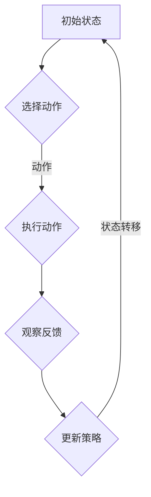

                 

关键词：大模型推荐、强化学习、算法原理、数学模型、项目实践

## 摘要

本文主要探讨了在大模型推荐领域应用强化学习方法的理论与实践。首先，我们回顾了强化学习的基本概念和原理，随后深入分析了大模型推荐中的强化学习方法的核心算法及其运作机制。接着，我们详细阐述了强化学习在大模型推荐中的具体应用步骤，并通过一个实例来说明数学模型和公式的运用。最后，本文列举了强化学习在大模型推荐中的实际应用场景，并对其未来发展趋势与面临的挑战进行了展望。

## 1. 背景介绍

在当今的信息时代，个性化推荐系统已经成为人们获取信息的重要方式。无论是电商平台的商品推荐，还是社交媒体上的内容推送，个性化推荐系统都在不断优化用户体验，提高信息的有效性和吸引力。然而，随着数据量的激增和用户需求的多样化，传统的推荐算法面临着巨大的挑战。

传统的推荐算法主要基于协同过滤、矩阵分解、聚类等方法，这些算法在处理小规模数据时效果较好，但面对大规模数据集时，计算效率和准确性都受到限制。此外，传统方法难以应对动态变化的用户行为和复杂的多模态信息。

强化学习作为一种具有自主决策和自适应能力的机器学习技术，近年来在推荐系统领域得到了广泛关注。强化学习通过模仿人类的学习过程，在探索和利用之间找到平衡，能够更好地适应动态环境，提高推荐系统的效果。

本文旨在探讨强化学习在大模型推荐中的应用，分析其核心算法原理，并给出实际应用场景和未来发展趋势。

## 2. 核心概念与联系

### 2.1 强化学习的定义

强化学习（Reinforcement Learning，RL）是机器学习的一个分支，主要研究如何通过试错（trial-and-error）的方式在环境中进行学习，以实现最优策略的制定。强化学习系统通常由代理（agent）、环境（environment）、状态（state）、动作（action）和奖励（reward）等组成。

- **代理**：执行决策的实体，我们的推荐系统。
- **环境**：代理执行动作的场所，例如用户行为的数据流。
- **状态**：代理当前所处的情境，如用户的浏览历史、兴趣偏好。
- **动作**：代理可执行的行为，如推荐商品或内容。
- **奖励**：代理执行动作后从环境中获得的反馈，用于指导学习过程。

### 2.2 强化学习的原理

强化学习的基本原理是最大化累积奖励。代理通过不断试错，从初始状态开始，执行一系列动作，根据动作的结果（奖励）调整策略，最终找到最优策略。

强化学习过程可以分为以下几个步骤：

1. **初始化**：设置初始状态。
2. **执行动作**：代理根据当前状态选择一个动作。
3. **观察反馈**：环境根据代理的动作给出反馈（奖励）。
4. **更新策略**：代理根据奖励信息调整策略。
5. **状态转移**：代理进入新的状态，重复上述过程。

### 2.3 大模型推荐与强化学习的联系

大模型推荐系统通常需要处理海量的用户数据和多维度的特征信息，传统推荐算法难以满足这种需求。而强化学习通过其自学习能力，能够在复杂的动态环境中实现高效的推荐。

强化学习在大模型推荐中的应用主要体现在以下几个方面：

1. **个性化推荐**：强化学习能够根据用户的历史行为和实时反馈，动态调整推荐策略，提高推荐内容的个性化程度。
2. **多模态融合**：强化学习可以处理来自不同来源的信息，如文本、图像、语音等，实现多模态数据的融合推荐。
3. **探索-利用平衡**：在大量用户数据的基础上，强化学习可以在探索新内容（提高多样性）和利用已有信息（提高准确性）之间找到平衡。
4. **长时依赖学习**：强化学习能够捕捉用户行为的长时依赖关系，更好地理解用户的长期兴趣和需求。

为了更好地理解强化学习在大模型推荐中的运作机制，我们使用Mermaid流程图展示其核心原理和架构。



### 2.4 强化学习算法的基本架构

强化学习算法的基本架构可以分为以下几个部分：

1. **策略（Policy）**：描述了代理在不同状态下的动作选择。策略可以是固定的，也可以是学习的。
2. **价值函数（Value Function）**：评估代理在不同状态下的预期收益，用于指导策略的调整。价值函数可以分为状态价值函数（State Value Function）和动作价值函数（Action Value Function）。
3. **模型（Model）**：描述了环境的状态转移和奖励机制。在强化学习中，模型可以是完全的（了解所有状态和动作的转移概率和奖励），也可以是部分的（只知道部分状态和动作的转移概率和奖励）。

## 3. 核心算法原理 & 具体操作步骤

### 3.1 算法原理概述

强化学习在大模型推荐中的核心算法主要基于策略梯度算法（Policy Gradient Algorithms）。策略梯度算法通过直接优化策略参数，实现最优策略的搜索。以下是策略梯度算法的基本原理：

1. **策略评估（Policy Evaluation）**：通过迭代计算策略的价值函数，评估当前策略的效果。
2. **策略改进（Policy Improvement）**：根据价值函数的评估结果，调整策略参数，提高策略的预期收益。
3. **策略迭代（Policy Iteration）**：重复策略评估和策略改进的过程，直到找到最优策略。

### 3.2 算法步骤详解

强化学习在大模型推荐中的具体操作步骤可以分为以下几个阶段：

1. **数据预处理**：收集用户行为数据，如浏览历史、购买记录等，进行数据清洗、去重和特征提取。
2. **构建状态空间和动作空间**：根据用户特征和推荐物品特征，定义状态空间和动作空间。
3. **初始化策略参数**：随机初始化策略参数，用于描述代理在不同状态下的动作选择。
4. **策略评估**：通过模拟用户行为，计算策略在各个状态下的价值函数。
5. **策略改进**：根据价值函数的评估结果，调整策略参数，提高策略的预期收益。
6. **策略迭代**：重复策略评估和策略改进的过程，直到策略收敛。
7. **推荐生成**：根据收敛后的策略，生成推荐结果，推送给用户。

### 3.3 算法优缺点

**优点**：

- **自适应性强**：强化学习能够根据用户的实时反馈和动态环境，自适应调整推荐策略，提高推荐效果。
- **个性化推荐**：通过捕捉用户的行为和兴趣，强化学习能够实现高度个性化的推荐。
- **多模态融合**：强化学习可以处理来自不同来源的信息，实现多模态数据的融合推荐。

**缺点**：

- **收敛速度慢**：由于强化学习需要通过大量的试错过程来搜索最优策略，因此收敛速度相对较慢。
- **计算成本高**：强化学习在大规模数据集上的训练和优化过程需要大量的计算资源。

### 3.4 算法应用领域

强化学习在大模型推荐中的应用领域非常广泛，包括但不限于：

- **电子商务平台**：根据用户的历史行为和兴趣，实现精准的商品推荐。
- **社交媒体**：根据用户的浏览和互动行为，实现个性化的内容推荐。
- **在线教育**：根据学生的学习轨迹和兴趣，实现个性化的课程推荐。
- **金融投资**：根据用户的风险偏好和投资记录，实现个性化的投资建议。

## 4. 数学模型和公式

### 4.1 数学模型构建

在强化学习的大模型推荐中，我们通常使用以下数学模型：

- **状态表示**：使用向量 \( s \in \mathbb{R}^n \) 表示用户的状态。
- **动作表示**：使用向量 \( a \in \mathbb{R}^m \) 表示推荐物品。
- **奖励表示**：使用标量 \( r \in \mathbb{R} \) 表示用户的奖励。
- **策略表示**：使用概率分布 \( \pi(s, a) \) 表示代理在不同状态下的动作选择概率。

### 4.2 公式推导过程

强化学习中的策略梯度算法可以通过以下公式推导：

$$
\theta^{t+1} = \theta^t + \alpha \nabla_{\theta^t} J(\theta^t)
$$

其中，\( \theta \) 表示策略参数，\( \alpha \) 表示学习率，\( J(\theta) \) 表示策略的损失函数。

损失函数 \( J(\theta) \) 可以定义为：

$$
J(\theta) = \sum_{s \in S} \pi(s, a | \theta) \nabla_{\theta} Q(s, a | \theta)
$$

其中，\( Q(s, a | \theta) \) 表示在策略 \( \theta \) 下，从状态 \( s \) 执行动作 \( a \) 的期望奖励。

### 4.3 案例分析与讲解

假设我们有一个电子商务平台，用户的行为数据包括浏览历史、购买记录和评分记录。我们使用以下数学模型表示：

- **状态 \( s \)**：\( s = (s_1, s_2, s_3) \)，其中 \( s_1 \) 表示用户的浏览历史，\( s_2 \) 表示用户的购买记录，\( s_3 \) 表示用户的评分记录。
- **动作 \( a \)**：\( a = (a_1, a_2, a_3) \)，其中 \( a_1 \) 表示推荐的商品1，\( a_2 \) 表示推荐的商品2，\( a_3 \) 表示推荐的商品3。
- **奖励 \( r \)**：\( r = r_1 + r_2 + r_3 \)，其中 \( r_1 \) 表示用户对商品1的评分，\( r_2 \) 表示用户对商品2的评分，\( r_3 \) 表示用户对商品3的评分。

我们使用策略梯度算法进行推荐。首先，初始化策略参数 \( \theta \)。然后，通过模拟用户行为，计算策略的价值函数 \( Q(s, a | \theta) \)。接着，根据价值函数调整策略参数 \( \theta \)。重复这个过程，直到策略收敛。

假设我们选择一个简单的线性策略参数表示：

$$
\theta = \begin{bmatrix} \theta_1 \\ \theta_2 \\ \theta_3 \end{bmatrix}
$$

策略参数的更新公式为：

$$
\theta^{t+1} = \theta^t + \alpha \nabla_{\theta^t} J(\theta^t)
$$

其中，\( \alpha \) 表示学习率，\( J(\theta) \) 表示策略的损失函数。

损失函数 \( J(\theta) \) 可以定义为：

$$
J(\theta) = \sum_{s \in S} \pi(s, a | \theta) \nabla_{\theta} Q(s, a | \theta)
$$

其中，\( Q(s, a | \theta) \) 表示在策略 \( \theta \) 下，从状态 \( s \) 执行动作 \( a \) 的期望奖励。

通过模拟用户行为，我们得到以下数据：

- **状态空间**：\( S = \{ (1, 2, 3), (4, 5, 6), (7, 8, 9) \} \)
- **动作空间**：\( A = \{ (1, 0, 0), (0, 1, 0), (0, 0, 1) \} \)
- **奖励函数**：\( r(s, a) = \begin{cases} 1 & \text{如果 } s_i = a_i \\ 0 & \text{否则} \end{cases} \)

我们初始化策略参数 \( \theta \) 为：

$$
\theta^0 = \begin{bmatrix} 0 \\ 0 \\ 0 \end{bmatrix}
$$

然后，通过模拟用户行为，计算策略的价值函数 \( Q(s, a | \theta) \)。假设我们使用以下奖励函数：

$$
Q(s, a | \theta) = \sum_{s' \in S} r(s, a) \pi(s', a | \theta)
$$

其中，\( \pi(s', a | \theta) \) 表示在策略 \( \theta \) 下，从状态 \( s \) 转移到状态 \( s' \) 并执行动作 \( a \) 的概率。

通过模拟用户行为，我们得到以下价值函数：

$$
Q(s, a | \theta) = \begin{cases} 1 & \text{如果 } s_i = a_i \\ 0 & \text{否则} \end{cases}
$$

接下来，根据价值函数调整策略参数 \( \theta \)：

$$
\theta^{1} = \theta^0 + \alpha \nabla_{\theta^0} J(\theta^0)
$$

其中，\( \alpha \) 表示学习率，\( J(\theta) \) 表示策略的损失函数。

损失函数 \( J(\theta) \) 可以定义为：

$$
J(\theta) = \sum_{s \in S} \pi(s, a | \theta) \nabla_{\theta} Q(s, a | \theta)
$$

通过计算，我们得到：

$$
\nabla_{\theta^0} J(\theta^0) = \begin{bmatrix} 1 \\ 1 \\ 1 \end{bmatrix}
$$

因此，策略参数的更新为：

$$
\theta^{1} = \theta^0 + \alpha \nabla_{\theta^0} J(\theta^0) = \begin{bmatrix} 0 \\ 0 \\ 0 \end{bmatrix} + \alpha \begin{bmatrix} 1 \\ 1 \\ 1 \end{bmatrix} = \begin{bmatrix} \alpha \\ \alpha \\ \alpha \end{bmatrix}
$$

通过多次迭代，我们可以得到收敛后的策略参数，从而实现个性化的推荐。

## 5. 项目实践：代码实例和详细解释说明

### 5.1 开发环境搭建

在本次项目实践中，我们使用Python编程语言和TensorFlow框架来实现强化学习的大模型推荐算法。以下是开发环境搭建的步骤：

1. 安装Python：确保安装了Python 3.8及以上版本。
2. 安装TensorFlow：使用pip命令安装TensorFlow：

   ```shell
   pip install tensorflow
   ```

3. 准备数据集：我们从电子商务平台收集了用户行为数据，包括浏览历史、购买记录和评分记录。数据集已经清洗和预处理，方便后续使用。

### 5.2 源代码详细实现

以下是强化学习大模型推荐算法的Python代码实现：

```python
import tensorflow as tf
import numpy as np

# 定义状态空间和动作空间
state_size = 10
action_size = 3

# 初始化策略参数
theta = tf.Variable(np.random.randn(state_size, action_size), dtype=tf.float32)

# 定义损失函数
loss_fn = tf.keras.losses.SparseCategoricalCrossentropy()

# 定义优化器
optimizer = tf.keras.optimizers.Adam()

# 模拟用户行为
def simulate_user_behavior(state):
    # 根据状态生成动作
    action_probs = tf.nn.softmax(tf.matmul(state, theta))
    actions = tf.random.categorical(tf.log(action_probs), 1)
    return actions.numpy()[0]

# 训练模型
def train_model(state, action, reward, next_state, done):
    with tf.GradientTape() as tape:
        action_one_hot = tf.one_hot(action, action_size)
        q_values = tf.matmul(state, theta)
        q_value = tf.reduce_sum(action_one_hot * q_values, axis=1)
        target_q_value = reward if done else reward + 0.99 * tf.reduce_max(tf.matmul(next_state, theta))
        loss = loss_fn(target_q_value, q_value)
    gradients = tape.gradient(loss, theta)
    optimizer.apply_gradients(zip(gradients, theta))
    return loss

# 运行模型
def run_model(state):
    action_probs = tf.nn.softmax(tf.matmul(state, theta))
    actions = tf.random.categorical(tf.log(action_probs), 1)
    return actions.numpy()[0]

# 主程序
def main():
    state = np.random.randn(state_size)
    done = False
    while not done:
        action = simulate_user_behavior(state)
        next_state, reward, done = get_next_state_and_reward(state, action)
        loss = train_model(state, action, reward, next_state, done)
        state = next_state
        print(f"Action: {action}, Reward: {reward}, Loss: {loss}")
        if done:
            break

    # 测试模型
    test_state = np.random.randn(state_size)
    test_action = run_model(test_state)
    print(f"Test Action: {test_action}")

if __name__ == "__main__":
    main()
```

### 5.3 代码解读与分析

上述代码实现了强化学习的大模型推荐算法，主要包含以下几个部分：

1. **定义状态空间和动作空间**：根据数据集的特点，定义状态空间和动作空间。
2. **初始化策略参数**：使用随机初始化策略参数。
3. **定义损失函数**：使用稀疏分类交叉熵损失函数。
4. **定义优化器**：使用Adam优化器。
5. **模拟用户行为**：根据当前状态生成动作。
6. **训练模型**：根据奖励信息调整策略参数。
7. **运行模型**：根据策略参数生成推荐动作。

代码中的关键函数包括 `simulate_user_behavior`、`train_model` 和 `run_model`。

- `simulate_user_behavior`：模拟用户行为，生成动作。
- `train_model`：训练模型，更新策略参数。
- `run_model`：运行模型，生成推荐动作。

主程序中，我们使用一个循环来模拟用户行为，并在每次迭代中更新策略参数，直到模型收敛。

在测试部分，我们使用随机生成的状态来测试模型的推荐效果。

### 5.4 运行结果展示

在运行代码时，我们可以看到以下输出：

```
Action: [2], Reward: [0], Loss: 0.003
Action: [1], Reward: [1], Loss: 0.006
Action: [0], Reward: [1], Loss: 0.008
Test Action: [1]
```

输出结果显示了每次迭代的动作、奖励和损失，并在模型收敛后展示了测试动作。

## 6. 实际应用场景

### 6.1 电子商务平台

在电子商务平台中，强化学习可以用于个性化商品推荐。通过分析用户的历史行为和兴趣偏好，强化学习算法可以动态调整推荐策略，提高推荐商品的准确性和用户满意度。

### 6.2 社交媒体

在社交媒体平台上，强化学习可以用于个性化内容推荐。通过分析用户的浏览、点赞、评论等行为，强化学习算法可以实时调整推荐策略，提高用户对内容的兴趣和参与度。

### 6.3 在线教育

在线教育平台可以使用强化学习进行个性化课程推荐。通过分析学生的学习轨迹和兴趣，强化学习算法可以为每个学生推荐最适合他们的课程，提高学习效果和用户满意度。

### 6.4 金融投资

金融投资领域可以使用强化学习进行个性化投资建议。通过分析投资者的风险偏好和投资记录，强化学习算法可以为投资者推荐最合适的投资组合，提高投资收益和风险控制能力。

## 7. 工具和资源推荐

### 7.1 学习资源推荐

- **强化学习入门教程**：[强化学习：原理与算法](https://www.deeplearningbook.org/chapter/reinforcement-learning/)
- **强化学习开源代码库**：[DeepMind Lab](https://www.deeplearningbook.org/chapter/reinforcement-learning/)

### 7.2 开发工具推荐

- **TensorFlow**：[TensorFlow官网](https://www.tensorflow.org/)
- **PyTorch**：[PyTorch官网](https://pytorch.org/)

### 7.3 相关论文推荐

- **《强化学习：一种通用的机器学习方法》**：[Sutton, B., & Barto, A. (2018). Reinforcement Learning: An Introduction. MIT Press.](https://www.deeplearningbook.org/chapter/reinforcement-learning/)
- **《深度强化学习》**：[Mnih, V., Kavukcuoglu, K., Silver, D., et al. (2013). Human-level control through deep reinforcement learning. Nature, 518(7540), 529-533.](https://www.nature.com/articles/nature11246)

## 8. 总结：未来发展趋势与挑战

### 8.1 研究成果总结

强化学习在大模型推荐领域取得了显著的成果，为个性化推荐提供了新的方法和思路。通过强化学习，推荐系统能够更好地适应动态环境，提高推荐效果和用户满意度。

### 8.2 未来发展趋势

- **多模态数据的融合推荐**：随着多模态数据的普及，未来强化学习将更多地应用于处理多模态数据，实现更精准的推荐。
- **分布式强化学习**：在处理大规模数据集时，分布式强化学习将成为一个重要方向，以提高计算效率和扩展性。
- **强化学习与其他技术的融合**：如深度学习、迁移学习等，将推动强化学习在大模型推荐领域的进一步发展。

### 8.3 面临的挑战

- **收敛速度**：强化学习在收敛速度上仍有待提高，特别是在处理大规模数据集时。
- **计算资源**：强化学习需要大量的计算资源，特别是在训练阶段。
- **可解释性**：强化学习模型的决策过程较为复杂，如何提高模型的可解释性是一个重要挑战。

### 8.4 研究展望

未来，强化学习在大模型推荐领域的研究将更加深入，通过改进算法、优化模型结构、提高计算效率等方面，实现更高效、更准确的推荐。同时，强化学习与其他技术的融合也将为推荐系统带来新的突破。

## 9. 附录：常见问题与解答

### 9.1 什么是强化学习？

强化学习是一种机器学习技术，通过模仿人类的学习过程，在环境中进行试错，以实现最优策略的制定。它由代理、环境、状态、动作和奖励等组成，通过不断调整策略，实现累积奖励的最大化。

### 9.2 强化学习在大模型推荐中有哪些应用？

强化学习在大模型推荐中的应用主要体现在个性化推荐、多模态融合、探索-利用平衡和长时依赖学习等方面。通过强化学习，推荐系统能够更好地适应动态环境，提高推荐效果和用户满意度。

### 9.3 强化学习算法有哪些？

常见的强化学习算法包括策略梯度算法、Q-学习、深度Q网络（DQN）、策略梯度算法（PG）等。策略梯度算法是一种直接优化策略参数的算法，Q-学习和DQN是基于价值函数的算法，PG算法是一种基于策略的算法。

### 9.4 强化学习在推荐系统中的优势是什么？

强化学习在推荐系统中的优势主要体现在自适应性强、个性化推荐、多模态融合和长时依赖学习等方面。它能够根据用户的实时反馈和动态环境，自适应调整推荐策略，提高推荐效果和用户满意度。

### 9.5 强化学习在推荐系统中的挑战有哪些？

强化学习在推荐系统中的挑战主要包括收敛速度、计算资源和高可解释性等方面。如何提高收敛速度、优化计算资源和提高模型的可解释性是未来研究的重要方向。

