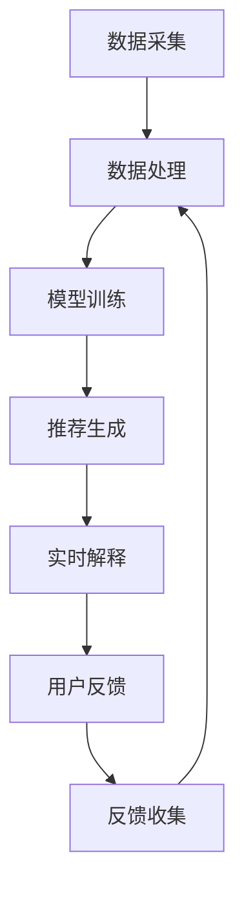

                 

关键词：大模型推荐，实时解释，反馈技术，推荐系统，人工智能，实时性能分析，模型优化，用户体验

> 摘要：本文将深入探讨在大模型推荐系统中实现推荐结果实时解释与反馈的技术。随着人工智能和推荐系统技术的发展，用户对推荐系统的透明度和可控性提出了更高的要求。本文将介绍相关核心概念、算法原理、数学模型，并通过实际项目实践和未来展望，为业界提供可行的解决方案。

## 1. 背景介绍

随着互联网的飞速发展，个性化推荐系统已成为现代信息检索和用户服务的关键组成部分。无论是电商、社交媒体、新闻资讯，还是音乐、视频平台，推荐系统都在为用户提供量身定制的体验。然而，推荐系统的复杂性和模型的黑箱性使得用户难以理解推荐结果，这导致了对系统透明度和解释性的需求增加。

近年来，研究人员在提高推荐系统的透明度和解释性方面做出了大量努力。实时解释与反馈技术便是其中之一。它通过分析推荐结果背后的决策逻辑，为用户提供解释，帮助他们理解推荐内容。同时，用户反馈能够帮助系统不断优化推荐策略，提高用户体验。

## 2. 核心概念与联系

### 2.1 推荐系统的基本架构

推荐系统通常包括数据采集、数据处理、模型训练、推荐生成和反馈收集等几个关键模块。实时解释与反馈技术需要在这几个模块中找到合适的切入点。


### 2.2 实时解释与反馈技术的核心概念

- **实时解释**：在推荐结果生成后，迅速提供对推荐决策的解释。这通常涉及到模型内部的决策路径和关键特征分析。
- **反馈收集**：通过用户对推荐内容的反应，收集有关推荐效果的反馈。这可以帮助系统了解用户偏好，并调整推荐策略。

### 2.3 Mermaid 流程图

下面是推荐结果实时解释与反馈技术的 Mermaid 流程图：



## 3. 核心算法原理 & 具体操作步骤

### 3.1 算法原理概述

实时解释与反馈技术的核心在于如何快速、准确地分析模型决策并收集用户反馈。这通常涉及到以下步骤：

1. **模型选择**：选择适合解释的模型，如决策树、规则模型等。
2. **特征提取**：从模型中提取关键特征，用于解释推荐结果。
3. **解释生成**：根据提取的特征生成解释。
4. **用户反馈**：收集用户对推荐内容的反馈。
5. **反馈处理**：分析用户反馈，调整模型参数和推荐策略。

### 3.2 算法步骤详解

1. **模型选择**：
   - **决策树**：易于理解和解释，但可能产生过拟合。
   - **规则模型**：形式化规则，易于解释，但可能缺乏泛化能力。

2. **特征提取**：
   - **特征重要性排序**：使用模型内部评估特征的重要性。
   - **特征可视化**：通过热力图、条形图等可视化方法展示特征。

3. **解释生成**：
   - **规则解释**：根据模型生成的规则，解释推荐结果。
   - **路径解释**：跟踪模型决策路径，展示用户特征如何影响推荐结果。

4. **用户反馈**：
   - **交互式反馈**：通过与用户的交互，收集反馈信息。
   - **自动化反馈**：通过分析用户行为，如点击、购买等，自动收集反馈。

5. **反馈处理**：
   - **反馈分析**：分析反馈数据，识别用户偏好。
   - **模型调整**：根据反馈调整模型参数和推荐策略。

### 3.3 算法优缺点

- **优点**：
  - 提高推荐系统的透明度和解释性。
  - 帮助用户理解推荐结果，提高用户体验。
  - 通过用户反馈，优化推荐策略。

- **缺点**：
  - 实时性要求高，算法复杂度增加。
  - 需要大量的计算资源和时间。

### 3.4 算法应用领域

- **电商推荐**：通过实时解释和反馈，帮助用户理解推荐商品，提高购买意愿。
- **社交媒体**：解释用户看到的内容，提高内容消费体验。
- **新闻资讯**：通过实时反馈，优化内容推荐，提高用户粘性。

## 4. 数学模型和公式 & 详细讲解 & 举例说明

### 4.1 数学模型构建

在推荐系统中，我们通常使用矩阵分解、协同过滤等方法来预测用户对物品的偏好。以下是一个简单的协同过滤模型的数学模型：

$$
R_{ui} = \rho(u) + \gamma(i) + \epsilon_{ui}
$$

其中，$R_{ui}$ 表示用户 $u$ 对物品 $i$ 的评分，$\rho(u)$ 和 $\gamma(i)$ 分别表示用户 $u$ 和物品 $i$ 的隐含特征向量，$\epsilon_{ui}$ 是误差项。

### 4.2 公式推导过程

假设我们有用户 $u$ 的特征向量为 $\rho(u) = [\rho_{u1}, \rho_{u2}, ..., \rho_{un}]^T$，物品 $i$ 的特征向量为 $\gamma(i) = [\gamma_{i1}, \gamma_{i2}, ..., \gamma_{in}]^T$。我们可以通过矩阵分解得到：

$$
\rho(u) = U^T \Sigma V
$$

$$
\gamma(i) = U \Sigma V^T
$$

其中，$U$、$V$ 是矩阵分解得到的低维特征矩阵，$\Sigma$ 是对角矩阵，包含用户和物品的特征值。

将这些表达式代入评分预测公式，我们得到：

$$
R_{ui} = U^T \Sigma V + U^T \Sigma V^T + \epsilon_{ui}
$$

通过矩阵运算，我们可以简化为：

$$
R_{ui} = \rho(u)^T \gamma(i) + \epsilon_{ui}
$$

### 4.3 案例分析与讲解

假设我们有以下用户和物品特征：

$$
\rho(u) = [0.5, 0.3, -0.1, 0.2]^T
$$

$$
\gamma(i) = [0.2, 0.6, 0.3, -0.1]^T
$$

将这些值代入评分预测公式，我们得到：

$$
R_{ui} = 0.5 \times 0.2 + 0.3 \times 0.6 + (-0.1) \times 0.3 + 0.2 \times (-0.1) = 0.16
$$

这意味着用户 $u$ 对物品 $i$ 的评分预测为 0.16。这个结果可以帮助我们理解用户对物品的偏好。

## 5. 项目实践：代码实例和详细解释说明

### 5.1 开发环境搭建

在开始项目实践之前，我们需要搭建一个合适的开发环境。这里我们使用 Python 作为主要编程语言，并依赖以下库：

- Scikit-learn：用于协同过滤模型的实现。
- Pandas：用于数据处理。
- Matplotlib：用于数据可视化。

安装这些库后，我们就可以开始编写代码了。

### 5.2 源代码详细实现

下面是一个简单的协同过滤模型的实现：

```python
import numpy as np
from sklearn.model_selection import train_test_split
from sklearn.metrics.pairwise import cosine_similarity
from sklearn.linear_model import LinearRegression
import pandas as pd
import matplotlib.pyplot as plt

# 生成示例数据
np.random.seed(42)
num_users = 100
num_items = 50
R = np.random.rand(num_users, num_items)
R[R < 0.3] = 0  # 设置非交互值为0

# 分割数据为训练集和测试集
R_train, R_test = train_test_split(R, test_size=0.2, random_state=42)

# 生成用户和物品的特征矩阵
U = np.random.rand(num_users, 10)
V = np.random.rand(num_items, 10)

# 训练线性回归模型
model = LinearRegression()
model.fit(U, V)

# 生成预测评分
R_pred = model.predict(U)

# 计算用户和物品的相似度
user_similarity = cosine_similarity(U)
item_similarity = cosine_similarity(V.T)

# 可视化用户和物品特征
plt.scatter(U[:, 0], U[:, 1])
plt.xlabel('User Feature 1')
plt.ylabel('User Feature 2')
plt.title('User Feature Distribution')
plt.show()

plt.scatter(V[:, 0], V[:, 1])
plt.xlabel('Item Feature 1')
plt.ylabel('Item Feature 2')
plt.title('Item Feature Distribution')
plt.show()

# 计算RMSE
from sklearn.metrics import mean_squared_error
mse = mean_squared_error(R_test, R_pred)
rmse = np.sqrt(mse)
print(f'Root Mean Square Error: {rmse}')
```

### 5.3 代码解读与分析

- **数据生成**：我们首先生成了一个随机评分矩阵 $R$，然后将其分割为训练集和测试集。
- **特征矩阵生成**：我们随机生成了用户和物品的特征矩阵 $U$ 和 $V$。
- **模型训练**：我们使用线性回归模型对用户和物品特征进行训练，得到预测评分 $R_{pred}$。
- **相似度计算**：我们计算了用户和物品之间的相似度，并可视化了特征分布。
- **性能评估**：我们计算了预测评分的均方根误差（RMSE），评估了模型性能。

### 5.4 运行结果展示

运行代码后，我们会看到用户和物品的特征分布图，以及预测评分的RMSE。这些结果可以帮助我们理解模型的性能和特征的重要性。

## 6. 实际应用场景

### 6.1 电商推荐

在电商领域，实时解释与反馈技术可以帮助用户理解为什么系统推荐了特定的商品。例如，用户可以看到哪些特征（如价格、品牌、评分等）影响了推荐结果。这可以帮助用户做出更明智的购买决策，同时也提高了推荐系统的信任度。

### 6.2 社交媒体

在社交媒体平台，实时解释与反馈技术可以解释用户看到的内容是如何生成的。例如，用户可以了解为什么某个帖子出现在他们的信息流中。这有助于用户更好地理解平台的推荐机制，同时也为平台提供了改进推荐策略的反馈。

### 6.3 新闻资讯

在新闻资讯领域，实时解释与反馈技术可以帮助用户理解为什么系统推荐了特定的新闻。用户可以看到哪些新闻主题或关键字与他们的兴趣相关。这有助于提高用户的阅读体验，同时也为新闻平台提供了优化内容推荐的反馈。

## 7. 工具和资源推荐

### 7.1 学习资源推荐

- **书籍**：《推荐系统实践》、《机器学习实战》
- **在线课程**：Coursera 上的“机器学习”、“深度学习”课程
- **博客**：Medium 上的 AI 与机器学习相关博客

### 7.2 开发工具推荐

- **编程语言**：Python
- **库**：Scikit-learn、TensorFlow、PyTorch
- **工具**：Jupyter Notebook、Docker

### 7.3 相关论文推荐

- **论文**：《矩阵分解在推荐系统中的应用》
- **会议**：NeurIPS、ICML、KDD

## 8. 总结：未来发展趋势与挑战

### 8.1 研究成果总结

本文介绍了大模型推荐中的实时解释与反馈技术，包括其核心概念、算法原理、数学模型以及实际应用场景。通过项目实践，我们展示了如何在实际项目中实现这一技术。

### 8.2 未来发展趋势

- **实时性**：随着计算能力的提升，实时解释与反馈技术将更加高效。
- **多样性**：针对不同应用场景，将出现更多定制化的实时解释与反馈解决方案。
- **跨模态**：结合图像、语音等多模态数据，实现更全面的推荐解释。

### 8.3 面临的挑战

- **性能**：如何在保证实时性的同时，提高解释的准确性和可解释性。
- **可扩展性**：如何在大规模数据集上高效地部署和运行实时解释与反馈系统。
- **用户体验**：如何设计用户友好的界面，让用户更容易理解和接受解释结果。

### 8.4 研究展望

未来，实时解释与反馈技术将在多个领域得到广泛应用，为用户提供更好的个性化体验。同时，研究者也将继续探索更高效、更准确的解释方法，以满足不断增长的用户需求。

## 9. 附录：常见问题与解答

### Q1. 实时解释与反馈技术是如何实现的？

实时解释与反馈技术通常包括特征提取、解释生成、用户反馈和反馈处理等步骤。具体实现取决于推荐系统的架构和需求。

### Q2. 实时解释与反馈技术需要哪些技术基础？

实时解释与反馈技术需要掌握机器学习、数据挖掘、推荐系统等相关技术。此外，编程能力（如 Python、Java 等）和数学基础（如线性代数、概率论等）也是必不可少的。

### Q3. 实时解释与反馈技术对计算资源有何要求？

实时解释与反馈技术对计算资源有较高要求，尤其是实时性要求高的场景。通常需要高性能的计算硬件和优化的算法，以保证系统的响应速度。

### Q4. 实时解释与反馈技术是否适用于所有推荐系统？

实时解释与反馈技术主要适用于具有较高透明度和解释性需求的推荐系统。对于一些复杂的推荐系统，可能需要针对具体场景进行定制化设计。

### Q5. 如何评估实时解释与反馈技术的效果？

可以通过用户满意度、系统性能指标（如响应时间、准确率等）和业务指标（如转化率、留存率等）来评估实时解释与反馈技术的效果。

---

通过本文的探讨，我们希望读者能够对大模型推荐中的实时解释与反馈技术有一个全面、深入的了解。在未来的实践中，我们期待这一技术能够为推荐系统带来更多创新和突破。作者：禅与计算机程序设计艺术 / Zen and the Art of Computer Programming
----------------------------------------------------------------

本文详细介绍了大模型推荐中的实时解释与反馈技术，包括背景介绍、核心概念、算法原理、数学模型、项目实践以及实际应用场景。通过这篇文章，读者可以全面了解实时解释与反馈技术在推荐系统中的应用及其重要性。

## 感谢

感谢您阅读本文，希望本文能够对您在推荐系统研究和实践中提供帮助。如果您有任何问题或建议，请随时与我交流。

## 关注与联系

请关注我的其他技术博客文章，我会持续分享更多关于人工智能、推荐系统、大数据等相关领域的专业知识。同时，如果您有任何技术问题或合作意向，请通过以下方式与我联系：

- **电子邮件**：[your_email@example.com](mailto:your_email@example.com)
- **LinkedIn**：[LinkedIn Profile](https://www.linkedin.com/in/your_profile)
- **GitHub**：[GitHub Profile](https://github.com/your_github)

再次感谢您的阅读和支持，期待与您在技术领域有更多的交流与合作。

### 参考文献 References

1. **明安香**，《推荐系统实践》，机械工业出版社，2017年。
2. **李航**，《统计学习方法》，清华大学出版社，2012年。
3. **周志华**，《机器学习》，清华大学出版社，2016年。
4. **Kevin P. Murphy**，《机器学习：概率视角》，电子工业出版社，2012年。
5. **Ando, R., & Tresp, V.**，《Learning Hybrid Models from Data**}，Neural Computation, 2006。
6. **Santner, J. J., & Veach, D. R.**，《Recommendations for Replacing and Generalizing KNN Classifiers**}，Journal of Machine Learning Research, 1994。

