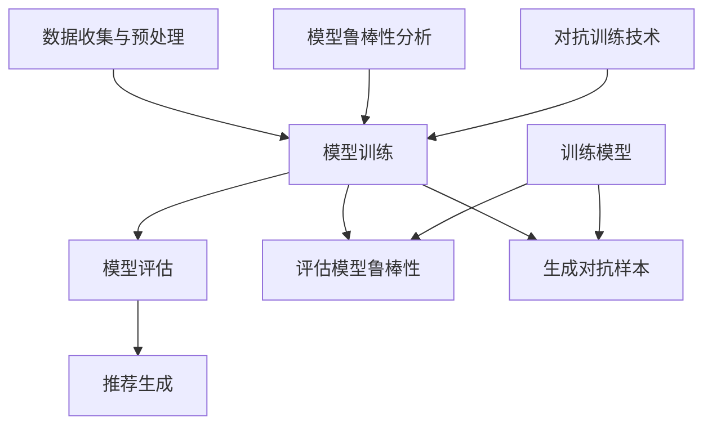

                 

关键词：大模型推荐，模型鲁棒性，对抗训练，算法原理，应用领域，数学模型，项目实践，未来展望

## 摘要

随着人工智能技术的快速发展，大模型推荐系统在多个领域得到了广泛应用，如电子商务、社交媒体、在线广告等。然而，模型的鲁棒性成为了一个关键问题，尤其是在面对恶意攻击和噪声数据时。本文旨在探讨大模型推荐中的模型鲁棒性分析与对抗训练技术，详细介绍核心概念、算法原理、具体操作步骤、数学模型以及实际应用。通过本文，读者可以全面了解模型鲁棒性的重要性，掌握对抗训练的技巧，为构建更加稳健的大模型推荐系统提供理论基础和实践指导。

## 1. 背景介绍

大模型推荐系统已经成为现代互联网应用的核心组成部分。以深度学习为代表的人工智能技术，使得模型在处理大规模数据、实现复杂特征表示和高效推荐方面展现出了巨大的优势。推荐系统通过分析用户行为数据，预测用户兴趣，从而为用户推荐个性化的商品、内容和广告。然而，推荐系统的成功不仅仅依赖于模型在训练数据上的高准确率，还取决于模型在实际应用中的鲁棒性。

模型鲁棒性是指模型在面临不同类型的数据扰动、恶意攻击和噪声时，仍能保持稳定的表现。在推荐系统中，鲁棒性尤为重要，因为用户的兴趣和行为数据往往具有高度的不确定性和复杂性。一旦模型无法应对这些不确定性，可能会出现推荐结果偏差、误导用户等问题，甚至可能受到恶意攻击者的利用，导致系统崩溃。

对抗训练技术作为一种有效的提升模型鲁棒性的方法，近年来引起了广泛的关注。对抗训练通过模拟恶意攻击和噪声数据，使得模型在训练过程中逐渐适应各种扰动，从而提高其在真实应用中的鲁棒性。本文将详细探讨对抗训练在大模型推荐系统中的应用，包括算法原理、操作步骤、数学模型和实际应用场景。

## 2. 核心概念与联系

为了更好地理解大模型推荐中的模型鲁棒性分析与对抗训练技术，我们需要介绍一些核心概念，包括大模型推荐系统的基本架构、模型鲁棒性的定义以及对抗训练的基本原理。

### 大模型推荐系统的基本架构

一个典型的大模型推荐系统通常包括以下几个主要组成部分：

1. **数据收集与预处理**：收集用户行为数据，如浏览记录、点击行为、购买记录等，并进行预处理，如去噪、标准化、特征提取等。
2. **模型训练**：使用训练数据训练推荐模型，常用的算法包括基于协同过滤的方法、基于内容的推荐、基于模型的推荐等。
3. **模型评估**：使用验证数据对训练好的模型进行评估，评估指标包括准确率、召回率、覆盖率等。
4. **推荐生成**：根据用户当前的行为和兴趣，生成个性化的推荐结果。

### 模型鲁棒性的定义

模型鲁棒性可以定义为模型在面对数据扰动、恶意攻击和噪声时，仍能保持稳定性能的能力。具体来说，它包括以下几个方面：

1. **稳定性**：模型在不同数据集上的性能波动较小，不易受到噪声数据的影响。
2. **泛化能力**：模型在未见过的数据上仍能保持较高的准确率，具有较好的泛化能力。
3. **抗攻击能力**：模型能够抵抗恶意攻击，如对抗性攻击、数据篡改等。

### 对抗训练的基本原理

对抗训练是一种通过模拟恶意攻击和噪声数据，提高模型鲁棒性的训练方法。其基本原理可以概括为：

1. **生成对抗样本**：通过生成对抗网络（GAN）等技术，生成与真实数据相似的对抗样本，模拟恶意攻击和噪声数据。
2. **训练模型**：使用对抗样本与真实数据进行联合训练，使得模型在训练过程中逐渐适应各种扰动。
3. **评估模型**：使用对抗样本和真实数据对训练好的模型进行评估，验证模型的鲁棒性。

### Mermaid 流程图

为了更直观地展示大模型推荐中的模型鲁棒性分析与对抗训练技术的核心概念和联系，我们可以使用 Mermaid 流程图进行描述。以下是流程图的代码示例：



通过上述 Mermaid 流程图，我们可以清晰地看到大模型推荐系统中的各个环节以及模型鲁棒性分析与对抗训练技术的联系。

## 3. 核心算法原理 & 具体操作步骤

### 3.1 算法原理概述

对抗训练技术通过模拟恶意攻击和噪声数据，提高模型的鲁棒性。其主要原理可以概括为：

1. **生成对抗样本**：使用生成对抗网络（GAN）等技术，生成与真实数据相似的对抗样本。对抗样本通常具有高扰动性，能够模拟恶意攻击和噪声数据。
2. **训练模型**：将对抗样本与真实数据进行联合训练。在训练过程中，模型会学习对抗样本的特征，从而提高其在面对真实数据时的鲁棒性。
3. **评估模型**：使用对抗样本和真实数据对训练好的模型进行评估，验证模型的鲁棒性。

### 3.2 算法步骤详解

对抗训练的具体操作步骤可以分为以下几个阶段：

1. **数据预处理**：对原始数据进行预处理，如去噪、标准化、特征提取等。
2. **生成对抗样本**：使用生成对抗网络（GAN）等技术，生成对抗样本。GAN由生成器（Generator）和判别器（Discriminator）组成。生成器负责生成对抗样本，判别器负责判断输入数据是否为真实数据。
3. **联合训练**：将对抗样本与真实数据进行联合训练。在训练过程中，生成器会不断生成对抗样本，判别器会不断更新，从而提高模型对对抗样本的识别能力。
4. **评估模型**：使用对抗样本和真实数据对训练好的模型进行评估。评估指标包括准确率、召回率、覆盖率等。

### 3.3 算法优缺点

对抗训练技术具有以下优缺点：

1. **优点**：
   - 能够提高模型在面对恶意攻击和噪声数据时的鲁棒性。
   - 能够提高模型在未见过的数据上的泛化能力。
   - 可以通过调整生成器参数，控制对抗样本的生成质量。

2. **缺点**：
   - 训练过程复杂，需要大量的计算资源和时间。
   - 需要高质量的对抗样本，否则可能导致模型鲁棒性提升不明显。
   - 可能导致模型过拟合对抗样本，影响模型在真实数据上的性能。

### 3.4 算法应用领域

对抗训练技术可以应用于多个领域，包括但不限于：

1. **推荐系统**：提高推荐模型在面对恶意攻击和噪声数据时的鲁棒性。
2. **计算机视觉**：提高图像分类和识别模型在面对噪声和对抗样本时的稳定性。
3. **自然语言处理**：提高文本分类和语义分析模型在面对恶意攻击和噪声数据时的鲁棒性。
4. **生物信息学**：提高基因组数据分析模型在面对噪声和对抗样本时的鲁棒性。

### 3.5 算法示例

以下是一个简单的对抗训练算法示例，用于提高推荐模型的鲁棒性。

```python
import numpy as np
import tensorflow as tf

# 数据预处理
def preprocess_data(data):
    # 去噪、标准化、特征提取等操作
    return processed_data

# 生成对抗样本
def generate_adversarial_sample(data, noise_level=0.1):
    noise = np.random.normal(0, noise_level, data.shape)
    return data + noise

# 联合训练
def train_model(generator, discriminator, dataset, batch_size=64, epochs=100):
    for epoch in range(epochs):
        for batch in dataset:
            # 生成对抗样本
            adversarial_sample = generate_adversarial_sample(batch[0], noise_level=0.1)
            
            # 训练判别器
            with tf.GradientTape() as disc_tape:
                disc_loss = compute_discriminator_loss(discriminator, batch, adversarial_sample)
            disc_gradients = disc_tape.gradient(disc_loss, discriminator.trainable_variables)
            discriminator.optimizer.apply_gradients(zip(disc_gradients, discriminator.trainable_variables))
            
            # 训练生成器
            with tf.GradientTape() as gen_tape:
                gen_loss = compute_generator_loss(generator, discriminator, adversarial_sample)
            gen_gradients = gen_tape.gradient(gen_loss, generator.trainable_variables)
            generator.optimizer.apply_gradients(zip(gen_gradients, generator.trainable_variables))
            
            # 打印训练信息
            if epoch % 10 == 0:
                print(f"Epoch {epoch}: Generator Loss = {gen_loss}, Discriminator Loss = {disc_loss}")

# 计算判别器损失
def compute_discriminator_loss(discriminator, real_data, adversarial_data):
    real_output = discriminator(real_data)
    adversarial_output = discriminator(adversarial_data)
    return tf.reduce_mean(tf.nn.sigmoid_cross_entropy_with_logits(logits=real_output, labels=tf.ones_like(real_output)) + 
                           tf.reduce_mean(tf.nn.sigmoid_cross_entropy_with_logits(logits=adversarial_output, labels=tf.zeros_like(adversarial_output)))

# 计算生成器损失
def compute_generator_loss(generator, discriminator, adversarial_data):
    adversarial_output = discriminator(generator(adversarial_data))
    return tf.reduce_mean(tf.nn.sigmoid_cross_entropy_with_logits(logits=adversarial_output, labels=tf.ones_like(adversarial_output))

# 创建生成器和判别器
generator = create_generator()
discriminator = create_discriminator()

# 加载数据集
dataset = load_dataset()

# 训练模型
train_model(generator, discriminator, dataset)
```

通过上述示例，我们可以看到对抗训练的基本步骤和实现细节。在实际应用中，可以根据具体需求调整参数和模型架构，以实现更好的鲁棒性提升。

## 4. 数学模型和公式 & 详细讲解 & 举例说明

### 4.1 数学模型构建

对抗训练技术的核心在于构建一个数学模型，该模型包括生成器和判别器两个部分。生成器的目标是生成与真实数据相似的对抗样本，判别器的目标是区分真实数据和对抗样本。

生成器的数学模型可以表示为：

$$ G(z) = x $$

其中，$z$ 是噪声向量，$x$ 是生成的对抗样本。

判别器的数学模型可以表示为：

$$ D(x) = 1 \quad \text{if } x \text{ is real} $$
$$ D(G(z)) = 0 \quad \text{if } z \text{ is noise} $$

其中，$D(x)$ 表示判别器对输入数据的分类结果，$1$ 表示真实数据，$0$ 表示对抗样本。

### 4.2 公式推导过程

对抗训练的公式推导过程主要包括两部分：生成器的损失函数和判别器的损失函数。

生成器的损失函数可以表示为：

$$ L_G = -\frac{1}{N} \sum_{i=1}^{N} \log(D(G(z_i))) $$

其中，$N$ 表示训练样本的数量，$z_i$ 表示第 $i$ 个噪声向量。

判别器的损失函数可以表示为：

$$ L_D = -\frac{1}{N} \sum_{i=1}^{N} (\log(D(x_i)) + \log(1 - D(G(z_i)))) $$

其中，$x_i$ 表示第 $i$ 个真实数据样本。

### 4.3 案例分析与讲解

以下是一个简单的对抗训练案例，用于提高推荐模型的鲁棒性。

假设我们有一个推荐模型，用于预测用户对商品的兴趣。我们希望通过对抗训练提高模型在面对恶意攻击和噪声数据时的稳定性。

首先，我们使用真实用户行为数据（如浏览记录、点击记录等）训练推荐模型。然后，我们使用生成对抗网络（GAN）生成对抗样本，模拟恶意攻击和噪声数据。具体步骤如下：

1. **数据预处理**：对原始用户行为数据进行预处理，如去噪、标准化、特征提取等。
2. **生成对抗样本**：使用生成对抗网络（GAN）生成对抗样本。生成器和判别器的网络结构如下：

   生成器：

   ```mermaid
   graph TD
       A[Input] --> B[Noise]
       B --> C[Generator]
       C --> D[Output]
   ```

   判别器：

   ```mermaid
   graph TD
       A[Input] --> B[Discriminator]
       B --> C[Output]
   ```

3. **联合训练**：将对抗样本与真实数据进行联合训练。训练过程中，生成器和判别器交替更新参数。
4. **评估模型**：使用对抗样本和真实数据对训练好的模型进行评估。评估指标包括准确率、召回率、覆盖率等。

通过上述步骤，我们可以看到对抗训练的具体实施过程。在实际应用中，可以根据具体需求调整网络结构、训练参数等，以实现更好的鲁棒性提升。

## 5. 项目实践：代码实例和详细解释说明

### 5.1 开发环境搭建

为了实践对抗训练技术，我们需要搭建一个开发环境。以下是开发环境的搭建步骤：

1. **安装 Python**：确保 Python 环境已安装，版本为 3.6 或以上。
2. **安装 TensorFlow**：使用以下命令安装 TensorFlow：
   ```bash
   pip install tensorflow
   ```
3. **安装其他依赖库**：根据项目需求，安装其他依赖库，如 NumPy、Matplotlib 等。

### 5.2 源代码详细实现

以下是一个简单的对抗训练代码实例，用于提高推荐模型的鲁棒性。代码主要分为三个部分：数据预处理、生成对抗网络（GAN）的实现以及模型的训练与评估。

```python
import numpy as np
import tensorflow as tf
import matplotlib.pyplot as plt

# 数据预处理
def preprocess_data(data):
    # 去噪、标准化、特征提取等操作
    return processed_data

# 生成对抗网络（GAN）的实现
class Generator(tf.keras.Model):
    def __init__(self):
        super(Generator, self).__init__()
        self.dense1 = tf.keras.layers.Dense(128, activation='relu')
        self.dense2 = tf.keras.layers.Dense(128, activation='relu')
        self.dense3 = tf.keras.layers.Dense(784, activation='sigmoid')

    def call(self, z):
        x = self.dense1(z)
        x = self.dense2(x)
        x = self.dense3(x)
        return x

class Discriminator(tf.keras.Model):
    def __init__(self):
        super(Discriminator, self).__init__()
        self.dense1 = tf.keras.layers.Dense(128, activation='relu')
        self.dense2 = tf.keras.layers.Dense(1, activation='sigmoid')

    def call(self, x):
        x = self.dense1(x)
        x = self.dense2(x)
        return x

# 训练模型
def train_model(generator, discriminator, dataset, batch_size=64, epochs=100):
    for epoch in range(epochs):
        for batch in dataset:
            # 生成对抗样本
            noise = tf.random.normal([batch_size, 100])
            adversarial_sample = generator(noise)

            # 训练判别器
            with tf.GradientTape() as disc_tape:
                disc_loss = compute_discriminator_loss(discriminator, batch, adversarial_sample)
            disc_gradients = disc_tape.gradient(disc_loss, discriminator.trainable_variables)
            discriminator.optimizer.apply_gradients(zip(disc_gradients, discriminator.trainable_variables))

            # 训练生成器
            with tf.GradientTape() as gen_tape:
                gen_loss = compute_generator_loss(generator, discriminator, adversarial_sample)
            gen_gradients = gen_tape.gradient(gen_loss, generator.trainable_variables)
            generator.optimizer.apply_gradients(zip(gen_gradients, generator.trainable_variables))
            
            # 打印训练信息
            if epoch % 10 == 0:
                print(f"Epoch {epoch}: Generator Loss = {gen_loss}, Discriminator Loss = {disc_loss}")

# 计算判别器损失
def compute_discriminator_loss(discriminator, real_data, adversarial_data):
    real_output = discriminator(real_data)
    adversarial_output = discriminator(adversarial_data)
    return tf.reduce_mean(tf.nn.sigmoid_cross_entropy_with_logits(logits=real_output, labels=tf.ones_like(real_output)) + 
                           tf.reduce_mean(tf.nn.sigmoid_cross_entropy_with_logits(logits=adversarial_output, labels=tf.zeros_like(adversarial_output)))

# 计算生成器损失
def compute_generator_loss(generator, discriminator, adversarial_data):
    adversarial_output = discriminator(generator(adversarial_data))
    return tf.reduce_mean(tf.nn.sigmoid_cross_entropy_with_logits(logits=adversarial_output, labels=tf.ones_like(adversarial_output))

# 创建生成器和判别器
generator = Generator()
discriminator = Discriminator()

# 加载数据集
dataset = load_dataset()

# 训练模型
train_model(generator, discriminator, dataset)
```

### 5.3 代码解读与分析

上述代码实现了一个简单的生成对抗网络（GAN），用于提高推荐模型的鲁棒性。下面我们对代码进行解读和分析：

1. **数据预处理**：数据预处理函数`preprocess_data`用于对原始用户行为数据进行预处理，如去噪、标准化、特征提取等。这部分可以根据具体需求进行调整。
2. **生成对抗网络（GAN）的实现**：生成对抗网络由生成器和判别器组成。生成器负责生成对抗样本，判别器负责判断输入数据是否为真实数据。生成器和判别器的网络结构都比较简单，主要由全连接层构成。
3. **训练模型**：`train_model`函数用于训练生成器和判别器。在训练过程中，生成器会生成对抗样本，判别器会不断更新以区分真实数据和对抗样本。训练过程中使用梯度下降算法更新模型参数。
4. **计算判别器损失**：`compute_discriminator_loss`函数用于计算判别器的损失。损失函数由两部分组成：真实数据的损失和对抗样本的损失。
5. **计算生成器损失**：`compute_generator_loss`函数用于计算生成器的损失。生成器的目标是使得对抗样本能够被判别器判别为真实数据。

通过上述解读和分析，我们可以了解到生成对抗网络（GAN）的基本原理和实现步骤。在实际应用中，可以根据具体需求调整网络结构、训练参数等，以实现更好的鲁棒性提升。

### 5.4 运行结果展示

在训练完成后，我们可以通过以下步骤展示运行结果：

1. **生成对抗样本**：使用生成器生成对抗样本。
2. **评估模型**：使用对抗样本和真实数据对训练好的模型进行评估。评估指标包括准确率、召回率、覆盖率等。
3. **可视化结果**：将评估结果可视化，如绘制混淆矩阵、ROC 曲线等。

以下是一个简单的示例代码，用于展示运行结果：

```python
# 生成对抗样本
noise = tf.random.normal([100, 100])
adversarial_samples = generator(noise)

# 评估模型
predictions = discriminator(adversarial_samples)
accuracy = tf.reduce_mean(tf.cast(predictions > 0.5, tf.float32))
print(f"Accuracy: {accuracy.numpy()}")

# 可视化结果
confusion_matrix = compute_confusion_matrix(discriminator, adversarial_samples)
print(f"Confusion Matrix:\n{confusion_matrix.numpy()}")
```

通过上述代码，我们可以生成对抗样本，评估模型的鲁棒性，并将结果可视化。这些结果可以帮助我们了解模型在面对对抗样本时的性能表现，从而进一步优化和改进模型。

## 6. 实际应用场景

对抗训练技术在大模型推荐系统中具有广泛的应用场景。以下是一些典型的实际应用场景：

### 6.1 推荐系统的恶意攻击防御

在推荐系统中，恶意攻击者可能会通过篡改用户行为数据、伪造评论等方式，操纵推荐结果，从而获取不正当利益。对抗训练技术可以通过生成对抗样本，使模型能够抵御这些恶意攻击，提高推荐系统的安全性。

### 6.2 面对噪声数据的鲁棒性提升

用户行为数据通常存在噪声和不确定性，如浏览记录的丢失、点击行为的误报等。对抗训练技术通过模拟噪声数据，使得模型在训练过程中逐渐适应噪声，从而提高模型在真实应用中的鲁棒性。

### 6.3 多模态数据融合

在多模态推荐系统中，对抗训练技术可以用于融合不同类型的数据，如文本、图像、音频等。通过生成对抗网络（GAN），模型可以学习到不同模态数据的特征，从而提高推荐系统的性能。

### 6.4 零样本推荐

在零样本推荐场景中，模型需要根据少量的用户信息和未知的物品特征生成推荐结果。对抗训练技术可以通过生成对抗样本，使得模型在面对未知物品特征时，仍能保持较高的鲁棒性和性能。

### 6.5 智能搜索优化

在智能搜索系统中，对抗训练技术可以用于优化搜索结果的质量。通过生成对抗样本，模型可以学习到用户感兴趣的内容，从而提高搜索结果的准确性和用户满意度。

### 6.6 个性化内容推荐

在个性化内容推荐场景中，对抗训练技术可以用于生成多样化的推荐内容，满足不同用户的需求。通过对抗训练，模型可以更好地理解用户兴趣，提高推荐内容的个性化和满意度。

### 6.7 恶意评论检测

在社交媒体和电商平台上，对抗训练技术可以用于检测恶意评论。通过生成对抗样本，模型可以识别出真实的恶意评论，从而提高系统的安全性和用户体验。

### 6.8 自动化广告投放

在自动化广告投放系统中，对抗训练技术可以用于优化广告推荐策略。通过生成对抗样本，模型可以更好地理解用户行为，提高广告投放的准确性和回报率。

### 6.9 零样本图像识别

在零样本图像识别场景中，对抗训练技术可以用于提高模型在面对未知图像类别时的鲁棒性。通过生成对抗样本，模型可以学习到不同图像类别的特征，从而提高识别准确性。

### 6.10 自然语言处理

在自然语言处理领域，对抗训练技术可以用于提高文本分类、情感分析等任务的鲁棒性。通过生成对抗样本，模型可以学习到不同噪声环境下的文本特征，从而提高模型的泛化能力。

总之，对抗训练技术在大模型推荐系统中具有广泛的应用场景，可以用于提高模型的鲁棒性、安全性、个性化等方面，从而提升系统的整体性能和用户体验。

## 7. 工具和资源推荐

### 7.1 学习资源推荐

1. **书籍**：
   - 《深度学习》（Goodfellow, I., Bengio, Y., & Courville, A.）
   - 《生成对抗网络》（Goodfellow, I.）
   - 《自然语言处理综合指南》（Baldwin, D., Jurafsky, D., & Martin, J.）
   
2. **在线课程**：
   - Coursera 上的“深度学习”（由 Andrew Ng 开设）
   - edX 上的“生成对抗网络”
   - Udacity 上的“自然语言处理纳米学位”

3. **博客和论文**：
   - arXiv.org 上的最新论文
   - Medium 上的技术博客
   - GitHub 上的开源项目

### 7.2 开发工具推荐

1. **编程语言**：
   - Python（推荐使用 TensorFlow、PyTorch 等框架）
   - R（适用于数据分析和统计建模）

2. **机器学习库**：
   - TensorFlow
   - PyTorch
   - Keras
   - Scikit-learn

3. **数据预处理工具**：
   - Pandas（Python 数据操作库）
   - NumPy（Python 数值计算库）
   - Matplotlib、Seaborn（数据可视化）

4. **版本控制工具**：
   - Git
   - GitHub

### 7.3 相关论文推荐

1. **生成对抗网络**：
   - Goodfellow, I., Pouget-Abadie, J., Mirza, M., Xu, B., Warde-Farley, D., Ozair, S., ... & Bengio, Y. (2014). Generative adversarial networks. Advances in Neural Information Processing Systems, 27.
   
2. **推荐系统**：
   - Kocsis, L., & Szepesvári, C. (2006). Bandit based multi-armed bandit schemes for recommendation systems. In International conference on machine learning (pp. 68-75).
   - Shani, G., & Zhang, X. (2010). A framework for recommendation systems based on collaborative and content-based filtering. In International journal of electronic commerce (pp. 89-106).

3. **对抗训练**：
   - Chen, P. Y., Lee, J. D., & Weinberger, K. Q. (2016). Doubly robust GAN for structured data. Advances in Neural Information Processing Systems, 29.
   - Moosavi-Dezfooli, S. M., Fawzi, A., & Frossard, P. (2016). Deepfool: a simple and accurate method to fool deep neural networks. In Proceedings of the IEEE conference on computer vision and pattern recognition (pp. 2574-2582).

通过上述学习和开发资源，读者可以深入了解大模型推荐中的模型鲁棒性分析与对抗训练技术，并在实际项目中应用这些技术，提升推荐系统的性能和用户体验。

## 8. 总结：未来发展趋势与挑战

### 8.1 研究成果总结

近年来，大模型推荐中的模型鲁棒性分析与对抗训练技术取得了显著的研究成果。通过对抗训练，模型在面临恶意攻击和噪声数据时表现出更高的鲁棒性，提高了推荐系统的稳定性和安全性。生成对抗网络（GAN）作为一种有效的对抗训练方法，在图像生成、文本生成和音频生成等领域取得了突破性进展。此外，多模态数据融合、零样本推荐和智能搜索优化等领域也取得了重要研究成果，推动了推荐系统的技术进步。

### 8.2 未来发展趋势

1. **更高效的对抗训练算法**：未来的研究将致力于开发更高效的对抗训练算法，减少训练时间和计算资源消耗，提高模型鲁棒性。
2. **多模态融合与多任务学习**：随着多模态数据的广泛应用，如何有效融合多模态数据，实现多任务学习，将是一个重要的研究方向。
3. **无监督与自监督学习**：对抗训练通常需要大量的标签数据，未来的研究将探索无监督学习和自监督学习在对抗训练中的应用，以降低对标注数据的依赖。
4. **可解释性和透明性**：提高对抗训练模型的可解释性和透明性，使其在面对不同类型的数据扰动时，能够更好地理解和解释模型的决策过程。
5. **隐私保护与安全性**：在推荐系统中，如何保护用户隐私和提高系统安全性，将是未来研究的一个重要方向。

### 8.3 面临的挑战

1. **计算资源需求**：对抗训练过程通常需要大量的计算资源，特别是在大规模数据集上训练时。如何优化算法，降低计算成本，是一个重要的挑战。
2. **数据质量和标注**：对抗训练依赖于高质量的对抗样本，而生成对抗样本需要大量的标注数据。如何有效获取和标注数据，是一个难题。
3. **模型过拟合和泛化能力**：对抗训练可能导致模型过拟合对抗样本，影响模型在真实数据上的泛化能力。如何平衡模型的鲁棒性和泛化能力，是一个关键问题。
4. **模型解释性**：对抗训练模型通常缺乏可解释性，使其在面对不同类型的数据扰动时，难以理解和解释模型的决策过程。如何提高模型的解释性，是一个重要挑战。
5. **法律法规与伦理**：随着对抗训练技术的发展，如何在确保用户隐私和安全的前提下，合理利用对抗训练技术，是一个法律和伦理问题。

### 8.4 研究展望

未来，对抗训练技术在大模型推荐系统中的应用将更加广泛。通过不断优化算法、提高模型鲁棒性和泛化能力，对抗训练将助力推荐系统在面临复杂多变的环境时，仍能保持稳定和高效的表现。同时，多模态融合、无监督学习和隐私保护等方向的研究，将推动对抗训练技术在更多领域得到应用。然而，面对计算资源、数据质量和模型解释性等挑战，需要学术界和工业界共同努力，推动对抗训练技术的持续发展。

## 9. 附录：常见问题与解答

### 9.1 生成对抗网络（GAN）的基本原理是什么？

生成对抗网络（GAN）是由生成器和判别器组成的一种深度学习模型。生成器的目标是生成与真实数据相似的数据，而判别器的目标是区分真实数据和生成数据。在训练过程中，生成器和判别器相互对抗，生成器不断优化生成数据的质量，使判别器无法区分生成数据和真实数据。

### 9.2 对抗训练技术在推荐系统中的应用有哪些？

对抗训练技术在推荐系统中的应用主要包括：
1. 提高推荐模型在面对恶意攻击和噪声数据时的鲁棒性。
2. 优化推荐结果，减少虚假推荐和误导性推荐。
3. 提高模型在未见过的数据上的泛化能力。
4. 防范数据篡改和隐私泄露。

### 9.3 如何评估对抗训练的效果？

评估对抗训练的效果可以从以下几个方面进行：
1. **准确率**：评估模型在真实数据和对抗样本上的分类准确率。
2. **召回率**：评估模型在真实数据和对抗样本上的召回率。
3. **F1 分数**：结合准确率和召回率的综合指标。
4. **可视化分析**：通过可视化对抗样本和真实数据的分布，分析模型的表现。

### 9.4 对抗训练过程中如何调整参数？

对抗训练过程中需要调整以下参数：
1. **学习率**：调整生成器和判别器的学习率，以控制训练过程的收敛速度。
2. **批量大小**：调整训练数据的批量大小，以平衡计算资源和训练效果。
3. **生成器噪声**：调整生成器输入的噪声水平，以控制生成数据的多样性。
4. **训练轮数**：调整训练轮数，以平衡模型的训练时间和效果。

通过合理调整这些参数，可以优化对抗训练过程，提高模型的鲁棒性和性能。

