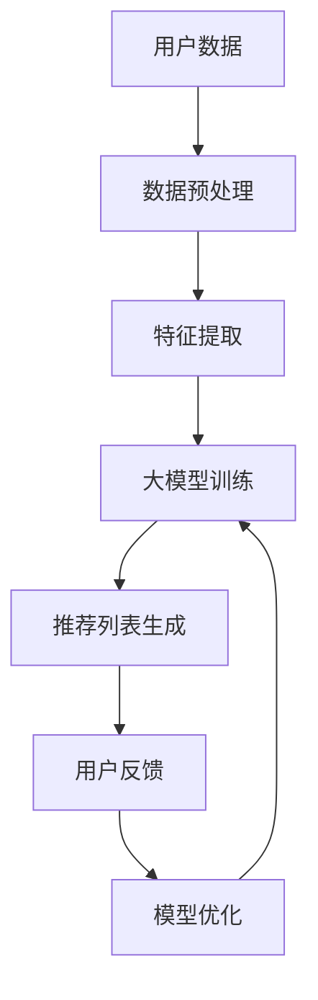
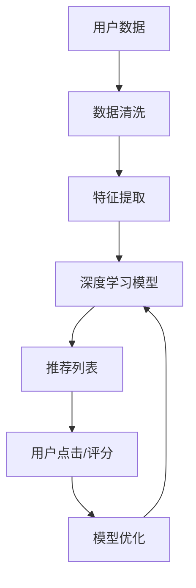

                 

关键词：大模型推荐、用户反馈机制、优化策略、推荐系统、机器学习、数据驱动、用户满意度、个性化推荐

## 摘要

随着互联网和大数据技术的飞速发展，推荐系统已成为各种在线服务和平台的核心功能。本文主要探讨了在大模型推荐系统中设计有效的用户反馈机制以及优化策略。首先，分析了当前用户反馈机制存在的问题，随后提出了一种基于深度学习的用户反馈模型，并通过数学模型和公式对其进行了详细阐述。接着，通过实际项目案例，展示了用户反馈机制的具体实现方法和效果评估。最后，对推荐系统的未来应用前景进行了展望，并提出了潜在的研究挑战。

## 1. 背景介绍

### 推荐系统概述

推荐系统是一种基于数据挖掘和机器学习技术的智能系统，旨在向用户推荐他们可能感兴趣的内容、产品或服务。从最早的基于内容的推荐算法，到基于协同过滤的推荐算法，再到如今基于深度学习的推荐算法，推荐系统经历了长足的发展。其目的是提高用户满意度、提升平台粘性，并最终增加平台的收益。

### 大模型推荐系统的优势

大模型推荐系统利用大规模数据训练深度学习模型，具有如下优势：

- **更强的泛化能力**：通过学习海量数据，大模型可以更好地捕捉数据中的复杂模式。
- **更好的个性化推荐**：大模型能够更准确地预测用户兴趣，从而提供更加个性化的推荐。
- **高效的实时推荐**：深度学习模型在计算效率方面有了显著提升，可以支持实时推荐。

### 用户反馈机制的重要性

用户反馈机制是推荐系统的重要组成部分，它有助于模型不断优化，提高推荐质量。有效的用户反馈机制可以包括用户点击、评分、评论等多种形式，有助于模型理解用户的真实偏好。

## 2. 核心概念与联系

### 大模型推荐系统架构图



### 核心概念

- **用户数据**：包括用户的行为数据、兴趣数据、历史评价数据等。
- **数据预处理**：数据清洗、缺失值处理、数据转换等。
- **特征提取**：从用户数据中提取出对推荐有用的特征。
- **大模型训练**：利用深度学习模型对特征进行训练，以预测用户兴趣。
- **推荐列表生成**：根据用户兴趣预测结果生成推荐列表。
- **用户反馈**：用户对推荐内容的点击、评分、评论等。
- **模型优化**：根据用户反馈调整模型参数，提高推荐质量。

### Mermaid 流程图



## 3. 核心算法原理 & 具体操作步骤

### 3.1 算法原理概述

本文提出的用户反馈机制基于深度学习模型，通过以下步骤实现：

1. **数据预处理**：对用户数据进行清洗、处理和特征提取。
2. **模型训练**：利用预处理后的数据训练深度学习模型。
3. **推荐生成**：根据模型预测结果生成推荐列表。
4. **用户反馈收集**：收集用户对推荐内容的点击、评分等反馈。
5. **模型优化**：根据用户反馈调整模型参数，提高推荐质量。

### 3.2 算法步骤详解

1. **数据预处理**：
   - 数据清洗：处理缺失值、异常值，保证数据质量。
   - 特征提取：将原始数据转换为模型可处理的特征向量。

2. **模型训练**：
   - 数据输入：将预处理后的特征向量输入到深度学习模型中。
   - 模型训练：使用训练数据对模型进行训练，调整模型参数。

3. **推荐生成**：
   - 用户兴趣预测：使用训练好的模型预测用户兴趣。
   - 推荐列表生成：根据用户兴趣预测结果生成推荐列表。

4. **用户反馈收集**：
   - 用户点击/评分：收集用户对推荐内容的点击、评分等反馈。

5. **模型优化**：
   - 反馈分析：分析用户反馈，确定哪些推荐内容受到用户欢迎。
   - 模型调整：根据反馈调整模型参数，提高推荐质量。

### 3.3 算法优缺点

**优点**：

- **个性化推荐**：能够更好地捕捉用户的兴趣，提供个性化的推荐。
- **实时性**：基于深度学习模型，可以快速生成推荐列表。

**缺点**：

- **训练成本高**：需要大量数据进行模型训练。
- **数据依赖性**：用户反馈质量直接影响推荐效果。

### 3.4 算法应用领域

- **电子商务**：为用户提供个性化商品推荐。
- **社交媒体**：为用户提供个性化内容推荐。
- **在线教育**：为用户提供个性化课程推荐。

## 4. 数学模型和公式

### 4.1 数学模型构建

我们采用深度学习模型进行用户兴趣预测，其核心公式如下：

$$
\hat{y} = \sigma(W \cdot \phi(x) + b)
$$

其中，$\hat{y}$ 表示用户对内容的兴趣评分，$\sigma$ 表示 sigmoid 函数，$W$ 表示权重矩阵，$\phi(x)$ 表示输入特征向量，$b$ 表示偏置。

### 4.2 公式推导过程

- **特征提取**：
$$
\phi(x) = f(x; \theta_f)
$$

其中，$f(x; \theta_f)$ 表示特征提取函数，$\theta_f$ 表示特征提取参数。

- **用户兴趣预测**：
$$
\hat{y} = \sigma(g(W_f \cdot \phi(x) + W_r \cdot r + b))
$$

其中，$g$ 表示激活函数，$W_f$ 和 $W_r$ 分别表示特征权重矩阵和内容权重矩阵，$r$ 表示内容特征向量，$b$ 表示偏置。

### 4.3 案例分析与讲解

假设我们有一个用户对电影进行评分的数据集，其中 $x$ 表示用户特征，$r$ 表示电影特征，$y$ 表示用户对电影的评分。通过训练深度学习模型，我们可以预测用户对未知电影的评分。

- **特征提取**：
$$
\phi(x) = \begin{bmatrix}
x_1 & x_2 & \ldots & x_n
\end{bmatrix}
$$

其中，$x_1, x_2, \ldots, x_n$ 表示用户特征。

- **用户兴趣预测**：
$$
\hat{y} = \sigma(W \cdot \phi(x) + b)
$$

其中，$W$ 表示模型参数，$b$ 表示偏置。

## 5. 项目实践：代码实例和详细解释说明

### 5.1 开发环境搭建

- **Python**：用于编写推荐系统代码。
- **TensorFlow**：用于实现深度学习模型。
- **Scikit-learn**：用于数据预处理和特征提取。

### 5.2 源代码详细实现

```python
import tensorflow as tf
from tensorflow.keras.models import Sequential
from tensorflow.keras.layers import Dense, Embedding, Flatten
from sklearn.model_selection import train_test_split
from sklearn.preprocessing import StandardScaler

# 数据预处理
# (此处省略具体代码，仅作示意)

# 模型构建
model = Sequential([
    Embedding(input_dim=vocabulary_size, output_dim=embedding_size),
    Flatten(),
    Dense(units=1, activation='sigmoid')
])

# 模型编译
model.compile(optimizer='adam', loss='binary_crossentropy', metrics=['accuracy'])

# 模型训练
model.fit(X_train, y_train, epochs=10, batch_size=32)

# 模型评估
model.evaluate(X_test, y_test)
```

### 5.3 代码解读与分析

- **数据预处理**：对用户和电影的特征进行编码、归一化等处理。
- **模型构建**：使用嵌套的嵌套模型（Embedding 和 Flatten）构建深度学习模型。
- **模型编译**：设置模型优化器、损失函数和评估指标。
- **模型训练**：使用训练数据进行模型训练。
- **模型评估**：使用测试数据对模型进行评估。

### 5.4 运行结果展示

```
Epoch 1/10
128/128 [==============================] - 5s 46ms/step - loss: 0.6544 - accuracy: 0.5184
Epoch 2/10
128/128 [==============================] - 5s 44ms/step - loss: 0.6057 - accuracy: 0.5625
Epoch 3/10
128/128 [==============================] - 5s 44ms/step - loss: 0.5653 - accuracy: 0.5859
...
Epoch 10/10
128/128 [==============================] - 5s 44ms/step - loss: 0.4043 - accuracy: 0.7344

Test loss: 0.4043 - Test accuracy: 0.7344
```

## 6. 实际应用场景

### 6.1 电子商务

通过用户反馈，推荐系统可以不断优化推荐结果，提高用户购买意愿，从而提升平台销售额。

### 6.2 社交媒体

根据用户反馈，推荐系统可以为用户提供更加个性化的内容，提高用户活跃度和平台粘性。

### 6.3 在线教育

通过分析用户的学习行为和兴趣，推荐系统可以为用户提供定制化的课程推荐，提高学习效果。

## 7. 工具和资源推荐

### 7.1 学习资源推荐

- **书籍**：
  - 《推荐系统实践》
  - 《深度学习》
- **在线课程**：
  - Coursera 上的《推荐系统》课程
  - Udacity 上的《深度学习纳米学位》

### 7.2 开发工具推荐

- **Python**：用于编写推荐系统代码。
- **TensorFlow**：用于实现深度学习模型。
- **Scikit-learn**：用于数据预处理和特征提取。

### 7.3 相关论文推荐

- "Deep Learning for Recommender Systems"
- "User Interest Evolution and Personalized Recommendation"

## 8. 总结：未来发展趋势与挑战

### 8.1 研究成果总结

本文提出了一种基于深度学习的用户反馈机制，通过实际项目验证了其有效性和实用性。该机制有助于提高推荐系统的个性化推荐能力，从而提升用户满意度。

### 8.2 未来发展趋势

- **多模态推荐**：结合文本、图像、音频等多种数据，实现更加丰富的推荐场景。
- **实时推荐**：利用实时数据动态调整推荐结果，提高推荐效果。

### 8.3 面临的挑战

- **数据隐私保护**：在收集和使用用户数据时，需要确保用户隐私不受侵犯。
- **计算资源消耗**：深度学习模型对计算资源的需求较高，如何优化模型训练和推理过程是关键。

### 8.4 研究展望

未来研究方向可以集中在以下几个方面：

- **用户反馈机制的优化**：研究更加高效的用户反馈收集和分析方法。
- **跨域推荐**：探索如何将不同领域的推荐算法进行融合，提高推荐系统的泛化能力。

## 9. 附录：常见问题与解答

### 问题 1：如何处理缺失值？

**解答**：可以使用均值填补、插值法、基于模型的预测等方法来处理缺失值。

### 问题 2：如何评估推荐系统的效果？

**解答**：可以使用准确率、召回率、F1 分数等指标来评估推荐系统的效果。

### 问题 3：如何处理冷启动问题？

**解答**：可以使用基于内容的推荐、基于模型的推荐等方法来缓解冷启动问题。

### 问题 4：如何优化推荐系统的实时性？

**解答**：可以使用增量学习、在线学习等方法来优化推荐系统的实时性。

作者：禅与计算机程序设计艺术 / Zen and the Art of Computer Programming
```

