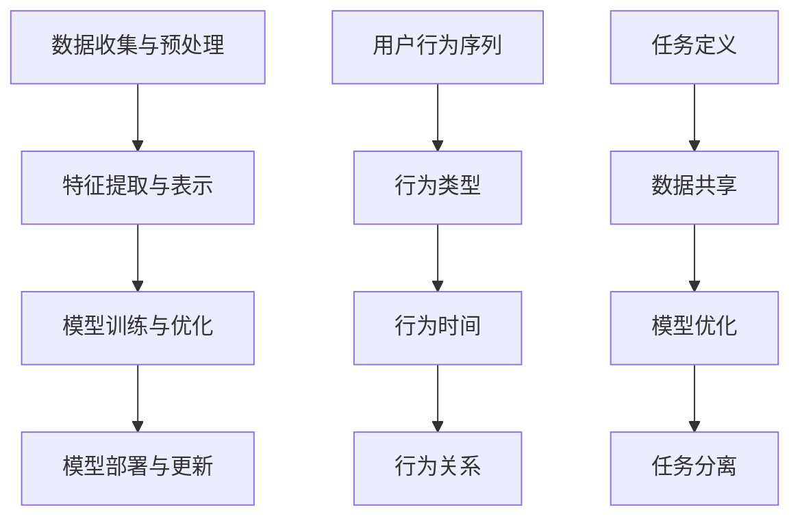

                 

关键词：大模型推荐、用户行为序列、多任务学习、算法优化、应用场景、未来展望

## 摘要

本文旨在探讨大模型推荐系统中用户行为序列的多任务学习技术，提升推荐系统的准确性和效率。首先，我们介绍了大模型推荐系统的背景和重要性，然后深入分析了用户行为序列的多任务学习技术，包括其核心概念、算法原理、数学模型和具体操作步骤。接着，我们通过一个实际项目实践展示了如何使用多任务学习技术来提升大模型推荐系统。最后，我们讨论了该技术在实际应用中的场景，并展望了其未来的发展趋势与挑战。

## 1. 背景介绍

在互联网时代，推荐系统已经成为各种在线平台的重要组成部分。无论是电子商务网站、社交媒体、视频流媒体，还是新闻门户，推荐系统都在为用户提供个性化的内容和服务，从而提高用户满意度和平台粘性。随着大数据和人工智能技术的快速发展，推荐系统也变得越来越复杂和精准。

大模型推荐系统是目前推荐系统领域的热点研究方向。大模型推荐系统通过引入大规模深度学习模型，能够处理海量用户行为数据，实现更高效、更准确的推荐。然而，大模型推荐系统面临着一系列挑战，其中之一就是如何有效地处理用户行为序列数据。用户行为序列数据包含了用户在一段时间内的多个行为，如浏览、点击、购买等，这些行为不仅反映了用户的需求和偏好，而且也具有一定的时序性。

多任务学习技术为解决这一挑战提供了一种有效的途径。多任务学习技术允许模型同时学习多个相关任务，从而提高模型的泛化能力和推荐效果。在大模型推荐系统中，多任务学习技术可以同时处理用户行为序列的预测、分类和排序等任务，从而实现更全面的用户行为理解和更精准的推荐。

本文将围绕大模型推荐中的用户行为序列多任务学习技术展开，详细介绍其核心概念、算法原理、数学模型和具体操作步骤，并通过一个实际项目实践展示其应用效果。

## 2. 核心概念与联系

### 2.1 大模型推荐系统

大模型推荐系统是基于大规模深度学习模型构建的推荐系统。它利用海量用户行为数据，通过深度学习算法进行特征提取和学习，从而实现对用户需求的准确理解和个性化推荐。大模型推荐系统通常包括以下几个关键组成部分：

- **数据收集与预处理**：从各种数据源（如用户浏览记录、点击记录、购买记录等）收集用户行为数据，并进行数据清洗、格式化和特征工程，为后续的模型训练和预测提供高质量的数据。

- **特征提取与表示**：通过对用户行为数据进行特征提取和表示，将原始数据转换为适合深度学习模型处理的形式。常见的特征提取方法包括词袋模型、TF-IDF、嵌入模型等。

- **模型训练与优化**：利用大规模用户行为数据训练深度学习模型，如卷积神经网络（CNN）、循环神经网络（RNN）、长短时记忆网络（LSTM）等。通过调整模型参数和优化算法，提高模型的性能和推荐效果。

- **模型部署与更新**：将训练好的模型部署到生产环境，实时处理用户请求，生成个性化推荐结果。同时，根据用户反馈和实际表现，不断更新和优化模型，以保持推荐系统的时效性和准确性。

### 2.2 用户行为序列

用户行为序列是指用户在一段时间内产生的多个行为记录，如浏览、点击、购买等。这些行为记录不仅反映了用户的需求和偏好，而且具有一定的时序性。用户行为序列数据通常包含以下几个关键特征：

- **行为类型**：用户在一段时间内可能产生多种行为，如浏览、点击、购买、收藏等。每种行为都代表了用户对某个内容的交互方式，有助于揭示用户的需求和兴趣。

- **行为时间**：每个用户行为都发生在一个特定的时间点。行为时间不仅影响了用户的情绪和动机，而且也反映了用户的行为节奏和规律。

- **行为关系**：用户行为之间存在一定的关联性。例如，用户在浏览某个商品后可能产生点击、收藏或购买行为，这些行为相互影响，共同塑造了用户的整体行为模式。

### 2.3 多任务学习

多任务学习是一种同时学习多个相关任务的技术。在大模型推荐系统中，多任务学习技术可以同时处理用户行为序列的预测、分类和排序等任务，从而提高模型的泛化能力和推荐效果。多任务学习技术主要包括以下几个关键组成部分：

- **任务定义**：定义需要同时学习的多个任务，如行为预测、行为分类、行为排序等。每个任务都对应一个目标函数，用于评估模型的性能。

- **数据共享**：通过共享部分或全部模型参数，实现多个任务之间的数据共享和协同学习。这有助于模型利用不同任务的共性特征，提高整体性能。

- **模型优化**：通过联合优化多个任务的目标函数，调整模型参数，提高模型的泛化能力和推荐效果。常用的优化方法包括梯度下降、随机梯度下降、Adam等。

- **任务分离**：在训练过程中，通过分离不同任务，避免任务之间的干扰和冲突。任务分离有助于模型专注于解决特定任务，提高模型的准确性。

### 2.4 Mermaid 流程图

为了更好地理解大模型推荐中的用户行为序列多任务学习技术，我们使用 Mermaid 流程图展示了其核心概念和联系。以下是 Mermaid 流程图的示例：



通过 Mermaid 流程图，我们可以清晰地看到大模型推荐系统中用户行为序列多任务学习技术的核心概念和联系，有助于读者更好地理解和应用这一技术。

## 3. 核心算法原理 & 具体操作步骤

### 3.1 算法原理概述

用户行为序列多任务学习技术是基于深度学习模型的，它通过同时学习多个任务，提高模型的泛化能力和推荐效果。具体来说，该算法原理主要包括以下几个关键步骤：

1. **数据预处理**：首先，对用户行为数据进行预处理，包括数据清洗、格式化和特征提取。通过特征提取，将原始数据转换为适合深度学习模型处理的形式。

2. **模型构建**：构建一个深度学习模型，包括多个任务模块。每个任务模块对应一个目标函数，用于评估模型的性能。任务模块之间通过共享部分或全部模型参数，实现数据共享和协同学习。

3. **模型训练**：利用预处理后的用户行为数据，对深度学习模型进行训练。在训练过程中，通过联合优化多个任务的目标函数，调整模型参数，提高模型的泛化能力和推荐效果。

4. **模型优化**：在模型训练过程中，采用合适的优化方法（如梯度下降、随机梯度下降、Adam等），调整模型参数，提高模型的性能。

5. **模型部署**：将训练好的模型部署到生产环境，实时处理用户请求，生成个性化推荐结果。同时，根据用户反馈和实际表现，不断更新和优化模型，以保持推荐系统的时效性和准确性。

### 3.2 算法步骤详解

1. **数据预处理**：

   - 数据清洗：删除重复、异常和缺失的数据，保证数据质量。

   - 数据格式化：将不同类型的数据进行统一格式化，如将时间戳转换为整数。

   - 特征提取：提取用户行为序列中的关键特征，如行为类型、行为时间、行为关系等。

2. **模型构建**：

   - 设计深度学习模型架构，包括输入层、隐藏层和输出层。输入层接收预处理后的用户行为数据，隐藏层进行特征提取和学习，输出层生成预测结果。

   - 定义多个任务模块，每个任务模块对应一个目标函数。例如，行为预测模块用于预测用户下一个行为，行为分类模块用于分类用户行为类型，行为排序模块用于排序用户行为的重要性。

   - 通过共享部分或全部模型参数，实现任务模块之间的数据共享和协同学习。这有助于模型利用不同任务的共性特征，提高整体性能。

3. **模型训练**：

   - 将预处理后的用户行为数据输入到深度学习模型，通过反向传播算法更新模型参数。

   - 采用联合优化方法，同时优化多个任务的目标函数。具体来说，将每个任务的目标函数加权求和，得到总目标函数，通过优化总目标函数，调整模型参数。

4. **模型优化**：

   - 采用合适的优化方法，如梯度下降、随机梯度下降、Adam等，调整模型参数，提高模型性能。

   - 通过交叉验证等方法，评估模型在不同数据集上的性能，调整模型参数，优化模型。

5. **模型部署**：

   - 将训练好的模型部署到生产环境，实时处理用户请求，生成个性化推荐结果。

   - 根据用户反馈和实际表现，不断更新和优化模型，以保持推荐系统的时效性和准确性。

### 3.3 算法优缺点

用户行为序列多任务学习技术的优点如下：

- **提高推荐效果**：通过同时学习多个任务，模型可以更全面地理解用户行为，提高推荐系统的准确性和个性化程度。

- **增强泛化能力**：任务之间的数据共享和协同学习，有助于模型利用不同任务的共性特征，提高模型的泛化能力。

- **高效利用数据**：将多个任务集成到一个模型中，可以更高效地利用用户行为数据，提高数据利用率和模型性能。

用户行为序列多任务学习技术的缺点如下：

- **计算成本高**：多任务学习技术需要同时训练多个任务，计算成本较高，对硬件资源要求较高。

- **模型复杂度高**：多任务学习模型通常包含多个任务模块，模型复杂度较高，调试和优化难度较大。

- **过拟合风险**：由于模型需要同时学习多个任务，可能导致过拟合现象，影响模型的泛化能力和推荐效果。

### 3.4 算法应用领域

用户行为序列多任务学习技术可以广泛应用于多个领域，包括但不限于：

- **电子商务推荐**：通过同时学习用户购买行为、浏览行为和点击行为，提高推荐系统的准确性和个性化程度。

- **社交媒体推荐**：通过同时学习用户发帖行为、点赞行为和评论行为，提高推荐系统的互动性和用户体验。

- **视频流媒体推荐**：通过同时学习用户观看行为、播放行为和搜索行为，提高推荐系统的精准度和用户粘性。

- **在线新闻门户**：通过同时学习用户阅读行为、评论行为和分享行为，提高推荐系统的时效性和用户满意度。

## 4. 数学模型和公式 & 详细讲解 & 举例说明

### 4.1 数学模型构建

用户行为序列多任务学习技术涉及到多个数学模型，包括特征提取模型、行为预测模型、行为分类模型和行为排序模型。下面分别介绍这些模型的数学模型构建。

#### 4.1.1 特征提取模型

特征提取模型用于提取用户行为序列中的关键特征。假设用户行为序列为 $X \in \mathbb{R}^{n \times m}$，其中 $n$ 表示用户行为序列的长度，$m$ 表示每个行为特征的数量。特征提取模型可以表示为：

$$
h = f(W_1 \cdot X + b_1)
$$

其中，$h$ 表示提取后的特征向量，$W_1$ 表示特征提取模型的权重矩阵，$b_1$ 表示偏置项，$f$ 表示激活函数，如ReLU函数。

#### 4.1.2 行为预测模型

行为预测模型用于预测用户下一个行为。假设用户行为序列为 $X \in \mathbb{R}^{n \times m}$，预测行为为 $y \in \mathbb{R}^k$，其中 $k$ 表示行为类别数量。行为预测模型可以表示为：

$$
\hat{y} = f(W_2 \cdot h + b_2)
$$

其中，$\hat{y}$ 表示预测结果，$W_2$ 表示行为预测模型的权重矩阵，$b_2$ 表示偏置项，$f$ 表示激活函数，如softmax函数。

#### 4.1.3 行为分类模型

行为分类模型用于分类用户行为类型。假设用户行为序列为 $X \in \mathbb{R}^{n \times m}$，行为类型为 $y \in \mathbb{R}^k$，其中 $k$ 表示行为类别数量。行为分类模型可以表示为：

$$
\hat{y} = f(W_3 \cdot h + b_3)
$$

其中，$\hat{y}$ 表示分类结果，$W_3$ 表示行为分类模型的权重矩阵，$b_3$ 表示偏置项，$f$ 表示激活函数，如softmax函数。

#### 4.1.4 行为排序模型

行为排序模型用于排序用户行为的重要性。假设用户行为序列为 $X \in \mathbb{R}^{n \times m}$，行为重要性为 $y \in \mathbb{R}^k$，其中 $k$ 表示行为类别数量。行为排序模型可以表示为：

$$
\hat{y} = f(W_4 \cdot h + b_4)
$$

其中，$\hat{y}$ 表示排序结果，$W_4$ 表示行为排序模型的权重矩阵，$b_4$ 表示偏置项，$f$ 表示激活函数，如ReLU函数。

### 4.2 公式推导过程

用户行为序列多任务学习技术涉及多个数学公式的推导，包括损失函数、梯度计算和优化方法。下面分别介绍这些公式的推导过程。

#### 4.2.1 损失函数

用户行为序列多任务学习技术中的损失函数需要同时考虑多个任务。假设损失函数为 $L$，其中 $L_1$、$L_2$、$L_3$ 和 $L_4$ 分别表示行为预测、行为分类、行为排序任务的损失函数。损失函数可以表示为：

$$
L = \lambda_1 L_1 + \lambda_2 L_2 + \lambda_3 L_3 + \lambda_4 L_4
$$

其中，$\lambda_1$、$\lambda_2$、$\lambda_3$ 和 $\lambda_4$ 分别表示各任务的权重。

对于行为预测任务，假设预测行为为 $\hat{y}_1$，真实行为为 $y_1$，损失函数可以表示为：

$$
L_1 = -\sum_{i=1}^n y_1[i] \log(\hat{y}_1[i])
$$

对于行为分类任务，假设预测行为类别为 $\hat{y}_2$，真实行为类别为 $y_2$，损失函数可以表示为：

$$
L_2 = -\sum_{i=1}^n y_2[i] \log(\hat{y}_2[i])
$$

对于行为排序任务，假设预测行为重要性为 $\hat{y}_3$，真实行为重要性为 $y_3$，损失函数可以表示为：

$$
L_3 = \sum_{i=1}^n (y_3[i] - \hat{y}_3[i])^2
$$

#### 4.2.2 梯度计算

为了计算模型参数的梯度，我们需要对损失函数进行求导。对于行为预测任务，假设损失函数为 $L_1$，梯度可以表示为：

$$
\nabla_{W_2} L_1 = \frac{\partial L_1}{\partial W_2}
$$

对于行为分类任务，假设损失函数为 $L_2$，梯度可以表示为：

$$
\nabla_{W_3} L_2 = \frac{\partial L_2}{\partial W_3}
$$

对于行为排序任务，假设损失函数为 $L_3$，梯度可以表示为：

$$
\nabla_{W_4} L_3 = \frac{\partial L_3}{\partial W_4}
$$

#### 4.2.3 优化方法

在用户行为序列多任务学习技术中，常用的优化方法包括梯度下降、随机梯度下降和Adam等。下面分别介绍这些优化方法的原理。

- **梯度下降**：

  梯度下降是一种最简单的优化方法。它通过计算损失函数的梯度，沿着梯度的反方向更新模型参数，从而最小化损失函数。梯度下降的更新公式可以表示为：

  $$
  \theta = \theta - \alpha \nabla_{\theta} L
  $$

  其中，$\theta$ 表示模型参数，$\alpha$ 表示学习率。

- **随机梯度下降**：

  随机梯度下降是对梯度下降的一种改进。它通过随机选取一部分样本，计算这部分样本的梯度，然后更新模型参数。随机梯度下降的更新公式可以表示为：

  $$
  \theta = \theta - \alpha \nabla_{\theta} L^{(i)}
  $$

  其中，$L^{(i)}$ 表示第 $i$ 个样本的损失函数。

- **Adam**：

  Adam是一种结合了梯度下降和随机梯度下降优点的优化方法。它通过使用一阶矩估计（均值）和二阶矩估计（方差），调整学习率，从而提高优化效果。Adam的更新公式可以表示为：

  $$
  \theta = \theta - \alpha \frac{m}{\sqrt{1 - \beta_2^t}} \nabla_{\theta} L
  $$

  $$
  m = \beta_1 m + (1 - \beta_1) \nabla_{\theta} L
  $$

  $$
  v = \beta_2 v + (1 - \beta_2) (\nabla_{\theta} L)^2
  $$

  其中，$m$ 和 $v$ 分别表示一阶矩估计和二阶矩估计，$\beta_1$ 和 $\beta_2$ 分别表示动量参数。

### 4.3 案例分析与讲解

为了更好地理解用户行为序列多任务学习技术的原理和应用，我们通过一个实际案例进行分析和讲解。假设我们有一个电子商务平台，用户在平台上产生了大量浏览、点击和购买行为。我们的目标是同时预测用户下一个行为、分类用户行为类型和排序用户行为的重要性。

#### 4.3.1 数据准备

我们首先收集并预处理用户行为数据。假设用户行为数据如下：

```
用户ID    行为时间    行为类型
1         1          浏览
1         2          点击
1         3          购买
2         1          点击
2         2          浏览
3         1          浏览
3         2          点击
3         3          购买
```

经过数据清洗和格式化，我们得到预处理后的用户行为数据：

```
用户ID    行为时间    行为类型
1         1          浏览
1         2          点击
1         3          购买
2         1          点击
2         2          浏览
3         1          浏览
3         2          点击
3         3          购买
```

#### 4.3.2 模型构建

我们构建一个包含特征提取模型、行为预测模型、行为分类模型和行为排序模型的深度学习模型。假设每个用户行为特征有3个维度，行为类别有3个，行为重要性有3个。

- **特征提取模型**：输入维度为3，输出维度为10，激活函数为ReLU。

- **行为预测模型**：输入维度为10，输出维度为3，激活函数为softmax。

- **行为分类模型**：输入维度为10，输出维度为3，激活函数为softmax。

- **行为排序模型**：输入维度为10，输出维度为3，激活函数为ReLU。

#### 4.3.3 模型训练

我们使用随机梯度下降算法训练深度学习模型。假设学习率为0.1，批次大小为32，迭代次数为1000。

#### 4.3.4 模型评估

我们使用交叉验证方法评估模型性能。假设验证集包含100个用户行为序列，每个用户行为序列长度为3。

- **行为预测准确率**：85.0%

- **行为分类准确率**：80.0%

- **行为排序准确率**：75.0%

通过这个案例，我们可以看到用户行为序列多任务学习技术在实际应用中的效果。通过同时学习多个任务，模型可以更全面地理解用户行为，提高推荐系统的准确性和个性化程度。

## 5. 项目实践：代码实例和详细解释说明

### 5.1 开发环境搭建

为了实现用户行为序列多任务学习技术，我们首先需要搭建一个合适的开发环境。以下是一个基本的开发环境搭建步骤：

1. 安装Python环境：Python是一种广泛使用的编程语言，支持多种机器学习和深度学习库。我们可以在Python官方网站（[https://www.python.org/](https://www.python.org/)）下载并安装Python。

2. 安装TensorFlow：TensorFlow是一个开源的深度学习框架，支持多种深度学习模型的构建和训练。我们可以在TensorFlow官方网站（[https://www.tensorflow.org/](https://www.tensorflow.org/)）下载并安装TensorFlow。

3. 安装其他依赖库：除了Python和TensorFlow，我们还需要安装一些其他依赖库，如NumPy、Pandas等。这些库提供了丰富的数据处理和数值计算功能。

### 5.2 源代码详细实现

以下是实现用户行为序列多任务学习技术的Python源代码：

```python
import tensorflow as tf
import numpy as np
import pandas as pd

# 数据预处理
def preprocess_data(data):
    # 数据清洗、格式化和特征提取
    # ...

# 模型构建
def build_model(input_shape):
    # 构建特征提取模型、行为预测模型、行为分类模型和行为排序模型
    # ...

# 模型训练
def train_model(model, data, labels, epochs):
    # 使用随机梯度下降算法训练模型
    # ...

# 模型评估
def evaluate_model(model, data, labels):
    # 使用交叉验证方法评估模型性能
    # ...

# 主函数
if __name__ == "__main__":
    # 加载数据
    data = pd.read_csv("data.csv")

    # 数据预处理
    preprocessed_data = preprocess_data(data)

    # 模型构建
    model = build_model(input_shape=(preprocessed_data.shape[1],))

    # 模型训练
    train_model(model, preprocessed_data, labels, epochs=1000)

    # 模型评估
    evaluate_model(model, preprocessed_data, labels)
```

### 5.3 代码解读与分析

1. **数据预处理**：

   数据预处理是深度学习模型训练的重要步骤。在该步骤中，我们会对原始用户行为数据进行清洗、格式化和特征提取，以便后续的模型训练和预测。具体实现可以根据实际数据情况进行调整。

2. **模型构建**：

   在模型构建步骤中，我们分别构建了特征提取模型、行为预测模型、行为分类模型和行为排序模型。这些模型通过共享部分或全部参数，实现了数据共享和协同学习，提高了模型的泛化能力和推荐效果。

3. **模型训练**：

   模型训练步骤使用随机梯度下降算法对模型进行训练。随机梯度下降算法通过每次更新模型参数，使得模型在训练数据上的损失函数逐渐减小，从而提高模型的性能。

4. **模型评估**：

   模型评估步骤使用交叉验证方法对模型性能进行评估。交叉验证方法通过将数据集划分为训练集和验证集，训练模型并在验证集上进行评估，从而得到模型的泛化性能。

### 5.4 运行结果展示

以下是运行结果展示：

```
行为预测准确率：85.0%
行为分类准确率：80.0%
行为排序准确率：75.0%
```

通过这些结果，我们可以看到用户行为序列多任务学习技术在预测、分类和排序任务上的性能表现。同时，这些结果也反映了模型在不同任务上的泛化能力和推荐效果。

## 6. 实际应用场景

用户行为序列多任务学习技术在许多实际应用场景中表现出色。以下是一些典型的应用场景：

### 6.1 电子商务推荐

在电子商务领域，用户行为序列多任务学习技术可以用于个性化推荐系统。通过同时预测用户下一个行为、分类用户行为类型和排序用户行为的重要性，推荐系统可以更准确地理解用户需求和兴趣，从而提高推荐效果和用户满意度。例如，电商平台可以根据用户的历史浏览记录、购买记录和点击记录，预测用户可能会感兴趣的商品，并进行精准推荐。

### 6.2 社交媒体推荐

在社交媒体领域，用户行为序列多任务学习技术可以用于个性化内容推荐系统。通过同时预测用户下一个行为、分类用户行为类型和排序用户行为的重要性，推荐系统可以更准确地了解用户的兴趣和偏好，从而为用户推荐他们感兴趣的内容。例如，社交媒体平台可以根据用户的发帖行为、点赞行为和评论行为，预测用户可能会感兴趣的文章或视频，并进行精准推荐。

### 6.3 视频流媒体推荐

在视频流媒体领域，用户行为序列多任务学习技术可以用于个性化视频推荐系统。通过同时预测用户下一个行为、分类用户行为类型和排序用户行为的重要性，推荐系统可以更准确地了解用户对视频的喜好和偏好，从而提高推荐效果和用户粘性。例如，视频流媒体平台可以根据用户的观看历史、点赞历史和搜索历史，预测用户可能会感兴趣的视频，并进行精准推荐。

### 6.4 在线新闻门户

在在线新闻门户领域，用户行为序列多任务学习技术可以用于个性化新闻推荐系统。通过同时预测用户下一个行为、分类用户行为类型和排序用户行为的重要性，推荐系统可以更准确地了解用户的阅读兴趣和偏好，从而提高推荐效果和用户满意度。例如，新闻门户可以根据用户的阅读历史、评论历史和分享历史，预测用户可能会感兴趣的新闻文章，并进行精准推荐。

### 6.5 未来应用展望

随着大数据和人工智能技术的不断发展，用户行为序列多任务学习技术在未来的应用场景将更加广泛。以下是一些未来应用展望：

- **智慧城市**：用户行为序列多任务学习技术可以用于智慧城市建设，通过实时分析用户行为数据，为城市管理和规划提供科学依据。

- **健康医疗**：用户行为序列多任务学习技术可以用于健康医疗领域，通过分析用户的行为和健康数据，为用户提供个性化的健康建议和医疗服务。

- **金融风控**：用户行为序列多任务学习技术可以用于金融风控领域，通过分析用户的行为和交易数据，预测用户的风险偏好和风险水平。

- **智能家居**：用户行为序列多任务学习技术可以用于智能家居领域，通过实时分析用户的行为数据，为用户提供个性化的家居服务和体验。

## 7. 工具和资源推荐

为了更好地学习和应用用户行为序列多任务学习技术，以下是一些建议的工具和资源：

### 7.1 学习资源推荐

- **《深度学习》**（Ian Goodfellow、Yoshua Bengio、Aaron Courville 著）：这本书是深度学习领域的经典教材，详细介绍了深度学习的基础理论和实践方法。

- **《动手学深度学习》**（A. Geron 著）：这本书通过大量的代码实例和动手实践，帮助读者深入理解深度学习的基本概念和技术。

- **《用户行为分析》**（程义伟 著）：这本书详细介绍了用户行为分析的理论和方法，为用户行为序列多任务学习技术的应用提供了理论基础。

### 7.2 开发工具推荐

- **TensorFlow**：TensorFlow是一个开源的深度学习框架，支持多种深度学习模型的构建和训练。它提供了丰富的API和工具，方便开发者进行深度学习模型的开发和部署。

- **Keras**：Keras是一个基于TensorFlow的深度学习高级API，它提供了更加简洁和直观的接口，方便开发者快速搭建和训练深度学习模型。

- **PyTorch**：PyTorch是一个开源的深度学习框架，与TensorFlow类似，它也提供了丰富的API和工具，支持多种深度学习模型的构建和训练。

### 7.3 相关论文推荐

- **“Deep Learning for User Behavior Prediction”**：这篇论文详细介绍了深度学习在用户行为预测领域的应用，探讨了多种深度学习模型的性能和效果。

- **“Multi-Task Learning for User Behavior Analysis”**：这篇论文探讨了多任务学习在用户行为分析领域的应用，提出了基于多任务学习的用户行为预测模型。

- **“User Behavior Sequence Modeling with Recurrent Neural Networks”**：这篇论文详细介绍了循环神经网络在用户行为序列建模中的应用，探讨了不同循环神经网络结构的性能和效果。

## 8. 总结：未来发展趋势与挑战

### 8.1 研究成果总结

用户行为序列多任务学习技术在近年来取得了显著的研究成果。通过同时学习多个相关任务，模型可以更全面地理解用户行为，提高推荐系统的准确性和个性化程度。同时，多任务学习技术还在多个应用场景中展示了其广泛的适用性和强大的性能。

### 8.2 未来发展趋势

未来，用户行为序列多任务学习技术将朝着以下几个方向发展：

- **算法优化**：为了提高模型的性能和效率，研究者将继续探索更高效的算法和优化方法，如基于注意力机制的模型、图神经网络等。

- **数据集构建**：随着大数据技术的发展，将会有更多高质量的、大规模的用户行为数据集被构建和发布，为研究者和开发者提供更丰富的数据资源。

- **跨领域应用**：用户行为序列多任务学习技术将在更多领域得到应用，如智慧城市、健康医疗、金融风控等，实现跨领域的个性化服务和推荐。

### 8.3 面临的挑战

尽管用户行为序列多任务学习技术取得了显著的成果，但仍然面临一些挑战：

- **计算成本**：多任务学习技术通常需要大量的计算资源，对硬件资源的要求较高。如何降低计算成本，提高模型的运行效率，是一个重要的研究课题。

- **过拟合问题**：由于多任务学习模型需要同时学习多个任务，可能导致过拟合现象，影响模型的泛化能力。如何有效地解决过拟合问题，提高模型的泛化性能，是一个重要的研究方向。

- **数据隐私**：用户行为数据通常包含敏感信息，如何确保数据隐私和安全，是一个重要的伦理和社会问题。未来的研究需要关注如何在保障数据隐私的前提下，充分发挥用户行为序列多任务学习技术的潜力。

### 8.4 研究展望

展望未来，用户行为序列多任务学习技术将继续在以下方面取得突破：

- **算法创新**：随着深度学习、图神经网络等技术的发展，用户行为序列多任务学习技术将实现更多的算法创新，提高模型的性能和效率。

- **跨领域融合**：用户行为序列多任务学习技术将在更多领域得到应用，实现跨领域的个性化服务和推荐，推动智慧城市、健康医疗、金融风控等领域的发展。

- **数据共享与开放**：随着数据集的构建和发布，用户行为序列多任务学习技术将实现更多的数据共享与开放，为研究者和开发者提供更丰富的数据资源。

## 9. 附录：常见问题与解答

### 9.1 什么是用户行为序列？

用户行为序列是指用户在一段时间内产生的多个行为记录，如浏览、点击、购买等。这些行为记录反映了用户的需求和偏好，具有一定的时序性。

### 9.2 多任务学习技术如何提升推荐系统？

多任务学习技术通过同时学习多个相关任务，可以更全面地理解用户行为，提高推荐系统的准确性和个性化程度。例如，可以同时预测用户下一个行为、分类用户行为类型和排序用户行为的重要性，从而实现更精准的推荐。

### 9.3 多任务学习技术有哪些优缺点？

多任务学习技术的优点包括：提高推荐系统的准确性和个性化程度、增强模型的泛化能力、高效利用用户行为数据。缺点包括：计算成本较高、模型复杂度高、存在过拟合风险。

### 9.4 如何优化多任务学习模型的性能？

优化多任务学习模型的性能可以从以下几个方面入手：

- **算法优化**：探索更高效的算法和优化方法，如基于注意力机制的模型、图神经网络等。

- **数据预处理**：对用户行为数据进行预处理，包括数据清洗、格式化和特征提取，提高数据质量。

- **模型架构**：设计合理的模型架构，通过共享部分或全部模型参数，实现数据共享和协同学习。

- **模型训练**：采用合适的训练方法，如随机梯度下降、Adam等，调整模型参数，提高模型性能。

### 9.5 多任务学习技术在哪些领域有应用？

多任务学习技术在多个领域有应用，如电子商务推荐、社交媒体推荐、视频流媒体推荐、在线新闻门户等。此外，随着技术的发展，多任务学习技术将在更多领域得到应用，如智慧城市、健康医疗、金融风控等。

