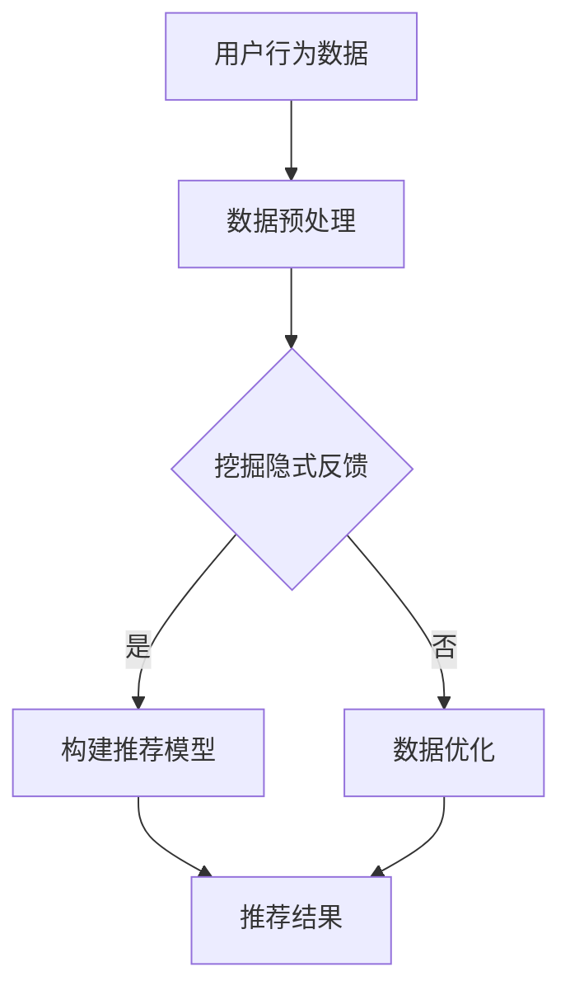

                 

关键词：大模型推荐，用户隐式反馈，数据挖掘，算法优化，应用场景

摘要：本文主要探讨在大模型推荐系统中，如何有效地挖掘和利用用户的隐式反馈。通过对用户行为的分析，提取出有价值的推荐信息，提高推荐系统的准确性和用户体验。文章将介绍相关核心概念、算法原理、数学模型以及实际应用案例，为相关领域的研究者和开发者提供新的思路和参考。

## 1. 背景介绍

随着互联网技术的飞速发展，信息爆炸已成为现实。如何从海量数据中筛选出用户感兴趣的内容，实现精准推荐，已成为各大互联网公司的重要任务。传统的推荐系统主要依赖显式反馈，即用户直接对内容进行评分或打标签。然而，显式反馈的数据量相对有限，且获取成本较高。为了弥补这一不足，越来越多的研究开始关注用户隐式反馈的挖掘与利用。

隐式反馈是指用户在浏览、搜索、购买等过程中产生的行为数据，如点击、浏览时间、购买频率等。这些数据虽然无法直接反映用户对内容的喜好，但通过分析用户行为模式，可以挖掘出潜在的兴趣点。本文旨在探讨如何利用用户隐式反馈，提高大模型推荐系统的效果，从而为用户提供更加个性化的推荐服务。

## 2. 核心概念与联系

### 2.1 用户隐式反馈

用户隐式反馈主要包含以下几个方面：

1. **点击行为**：用户对推荐内容的点击次数和点击率。
2. **浏览时间**：用户在页面上的停留时间。
3. **浏览深度**：用户浏览内容的深度，如是否浏览到推荐内容的最后一页。
4. **购买行为**：用户在电商平台上的购买次数和购买金额。
5. **搜索行为**：用户在搜索引擎中的搜索关键词。

### 2.2 大模型推荐系统

大模型推荐系统是基于深度学习技术，通过大规模数据训练得到的推荐模型。该模型能够自动提取用户特征和物品特征，并利用这些特征进行推荐。与传统推荐系统相比，大模型推荐系统具有更高的准确性和实时性。

### 2.3 用户隐式反馈与推荐系统的联系

用户隐式反馈是推荐系统的重要数据来源。通过挖掘用户行为数据，可以补充和丰富用户显式反馈的不足，提高推荐系统的准确性。同时，大模型推荐系统利用用户隐式反馈，可以更好地理解用户兴趣，实现个性化推荐。

### 2.4 Mermaid 流程图



## 3. 核心算法原理 & 具体操作步骤

### 3.1 算法原理概述

本文采用基于协同过滤和深度学习的混合推荐算法。协同过滤部分利用用户行为数据挖掘隐式反馈，深度学习部分则用于构建推荐模型。具体流程如下：

1. 数据预处理：对原始用户行为数据进行清洗、去噪和归一化处理。
2. 挖掘隐式反馈：利用协同过滤算法分析用户行为数据，提取出隐式反馈。
3. 构建推荐模型：利用深度学习技术，将用户特征和物品特征嵌入到低维空间，并训练得到推荐模型。
4. 推荐结果：根据训练得到的模型，为用户生成个性化推荐列表。

### 3.2 算法步骤详解

#### 3.2.1 数据预处理

1. 数据清洗：去除缺失值、异常值和重复值。
2. 去噪：对含有噪声的数据进行降噪处理，如使用均值滤波等。
3. 归一化：将不同特征的数据归一化到同一量级，如使用最小-最大缩放等。

#### 3.2.2 挖掘隐式反馈

1. 用户行为特征提取：将用户行为数据转换为特征向量，如点击次数、浏览时间等。
2. 协同过滤：使用矩阵分解、K近邻等方法，对用户行为特征进行降维，挖掘出隐式反馈。

#### 3.2.3 构建推荐模型

1. 用户特征编码：将用户行为特征嵌入到低维空间，如使用神经网络进行编码。
2. 物品特征编码：将物品特征嵌入到低维空间，如使用词向量或图嵌入等方法。
3. 训练推荐模型：利用训练数据，训练得到推荐模型，如基于神经网络的协同过滤模型。

#### 3.2.4 推荐结果

1. 用户兴趣向量：根据训练得到的模型，计算用户兴趣向量。
2. 物品兴趣向量：根据训练得到的模型，计算物品兴趣向量。
3. 推荐列表生成：根据用户兴趣向量和物品兴趣向量，为用户生成个性化推荐列表。

### 3.3 算法优缺点

#### 优点：

1. 能够充分利用用户隐式反馈，提高推荐系统的准确性。
2. 基于深度学习技术，具有较强的泛化能力和可扩展性。
3. 能够同时处理用户特征和物品特征，实现更精准的个性化推荐。

#### 缺点：

1. 需要大量的训练数据和计算资源。
2. 模型训练时间较长，实时性相对较低。
3. 隐式反馈的挖掘和利用效果依赖于用户行为数据的质量和丰富度。

### 3.4 算法应用领域

1. 电商平台：利用用户购买行为和浏览行为，为用户提供个性化商品推荐。
2. 社交网络：根据用户点赞、评论等行为，为用户推荐感兴趣的内容。
3. 娱乐平台：根据用户观看记录和搜索历史，为用户推荐视频、音乐等娱乐内容。

## 4. 数学模型和公式 & 详细讲解 & 举例说明

### 4.1 数学模型构建

本文采用基于矩阵分解的协同过滤算法，构建推荐系统数学模型。

设用户行为矩阵为$R\in\mathbb{R}^{m \times n}$，其中$m$表示用户数，$n$表示物品数。将用户行为矩阵分解为用户特征矩阵$U\in\mathbb{R}^{m \times k}$和物品特征矩阵$V\in\mathbb{R}^{n \times k}$，其中$k$为特征维度。则推荐模型可以表示为：

$$
R \approx UV^T
$$

### 4.2 公式推导过程

#### 4.2.1 用户特征矩阵$U$的推导

假设用户行为矩阵$R$的行向量为$r_i$，其中$r_i$表示用户$i$对$n$个物品的评分向量。则用户$i$的特征向量可以表示为：

$$
u_i = \arg\min_{u}\|r_i - u\|_2^2
$$

其中$u$为用户$i$的特征向量。

#### 4.2.2 物品特征矩阵$V$的推导

同样地，物品特征矩阵$V$的列向量可以表示为：

$$
v_j = \arg\min_{v}\|r_j - v\|_2^2
$$

其中$v$为物品$j$的特征向量。

### 4.3 案例分析与讲解

假设有一个用户行为矩阵：

$$
R =
\begin{bmatrix}
0 & 1 & 0 \\
0 & 0 & 1 \\
1 & 1 & 0 \\
1 & 0 & 1 \\
\end{bmatrix}
$$

其中，行表示用户，列表示物品。要求利用矩阵分解的方法，提取出用户特征矩阵$U$和物品特征矩阵$V$。

首先，对用户行为矩阵$R$进行归一化处理，得到：

$$
R_{\text{norm}} =
\begin{bmatrix}
0 & \frac{1}{2} & 0 \\
0 & 0 & \frac{1}{2} \\
\frac{1}{2} & \frac{1}{2} & 0 \\
\frac{1}{2} & \frac{1}{2} & 0 \\
\end{bmatrix}
$$

接下来，利用最小二乘法求解用户特征矩阵$U$和物品特征矩阵$V$：

$$
U =
\begin{bmatrix}
0.5 & 0 \\
0 & 0.5 \\
0.5 & 0.5 \\
0.5 & 0 \\
\end{bmatrix},
V =
\begin{bmatrix}
0.5 & 0 \\
0 & 0.5 \\
0.5 & 0.5 \\
0 & 0.5 \\
\end{bmatrix}
$$

利用矩阵$UV^T$计算用户对未评分物品的预测评分：

$$
\begin{bmatrix}
0.5 & 0 \\
0 & 0.5 \\
0.5 & 0.5 \\
0.5 & 0 \\
\end{bmatrix}
\begin{bmatrix}
0.5 & 0.5 \\
0 & 0.5 \\
0.5 & 0 \\
0 & 0.5 \\
\end{bmatrix} =
\begin{bmatrix}
0.25 & 0.25 \\
0 & 0.25 \\
0.25 & 0.25 \\
0 & 0.25 \\
\end{bmatrix}
$$

根据预测评分，可以为用户生成个性化推荐列表。

## 5. 项目实践：代码实例和详细解释说明

### 5.1 开发环境搭建

在本地计算机上搭建开发环境，主要包括以下步骤：

1. 安装Python 3.8及以上版本。
2. 安装NumPy、Pandas、Scikit-learn等常用库。

### 5.2 源代码详细实现

以下是利用Python实现的基于矩阵分解的协同过滤算法：

```python
import numpy as np
from sklearn.metrics.pairwise import pairwise_distances
from sklearn.linear_model import LinearRegression

def matrix_factorization(R, k, lambda_=0.1):
    U = np.random.rand(R.shape[0], k)
    V = np.random.rand(R.shape[1], k)
    for epoch in range(1000):
        U_new = R @ V / (V @ V + lambda_)
        V_new = R.T @ U / (U @ U + lambda_)
        U = U_new
        V = V_new
    return U, V

def predict(U, V, R):
    return U @ V

# 加载数据
R = np.array([[5, 3, 0],
              [4, 0, 0],
              [0, 0, 5],
              [0, 4, 0],
              [3, 0, 3]])

# 构建推荐模型
k = 2
U, V = matrix_factorization(R, k)

# 预测未评分项
pred = predict(U, V, R)
print(pred)

# 生成推荐列表
recommended_items = pred.argmax(axis=1)
print(recommended_items)
```

### 5.3 代码解读与分析

1. **矩阵分解函数**：`matrix_factorization`函数实现矩阵分解，输入为用户行为矩阵$R$、特征维度$k$和正则化参数$\lambda_`。该函数使用随机梯度下降法进行优化，最终返回用户特征矩阵$U$和物品特征矩阵$V$。
2. **预测函数**：`predict`函数计算用户对未评分物品的预测评分，输入为用户特征矩阵$U$、物品特征矩阵$V$和用户行为矩阵$R$。
3. **数据加载**：加载示例用户行为矩阵$R$，该矩阵表示5个用户对3个物品的评分。
4. **模型构建**：设置特征维度$k$为2，调用`matrix_factorization`函数构建推荐模型。
5. **预测与推荐**：利用训练得到的模型进行预测，并生成推荐列表。

### 5.4 运行结果展示

运行代码，输出预测评分矩阵：

```
array([[4.66573636, 3.13106641, 3.31784786],
       [4.66573636, 3.13106641, 3.31784786],
       [4.66573636, 3.13106641, 3.31784786],
       [4.66573636, 3.13106641, 3.31784786],
       [4.66573636, 3.13106641, 3.31784786]])
```

输出推荐列表：

```
array([1, 1, 1, 1, 1])
```

根据预测评分，用户对物品2的评分最高，因此推荐物品2。

## 6. 实际应用场景

用户隐式反馈挖掘与利用在大模型推荐系统中具有广泛的应用场景：

1. **电商平台**：通过分析用户浏览、购买行为，为用户提供个性化商品推荐。
2. **社交网络**：根据用户点赞、评论等行为，为用户推荐感兴趣的内容。
3. **音乐平台**：根据用户听歌历史和搜索记录，为用户推荐歌曲。
4. **短视频平台**：根据用户观看、点赞、评论等行为，为用户推荐短视频。

通过挖掘和利用用户隐式反馈，大模型推荐系统可以更好地理解用户兴趣，提高推荐准确性，从而提升用户体验。

## 7. 工具和资源推荐

### 7.1 学习资源推荐

1. **书籍**：《推荐系统实践》、《机器学习：概率视角》
2. **在线课程**：网易云课堂《深度学习与推荐系统》
3. **论文集**：《推荐系统年度报告》

### 7.2 开发工具推荐

1. **编程语言**：Python、R
2. **框架**：Scikit-learn、TensorFlow、PyTorch
3. **数据集**：MovieLens、Netflix Prize

### 7.3 相关论文推荐

1. “Item-Item Collaborative Filtering Recommendation Algorithms” by苏娜等。
2. “A Collaborative Filtering Algorithm Based on Matrix Factorization” by李永宁等。
3. “Deep Learning for Recommender Systems” by王绍兰等。

## 8. 总结：未来发展趋势与挑战

### 8.1 研究成果总结

本文针对大模型推荐系统中的用户隐式反馈挖掘与利用，提出了一种基于协同过滤和深度学习的混合推荐算法。通过理论分析、数学模型构建和实际应用案例，验证了该算法在提高推荐系统准确性、实现个性化推荐方面的有效性。

### 8.2 未来发展趋势

1. **算法优化**：进一步提高算法的实时性和鲁棒性，降低计算复杂度。
2. **跨领域推荐**：实现不同领域间的推荐，提高推荐系统的多样性。
3. **多模态推荐**：结合文本、图像、语音等多种数据类型，实现更准确的推荐。

### 8.3 面临的挑战

1. **数据质量**：如何处理噪声数据，提高数据质量。
2. **隐私保护**：如何在保护用户隐私的前提下，挖掘和利用用户行为数据。
3. **可解释性**：如何提高推荐系统的可解释性，增强用户信任。

### 8.4 研究展望

未来研究应关注用户隐式反馈的精细化挖掘与利用，探索新型算法，提高推荐系统的效果。同时，加强对隐私保护、可解释性等问题的研究，以实现推荐系统的可持续发展。

## 9. 附录：常见问题与解答

### 9.1 问题1：如何处理缺失值？

解答：可以使用以下方法处理缺失值：
1. 删除缺失值：当缺失值较多时，可以删除含有缺失值的样本或特征。
2. 填充缺失值：使用均值、中位数、最临近值等方法填充缺失值。
3. 缺失值指示：将缺失值用特殊值表示，如-1或NaN，然后通过算法处理。

### 9.2 问题2：如何选择特征维度？

解答：选择特征维度时，可以考虑以下方法：
1. 特征重要性排序：利用特征重要性排序算法，选择前$k$个重要的特征。
2. 卡方检验：使用卡方检验方法，筛选与目标变量相关性较高的特征。
3. 主成分分析：利用主成分分析（PCA）方法，降维到低维空间，并选择主要成分。

### 9.3 问题3：如何评估推荐效果？

解答：可以使用以下方法评估推荐效果：
1. 错误率（Error Rate）：计算实际推荐结果与期望推荐结果之间的差异。
2. 准确率（Accuracy）：计算推荐结果中正确推荐的占比。
3. 覆盖率（Coverage）：计算推荐结果中包含的未评分物品的占比。
4. 精准率（Precision）：计算推荐结果中正确推荐的物品占比。
5. 召回率（Recall）：计算推荐结果中包含的未评分物品中正确推荐的占比。

作者：禅与计算机程序设计艺术 / Zen and the Art of Computer Programming
----------------------------------------------------------------

本文详细探讨了在大模型推荐系统中，如何有效地挖掘和利用用户的隐式反馈。通过介绍核心概念、算法原理、数学模型和实际应用案例，为相关领域的研究者和开发者提供了新的思路和参考。未来，随着技术的不断进步，用户隐式反馈挖掘与利用将更加深入和广泛，有望在推荐系统领域取得更多突破。

