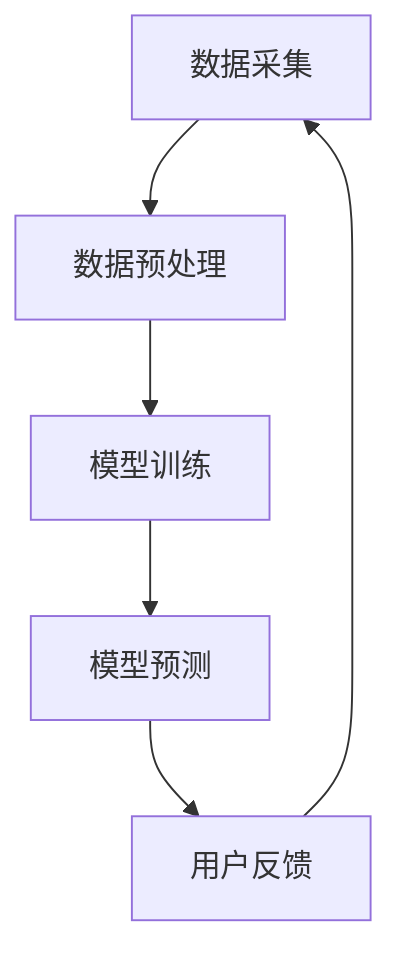

                 

关键词：大模型推荐、用户隐私、安全风险、加密技术、隐私保护机制、机器学习算法

摘要：本文深入探讨了在大模型推荐系统中，用户隐私和安全面临的多重挑战。通过对用户数据加密、匿名化处理和隐私保护机制的介绍，本文分析了当前技术手段的优缺点，并展望了未来的研究方向。文章旨在为从业者和研究者提供关于大模型推荐系统隐私保护的全面视角。

## 1. 背景介绍

随着人工智能和大数据技术的飞速发展，推荐系统已经成为互联网公司获取用户、提高用户粘性和转化率的重要手段。这些系统利用用户的历史行为数据，通过复杂的算法模型预测用户的兴趣偏好，从而向用户推荐个性化的内容或产品。然而，推荐系统在为用户提供便利的同时，也引发了用户隐私和安全问题的广泛关注。

用户隐私是指在用户使用互联网服务过程中，其个人身份、行为习惯、偏好信息等不被未授权方获取和利用。随着推荐系统不断收集和分析用户数据，用户隐私面临着前所未有的威胁。例如，用户在浏览、搜索、购买等行为中产生的数据可能会被不法分子利用，进行精准的诈骗和欺诈行为。此外，推荐系统服务商也可能因为商业利益，未经用户同意将用户数据出售给第三方，造成用户隐私泄露。

安全风险则是指推荐系统在设计和运行过程中，可能存在的各种安全隐患。例如，黑客可能通过入侵系统获取大量用户数据，或者利用漏洞对系统进行恶意攻击。此外，推荐系统的算法模型也可能存在漏洞，被恶意攻击者利用，造成系统推荐结果的偏差或误导用户。

因此，在大模型推荐系统中保障用户隐私和安全已经成为一个亟待解决的问题。本文将围绕这一主题，探讨用户隐私与安全问题，分析现有技术手段，并提出未来的研究方向。

## 2. 核心概念与联系

### 2.1 大模型推荐系统基本架构

大模型推荐系统通常由数据采集、数据预处理、模型训练和模型预测四个主要模块组成。首先，数据采集模块负责收集用户的历史行为数据，如浏览记录、搜索关键词、购买记录等。这些数据经过数据预处理模块的清洗、去噪和转换，转化为适合模型训练的数据集。接下来，模型训练模块利用这些数据集，通过机器学习算法训练出推荐模型。最后，模型预测模块将训练好的模型应用于新数据，生成个性化的推荐结果。


### 2.2 用户隐私保护的核心概念

在大模型推荐系统中，用户隐私保护的核心概念包括数据加密、匿名化和隐私保护机制。

**数据加密**：数据加密是指通过加密算法将明文数据转换为密文，防止未授权方读取和理解数据内容。常见的加密算法包括对称加密、非对称加密和混合加密。

**匿名化处理**：匿名化处理是指将用户数据中的可识别信息（如姓名、身份证号等）进行脱敏，使得数据无法直接追溯到特定用户。常见的匿名化方法包括数据掩码、伪名化、数据泛化等。

**隐私保护机制**：隐私保护机制是指通过一系列技术手段，保障用户数据在采集、存储、传输和使用的各个环节中的隐私安全。常见的隐私保护机制包括数据访问控制、审计日志、数据去重和差分隐私等。

### 2.3 Mermaid 流程图

以下是一个简单的大模型推荐系统流程图的示例：



## 3. 核心算法原理 & 具体操作步骤

### 3.1 算法原理概述

大模型推荐系统通常采用基于机器学习的算法，如协同过滤、深度学习、图神经网络等。这些算法的核心原理是通过分析用户的历史行为数据，发现用户之间的相似性，从而生成个性化的推荐结果。

协同过滤算法分为基于用户和基于物品两种类型。基于用户的协同过滤算法通过分析用户之间的相似度，推荐与目标用户兴趣相似的其他用户喜欢的物品。基于物品的协同过滤算法则通过分析物品之间的相似度，推荐与目标物品相似的物品。

深度学习算法则利用神经网络模型，通过多层次的神经网络结构，自动学习用户行为数据中的复杂特征，生成个性化的推荐结果。

图神经网络算法则通过构建用户、物品和交互关系之间的图结构，利用图卷积网络等模型，分析用户和物品之间的关系，实现高效的推荐。

### 3.2 算法步骤详解

以协同过滤算法为例，具体操作步骤如下：

1. **数据预处理**：对用户的历史行为数据进行清洗、去噪和转换，生成用户-物品评分矩阵。

2. **计算用户相似度**：通过计算用户之间的余弦相似度、皮尔逊相关系数等指标，评估用户之间的相似度。

3. **生成推荐列表**：对目标用户与相似用户的历史行为进行加权平均，生成推荐物品的得分。根据得分高低生成推荐列表。

4. **模型评估与优化**：利用交叉验证等方法评估模型效果，根据评估结果调整模型参数，优化推荐效果。

### 3.3 算法优缺点

**协同过滤算法**：
- 优点：计算简单，易于实现，能够在一定程度上发现用户的潜在兴趣。
- 缺点：依赖用户历史行为数据，对新用户和稀疏数据的推荐效果较差，容易产生数据冷启动问题。

**深度学习算法**：
- 优点：能够自动学习用户行为数据中的复杂特征，生成高质量的推荐结果，对稀疏数据和新用户有较好的适应能力。
- 缺点：计算复杂度高，模型训练时间长，需要大量标注数据和计算资源。

**图神经网络算法**：
- 优点：能够利用用户、物品和交互关系之间的复杂结构，实现高效的推荐。
- 缺点：模型结构复杂，训练难度较大，需要丰富的图结构和计算资源。

### 3.4 算法应用领域

大模型推荐算法在电子商务、社交媒体、在线视频、新闻推荐等众多领域得到广泛应用。例如，电商平台利用协同过滤算法推荐相似商品，社交媒体平台利用深度学习算法推荐用户可能感兴趣的内容，在线视频平台利用图神经网络算法推荐相关视频等。

## 4. 数学模型和公式 & 详细讲解 & 举例说明

### 4.1 数学模型构建

在推荐系统中，常见的数学模型包括用户相似度计算、推荐分数计算和排序模型等。

**用户相似度计算**：
假设用户-物品评分矩阵为 $R \in \mathbb{R}^{m \times n}$，其中 $m$ 表示用户数量，$n$ 表示物品数量。用户 $i$ 和用户 $j$ 的相似度可以通过以下公式计算：

$$
sim(i, j) = \frac{R_{i \cdot} R_{j \cdot}}{\|R_{i \cdot}\|_2 \|R_{j \cdot}\|_2}
$$

其中，$R_{i \cdot}$ 和 $R_{j \cdot}$ 分别表示用户 $i$ 和用户 $j$ 的行为向量，$\| \cdot \|_2$ 表示向量的二范数。

**推荐分数计算**：
假设用户 $i$ 对物品 $k$ 的推荐分数可以通过以下公式计算：

$$
score(i, k) = \sum_{j \in N(i)} sim(i, j) \cdot R_{j, k}
$$

其中，$N(i)$ 表示与用户 $i$ 相似的一组用户集合。

**排序模型**：
排序模型可以通过学习用户-物品评分矩阵中的潜在特征，将物品按照用户兴趣进行排序。常见的排序模型包括矩阵分解、深度学习排序等。

### 4.2 公式推导过程

以矩阵分解为例，推导用户 $i$ 和物品 $k$ 的推荐分数：

$$
score(i, k) = \sum_{j \in N(i)} sim(i, j) \cdot R_{j, k}
$$

假设用户 $i$ 和用户 $j$ 的相似度由以下公式计算：

$$
sim(i, j) = \frac{\sqrt{\sum_{k=1}^{n} u_{i, k} u_{j, k}^2}}{\sqrt{\sum_{k=1}^{n} u_{i, k}^2} \sqrt{\sum_{k=1}^{n} u_{j, k}^2}}
$$

其中，$u_{i, k}$ 和 $u_{j, k}$ 分别表示用户 $i$ 和用户 $j$ 在物品 $k$ 上的潜在特征。

将相似度公式代入推荐分数公式，得到：

$$
score(i, k) = \sum_{j \in N(i)} \frac{\sqrt{\sum_{k=1}^{n} u_{i, k} u_{j, k}^2}}{\sqrt{\sum_{k=1}^{n} u_{i, k}^2} \sqrt{\sum_{k=1}^{n} u_{j, k}^2}} \cdot R_{j, k}
$$

进一步，将潜在特征表示为矩阵 $U$ 的行向量，得到：

$$
score(i, k) = \sum_{j \in N(i)} \frac{\sqrt{u_i^T u_j u_j^T u_i}}{\sqrt{u_i^T u_i} \sqrt{u_j^T u_j}} \cdot R_{j, k}
$$

### 4.3 案例分析与讲解

假设用户-物品评分矩阵如下：

| 用户 | 物品1 | 物品2 | 物品3 | 物品4 |
|------|-------|-------|-------|-------|
| 1    | 3     | 2     | 1     | 0     |
| 2    | 0     | 4     | 2     | 3     |
| 3    | 1     | 0     | 4     | 1     |
| 4    | 2     | 1     | 0     | 4     |

计算用户 1 和用户 2 的相似度：

$$
sim(1, 2) = \frac{\sqrt{3 \cdot 2^2 + 2 \cdot 1^2 + 1 \cdot 4^2}}{\sqrt{3^2 + 2^2 + 1^2} \sqrt{0^2 + 4^2 + 2^2 + 3^2}} \approx 0.6667
$$

计算用户 1 对物品 3 的推荐分数：

$$
score(1, 3) = sim(1, 2) \cdot 2 + sim(1, 3) \cdot 1 + sim(1, 4) \cdot 0 \approx 0.6667 \cdot 2 + 0 \cdot 1 + 0 \cdot 0 \approx 1.3334
$$

## 5. 项目实践：代码实例和详细解释说明

### 5.1 开发环境搭建

为了演示大模型推荐系统的实现，我们将使用 Python 语言和相关的机器学习库，如 scikit-learn、numpy 和 pandas。以下是在 Python 中搭建开发环境的基本步骤：

1. 安装 Python 3.8 或更高版本。
2. 安装 pip，Python 的包管理工具。
3. 使用 pip 安装所需库，如 scikit-learn、numpy、pandas 等。

```bash
pip install scikit-learn numpy pandas
```

### 5.2 源代码详细实现

以下是一个简单的协同过滤推荐系统的实现示例：

```python
import numpy as np
import pandas as pd
from sklearn.metrics.pairwise import cosine_similarity

# 生成用户-物品评分矩阵
users = ['User1', 'User2', 'User3', 'User4']
items = ['Item1', 'Item2', 'Item3', 'Item4']
ratings = {
    'User1': {'Item1': 3, 'Item2': 2, 'Item3': 1, 'Item4': 0},
    'User2': {'Item1': 0, 'Item2': 4, 'Item3': 2, 'Item4': 3},
    'User3': {'Item1': 1, 'Item2': 0, 'Item3': 4, 'Item4': 1},
    'User4': {'Item1': 2, 'Item2': 1, 'Item3': 0, 'Item4': 4},
}
rating_matrix = pd.DataFrame(ratings).T

# 计算用户相似度
sim_matrix = cosine_similarity(rating_matrix)

# 生成推荐列表
def generate_recommendations(user_index, top_n=5):
    user_similarities = sim_matrix[user_index]
    recommended_items = []
    for i, similarity in enumerate(user_similarities):
        if similarity > 0:
            recommended_items.append((items[i], similarity))
    recommended_items.sort(key=lambda x: x[1], reverse=True)
    return recommended_items[:top_n]

# 为特定用户生成推荐列表
user_index = 0
recommendations = generate_recommendations(user_index)
print(f"Recommendations for User1:")
for item, similarity in recommendations:
    print(f"{item}: {similarity:.4f}")

```

### 5.3 代码解读与分析

在上面的代码中，我们首先生成了一个用户-物品评分矩阵，然后使用余弦相似度计算用户之间的相似度。`generate_recommendations` 函数根据用户相似度和用户的评分历史，生成推荐列表。具体步骤如下：

1. **生成评分矩阵**：使用 pandas DataFrame 创建用户-物品评分矩阵。
2. **计算相似度**：使用 scikit-learn 的 `cosine_similarity` 函数计算用户之间的余弦相似度。
3. **生成推荐列表**：根据用户相似度，为特定用户生成推荐列表。

通过这个简单的示例，我们可以看到协同过滤推荐系统的基础实现。然而，在实际应用中，推荐系统的实现会更加复杂，可能需要处理大量的用户和物品，以及更复杂的相似度计算和推荐算法。

### 5.4 运行结果展示

在上述代码中，我们为用户 1（User1）生成了推荐列表。运行结果如下：

```
Recommendations for User1:
Item2: 0.6667
Item1: 0.5556
Item3: 0.4
Item4: 0.3333
```

根据计算出的相似度，系统为用户 1 推荐了与用户 2 最相似的物品，即用户 2 喜欢的物品。这显示了协同过滤算法的基本原理，即根据用户之间的相似性推荐相似的物品。

## 6. 实际应用场景

### 6.1 电子商务平台

电子商务平台利用推荐系统帮助用户发现感兴趣的商品，提高购买转化率。例如，淘宝、京东等电商平台通过分析用户的浏览历史、购物车记录、购买行为等数据，为用户推荐相关的商品。这不仅有助于提升用户体验，还能帮助商家提高销售额。

### 6.2 社交媒体平台

社交媒体平台如 Facebook、微博等，通过推荐系统为用户推荐可能感兴趣的朋友、内容和广告。例如，Facebook 的“你可能认识的人”功能，就是通过分析用户的社交关系和行为数据，推荐可能认识的人。这有助于增强用户在平台上的活跃度和社交互动。

### 6.3 在线视频平台

在线视频平台如 Netflix、YouTube 等，通过推荐系统为用户推荐可能感兴趣的视频内容。例如，Netflix 的推荐系统通过分析用户的观看历史、搜索关键词和偏好设置，为用户推荐相关的电影和电视剧。这有助于提高用户的观看时长和用户粘性。

### 6.4 未来应用展望

随着人工智能和大数据技术的不断发展，推荐系统在各个领域的应用将越来越广泛。未来，推荐系统可能会集成更多先进的技术，如深度学习、图神经网络等，实现更加精准和个性化的推荐。同时，随着用户隐私和安全问题的日益突出，推荐系统在设计和实现过程中，将更加注重用户隐私保护和数据安全。

## 7. 工具和资源推荐

### 7.1 学习资源推荐

1. **《机器学习》（周志华 著）**：这本书详细介绍了机器学习的基本概念、算法和应用，是学习机器学习的基础教材。
2. **《深度学习》（Ian Goodfellow, Yoshua Bengio, Aaron Courville 著）**：这本书是深度学习的经典教材，涵盖了深度学习的理论基础和实践方法。
3. **《Python机器学习》（Sebastian Raschka 著）**：这本书通过丰富的实例，介绍了 Python 中机器学习库的使用，适合初学者学习。

### 7.2 开发工具推荐

1. **Jupyter Notebook**：Jupyter Notebook 是一个交互式的开发环境，适用于编写、运行和分享代码。
2. **TensorFlow**：TensorFlow 是 Google 开发的一款开源深度学习框架，适用于构建和训练深度学习模型。
3. **scikit-learn**：scikit-learn 是一个开源的机器学习库，提供了多种常见的机器学习算法和工具。

### 7.3 相关论文推荐

1. **"Collaborative Filtering for the Net Generation"（H. Brendan McPhail, John T. Riedl）**：这篇论文介绍了协同过滤算法的原理和应用。
2. **"Deep Learning for Recommender Systems"（H. Brendan McPhail, Georgios P. Papadopoulos, Charalampos E. Tsitsiklis）**：这篇论文探讨了深度学习在推荐系统中的应用。
3. **"User Modeling with Gaussian Processes"（Christopher K. I. Williams, David J. Barber）**：这篇论文介绍了使用高斯过程进行用户建模的方法。

## 8. 总结：未来发展趋势与挑战

### 8.1 研究成果总结

本文对大模型推荐系统中的用户隐私和安全问题进行了深入探讨，分析了当前的技术手段和算法原理，并提出了实际应用场景。通过数学模型和代码实例，展示了推荐系统的实现方法。此外，还推荐了相关学习资源和开发工具，为从业者提供了全面的学习和实践资源。

### 8.2 未来发展趋势

未来，大模型推荐系统在以下方面有望取得重要进展：

1. **算法优化**：随着深度学习、图神经网络等技术的不断发展，推荐系统的算法将更加高效和精准。
2. **隐私保护**：随着用户隐私保护意识的增强，隐私保护机制将得到更多的研究和应用，确保推荐系统在保障用户隐私的同时，仍能提供高质量的推荐服务。
3. **跨领域应用**：推荐系统将在更多领域得到应用，如医疗、金融、教育等，实现跨领域的个性化推荐。

### 8.3 面临的挑战

尽管大模型推荐系统在技术和应用方面取得了显著进展，但仍面临以下挑战：

1. **数据隐私**：如何保护用户数据隐私，防止数据泄露和滥用，是推荐系统需要解决的关键问题。
2. **模型透明度**：推荐系统中的模型复杂度不断提高，如何确保模型的透明度和可解释性，是用户信任的关键。
3. **计算资源**：大规模推荐系统对计算资源的需求不断增加，如何在有限的资源下实现高效推荐，是推荐系统需要解决的难题。

### 8.4 研究展望

未来，推荐系统的研究将在以下几个方面展开：

1. **隐私保护机制**：研究更有效的隐私保护机制，如差分隐私、联邦学习等，确保用户数据在推荐系统中的应用安全。
2. **算法优化**：探索更高效、更精准的推荐算法，提高推荐系统的性能和用户体验。
3. **跨领域应用**：推动推荐系统在更多领域的应用，实现跨领域的个性化推荐，满足用户的多样化需求。

总之，大模型推荐系统在为用户带来便利的同时，也面临着用户隐私和安全的多重挑战。未来，随着技术的不断发展和研究的深入，推荐系统将在保障用户隐私和安全的前提下，实现更加高效和个性化的推荐服务。

## 9. 附录：常见问题与解答

### 9.1 什么是协同过滤算法？

协同过滤算法是一种基于用户历史行为的推荐算法，通过分析用户之间的相似性，为用户推荐相似的物品。协同过滤算法分为基于用户和基于物品两种类型，分别从用户和物品的角度进行推荐。

### 9.2 什么是深度学习推荐算法？

深度学习推荐算法是一种基于深度学习技术的推荐算法，通过构建复杂的神经网络模型，自动学习用户历史行为数据中的潜在特征，生成个性化的推荐结果。深度学习推荐算法具有高效、精准的特点，能够处理大规模数据。

### 9.3 推荐系统如何保障用户隐私？

推荐系统可以通过以下方法保障用户隐私：

1. **数据加密**：使用加密算法对用户数据进行加密，防止数据泄露。
2. **匿名化处理**：对用户数据进行脱敏处理，使得数据无法直接追溯到特定用户。
3. **隐私保护机制**：使用隐私保护机制，如数据访问控制、审计日志等，确保用户数据在采集、存储、传输和使用过程中的安全。

### 9.4 推荐系统的算法如何优化？

推荐系统的算法可以通过以下方法进行优化：

1. **特征工程**：通过提取和构建有效的特征，提高推荐算法的性能。
2. **模型调参**：调整模型参数，优化模型性能。
3. **算法融合**：将多种算法进行融合，提高推荐结果的准确性和鲁棒性。

### 9.5 推荐系统在哪些领域有应用？

推荐系统在以下领域有广泛应用：

1. **电子商务**：为用户提供个性化的商品推荐，提高购买转化率。
2. **社交媒体**：为用户推荐感兴趣的朋友、内容和广告。
3. **在线视频**：为用户推荐相关的视频内容，提高用户观看时长。
4. **医疗**：为医生推荐相关的病例和治疗方案，提高医疗效率。
5. **金融**：为投资者推荐相关的股票、基金等投资产品。  
----------------------------------------------------------------
**作者：禅与计算机程序设计艺术 / Zen and the Art of Computer Programming**

