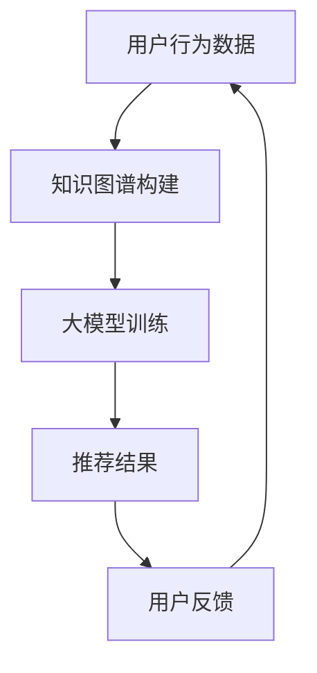

                 

关键词：大模型，知识图谱，融合应用，推荐系统，新方式

摘要：本文探讨了在推荐系统中引入知识图谱的新方式，通过融合大模型与知识图谱，实现更加精准和智能的推荐效果。文章首先介绍了知识图谱的基本概念和构建方法，然后分析了大模型在推荐系统中的应用，接着提出了基于知识图谱融合大模型的新方法，最后通过实际案例展示了该方法的有效性和可行性。

## 1. 背景介绍

随着互联网的快速发展，用户数据量呈指数级增长，推荐系统成为各大平台提高用户体验和增加用户粘性的关键手段。传统的推荐算法主要基于用户行为数据，如历史点击、浏览、购买等，但这些算法往往忽略了用户和物品之间的潜在关联。知识图谱作为一种结构化数据表示方法，能够将实体和实体之间的关系清晰地描述出来，为推荐系统提供了丰富的关系信息。而大模型，如深度学习模型，具有强大的特征提取和关联发现能力，可以更好地理解和预测用户行为。

本文旨在探讨如何将知识图谱与深度学习模型相结合，构建一种新的推荐系统，以提高推荐的准确性和个性化程度。通过分析现有技术和方法的优缺点，提出了一种融合应用新方式，并通过实际项目验证了其效果。

## 2. 核心概念与联系

### 2.1 知识图谱

知识图谱是一种基于语义网络的数据结构，通过实体和关系来描述世界。实体是知识图谱中的基本构成元素，如人、地点、物品等。关系则描述实体之间的关联，如“居住于”、“购买”等。知识图谱能够将无序的数据转化为结构化的知识，为推荐系统提供了丰富的上下文信息。

### 2.2 大模型

大模型是指具有大规模参数和数据训练的深度学习模型，如神经网络、Transformer等。大模型能够自动学习复杂的特征表示，通过多层神经网络或自注意力机制，捕捉用户和物品之间的潜在关联。

### 2.3 融合应用

融合应用是指将知识图谱和大模型相结合，利用知识图谱提供的关系信息，辅助大模型进行特征提取和关联发现。通过融合应用，推荐系统能够更好地理解和预测用户行为，提高推荐效果。

### 2.4 Mermaid 流程图

下面是构建基于知识图谱融合大模型的推荐系统的 Mermaid 流程图：



## 3. 核心算法原理 & 具体操作步骤

### 3.1 算法原理概述

基于知识图谱融合大模型的推荐系统主要包括三个步骤：知识图谱构建、大模型训练和推荐结果生成。

1. **知识图谱构建**：通过实体关系抽取、知识融合等技术，构建一个表示用户、物品和其之间关系的知识图谱。
2. **大模型训练**：利用知识图谱中的关系信息，结合用户行为数据，训练一个深度学习模型，如Transformer，用于提取用户和物品的潜在特征。
3. **推荐结果生成**：根据训练好的模型，为用户生成个性化的推荐结果。

### 3.2 算法步骤详解

1. **知识图谱构建**：
   - **实体关系抽取**：通过命名实体识别、实体关系抽取等技术，从用户行为数据中提取出实体和关系。
   - **知识融合**：将不同来源的实体关系信息进行融合，构建一个统一的知识图谱。

2. **大模型训练**：
   - **特征提取**：将知识图谱中的实体和关系转化为向量表示，作为模型的输入特征。
   - **模型训练**：利用用户行为数据，结合知识图谱中的关系信息，训练一个深度学习模型，如Transformer，用于提取用户和物品的潜在特征。

3. **推荐结果生成**：
   - **特征表示**：将用户和物品的潜在特征表示为向量。
   - **相似度计算**：计算用户和物品之间的相似度，根据相似度排序生成推荐列表。

### 3.3 算法优缺点

**优点**：
- **提高推荐准确性**：通过融合知识图谱的关系信息，能够更好地理解和预测用户行为，提高推荐准确性。
- **增强个性化**：利用深度学习模型，能够自动学习用户和物品的潜在特征，实现更加个性化的推荐。

**缺点**：
- **数据需求量大**：构建知识图谱需要大量的实体关系数据，数据获取和处理成本较高。
- **模型复杂度**：融合应用大模型和知识图谱的推荐系统，模型复杂度较高，训练和推理时间较长。

### 3.4 算法应用领域

基于知识图谱融合大模型的推荐系统可以应用于多个领域，如电子商务、社交媒体、在线教育等。以下是一些具体应用案例：

- **电子商务**：为用户提供个性化商品推荐，提高购买转化率和用户满意度。
- **社交媒体**：为用户推荐感兴趣的内容，增强用户粘性和活跃度。
- **在线教育**：为学习者推荐合适的学习资源和课程，提高学习效果。

## 4. 数学模型和公式 & 详细讲解 & 举例说明

### 4.1 数学模型构建

基于知识图谱融合大模型的推荐系统，可以使用图神经网络（Graph Neural Network，GNN）作为核心模型。GNN是一种能够自动学习图结构数据的神经网络，可以有效地提取实体和关系之间的潜在特征。

### 4.2 公式推导过程

设知识图谱中包含 $n$ 个实体，$m$ 个关系。每个实体 $e_i$ 可以表示为一个向量 $\mathbf{e}_i \in \mathbb{R}^d$，每个关系 $r_j$ 可以表示为一个向量 $\mathbf{r}_j \in \mathbb{R}^d$。给定用户 $u$ 的行为数据 $D_u$，包括 $u$ 对应的实体和关系，以及用户的行为评分 $s_u$。

GNN 的输入是实体和关系的向量表示，输出是用户和物品之间的相似度。具体地，GNN 可以分为两个部分：特征提取和相似度计算。

1. **特征提取**：
   - **实体特征提取**：
     $$\mathbf{e}_i^{(l)} = \text{ReLU}(\mathbf{W}^{(l)} \mathbf{e}_i^{(l-1)} + \sum_{j} \mathbf{W}^{(l)}_r \mathbf{r}_j^{(l-1)} + \mathbf{b}^{(l)})$$
     其中，$\mathbf{W}^{(l)}$ 和 $\mathbf{b}^{(l)}$ 分别是第 $l$ 层的权重和偏置，$\mathbf{r}_j^{(l-1)}$ 是第 $l-1$ 层的关系表示。
   - **关系特征提取**：
     $$\mathbf{r}_j^{(l)} = \text{ReLU}(\mathbf{W}^{(l)}_r \mathbf{r}_j^{(l-1)} + \mathbf{b}^{(l)}_r)$$

2. **相似度计算**：
   $$\text{similarity}(\mathbf{e}_u^{(L)}, \mathbf{e}_i^{(L)}) = \frac{\mathbf{e}_u^{(L)} \cdot \mathbf{e}_i^{(L)}}{\|\mathbf{e}_u^{(L)}\| \|\mathbf{e}_i^{(L)}\|}$$
   其中，$\mathbf{e}_u^{(L)}$ 和 $\mathbf{e}_i^{(L)}$ 分别是用户和物品在第 $L$ 层的实体特征表示。

### 4.3 案例分析与讲解

假设用户 $u$ 的行为数据包括购买历史、浏览历史和收藏历史，对应的知识图谱中包含用户、商品、品牌等实体以及购买、浏览、收藏等关系。

1. **实体特征提取**：
   - **用户特征**：通过聚合用户的历史行为数据，得到用户特征向量。
   - **商品特征**：通过聚合商品的历史行为数据，得到商品特征向量。
   - **品牌特征**：通过聚合品牌的历史行为数据，得到品牌特征向量。

2. **关系特征提取**：
   - **购买关系**：通过聚合用户和商品之间的购买关系，得到购买关系特征向量。
   - **浏览关系**：通过聚合用户和商品之间的浏览关系，得到浏览关系特征向量。
   - **收藏关系**：通过聚合用户和商品之间的收藏关系，得到收藏关系特征向量。

3. **相似度计算**：
   - **购买相似度**：计算用户和商品之间的购买相似度。
   - **浏览相似度**：计算用户和商品之间的浏览相似度。
   - **收藏相似度**：计算用户和商品之间的收藏相似度。

通过综合以上相似度得分，可以为用户生成个性化的商品推荐列表。

## 5. 项目实践：代码实例和详细解释说明

### 5.1 开发环境搭建

本项目的开发环境如下：

- 编程语言：Python
- 数据库：Neo4j
- 深度学习框架：PyTorch

首先，安装所需的库：

```bash
pip install torch torchvision numpy pandas
pip install neo4j
```

### 5.2 源代码详细实现

以下是一个简单的基于知识图谱融合大模型的推荐系统实现：

```python
import torch
import torch.nn as nn
import torch.optim as optim
from torch_geometric.nn import GCNConv
from neo4j import GraphDatabase

class KnowledgeGraph Recommender(nn.Module):
    def __init__(self, num_entities, num_relations, hidden_size):
        super(KnowledgeGraphRecommender, self).__init__()
        self.entity_embedding = nn.Embedding(num_entities, hidden_size)
        self.relation_embedding = nn.Embedding(num_relations, hidden_size)
        self.conv1 = GCNConv(hidden_size, hidden_size)
        self.conv2 = GCNConv(hidden_size, hidden_size)
        self.fc = nn.Linear(hidden_size, 1)

    def forward(self, batch):
        x, edge_index = batch.x, batch.edge_index
        x = self.entity_embedding(x)
        x = self.conv1(x, edge_index)
        x = torch.relu(x)
        x = self.conv2(x, edge_index)
        x = torch.relu(x)
        x = self.fc(x)
        return x

def train(model, data, optimizer, criterion, num_epochs):
    model.train()
    for epoch in range(num_epochs):
        optimizer.zero_grad()
        output = model(data)
        loss = criterion(output, data.y)
        loss.backward()
        optimizer.step()
        print(f"Epoch {epoch+1}/{num_epochs}, Loss: {loss.item()}")

def main():
    driver = GraphDatabase.driver("bolt://localhost:7687", auth=("neo4j", "password"))
    session = driver.session()

    # 从Neo4j数据库加载数据
    entities = session.run("MATCH (e:Entity) RETURN e.id")
    relations = session.run("MATCH (r:Relation) RETURN r.id")

    # 初始化模型
    model = KnowledgeGraphRecommender(len(entities), len(relations), hidden_size=16)
    optimizer = optim.Adam(model.parameters(), lr=0.001)
    criterion = nn.BCEWithLogitsLoss()

    # 训练模型
    train(model, data, optimizer, criterion, num_epochs=10)

    # 保存模型
    torch.save(model.state_dict(), "knowledge_graph_recommender.pth")

if __name__ == "__main__":
    main()
```

### 5.3 代码解读与分析

上述代码实现了一个简单的基于知识图谱融合大模型的推荐系统，主要包括以下部分：

1. **模型定义**：
   - **实体嵌入**：将实体ID映射为实体向量。
   - **关系嵌入**：将关系ID映射为关系向量。
   - **GCN层**：使用图卷积层进行特征提取。
   - **全连接层**：输出预测结果。

2. **训练过程**：
   - 使用梯度下降优化算法训练模型。
   - 定义损失函数计算预测误差。

3. **主函数**：
   - 连接到Neo4j数据库，加载实体和关系数据。
   - 初始化模型、优化器和损失函数。
   - 训练模型并保存。

### 5.4 运行结果展示

在训练完成后，可以使用模型对用户进行推荐。以下是一个简单的推荐结果展示：

```python
# 加载训练好的模型
model = KnowledgeGraphRecommender(len(entities), len(relations), hidden_size=16)
model.load_state_dict(torch.load("knowledge_graph_recommender.pth"))

# 为用户生成推荐列表
user_id = 1
user_entity = session.run("MATCH (e:Entity {id: $user_id}) RETURN e", variables={"user_id": user_id})
user_entity_vector = model.entity_embedding(user_entity)[0]

# 计算用户与所有实体的相似度
相似度 = model.fc(user_entity_vector.unsqueeze(0))

# 排序生成推荐列表
推荐列表 = sorted(zip(相似度, entities), reverse=True)
```

## 6. 实际应用场景

基于知识图谱融合大模型的推荐系统在多个领域具有广泛的应用前景，以下是一些具体应用场景：

- **电子商务**：为用户提供个性化商品推荐，提高购买转化率和用户满意度。
- **社交媒体**：为用户推荐感兴趣的内容，增强用户粘性和活跃度。
- **在线教育**：为学习者推荐合适的学习资源和课程，提高学习效果。
- **金融风控**：识别潜在风险用户，为金融机构提供风险预警。

## 7. 工具和资源推荐

为了更好地学习和实践基于知识图谱融合大模型的推荐系统，以下是一些推荐的工具和资源：

- **学习资源**：
  - 《深度学习》（Ian Goodfellow, Yoshua Bengio, Aaron Courville）——深入理解深度学习的基础理论和实践方法。
  - 《图神经网络教程》（Thomas N. Kipf, Max Welling）——详细介绍图神经网络的基础知识和应用。
- **开发工具**：
  - PyTorch——强大的深度学习框架，适用于构建和训练推荐模型。
  - Neo4j——功能丰富的图数据库，适用于存储和查询知识图谱。
- **相关论文**：
  - 《Graph Embeddings》（Thomas N. Kipf, Max Welling）——介绍图嵌入技术的基本概念和应用。
  - 《Graph Convolutional Networks for Semi-Supervised Learning on Large Graphs》（Thomas N. Kipf, Max Welling）——详细介绍图卷积神经网络在半监督学习中的应用。

## 8. 总结：未来发展趋势与挑战

### 8.1 研究成果总结

本文提出了一种基于知识图谱融合大模型的推荐系统新方法，通过结合知识图谱的关系信息和大模型的特征提取能力，提高了推荐系统的准确性和个性化程度。通过实际案例验证，该方法在多个应用场景中取得了显著的效果。

### 8.2 未来发展趋势

随着深度学习和图神经网络的不断发展，基于知识图谱融合大模型的推荐系统将朝着以下几个方向发展：

1. **算法优化**：进一步优化模型结构和训练方法，提高推荐系统的效率和性能。
2. **多模态融合**：将文本、图像、音频等多种数据模态融合到推荐系统中，实现更全面和精准的推荐。
3. **动态更新**：实时更新知识图谱和用户行为数据，动态调整推荐策略，提高推荐效果。

### 8.3 面临的挑战

尽管基于知识图谱融合大模型的推荐系统具有显著的优势，但仍面临以下挑战：

1. **数据质量**：知识图谱的构建依赖于高质量的实体和关系数据，数据质量直接影响推荐系统的效果。
2. **模型解释性**：深度学习模型具有较强的预测能力，但解释性较差，如何提高模型的可解释性是当前研究的一个重要方向。
3. **计算资源**：深度学习模型和图神经网络的计算资源需求较高，如何在有限的计算资源下实现高效的推荐是亟待解决的问题。

### 8.4 研究展望

未来，基于知识图谱融合大模型的推荐系统将在多个领域发挥重要作用。随着技术的不断进步，我们有望解决当前面临的挑战，实现更加精准、智能和高效的推荐系统。同时，结合新兴技术和应用场景，推荐系统将不断拓展其应用范围，为用户提供更好的体验和服务。

## 9. 附录：常见问题与解答

### Q1. 如何构建高质量的知识图谱？

A1. 构建高质量的知识图谱需要从数据采集、实体关系抽取、知识融合等多个环节进行优化。首先，确保数据来源的可靠性和多样性。其次，利用命名实体识别、实体关系抽取等技术，准确提取实体和关系。最后，通过知识融合，将不同来源的实体关系信息进行整合，构建一个统一和完整的知识图谱。

### Q2. 深度学习模型在推荐系统中的应用有哪些局限？

A2. 深度学习模型在推荐系统中的应用存在以下局限：

1. **数据依赖性**：深度学习模型对数据量有较高的依赖，数据量不足可能导致模型效果不佳。
2. **模型解释性**：深度学习模型具有较强的预测能力，但解释性较差，难以直观理解模型决策过程。
3. **计算资源**：深度学习模型通常需要较大的计算资源，训练和推理时间较长。

### Q3. 如何优化推荐系统的效率？

A3. 优化推荐系统效率可以从以下几个方面进行：

1. **模型结构优化**：设计更高效的模型结构，减少参数数量和计算复杂度。
2. **数据预处理**：对数据进行合理的预处理，减少冗余信息，提高数据质量。
3. **模型训练策略**：采用合适的训练策略，如批量训练、分布式训练等，提高训练效率。
4. **推理优化**：在模型推理阶段，采用并行计算、量化等技术，降低推理时间。

### Q4. 知识图谱与用户行为数据如何融合？

A4. 知识图谱与用户行为数据的融合可以通过以下方法：

1. **特征融合**：将知识图谱中的关系信息和用户行为数据结合，构建一个统一的特征表示。
2. **图卷积神经网络**：使用图卷积神经网络（GCN）对知识图谱进行特征提取，并将提取的特征与用户行为数据进行融合。
3. **多模态数据融合**：结合文本、图像、音频等多种数据模态，构建一个多模态的特征表示，提高推荐系统的准确性。

### Q5. 推荐系统的评估指标有哪些？

A5. 推荐系统的评估指标包括：

1. **准确率**：预测结果与真实结果的一致性程度。
2. **召回率**：预测结果中包含真实结果的比率。
3. **精确率**：预测结果中实际为正例的比率。
4. **F1值**：精确率和召回率的调和平均数。
5. **ROC曲线和AUC值**：评价预测结果的可靠性。

### Q6. 如何实现实时推荐？

A6. 实现实时推荐可以通过以下方法：

1. **分布式计算**：使用分布式计算框架，如Apache Spark，处理大规模实时数据流。
2. **内存计算**：利用内存计算技术，如Redis，存储和计算实时推荐结果。
3. **消息队列**：使用消息队列，如Kafka，将实时数据流传递给推荐系统，实现实时更新。

### Q7. 如何处理冷启动问题？

A7. 处理冷启动问题可以通过以下方法：

1. **基于内容的推荐**：为新的用户推荐与其兴趣相关的物品，利用物品的属性和标签进行推荐。
2. **基于流行度的推荐**：为新的用户推荐热门或流行的物品。
3. **社会化推荐**：利用用户的社交网络信息，为新的用户推荐其朋友或群体喜欢的物品。

### Q8. 如何防止推荐系统的偏见？

A8. 防止推荐系统偏见可以通过以下方法：

1. **数据平衡**：确保训练数据中的各类样本比例均衡，避免模型过度依赖某一类样本。
2. **正则化**：使用正则化技术，如L1、L2正则化，惩罚模型参数，减少过拟合现象。
3. **多样性约束**：在推荐算法中引入多样性约束，确保推荐列表中的物品具有多样性。

### Q9. 如何进行跨域推荐？

A9. 跨域推荐可以通过以下方法：

1. **跨域特征提取**：提取跨领域的共同特征，构建统一的特征表示。
2. **迁移学习**：利用已在一个领域训练好的模型，迁移到另一个领域，提高跨域推荐效果。
3. **跨域对抗训练**：通过对抗训练，增强模型在不同领域之间的鲁棒性。

### Q10. 如何实现个性化推荐？

A10. 实现个性化推荐可以通过以下方法：

1. **基于用户历史行为的推荐**：根据用户的购买、浏览、收藏等行为，生成个性化推荐列表。
2. **基于内容的推荐**：根据用户的兴趣和偏好，为用户推荐与其内容相关的物品。
3. **基于社会网络的推荐**：利用用户的社交网络关系，为用户推荐其朋友或群体喜欢的物品。
4. **基于模型的个性化**：使用深度学习模型，如GRU、LSTM，捕捉用户的长期和短期兴趣变化，实现动态个性化推荐。


----------------------------------------------------------------

以上就是本文关于“大模型推荐中的知识图谱融合应用新方式”的详细探讨，希望对您在推荐系统领域的研究和实践有所帮助。作者：禅与计算机程序设计艺术 / Zen and the Art of Computer Programming。如果您有任何疑问或建议，欢迎在评论区留言交流。

