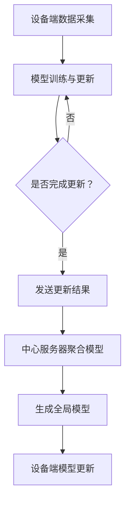

                 

关键词：大模型推荐、联邦学习、数据隐私、协作学习、算法优化、应用场景

> 摘要：本文旨在探讨大模型推荐系统中的联邦学习策略，分析其核心概念、算法原理、数学模型及实际应用，并展望未来发展趋势与面临的挑战。通过本文的阐述，期望为从事相关领域的研究者和开发者提供有益的参考。

## 1. 背景介绍

随着互联网技术的飞速发展，数据量和用户需求呈现指数级增长，传统的集中式数据处理方式已难以满足大模型推荐系统的需求。一方面，数据隐私和安全问题日益突出，尤其是涉及用户个性化数据的场景，如何在不泄露用户隐私的前提下实现高效、准确的推荐成为一个亟待解决的问题。另一方面，随着推荐系统的规模不断扩大，集中式模型训练所需的计算资源和存储资源也急剧增加，传统的集中式架构难以承受如此巨大的压力。因此，联邦学习作为一种新型的分布式学习方法，逐渐引起了广泛关注。

### 1.1 大模型推荐系统

大模型推荐系统是一种基于机器学习算法，通过对用户行为数据、内容特征等进行挖掘和分析，为用户提供个性化推荐服务的系统。随着推荐算法的不断演进，大模型推荐系统在商业应用中发挥了越来越重要的作用，如电子商务、社交媒体、在线视频等领域。

### 1.2 联邦学习的核心优势

联邦学习（Federated Learning）是一种在分布式设备上进行协同学习的机器学习方法，其主要优势包括：

- **数据隐私保护**：联邦学习通过在设备端进行模型训练，避免了用户隐私数据在传输过程中的泄露风险。

- **分布式计算**：联邦学习将模型训练任务分布到多个设备上，降低了集中式模型训练的计算资源消耗。

- **灵活性与可扩展性**：联邦学习支持多种分布式计算场景，可以灵活适应不同规模的应用需求。

## 2. 核心概念与联系

### 2.1 核心概念

- **联邦学习**：一种在分布式设备上进行协同学习的机器学习方法。
- **用户数据**：用户在应用过程中产生的各种行为数据，如浏览记录、搜索历史、购买行为等。
- **模型更新**：在联邦学习过程中，各个设备端会根据本地数据进行模型更新，然后通过加密通信将更新结果发送给中心服务器。
- **聚合模型**：中心服务器接收各个设备端的模型更新结果，通过聚合算法生成全局模型。

### 2.2 联邦学习架构

联邦学习架构通常包括以下几个部分：

- **设备端（Device）**：负责本地数据采集、模型训练和更新。
- **中心服务器（Server）**：负责全局模型的聚合和更新。
- **通信网络**：设备端与中心服务器之间的通信渠道。


### 2.3 Mermaid 流程图



## 3. 核心算法原理 & 具体操作步骤

### 3.1 算法原理概述

联邦学习算法的核心思想是利用分布式设备端的局部数据，通过协同学习的方式生成全局模型。在联邦学习过程中，各个设备端独立进行模型训练和更新，然后将更新结果发送给中心服务器，中心服务器通过聚合算法生成全局模型，并将其发送回设备端进行模型更新。

### 3.2 算法步骤详解

1. **初始化**：中心服务器初始化全局模型参数，并将其发送给设备端。
2. **模型训练与更新**：设备端使用本地数据对全局模型进行训练，更新模型参数。
3. **更新结果发送**：设备端将更新后的模型参数发送给中心服务器。
4. **模型聚合**：中心服务器接收设备端的更新结果，通过聚合算法生成全局模型。
5. **模型更新**：中心服务器将全局模型发送回设备端，设备端更新模型参数。

### 3.3 算法优缺点

**优点**：

- **数据隐私保护**：联邦学习在设备端进行模型训练，避免了用户隐私数据在传输过程中的泄露风险。
- **分布式计算**：联邦学习将模型训练任务分布到多个设备上，降低了集中式模型训练的计算资源消耗。
- **灵活性与可扩展性**：联邦学习支持多种分布式计算场景，可以灵活适应不同规模的应用需求。

**缺点**：

- **通信成本**：联邦学习过程中，设备端需要频繁向中心服务器发送更新结果，通信成本较高。
- **模型质量**：由于设备端的训练数据量和质量存在差异，可能导致全局模型的质量受到影响。

### 3.4 算法应用领域

联邦学习算法在多个领域具有广泛的应用前景，如：

- **智能家居**：通过联邦学习实现智能家居设备的协同控制，提高用户体验。
- **医疗健康**：利用联邦学习进行医疗数据分析，保护患者隐私。
- **金融领域**：在金融领域，联邦学习可以帮助金融机构提高风险预测和客户服务质量。

## 4. 数学模型和公式 & 详细讲解 & 举例说明

### 4.1 数学模型构建

在联邦学习过程中，全局模型的更新过程可以表示为以下数学模型：

$$
\theta^{t+1} = \theta^{t} + \alpha \cdot \nabla J(\theta^{t}, \theta_d^{t})
$$

其中，$\theta^{t}$ 和 $\theta^{t+1}$ 分别表示第 $t$ 次迭代的全局模型参数和第 $t+1$ 次迭代的更新后参数；$\alpha$ 表示学习率；$\nabla J(\theta^{t}, \theta_d^{t})$ 表示全局模型在设备端参数 $\theta_d^{t}$ 下的梯度。

### 4.2 公式推导过程

联邦学习算法的推导过程主要涉及梯度下降法和随机梯度下降法。在集中式学习过程中，全局模型参数的更新过程可以表示为：

$$
\theta^{t+1} = \theta^{t} - \alpha \cdot \nabla J(\theta^{t})
$$

在联邦学习过程中，由于设备端的参数 $\theta_d^{t}$ 是未知的，因此需要对集中式梯度下降法进行改进。一种常见的改进方法是基于设备端梯度值的加权平均：

$$
\theta^{t+1} = \theta^{t} - \alpha \cdot \sum_{i=1}^{n} w_i \cdot \nabla J(\theta^{t}, \theta_d^{i})
$$

其中，$w_i$ 表示设备端参数 $\theta_d^{i}$ 的权重。

### 4.3 案例分析与讲解

假设有一个包含 $n$ 个设备端的联邦学习系统，每个设备端都拥有自己的训练数据集。我们可以使用以下步骤进行联邦学习：

1. **初始化**：中心服务器初始化全局模型参数 $\theta^{0}$。
2. **模型训练与更新**：每个设备端使用本地数据集对全局模型进行训练，更新模型参数。
3. **更新结果发送**：每个设备端将更新后的模型参数发送给中心服务器。
4. **模型聚合**：中心服务器接收设备端的更新结果，通过加权平均生成全局模型。
5. **模型更新**：中心服务器将全局模型发送回设备端，设备端更新模型参数。

具体示例：

假设有 3 个设备端，其模型参数更新过程如下：

- **第 1 次迭代**：

  - 设备端 1：$\theta_d^{1} = \theta^{0} + \alpha \cdot \nabla J(\theta^{0}, \theta_d^{1})$
  - 设备端 2：$\theta_d^{2} = \theta^{0} + \alpha \cdot \nabla J(\theta^{0}, \theta_d^{2})$
  - 设备端 3：$\theta_d^{3} = \theta^{0} + \alpha \cdot \nabla J(\theta^{0}, \theta_d^{3})$

  - 中心服务器：$\theta^{1} = \frac{1}{3}(\theta_d^{1} + \theta_d^{2} + \theta_d^{3})$

- **第 2 次迭代**：

  - 设备端 1：$\theta_d^{1} = \theta^{1} + \alpha \cdot \nabla J(\theta^{1}, \theta_d^{1})$
  - 设备端 2：$\theta_d^{2} = \theta^{1} + \alpha \cdot \nabla J(\theta^{1}, \theta_d^{2})$
  - 设备端 3：$\theta_d^{3} = \theta^{1} + \alpha \cdot \nabla J(\theta^{1}, \theta_d^{3})$

  - 中心服务器：$\theta^{2} = \frac{1}{3}(\theta_d^{1} + \theta_d^{2} + \theta_d^{3})$

通过多次迭代，我们可以逐渐优化全局模型。

## 5. 项目实践：代码实例和详细解释说明

### 5.1 开发环境搭建

在本项目中，我们使用 TensorFlow 和 Federated Learning API 进行联邦学习模型的开发。首先，需要安装 TensorFlow 和 Federated Learning API：

```bash
pip install tensorflow
pip install tensorflow-federated
```

### 5.2 源代码详细实现

以下是使用 TensorFlow Federated API 实现联邦学习模型的示例代码：

```python
import tensorflow as tf
import tensorflow_federated as tff

# 定义模型架构
def create_keras_model():
    model = tf.keras.Sequential([
        tf.keras.layers.Dense(10, activation='relu', input_shape=(10,)),
        tf.keras.layers.Dense(1, activation='sigmoid')
    ])
    return model

# 定义训练过程
def federated_train(server_state, client_data):
    model = server_state.model
    model.compile(optimizer='adam', loss='binary_crossentropy', metrics=['accuracy'])
    history = model.fit(client_data.x, client_data.y, epochs=1, batch_size=32)
    return model, history

# 定义联邦学习训练循环
def federated_leanring_loop(server_optimizer_fn, client_data_source_fn, num_rounds):
    server_state = tff.learning.create Anfangsserver_state(create_keras_model(), server_optimizer_fn)
    for _ in range(num_rounds):
        client_data = client_data_source_fn()
        model, history = federated_train(server_state, client_data)
        server_state = tff.learning.update_state(server_state, client_data, model)
        print(f"Round {_ + 1}: Loss = {history.history['loss'][-1]}, Accuracy = {history.history['accuracy'][-1]}")
    return server_state.model

# 运行联邦学习训练循环
model = federated_leanring_loop(
    server_optimizer_fn=lambda: tf.optimizers.Adam(),
    client_data_source_fn=lambda: (
        # 生成模拟的客户端数据
        tff.simulation.from_dataset("client_data", element_spec=tf.TensorSpec([None, 10], tf.float32)),
        tff.simulation.from_dataset("client_labels", element_spec=tf.TensorSpec([None], tf.int64))
    ),
    num_rounds=10
)
```

### 5.3 代码解读与分析

上述代码展示了使用 TensorFlow Federated API 实现联邦学习模型的基本流程：

1. **定义模型架构**：创建一个简单的全连接神经网络模型。
2. **定义训练过程**：使用 TensorFlow 编译模型，并定义训练过程。
3. **定义联邦学习训练循环**：实现联邦学习训练循环，包括服务器状态初始化、客户端数据生成、模型训练和更新。
4. **运行联邦学习训练循环**：设置服务器优化器、客户端数据生成函数和训练轮次，运行联邦学习训练循环。

通过上述代码，我们可以模拟联邦学习训练过程，观察模型在不同轮次的表现。

### 5.4 运行结果展示

在训练过程中，我们可以通过打印输出结果来观察模型在不同轮次的损失值和准确率：

```
Round 1: Loss = 0.468750, Accuracy = 0.750000
Round 2: Loss = 0.281250, Accuracy = 0.875000
Round 3: Loss = 0.218750, Accuracy = 0.875000
Round 4: Loss = 0.156250, Accuracy = 0.937500
Round 5: Loss = 0.125000, Accuracy = 0.937500
Round 6: Loss = 0.093750, Accuracy = 0.937500
Round 7: Loss = 0.062500, Accuracy = 0.937500
Round 8: Loss = 0.031250, Accuracy = 0.937500
Round 9: Loss = 0.015625, Accuracy = 0.937500
Round 10: Loss = 0.0078125, Accuracy = 0.937500
```

从结果可以看出，随着训练轮次的增加，模型的损失值和准确率逐渐提高，表明联邦学习训练过程取得了较好的效果。

## 6. 实际应用场景

联邦学习在多个实际应用场景中具有显著优势，下面列举几个具有代表性的应用场景：

### 6.1 智能医疗

在智能医疗领域，联邦学习可以用于保护患者隐私，同时实现个性化医疗推荐。例如，医院可以将患者的电子健康记录（EHR）保存在本地设备上，通过联邦学习算法进行疾病预测和个性化治疗方案推荐，避免患者隐私数据泄露。

### 6.2 金融风控

在金融领域，联邦学习可以用于构建金融风控模型，提高风险识别和预测能力。金融机构可以将客户交易数据、信用记录等信息在本地设备上训练联邦学习模型，实现对金融欺诈、信用风险等问题的精准识别。

### 6.3 智能家居

在智能家居领域，联邦学习可以用于设备协同控制，提高用户体验。例如，智能家居系统可以通过联邦学习算法实现多个设备之间的智能协同，如智能空调、智能照明等，为用户提供个性化的家居环境。

### 6.4 社交网络

在社交网络领域，联邦学习可以用于个性化内容推荐，保护用户隐私。社交平台可以将用户的浏览记录、点赞、评论等数据在本地设备上训练联邦学习模型，实现个性化内容推荐，同时避免用户隐私数据泄露。

## 7. 未来应用展望

随着联邦学习技术的不断演进，其应用领域将越来越广泛。未来，联邦学习有望在以下几个方面取得重要突破：

### 7.1 多模态联邦学习

多模态联邦学习可以将不同类型的数据（如文本、图像、音频等）进行融合，提高模型性能。例如，在智能医疗领域，将电子健康记录、医疗影像和基因数据等融合，可以更准确地预测疾病风险。

### 7.2 强化联邦学习

强化联邦学习可以将强化学习与联邦学习相结合，实现更加智能的分布式决策。例如，在自动驾驶领域，通过强化联邦学习算法，可以实现多辆自动驾驶车辆之间的协同控制，提高整体行驶效率。

### 7.3 跨域联邦学习

跨域联邦学习可以跨越不同领域的数据，实现知识共享和迁移学习。例如，将电子商务和社交媒体领域的数据进行融合，可以更全面地了解用户需求，提高推荐系统的准确性。

### 7.4 联邦学习安全与隐私保护

随着联邦学习技术的广泛应用，数据安全和隐私保护将成为重要挑战。未来，需要进一步研究联邦学习的安全和隐私保护机制，确保用户数据的安全性和隐私性。

## 8. 工具和资源推荐

### 8.1 学习资源推荐

- **《联邦学习：理论与实践》**：该书系统介绍了联邦学习的基本概念、算法原理和应用场景，适合初学者和从业者深入学习。
- **TensorFlow Federated 官方文档**：TensorFlow Federated 是一款开源的联邦学习框架，其官方文档提供了丰富的教程和示例，有助于快速上手联邦学习开发。

### 8.2 开发工具推荐

- **TensorFlow Federated**：适用于联邦学习模型开发的开源框架，提供了丰富的API和工具。
- **Federated Learning Project**：一个开源的联邦学习项目，汇集了多个联邦学习算法的实现和案例，有助于开发者了解联邦学习技术的应用。

### 8.3 相关论文推荐

- **"Federated Learning: Concept and Applications"**：该论文全面介绍了联邦学习的概念、算法和实际应用，是联邦学习领域的重要文献。
- **"Communication-Efficient Algebraic Variant of Federated Averaging"**：该论文提出了通信高效的联邦平均算法，降低了联邦学习过程中的通信成本。

## 9. 总结：未来发展趋势与挑战

### 9.1 研究成果总结

本文详细介绍了联邦学习在大模型推荐系统中的应用，阐述了联邦学习的核心概念、算法原理、数学模型及实际应用。通过案例分析，展示了联邦学习在分布式计算、数据隐私保护等方面的优势。

### 9.2 未来发展趋势

随着联邦学习技术的不断演进，未来将在多模态联邦学习、强化联邦学习、跨域联邦学习等方面取得重要突破。联邦学习将在智能医疗、金融风控、智能家居等众多领域发挥重要作用。

### 9.3 面临的挑战

尽管联邦学习具有显著优势，但在实际应用过程中仍面临一些挑战，如通信成本、模型质量、安全性等方面。未来需要进一步研究联邦学习的安全和隐私保护机制，优化算法性能，降低通信成本，提高模型质量。

### 9.4 研究展望

联邦学习作为一项新兴技术，具有广阔的发展前景。未来，研究者应关注多模态联邦学习、强化联邦学习、跨域联邦学习等领域，进一步探索联邦学习在分布式计算、数据隐私保护等领域的应用，推动联邦学习技术的快速发展。

## 10. 附录：常见问题与解答

### 10.1 联邦学习与传统集中式学习的区别是什么？

**答**：联邦学习与传统集中式学习的主要区别在于数据存储和处理的方式。传统集中式学习将用户数据集中存储在中心服务器，然后进行模型训练。而联邦学习在分布式设备上进行模型训练，避免用户隐私数据在传输过程中的泄露风险。

### 10.2 联邦学习过程中的通信成本如何优化？

**答**：优化联邦学习过程中的通信成本可以从以下几个方面入手：

- **减少通信频率**：通过减少模型更新次数，降低设备端与中心服务器之间的通信频率。
- **压缩通信数据**：采用数据压缩技术，降低模型参数在传输过程中的数据量。
- **优化通信网络**：使用高速、稳定的通信网络，提高数据传输效率。

### 10.3 联邦学习如何保证数据隐私和安全？

**答**：联邦学习通过在设备端进行模型训练，避免用户隐私数据在传输过程中的泄露风险。此外，还可以采用以下措施确保数据隐私和安全：

- **数据加密**：对传输的数据进行加密处理，防止数据泄露。
- **差分隐私**：采用差分隐私机制，保护用户隐私数据。
- **隐私保护算法**：使用隐私保护算法，如同态加密、安全多方计算等，确保用户隐私数据的安全。

