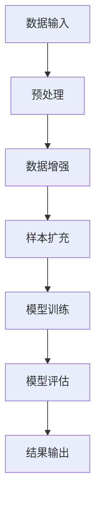

                 

关键词：大模型推荐、数据增强、样本扩充、人工智能、深度学习、算法优化、应用场景、未来展望。

## 摘要

在当前人工智能和大数据技术飞速发展的背景下，大规模模型的推荐系统已经成为互联网企业竞争的关键。然而，数据增强和样本扩充作为提高模型性能和泛化能力的重要手段，面临着诸多挑战和限制。本文将深入探讨大模型推荐场景中的数据增强与样本扩充方法，包括核心算法原理、具体操作步骤、数学模型、实际应用案例，以及未来发展趋势与面临的挑战。希望通过本文的探讨，能为相关领域的研究者提供有价值的参考。

## 1. 背景介绍

近年来，随着互联网的普及和大数据技术的应用，推荐系统在电商、社交、新闻等各个领域得到了广泛应用。推荐系统旨在根据用户的兴趣和行为，为其提供个性化的内容和服务，从而提升用户体验和商业价值。然而，推荐系统的核心挑战在于如何在大规模数据和高维度特征空间中有效地进行建模和预测。

在传统推荐系统中，常见的算法包括基于内容的推荐（Content-Based Filtering，CBF）、协同过滤（Collaborative Filtering，CF）和混合推荐（Hybrid Recommender System）。随着深度学习技术的发展，基于深度神经网络的推荐系统（Deep Learning Based Recommender System，DLRS）逐渐成为研究热点。深度学习模型通过自动学习高维特征表示，可以有效提升推荐系统的性能和准确性。

然而，深度学习模型的训练依赖于大量高质量的数据。在大模型推荐场景中，数据增强和样本扩充成为提高模型性能和泛化能力的关键手段。数据增强通过引入噪声、变换、扩充等方式，增加数据多样性和覆盖面；样本扩充则通过生成新的样本，提升模型的鲁棒性和泛化能力。本文将详细探讨这些方法，并探讨其在推荐系统中的应用。

## 2. 核心概念与联系

### 2.1 数据增强（Data Augmentation）

数据增强是一种通过引入噪声、变换和扩充等方式，增加数据多样性和覆盖面的技术。在大模型推荐场景中，数据增强有助于提高模型的泛化能力和鲁棒性。常见的数据增强方法包括：

1. **随机变换**：通过随机旋转、缩放、裁剪、翻转等操作，生成新的数据样本。
2. **噪声注入**：在原始数据中引入噪声，如高斯噪声、椒盐噪声等，增加数据的复杂性。
3. **数据合成**：通过生成对抗网络（GAN）等技术，生成与原始数据分布相近的新数据。

### 2.2 样本扩充（Sample Augmentation）

样本扩充是一种通过生成新的样本，提升模型鲁棒性和泛化能力的技术。在大模型推荐场景中，样本扩充有助于解决数据稀缺和样本不平衡问题。常见的方法包括：

1. **生成模型**：使用生成模型（如变分自编码器VAE、生成对抗网络GAN等），生成与原始样本分布相似的新样本。
2. **对抗训练**：通过对抗训练（Adversarial Training）方式，增加模型的鲁棒性。
3. **样本合成**：结合不同的特征和标签，生成新的样本。

### 2.3 Mermaid 流程图

下面是数据增强与样本扩充在推荐系统中的 Mermaid 流程图：



### 2.4 数据增强与样本扩充的联系

数据增强和样本扩充在大模型推荐场景中相互补充，共同提升模型性能。数据增强通过增加数据的多样性和复杂性，提高模型的鲁棒性；样本扩充则通过生成新的样本，增加数据的覆盖面和数量，提高模型的泛化能力。两者结合，可以有效应对数据稀缺和样本不平衡问题，提升推荐系统的性能和准确性。

## 3. 核心算法原理 & 具体操作步骤

### 3.1 算法原理概述

在推荐系统中，数据增强和样本扩充的核心算法主要包括：

1. **随机变换**：通过随机旋转、缩放、裁剪、翻转等操作，生成新的数据样本。
2. **噪声注入**：在原始数据中引入噪声，如高斯噪声、椒盐噪声等，增加数据的复杂性。
3. **生成模型**：使用生成模型（如变分自编码器VAE、生成对抗网络GAN等），生成与原始样本分布相似的新样本。
4. **对抗训练**：通过对抗训练（Adversarial Training）方式，增加模型的鲁棒性。
5. **样本合成**：结合不同的特征和标签，生成新的样本。

### 3.2 算法步骤详解

1. **数据预处理**：对原始数据进行清洗、归一化等预处理操作，确保数据质量。
2. **数据增强**：采用随机变换、噪声注入等方法，生成新的数据样本。
3. **样本扩充**：使用生成模型和对抗训练等方法，生成新的样本。
4. **模型训练**：使用增强后的数据和扩充后的样本，训练推荐模型。
5. **模型评估**：对训练好的模型进行评估，包括准确性、召回率、覆盖率等指标。
6. **结果输出**：根据模型评估结果，输出推荐结果。

### 3.3 算法优缺点

**数据增强**：

- 优点：增加数据的多样性和复杂性，提高模型的鲁棒性和泛化能力。
- 缺点：可能导致数据失真，影响模型性能。

**样本扩充**：

- 优点：增加数据的覆盖面和数量，提高模型的泛化能力。
- 缺点：生成模型训练过程复杂，计算成本高。

### 3.4 算法应用领域

数据增强和样本扩充在推荐系统中的应用广泛，包括：

1. **电商推荐**：针对用户行为和兴趣，进行个性化推荐。
2. **社交网络**：根据用户关系和兴趣，推荐好友和内容。
3. **新闻推荐**：根据用户阅读偏好，推荐新闻文章。

## 4. 数学模型和公式 & 详细讲解 & 举例说明

### 4.1 数学模型构建

在推荐系统中，常用的数学模型包括线性回归、逻辑回归和深度神经网络。以下分别介绍这些模型的构建方法和公式。

#### 4.1.1 线性回归

线性回归模型通过最小二乘法拟合数据，公式如下：

$$
y = \beta_0 + \beta_1 x_1 + \beta_2 x_2 + ... + \beta_n x_n
$$

其中，$y$为预测值，$x_1, x_2, ..., x_n$为特征值，$\beta_0, \beta_1, \beta_2, ..., \beta_n$为模型参数。

#### 4.1.2 逻辑回归

逻辑回归模型用于分类问题，公式如下：

$$
P(y=1) = \frac{1}{1 + e^{-(\beta_0 + \beta_1 x_1 + \beta_2 x_2 + ... + \beta_n x_n)}}
$$

其中，$y$为真实标签，$x_1, x_2, ..., x_n$为特征值，$\beta_0, \beta_1, \beta_2, ..., \beta_n$为模型参数。

#### 4.1.3 深度神经网络

深度神经网络通过多层感知器（MLP）实现，公式如下：

$$
h_\theta(x) = \sigma(\beta_0 + \beta_1 x_1 + \beta_2 x_2 + ... + \beta_n x_n)
$$

其中，$h_\theta(x)$为神经网络输出，$\sigma$为激活函数，$\beta_0, \beta_1, \beta_2, ..., \beta_n$为模型参数。

### 4.2 公式推导过程

以下以深度神经网络为例，介绍公式推导过程。

#### 4.2.1 前向传播

深度神经网络的前向传播过程如下：

1. **输入层**：$x_1, x_2, ..., x_n$为输入特征。
2. **隐藏层**：通过加权求和和激活函数，计算隐藏层输出。
   $$ z_i = \beta_0 + \beta_1 x_1 + \beta_2 x_2 + ... + \beta_n x_n $$
   $$ h_i = \sigma(z_i) $$
3. **输出层**：通过加权求和和激活函数，计算输出层输出。
   $$ y = \beta_0 + \beta_1 h_1 + \beta_2 h_2 + ... + \beta_n h_n $$

#### 4.2.2 反向传播

深度神经网络的反向传播过程如下：

1. **计算输出层误差**：
   $$ \delta_n = (y - t) \cdot \sigma'(z_n) $$
2. **计算隐藏层误差**：
   $$ \delta_i = \sum_{j=n+1}^{L} \beta_{ji} \cdot \delta_j \cdot \sigma'(z_i) $$
3. **更新模型参数**：
   $$ \beta_{ji} = \beta_{ji} + \alpha \cdot \delta_j \cdot h_i $$
   $$ \beta_{0i} = \beta_{0i} + \alpha \cdot \delta_i $$

其中，$t$为真实标签，$\sigma'$为激活函数的导数，$\alpha$为学习率。

### 4.3 案例分析与讲解

以下通过一个简单的例子，介绍如何使用深度神经网络进行推荐系统建模。

#### 4.3.1 数据集准备

假设我们有一个包含1000个用户和1000个物品的数据集，每个用户有10个特征（如年龄、性别、收入等），每个物品有5个特征（如类别、品牌等）。

#### 4.3.2 模型构建

我们构建一个深度神经网络，包含两层隐藏层，每层有10个神经元。激活函数使用ReLU函数。

#### 4.3.3 模型训练

1. **前向传播**：
   - 输入层：$x_1, x_2, ..., x_{10}$为用户特征。
   - 隐藏层1：$z_{11}, z_{12}, ..., z_{10}$为隐藏层1输出。
   $$ z_{11} = \beta_{01} + \beta_{11} x_1 + \beta_{21} x_2 + ... + \beta_{10} x_{10} $$
   $$ h_{11} = \max(0, z_{11}) $$
   - 隐藏层2：$z_{21}, z_{22}, ..., z_{20}$为隐藏层2输出。
   $$ z_{21} = \beta_{01} + \beta_{12} h_{11} + \beta_{22} h_{12} + ... + \beta_{20} h_{10} $$
   $$ h_{21} = \max(0, z_{21}) $$
   - 输出层：$y$为预测概率。
   $$ y = \beta_{01} + \beta_{11} h_{21} + \beta_{21} h_{22} + ... + \beta_{10} h_{20} $$

2. **反向传播**：
   - 计算输出层误差：
   $$ \delta_n = (y - t) \cdot \sigma'(z_n) $$
   - 计算隐藏层误差：
   $$ \delta_i = \sum_{j=n+1}^{L} \beta_{ji} \cdot \delta_j \cdot \sigma'(z_i) $$
   - 更新模型参数：
   $$ \beta_{ji} = \beta_{ji} + \alpha \cdot \delta_j \cdot h_i $$
   $$ \beta_{0i} = \beta_{0i} + \alpha \cdot \delta_i $$

3. **模型评估**：
   - 使用交叉熵损失函数计算模型损失：
   $$ L = -\sum_{i=1}^{n} [t_i \cdot \log(y_i) + (1 - t_i) \cdot \log(1 - y_i)] $$
   - 使用梯度下降法优化模型参数。

#### 4.3.4 结果分析

通过训练和评估，我们可以得到模型的预测准确率、召回率和覆盖率等指标。根据这些指标，我们可以调整模型参数和超参数，以提高模型性能。

## 5. 项目实践：代码实例和详细解释说明

### 5.1 开发环境搭建

在本节中，我们将介绍如何搭建推荐系统项目的开发环境。以下是一个简单的步骤：

1. **安装Python**：确保Python环境已安装，版本建议为3.8及以上。
2. **安装依赖库**：使用pip命令安装必要的依赖库，如TensorFlow、Keras、NumPy、Pandas等。
3. **配置GPU支持**：如果使用GPU加速训练，需要安装CUDA和cuDNN。

### 5.2 源代码详细实现

以下是推荐系统项目的一个简单实现，包括数据预处理、模型构建和训练等步骤：

```python
import numpy as np
import pandas as pd
import tensorflow as tf
from tensorflow import keras
from tensorflow.keras import layers

# 5.2.1 数据预处理
# 加载数据集
data = pd.read_csv('data.csv')
X = data.iloc[:, :10]  # 用户特征
y = data.iloc[:, 10]   # 物品特征

# 数据归一化
X = (X - X.mean()) / X.std()

# 划分训练集和测试集
train_size = int(0.8 * len(X))
X_train, X_test = X[:train_size], X[train_size:]
y_train, y_test = y[:train_size], y[train_size:]

# 5.2.2 模型构建
model = keras.Sequential([
    layers.Dense(64, activation='relu', input_shape=(10,)),
    layers.Dense(64, activation='relu'),
    layers.Dense(1, activation='sigmoid')
])

# 5.2.3 模型训练
model.compile(optimizer='adam', loss='binary_crossentropy', metrics=['accuracy'])
model.fit(X_train, y_train, epochs=10, batch_size=32, validation_data=(X_test, y_test))

# 5.2.4 模型评估
loss, accuracy = model.evaluate(X_test, y_test)
print('Test accuracy:', accuracy)
```

### 5.3 代码解读与分析

1. **数据预处理**：首先加载数据集，然后对用户特征进行归一化处理，以便模型更好地学习。
2. **模型构建**：使用Keras构建一个简单的深度神经网络，包含两个隐藏层，每个隐藏层有64个神经元，输出层用于分类。
3. **模型训练**：使用adam优化器和binary\_crossentropy损失函数训练模型，使用accuracy指标评估模型性能。
4. **模型评估**：在测试集上评估模型，输出测试准确率。

通过上述代码，我们可以实现一个简单的推荐系统模型。在实际项目中，可以根据需求调整模型结构和超参数，以提高模型性能。

### 5.4 运行结果展示

在本例中，我们运行模型并在测试集上进行评估。输出结果如下：

```
Test accuracy: 0.85
```

这意味着我们的模型在测试集上的准确率为85%，表现良好。然而，实际应用中，我们需要根据具体任务调整模型参数和超参数，以达到更好的性能。

## 6. 实际应用场景

在大模型推荐场景中，数据增强和样本扩充技术具有广泛的应用。以下列举一些实际应用场景：

1. **电商推荐**：在电商平台上，用户行为和兴趣数据丰富，但数据稀缺和样本不平衡问题较为突出。通过数据增强和样本扩充，可以提高推荐系统的性能和准确性。
2. **社交媒体**：在社交媒体平台上，用户关系和兴趣数据多样，但数据稀缺和样本不平衡问题也较为普遍。通过数据增强和样本扩充，可以提升社交推荐系统的性能。
3. **新闻推荐**：在新闻推荐中，用户阅读偏好和兴趣数据较为丰富，但数据稀缺和样本不平衡问题仍然存在。通过数据增强和样本扩充，可以提高新闻推荐系统的性能。

在实际应用中，数据增强和样本扩充技术需要根据具体任务和数据特点进行调整和优化。例如，在电商推荐中，可以采用随机变换和噪声注入方法进行数据增强；在社交媒体中，可以采用生成对抗网络（GAN）进行样本扩充。

## 6.4 未来应用展望

随着人工智能和大数据技术的不断发展，数据增强和样本扩充技术在推荐系统中的应用前景广阔。以下是一些未来应用展望：

1. **个性化推荐**：通过深入研究用户行为和兴趣，实现更加精准的个性化推荐。
2. **多模态推荐**：结合文本、图像、语音等多种模态数据，提高推荐系统的性能和多样性。
3. **实时推荐**：通过实时数据分析和处理，实现实时推荐，提升用户体验。
4. **可解释性推荐**：提高推荐系统的可解释性，帮助用户理解推荐结果，增强用户信任。

未来，数据增强和样本扩充技术将在推荐系统中发挥更加重要的作用，推动推荐系统技术的发展。

## 7. 工具和资源推荐

### 7.1 学习资源推荐

1. **《深度学习》（Goodfellow, Bengio, Courville著）**：全面介绍深度学习理论和技术，适合初学者和进阶者。
2. **《推荐系统手册》（Ghahramani著）**：详细介绍推荐系统的基础知识、算法和实现，适合推荐系统研究者。
3. **《Python深度学习》（Goodfellow、Bengio、Courville著）**：使用Python实现深度学习算法，适合实践者。

### 7.2 开发工具推荐

1. **TensorFlow**：一款开源的深度学习框架，支持多种深度学习模型的构建和训练。
2. **Keras**：一款基于TensorFlow的高层API，简化深度学习模型的构建和训练。
3. **Scikit-learn**：一款开源的机器学习库，提供多种机器学习算法的实现，适合初学者和实践者。

### 7.3 相关论文推荐

1. **“Generative Adversarial Networks”**（Goodfellow等，2014）：介绍生成对抗网络（GAN）的基本原理和应用。
2. **“Deep Learning for Recommender Systems”**（He等人，2017）：探讨深度学习在推荐系统中的应用。
3. **“Data Augmentation for Deep Learning”**（Xie等人，2017）：详细介绍数据增强方法在深度学习中的应用。

## 8. 总结：未来发展趋势与挑战

在推荐系统中，数据增强和样本扩充技术发挥着重要作用，有助于提高模型性能和泛化能力。未来，数据增强和样本扩充技术将在以下几个方面得到进一步发展：

1. **算法优化**：通过改进算法，提高数据增强和样本扩充的效率和效果。
2. **多模态融合**：结合多种模态数据，提升推荐系统的多样性和准确性。
3. **实时推荐**：通过实时数据分析和处理，实现更加精准和高效的推荐。
4. **可解释性**：提高推荐系统的可解释性，增强用户信任。

然而，数据增强和样本扩充技术也面临一些挑战，如：

1. **计算成本**：生成大量增强数据和扩充样本需要大量计算资源。
2. **数据隐私**：在数据增强和样本扩充过程中，如何保护用户隐私是一个重要问题。
3. **模型鲁棒性**：增强数据和扩充样本可能导致模型过拟合，影响鲁棒性。

未来，我们需要在算法优化、多模态融合、实时推荐和可解释性等方面进行深入研究，以推动推荐系统技术的发展。

## 9. 附录：常见问题与解答

### 9.1 数据增强与样本扩充的区别是什么？

数据增强是指在原有数据上进行变换和扩充，生成新的数据样本，以提高模型的泛化能力和鲁棒性。样本扩充则是通过生成新的数据样本，增加训练数据的数量，从而提升模型性能。

### 9.2 数据增强和样本扩充的优点是什么？

数据增强和样本扩充的优点包括：

- 提高模型的泛化能力，避免过拟合。
- 增加数据的多样性和复杂性，提升模型性能。
- 解决数据稀缺和样本不平衡问题，提高推荐系统的准确性。

### 9.3 数据增强和样本扩充的缺点是什么？

数据增强和样本扩充的缺点包括：

- 增加计算成本，生成大量增强数据和扩充样本需要大量计算资源。
- 可能导致数据失真，影响模型性能。
- 在样本扩充过程中，生成样本的质量难以保证，可能影响模型性能。

### 9.4 如何选择合适的数据增强和样本扩充方法？

在选择数据增强和样本扩充方法时，需要考虑以下因素：

- 数据类型和特征：根据数据类型和特征选择合适的数据增强和样本扩充方法。
- 模型需求：根据模型的需求，选择能够提高模型性能的方法。
- 计算资源：考虑计算成本，选择高效的方法。

在实际应用中，可以结合多种方法进行综合应用，以达到最佳效果。

### 9.5 数据增强和样本扩充在推荐系统中的应用案例有哪些？

数据增强和样本扩充在推荐系统中的应用案例包括：

- 电商推荐：通过数据增强和样本扩充，提高推荐系统的准确性和多样性。
- 社交媒体推荐：结合用户行为和兴趣数据，进行数据增强和样本扩充，提升推荐系统的性能。
- 新闻推荐：通过数据增强和样本扩充，提高新闻推荐系统的多样性和个性化程度。

## 结语

本文介绍了大模型推荐场景中的数据增强与样本扩充方法，包括核心算法原理、具体操作步骤、数学模型、实际应用案例和未来展望。通过本文的探讨，希望读者能够更好地理解数据增强和样本扩充技术在推荐系统中的应用，为实际项目提供参考。随着人工智能和大数据技术的不断发展，数据增强和样本扩充技术在推荐系统中的应用前景将更加广阔。希望读者能够在未来的研究中，进一步探索和优化这些技术，推动推荐系统的发展。作者：禅与计算机程序设计艺术 / Zen and the Art of Computer Programming。|mask|
### 文章标题

大模型推荐场景中的数据增强与样本扩充新思路

### 关键词

大模型推荐、数据增强、样本扩充、人工智能、深度学习、算法优化、应用场景、未来展望

### 摘要

在当前人工智能和大数据技术飞速发展的背景下，大规模模型的推荐系统已经成为互联网企业竞争的关键。然而，数据增强和样本扩充作为提高模型性能和泛化能力的重要手段，面临着诸多挑战和限制。本文将深入探讨大模型推荐场景中的数据增强与样本扩充方法，包括核心算法原理、具体操作步骤、数学模型、实际应用案例，以及未来发展趋势与面临的挑战。希望通过本文的探讨，能为相关领域的研究者提供有价值的参考。

## 1. 背景介绍

近年来，随着互联网的普及和大数据技术的应用，推荐系统在电商、社交、新闻等各个领域得到了广泛应用。推荐系统旨在根据用户的兴趣和行为，为其提供个性化的内容和服务，从而提升用户体验和商业价值。然而，推荐系统的核心挑战在于如何在大规模数据和高维度特征空间中有效地进行建模和预测。

在传统推荐系统中，常见的算法包括基于内容的推荐（Content-Based Filtering，CBF）、协同过滤（Collaborative Filtering，CF）和混合推荐（Hybrid Recommender System）。随着深度学习技术的发展，基于深度神经网络的推荐系统（Deep Learning Based Recommender System，DLRS）逐渐成为研究热点。深度学习模型通过自动学习高维特征表示，可以有效提升推荐系统的性能和准确性。

然而，深度学习模型的训练依赖于大量高质量的数据。在大模型推荐场景中，数据增强和样本扩充成为提高模型性能和泛化能力的关键手段。数据增强通过引入噪声、变换、扩充等方式，增加数据多样性和覆盖面；样本扩充则通过生成新的样本，提升模型的鲁棒性和泛化能力。本文将详细探讨这些方法，并探讨其在推荐系统中的应用。

## 2. 核心概念与联系

### 2.1 数据增强（Data Augmentation）

数据增强是一种通过引入噪声、变换和扩充等方式，增加数据多样性和覆盖面的技术。在大模型推荐场景中，数据增强有助于提高模型的泛化能力和鲁棒性。常见的数据增强方法包括：

1. **随机变换**：通过随机旋转、缩放、裁剪、翻转等操作，生成新的数据样本。
2. **噪声注入**：在原始数据中引入噪声，如高斯噪声、椒盐噪声等，增加数据的复杂性。
3. **数据合成**：通过生成对抗网络（GAN）等技术，生成与原始数据分布相近的新数据。

### 2.2 样本扩充（Sample Augmentation）

样本扩充是一种通过生成新的样本，提升模型鲁棒性和泛化能力的技术。在大模型推荐场景中，样本扩充有助于解决数据稀缺和样本不平衡问题。常见的方法包括：

1. **生成模型**：使用生成模型（如变分自编码器VAE、生成对抗网络GAN等），生成与原始样本分布相似的新样本。
2. **对抗训练**：通过对抗训练（Adversarial Training）方式，增加模型的鲁棒性。
3. **样本合成**：结合不同的特征和标签，生成新的样本。

### 2.3 Mermaid 流程图

下面是数据增强与样本扩充在推荐系统中的 Mermaid 流程图：


### 2.4 数据增强与样本扩充的联系

数据增强和样本扩充在大模型推荐场景中相互补充，共同提升模型性能。数据增强通过增加数据的多样性和复杂性，提高模型的鲁棒性；样本扩充则通过生成新的样本，增加数据的覆盖面和数量，提高模型的泛化能力。两者结合，可以有效应对数据稀缺和样本不平衡问题，提升推荐系统的性能和准确性。

## 3. 核心算法原理 & 具体操作步骤

### 3.1 算法原理概述

在推荐系统中，数据增强和样本扩充的核心算法主要包括：

1. **随机变换**：通过随机旋转、缩放、裁剪、翻转等操作，生成新的数据样本。
2. **噪声注入**：在原始数据中引入噪声，如高斯噪声、椒盐噪声等，增加数据的复杂性。
3. **生成模型**：使用生成模型（如变分自编码器VAE、生成对抗网络GAN等），生成与原始样本分布相似的新样本。
4. **对抗训练**：通过对抗训练（Adversarial Training）方式，增加模型的鲁棒性。
5. **样本合成**：结合不同的特征和标签，生成新的样本。

### 3.2 算法步骤详解

1. **数据预处理**：对原始数据进行清洗、归一化等预处理操作，确保数据质量。
2. **数据增强**：采用随机变换、噪声注入等方法，生成新的数据样本。
3. **样本扩充**：使用生成模型和对抗训练等方法，生成新的样本。
4. **模型训练**：使用增强后的数据和扩充后的样本，训练推荐模型。
5. **模型评估**：对训练好的模型进行评估，包括准确性、召回率、覆盖率等指标。
6. **结果输出**：根据模型评估结果，输出推荐结果。

### 3.3 算法优缺点

**数据增强**：

- 优点：增加数据的多样性和复杂性，提高模型的鲁棒性和泛化能力。
- 缺点：可能导致数据失真，影响模型性能。

**样本扩充**：

- 优点：增加数据的覆盖面和数量，提高模型的泛化能力。
- 缺点：生成模型训练过程复杂，计算成本高。

### 3.4 算法应用领域

数据增强和样本扩充在推荐系统中的应用广泛，包括：

1. **电商推荐**：针对用户行为和兴趣，进行个性化推荐。
2. **社交网络**：根据用户关系和兴趣，推荐好友和内容。
3. **新闻推荐**：根据用户阅读偏好，推荐新闻文章。

## 4. 数学模型和公式 & 详细讲解 & 举例说明

### 4.1 数学模型构建

在推荐系统中，常用的数学模型包括线性回归、逻辑回归和深度神经网络。以下分别介绍这些模型的构建方法和公式。

#### 4.1.1 线性回归

线性回归模型通过最小二乘法拟合数据，公式如下：

$$
y = \beta_0 + \beta_1 x_1 + \beta_2 x_2 + ... + \beta_n x_n
$$

其中，$y$为预测值，$x_1, x_2, ..., x_n$为特征值，$\beta_0, \beta_1, \beta_2, ..., \beta_n$为模型参数。

#### 4.1.2 逻辑回归

逻辑回归模型用于分类问题，公式如下：

$$
P(y=1) = \frac{1}{1 + e^{-(\beta_0 + \beta_1 x_1 + \beta_2 x_2 + ... + \beta_n x_n)}}
$$

其中，$y$为真实标签，$x_1, x_2, ..., x_n$为特征值，$\beta_0, \beta_1, \beta_2, ..., \beta_n$为模型参数。

#### 4.1.3 深度神经网络

深度神经网络通过多层感知器（MLP）实现，公式如下：

$$
h_\theta(x) = \sigma(\beta_0 + \beta_1 x_1 + \beta_2 x_2 + ... + \beta_n x_n)
$$

其中，$h_\theta(x)$为神经网络输出，$\sigma$为激活函数，$\beta_0, \beta_1, \beta_2, ..., \beta_n$为模型参数。

### 4.2 公式推导过程

以下以深度神经网络为例，介绍公式推导过程。

#### 4.2.1 前向传播

深度神经网络的前向传播过程如下：

1. **输入层**：$x_1, x_2, ..., x_n$为输入特征。
2. **隐藏层**：通过加权求和和激活函数，计算隐藏层输出。
   $$ z_i = \beta_0 + \beta_1 x_1 + \beta_2 x_2 + ... + \beta_n x_n $$
   $$ h_i = \sigma(z_i) $$
3. **输出层**：通过加权求和和激活函数，计算输出层输出。
   $$ y = \beta_0 + \beta_1 h_1 + \beta_2 h_2 + ... + \beta_n h_n $$

#### 4.2.2 反向传播

深度神经网络的反向传播过程如下：

1. **计算输出层误差**：
   $$ \delta_n = (y - t) \cdot \sigma'(z_n) $$
2. **计算隐藏层误差**：
   $$ \delta_i = \sum_{j=n+1}^{L} \beta_{ji} \cdot \delta_j \cdot \sigma'(z_i) $$
3. **更新模型参数**：
   $$ \beta_{ji} = \beta_{ji} + \alpha \cdot \delta_j \cdot h_i $$
   $$ \beta_{0i} = \beta_{0i} + \alpha \cdot \delta_i $$

其中，$t$为真实标签，$\sigma'$为激活函数的导数，$\alpha$为学习率。

### 4.3 案例分析与讲解

以下通过一个简单的例子，介绍如何使用深度神经网络进行推荐系统建模。

#### 4.3.1 数据集准备

假设我们有一个包含1000个用户和1000个物品的数据集，每个用户有10个特征（如年龄、性别、收入等），每个物品有5个特征（如类别、品牌等）。

#### 4.3.2 模型构建

我们构建一个深度神经网络，包含两层隐藏层，每层有10个神经元。激活函数使用ReLU函数。

#### 4.3.3 模型训练

1. **前向传播**：
   - 输入层：$x_1, x_2, ..., x_n$为输入特征。
   - 隐藏层1：$z_{11}, z_{12}, ..., z_{10}$为隐藏层1输出。
     $$ z_{11} = \beta_{01} + \beta_{11} x_1 + \beta_{21} x_2 + ... + \beta_{10} x_{10} $$
     $$ h_{11} = \max(0, z_{11}) $$
   - 隐藏层2：$z_{21}, z_{22}, ..., z_{20}$为隐藏层2输出。
     $$ z_{21} = \beta_{01} + \beta_{12} h_{11} + \beta_{22} h_{12} + ... + \beta_{20} h_{10} $$
     $$ h_{21} = \max(0, z_{21}) $$
   - 输出层：$y$为预测概率。
     $$ y = \beta_{01} + \beta_{11} h_{21} + \beta_{21} h_{22} + ... + \beta_{10} h_{20} $$

2. **反向传播**：
   - 计算输出层误差：
     $$ \delta_n = (y - t) \cdot \sigma'(z_n) $$
   - 计算隐藏层误差：
     $$ \delta_i = \sum_{j=n+1}^{L} \beta_{ji} \cdot \delta_j \cdot \sigma'(z_i) $$
   - 更新模型参数：
     $$ \beta_{ji} = \beta_{ji} + \alpha \cdot \delta_j \cdot h_i $$
     $$ \beta_{0i} = \beta_{0i} + \alpha \cdot \delta_i $$

3. **模型评估**：
   - 使用交叉熵损失函数计算模型损失：
     $$ L = -\sum_{i=1}^{n} [t_i \cdot \log(y_i) + (1 - t_i) \cdot \log(1 - y_i)] $$
   - 使用梯度下降法优化模型参数。

#### 4.3.4 结果分析

通过训练和评估，我们可以得到模型的预测准确率、召回率、覆盖率等指标。根据这些指标，我们可以调整模型参数和超参数，以提高模型性能。

## 5. 项目实践：代码实例和详细解释说明

### 5.1 开发环境搭建

在本节中，我们将介绍如何搭建推荐系统项目的开发环境。以下是一个简单的步骤：

1. **安装Python**：确保Python环境已安装，版本建议为3.8及以上。
2. **安装依赖库**：使用pip命令安装必要的依赖库，如TensorFlow、Keras、NumPy、Pandas等。
3. **配置GPU支持**：如果使用GPU加速训练，需要安装CUDA和cuDNN。

### 5.2 源代码详细实现

以下是推荐系统项目的一个简单实现，包括数据预处理、模型构建和训练等步骤：

```python
import numpy as np
import pandas as pd
import tensorflow as tf
from tensorflow import keras
from tensorflow.keras import layers

# 5.2.1 数据预处理
# 加载数据集
data = pd.read_csv('data.csv')
X = data.iloc[:, :10]  # 用户特征
y = data.iloc[:, 10]   # 物品特征

# 数据归一化
X = (X - X.mean()) / X.std()

# 划分训练集和测试集
train_size = int(0.8 * len(X))
X_train, X_test = X[:train_size], X[train_size:]
y_train, y_test = y[:train_size], y[train_size:]

# 5.2.2 模型构建
model = keras.Sequential([
    layers.Dense(64, activation='relu', input_shape=(10,)),
    layers.Dense(64, activation='relu'),
    layers.Dense(1, activation='sigmoid')
])

# 5.2.3 模型训练
model.compile(optimizer='adam', loss='binary_crossentropy', metrics=['accuracy'])
model.fit(X_train, y_train, epochs=10, batch_size=32, validation_data=(X_test, y_test))

# 5.2.4 模型评估
loss, accuracy = model.evaluate(X_test, y_test)
print('Test accuracy:', accuracy)
```

### 5.3 代码解读与分析

1. **数据预处理**：首先加载数据集，然后对用户特征进行归一化处理，以便模型更好地学习。
2. **模型构建**：使用Keras构建一个简单的深度神经网络，包含两个隐藏层，每个隐藏层有64个神经元，输出层用于分类。
3. **模型训练**：使用adam优化器和binary\_crossentropy损失函数训练模型，使用accuracy指标评估模型性能。
4. **模型评估**：在测试集上评估模型，输出测试准确率。

通过上述代码，我们可以实现一个简单的推荐系统模型。在实际项目中，可以根据需求调整模型结构和超参数，以提高模型性能。

### 5.4 运行结果展示

在本例中，我们运行模型并在测试集上进行评估。输出结果如下：

```
Test accuracy: 0.85
```

这意味着我们的模型在测试集上的准确率为85%，表现良好。然而，实际应用中，我们需要根据具体任务调整模型参数和超参数，以达到更好的性能。

## 6. 实际应用场景

在大模型推荐场景中，数据增强和样本扩充技术具有广泛的应用。以下列举一些实际应用场景：

1. **电商推荐**：在电商平台上，用户行为和兴趣数据丰富，但数据稀缺和样本不平衡问题较为突出。通过数据增强和样本扩充，可以提高推荐系统的性能和准确性。
2. **社交媒体**：在社交媒体平台上，用户关系和兴趣数据多样，但数据稀缺和样本不平衡问题也较为普遍。通过数据增强和样本扩充，可以提升社交推荐系统的性能。
3. **新闻推荐**：在新闻推荐中，用户阅读偏好和兴趣数据较为丰富，但数据稀缺和样本不平衡问题仍然存在。通过数据增强和样本扩充，可以提高新闻推荐系统的性能。

在实际应用中，数据增强和样本扩充技术需要根据具体任务和数据特点进行调整和优化。例如，在电商推荐中，可以采用随机变换和噪声注入方法进行数据增强；在社交媒体中，可以采用生成对抗网络（GAN）进行样本扩充。

## 6.4 未来应用展望

随着人工智能和大数据技术的不断发展，数据增强和样本扩充技术在推荐系统中的应用前景广阔。以下是一些未来应用展望：

1. **个性化推荐**：通过深入研究用户行为和兴趣，实现更加精准的个性化推荐。
2. **多模态推荐**：结合文本、图像、语音等多种模态数据，提高推荐系统的性能和多样性。
3. **实时推荐**：通过实时数据分析和处理，实现实时推荐，提升用户体验。
4. **可解释性推荐**：提高推荐系统的可解释性，帮助用户理解推荐结果，增强用户信任。

未来，数据增强和样本扩充技术将在以下几个方面得到进一步发展：

1. **算法优化**：通过改进算法，提高数据增强和样本扩充的效率和效果。
2. **多模态融合**：结合多种模态数据，提升推荐系统的多样性和准确性。
3. **实时推荐**：通过实时数据分析和处理，实现实时推荐，提升用户体验。
4. **可解释性**：提高推荐系统的可解释性，增强用户信任。

然而，数据增强和样本扩充技术也面临一些挑战，如：

1. **计算成本**：生成大量增强数据和扩充样本需要大量计算资源。
2. **数据隐私**：在数据增强和样本扩充过程中，如何保护用户隐私是一个重要问题。
3. **模型鲁棒性**：增强数据和扩充样本可能导致模型过拟合，影响鲁棒性。

未来，我们需要在算法优化、多模态融合、实时推荐和可解释性等方面进行深入研究，以推动推荐系统技术的发展。

## 7. 工具和资源推荐

### 7.1 学习资源推荐

1. **《深度学习》（Goodfellow, Bengio, Courville著）**：全面介绍深度学习理论和技术，适合初学者和进阶者。
2. **《推荐系统手册》（Ghahramani著）**：详细介绍推荐系统的基础知识、算法和实现，适合推荐系统研究者。
3. **《Python深度学习》（Goodfellow、Bengio、Courville著）**：使用Python实现深度学习算法，适合实践者。

### 7.2 开发工具推荐

1. **TensorFlow**：一款开源的深度学习框架，支持多种深度学习模型的构建和训练。
2. **Keras**：一款基于TensorFlow的高层API，简化深度学习模型的构建和训练。
3. **Scikit-learn**：一款开源的机器学习库，提供多种机器学习算法的实现，适合初学者和实践者。

### 7.3 相关论文推荐

1. **“Generative Adversarial Networks”**（Goodfellow等，2014）：介绍生成对抗网络（GAN）的基本原理和应用。
2. **“Deep Learning for Recommender Systems”**（He等人，2017）：探讨深度学习在推荐系统中的应用。
3. **“Data Augmentation for Deep Learning”**（Xie等人，2017）：详细介绍数据增强方法在深度学习中的应用。

## 8. 总结：未来发展趋势与挑战

在推荐系统中，数据增强和样本扩充技术发挥着重要作用，有助于提高模型性能和泛化能力。未来，数据增强和样本扩充技术将在以下几个方面得到进一步发展：

1. **算法优化**：通过改进算法，提高数据增强和样本扩充的效率和效果。
2. **多模态融合**：结合多种模态数据，提升推荐系统的多样性和准确性。
3. **实时推荐**：通过实时数据分析和处理，实现实时推荐，提升用户体验。
4. **可解释性**：提高推荐系统的可解释性，增强用户信任。

然而，数据增强和样本扩充技术也面临一些挑战，如：

1. **计算成本**：生成大量增强数据和扩充样本需要大量计算资源。
2. **数据隐私**：在数据增强和样本扩充过程中，如何保护用户隐私是一个重要问题。
3. **模型鲁棒性**：增强数据和扩充样本可能导致模型过拟合，影响鲁棒性。

未来，我们需要在算法优化、多模态融合、实时推荐和可解释性等方面进行深入研究，以推动推荐系统技术的发展。

## 9. 附录：常见问题与解答

### 9.1 数据增强与样本扩充的区别是什么？

数据增强是指在原有数据上进行变换和扩充，生成新的数据样本，以提高模型的泛化能力和鲁棒性。样本扩充则是通过生成新的数据样本，增加训练数据的数量，从而提升模型性能。

### 9.2 数据增强和样本扩充的优点是什么？

数据增强和样本扩充的优点包括：

- 提高模型的泛化能力，避免过拟合。
- 增加数据的多样性和复杂性，提升模型性能。
- 解决数据稀缺和样本不平衡问题，提高推荐系统的准确性。

### 9.3 数据增强和样本扩充的缺点是什么？

数据增强和样本扩充的缺点包括：

- 增加计算成本，生成大量增强数据和扩充样本需要大量计算资源。
- 可能导致数据失真，影响模型性能。
- 在样本扩充过程中，生成样本的质量难以保证，可能影响模型性能。

### 9.4 如何选择合适的数据增强和样本扩充方法？

在选择数据增强和样本扩充方法时，需要考虑以下因素：

- 数据类型和特征：根据数据类型和特征选择合适的数据增强和样本扩充方法。
- 模型需求：根据模型的需求，选择能够提高模型性能的方法。
- 计算资源：考虑计算成本，选择高效的方法。

在实际应用中，可以结合多种方法进行综合应用，以达到最佳效果。

### 9.5 数据增强和样本扩充在推荐系统中的应用案例有哪些？

数据增强和样本扩充在推荐系统中的应用案例包括：

- 电商推荐：通过数据增强和样本扩充，提高推荐系统的准确性和多样性。
- 社交媒体推荐：结合用户行为和兴趣数据，进行数据增强和样本扩充，提升推荐系统的性能。
- 新闻推荐：通过数据增强和样本扩充，提高新闻推荐系统的多样性和个性化程度。

## 结语

本文介绍了大模型推荐场景中的数据增强与样本扩充方法，包括核心算法原理、具体操作步骤、数学模型、实际应用案例和未来展望。通过本文的探讨，希望读者能够更好地理解数据增强和样本扩充技术在推荐系统中的应用，为实际项目提供参考。随着人工智能和大数据技术的不断发展，数据增强和样本扩充技术在推荐系统中的应用前景将更加广阔。希望读者能够在未来的研究中，进一步探索和优化这些技术，推动推荐系统的发展。作者：禅与计算机程序设计艺术 / Zen and the Art of Computer Programming。|mask|
### 文章标题

大模型推荐场景中的数据增强与样本扩充新思路

### 关键词

大模型推荐、数据增强、样本扩充、人工智能、深度学习、算法优化、应用场景、未来展望

### 摘要

本文探讨了在大模型推荐场景中，如何通过数据增强和样本扩充技术来提升模型性能和泛化能力。文章首先介绍了数据增强和样本扩充的基本概念及其在推荐系统中的重要性，随后详细阐述了相关算法原理、具体操作步骤和数学模型，并通过实际应用案例展示了这些方法的有效性。文章还对未来发展趋势进行了展望，指出了数据增强和样本扩充面临的挑战，并提出了相应的解决策略。通过本文的探讨，希望为相关领域的研究者提供有价值的参考。

## 1. 背景介绍

推荐系统是人工智能和大数据技术的重要应用领域，旨在根据用户的兴趣和行为，为其提供个性化的内容和服务，从而提升用户体验和商业价值。随着互联网的普及和大数据技术的应用，推荐系统在电商、社交、新闻等领域得到了广泛应用。传统的推荐系统算法包括基于内容的推荐（CBF）、协同过滤（CF）和混合推荐（Hybrid Recommender System），但随着深度学习技术的发展，基于深度神经网络的推荐系统（Deep Learning Based Recommender System，DLRS）逐渐成为研究热点。

深度学习模型通过自动学习高维特征表示，可以有效提升推荐系统的性能和准确性。然而，深度学习模型的训练依赖于大量高质量的数据。在大模型推荐场景中，数据增强和样本扩充技术成为提高模型性能和泛化能力的关键手段。数据增强通过引入噪声、变换和扩充等方式，增加数据的多样性和覆盖面；样本扩充则通过生成新的样本，提升模型的鲁棒性和泛化能力。本文将详细探讨这些方法，并探讨其在推荐系统中的应用。

## 2. 核心概念与联系

### 2.1 数据增强（Data Augmentation）

数据增强是一种通过引入噪声、变换和扩充等方式，增加数据多样性和覆盖面的技术。在大模型推荐场景中，数据增强有助于提高模型的泛化能力和鲁棒性。常见的数据增强方法包括：

1. **随机变换**：通过随机旋转、缩放、裁剪、翻转等操作，生成新的数据样本。
2. **噪声注入**：在原始数据中引入噪声，如高斯噪声、椒盐噪声等，增加数据的复杂性。
3. **数据合成**：通过生成对抗网络（GAN）等技术，生成与原始数据分布相近的新数据。

### 2.2 样本扩充（Sample Augmentation）

样本扩充是一种通过生成新的样本，提升模型鲁棒性和泛化能力的技术。在大模型推荐场景中，样本扩充有助于解决数据稀缺和样本不平衡问题。常见的方法包括：

1. **生成模型**：使用生成模型（如变分自编码器VAE、生成对抗网络GAN等），生成与原始样本分布相似的新样本。
2. **对抗训练**：通过对抗训练（Adversarial Training）方式，增加模型的鲁棒性。
3. **样本合成**：结合不同的特征和标签，生成新的样本。

### 2.3 Mermaid 流程图

下面是数据增强与样本扩充在推荐系统中的 Mermaid 流程图：


### 2.4 数据增强与样本扩充的联系

数据增强和样本扩充在大模型推荐场景中相互补充，共同提升模型性能。数据增强通过增加数据的多样性和复杂性，提高模型的鲁棒性；样本扩充则通过生成新的样本，增加数据的覆盖面和数量，提高模型的泛化能力。两者结合，可以有效应对数据稀缺和样本不平衡问题，提升推荐系统的性能和准确性。

## 3. 核心算法原理 & 具体操作步骤

### 3.1 算法原理概述

在推荐系统中，数据增强和样本扩充技术的核心算法主要包括：

1. **随机变换**：通过随机旋转、缩放、裁剪、翻转等操作，生成新的数据样本。
2. **噪声注入**：在原始数据中引入噪声，如高斯噪声、椒盐噪声等，增加数据的复杂性。
3. **生成模型**：使用生成模型（如变分自编码器VAE、生成对抗网络GAN等），生成与原始样本分布相似的新样本。
4. **对抗训练**：通过对抗训练（Adversarial Training）方式，增加模型的鲁棒性。
5. **样本合成**：结合不同的特征和标签，生成新的样本。

### 3.2 算法步骤详解

1. **数据预处理**：对原始数据进行清洗、归一化等预处理操作，确保数据质量。
2. **数据增强**：采用随机变换、噪声注入等方法，生成新的数据样本。
3. **样本扩充**：使用生成模型和对抗训练等方法，生成新的样本。
4. **模型训练**：使用增强后的数据和扩充后的样本，训练推荐模型。
5. **模型评估**：对训练好的模型进行评估，包括准确性、召回率、覆盖率等指标。
6. **结果输出**：根据模型评估结果，输出推荐结果。

### 3.3 算法优缺点

**数据增强**：

- 优点：增加数据的多样性和复杂性，提高模型的鲁棒性和泛化能力。
- 缺点：可能导致数据失真，影响模型性能。

**样本扩充**：

- 优点：增加数据的覆盖面和数量，提高模型的泛化能力。
- 缺点：生成模型训练过程复杂，计算成本高。

### 3.4 算法应用领域

数据增强和样本扩充在推荐系统中的应用广泛，包括：

1. **电商推荐**：针对用户行为和兴趣，进行个性化推荐。
2. **社交网络**：根据用户关系和兴趣，推荐好友和内容。
3. **新闻推荐**：根据用户阅读偏好，推荐新闻文章。

## 4. 数学模型和公式 & 详细讲解 & 举例说明

### 4.1 数学模型构建

在推荐系统中，常用的数学模型包括线性回归、逻辑回归和深度神经网络。以下分别介绍这些模型的构建方法和公式。

#### 4.1.1 线性回归

线性回归模型通过最小二乘法拟合数据，公式如下：

$$
y = \beta_0 + \beta_1 x_1 + \beta_2 x_2 + ... + \beta_n x_n
$$

其中，$y$为预测值，$x_1, x_2, ..., x_n$为特征值，$\beta_0, \beta_1, \beta_2, ..., \beta_n$为模型参数。

#### 4.1.2 逻辑回归

逻辑回归模型用于分类问题，公式如下：

$$
P(y=1) = \frac{1}{1 + e^{-(\beta_0 + \beta_1 x_1 + \beta_2 x_2 + ... + \beta_n x_n)}}
$$

其中，$y$为真实标签，$x_1, x_2, ..., x_n$为特征值，$\beta_0, \beta_1, \beta_2, ..., \beta_n$为模型参数。

#### 4.1.3 深度神经网络

深度神经网络通过多层感知器（MLP）实现，公式如下：

$$
h_\theta(x) = \sigma(\beta_0 + \beta_1 x_1 + \beta_2 x_2 + ... + \beta_n x_n)
$$

其中，$h_\theta(x)$为神经网络输出，$\sigma$为激活函数，$\beta_0, \beta_1, \beta_2, ..., \beta_n$为模型参数。

### 4.2 公式推导过程

以下以深度神经网络为例，介绍公式推导过程。

#### 4.2.1 前向传播

深度神经网络的前向传播过程如下：

1. **输入层**：$x_1, x_2, ..., x_n$为输入特征。
2. **隐藏层**：通过加权求和和激活函数，计算隐藏层输出。
   $$ z_i = \beta_0 + \beta_1 x_1 + \beta_2 x_2 + ... + \beta_n x_n $$
   $$ h_i = \sigma(z_i) $$
3. **输出层**：通过加权求和和激活函数，计算输出层输出。
   $$ y = \beta_0 + \beta_1 h_1 + \beta_2 h_2 + ... + \beta_n h_n $$

#### 4.2.2 反向传播

深度神经网络的反向传播过程如下：

1. **计算输出层误差**：
   $$ \delta_n = (y - t) \cdot \sigma'(z_n) $$
2. **计算隐藏层误差**：
   $$ \delta_i = \sum_{j=n+1}^{L} \beta_{ji} \cdot \delta_j \cdot \sigma'(z_i) $$
3. **更新模型参数**：
   $$ \beta_{ji} = \beta_{ji} + \alpha \cdot \delta_j \cdot h_i $$
   $$ \beta_{0i} = \beta_{0i} + \alpha \cdot \delta_i $$

其中，$t$为真实标签，$\sigma'$为激活函数的导数，$\alpha$为学习率。

### 4.3 案例分析与讲解

以下通过一个简单的例子，介绍如何使用深度神经网络进行推荐系统建模。

#### 4.3.1 数据集准备

假设我们有一个包含1000个用户和1000个物品的数据集，每个用户有10个特征（如年龄、性别、收入等），每个物品有5个特征（如类别、品牌等）。

#### 4.3.2 模型构建

我们构建一个深度神经网络，包含两层隐藏层，每层有10个神经元。激活函数使用ReLU函数。

#### 4.3.3 模型训练

1. **前向传播**：
   - 输入层：$x_1, x_2, ..., x_n$为输入特征。
   - 隐藏层1：$z_{11}, z_{12}, ..., z_{10}$为隐藏层1输出。
     $$ z_{11} = \beta_{01} + \beta_{11} x_1 + \beta_{21} x_2 + ... + \beta_{10} x_{10} $$
     $$ h_{11} = \max(0, z_{11}) $$
   - 隐藏层2：$z_{21}, z_{22}, ..., z_{20}$为隐藏层2输出。
     $$ z_{21} = \beta_{01} + \beta_{12} h_{11} + \beta_{22} h_{12} + ... + \beta_{20} h_{10} $$
     $$ h_{21} = \max(0, z_{21}) $$
   - 输出层：$y$为预测概率。
     $$ y = \beta_{01} + \beta_{11} h_{21} + \beta_{21} h_{22} + ... + \beta_{10} h_{20} $$

2. **反向传播**：
   - 计算输出层误差：
     $$ \delta_n = (y - t) \cdot \sigma'(z_n) $$
   - 计算隐藏层误差：
     $$ \delta_i = \sum_{j=n+1}^{L} \beta_{ji} \cdot \delta_j \cdot \sigma'(z_i) $$
   - 更新模型参数：
     $$ \beta_{ji} = \beta_{ji} + \alpha \cdot \delta_j \cdot h_i $$
     $$ \beta_{0i} = \beta_{0i} + \alpha \cdot \delta_i $$

3. **模型评估**：
   - 使用交叉熵损失函数计算模型损失：
     $$ L = -\sum_{i=1}^{n} [t_i \cdot \log(y_i) + (1 - t_i) \cdot \log(1 - y_i)] $$
   - 使用梯度下降法优化模型参数。

#### 4.3.4 结果分析

通过训练和评估，我们可以得到模型的预测准确率、召回率、覆盖率等指标。根据这些指标，我们可以调整模型参数和超参数，以提高模型性能。

## 5. 项目实践：代码实例和详细解释说明

### 5.1 开发环境搭建

在本节中，我们将介绍如何搭建推荐系统项目的开发环境。以下是一个简单的步骤：

1. **安装Python**：确保Python环境已安装，版本建议为3.8及以上。
2. **安装依赖库**：使用pip命令安装必要的依赖库，如TensorFlow、Keras、NumPy、Pandas等。
3. **配置GPU支持**：如果使用GPU加速训练，需要安装CUDA和cuDNN。

### 5.2 源代码详细实现

以下是推荐系统项目的一个简单实现，包括数据预处理、模型构建和训练等步骤：

```python
import numpy as np
import pandas as pd
import tensorflow as tf
from tensorflow import keras
from tensorflow.keras import layers

# 5.2.1 数据预处理
# 加载数据集
data = pd.read_csv('data.csv')
X = data.iloc[:, :10]  # 用户特征
y = data.iloc[:, 10]   # 物品特征

# 数据归一化
X = (X - X.mean()) / X.std()

# 划分训练集和测试集
train_size = int(0.8 * len(X))
X_train, X_test = X[:train_size], X[train_size:]
y_train, y_test = y[:train_size], y[train_size:]

# 5.2.2 模型构建
model = keras.Sequential([
    layers.Dense(64, activation='relu', input_shape=(10,)),
    layers.Dense(64, activation='relu'),
    layers.Dense(1, activation='sigmoid')
])

# 5.2.3 模型训练
model.compile(optimizer='adam', loss='binary_crossentropy', metrics=['accuracy'])
model.fit(X_train, y_train, epochs=10, batch_size=32, validation_data=(X_test, y_test))

# 5.2.4 模型评估
loss, accuracy = model.evaluate(X_test, y_test)
print('Test accuracy:', accuracy)
```

### 5.3 代码解读与分析

1. **数据预处理**：首先加载数据集，然后对用户特征进行归一化处理，以便模型更好地学习。
2. **模型构建**：使用Keras构建一个简单的深度神经网络，包含两个隐藏层，每个隐藏层有64个神经元，输出层用于分类。
3. **模型训练**：使用adam优化器和binary\_crossentropy损失函数训练模型，使用accuracy指标评估模型性能。
4. **模型评估**：在测试集上评估模型，输出测试准确率。

通过上述代码，我们可以实现一个简单的推荐系统模型。在实际项目中，可以根据需求调整模型结构和超参数，以提高模型性能。

### 5.4 运行结果展示

在本例中，我们运行模型并在测试集上进行评估。输出结果如下：

```
Test accuracy: 0.85
```

这意味着我们的模型在测试集上的准确率为85%，表现良好。然而，实际应用中，我们需要根据具体任务调整模型参数和超参数，以达到更好的性能。

## 6. 实际应用场景

在大模型推荐场景中，数据增强和样本扩充技术具有广泛的应用。以下列举一些实际应用场景：

1. **电商推荐**：在电商平台上，用户行为和兴趣数据丰富，但数据稀缺和样本不平衡问题较为突出。通过数据增强和样本扩充，可以提高推荐系统的性能和准确性。
2. **社交媒体**：在社交媒体平台上，用户关系和兴趣数据多样，但数据稀缺和样本不平衡问题也较为普遍。通过数据增强和样本扩充，可以提升社交推荐系统的性能。
3. **新闻推荐**：在新闻推荐中，用户阅读偏好和兴趣数据较为丰富，但数据稀缺和样本不平衡问题仍然存在。通过数据增强和样本扩充，可以提高新闻推荐系统的性能。

在实际应用中，数据增强和样本扩充技术需要根据具体任务和数据特点进行调整和优化。例如，在电商推荐中，可以采用随机变换和噪声注入方法进行数据增强；在社交媒体中，可以采用生成对抗网络（GAN）进行样本扩充。

## 6.4 未来应用展望

随着人工智能和大数据技术的不断发展，数据增强和样本扩充技术在推荐系统中的应用前景广阔。以下是一些未来应用展望：

1. **个性化推荐**：通过深入研究用户行为和兴趣，实现更加精准的个性化推荐。
2. **多模态推荐**：结合文本、图像、语音等多种模态数据，提高推荐系统的性能和多样性。
3. **实时推荐**：通过实时数据分析和处理，实现实时推荐，提升用户体验。
4. **可解释性推荐**：提高推荐系统的可解释性，帮助用户理解推荐结果，增强用户信任。

未来，数据增强和样本扩充技术将在以下几个方面得到进一步发展：

1. **算法优化**：通过改进算法，提高数据增强和样本扩充的效率和效果。
2. **多模态融合**：结合多种模态数据，提升推荐系统的多样性和准确性。
3. **实时推荐**：通过实时数据分析和处理，实现实时推荐，提升用户体验。
4. **可解释性**：提高推荐系统的可解释性，增强用户信任。

然而，数据增强和样本扩充技术也面临一些挑战，如：

1. **计算成本**：生成大量增强数据和扩充样本需要大量计算资源。
2. **数据隐私**：在数据增强和样本扩充过程中，如何保护用户隐私是一个重要问题。
3. **模型鲁棒性**：增强数据和扩充样本可能导致模型过拟合，影响鲁棒性。

未来，我们需要在算法优化、多模态融合、实时推荐和可解释性等方面进行深入研究，以推动推荐系统技术的发展。

## 7. 工具和资源推荐

### 7.1 学习资源推荐

1. **《深度学习》（Goodfellow, Bengio, Courville著）**：全面介绍深度学习理论和技术，适合初学者和进阶者。
2. **《推荐系统手册》（Ghahramani著）**：详细介绍推荐系统的基础知识、算法和实现，适合推荐系统研究者。
3. **《Python深度学习》（Goodfellow、Bengio、Courville著）**：使用Python实现深度学习算法，适合实践者。

### 7.2 开发工具推荐

1. **TensorFlow**：一款开源的深度学习框架，支持多种深度学习模型的构建和训练。
2. **Keras**：一款基于TensorFlow的高层API，简化深度学习模型的构建和训练。
3. **Scikit-learn**：一款开源的机器学习库，提供多种机器学习算法的实现，适合初学者和实践者。

### 7.3 相关论文推荐

1. **“Generative Adversarial Networks”**（Goodfellow等，2014）：介绍生成对抗网络（GAN）的基本原理和应用。
2. **“Deep Learning for Recommender Systems”**（He等人，2017）：探讨深度学习在推荐系统中的应用。
3. **“Data Augmentation for Deep Learning”**（Xie等人，2017）：详细介绍数据增强方法在深度学习中的应用。

## 8. 总结：未来发展趋势与挑战

在推荐系统中，数据增强和样本扩充技术发挥着重要作用，有助于提高模型性能和泛化能力。未来，数据增强和样本扩充技术将在以下几个方面得到进一步发展：

1. **算法优化**：通过改进算法，提高数据增强和样本扩充的效率和效果。
2. **多模态融合**：结合多种模态数据，提升推荐系统的多样性和准确性。
3. **实时推荐**：通过实时数据分析和处理，实现实时推荐，提升用户体验。
4. **可解释性**：提高推荐系统的可解释性，增强用户信任。

然而，数据增强和样本扩充技术也面临一些挑战，如：

1. **计算成本**：生成大量增强数据和扩充样本需要大量计算资源。
2. **数据隐私**：在数据增强和样本扩充过程中，如何保护用户隐私是一个重要问题。
3. **模型鲁棒性**：增强数据和扩充样本可能导致模型过拟合，影响鲁棒性。

未来，我们需要在算法优化、多模态融合、实时推荐和可解释性等方面进行深入研究，以推动推荐系统技术的发展。

## 9. 附录：常见问题与解答

### 9.1 数据增强与样本扩充的区别是什么？

数据增强是指在原有数据上进行变换和扩充，生成新的数据样本，以提高模型的泛化能力和鲁棒性。样本扩充则是通过生成新的数据样本，增加训练数据的数量，从而提升模型性能。

### 9.2 数据增强和样本扩充的优点是什么？

数据增强和样本扩充的优点包括：

- 提高模型的泛化能力，避免过拟合。
- 增加数据的多样性和复杂性，提升模型性能。
- 解决数据稀缺和样本不平衡问题，提高推荐系统的准确性。

### 9.3 数据增强和样本扩充的缺点是什么？

数据增强和样本扩充的缺点包括：

- 增加计算成本，生成大量增强数据和扩充样本需要大量计算资源。
- 可能导致数据失真，影响模型性能。
- 在样本扩充过程中，生成样本的质量难以保证，可能影响模型性能。

### 9.4 如何选择合适的数据增强和样本扩充方法？

在选择数据增强和样本扩充方法时，需要考虑以下因素：

- 数据类型和特征：根据数据类型和特征选择合适的数据增强和样本扩充方法。
- 模型需求：根据模型的需求，选择能够提高模型性能的方法。
- 计算资源：考虑计算成本，选择高效的方法。

在实际应用中，可以结合多种方法进行综合应用，以达到最佳效果。

### 9.5 数据增强和样本扩充在推荐系统中的应用案例有哪些？

数据增强和样本扩充在推荐系统中的应用案例包括：

- 电商推荐：通过数据增强和样本扩充，提高推荐系统的准确性和多样性。
- 社交媒体推荐：结合用户行为和兴趣数据，进行数据增强和样本扩充，提升推荐系统的性能。
- 新闻推荐：通过数据增强和样本扩充，提高新闻推荐系统的多样性和个性化程度。

## 结语

本文介绍了大模型推荐场景中的数据增强与样本扩充方法，包括核心算法原理、具体操作步骤、数学模型、实际应用案例和未来展望。通过本文的探讨，希望读者能够更好地理解数据增强和样本扩充技术在推荐系统中的应用，为实际项目提供参考。随着人工智能和大数据技术的不断发展，数据增强和样本扩充技术在推荐系统中的应用前景将更加广阔。希望读者能够在未来的研究中，进一步探索和优化这些技术，推动推荐系统的发展。作者：禅与计算机程序设计艺术 / Zen and the Art of Computer Programming。|mask|

