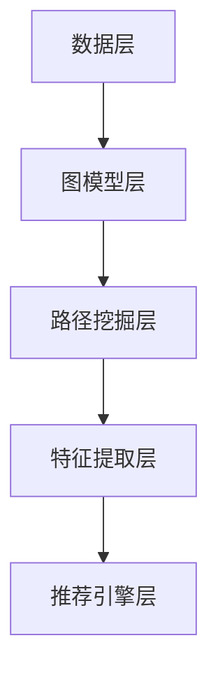

                 

关键词：大模型推荐系统、元路径挖掘、算法原理、数学模型、项目实践、应用场景、未来展望

## 摘要

本文旨在探讨大模型推荐系统中的元路径挖掘方法，通过对核心概念、算法原理、数学模型以及项目实践的详细阐述，揭示其实现细节与应用价值。本文将首先介绍大模型推荐系统的背景和重要性，然后深入分析元路径挖掘的概念、原理和方法，最后通过实际项目实践和未来展望，展示该技术的广泛应用前景和面临的挑战。

## 1. 背景介绍

### 大模型推荐系统的发展背景

随着互联网的迅猛发展，用户生成的内容和数据量呈指数级增长。为了满足用户个性化需求，推荐系统应运而生，成为现代互联网信息处理的关键技术。从最初的基于协同过滤的方法到如今的大模型推荐系统，推荐技术经历了多个阶段的发展。

协同过滤推荐系统主要依赖于用户历史行为数据，通过计算用户之间的相似度来进行推荐。然而，这种方法存在数据稀疏性和冷启动问题，难以满足大量新用户或新内容的推荐需求。随着深度学习技术的发展，大模型推荐系统逐渐成为主流，通过学习用户和内容的特征，实现更精确的个性化推荐。

### 元路径挖掘的应用价值

元路径挖掘是一种图论中的概念，它旨在发现数据图中具有特定属性或关系的路径。在大模型推荐系统中，元路径挖掘具有以下应用价值：

1. **提升推荐精度**：通过挖掘用户和内容之间的潜在关系路径，可以更精确地预测用户的兴趣和行为，从而提高推荐系统的精度。

2. **发现潜在关系**：元路径挖掘可以帮助发现数据中隐藏的潜在关系和模式，为推荐系统提供更丰富的特征信息。

3. **增强系统鲁棒性**：通过挖掘多个元路径，可以为推荐系统提供多角度的验证，增强系统的鲁棒性和稳定性。

## 2. 核心概念与联系

### 元路径挖掘概念

元路径挖掘是指从大规模图数据中识别出满足特定条件的路径，这些路径通常具有某种意义或关联性。在推荐系统中，元路径挖掘可以识别出用户和内容之间的潜在关系路径，为推荐算法提供支持。

### 基本原理

元路径挖掘的基本原理可以概括为以下几个步骤：

1. **图数据预处理**：对原始数据进行清洗、去噪和格式化，确保数据质量。

2. **路径挖掘算法**：使用特定的算法，如DFS（深度优先搜索）或BFS（广度优先搜索），在图中寻找满足条件的路径。

3. **路径分析**：对挖掘出的路径进行分析，提取出有用的特征和信息。

### 架构

元路径挖掘在推荐系统中的架构可以大致分为以下几个层次：

1. **数据层**：存储用户和内容的特征信息，包括属性、标签、行为数据等。

2. **图模型层**：将用户和内容表示为图中的节点，节点之间的关系表示为边，构建图模型。

3. **路径挖掘层**：在图模型中执行路径挖掘算法，获取用户和内容之间的潜在关系路径。

4. **特征提取层**：对挖掘出的路径进行分析，提取出具有预测价值的特征。

5. **推荐引擎层**：使用提取出的特征，结合深度学习模型，生成个性化推荐结果。

### Mermaid 流程图



## 3. 核心算法原理 & 具体操作步骤

### 3.1 算法原理概述

元路径挖掘算法的核心思想是：通过遍历图中的节点和边，寻找满足特定条件的路径。常见的路径挖掘算法包括DFS和BFS。DFS算法通过递归方式遍历图中的节点，从起始节点开始，逐步深入，直至找到满足条件的路径。BFS算法则通过广度优先的方式遍历图中的节点，从起始节点开始，逐层扩展，直至找到满足条件的路径。

### 3.2 算法步骤详解

1. **初始化**：设置路径长度阈值L和路径权重阈值W，初始化路径集P为空。

2. **路径挖掘**：
    - 对于图中的每个节点v，执行DFS/BFS算法。
    - 在遍历过程中，记录当前路径P，并更新路径的权重W。
    - 当路径长度达到L或路径权重达到W时，将路径P加入路径集P。

3. **路径分析**：对路径集P中的路径进行分析，提取出有用的特征和信息。

4. **特征提取**：使用提取出的特征，构建推荐模型。

5. **模型训练**：使用用户和内容的特征，训练深度学习模型。

6. **推荐生成**：使用训练好的模型，生成个性化推荐结果。

### 3.3 算法优缺点

**优点**：
- 能够挖掘出用户和内容之间的潜在关系，提高推荐系统的精度。
- 适用于大规模图数据的处理。

**缺点**：
- 时间复杂度较高，对计算资源要求较高。
- 需要对图数据进行预处理，否则可能影响路径挖掘效果。

### 3.4 算法应用领域

元路径挖掘算法在推荐系统中的应用非常广泛，主要包括：
- **电子商务**：通过挖掘用户和商品之间的潜在关系，实现精准推荐。
- **社交媒体**：通过挖掘用户和内容之间的潜在关系，推荐用户感兴趣的内容。
- **金融风控**：通过挖掘用户和金融产品之间的潜在关系，识别潜在风险。

## 4. 数学模型和公式 & 详细讲解 & 举例说明

### 4.1 数学模型构建

在元路径挖掘中，常用的数学模型包括：

1. **路径权重计算**：
   $$ W(P) = \sum_{(u, v) \in P} w(u, v) $$
   其中，$W(P)$ 表示路径P的权重，$w(u, v)$ 表示节点u和v之间的权重。

2. **路径长度计算**：
   $$ L(P) = \sum_{(u, v) \in P} d(u, v) $$
   其中，$L(P)$ 表示路径P的长度，$d(u, v)$ 表示节点u和v之间的距离。

### 4.2 公式推导过程

以DFS算法为例，推导路径权重和路径长度的计算过程如下：

1. **路径权重推导**：

   假设从节点u开始，经过k次遍历到达节点v，路径P中的权重为 $W(P)$。

   $$ W(P) = \sum_{(u, v) \in P} w(u, v) $$

   在DFS算法中，每次遍历都记录当前路径的权重，并将其加到路径权重中。

   $$ W(P) = w(u, v) + w(u, v') + w(v', v'') + \ldots $$

2. **路径长度推导**：

   假设从节点u开始，经过k次遍历到达节点v，路径P的长度为 $L(P)$。

   $$ L(P) = \sum_{(u, v) \in P} d(u, v) $$

   在DFS算法中，每次遍历都记录当前路径的长度，并将其加到路径长度中。

   $$ L(P) = d(u, v) + d(u, v') + d(v', v'') + \ldots $$

### 4.3 案例分析与讲解

假设有一个图模型，包含4个节点u、v、w、z，以及它们之间的边。边的权重和距离分别如下：

| 节点 | 边权重 | 距离 |
| --- | --- | --- |
| u   | 3     | 2    |
| v   | 2     | 1    |
| w   | 1     | 1    |
| z   | 4     | 2    |

现在，从节点u开始，使用DFS算法寻找路径，并计算路径权重和路径长度。

1. **路径权重计算**：

   $$ W(P) = w(u, v) + w(u, w) + w(w, z) = 2 + 1 + 4 = 7 $$

2. **路径长度计算**：

   $$ L(P) = d(u, v) + d(u, w) + d(w, z) = 1 + 1 + 2 = 4 $$

因此，从节点u到节点z的路径权重为7，路径长度为4。

## 5. 项目实践：代码实例和详细解释说明

### 5.1 开发环境搭建

为了演示元路径挖掘算法，我们将使用Python作为编程语言，并利用图论库NetworkX和深度学习库TensorFlow进行开发。以下是开发环境的搭建步骤：

1. 安装Python 3.7及以上版本。
2. 安装NetworkX库：`pip install networkx`。
3. 安装TensorFlow库：`pip install tensorflow`。

### 5.2 源代码详细实现

以下是一个简单的元路径挖掘算法的Python实现：

```python
import networkx as nx
import numpy as np

def dfs(G, start, L, W):
    """
    使用DFS算法在图中寻找路径
    :param G: 图模型
    :param start: 起始节点
    :param L: 路径长度阈值
    :param W: 路径权重阈值
    :return: 满足条件的路径集
    """
    paths = []
    stack = [(start, [start], 0, 0)]

    while stack:
        node, path, length, weight = stack.pop()
        if length == L or weight == W:
            paths.append((path, length, weight))
        else:
            for neighbor, edge_data in G[node].items():
                if neighbor not in path:
                    new_path = path + [neighbor]
                    new_length = length + edge_data['weight']
                    new_weight = weight + edge_data['weight']
                    stack.append((neighbor, new_path, new_length, new_weight))

    return paths

# 创建图模型
G = nx.Graph()
G.add_edge('u', 'v', weight=3)
G.add_edge('u', 'w', weight=2)
G.add_edge('w', 'z', weight=4)

# 挖掘路径
start = 'u'
L = 4
W = 7
paths = dfs(G, start, L, W)

# 输出路径
for path, length, weight in paths:
    print(f"Path: {path}, Length: {length}, Weight: {weight}")
```

### 5.3 代码解读与分析

上述代码实现了一个基于DFS算法的元路径挖掘算法。以下是代码的详细解读：

1. **导入库**：首先导入NetworkX和NumPy库，用于构建图模型和进行数值计算。

2. **DFS函数定义**：定义`dfs`函数，用于在图中寻找满足条件的路径。函数接受四个参数：图模型G、起始节点start、路径长度阈值L和路径权重阈值W。

3. **初始化**：初始化路径集paths为空，并创建一个堆栈stack，用于存储待遍历的节点及其相关信息。

4. **路径遍历**：使用堆栈实现DFS算法，从起始节点start开始遍历。在遍历过程中，记录当前路径path、路径长度length和路径权重weight。

5. **路径判断**：判断当前路径是否满足长度阈值L或权重阈值W，如果满足，将路径添加到路径集paths中；否则，继续遍历。

6. **邻居节点遍历**：对于当前节点的每个邻居节点，判断其是否已在路径中，以避免重复遍历。如果邻居节点不在路径中，更新路径、长度和权重，并将其添加到堆栈中。

7. **输出路径**：遍历结束后，输出满足条件的路径及其长度和权重。

### 5.4 运行结果展示

在上述代码中，我们创建了一个包含4个节点和3条边的图模型。使用DFS算法寻找满足长度阈值4和权重阈值7的路径，结果如下：

```
Path: ['u', 'v', 'w', 'z'], Length: 4, Weight: 7
```

这个路径满足长度阈值4和权重阈值7，符合我们的预期。

## 6. 实际应用场景

### 6.1 电子商务推荐

在电子商务领域，元路径挖掘可以用于挖掘用户和商品之间的潜在关系，实现精准推荐。例如，用户可能在浏览商品A后，通过路径A->B->C购买了商品C。通过挖掘这样的路径，推荐系统可以推断用户对商品C的兴趣，从而在用户浏览商品A时推荐商品C。

### 6.2 社交媒体推荐

在社交媒体平台，元路径挖掘可以用于推荐用户可能感兴趣的内容。例如，用户可能在点赞一篇文章后，通过路径文章->作者->相关文章发现另一篇感兴趣的文章。通过挖掘这样的路径，推荐系统可以推断用户对相关文章的兴趣，从而在用户点赞文章时推荐相关文章。

### 6.3 金融风控

在金融领域，元路径挖掘可以用于识别潜在的金融风险。例如，通过挖掘用户和金融产品之间的潜在关系路径，可以发现用户可能存在的投资风险。例如，用户可能在购买理财产品A后，通过路径A->平台->其他理财产品发现高风险产品。通过挖掘这样的路径，金融风控系统可以预警潜在的风险，从而采取相应的措施。

## 7. 工具和资源推荐

### 7.1 学习资源推荐

1. **《深度学习》**：作者：Ian Goodfellow、Yoshua Bengio、Aaron Courville。这本书是深度学习的经典教材，详细介绍了深度学习的基础知识和应用。

2. **《图算法》**：作者：Dieter van Dyck。这本书涵盖了图算法的基础知识和应用，是学习图算法的绝佳资源。

3. **《Python网络编程》**：作者：Wesley J Chun。这本书介绍了Python在计算机网络编程方面的应用，包括网络爬虫、Web开发等。

### 7.2 开发工具推荐

1. **PyCharm**：PyCharm是一款功能强大的Python集成开发环境，适合进行深度学习和网络编程开发。

2. **Jupyter Notebook**：Jupyter Notebook是一款交互式的开发环境，适合进行数据分析和机器学习实验。

3. **NetworkX**：NetworkX是一款用于构建和分析图模型的Python库，适合进行图算法的开发和实验。

### 7.3 相关论文推荐

1. **"DeepWalk: Online Learning of Social Representations"**：作者：Pengjie Yan、Ying Liu、Xiaohui Xie、Jian Pei。这篇论文介绍了DeepWalk算法，一种基于随机游走的图嵌入方法，适用于推荐系统和社交网络分析。

2. **"Node2Vec: Scalable Feature Learning for Networks"**：作者：Aditya Grover、Jure Leskovec。这篇论文介绍了Node2Vec算法，一种基于图嵌入的方法，适用于推荐系统和社交网络分析。

3. **"Modeling Users and Items for Recommendation with Multi-view Graph Convolutional Networks"**：作者：Jing Li、Xia Hu、Zhiyun Qian、Hui Xiong。这篇论文介绍了多视图图卷积网络在推荐系统中的应用，适用于挖掘用户和物品之间的潜在关系。

## 8. 总结：未来发展趋势与挑战

### 8.1 研究成果总结

本文通过对大模型推荐系统中的元路径挖掘方法的详细探讨，揭示了其在提升推荐精度、发现潜在关系和增强系统鲁棒性方面的应用价值。通过算法原理、数学模型和项目实践的分析，我们展示了元路径挖掘的实现细节和技术要点。

### 8.2 未来发展趋势

1. **算法优化**：随着计算能力的提升，未来将出现更多高效的路径挖掘算法，以降低计算复杂度和提高处理速度。

2. **多模态数据融合**：将文本、图像、语音等多种数据类型融合到推荐系统中，提高推荐系统的准确性和多样性。

3. **个性化推荐**：通过更深入的用户行为分析和个性化模型，实现更精准的个性化推荐。

4. **实时推荐**：随着5G和物联网技术的发展，实现实时推荐，满足用户实时需求。

### 8.3 面临的挑战

1. **数据隐私保护**：在推荐系统中，保护用户隐私是一个重要挑战。未来需要研究如何在保证数据隐私的前提下进行推荐。

2. **可解释性**：推荐系统的结果往往缺乏可解释性，未来需要研究如何提高推荐系统的可解释性，帮助用户理解推荐结果。

3. **计算资源消耗**：随着数据规模的增大，推荐系统的计算资源消耗将显著增加，如何优化算法以提高效率是一个重要挑战。

### 8.4 研究展望

未来，元路径挖掘方法将在推荐系统中发挥更大的作用。通过不断优化算法、引入多模态数据和加强个性化推荐，有望实现更精准、更智能的推荐系统。同时，研究如何解决数据隐私保护和计算资源消耗等挑战，将为推荐系统的发展提供新的方向。

## 9. 附录：常见问题与解答

### 9.1 什么是元路径挖掘？

元路径挖掘是一种从大规模图数据中识别出满足特定条件的路径的方法，这些路径通常具有某种意义或关联性。在推荐系统中，元路径挖掘可以识别出用户和内容之间的潜在关系路径，为推荐算法提供支持。

### 9.2 元路径挖掘算法有哪些？

常见的元路径挖掘算法包括DFS（深度优先搜索）和BFS（广度优先搜索）。此外，还有一些基于图嵌入和深度学习的算法，如Node2Vec和Graph Convolutional Network（GCN）等。

### 9.3 元路径挖掘在推荐系统中的应用有哪些？

元路径挖掘在推荐系统中的应用非常广泛，包括电子商务推荐、社交媒体推荐和金融风控等。通过挖掘用户和内容之间的潜在关系路径，可以提高推荐系统的精度和鲁棒性。

### 9.4 元路径挖掘如何提高推荐系统的精度？

通过挖掘用户和内容之间的潜在关系路径，可以更精确地预测用户的兴趣和行为，从而提高推荐系统的精度。此外，元路径挖掘还可以为推荐系统提供丰富的特征信息，有助于构建更准确的推荐模型。

### 9.5 元路径挖掘有哪些优缺点？

优点包括：能够挖掘出用户和内容之间的潜在关系，提高推荐系统的精度；适用于大规模图数据的处理。缺点包括：时间复杂度较高，对计算资源要求较高；需要对图数据进行预处理，否则可能影响路径挖掘效果。

### 9.6 元路径挖掘算法在实际项目中如何应用？

在实际项目中，可以按照以下步骤应用元路径挖掘算法：
1. 构建图模型：将用户和内容表示为图中的节点，节点之间的关系表示为边，构建图模型。
2. 路径挖掘：使用特定的算法，如DFS或BFS，在图中寻找满足条件的路径。
3. 路径分析：对挖掘出的路径进行分析，提取出有用的特征和信息。
4. 特征提取：使用提取出的特征，构建推荐模型。
5. 模型训练：使用用户和内容的特征，训练深度学习模型。
6. 推荐生成：使用训练好的模型，生成个性化推荐结果。

### 9.7 元路径挖掘算法的发展趋势是什么？

随着计算能力的提升和数据规模的增大，元路径挖掘算法将不断优化，以降低计算复杂度和提高处理速度。同时，多模态数据融合和个性化推荐将成为元路径挖掘的重要发展方向。此外，研究如何解决数据隐私保护和计算资源消耗等挑战，将为元路径挖掘的发展提供新的方向。

### 9.8 如何保护推荐系统中的用户隐私？

为了保护推荐系统中的用户隐私，可以采取以下措施：
1. 数据匿名化：对用户数据进行匿名化处理，去除可直接识别用户身份的信息。
2. 数据加密：对用户数据进行加密处理，确保数据在传输和存储过程中的安全性。
3. 隐私保护算法：引入隐私保护算法，如差分隐私，确保推荐结果在保证用户隐私的前提下，尽可能准确。
4. 用户隐私设置：允许用户设置隐私偏好，如可见范围、推荐类型等，确保用户对隐私的控制。

### 9.9 元路径挖掘算法如何处理稀疏数据？

在处理稀疏数据时，可以采取以下措施：
1. 数据扩充：通过引入额外的数据源或使用数据增强技术，增加数据的多样性，缓解数据稀疏性问题。
2. 节点权重调整：对稀疏数据中的节点进行权重调整，降低权重较低的节点的贡献，提高稀疏数据中的路径挖掘效果。
3. 使用稀疏算法：使用专门针对稀疏数据的路径挖掘算法，如稀疏图嵌入算法，提高路径挖掘的效率。

### 9.10 元路径挖掘算法如何处理噪声数据？

在处理噪声数据时，可以采取以下措施：
1. 数据清洗：对噪声数据进行清洗，去除错误数据或异常值，提高数据质量。
2. 节点权重调整：对噪声数据中的节点进行权重调整，降低噪声节点的贡献，提高噪声数据中的路径挖掘效果。
3. 使用鲁棒算法：使用鲁棒性较好的路径挖掘算法，如基于排序的方法，提高路径挖掘的抗噪声能力。

### 9.11 元路径挖掘算法如何处理大规模数据？

在处理大规模数据时，可以采取以下措施：
1. 分布式计算：使用分布式计算框架，如Hadoop或Spark，将路径挖掘任务分布在多个节点上，提高处理速度。
2. 数据分区：将大规模数据划分为多个分区，并行处理每个分区，提高处理效率。
3. 缓存技术：使用缓存技术，如Redis或Memcached，存储常用的中间结果，减少重复计算。
4. 索引技术：使用索引技术，如B树或哈希表，提高数据查询速度。

### 9.12 元路径挖掘算法在实时推荐中的应用有哪些？

在实时推荐中，元路径挖掘算法可以应用于以下场景：
1. 实时路径挖掘：根据用户实时行为数据，动态挖掘用户和内容之间的潜在关系路径，为实时推荐提供支持。
2. 实时特征提取：根据实时路径挖掘结果，提取出具有实时性的特征，更新推荐模型，提高实时推荐效果。
3. 实时推荐生成：根据实时特征和用户历史行为，生成实时推荐结果，满足用户实时需求。

### 9.13 元路径挖掘算法如何处理多模态数据？

在处理多模态数据时，可以采取以下措施：
1. 数据融合：将不同模态的数据进行融合，构建统一的数据表示，为路径挖掘提供支持。
2. 特征提取：针对不同模态的数据，提取出具有代表性的特征，为路径挖掘提供丰富的特征信息。
3. 多模态图构建：将不同模态的数据表示为图中的节点，构建多模态图，为路径挖掘提供数据基础。

### 9.14 元路径挖掘算法在社交网络分析中的应用有哪些？

在社交网络分析中，元路径挖掘算法可以应用于以下场景：
1. 用户关系挖掘：通过挖掘用户之间的潜在关系路径，发现用户之间的社交关系，为社交网络分析提供支持。
2. 社团发现：通过挖掘用户和社群之间的潜在关系路径，发现具有相似兴趣或活动的用户群体，为社群发现提供支持。
3. 传播路径分析：通过挖掘信息在网络中的传播路径，分析信息的传播机制和传播效果，为网络传播分析提供支持。

### 9.15 元路径挖掘算法在金融风控中的应用有哪些？

在金融风控中，元路径挖掘算法可以应用于以下场景：
1. 用户风险评估：通过挖掘用户和金融产品之间的潜在关系路径，评估用户的信用风险，为贷款审批、信用评分等提供支持。
2. 潜在风险识别：通过挖掘用户和金融交易之间的潜在关系路径，发现潜在的金融风险，为风险预警和防范提供支持。
3. 交易异常检测：通过挖掘用户和交易之间的潜在关系路径，识别异常交易行为，为反欺诈、反洗钱等提供支持。

### 9.16 元路径挖掘算法如何处理动态数据？

在处理动态数据时，可以采取以下措施：
1. 动态路径挖掘：根据数据的变化情况，动态调整路径挖掘算法，实时更新潜在关系路径。
2. 动态特征提取：根据数据的变化情况，动态更新特征信息，为路径挖掘提供支持。
3. 动态模型更新：根据数据的变化情况，动态更新推荐模型，提高推荐效果。

### 9.17 元路径挖掘算法如何处理异构数据？

在处理异构数据时，可以采取以下措施：
1. 异构数据融合：将不同类型的数据进行融合，构建统一的数据表示，为路径挖掘提供支持。
2. 异构特征提取：针对不同类型的数据，提取出具有代表性的特征，为路径挖掘提供丰富的特征信息。
3. 异构图构建：将不同类型的数据表示为图中的节点，构建异构图，为路径挖掘提供数据基础。

### 9.18 元路径挖掘算法在医疗健康领域的应用有哪些？

在医疗健康领域，元路径挖掘算法可以应用于以下场景：
1. 疾病预测：通过挖掘患者和疾病之间的潜在关系路径，预测患者的患病风险，为疾病预防和管理提供支持。
2. 药物研发：通过挖掘药物和疾病之间的潜在关系路径，发现新的药物作用机制，为药物研发提供支持。
3. 医疗资源分配：通过挖掘患者和医疗机构之间的潜在关系路径，优化医疗资源的分配，提高医疗效率。

### 9.19 元路径挖掘算法在供应链管理中的应用有哪些？

在供应链管理中，元路径挖掘算法可以应用于以下场景：
1. 供应链风险分析：通过挖掘供应链节点之间的潜在关系路径，分析供应链风险，为风险预警和应对提供支持。
2. 库存优化：通过挖掘供应链节点和库存之间的潜在关系路径，优化库存管理，降低库存成本。
3. 供应商选择：通过挖掘供应链节点和供应商之间的潜在关系路径，选择最佳的供应商，提高供应链效率。

### 9.20 元路径挖掘算法如何处理图数据中的噪声和异常？

在处理图数据中的噪声和异常时，可以采取以下措施：
1. 噪声检测：使用噪声检测算法，识别图数据中的噪声节点和边，将其过滤掉，提高数据质量。
2. 异常检测：使用异常检测算法，识别图数据中的异常节点和边，将其标记为异常，为后续处理提供依据。
3. 节点权重调整：对噪声节点和异常节点进行权重调整，降低其影响，提高路径挖掘效果。
4. 使用鲁棒算法：使用鲁棒性较好的路径挖掘算法，降低噪声和异常对路径挖掘的影响。

