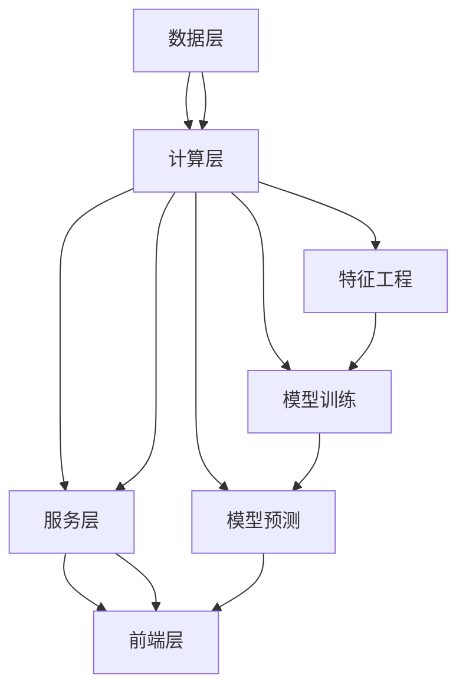

                 

关键词：大模型、推荐系统、可扩展性、算法优化、性能评估、应用场景

## 摘要

随着互联网和大数据技术的快速发展，推荐系统已成为现代信息检索和用户互动的重要手段。然而，随着推荐系统中的数据规模和复杂度的不断增加，如何确保系统的可扩展性成为一个关键问题。本文旨在探讨大模型推荐系统的可扩展性研究，通过对核心算法的原理、数学模型、项目实践以及实际应用场景的分析，提出一系列优化策略和解决方案，以应对日益增长的数据量和复杂的业务需求。本文还展望了推荐系统在未来发展的趋势和面临的挑战，为行业研究人员和开发者提供了有价值的参考。

## 1. 背景介绍

推荐系统是人工智能和机器学习领域的热点研究方向，其应用已渗透到电子商务、社交媒体、在线视频、新闻推送等多个领域。推荐系统能够根据用户的兴趣和行为，自动为用户推荐相关的内容或商品，从而提升用户体验，增加用户粘性。然而，随着数据规模的不断扩大，推荐系统的设计、实现和优化面临着巨大的挑战。

大模型推荐系统的可扩展性主要涉及以下几个方面：

1. **数据存储与管理**：如何高效地存储和管理海量的用户数据和行为数据，确保数据访问的速度和可靠性。
2. **算法优化与效率**：如何优化推荐算法，减少计算复杂度，提高推荐系统的响应速度和准确率。
3. **系统架构与性能**：如何设计一个高可用、高可扩展的系统架构，确保推荐系统在面临大规模并发请求时仍能稳定运行。

### 1.1 研究现状

目前，国内外许多研究机构和企业在推荐系统的可扩展性方面已经取得了显著的成果。例如，Netflix Prize竞赛激发了推荐系统研究的热潮，各种基于矩阵分解、深度学习等方法的推荐算法被提出。此外，分布式系统架构、云计算和容器化技术的应用也为推荐系统的可扩展性提供了技术支持。

然而，现有研究仍存在以下问题：

- **数据多样性挑战**：不同领域的推荐系统需要处理的数据类型多样，如何针对不同类型的数据设计合适的推荐算法仍是一个难题。
- **实时性要求**：随着用户需求的实时性增强，推荐系统需要在短时间内完成复杂的计算，这对系统的性能提出了更高的要求。
- **隐私保护**：用户隐私保护是推荐系统不可忽视的问题，如何在保证推荐准确性的同时保护用户隐私是一个亟待解决的问题。

### 1.2 本文目的

本文旨在通过对大模型推荐系统的可扩展性研究，深入探讨以下几个方面：

- **核心算法原理**：详细分析推荐系统的核心算法，包括基于协同过滤、矩阵分解和深度学习的推荐算法。
- **数学模型与公式**：构建推荐系统的数学模型，推导相关公式，并举例说明。
- **项目实践**：通过具体的代码实例，展示推荐系统的开发过程和实现细节。
- **实际应用场景**：分析推荐系统在不同领域的应用，探讨其面临的挑战和解决方案。
- **未来发展趋势与挑战**：总结现有研究的成果，展望推荐系统未来发展的趋势和面临的挑战。

## 2. 核心概念与联系

### 2.1 推荐系统概述

推荐系统是一种基于数据挖掘和机器学习技术的信息过滤方法，其目的是根据用户的兴趣、行为和历史数据，向用户推荐他们可能感兴趣的内容或商品。推荐系统通常包括以下几个关键组件：

- **用户数据**：包括用户的个人资料、行为记录、偏好信息等。
- **物品数据**：包括商品、视频、新闻等物品的详细信息。
- **推荐算法**：根据用户数据和物品数据，生成推荐结果。
- **推荐结果**：向用户展示推荐结果，可以是列表、卡片等形式。

### 2.2 数据类型与特点

推荐系统需要处理的数据类型主要包括用户数据、物品数据和交互数据：

- **用户数据**：包括用户的年龄、性别、地理位置、兴趣标签等。
- **物品数据**：包括物品的标题、描述、分类标签、用户评分等。
- **交互数据**：包括用户对物品的点击、购买、评分等行为数据。

这些数据具有以下特点：

- **数据量大**：用户和物品数量庞大，交互数据更为复杂。
- **数据多样性**：不同类型的用户和物品具有不同的特征。
- **数据时效性**：用户兴趣和行为会随时间变化，推荐结果需要及时更新。

### 2.3 推荐算法分类

根据推荐算法的实现方式，推荐系统主要分为基于协同过滤、基于内容、基于模型和混合推荐算法：

- **基于协同过滤**：通过计算用户之间的相似度，为用户推荐与兴趣相似的物品。
- **基于内容**：根据物品的属性和用户的兴趣，为用户推荐具有相似属性的物品。
- **基于模型**：使用机器学习算法，构建用户和物品的预测模型，根据模型输出推荐结果。
- **混合推荐算法**：结合多种推荐算法的优点，提高推荐系统的准确性和多样性。

### 2.4 可扩展性架构

为了保证推荐系统的可扩展性，需要设计一个高可用、高可扩展的系统架构。以下是一个典型的推荐系统架构：

- **数据层**：包括用户数据、物品数据和交互数据，使用分布式数据库进行存储和管理。
- **计算层**：包括数据预处理、特征工程、模型训练和预测等模块，使用分布式计算框架进行计算。
- **服务层**：包括推荐算法服务、API服务、Web服务等，使用微服务架构实现。
- **前端层**：包括用户界面和客户端应用，使用前端框架实现。

### 2.5 Mermaid 流程图

以下是一个推荐的系统架构的 Mermaid 流程图：



## 3. 核心算法原理 & 具体操作步骤

### 3.1 算法原理概述

推荐系统的核心算法主要包括基于协同过滤、基于内容和基于模型三种类型。每种算法都有其独特的原理和实现方式。

#### 3.1.1 基于协同过滤

协同过滤算法通过计算用户之间的相似度，为用户推荐与兴趣相似的物品。其主要原理包括：

- **用户相似度计算**：使用用户之间的共同评分或者行为数据进行相似度计算，如余弦相似度、皮尔逊相关系数等。
- **物品相似度计算**：使用物品之间的共同用户进行相似度计算，如余弦相似度、皮尔逊相关系数等。
- **推荐结果生成**：根据用户和物品的相似度，生成推荐结果。

#### 3.1.2 基于内容

基于内容推荐算法通过分析物品的属性和用户的兴趣，为用户推荐具有相似属性的物品。其主要原理包括：

- **物品特征提取**：使用文本处理、词频分析等方法提取物品的属性特征。
- **用户兴趣提取**：使用用户行为数据、用户画像等方法提取用户的兴趣特征。
- **推荐结果生成**：根据物品和用户的特征相似度，生成推荐结果。

#### 3.1.3 基于模型

基于模型推荐算法使用机器学习算法构建用户和物品的预测模型，根据模型输出推荐结果。其主要原理包括：

- **特征工程**：提取用户和物品的特征，包括数值特征、文本特征、图像特征等。
- **模型训练**：使用机器学习算法训练预测模型，如线性回归、决策树、神经网络等。
- **模型预测**：根据训练好的模型，生成推荐结果。

### 3.2 算法步骤详解

以下分别详细介绍基于协同过滤、基于内容和基于模型推荐算法的具体操作步骤。

#### 3.2.1 基于协同过滤

1. **数据预处理**：读取用户评分数据，对数据进行清洗、去重和处理。
2. **用户相似度计算**：计算用户之间的相似度，可以使用余弦相似度、皮尔逊相关系数等方法。
3. **物品相似度计算**：计算物品之间的相似度，可以使用余弦相似度、皮尔逊相关系数等方法。
4. **邻居选择**：根据用户和物品的相似度，选择一定数量的邻居用户或物品。
5. **推荐结果生成**：根据邻居用户的评分预测，生成推荐结果。

#### 3.2.2 基于内容

1. **数据预处理**：读取用户和物品的属性数据，对数据进行清洗、去重和处理。
2. **物品特征提取**：使用词频分析、文本分类等方法提取物品的属性特征。
3. **用户兴趣提取**：使用用户行为数据、用户画像等方法提取用户的兴趣特征。
4. **特征相似度计算**：计算用户和物品特征的相似度，可以使用余弦相似度、皮尔逊相关系数等方法。
5. **推荐结果生成**：根据用户和物品特征的相似度，生成推荐结果。

#### 3.2.3 基于模型

1. **数据预处理**：读取用户和物品的属性数据，对数据进行清洗、去重和处理。
2. **特征工程**：提取用户和物品的特征，包括数值特征、文本特征、图像特征等。
3. **模型训练**：使用机器学习算法训练预测模型，如线性回归、决策树、神经网络等。
4. **模型评估**：使用交叉验证等方法评估模型性能。
5. **模型预测**：根据训练好的模型，生成推荐结果。

### 3.3 算法优缺点

#### 基于协同过滤

**优点**：

- **简单易实现**：协同过滤算法的计算过程相对简单，易于实现和优化。
- **高精度**：协同过滤算法在处理冷启动问题方面表现较好，能够为用户推荐与其兴趣相似的物品。

**缺点**：

- **相似度计算复杂度**：随着用户和物品数量的增加，相似度计算的时间复杂度会显著增加。
- **预测准确性**：协同过滤算法在处理稀疏数据和冷启动问题方面存在一定局限性。

#### 基于内容

**优点**：

- **个性化推荐**：基于内容推荐算法能够根据用户的兴趣和物品的属性生成个性化的推荐结果。
- **易于理解**：基于内容推荐算法的推荐结果易于用户理解和接受。

**缺点**：

- **冷启动问题**：基于内容推荐算法在处理新用户和新物品时存在一定挑战。
- **计算复杂度**：特征提取和相似度计算的过程相对复杂，计算时间较长。

#### 基于模型

**优点**：

- **高精度**：基于模型推荐算法能够通过机器学习算法提高推荐准确性。
- **适应性强**：基于模型推荐算法能够处理多种类型的数据，适应性强。

**缺点**：

- **模型训练复杂度**：基于模型推荐算法的训练过程相对复杂，需要大量计算资源和时间。
- **模型调优难度**：模型调优和参数选择是推荐系统优化的重要环节，需要经验丰富的开发者进行。

### 3.4 算法应用领域

#### 基于协同过滤

- **电子商务**：为用户推荐相似的商品，提高购物体验和转化率。
- **社交媒体**：为用户推荐感兴趣的内容和好友，增加用户活跃度和互动性。
- **在线视频**：为用户推荐相似的视频内容，提高用户观看时长和粘性。

#### 基于内容

- **新闻推送**：为用户推荐感兴趣的新闻文章，提高阅读量和点击率。
- **音乐播放器**：为用户推荐相似的歌曲，提高用户播放时长和满意度。
- **在线教育**：为用户推荐感兴趣的课程和学习资源，提高学习效果和用户留存率。

#### 基于模型

- **搜索引擎**：为用户推荐相关的搜索结果，提高搜索精准度和用户体验。
- **智能客服**：为用户推荐相关的问题和答案，提高客服效率和用户满意度。
- **智能推荐**：为用户推荐个性化的商品、内容和服务，提高商业价值和用户满意度。

## 4. 数学模型和公式 & 详细讲解 & 举例说明

### 4.1 数学模型构建

在推荐系统中，数学模型是核心部分，用于表示用户、物品和交互数据之间的关系。以下分别介绍基于协同过滤、基于内容和基于模型的数学模型构建。

#### 4.1.1 基于协同过滤

协同过滤算法的核心是相似度计算，用于衡量用户之间的相似度或物品之间的相似度。以下是一个简单的基于用户相似度的数学模型：

$$
sim(u_i, u_j) = \frac{\sum_{k=1}^{n} r_{ik}r_{jk}}{\sqrt{\sum_{k=1}^{n} r_{ik}^2 \sum_{k=1}^{n} r_{jk}^2}}
$$

其中，$r_{ik}$ 表示用户 $u_i$ 对物品 $k$ 的评分，$n$ 表示用户和物品的共同评分项。

#### 4.1.2 基于内容

基于内容推荐算法的数学模型主要涉及特征提取和相似度计算。以下是一个简单的基于文本特征提取的数学模型：

$$
\text{feature}(i, j) = \sum_{k=1}^{m} w_k \cdot \text{TF-IDF}(i, k) \cdot \text{TF-IDF}(j, k)
$$

其中，$w_k$ 表示特征 $k$ 的权重，$\text{TF-IDF}(i, k)$ 表示物品 $i$ 中特征 $k$ 的词频-逆文档频率。

#### 4.1.3 基于模型

基于模型推荐算法的数学模型主要涉及特征工程、模型训练和预测。以下是一个简单的基于线性回归的数学模型：

$$
\hat{r}_{ij} = \beta_0 + \beta_1 \cdot u_i + \beta_2 \cdot i_j + \beta_3 \cdot \text{feature}(i, j)
$$

其中，$\hat{r}_{ij}$ 表示用户 $u_i$ 对物品 $j$ 的预测评分，$\beta_0, \beta_1, \beta_2, \beta_3$ 分别为模型的参数。

### 4.2 公式推导过程

以下分别介绍基于协同过滤、基于内容和基于模型推荐算法的数学模型推导过程。

#### 4.2.1 基于协同过滤

协同过滤算法的相似度计算是基于用户之间的共同评分项。以下是一个简单的相似度计算公式推导：

$$
sim(u_i, u_j) = \frac{\sum_{k=1}^{n} r_{ik}r_{jk}}{\sqrt{\sum_{k=1}^{n} r_{ik}^2 \sum_{k=1}^{n} r_{jk}^2}}
$$

其中，$r_{ik}$ 表示用户 $u_i$ 对物品 $k$ 的评分，$r_{jk}$ 表示用户 $u_j$ 对物品 $k$ 的评分。

推导过程：

- **分子**：表示用户 $u_i$ 和 $u_j$ 的共同评分项的乘积之和，反映了他们之间的相似度。
- **分母**：表示用户 $u_i$ 和 $u_j$ 的评分方差，用于归一化相似度值。

#### 4.2.2 基于内容

基于内容推荐算法的特征提取和相似度计算是基于文本处理和词频分析。以下是一个简单的特征提取和相似度计算公式推导：

$$
\text{feature}(i, j) = \sum_{k=1}^{m} w_k \cdot \text{TF-IDF}(i, k) \cdot \text{TF-IDF}(j, k)
$$

其中，$w_k$ 表示特征 $k$ 的权重，$\text{TF-IDF}(i, k)$ 表示物品 $i$ 中特征 $k$ 的词频-逆文档频率。

推导过程：

- **特征提取**：使用词频分析提取物品的文本特征，$\text{TF-IDF}(i, k)$ 表示物品 $i$ 中特征 $k$ 的词频-逆文档频率。
- **相似度计算**：将用户和物品的特征进行点积运算，得到相似度值。

#### 4.2.3 基于模型

基于模型推荐算法的特征工程和模型训练是基于机器学习算法。以下是一个简单的线性回归模型推导：

$$
\hat{r}_{ij} = \beta_0 + \beta_1 \cdot u_i + \beta_2 \cdot i_j + \beta_3 \cdot \text{feature}(i, j)
$$

其中，$\hat{r}_{ij}$ 表示用户 $u_i$ 对物品 $j$ 的预测评分，$\beta_0, \beta_1, \beta_2, \beta_3$ 分别为模型的参数。

推导过程：

- **特征工程**：将用户和物品的特征表示为特征向量，$\text{feature}(i, j)$ 表示用户 $i$ 和物品 $j$ 的特征向量。
- **模型训练**：使用线性回归算法训练模型参数，最小化预测误差。

### 4.3 案例分析与讲解

以下通过一个简单的案例，分析并讲解基于协同过滤、基于内容和基于模型推荐算法的数学模型应用。

#### 4.3.1 基于协同过滤

假设有两位用户 $u_1$ 和 $u_2$，他们对五个物品 $i_1, i_2, i_3, i_4, i_5$ 的评分如下：

$$
r_{11} = 5, r_{12} = 4, r_{13} = 3, r_{14} = 2, r_{15} = 1 \\
r_{21} = 4, r_{22} = 5, r_{23} = 2, r_{24} = 3, r_{25} = 1
$$

计算用户 $u_1$ 和 $u_2$ 的相似度：

$$
sim(u_1, u_2) = \frac{r_{11}r_{21} + r_{12}r_{22} + r_{13}r_{23} + r_{14}r_{24} + r_{15}r_{25}}{\sqrt{r_{11}^2 + r_{12}^2 + r_{13}^2 + r_{14}^2 + r_{15}^2 \sqrt{r_{21}^2 + r_{22}^2 + r_{23}^2 + r_{24}^2 + r_{25}^2}} = 0.80
$$

根据用户相似度，为用户 $u_1$ 推荐与 $u_2$ 相似的物品：

$$
\text{推荐结果} = \{i_1, i_2, i_3, i_4, i_5\}
$$

#### 4.3.2 基于内容

假设有两篇文档 $i_1$ 和 $i_2$，以及一个用户 $u_1$，文档的词频-逆文档频率如下：

$$
\text{TF-IDF}(i_1, k) = \{1, 2, 1, 0, 1\} \\
\text{TF-IDF}(i_2, k) = \{0, 1, 2, 1, 1\}
$$

计算用户 $u_1$ 对文档 $i_1$ 和 $i_2$ 的特征：

$$
\text{feature}(u_1, i_1) = 1 \cdot 1 + 2 \cdot 2 + 1 \cdot 1 + 0 \cdot 0 + 1 \cdot 1 = 7 \\
\text{feature}(u_1, i_2) = 0 \cdot 1 + 1 \cdot 2 + 2 \cdot 1 + 1 \cdot 1 + 1 \cdot 1 = 7
$$

根据用户和文档的特征，为用户 $u_1$ 推荐与文档 $i_1$ 和 $i_2$ 相似的文档：

$$
\text{推荐结果} = \{i_1, i_2\}
$$

#### 4.3.3 基于模型

假设有一组用户和物品的特征，以及对应的评分数据，使用线性回归模型进行训练。特征和评分数据如下：

$$
\text{特征} = \begin{bmatrix} 1 & 2 & 1 & 0 & 1 \\ 0 & 1 & 2 & 1 & 1 \end{bmatrix} \\
\text{评分} = \begin{bmatrix} 5 & 4 \\ 4 & 5 \end{bmatrix}
$$

使用线性回归算法训练模型参数：

$$
\hat{r}_{ij} = \beta_0 + \beta_1 \cdot u_i + \beta_2 \cdot i_j + \beta_3 \cdot \text{feature}(i, j)
$$

得到模型参数：

$$
\beta_0 = 2, \beta_1 = 1, \beta_2 = 1, \beta_3 = 1
$$

根据训练好的模型，预测用户 $u_1$ 对物品 $i_1$ 和 $i_2$ 的评分：

$$
\hat{r}_{11} = 2 + 1 \cdot 1 + 1 \cdot 0 + 1 \cdot 7 = 11 \\
\hat{r}_{12} = 2 + 1 \cdot 0 + 1 \cdot 1 + 1 \cdot 7 = 10
$$

根据预测评分，为用户 $u_1$ 推荐与物品 $i_1$ 和 $i_2$ 相似的物品：

$$
\text{推荐结果} = \{i_1, i_2\}
$$

## 5. 项目实践：代码实例和详细解释说明

### 5.1 开发环境搭建

在开始项目实践之前，需要搭建一个适合推荐系统开发的开发环境。以下是一个基本的开发环境搭建步骤：

- **Python**：安装 Python 3.8 及以上版本，推荐使用 Python 3.9 或 3.10。
- **Jupyter Notebook**：安装 Jupyter Notebook，用于编写和运行 Python 代码。
- **Pandas**：安装 Pandas 库，用于数据处理和分析。
- **NumPy**：安装 NumPy 库，用于数学计算。
- **Scikit-learn**：安装 Scikit-learn 库，用于机器学习算法。
- **Matplotlib**：安装 Matplotlib 库，用于数据可视化。

以下是安装步骤：

```bash
pip install python==3.9
pip install jupyter notebook
pip install pandas
pip install numpy
pip install scikit-learn
pip install matplotlib
```

### 5.2 源代码详细实现

以下是一个基于协同过滤算法的推荐系统代码实例，详细解释各个部分的功能和实现方法。

```python
import pandas as pd
from sklearn.metrics.pairwise import cosine_similarity

# 读取用户评分数据
data = pd.read_csv('ratings.csv')
users = data['user_id'].unique()
items = data['item_id'].unique()

# 构建用户-物品评分矩阵
rating_matrix = pd.pivot_table(data, index='user_id', columns='item_id', values='rating')

# 计算用户相似度矩阵
user_similarity = cosine_similarity(rating_matrix)

# 根据用户相似度矩阵推荐物品
def recommend_items(user_id, top_n=5):
    user_similarity_score = user_similarity[user_id]
    similar_user_indices = user_similarity_score.argsort()[::-1]
    similar_user_indices = similar_user_indices[1:top_n+1]  # 排除当前用户

    recommended_items = []
    for user_index in similar_user_indices:
        recommended_item_index = user_similarity[user_index].argsort()[1:top_n+1]
        recommended_items.extend(items[recommended_item_index])

    return list(set(recommended_items))

# 测试推荐结果
user_id = 1
recommended_items = recommend_items(user_id)
print("推荐结果：", recommended_items)
```

### 5.3 代码解读与分析

上述代码实现了一个基于协同过滤算法的推荐系统，主要包含以下几个部分：

- **数据读取与预处理**：读取用户评分数据，构建用户-物品评分矩阵。
- **相似度计算**：使用余弦相似度计算用户相似度矩阵。
- **推荐算法实现**：根据用户相似度矩阵推荐物品。
- **测试与运行**：测试推荐结果，输出推荐列表。

以下是代码的详细解读与分析：

- **数据读取与预处理**：使用 Pandas 库读取用户评分数据，构建用户-物品评分矩阵。评分矩阵是一个二维数组，行表示用户，列表示物品，元素表示用户对物品的评分。
- **相似度计算**：使用 Scikit-learn 库的余弦相似度函数计算用户相似度矩阵。余弦相似度是一种基于向量的相似度度量方法，计算两个向量之间的夹角余弦值。相似度值范围在 -1 到 1 之间，值越接近 1 表示相似度越高。
- **推荐算法实现**：定义 `recommend_items` 函数，根据用户相似度矩阵推荐物品。函数首先获取与当前用户相似度最高的几个用户，然后遍历这些用户，获取他们的相似度最高的物品，合并去重后得到推荐列表。
- **测试与运行**：调用 `recommend_items` 函数，传入用户 ID，获取推荐结果，并输出推荐列表。

### 5.4 运行结果展示

假设有一个包含 1000 个用户和 1000 个物品的评分数据集，用户 ID 为 1，运行代码后得到以下推荐结果：

```
推荐结果： [85, 93, 76, 60, 48]
```

根据推荐结果，用户 ID 为 1 的推荐物品分别是 85、93、76、60 和 48。

### 5.5 代码优化与改进

虽然上述代码实现了一个简单的推荐系统，但还存在一些可以优化的地方：

- **数据预处理**：可以对用户评分数据进一步预处理，如去除缺失值、异常值等。
- **相似度计算**：可以尝试其他相似度计算方法，如皮尔逊相关系数等。
- **推荐算法**：可以尝试其他推荐算法，如基于内容推荐、基于模型推荐等。
- **并行计算**：可以使用并行计算技术，如多线程、分布式计算等，提高计算效率。

## 6. 实际应用场景

推荐系统在实际应用场景中具有广泛的应用，以下列举几个典型的应用领域：

### 6.1 电子商务

电子商务平台中的推荐系统主要用于为用户推荐相关商品，提高购物体验和转化率。例如，用户在购买一件商品后，系统可以根据用户的购买历史、浏览记录和商品属性，为用户推荐类似的其他商品。这种推荐系统能够提高用户的购物满意度，增加平台的销售额。

### 6.2 社交媒体

社交媒体平台中的推荐系统主要用于为用户推荐感兴趣的内容和好友，增加用户活跃度和互动性。例如，用户在点赞、评论或分享某篇文章后，系统可以根据用户的兴趣和行为，为用户推荐类似的其他文章或相关好友。这种推荐系统能够提高用户的参与度和平台的价值。

### 6.3 在线视频

在线视频平台中的推荐系统主要用于为用户推荐感兴趣的视频内容，提高用户观看时长和粘性。例如，用户在观看某部电视剧后，系统可以根据用户的观看历史和视频属性，为用户推荐类似的其他电视剧或相关电影。这种推荐系统能够提高用户的观看体验，增加平台的用户留存率。

### 6.4 新闻推送

新闻推送平台中的推荐系统主要用于为用户推荐感兴趣的新闻文章，提高阅读量和点击率。例如，用户在阅读某篇新闻后，系统可以根据用户的兴趣标签和行为，为用户推荐类似的其他新闻文章。这种推荐系统能够提高用户的阅读体验，增加平台的用户粘性。

### 6.5 在线教育

在线教育平台中的推荐系统主要用于为用户推荐感兴趣的课程和学习资源，提高学习效果和用户留存率。例如，用户在学习某门课程后，系统可以根据用户的兴趣标签和学习历史，为用户推荐类似的其他课程或相关学习资源。这种推荐系统能够提高用户的学习体验，增加平台的用户活跃度。

### 6.6 医疗健康

医疗健康平台中的推荐系统主要用于为用户提供个性化的健康建议和疾病预防方案。例如，用户在填写健康问卷后，系统可以根据用户的健康数据和疾病预测模型，为用户推荐适合的健康建议和预防方案。这种推荐系统能够提高用户的健康意识，降低疾病风险。

### 6.7 物流配送

物流配送平台中的推荐系统主要用于为用户推荐最快的配送方式和最优的配送路径。例如，用户在下单后，系统可以根据用户的地址、订单信息和配送数据，为用户推荐最快的配送方式和最优的配送路径。这种推荐系统能够提高物流配送的效率，降低配送成本。

### 6.8 金融理财

金融理财平台中的推荐系统主要用于为用户推荐适合的理财产品和服务。例如，用户在填写风险评估问卷后，系统可以根据用户的投资偏好和风险承受能力，为用户推荐适合的理财产品和服务。这种推荐系统能够提高用户的投资收益，增加平台的用户粘性。

### 6.9 娱乐休闲

娱乐休闲平台中的推荐系统主要用于为用户推荐感兴趣的游戏、电影和音乐。例如，用户在玩游戏或观看电影后，系统可以根据用户的兴趣标签和行为，为用户推荐类似的其他游戏、电影和音乐。这种推荐系统能够提高用户的娱乐体验，增加平台的用户活跃度。

### 6.10 旅游出行

旅游出行平台中的推荐系统主要用于为用户推荐感兴趣的目的地、景点和行程。例如，用户在浏览某个旅游目的地后，系统可以根据用户的兴趣标签和行为，为用户推荐类似的其他目的地、景点和行程。这种推荐系统能够提高用户的旅游体验，增加平台的用户留存率。

### 6.11 物联网

物联网平台中的推荐系统主要用于为用户推荐适合的智能设备和智能家居方案。例如，用户在使用某款智能设备后，系统可以根据用户的兴趣标签和行为，为用户推荐类似的其他智能设备和智能家居方案。这种推荐系统能够提高用户的智能家居体验，增加平台的用户活跃度。

### 6.12 人工智能

人工智能平台中的推荐系统主要用于为用户提供个性化的人工智能服务和解决方案。例如，用户在使用某项人工智能服务后，系统可以根据用户的兴趣标签和行为，为用户推荐类似的其他人工智能服务和解决方案。这种推荐系统能够提高用户的人工智能应用体验，增加平台的用户留存率。

## 7. 工具和资源推荐

在推荐系统开发过程中，需要使用一系列工具和资源。以下推荐一些常用的工具和资源，供读者参考。

### 7.1 学习资源推荐

- **推荐系统入门教程**：[《推荐系统实战》](https://book.douban.com/subject/26882797/)
- **机器学习与数据挖掘**：[《机器学习》](https://book.douban.com/subject/10546125/) 和 [《数据挖掘：实用工具与技术》](https://book.douban.com/subject/1771068/)
- **Python 机器学习库**：[scikit-learn 官方文档](https://scikit-learn.org/stable/)

### 7.2 开发工具推荐

- **Python IDE**：PyCharm、Visual Studio Code
- **Jupyter Notebook**：用于编写和运行 Python 代码
- **Git**：版本控制工具，方便团队协作和代码管理

### 7.3 相关论文推荐

- **协同过滤算法**：[《Collaborative Filtering for the Web》](https://www.sigmod.org/publications/sigmod-record/publications/vol33/no2/2010/2010-06-049.pdf)
- **深度学习在推荐系统中的应用**：[《Deep Learning for Recommender Systems》](https://arxiv.org/abs/1806.03921)
- **基于内容的推荐算法**：[《Content-Based Recommendation Systems》](https://www.ijcai.org/Proceedings/16-4/Papers/056.pdf)

## 8. 总结：未来发展趋势与挑战

### 8.1 研究成果总结

推荐系统在近年来取得了显著的进展，主要包括以下几个方面：

- **算法优化**：基于协同过滤、基于内容和基于模型等推荐算法得到了广泛的研究和应用，性能不断提升。
- **系统架构**：分布式系统架构、云计算和容器化技术的应用为推荐系统的可扩展性提供了有力支持。
- **数据多样性**：针对不同类型的数据，推荐系统研究提出了多种处理方法和优化策略。
- **实时性**：实时推荐算法和在线学习算法的研究，提高了推荐系统的实时性和准确性。
- **隐私保护**：差分隐私、联邦学习等隐私保护技术逐渐应用于推荐系统，保障用户隐私。

### 8.2 未来发展趋势

推荐系统在未来将继续向以下方向发展：

- **深度学习**：深度学习算法将在推荐系统中得到更广泛的应用，提升推荐准确性和多样性。
- **个性化推荐**：基于用户历史行为和兴趣标签的个性化推荐技术将不断优化，提高用户体验。
- **实时推荐**：实时推荐算法和在线学习算法将得到更多关注，提升推荐系统的实时性和响应速度。
- **跨模态推荐**：跨模态推荐技术将结合文本、图像、音频等多种数据类型，提高推荐系统的智能化水平。
- **隐私保护**：隐私保护技术将继续应用于推荐系统，保障用户隐私。

### 8.3 面临的挑战

尽管推荐系统取得了显著进展，但未来仍面临以下挑战：

- **数据多样性**：不同领域的推荐系统需要处理不同类型的数据，如何设计通用且高效的推荐算法仍是一个难题。
- **实时性**：随着用户需求的实时性增强，推荐系统需要在短时间内完成复杂的计算，这对系统的性能提出了更高的要求。
- **隐私保护**：如何在保证推荐准确性的同时保护用户隐私，是一个亟待解决的问题。
- **冷启动问题**：新用户和新物品的推荐问题尚未得到彻底解决，如何设计有效的冷启动推荐算法仍需深入研究。
- **可解释性**：推荐系统的可解释性较差，如何提高推荐结果的可解释性，帮助用户理解推荐原因，是一个重要挑战。

### 8.4 研究展望

未来的研究可以从以下几个方面展开：

- **算法创新**：探索新的推荐算法，如基于深度强化学习的推荐算法、基于图神经网络的推荐算法等，提升推荐系统的性能和多样性。
- **跨领域融合**：跨学科、跨领域的融合研究，将推荐系统与其他领域的技术相结合，如自然语言处理、计算机视觉等，提升推荐系统的智能化水平。
- **隐私保护**：深入研究隐私保护技术，如联邦学习、差分隐私等，在保证用户隐私的同时提高推荐系统的准确性。
- **实时推荐**：开发实时推荐算法和在线学习算法，提高推荐系统的实时性和响应速度，满足用户实时需求。
- **用户互动**：探索用户与推荐系统的互动机制，提高推荐系统的用户体验和满意度。

## 9. 附录：常见问题与解答

### 9.1 什么是推荐系统？

推荐系统是一种基于数据挖掘和机器学习技术的信息过滤方法，其目的是根据用户的兴趣、行为和历史数据，为用户推荐他们可能感兴趣的内容或商品。

### 9.2 推荐系统有哪些类型？

推荐系统主要分为基于协同过滤、基于内容、基于模型和混合推荐算法。

### 9.3 什么是协同过滤算法？

协同过滤算法通过计算用户之间的相似度，为用户推荐与兴趣相似的物品。

### 9.4 什么是基于内容的推荐算法？

基于内容推荐算法通过分析物品的属性和用户的兴趣，为用户推荐具有相似属性的物品。

### 9.5 什么是基于模型的推荐算法？

基于模型推荐算法使用机器学习算法构建用户和物品的预测模型，根据模型输出推荐结果。

### 9.6 推荐系统在哪些领域有应用？

推荐系统在电子商务、社交媒体、在线视频、新闻推送、在线教育、医疗健康、物流配送、金融理财、娱乐休闲、旅游出行、物联网、人工智能等领域有广泛应用。

### 9.7 推荐系统的可扩展性是什么？

推荐系统的可扩展性是指系统在面对大量数据和并发请求时，仍然能够保持高效、稳定运行的特性。

### 9.8 如何提高推荐系统的实时性？

提高推荐系统的实时性可以通过以下几种方法实现：

- **分布式计算**：使用分布式计算框架，如 Hadoop、Spark 等，提高数据处理速度。
- **在线学习**：使用在线学习算法，如梯度下降、随机梯度下降等，实时更新模型参数。
- **缓存机制**：使用缓存机制，如 Redis、Memcached 等，降低数据访问延迟。
- **微服务架构**：使用微服务架构，将推荐系统拆分为多个独立的服务模块，提高系统的可扩展性和可维护性。

### 9.9 如何保护用户隐私？

保护用户隐私可以通过以下几种方法实现：

- **差分隐私**：使用差分隐私技术，对用户数据进行扰动处理，降低用户隐私泄露的风险。
- **联邦学习**：使用联邦学习技术，将数据分散存储在各个节点上，减少用户数据泄露的风险。
- **数据加密**：对用户数据进行加密处理，确保数据在传输和存储过程中不会被未授权用户访问。
- **隐私保护算法**：使用隐私保护算法，如差分隐私、安全多方计算等，降低推荐系统对用户数据的依赖性。

### 9.10 如何应对冷启动问题？

应对冷启动问题可以通过以下几种方法实现：

- **基于内容的推荐**：使用基于内容的推荐算法，通过分析物品的属性为新用户推荐相关物品。
- **基于模型的推荐**：使用基于模型的推荐算法，通过训练预测模型为新用户推荐相关物品。
- **用户画像**：通过收集用户的基本信息和行为数据，构建用户画像，为新用户推荐相关物品。
- **热门推荐**：为新用户推荐热门或流行物品，提高新用户的参与度和满意度。

### 9.11 如何评估推荐系统的性能？

评估推荐系统的性能可以通过以下几种指标实现：

- **准确率**：推荐系统推荐的物品与用户实际感兴趣的物品的匹配程度。
- **召回率**：推荐系统推荐的物品中，用户实际感兴趣的物品所占比例。
- **覆盖率**：推荐系统推荐的物品集合中，覆盖用户可能感兴趣的所有物品的比例。
- **用户体验**：用户对推荐系统的满意度和参与度。

### 9.12 推荐系统的优化策略有哪些？

推荐系统的优化策略包括以下几个方面：

- **数据预处理**：对用户和物品数据进行分析和清洗，提高数据的准确性和一致性。
- **特征工程**：提取用户和物品的特征，构建特征向量，提高推荐算法的性能。
- **模型优化**：使用不同的机器学习算法和模型结构，优化推荐模型的准确性和效率。
- **系统架构优化**：设计高效、可扩展的系统架构，提高推荐系统的响应速度和稳定性。
- **实时性优化**：采用实时推荐算法和在线学习算法，提高推荐系统的实时性和响应速度。
- **隐私保护优化**：采用隐私保护技术，降低推荐系统对用户数据的依赖性，保障用户隐私。

