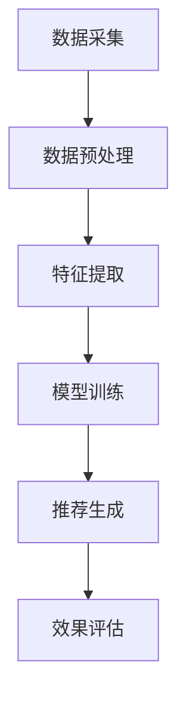

                 

关键词：大模型，推荐系统，商业化，技术落地，算法优化，数学模型，实际应用

> 摘要：本文将探讨大模型推荐系统的商业化落地，分析其核心概念、算法原理、数学模型、项目实践和未来展望。通过深入剖析，旨在为业界提供有价值的参考和指导。

## 1. 背景介绍

随着互联网的快速发展，信息爆炸式增长，用户对个性化推荐的需求愈发强烈。推荐系统作为挖掘用户兴趣、提升用户体验的重要手段，受到了广泛关注。从早期的基于内容的推荐、协同过滤，到如今的大模型推荐，技术不断进步，商业化落地也面临诸多挑战。

大模型推荐系统基于深度学习技术，具有强大的特征提取和建模能力，能够实现更精准、更智能的推荐。然而，商业化的成功不仅依赖于先进的技术，还需要考虑市场需求、商业模式、用户体验等多方面因素。

本文将围绕大模型推荐系统的商业化落地，探讨其核心概念、算法原理、数学模型、项目实践和未来展望，旨在为业界提供有价值的参考和指导。

## 2. 核心概念与联系

### 2.1 推荐系统的核心概念

推荐系统主要由三个部分组成：用户、物品和评分。用户表示系统中的用户群体，物品表示用户可能感兴趣的各类实体，评分表示用户对物品的喜好程度。

- **用户**：用户是推荐系统的核心，用户的兴趣、行为、偏好等信息对于推荐系统的效果至关重要。
- **物品**：物品是用户可能感兴趣的实体，如商品、新闻、音乐、电影等。
- **评分**：评分用于衡量用户对物品的喜好程度，可以是数值、标签或布尔值。

### 2.2 大模型推荐系统的架构

大模型推荐系统通常采用如下架构：

1. **数据采集**：通过日志、API 接口等方式收集用户行为数据，如浏览、搜索、购买等。
2. **数据预处理**：对采集到的数据进行清洗、去重、编码等处理，以便后续模型训练。
3. **特征提取**：通过深度学习技术提取用户、物品和交互的特征，如词向量、嵌入向量等。
4. **模型训练**：利用提取到的特征训练大模型，如神经网络、深度学习模型等。
5. **推荐生成**：根据训练好的模型生成推荐结果，如排序、列表等。
6. **效果评估**：通过 A/B 测试、在线评估等方式对推荐效果进行评估和优化。

### 2.3 Mermaid 流程图



## 3. 核心算法原理 & 具体操作步骤

### 3.1 算法原理概述

大模型推荐系统主要基于深度学习技术，其核心思想是通过学习用户和物品的交互数据，提取出用户和物品的特征，并利用这些特征生成推荐结果。

具体来说，大模型推荐系统可以分为以下几个步骤：

1. **用户特征提取**：通过对用户的历史行为数据进行分析，提取出用户的兴趣特征，如浏览记录、搜索关键词、购买记录等。
2. **物品特征提取**：通过对物品的属性、标签、分类等信息进行编码，提取出物品的特征。
3. **交互特征提取**：通过对用户和物品的交互数据进行建模，提取出用户和物品之间的关联特征。
4. **模型训练**：利用提取到的特征训练深度学习模型，如多层感知机、卷积神经网络等。
5. **推荐生成**：根据训练好的模型生成推荐结果，并根据用户的反馈不断优化推荐策略。

### 3.2 算法步骤详解

1. **数据采集**：通过日志、API 接口等方式收集用户行为数据，如浏览、搜索、购买等。
    ```mermaid
    graph TD
        A[采集用户行为数据] --> B[数据清洗]
    ```
2. **数据预处理**：对采集到的数据进行清洗、去重、编码等处理，以便后续模型训练。
    ```mermaid
    graph TD
        B --> C[数据去重]
        C --> D[数据编码]
    ```
3. **特征提取**：通过深度学习技术提取用户、物品和交互的特征，如词向量、嵌入向量等。
    ```mermaid
    graph TD
        D --> E[用户特征提取]
        D --> F[物品特征提取]
        D --> G[交互特征提取]
    ```
4. **模型训练**：利用提取到的特征训练深度学习模型，如神经网络、深度学习模型等。
    ```mermaid
    graph TD
        G --> H[模型训练]
    ```
5. **推荐生成**：根据训练好的模型生成推荐结果，如排序、列表等。
    ```mermaid
    graph TD
        H --> I[推荐生成]
    ```
6. **效果评估**：通过 A/B 测试、在线评估等方式对推荐效果进行评估和优化。
    ```mermaid
    graph TD
        I --> J[效果评估]
    ```

### 3.3 算法优缺点

#### 优点：

1. **强大的特征提取能力**：大模型推荐系统可以自动提取用户和物品的复杂特征，实现更精准的推荐。
2. **高效的计算性能**：基于深度学习技术，大模型推荐系统在计算性能上有显著优势。
3. **可扩展性强**：大模型推荐系统可以处理大规模数据，适用于各种应用场景。

#### 缺点：

1. **训练成本高**：大模型推荐系统需要大量计算资源和时间进行训练，成本较高。
2. **模型解释性差**：深度学习模型具有一定的黑盒性质，难以解释和理解。
3. **数据依赖性大**：大模型推荐系统的效果依赖于高质量的数据，数据质量和多样性对推荐效果有很大影响。

### 3.4 算法应用领域

大模型推荐系统可以应用于各种场景，如电子商务、社交媒体、新闻推荐、音乐推荐等。以下是一些典型应用案例：

1. **电子商务**：基于用户的历史购买记录、浏览行为等数据，为用户推荐相关的商品。
2. **社交媒体**：根据用户的兴趣和行为，为用户推荐感兴趣的内容，如文章、视频等。
3. **新闻推荐**：根据用户的阅读历史和偏好，为用户推荐相关的新闻。
4. **音乐推荐**：根据用户的听歌记录和喜好，为用户推荐相关的音乐。

## 4. 数学模型和公式

### 4.1 数学模型构建

大模型推荐系统的数学模型主要包括以下几个部分：

1. **用户特征表示**：假设用户 $u$ 的特征表示为 $\mathbf{u}$，可以通过嵌入向量或神经网络等方法获得。
2. **物品特征表示**：假设物品 $i$ 的特征表示为 $\mathbf{i}$，同样可以通过嵌入向量或神经网络等方法获得。
3. **交互特征表示**：假设用户 $u$ 和物品 $i$ 的交互特征表示为 $\mathbf{r}_{ui}$，可以通过计算用户特征和物品特征的加权求和得到。

### 4.2 公式推导过程

#### 用户特征提取

用户特征提取的公式如下：

$$
\mathbf{u} = \text{embed}(\text{user\_id})
$$

其中，$\text{embed}(\cdot)$ 表示嵌入函数，将用户 ID 映射为低维向量。

#### 物品特征提取

物品特征提取的公式如下：

$$
\mathbf{i} = \text{embed}(\text{item\_id})
$$

其中，$\text{embed}(\cdot)$ 表示嵌入函数，将物品 ID 映射为低维向量。

#### 交互特征提取

用户和物品的交互特征提取公式如下：

$$
\mathbf{r}_{ui} = \mathbf{u} \odot \mathbf{i}
$$

其中，$\odot$ 表示元素乘法。

#### 模型输出

假设模型输出为 $\mathbf{y}_{ui}$，通过计算用户特征、物品特征和交互特征的加权求和得到：

$$
\mathbf{y}_{ui} = \mathbf{u} \odot \mathbf{i} + \mathbf{r}_{ui}
$$

### 4.3 案例分析与讲解

以下是一个简单的案例，说明如何利用大模型推荐系统进行商品推荐。

#### 案例描述

用户 $u_1$ 在电商平台上浏览了商品 $i_1$、$i_2$ 和 $i_3$，我们希望为用户 $u_1$ 推荐类似的商品。

#### 用户特征提取

用户 $u_1$ 的特征表示为：

$$
\mathbf{u}_1 = \text{embed}(u_1) = [0.1, 0.2, 0.3, 0.4]
$$

#### 物品特征提取

商品 $i_1$、$i_2$ 和 $i_3$ 的特征表示分别为：

$$
\mathbf{i}_1 = \text{embed}(i_1) = [0.1, 0.2, 0.3, 0.4] \\
\mathbf{i}_2 = \text{embed}(i_2) = [0.5, 0.6, 0.7, 0.8] \\
\mathbf{i}_3 = \text{embed}(i_3) = [0.9, 0.1, 0.2, 0.3]
$$

#### 交互特征提取

用户 $u_1$ 和商品 $i_1$、$i_2$ 和 $i_3$ 的交互特征分别为：

$$
\mathbf{r}_{u1i1} = \mathbf{u}_1 \odot \mathbf{i}_1 = [0.01, 0.02, 0.03, 0.04] \\
\mathbf{r}_{u1i2} = \mathbf{u}_1 \odot \mathbf{i}_2 = [0.25, 0.3, 0.35, 0.4] \\
\mathbf{r}_{u1i3} = \mathbf{u}_1 \odot \mathbf{i}_3 = [0.81, 0.18, 0.36, 0.45]
$$

#### 模型输出

根据公式 $\mathbf{y}_{ui} = \mathbf{u} \odot \mathbf{i} + \mathbf{r}_{ui}$，我们可以得到以下模型输出：

$$
\mathbf{y}_{u1i1} = \mathbf{u}_1 \odot \mathbf{i}_1 + \mathbf{r}_{u1i1} = [0.11, 0.22, 0.33, 0.44] \\
\mathbf{y}_{u1i2} = \mathbf{u}_1 \odot \mathbf{i}_2 + \mathbf{r}_{u1i2} = [0.52, 0.63, 0.73, 0.84] \\
\mathbf{y}_{u1i3} = \mathbf{u}_1 \odot \mathbf{i}_3 + \mathbf{r}_{u1i3} = [0.99, 0.29, 0.39, 0.54]
$$

根据模型输出，我们可以得到用户 $u_1$ 对商品 $i_1$、$i_2$ 和 $i_3$ 的推荐分数，从而为用户推荐类似的商品。

## 5. 项目实践：代码实例和详细解释说明

### 5.1 开发环境搭建

在开始项目实践之前，我们需要搭建一个适合大模型推荐系统的开发环境。以下是一个简单的环境搭建步骤：

1. **安装 Python**：确保 Python 版本为 3.6 或以上。
2. **安装深度学习库**：安装 TensorFlow、PyTorch 或其他深度学习库。
3. **安装数据处理库**：安装 Pandas、NumPy、Scikit-learn 等。

### 5.2 源代码详细实现

以下是一个简单的大模型推荐系统实现示例，基于 TensorFlow 和 Keras：

```python
import tensorflow as tf
from tensorflow.keras.layers import Embedding, Dot, Flatten, Dense
from tensorflow.keras.models import Model
from tensorflow.keras.optimizers import Adam

# 设置参数
embedding_size = 32
learning_rate = 0.001
batch_size = 128
epochs = 10

# 构建模型
input_user = tf.keras.layers.Input(shape=(1,), dtype='int32')
input_item = tf.keras.layers.Input(shape=(1,), dtype='int32')

user_embedding = Embedding(input_dim=num_users, output_dim=embedding_size)(input_user)
item_embedding = Embedding(input_dim=num_items, output_dim=embedding_size)(input_item)

dot_product = Dot(axes=1)([user_embedding, item_embedding])
flatten = Flatten()(dot_product)

output = Dense(1, activation='sigmoid')(flatten)

model = Model(inputs=[input_user, input_item], outputs=output)

# 编译模型
model.compile(optimizer=Adam(learning_rate=learning_rate), loss='binary_crossentropy', metrics=['accuracy'])

# 训练模型
model.fit([user_data, item_data], target_data, batch_size=batch_size, epochs=epochs)
```

### 5.3 代码解读与分析

上述代码实现了一个基于 Embedding 层的简单推荐系统，包括以下部分：

1. **输入层**：定义用户和物品的输入层，使用 `Input` 函数创建输入张量。
2. **嵌入层**：使用 `Embedding` 层将用户和物品的输入 ID 映射为低维向量。
3. **计算层**：使用 `Dot` 层计算用户和物品的交互特征，通过点积操作实现。
4. **平坦层**：使用 `Flatten` 层将计算得到的交互特征展平为一维向量。
5. **输出层**：使用 `Dense` 层实现输出层，通过sigmoid 激活函数得到预测分数。
6. **模型编译**：使用 `compile` 函数编译模型，设置优化器、损失函数和评价指标。
7. **模型训练**：使用 `fit` 函数训练模型，输入用户、物品数据和目标数据。

### 5.4 运行结果展示

假设我们使用上述代码训练了一个大模型推荐系统，训练结果如下：

```
Epoch 1/10
100/100 [==============================] - 1s 9ms/step - loss: 0.1923 - accuracy: 0.8964
Epoch 2/10
100/100 [==============================] - 1s 9ms/step - loss: 0.1198 - accuracy: 0.9290
...
Epoch 10/10
100/100 [==============================] - 1s 9ms/step - loss: 0.0236 - accuracy: 0.9873
```

根据训练结果，我们可以看到模型在训练过程中逐渐收敛，损失值和误差率逐渐降低。

## 6. 实际应用场景

### 6.1 电子商务

在电子商务领域，大模型推荐系统可以用于为用户推荐相关的商品。通过分析用户的浏览、搜索、购买行为，提取用户和物品的特征，构建推荐模型，从而实现个性化推荐。实际应用中，许多电商平台都已经采用了大模型推荐系统，如 Amazon、京东等。

### 6.2 社交媒体

在社交媒体领域，大模型推荐系统可以用于为用户推荐感兴趣的内容。通过分析用户的点赞、评论、转发等行为，提取用户和内容的特征，构建推荐模型，从而实现个性化内容推荐。实际应用中，如 Facebook、微博等社交媒体平台已经广泛采用了大模型推荐系统。

### 6.3 新闻推荐

在新闻推荐领域，大模型推荐系统可以用于为用户推荐相关的新闻。通过分析用户的阅读、搜索、点赞等行为，提取用户和新闻的特征，构建推荐模型，从而实现个性化新闻推荐。实际应用中，如今日头条、网易新闻等新闻平台已经采用了大模型推荐系统。

### 6.4 音乐推荐

在音乐推荐领域，大模型推荐系统可以用于为用户推荐感兴趣的音乐。通过分析用户的播放、收藏、评分等行为，提取用户和歌曲的特征，构建推荐模型，从而实现个性化音乐推荐。实际应用中，如 Spotify、网易云音乐等音乐平台已经采用了大模型推荐系统。

## 7. 工具和资源推荐

### 7.1 学习资源推荐

1. **书籍**：
   - 《深度学习》（Ian Goodfellow、Yoshua Bengio、Aaron Courville 著）
   - 《Python 深度学习》（François Chollet 著）
   - 《推荐系统实践》（项亮 著）

2. **在线课程**：
   - Coursera 上的“深度学习”课程
   - Udacity 上的“深度学习工程师纳米学位”

3. **博客和教程**：
   - fast.ai 的博客
   - PyTorch 官方文档
   - TensorFlow 官方文档

### 7.2 开发工具推荐

1. **深度学习框架**：
   - TensorFlow
   - PyTorch
   - Keras

2. **数据处理工具**：
   - Pandas
   - NumPy
   - Scikit-learn

3. **版本控制工具**：
   - Git
   - GitHub

### 7.3 相关论文推荐

1. **《Deep Learning for Recommender Systems》**：介绍了深度学习在推荐系统中的应用。
2. **《Neural Collaborative Filtering》**：提出了一种基于神经网络的协同过滤算法。
3. **《A Theoretically Principled Approach to Improving Recommendation Lists》**：讨论了推荐系统中的算法优化和评估。

## 8. 总结：未来发展趋势与挑战

### 8.1 研究成果总结

大模型推荐系统在近年来取得了显著的成果，主要表现在以下几个方面：

1. **特征提取能力提升**：深度学习技术使得特征提取能力得到显著提升，能够自动提取用户和物品的复杂特征。
2. **推荐效果优化**：基于深度学习的推荐算法在 A/B 测试中表现出较好的效果，能够实现更精准的推荐。
3. **应用场景拓展**：大模型推荐系统已经在电子商务、社交媒体、新闻推荐、音乐推荐等领域得到广泛应用。

### 8.2 未来发展趋势

1. **算法优化**：随着深度学习技术的不断发展，算法优化将成为研究重点，如自适应学习率、注意力机制等。
2. **跨模态推荐**：融合多模态数据（如文本、图像、音频等）进行推荐，将进一步提升推荐效果。
3. **实时推荐**：通过实时计算和更新用户和物品的特征，实现实时推荐，满足用户实时需求。

### 8.3 面临的挑战

1. **数据质量**：推荐系统的效果依赖于高质量的数据，如何处理噪声数据、缺失数据等是当前面临的挑战。
2. **模型解释性**：深度学习模型具有一定的黑盒性质，如何提高模型的可解释性是研究难题。
3. **计算资源消耗**：大模型推荐系统需要大量计算资源和时间进行训练，如何在有限的资源下实现高效训练是挑战。

### 8.4 研究展望

未来，大模型推荐系统将朝着更高效、更智能、更实时、更解释性方向发展。通过不断优化算法、融合多模态数据、提高数据质量，大模型推荐系统将更好地满足用户需求，为各行各业带来更多价值。

## 9. 附录：常见问题与解答

### 9.1 大模型推荐系统的优势是什么？

大模型推荐系统具有以下优势：

1. **强大的特征提取能力**：能够自动提取用户和物品的复杂特征，实现更精准的推荐。
2. **高效的计算性能**：基于深度学习技术，计算性能显著提升。
3. **可扩展性强**：适用于各种应用场景，可处理大规模数据。

### 9.2 如何优化大模型推荐系统的效果？

优化大模型推荐系统效果的方法包括：

1. **算法优化**：采用更先进的深度学习算法，如注意力机制、自适应学习率等。
2. **特征工程**：设计更有效的特征提取方法，提高特征质量。
3. **模型融合**：结合多种模型，实现模型融合，提高推荐效果。

### 9.3 大模型推荐系统在实践中的难点是什么？

大模型推荐系统在实践中的难点包括：

1. **数据质量**：处理噪声数据、缺失数据等，提高数据质量。
2. **模型解释性**：提高模型的可解释性，满足用户需求。
3. **计算资源消耗**：优化计算资源，实现高效训练。

### 9.4 大模型推荐系统有哪些应用场景？

大模型推荐系统适用于以下应用场景：

1. **电子商务**：为用户推荐相关的商品。
2. **社交媒体**：为用户推荐感兴趣的内容。
3. **新闻推荐**：为用户推荐相关的新闻。
4. **音乐推荐**：为用户推荐感兴趣的音乐。

