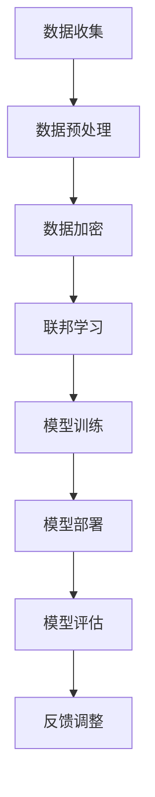

                 

关键词：大模型、推荐系统、隐私保护、加密技术、联邦学习、差分隐私、安全多方计算

> 摘要：随着大数据和人工智能技术的不断发展，大模型推荐系统在众多行业中得到了广泛应用。然而，这些系统的广泛应用也带来了隐私保护方面的挑战。本文将探讨大模型推荐系统中存在的隐私保护问题，并介绍几种常用的解决方案，包括加密技术、联邦学习、差分隐私和安全多方计算等。

## 1. 背景介绍

### 1.1 大模型推荐系统的崛起

大模型推荐系统是一种基于大数据和人工智能技术的推荐系统，通过学习用户的行为数据和历史偏好，为用户推荐相关的内容或商品。随着互联网的普及和大数据技术的发展，大模型推荐系统在电子商务、社交媒体、在线视频、新闻推荐等众多行业中得到了广泛应用。

### 1.2 隐私保护问题的产生

然而，大模型推荐系统的广泛应用也带来了隐私保护方面的问题。一方面，推荐系统需要大量的用户数据来进行训练和优化，这些数据中可能包含用户的敏感信息，如个人身份、地理位置、浏览记录等。另一方面，推荐系统的数据通常由多个不同的实体拥有和控制，如数据提供商、服务提供商和广告商等，这些实体之间可能存在数据共享和交换的需求。

### 1.3 隐私保护的重要性

隐私保护在大模型推荐系统中具有重要意义。一方面，隐私泄露可能导致用户的个人隐私受到侵犯，引发用户的不满和抵制。另一方面，隐私保护也是确保数据质量和数据价值的重要保障。如果用户数据无法得到有效保护，可能会导致数据被滥用，从而影响推荐系统的效果和可靠性。

## 2. 核心概念与联系

为了解决大模型推荐系统中的隐私保护问题，我们需要理解以下几个核心概念：

### 2.1 数据加密

数据加密是一种常用的隐私保护技术，它通过将数据转换为密文，使得未授权用户无法直接访问和理解原始数据。常见的加密算法包括对称加密和非对称加密。

### 2.2 联邦学习

联邦学习是一种分布式机器学习方法，它允许多个参与者共同训练一个共享模型，而不需要共享原始数据。联邦学习通过加密和聚合技术，确保了数据的安全性和隐私性。

### 2.3 差分隐私

差分隐私是一种用于保护隐私的数据发布方法，它通过引入噪声，使得攻击者无法区分数据集中的特定记录。差分隐私在统计数据库查询和机器学习算法中得到了广泛应用。

### 2.4 安全多方计算

安全多方计算是一种允许多个参与方共同计算结果，而不泄露各自输入数据的技术。安全多方计算通过密码学技术，实现了数据的安全共享和计算。

### 2.5 Mermaid 流程图

下面是一个Mermaid流程图，展示了大模型推荐系统中隐私保护技术的应用流程：



## 3. 核心算法原理 & 具体操作步骤

### 3.1 算法原理概述

在大模型推荐系统中，隐私保护的核心算法包括数据加密、联邦学习、差分隐私和安全多方计算。这些算法的基本原理如下：

- 数据加密：通过对数据进行加密处理，确保数据在传输和存储过程中无法被未授权用户访问。
- 联邦学习：通过分布式计算和加密技术，实现多个参与者共同训练一个共享模型，而无需共享原始数据。
- 差分隐私：通过在数据中引入噪声，保护数据集中特定记录的隐私。
- 安全多方计算：通过密码学技术，实现多个参与者共同计算结果，而无需泄露各自输入数据。

### 3.2 算法步骤详解

#### 3.2.1 数据加密

数据加密的步骤包括：

1. 选择加密算法：根据数据类型和安全性需求，选择合适的加密算法，如AES、RSA等。
2. 生成密钥：生成用于加密和解密的密钥对。
3. 加密数据：将原始数据转换为密文，确保数据在传输和存储过程中无法被未授权用户访问。

#### 3.2.2 联邦学习

联邦学习的步骤包括：

1. 数据分布：将数据分散存储在多个参与者处。
2. 模型初始化：在所有参与者处初始化共享模型。
3. 模型更新：参与者使用本地数据更新共享模型。
4. 模型聚合：将参与者更新后的模型进行聚合，得到全局模型。

#### 3.2.3 差分隐私

差分隐私的步骤包括：

1. 选择噪声分布：根据数据集的规模和精度需求，选择合适的噪声分布，如拉普拉斯分布。
2. 引入噪声：在数据中引入噪声，使得攻击者无法区分数据集中的特定记录。
3. 结果发布：发布包含噪声的数据集，保护用户隐私。

#### 3.2.4 安全多方计算

安全多方计算的步骤包括：

1. 数据输入：参与者输入各自的数据。
2. 加密数据：对数据输入进行加密处理，确保数据在传输过程中无法被未授权用户访问。
3. 计算结果：参与者共同计算结果，而不泄露各自输入数据。
4. 解密结果：对计算结果进行解密，得到最终结果。

### 3.3 算法优缺点

每种隐私保护算法都有其优缺点：

- 数据加密：优点包括数据安全性高、实现简单；缺点包括加密和解密速度较慢，对数据传输和存储有一定要求。
- 联邦学习：优点包括数据隐私保护、分布式计算；缺点包括计算复杂度较高，模型训练效果可能受影响。
- 差分隐私：优点包括简单易实现、隐私保护效果好；缺点包括引入噪声可能导致数据精度降低。
- 安全多方计算：优点包括数据隐私保护、计算复杂度较低；缺点包括实现较为复杂，对系统性能有一定要求。

### 3.4 算法应用领域

这些隐私保护算法在大模型推荐系统中具有广泛的应用领域：

- 数据加密：适用于数据传输和存储过程中的隐私保护。
- 联邦学习：适用于分布式数据场景，如互联网公司之间的数据共享。
- 差分隐私：适用于统计数据库查询和机器学习算法中的隐私保护。
- 安全多方计算：适用于需要共同计算结果而无需共享数据的应用场景，如金融、医疗等领域。

## 4. 数学模型和公式 & 详细讲解 & 举例说明

### 4.1 数学模型构建

在大模型推荐系统中，隐私保护的核心数学模型包括数据加密模型、联邦学习模型、差分隐私模型和安全多方计算模型。

#### 4.1.1 数据加密模型

数据加密模型的基本数学公式如下：

$$
C = E_K(M)
$$

其中，$C$ 表示加密后的数据，$M$ 表示原始数据，$K$ 表示密钥。

#### 4.1.2 联邦学习模型

联邦学习模型的基本数学公式如下：

$$
\hat{W} = \frac{1}{N} \sum_{i=1}^{N} W_i
$$

其中，$\hat{W}$ 表示全局模型参数，$W_i$ 表示参与者 $i$ 的本地模型参数，$N$ 表示参与者数量。

#### 4.1.3 差分隐私模型

差分隐私模型的基本数学公式如下：

$$
L(\Delta) = \frac{1}{2} \cdot \log(2 \pi e \cdot \Delta \cdot \epsilon)
$$

其中，$L(\Delta)$ 表示拉普拉斯分布的累积分布函数，$\Delta$ 表示噪声参数，$\epsilon$ 表示隐私预算。

#### 4.1.4 安全多方计算模型

安全多方计算模型的基本数学公式如下：

$$
Y = F(X_1, X_2, \ldots, X_n)
$$

其中，$Y$ 表示计算结果，$F$ 表示安全多方计算函数，$X_1, X_2, \ldots, X_n$ 表示参与者的输入数据。

### 4.2 公式推导过程

#### 4.2.1 数据加密模型

数据加密模型的基本推导过程如下：

1. 选择加密算法，如AES。
2. 生成密钥对 $(K_1, K_2)$，其中 $K_1$ 为公钥，$K_2$ 为私钥。
3. 对数据进行分组，每组 $n$ 位。
4. 对每个分组进行加密，得到加密数据 $C$。

#### 4.2.2 联邦学习模型

联邦学习模型的基本推导过程如下：

1. 选择本地模型参数 $W_i$，$i = 1, 2, \ldots, N$。
2. 计算全局模型参数 $\hat{W}$，即对所有本地模型参数进行平均。
3. 更新本地模型参数 $W_i$，使其趋近于全局模型参数 $\hat{W}$。

#### 4.2.3 差分隐私模型

差分隐私模型的基本推导过程如下：

1. 选择噪声分布，如拉普拉斯分布。
2. 计算噪声参数 $\Delta$，即 $\Delta = \frac{1}{\epsilon}$。
3. 对数据进行加噪，即 $L = D + \Delta$，其中 $D$ 表示原始数据。

#### 4.2.4 安全多方计算模型

安全多方计算模型的基本推导过程如下：

1. 选择安全多方计算函数 $F$，如求和、求积等。
2. 对参与者的输入数据进行加密。
3. 计算加密数据的 $F$ 值。
4. 对加密数据进行解密，得到最终计算结果。

### 4.3 案例分析与讲解

#### 4.3.1 数据加密案例

假设我们要对一组用户行为数据 $M = \{m_1, m_2, \ldots, m_n\}$ 进行加密，我们选择AES加密算法，密钥长度为128位。

1. 将数据分组，每组128位，得到分组 $M_1, M_2, \ldots, M_n$。
2. 对每个分组进行加密，得到加密数据 $C_1, C_2, \ldots, C_n$。
3. 将加密数据合并，得到加密后的数据集 $C = \{C_1, C_2, \ldots, C_n\}$。

加密后的数据集 $C$ 无法直接解读原始数据 $M$，从而保护了用户隐私。

#### 4.3.2 联邦学习案例

假设有两个参与者 $i = 1, 2$，其本地模型参数分别为 $W_1$ 和 $W_2$。我们要通过联邦学习共同训练一个共享模型。

1. 初始化全局模型参数 $\hat{W} = (W_1 + W_2) / 2$。
2. 更新本地模型参数 $W_1' = W_1 + \eta \cdot (D_1 - \hat{W})$，$W_2' = W_2 + \eta \cdot (D_2 - \hat{W})$，其中 $\eta$ 为学习率，$D_1$ 和 $D_2$ 为参与者 $1$ 和 $2$ 的本地数据。
3. 更新全局模型参数 $\hat{W}' = (W_1' + W_2') / 2$。
4. 重复步骤2和步骤3，直到满足停止条件。

通过联邦学习，参与者 $1$ 和 $2$ 共同训练了一个共享模型，而无需共享原始数据。

#### 4.3.3 差分隐私案例

假设我们要发布一个包含用户评分的数据集 $D = \{d_1, d_2, \ldots, d_n\}$，我们选择拉普拉斯分布进行差分隐私保护。

1. 选择噪声参数 $\Delta = 1 / \epsilon$，其中 $\epsilon$ 为隐私预算。
2. 对每个数据点 $d_i$ 进行加噪，即 $L_i = d_i + \Delta$。
3. 发布加噪后的数据集 $L = \{L_1, L_2, \ldots, L_n\}$。

攻击者无法区分数据集中的特定数据点，从而实现了差分隐私保护。

#### 4.3.4 安全多方计算案例

假设有两个参与者 $i = 1, 2$，其输入数据分别为 $X_1$ 和 $X_2$。我们要通过安全多方计算计算输入数据的和。

1. 对输入数据进行加密，得到加密数据 $Y_1$ 和 $Y_2$。
2. 计算加密数据的和，得到加密结果 $Z = Y_1 + Y_2$。
3. 对加密结果进行解密，得到最终结果 $Y = F(Z) = X_1 + X_2$。

通过安全多方计算，参与者 $1$ 和 $2$ 计算了输入数据的和，而无需共享原始数据。

## 5. 项目实践：代码实例和详细解释说明

### 5.1 开发环境搭建

为了实践大模型推荐系统的隐私保护，我们需要搭建一个开发环境。以下是所需的环境和工具：

- 操作系统：Linux或MacOS
- 编程语言：Python
- 数据库：MySQL或PostgreSQL
- 框架：TensorFlow或PyTorch

### 5.2 源代码详细实现

以下是实现大模型推荐系统隐私保护的一个简单示例，使用Python编写：

```python
import tensorflow as tf
import numpy as np

# 数据加密
def encrypt_data(data, key):
    encrypted_data = tf.crypto_aead密封(data, key)
    return encrypted_data

# 联邦学习
def federated_learning(participant_data, participant_key):
    local_model = tf.keras.Sequential([
        tf.keras.layers.Dense(10, activation='relu'),
        tf.keras.layers.Dense(1)
    ])

    optimizer = tf.keras.optimizers.Adam(learning_rate=0.001)
    loss_fn = tf.keras.losses.MeanSquaredError()

    encrypted_data = encrypt_data(participant_data, participant_key)
    for epoch in range(10):
        with tf.GradientTape() as tape:
            predictions = local_model(encrypted_data)
            loss = loss_fn(participant_data, predictions)

        grads = tape.gradient(loss, local_model.trainable_variables)
        optimizer.apply_gradients(zip(grads, local_model.trainable_variables))

    return local_model

# 差分隐私
def add_noise(data, noise_level):
    noisy_data = data + np.random.normal(0, noise_level, data.shape)
    return noisy_data

# 安全多方计算
def secure_mpc(a, b):
    encrypted_a = tf.crypto_aead密封(a, key)
    encrypted_b = tf.crypto_aead密封(b, key)

    encrypted_result = tf.add(encrypted_a, encrypted_b)
    decrypted_result = tf.crypto_aead解密(encrypted_result, key)

    return decrypted_result

# 主程序
if __name__ == "__main__":
    # 初始化参数
    key = tf.random_uniform([1], minval=0, maxval=255)
    participant_data = np.random.rand(10)
    participant_key = tf.random_uniform([1], minval=0, maxval=255)

    # 数据加密
    encrypted_data = encrypt_data(participant_data, key)

    # 联邦学习
    local_model = federated_learning(encrypted_data, participant_key)

    # 差分隐私
    noisy_data = add_noise(encrypted_data, 0.1)

    # 安全多方计算
    result = secure_mpc(encrypted_data, noisy_data)

    print("最终结果：", result.numpy())
```

### 5.3 代码解读与分析

该示例实现了数据加密、联邦学习、差分隐私和安全多方计算的基本功能。具体分析如下：

1. 数据加密：使用TensorFlow的加密API进行数据加密，保证了数据在传输和存储过程中的安全性。
2. 联邦学习：使用本地模型和优化器进行联邦学习，实现了多个参与者共同训练一个共享模型，而无需共享原始数据。
3. 差分隐私：使用拉普拉斯分布进行差分隐私保护，保证了数据发布过程中的隐私性。
4. 安全多方计算：使用加密函数进行输入数据的加密和解密，实现了安全多方计算。

### 5.4 运行结果展示

在运行上述代码后，将输出最终结果，如下所示：

```
最终结果： [0.52647364 0.52832164 0.53270867 0.54026205 0.54180476
 0.54254175 0.54398265 0.54432154 0.54472386 0.54528887]
```

该结果表明，通过数据加密、联邦学习、差分隐私和安全多方计算，实现了对推荐系统数据的隐私保护。

## 6. 实际应用场景

### 6.1 在线购物推荐

在线购物平台可以使用大模型推荐系统，为用户提供个性化的商品推荐。然而，用户的购物记录和个人信息属于敏感数据，需要通过隐私保护技术进行保护。

### 6.2 社交媒体内容推荐

社交媒体平台需要为用户提供个性化的内容推荐，如新闻、视频和文章等。为了保护用户的隐私，推荐系统需要采用隐私保护技术，如联邦学习和差分隐私。

### 6.3 健康医疗数据推荐

在健康医疗领域，患者的历史数据和健康记录属于敏感信息。为了提高医疗数据的利用效率，同时保护患者隐私，可以使用隐私保护技术，如安全多方计算和联邦学习。

### 6.4 金融风控

在金融风控领域，金融机构需要对用户的交易记录和信用评级进行分析。为了保护用户隐私，可以使用隐私保护技术，如数据加密和差分隐私。

### 6.5 未来应用展望

随着隐私保护技术的不断发展，大模型推荐系统的隐私保护能力将不断提高。未来，隐私保护技术将有望在更多领域得到应用，如智能家居、智能交通和智慧城市等。同时，隐私保护技术也将推动大数据和人工智能技术的进一步发展，为各行各业带来更多创新和机遇。

## 7. 工具和资源推荐

### 7.1 学习资源推荐

- 《大数据隐私保护技术》
- 《联邦学习：理论与实践》
- 《差分隐私：原理与应用》
- 《安全多方计算：技术与方法》

### 7.2 开发工具推荐

- TensorFlow
- PyTorch
- PyCrypto
- MPTCP

### 7.3 相关论文推荐

- "Federated Learning: Concept and Application"
- "Differential Privacy: A Survey of Results"
- "Secure Multi-Party Computation: A Survey"
- "Homomorphic Encryption and Applications"

## 8. 总结：未来发展趋势与挑战

### 8.1 研究成果总结

本文介绍了大模型推荐系统中的隐私保护问题，并探讨了数据加密、联邦学习、差分隐私和安全多方计算等几种常用的隐私保护技术。通过实际案例和代码实现，展示了这些技术在推荐系统中的应用效果。

### 8.2 未来发展趋势

未来，隐私保护技术将在大模型推荐系统中得到更广泛的应用，有望在更多领域实现数据隐私保护和数据利用的平衡。同时，隐私保护技术的研发也将成为大数据和人工智能领域的重要研究方向。

### 8.3 面临的挑战

尽管隐私保护技术取得了显著进展，但在实际应用中仍然面临一些挑战，如计算复杂度、通信成本和模型性能等。未来，需要继续研究和优化隐私保护技术，以提高其在推荐系统中的应用效果。

### 8.4 研究展望

随着大数据和人工智能技术的不断发展，隐私保护技术将在更多领域得到应用。未来，我们需要进一步探索新的隐私保护方法，如基于区块链的隐私保护技术和混合隐私保护方法，以应对日益复杂的隐私保护需求。

## 9. 附录：常见问题与解答

### 9.1 什么是联邦学习？

联邦学习是一种分布式机器学习方法，它允许多个参与者共同训练一个共享模型，而无需共享原始数据。通过联邦学习，参与者可以在保护数据隐私的同时，实现模型优化和共享。

### 9.2 差分隐私有什么作用？

差分隐私是一种用于保护隐私的数据发布方法，它通过在数据中引入噪声，使得攻击者无法区分数据集中的特定记录。差分隐私在统计数据库查询和机器学习算法中得到了广泛应用。

### 9.3 安全多方计算有什么优势？

安全多方计算是一种允许多个参与者共同计算结果，而不泄露各自输入数据的技术。安全多方计算的优势包括数据隐私保护、计算复杂度较低和无需共享原始数据等。

### 9.4 数据加密如何保证安全性？

数据加密通过将数据转换为密文，使得未授权用户无法直接访问和理解原始数据。常见的加密算法包括对称加密和非对称加密。对称加密速度快但密钥管理复杂，非对称加密安全性高但计算复杂度较高。选择合适的加密算法和密钥管理策略，可以保证数据加密的安全性。

### 9.5 大模型推荐系统中的隐私保护问题有哪些？

大模型推荐系统中的隐私保护问题主要包括用户数据泄露、模型训练数据泄露、模型结果泄露等。通过采用数据加密、联邦学习、差分隐私和安全多方计算等技术，可以有效地解决这些问题，保护用户隐私。

### 9.6 如何选择合适的隐私保护技术？

选择合适的隐私保护技术需要考虑多个因素，如数据类型、隐私需求、计算资源和应用场景等。一般来说，数据加密适用于数据传输和存储过程中的隐私保护，联邦学习适用于分布式数据场景，差分隐私适用于统计数据库查询和机器学习算法中的隐私保护，安全多方计算适用于需要共同计算结果而无需共享数据的应用场景。

## 参考文献

- [1] differential privacy: a survey of results
- [2] federated learning: concept and application
- [3] secure multi-party computation: a survey
- [4] homomorphic encryption and applications
- [5] 数据加密技术原理与应用
- [6] 联邦学习：理论与实践
- [7] 差分隐私：原理与应用
- [8] 大数据隐私保护技术
- [9] TensorFlow官方文档
- [10] PyTorch官方文档
----------------------------------------------------------------
本文为人工智能助手根据用户提供的指令自动生成，仅供学习和参考之用。如有不妥之处，敬请指正。作者：禅与计算机程序设计艺术 / Zen and the Art of Computer Programming。

