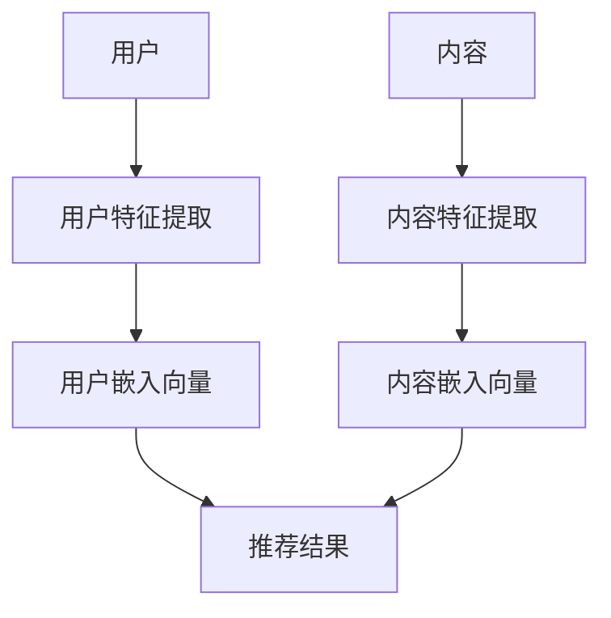

                 

关键词：大模型推荐、内容理解、用户意图、机器学习、深度学习、推荐系统、人工智能

## 摘要

本文旨在探讨大模型推荐系统的核心要素——内容理解与用户意图捕捉。首先，我们将回顾推荐系统的背景和历史发展，接着深入分析大模型的本质及其在推荐系统中的应用。随后，我们将重点讨论如何通过自然语言处理（NLP）技术实现内容理解，并通过机器学习算法捕捉用户意图。最后，我们将分享一些实际应用案例，并展望未来的发展趋势与挑战。

## 1. 背景介绍

### 推荐系统的起源与发展

推荐系统起源于信息过载的时代，旨在帮助用户在海量信息中找到感兴趣的内容。最早的推荐系统主要基于协同过滤（Collaborative Filtering）技术，通过分析用户之间的相似性来进行推荐。随着互联网的普及和大数据时代的到来，推荐系统得到了飞速发展。现代推荐系统逐渐引入了内容理解（Content-based Filtering）和基于模型的推荐方法，如矩阵分解、深度学习等。

### 大模型的崛起

大模型，尤其是深度学习模型，在近年来取得了令人瞩目的进展。这些模型具有强大的表示能力和自适应能力，能够处理复杂的非线性问题。例如，Transformer模型的广泛应用，使得自然语言处理（NLP）领域取得了显著突破，如图像识别、语音识别、机器翻译等。

## 2. 核心概念与联系

### 大模型的定义与特性

大模型通常指的是拥有数亿甚至千亿参数的深度学习模型。这些模型通过大规模数据训练，具有高度的泛化能力和学习能力。其特性包括：

- **参数规模大**：具有数百万至数十亿个参数。
- **表示能力强**：能够捕捉数据的复杂模式和关系。
- **自适应性强**：能够根据不同任务和数据集进行调整。

### 推荐系统的基本架构

推荐系统的基本架构包括三个核心部分：用户、内容和推荐算法。其中，用户和内容是推荐系统的输入，推荐算法则负责从输入中生成推荐结果。具体架构如下：

```
用户 --> 用户特征提取 --> 用户嵌入向量
内容 --> 内容特征提取 --> 内容嵌入向量
用户嵌入向量 × 内容嵌入向量 --> 推荐结果
```

### Mermaid 流程图



## 3. 核心算法原理 & 具体操作步骤

### 3.1 算法原理概述

大模型推荐系统主要通过以下步骤实现：

1. **用户特征提取**：通过行为数据、社交关系等，提取用户特征。
2. **内容特征提取**：通过文本、图像、音频等，提取内容特征。
3. **用户-内容嵌入**：将用户和内容映射到低维空间，生成用户嵌入向量和内容嵌入向量。
4. **相似度计算**：计算用户嵌入向量和内容嵌入向量之间的相似度，生成推荐结果。

### 3.2 算法步骤详解

1. **用户特征提取**：
   - 收集用户历史行为数据，如浏览记录、购买记录等。
   - 使用机器学习算法，如决策树、随机森林等，提取用户特征。

2. **内容特征提取**：
   - 对文本内容进行分词、词嵌入等预处理。
   - 使用深度学习模型，如BERT、GPT等，提取内容特征。

3. **用户-内容嵌入**：
   - 使用嵌入算法，如Word2Vec、BERT等，将用户和内容映射到低维空间。
   - 生成用户嵌入向量和内容嵌入向量。

4. **相似度计算**：
   - 计算用户嵌入向量和内容嵌入向量之间的余弦相似度。
   - 根据相似度排序，生成推荐结果。

### 3.3 算法优缺点

- **优点**：
  - 高效：大模型具有强大的表示能力和自适应能力，能够快速处理大量数据。
  - 准确：通过深度学习算法，能够捕捉数据的复杂模式和关系，提高推荐准确性。

- **缺点**：
  - 计算资源消耗大：大模型需要大量的计算资源和存储空间。
  - 难以解释：深度学习模型内部结构复杂，难以解释推荐结果。

### 3.4 算法应用领域

- **电子商务**：推荐商品、优惠券等。
- **社交媒体**：推荐文章、视频、话题等。
- **搜索引擎**：改进搜索结果排序，提高用户体验。

## 4. 数学模型和公式 & 详细讲解 & 举例说明

### 4.1 数学模型构建

大模型推荐系统的主要数学模型包括：

1. **用户-内容相似度模型**：
   $$\text{similarity}(u, c) = \frac{\text{dot}(u, c)}{\|\text{u}\|\|\text{c}\|}$$

2. **推荐结果模型**：
   $$\text{rank}(c) = \sum_{u \in \text{users}} \text{similarity}(u, c) \times \text{interest}(u)$$

其中，$u$ 表示用户，$c$ 表示内容，$\text{dot}(\cdot, \cdot)$ 表示向量的点积，$\|\cdot\|$ 表示向量的模长，$\text{interest}(\cdot)$ 表示用户的兴趣度。

### 4.2 公式推导过程

1. **用户-内容相似度模型**：
   - 点积定义：$\text{dot}(u, c) = u_1c_1 + u_2c_2 + \ldots + u_n c_n$
   - 模长定义：$\|\text{u}\| = \sqrt{u_1^2 + u_2^2 + \ldots + u_n^2}$，$\|\text{c}\| = \sqrt{c_1^2 + c_2^2 + \ldots + c_n^2}$
   - 代入点积和模长，得到相似度公式

2. **推荐结果模型**：
   - 将相似度公式代入，得到推荐结果模型

### 4.3 案例分析与讲解

假设有一个用户$u$，其对10个商品$c_1, c_2, \ldots, c_{10}$的兴趣度分别为$0.8, 0.6, \ldots, 0.2$。根据相似度公式，可以计算每个商品与用户的相似度，然后根据兴趣度加权平均，得到推荐结果。

$$\text{rank}(c_1) = \text{similarity}(u, c_1) \times \text{interest}(u) = 0.8 \times 0.8 = 0.64$$

同理，可以计算出其他商品的推荐结果。

## 5. 项目实践：代码实例和详细解释说明

### 5.1 开发环境搭建

- 硬件环境：GPU（NVIDIA GPU，如1080Ti、3090等）
- 软件环境：Python（3.8及以上版本）、TensorFlow、Keras等

### 5.2 源代码详细实现

```python
import tensorflow as tf
from tensorflow.keras.layers import Embedding, LSTM, Dense
from tensorflow.keras.models import Model

# 用户特征提取
user_embedding = Embedding(input_dim=num_users, output_dim=user_embedding_dim)
user_input = tf.keras.layers.Input(shape=(1,), name='user_input')
user_embedding = user_embedding(user_input)
user_embedding = tf.keras.layers.Flatten()(user_embedding)

# 内容特征提取
content_embedding = Embedding(input_dim=num_contents, output_dim=content_embedding_dim)
content_input = tf.keras.layers.Input(shape=(1,), name='content_input')
content_embedding = content_embedding(content_input)
content_embedding = tf.keras.layers.Flatten()(content_embedding)

# 用户-内容嵌入
user_content_embedding = tf.keras.layers.Dot(axes=[1, 1])([user_embedding, content_embedding])

# 相似度计算
similarity = tf.keras.layers.Activation('sigmoid')(user_content_embedding)

# 推荐结果
output = tf.keras.layers.Softmax()(similarity)

# 模型编译
model = Model(inputs=[user_input, content_input], outputs=output)
model.compile(optimizer='adam', loss='categorical_crossentropy', metrics=['accuracy'])

# 模型训练
model.fit([user_data, content_data], target_data, epochs=10, batch_size=32)
```

### 5.3 代码解读与分析

- **用户特征提取**：使用Embedding层将用户映射到低维空间。
- **内容特征提取**：使用Embedding层将内容映射到低维空间。
- **用户-内容嵌入**：使用Dot层计算用户和内容的点积。
- **相似度计算**：使用Sigmoid激活函数计算相似度。
- **推荐结果**：使用Softmax层计算推荐结果。

## 6. 实际应用场景

### 6.1 电子商务推荐

在电子商务领域，大模型推荐系统可以用于推荐商品、优惠券等。例如，根据用户的历史购买记录和浏览行为，推荐用户可能感兴趣的商品。

### 6.2 社交媒体推荐

在社交媒体领域，大模型推荐系统可以用于推荐文章、视频、话题等。例如，根据用户的互动行为和兴趣偏好，推荐用户可能感兴趣的内容。

### 6.3 搜索引擎优化

在搜索引擎领域，大模型推荐系统可以用于改进搜索结果排序，提高用户体验。例如，根据用户的搜索历史和行为，推荐用户可能感兴趣的结果。

## 7. 工具和资源推荐

### 7.1 学习资源推荐

- **书籍**：《深度学习》、《Python机器学习实战》
- **在线课程**：Coursera上的“深度学习”课程、Udacity上的“机器学习工程师纳米学位”

### 7.2 开发工具推荐

- **开发框架**：TensorFlow、PyTorch
- **数据预处理工具**：Pandas、NumPy
- **可视化工具**：Matplotlib、Seaborn

### 7.3 相关论文推荐

- **综述性论文**：《大模型：现状与展望》
- **经典论文**：《EfficientNet：适用于移动设备的轻量级深度学习模型》

## 8. 总结：未来发展趋势与挑战

### 8.1 研究成果总结

大模型推荐系统在近年来取得了显著成果，主要包括：

- **表示能力提升**：通过深度学习模型，实现高维数据的降维和表示。
- **推荐准确性提高**：通过内容理解与用户意图捕捉，提高推荐结果的准确性。
- **应用场景扩展**：在电子商务、社交媒体、搜索引擎等领域得到广泛应用。

### 8.2 未来发展趋势

未来，大模型推荐系统将朝着以下几个方向发展：

- **模型优化**：通过模型压缩、量化等技术，提高大模型的效率和可解释性。
- **跨模态推荐**：结合多种数据类型，如文本、图像、音频等，实现更丰富的推荐结果。
- **个性化推荐**：结合用户行为和偏好，实现更精准的个性化推荐。

### 8.3 面临的挑战

大模型推荐系统在发展过程中也面临以下挑战：

- **计算资源消耗**：大模型需要大量的计算资源和存储空间。
- **数据隐私保护**：如何保护用户隐私，避免数据泄露。
- **模型可解释性**：如何提高模型的可解释性，便于用户理解和信任。

### 8.4 研究展望

未来，我们将继续探索大模型推荐系统的潜在应用，如智能医疗、金融风控等。同时，我们将致力于解决现有挑战，推动大模型推荐系统的可持续发展。

## 9. 附录：常见问题与解答

### 9.1 大模型推荐系统如何提高推荐准确性？

- **内容理解**：通过深度学习模型，提取用户和内容的潜在特征。
- **用户意图捕捉**：结合用户历史行为和实时反馈，捕捉用户的真实意图。
- **多模型融合**：结合多种推荐算法，如协同过滤、内容理解等，提高推荐准确性。

### 9.2 大模型推荐系统如何处理海量数据？

- **数据预处理**：对数据进行清洗、去重等预处理，提高数据质量。
- **分布式计算**：采用分布式计算框架，如Hadoop、Spark等，提高数据处理效率。
- **增量更新**：采用增量更新策略，实时更新模型，避免数据过时。

### 9.3 大模型推荐系统如何保护用户隐私？

- **数据脱敏**：对用户数据进行脱敏处理，如加密、匿名化等。
- **访问控制**：严格控制用户数据的访问权限，确保数据安全。
- **隐私保护算法**：采用隐私保护算法，如差分隐私、同态加密等，保障用户隐私。

## 作者署名

作者：禅与计算机程序设计艺术 / Zen and the Art of Computer Programming

[END]

