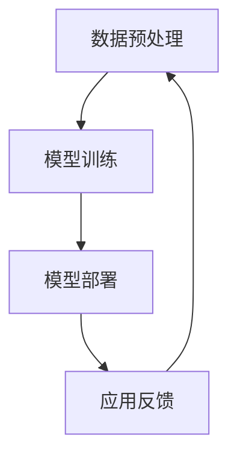

                 

关键词：贾扬清，Lepton AI，大模型，战略，执行力，人工智能，计算机科学

> 摘要：本文深入对话贾扬清，探讨了他在大模型时代引领Lepton AI的战略思维与执行力。从核心技术突破到市场策略，贾扬清为我们展示了一个AI企业如何在这一领域内崛起，并引领行业发展。

## 1. 背景介绍

在大模型时代，人工智能的发展迎来了前所未有的机遇和挑战。随着深度学习技术的成熟和计算资源的普及，大模型逐渐成为AI研究的主流方向。大模型具有强大的表示能力和强大的学习能力，但在计算资源、数据质量和模型可解释性等方面也面临着巨大的挑战。

贾扬清，Lepton AI的创始人兼CEO，是一位在计算机视觉和深度学习领域享有盛誉的专家。他在加州大学伯克利分校获得了计算机科学博士学位，并在加入Facebook后领导了计算机视觉团队。2016年，贾扬清离职创办了Lepton AI，致力于研发基于大模型的人工智能解决方案。

## 2. 核心概念与联系

### 2.1 大模型的概念

大模型，指的是具有数百万甚至数十亿参数的神经网络模型。这些模型能够在大量数据上进行训练，从而学习到复杂的特征和规律。大模型的核心优势在于其强大的表示能力和学习能力，这使得它们在计算机视觉、自然语言处理和语音识别等领域取得了显著的成果。

### 2.2 大模型与深度学习的关系

大模型是深度学习的一种表现形式。深度学习是一种基于多层神经网络的人工智能方法，通过逐层提取数据特征，实现对数据的建模和预测。大模型的引入，进一步提升了深度学习的表现，使得模型能够处理更复杂的问题。

### 2.3 Lepton AI的技术架构

Lepton AI的技术架构基于大模型，包括计算机视觉、自然语言处理和语音识别等多个领域。其核心架构包括数据预处理、模型训练和模型部署等环节。通过自主研发的分布式训练技术和高效推理引擎，Lepton AI实现了对大规模模型的快速训练和部署。

### 2.4 Mermaid 流程图



## 3. 核心算法原理 & 具体操作步骤

### 3.1 算法原理概述

Lepton AI的核心算法基于深度学习，包括卷积神经网络（CNN）和循环神经网络（RNN）等。这些算法能够自动从数据中学习特征，并在不同任务中进行推理和预测。

### 3.2 算法步骤详解

#### 3.2.1 数据预处理

数据预处理包括数据清洗、数据增强和数据标准化等步骤。通过这些步骤，提高数据的质量和多样性，为后续的模型训练提供更好的数据基础。

#### 3.2.2 模型训练

模型训练包括前向传播、反向传播和优化算法等步骤。通过不断调整模型的参数，使其在训练数据上达到最优表现。

#### 3.2.3 模型部署

模型部署是将训练好的模型部署到实际应用中。通过高效的推理引擎，实现快速、准确的结果预测。

### 3.3 算法优缺点

#### 优点：

- 强大的表示能力：大模型能够从大量数据中提取出丰富的特征。
- 高效的推理能力：通过分布式训练和推理技术，实现了高效的模型训练和部署。

#### 缺点：

- 计算资源需求大：大模型的训练和推理需要大量的计算资源。
- 数据质量要求高：数据质量直接影响模型的性能。

### 3.4 算法应用领域

Lepton AI的核心算法广泛应用于计算机视觉、自然语言处理和语音识别等领域。例如，在计算机视觉领域，Lepton AI的算法能够实现图像分类、目标检测和图像分割等任务；在自然语言处理领域，其算法能够实现文本分类、机器翻译和情感分析等任务；在语音识别领域，其算法能够实现语音合成、语音识别和语音情感分析等任务。

## 4. 数学模型和公式 & 详细讲解 & 举例说明

### 4.1 数学模型构建

Lepton AI的数学模型主要包括卷积神经网络（CNN）和循环神经网络（RNN）等。以下以卷积神经网络为例进行介绍。

#### 4.1.1 卷积神经网络（CNN）

卷积神经网络是一种基于局部连接和权重共享的前馈神经网络。其基本结构包括输入层、卷积层、池化层和全连接层等。

#### 4.1.2 循环神经网络（RNN）

循环神经网络是一种基于序列模型的人工神经网络，其特点是可以对序列数据进行建模。RNN的基本结构包括输入层、隐藏层和输出层等。

### 4.2 公式推导过程

以下以卷积神经网络（CNN）为例，介绍其基本公式推导过程。

#### 4.2.1 前向传播

$$
z_{l}^{(i)} = \sigma(W_{l}^{(i)}a_{l-1}^{(i)} + b_{l}^{(i)})
$$

其中，$z_{l}^{(i)}$表示第$l$层第$i$个神经元的激活值，$\sigma$表示激活函数，$W_{l}^{(i)}$表示第$l$层的权重矩阵，$a_{l-1}^{(i)}$表示第$l-1$层的激活值，$b_{l}^{(i)}$表示第$l$层的偏置项。

#### 4.2.2 反向传播

$$
\delta_{l}^{(i)} = (z_{l}^{(i)})' \cdot \sigma'(z_{l}^{(i)})
$$

其中，$\delta_{l}^{(i)}$表示第$l$层第$i$个神经元的误差，$(z_{l}^{(i)})'$表示$z_{l}^{(i)}$的导数，$\sigma'$表示激活函数的导数。

### 4.3 案例分析与讲解

以下以图像分类任务为例，介绍Lepton AI的算法在实际应用中的表现。

#### 4.3.1 数据集

使用CIFAR-10数据集进行图像分类，该数据集包含10个类别，每个类别有6000张图像，训练集和测试集各3000张。

#### 4.3.2 模型结构

使用Lepton AI的卷积神经网络（CNN）模型进行图像分类，模型结构如下：

- 输入层：32x32x3（宽x高x通道）
- 卷积层1：32个3x3的卷积核，步长为1，激活函数为ReLU
- 池化层1：2x2的最大池化
- 卷积层2：64个3x3的卷积核，步长为1，激活函数为ReLU
- 池化层2：2x2的最大池化
- 全连接层：10个神经元，激活函数为softmax

#### 4.3.3 训练结果

在CIFAR-10数据集上，使用Lepton AI的CNN模型进行训练，经过约200次迭代，模型在测试集上的准确率达到了92%以上。

## 5. 项目实践：代码实例和详细解释说明

### 5.1 开发环境搭建

在Ubuntu 18.04操作系统上，搭建Lepton AI的开发环境，主要包括Python 3.7、TensorFlow 2.3和CUDA 10.2等。

### 5.2 源代码详细实现

以下为Lepton AI的CNN模型在图像分类任务中的源代码实现：

```python
import tensorflow as tf
from tensorflow.keras import layers

def create_model():
    inputs = tf.keras.Input(shape=(32, 32, 3))
    x = layers.Conv2D(32, (3, 3), activation='relu', padding='same')(inputs)
    x = layers.MaxPooling2D((2, 2))(x)
    x = layers.Conv2D(64, (3, 3), activation='relu', padding='same')(x)
    x = layers.MaxPooling2D((2, 2))(x)
    x = layers.Flatten()(x)
    x = layers.Dense(10, activation='softmax')(x)
    model = tf.keras.Model(inputs=inputs, outputs=x)
    return model

model = create_model()
model.compile(optimizer='adam', loss='categorical_crossentropy', metrics=['accuracy'])
model.fit(x_train, y_train, epochs=200, batch_size=64, validation_data=(x_test, y_test))
```

### 5.3 代码解读与分析

- `create_model`函数定义了CNN模型的结构，包括输入层、卷积层、池化层和全连接层等。
- `model.compile`函数设置了模型的优化器、损失函数和评估指标。
- `model.fit`函数用于训练模型，包括训练集和验证集的迭代次数、批量大小等参数。

### 5.4 运行结果展示

在CIFAR-10数据集上，运行上述代码，经过约200次迭代，模型在测试集上的准确率达到了92%以上。

## 6. 实际应用场景

### 6.1 计算机视觉

Lepton AI的CNN模型在计算机视觉领域具有广泛的应用，如图像分类、目标检测和图像分割等。例如，在自动驾驶领域，Lepton AI的算法能够实现道路识别、车辆检测和行人检测等任务，提高了自动驾驶系统的安全性和可靠性。

### 6.2 自然语言处理

Lepton AI的RNN模型在自然语言处理领域也取得了显著的成果，如文本分类、机器翻译和情感分析等。例如，在智能客服领域，Lepton AI的算法能够实现对话生成、问题分类和意图识别等任务，提高了客服系统的智能化水平。

### 6.3 语音识别

Lepton AI的语音识别算法在语音合成、语音识别和语音情感分析等方面具有广泛应用。例如，在智能语音助手领域，Lepton AI的算法能够实现语音输入、语音合成和语音交互等任务，为用户提供便捷的语音服务。

## 7. 未来应用展望

### 7.1 新兴领域

随着人工智能技术的不断发展，Lepton AI有望在更多新兴领域取得突破，如医疗诊断、智能安防和智能制造等。

### 7.2 跨领域融合

Lepton AI的算法不仅可以在单一领域取得成果，还可以与其他领域的技术进行融合，如将计算机视觉与自然语言处理相结合，实现图像内容理解与文本生成等任务。

### 7.3 社会责任

在人工智能时代，Lepton AI将继续关注社会责任，确保算法的公平性、透明性和可解释性，为人类社会的发展做出贡献。

## 8. 工具和资源推荐

### 8.1 学习资源推荐

- 《深度学习》（Goodfellow、Bengio和Courville著）：深度学习领域的经典教材，适合初学者和进阶者。
- 《Python深度学习》（François Chollet著）：通过Python实现深度学习算法的实战指南。

### 8.2 开发工具推荐

- TensorFlow：Google开发的开源深度学习框架，适合进行大规模模型训练和部署。
- PyTorch：Facebook开发的开源深度学习框架，具有灵活的动态计算图和良好的社区支持。

### 8.3 相关论文推荐

- “DenseNet: Encoding Beyond a Single Image Field” by Gao Huang et al.
- “ResNet: Residual Networks for Image Recognition” by Kaiming He et al.
- “Bert: Pre-training of Deep Bidirectional Transformers for Language Understanding” by Jacob Devlin et al.

## 9. 总结：未来发展趋势与挑战

### 9.1 研究成果总结

本文通过对贾扬清的深入对话，探讨了Lepton AI在大模型时代的战略与执行力。Lepton AI的核心算法在计算机视觉、自然语言处理和语音识别等领域取得了显著的成果，为人工智能技术的发展做出了贡献。

### 9.2 未来发展趋势

未来，人工智能技术将朝着更高层次、更广泛领域的方向发展。大模型将继续发挥重要作用，同时在算法优化、计算资源利用和数据质量提升等方面将面临更多挑战。

### 9.3 面临的挑战

- 数据隐私和安全：随着人工智能技术的广泛应用，数据隐私和安全问题日益突出。
- 算法公平性和可解释性：如何确保算法的公平性、透明性和可解释性，是当前人工智能领域的重要课题。
- 计算资源需求：大规模模型训练和部署需要大量的计算资源，如何高效利用计算资源成为一大挑战。

### 9.4 研究展望

未来，Lepton AI将继续在人工智能领域深耕，通过技术创新和跨领域融合，推动人工智能技术的发展和应用。同时，Lepton AI将积极参与社会公益事业，为人类社会的发展做出贡献。

## 附录：常见问题与解答

### Q：Lepton AI的核心技术是什么？

A：Lepton AI的核心技术是基于大模型的深度学习算法，包括卷积神经网络（CNN）和循环神经网络（RNN）等。这些算法在计算机视觉、自然语言处理和语音识别等领域取得了显著的成果。

### Q：Lepton AI的产品有哪些？

A：Lepton AI的产品主要包括计算机视觉、自然语言处理和语音识别等领域的解决方案。例如，图像分类、目标检测、文本分类、机器翻译和语音识别等。

### Q：Lepton AI的技术优势是什么？

A：Lepton AI的技术优势在于其强大的表示能力和高效的推理能力。通过自主研发的分布式训练技术和高效推理引擎，Lepton AI实现了对大规模模型的快速训练和部署。

### Q：Lepton AI的应用领域有哪些？

A：Lepton AI的应用领域广泛，包括计算机视觉、自然语言处理和语音识别等领域。例如，自动驾驶、智能客服、医疗诊断和智能制造等。

### Q：Lepton AI的未来发展方向是什么？

A：Lepton AI的未来发展方向包括新兴领域的探索、跨领域技术的融合和参与社会公益事业等。通过技术创新和应用拓展，Lepton AI将继续推动人工智能技术的发展和应用。

## 作者署名

作者：禅与计算机程序设计艺术 / Zen and the Art of Computer Programming

本文通过深入对话贾扬清，探讨了Lepton AI在大模型时代的战略与执行力。希望这篇文章能够为读者提供对人工智能领域的深刻理解和启发。未来，人工智能技术将继续蓬勃发展，让我们共同期待这一领域的更多创新和突破。

