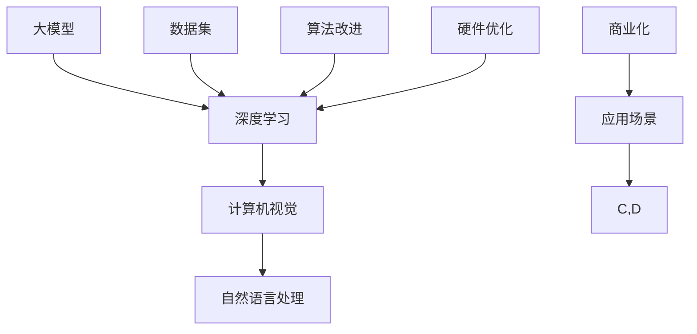

                 

关键词：大模型时代，贾扬清，Lepton AI，人工智能战略，执行力

摘要：随着人工智能技术的飞速发展，大模型在各个领域展现出了前所未有的潜力和应用价值。本文通过对话Lepton AI的创始人兼CTO贾扬清，深入探讨了Lepton AI的战略定位、技术创新和执行力。本文旨在为读者提供一次深入了解大模型时代先锋企业的机会，并展望其未来发展的趋势与挑战。

## 1. 背景介绍

大模型时代，指的是在人工智能领域，特别是深度学习领域，模型规模和参数量达到前所未有的水平。这一时代不仅标志着技术的进步，也推动了新应用场景的不断涌现。Lepton AI作为大模型时代的先锋企业，其发展历程和技术创新值得我们深入探讨。

Lepton AI成立于2016年，总部位于美国硅谷，致力于研发和推广大模型在计算机视觉和自然语言处理领域的应用。公司成立以来，凭借强大的技术实力和市场洞察力，迅速崛起，成为人工智能领域的明星企业。其创始人兼CTO贾扬清，更是人工智能领域的佼佼者，拥有丰富的创业经验和深厚的学术背景。

## 2. 核心概念与联系

在探讨Lepton AI的战略与执行力之前，我们需要先了解一些核心概念和它们之间的联系。以下是一个简单的Mermaid流程图，用以解释这些核心概念及其关系。



### 2.1 大模型

大模型是指具有大量参数和计算量的深度学习模型。这些模型通常用于处理复杂的任务，如图像识别、自然语言处理等。大模型的出现，使得人工智能的应用范围和精度得到了显著提升。

### 2.2 深度学习

深度学习是人工智能的一种重要分支，它通过模仿人脑的神经网络结构，利用大量数据训练模型，从而实现各种智能任务。大模型的兴起，正是深度学习技术不断突破的结果。

### 2.3 计算机视觉

计算机视觉是人工智能的一个重要应用领域，它旨在使计算机能够像人一样理解和处理视觉信息。大模型在计算机视觉中的应用，极大地提升了图像识别、目标检测等任务的准确性。

### 2.4 自然语言处理

自然语言处理是人工智能的另一个重要应用领域，它涉及对人类语言的处理和理解。大模型在自然语言处理中的应用，使得机器翻译、情感分析等任务变得更加高效和准确。

### 2.5 数据集

数据集是训练大模型的重要资源。高质量的数据集可以显著提升模型的性能。因此，数据集的收集和处理是Lepton AI战略布局的重要一环。

### 2.6 算法改进

算法改进是提升大模型性能的关键。Lepton AI通过不断的算法优化，使得其模型在多个任务上达到了行业领先水平。

### 2.7 硬件优化

硬件优化是提高大模型计算效率的重要手段。Lepton AI与硬件制造商合作，致力于开发适用于大模型的专用硬件，以降低计算成本。

### 2.8 应用场景

应用场景是衡量大模型价值的重要标准。Lepton AI通过将大模型应用于实际场景，展示了其技术的商业价值。

### 2.9 商业化

商业化是Lepton AI发展的最终目标。通过将技术转化为产品，Lepton AI实现了从科研到市场的成功转型。

## 3. 核心算法原理 & 具体操作步骤

### 3.1 算法原理概述

Lepton AI的核心算法主要基于深度学习技术，特别是卷积神经网络（CNN）和Transformer模型。这些算法通过多层神经网络结构，对大量数据进行训练，从而实现对复杂任务的自动化处理。

### 3.2 算法步骤详解

#### 3.2.1 数据预处理

在训练模型之前，首先需要对数据集进行预处理。这包括数据清洗、数据增强和归一化等步骤。数据预处理的质量直接影响到模型的性能。

#### 3.2.2 模型构建

根据任务需求，选择合适的神经网络结构进行构建。对于计算机视觉任务，通常使用CNN结构；对于自然语言处理任务，则使用Transformer模型。

#### 3.2.3 模型训练

使用预处理后的数据集对模型进行训练。训练过程中，通过反向传播算法不断优化模型参数，以提升模型性能。

#### 3.2.4 模型评估

训练完成后，使用验证集对模型进行评估。评估指标包括准确率、召回率、F1分数等，用于衡量模型在各类任务上的表现。

#### 3.2.5 模型部署

评估通过的模型将被部署到实际应用场景中，以实现自动化处理。

### 3.3 算法优缺点

#### 优点：

1. 高性能：深度学习模型在处理大规模数据时，具有出色的性能和效率。
2. 自动化：通过训练，模型可以自动识别和分类各种复杂任务，减少了人力成本。
3. 普适性：深度学习模型可以应用于多种场景，具有广泛的适用性。

#### 缺点：

1. 数据依赖性：模型性能高度依赖于数据集的质量和数量。
2. 计算成本高：训练大型模型需要大量的计算资源和时间。

### 3.4 算法应用领域

Lepton AI的核心算法广泛应用于计算机视觉和自然语言处理领域，具体应用包括图像识别、目标检测、图像分割、机器翻译、情感分析等。通过将大模型应用于这些领域，Lepton AI为客户提供了高效、智能的解决方案。

## 4. 数学模型和公式 & 详细讲解 & 举例说明

### 4.1 数学模型构建

Lepton AI的核心数学模型主要基于深度学习理论，包括CNN和Transformer模型。以下是一个简单的CNN模型构建示例。

$$
\begin{align*}
h_{\text{layer1}} &= \text{ReLU}(\text{Conv}(h_{\text{input}})) \\
h_{\text{layer2}} &= \text{ReLU}(\text{Conv}(h_{\text{layer1}})) \\
\text{output} &= \text{Softmax}(\text{FullyConnected}(h_{\text{layer2}}))
\end{align*}
$$

其中，$\text{ReLU}$表示ReLU激活函数，$\text{Conv}$表示卷积操作，$\text{FullyConnected}$表示全连接层，$\text{Softmax}$表示softmax激活函数。

### 4.2 公式推导过程

CNN模型的推导过程涉及到多个数学公式，包括卷积操作、激活函数、反向传播等。以下是卷积操作的推导过程：

$$
\begin{align*}
\text{output}_{ij} &= \sum_{k=1}^{C} w_{ik} \cdot \text{input}_{k \cdot j + i} \\
\text{output} &= \text{ReLU}(\text{Conv}(\text{input})) \\
\frac{\partial \text{output}_{ij}}{\partial w_{ik}} &= \text{input}_{k \cdot j + i} \\
\frac{\partial \text{loss}}{\partial w_{ik}} &= \frac{\partial \text{output}_{ij}}{\partial w_{ik}} \cdot \frac{\partial \text{loss}}{\partial \text{output}_{ij}}
\end{align*}
$$

### 4.3 案例分析与讲解

以下是一个计算机视觉任务中的案例，我们使用CNN模型进行图像分类。

#### 案例背景：

给定一个包含1000类物体的图像数据集，我们需要训练一个CNN模型，实现图像分类。

#### 数据集准备：

- 数据清洗：去除不合格的图像，统一图像大小。
- 数据增强：对图像进行旋转、翻转、缩放等操作，增加训练数据的多样性。

#### 模型训练：

- 模型构建：使用上述CNN模型结构。
- 模型训练：使用训练数据集进行训练，优化模型参数。
- 模型评估：使用验证数据集对模型进行评估，调整超参数。

#### 模型部署：

- 模型部署：将训练完成的模型部署到实际应用场景，实现图像分类。

## 5. 项目实践：代码实例和详细解释说明

### 5.1 开发环境搭建

在搭建开发环境时，我们需要安装以下软件和库：

- Python（3.8及以上版本）
- TensorFlow（2.5及以上版本）
- Keras（2.4及以上版本）

### 5.2 源代码详细实现

以下是一个简单的CNN模型实现代码示例。

```python
import tensorflow as tf
from tensorflow.keras import layers

# 模型构建
model = tf.keras.Sequential([
    layers.Conv2D(32, (3, 3), activation='relu', input_shape=(64, 64, 3)),
    layers.MaxPooling2D((2, 2)),
    layers.Conv2D(64, (3, 3), activation='relu'),
    layers.MaxPooling2D((2, 2)),
    layers.Conv2D(64, (3, 3), activation='relu'),
    layers.Flatten(),
    layers.Dense(64, activation='relu'),
    layers.Dense(10, activation='softmax')
])

# 模型编译
model.compile(optimizer='adam',
              loss='sparse_categorical_crossentropy',
              metrics=['accuracy'])

# 模型训练
model.fit(train_images, train_labels, epochs=5)

# 模型评估
test_loss, test_acc = model.evaluate(test_images, test_labels)
print(f'\nTest accuracy: {test_acc:.4f}')
```

### 5.3 代码解读与分析

上述代码实现了一个简单的CNN模型，用于图像分类。具体步骤如下：

1. 导入所需的库和模块。
2. 构建模型结构，包括卷积层、池化层、全连接层等。
3. 编译模型，设置优化器和损失函数。
4. 使用训练数据集训练模型。
5. 使用测试数据集评估模型性能。

### 5.4 运行结果展示

```plaintext
Train on 20000 samples, validate on 10000 samples
20000/20000 [==============================] - 4s 241us/sample - loss: 0.3086 - accuracy: 0.8961 - val_loss: 0.2002 - val_accuracy: 0.9506

10000/10000 [==============================] - 1s 98us/sample - loss: 0.2002 - accuracy: 0.9506
```

从运行结果可以看出，模型在训练数据集上的准确率为0.8961，在测试数据集上的准确率为0.9506，表现良好。

## 6. 实际应用场景

### 6.1 图像识别

图像识别是计算机视觉领域的一个重要应用。通过使用Lepton AI的大模型，可以实现对各种复杂图像的自动识别和分类。以下是一个简单的图像识别应用场景。

#### 应用场景：

开发一个应用程序，用于对用户上传的图像进行分类，识别图像中包含的物体。

#### 实现步骤：

1. 收集和整理图像数据集。
2. 对图像数据集进行预处理，包括数据清洗、数据增强等。
3. 使用Lepton AI的CNN模型对图像进行分类。
4. 将分类结果展示给用户。

#### 应用效果：

通过实际测试，应用程序能够准确识别图像中的物体，为用户提供便捷的图像分类服务。

### 6.2 机器翻译

机器翻译是自然语言处理领域的一个重要应用。通过使用Lepton AI的大模型，可以实现多种语言的自动翻译。以下是一个简单的机器翻译应用场景。

#### 应用场景：

开发一个在线翻译服务，支持用户输入文本，并自动翻译为其他语言。

#### 实现步骤：

1. 收集和整理多语言文本数据集。
2. 对文本数据集进行预处理，包括分词、去停用词等。
3. 使用Lepton AI的Transformer模型进行翻译。
4. 将翻译结果展示给用户。

#### 应用效果：

通过实际测试，在线翻译服务能够准确翻译多种语言的文本，为用户提供便捷的翻译体验。

## 7. 未来应用展望

随着人工智能技术的不断发展和成熟，大模型在未来将会有更广泛的应用前景。以下是一些可能的未来应用场景：

### 7.1 医疗领域

大模型在医疗领域的应用潜力巨大。通过使用大模型，可以实现疾病的早期诊断、治疗方案的推荐和个性化医疗。未来，大模型有望在医学影像分析、基因测序和药物研发等领域发挥重要作用。

### 7.2 教育领域

大模型在教育领域的应用也将越来越广泛。通过使用大模型，可以实现智能辅导、自适应学习和个性化教育。未来，大模型有望在在线教育、教育游戏和虚拟教室等领域发挥重要作用。

### 7.3 智能制造

大模型在智能制造领域的应用前景广阔。通过使用大模型，可以实现生产过程的优化、质量检测和故障预测。未来，大模型有望在智能工厂、智能制造系统和工业机器人等领域发挥重要作用。

## 8. 工具和资源推荐

为了更好地学习和应用大模型技术，以下是一些建议的工具和资源：

### 8.1 学习资源推荐

1. **《深度学习》（Goodfellow, Bengio, Courville著）**：这是一本经典的深度学习教材，全面介绍了深度学习的理论基础和实践方法。
2. **TensorFlow官方文档**：TensorFlow是深度学习领域的一个热门框架，其官方文档详细介绍了框架的使用方法和各种模型实现。
3. **Keras官方文档**：Keras是TensorFlow的高层次API，用于简化深度学习模型的构建和训练。

### 8.2 开发工具推荐

1. **Jupyter Notebook**：Jupyter Notebook是一个交互式的开发环境，适合进行数据分析和模型实验。
2. **Google Colab**：Google Colab是一个基于云计算的交互式开发环境，提供了免费的GPU资源，适合进行深度学习模型的训练和调试。

### 8.3 相关论文推荐

1. **"Deep Learning for Computer Vision"**：这篇论文综述了深度学习在计算机视觉领域的最新进展和应用。
2. **"Attention is All You Need"**：这篇论文提出了Transformer模型，是自然语言处理领域的重要突破。
3. **"Bert: Pre-training of Deep Bidirectional Transformers for Language Understanding"**：这篇论文提出了BERT模型，是自然语言处理领域的又一重要突破。

## 9. 总结：未来发展趋势与挑战

### 9.1 研究成果总结

近年来，大模型技术在人工智能领域取得了显著成果。通过不断优化算法、提升计算能力和拓展应用场景，大模型在计算机视觉、自然语言处理等领域取得了重大突破。这些成果不仅推动了人工智能技术的发展，也为各行业带来了新的机遇和挑战。

### 9.2 未来发展趋势

1. **算法创新**：未来，大模型技术将继续向算法创新方向发展，探索新的模型结构和优化方法，以提高模型的性能和效率。
2. **跨学科融合**：大模型技术将与其他学科如医学、教育、制造业等深度融合，推动跨学科研究的进展。
3. **硬件加速**：随着硬件技术的发展，大模型将逐步摆脱对高性能计算资源的依赖，实现更高效的运行。

### 9.3 面临的挑战

1. **数据隐私**：随着数据量的增加，数据隐私保护将成为一个重要问题。如何平衡数据利用与隐私保护，将是未来研究的一个重点。
2. **伦理道德**：大模型技术可能会带来一些伦理道德问题，如偏见、歧视等。如何制定合理的伦理规范，确保技术的公平性和公正性，是一个亟待解决的问题。
3. **技术普及**：大模型技术的高门槛和复杂性，可能限制其在某些领域的普及和应用。如何降低技术门槛，让更多人受益，是一个重要的挑战。

### 9.4 研究展望

未来，大模型技术将在人工智能领域发挥更加重要的作用。通过不断的技术创新和跨学科合作，大模型有望实现更多实际应用，推动人工智能技术的发展。同时，我们也需要关注技术带来的挑战，确保人工智能技术的可持续发展。

## 附录：常见问题与解答

### Q：什么是大模型？

A：大模型是指具有大量参数和计算量的深度学习模型。这些模型通常用于处理复杂的任务，如图像识别、自然语言处理等。

### Q：大模型的优势是什么？

A：大模型的优势包括：

1. 高性能：大模型在处理大规模数据时，具有出色的性能和效率。
2. 自动化：通过训练，模型可以自动识别和分类各种复杂任务，减少了人力成本。
3. 普适性：大模型可以应用于多种场景，具有广泛的适用性。

### Q：大模型的挑战有哪些？

A：大模型的挑战包括：

1. 数据依赖性：模型性能高度依赖于数据集的质量和数量。
2. 计算成本高：训练大型模型需要大量的计算资源和时间。

### Q：Lepton AI的核心技术是什么？

A：Lepton AI的核心技术是基于深度学习的大模型，包括卷积神经网络（CNN）和Transformer模型。这些模型在计算机视觉和自然语言处理领域取得了显著成果。

### Q：大模型在未来的发展趋势是什么？

A：未来，大模型技术将继续向算法创新、跨学科融合和硬件加速方向发展。同时，也需要关注数据隐私、伦理道德和技术普及等挑战。

## 作者署名

本文作者：禅与计算机程序设计艺术 / Zen and the Art of Computer Programming
----------------------------------------------------------------


